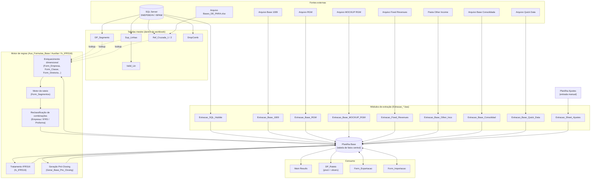

# 1. Capa

**Título:** Documentação Técnica e Funcional do Quick Data 3.23
**Sistema:** Quick Data 3.23
**Versão analisada:** 3.23 (conforme nome do arquivo `Quick Data 3.23.xlsb`; a checagem de versão interna do sistema, sub `Verifica_Versao` em `Auxiliar.bas`, compara contra a string local `"3.0"` no código — **[VALIDAR COM O NEGÓCIO]**: há uma divergência não explicada entre o número do arquivo (3.23) e o número usado no gate de versão do VBA (3.0); pode ser um controle de versão desatualizado/não mantido, ou os dois números terem significados diferentes)
**Data da análise:** 2026-08-14
**Responsável pelo preenchimento:** [PREENCHER]
**Status do documento:** Rascunho técnico — gerado por engenharia reversa assistida; pendente de revisão por alguém com acesso ao Excel/VBE (ver seção 4, "Limitações da análise", e seção 23, "Dúvidas e Pontos Pendentes")

---

# 2. Controle de Versões

| Versão do documento | Data | Autor | Descrição da alteração | Revisor |
|---|---|---|---|---|
| 0.1 | 2026-08-14 | Claude (assistente, via engenharia reversa automatizada) | Primeira versão funcional, alto nível (documento descontinuado — ver seção "Objetivo e Escopo") | [PREENCHER] |
| 1.0 | 2026-08-14 | Claude (assistente, via engenharia reversa automatizada) | Reescrita completa seguindo especificação de documentação técnica formal de 24 seções: catálogo de procedimentos, regras de negócio numeradas (RN-xxx), matriz de dependências e de rastreabilidade, cenários de teste | [PREENCHER] |

---

# 3. Sumário

> Estrutura de títulos pronta para gerar sumário automático no Word (Referências → Sumário → estilos de título aplicados nos números abaixo).

1. Capa
2. Controle de Versões
3. Sumário
4. Objetivo e Escopo
5. Visão Geral do Quick Data 3.23
6. Arquitetura da Solução
7. Inventário de Abas
8. Mapa "O Que Alimenta o Quê"
9. Inventário do Projeto VBA
10. Catálogo de Procedimentos VBA
11. Fluxos Funcionais e Operacionais
12. Catálogo de Regras de Negócio
13. Arquivos de Entrada
14. Arquivos e Dados de Saída
15. Fórmulas, Nomes Definidos e Conexões
16. Tratamento de Erros e Logs
17. Configurações e Dependências Técnicas
18. Riscos para Manutenção
19. Guia de Manutenção
20. Matriz de Rastreabilidade
21. Cenários de Teste
22. Glossário
23. Dúvidas e Pontos Pendentes
24. Anexos
25. Declaração de Cobertura

# 4. Objetivo e Escopo

## 4.1 Finalidade do documento

Documentar o funcionamento técnico e funcional completo do arquivo `Quick Data 3.23.xlsb` para permitir que desenvolvedores e a equipe de sustentação: entendam o sistema sem depender do conhecimento informal de quem o construiu; façam correções e manutenção com segurança; implementem novas funcionalidades sem quebrar dependências ocultas; investiguem erros, lentidão e corrupção do arquivo com uma referência técnica confiável; e, futuramente, usem este documento como base de conhecimento para a reescrita do sistema como aplicação standalone (ver `02_melhorias_e_recomendacoes.md` para a avaliação de melhorias — este documento não trata de modernização, apenas do estado atual).

## 4.2 Público-alvo

Desenvolvedores e analistas de sustentação com conhecimento técnico de Excel/VBA e de conceitos de ETL/modelagem de dados. Também serve de insumo técnico para quem for reconstruir o sistema em outra tecnologia.

## 4.3 Metodologia e componentes efetivamente analisados

Esta análise **não foi feita com o arquivo aberto interativamente no Excel/VBE**. Foi feita por engenharia reversa do pacote do arquivo `.xlsb` (que é um contêiner ZIP/OOXML binário) e do projeto VBA nele embutido, usando ferramentas de parsing programático:

- **Estrutura do workbook e conteúdo de células:** extraído via `pyxlsb` (leitor de células BIFF12) — permitiu ler nomes de abas, ordem das abas, e valores/fórmulas de células específicas.
- **Código VBA (módulos padrão, módulos de classe, código de planilha, código de `ThisWorkbook`, código-behind de UserForms):** extraído via `oletools`/`olevba`, que decompila o projeto VBA diretamente do stream OLE `vbaProject.bin`. **Evidência de que o projeto está protegido por senha:** o stream `PROJECT` do `vbaProject.bin` contém os campos `CMG=`, `DPB=` e `GC=`, que o formato VBA usa para armazenar o hash de senha e o estado de bloqueio do projeto. Isso normalmente impede a abertura do editor VBA (VBE) sem a senha — mas **não impede a extração do código-fonte por ferramentas de parsing direto do arquivo**, que foi o método usado aqui. Ou seja: o código-fonte deste documento é fiel ao que está gravado no arquivo, mas não foi possível confirmar interativamente nenhum comportamento em tempo de execução (breakpoints, valores de variável durante a execução, etc.).
- **Nomes definidos:** extraídos de uma planilha de auditoria que o próprio sistema mantém (`ListDefinedNames`), que lista todos os 166 nomes definidos do arquivo com uma classificação própria de "erro"/"apagar".
- **Botões e shapes das telas principais:** extraídos dos arquivos `drawing*.xml` internos ao pacote (texto dos rótulos e nomes dos shapes).
- **Referências de bibliotecas do projeto VBA:** extraídas via decompressão do stream `VBA/dir` (algoritmo MS-OVBA) do `vbaProject.bin`.

## 4.4 Componentes NÃO acessíveis por este método (limitação declarada)

Os itens abaixo **não puderam ser inspecionados** com as ferramentas usadas nesta análise e estão marcados como **[NÃO ACESSÍVEL]** onde relevante ao longo do documento:

- **Proteção de planilha e de workbook** (se há senha em alguma aba/estrutura do workbook) — essa informação fica em registros BIFF12 que os leitores usados não decodificam.
- **Definição visual binária dos controles dos UserForms** (arquivo `.frx` — posição X/Y, largura, altura, propriedades visuais exatas de cada controle). Os controles foram inferidos pelo nome das variáveis e pelo uso no código (ex.: `.AddItem`, `.Selected` só existem em ListBox), com alta confiança, mas **não é uma leitura direta da definição do formulário**.
- **Conteúdo binário de tabelas dinâmicas** (`pivotCacheDefinition1.bin`, `pivotTable1.bin`, `pivotTable2.bin`) — confirma-se que existem 2 tabelas dinâmicas (associadas à aba `DP_Rateio`), mas os campos internos não foram decodificados; os nomes dos filtros/segmentações (slicers) associados foram obtidos indiretamente pelos nomes dos shapes (`EMPRESA`, `ABERTURA_1`, `LINHA_BD`, `ABERTURA_2`, `IFRS_CONTABIL`).
- **Conteúdo dos links externos** (`externalLink1.bin`, `externalLink2.bin`, `externalLink3.bin`) e do arquivo `connections.bin` — confirma-se a existência de 3 links externos e de definições de conexão a nível de workbook, mas o conteúdo binário não foi decodificado. As conexões a banco de dados usadas pelo VBA (SQL Server) foram documentadas a partir do código-fonte de `Conexoes.bas`, que é uma fonte mais confiável para esse propósito.
- **Formatação condicional** — não foi extraída de forma sistemática; apenas o que apareceu incidentalmente no código VBA (ex.: coloração de células por `Selection.Interior` em `UPDATE_aplicar_CDC_por_Referencia`) foi documentado.
- **Comportamento em tempo de execução** — nenhuma macro, consulta ou conexão externa foi executada durante esta análise (por definição do escopo: análise estática apenas). Qualquer afirmação sobre "o que acontece quando..." é uma inferência da leitura do código, não uma observação de execução real.

## 4.5 Limitações adicionais da análise

- O código-fonte VBA foi decompilado a partir do binário; comentários e nomes de variáveis são fiéis ao original, mas a formatação de indentação/espaçamento pode diferir do editor original.
- A correspondência entre o **CodeName** de uma planilha (usado pelo VBA, ex. `Sheet3`) e seu **nome de exibição** (aba visível, ex. "Base") **não pôde ser obtida de forma mecânica e completa** — essa informação fica em um registro BIFF12 (`BrtWsProp`) dentro de cada `sheetN.bin`, não exposto pelas bibliotecas usadas. Os mapeamentos apresentados na seção 7 foram reconstruídos por **evidência indireta** (o próprio código, em comentários e nomes de variáveis, referenciando o nome da aba logo perto de uma atribuição do tipo `Set Sh_X = SheetN`) e têm nível de confiança declarado por linha. Os mapeamentos não confirmados estão marcados **[NÃO IDENTIFICADO]**. **Um desenvolvedor com o arquivo aberto no VBE pode confirmar todos eles em poucos minutos** olhando a janela "Project Explorer" (cada planilha aparece como `SheetN (NomeDaAba)`) — ver seção 23.
- Esta é uma análise estática de código e estrutura. Regras de negócio documentadas como "confirmadas" são confirmadas **no código**, não necessariamente validadas contra o comportamento esperado pelo negócio hoje — itens como o status real do módulo `BackupCodigo_MainResults` (parece desativado, mas isso não pode ser confirmado sem alguém do time de negócio) permanecem como **[VALIDAR COM O NEGÓCIO]**.
- Este documento **não está completo por definição** enquanto os itens da seção 4.4 permanecerem [NÃO ACESSÍVEL] e os itens da seção 23 não forem esclarecidos — ele documenta o que foi possível confirmar com as ferramentas disponíveis nesta rodada.

# 5. Visão Geral do Quick Data 3.23

## 5.1 Objetivo aparente da solução

**[INFERIDO — evidência: nomes de abas, macros e estrutura de dados]** O Quick Data 3.23 é uma ferramenta de consolidação e reporting financeiro/gerencial. Ela reúne dados contábeis vindos de múltiplas fontes internas e externas (um data warehouse corporativo chamado "Hubble" via SQL Server, e uma série de relatórios em Excel produzidos por outros sistemas/times), os traduz para uma estrutura gerencial comum (Diretoria, Segmento, Abertura contábil, Classe de Custo), aplica regras contábeis específicas (rateio de custos indiretos entre empresas, tratamento de leasing sob IFRS16, geração de uma versão de fechamento antecipado) e disponibiliza o resultado consolidado para relatórios internos (planilha "Main Results" e um painel com tabelas dinâmicas, "DP_Rateio").

## 5.2 Entradas

**[CONFIRMADO — evidência: `Aux_Leitura_Nome_Arqs.bas`, módulos `Extracao_*`]**

| Entrada | Mecanismo |
|---|---|
| Base Hubble | Consulta SQL Server automatizada (sem seleção manual de arquivo) |
| Base 1009 | Arquivo `.xlsx` externo, selecionado manualmente pelo usuário |
| Base RGM | Arquivo externo, seleção manual |
| Base MOCKUP RGM | Arquivo externo, seleção manual |
| Base Fixed Revenues | Arquivo externo, seleção manual |
| Base Other Income | Pasta com múltiplos arquivos, seleção manual da pasta |
| Base Consolidada | Arquivo externo, seleção manual |
| Base Quick Data (sistema-a-sistema) | Arquivo externo já no layout de destino, seleção manual |
| Ajustes manuais | Digitação direta na planilha "Ajustes" pelo usuário |
| Tabelas mestre de mapeamento (Sup_Linhas, DP_Segmento, Ref_Cruzada, DropComb) | SQL Server + um arquivo externo `Bases_DE_PARA.xlsx` |

## 5.3 Processamentos

**[CONFIRMADO/INFERIDO — evidência: módulos `Aux_Formulas_Base.bas`, `Auxiliar.bas`, `fx_IFRS16.bas`, `Gerar_Base_Pre_Closing.bas`]** Após a extração, cada linha bruta passa por: (1) resolução de dimensões gerenciais via cascatas de lookup contra as tabelas mestre; (2) desdobramento de rateio de custos indiretos entre empresas/segmentos; (3) reclassificação contábil condicional (combinações Empresa/IFRS/Proforma, marcadas como "S"/"N" via fórmula gerada dinamicamente); (4) tratamento específico de IFRS16 (reclassificação de custo de leasing com inversão de sinal), condicionado a uma flag configurável; (5), sob demanda, geração de uma versão sintética "Pré-Closing" recombinando dados já existentes na base.

## 5.4 Saídas

**[CONFIRMADO]** A saída primária é a própria planilha "Base" consolidada (usada por relatórios internos ao workbook: "Main Results", "DP_Rateio"). O sistema também permite **exportar** a Base filtrada ou abas de relatório inteiras ("Fronts") para novos arquivos `.xlsb`, e **importar** Fronts de arquivos externos para dentro do workbook atual (via `Form_Exportacao`/`Form_Importacao`).

## 5.5 Usuários ou perfis envolvidos

**[VALIDAR COM O NEGÓCIO]** Não há, no código analisado, nenhum mecanismo de login, permissão por usuário, ou distinção de papéis (não há tabela de usuários nem checagem de identidade além de `Environ("Username")` usado só para nomear uma tabela SQL temporária e para registrar quem gerou um erro no log `tk_Lista_de_erros`). É razoável inferir, pela natureza da ferramenta (planejamento & controle financeiro), que existam ao menos dois perfis de uso — quem extrai/consolida dados e quem consome os relatórios — mas o arquivo não impõe essa distinção tecnicamente. Isso precisa ser confirmado com o negócio.

## 5.6 Fluxo operacional principal

**[INFERIDO — evidência: nomes e ordem de dependência dos botões da aba "Extração", ver seção 6]**

1. Usuário abre o arquivo e navega até a aba de controle ("Extração").
2. Atualiza as tabelas mestre de mapeamento ("Atualizar bases auxiliares").
3. Aponta manualmente (via diálogo de arquivo) o caminho de cada fonte externa que for usar no mês.
4. Extrai cada fonte (botões individuais) ou todas de uma vez ("Extrair todas as bases").
5. Insere ajustes manuais na planilha "Ajustes", se necessário.
6. Opcionalmente gera a versão "Pré-Closing".
7. Consulta os relatórios ("Main Results", "DP_Rateio") ou exporta os dados/relatórios para outro arquivo.

# 6. Arquitetura da Solução

## 6.1 Componentes principais

**[CONFIRMADO]**

| Componente | Papel |
|---|---|
| Workbook Excel (`.xlsb`) | Contêiner único de tudo: dados, fórmulas, código, configuração |
| 28 planilhas | Interface (Extração/Ajustes/Main Results), dados (Base), tabelas mestre de mapeamento, staging, auditoria interna |
| Projeto VBA (70 módulos, 192 procedimentos) | Toda a lógica de extração, transformação e regra de negócio |
| 3 UserForms | Importação, Exportação e uma tela de consulta de configuração (Form_Tratamento_Opcoes) |
| SQL Server (`SNEPDB24V`, bancos `BPAM`/`InfoGER`) | Fonte de dados "Hubble" e das tabelas mestre de mapeamento |
| Arquivos Excel externos (rede) | 7 fontes de dados manuais + 1 arquivo de De-Para (`Bases_DE_PARA.xlsx`) |
| Bibliotecas de referência do projeto VBA | Microsoft ActiveX Data Objects 2.8 (acesso a SQL Server), Microsoft Forms 2.0 (UserForms) — ver seção 17 |

## 6.2 Relação entre Excel, VBA, arquivos externos e demais recursos

**[CONFIRMADO/INFERIDO]** O Excel é simultaneamente a interface, o motor de processamento (via VBA) e o banco de dados (a planilha "Base" funciona como uma tabela de fatos armazenada em células). Não existe camada de aplicação, API ou banco de dados dedicado fora do próprio arquivo — a única infraestrutura externa real é o SQL Server acessado via ADODB, e os arquivos Excel de rede lidos via `Workbooks.Open`. Todo processamento acontece na máquina do usuário, dentro do processo do Excel.

## 6.3 Fluxo textual de alto nível

1. **Configuração** — usuário aponta caminhos de arquivos-fonte na aba "Extração" (gravados em células de configuração, lidos por cada macro de extração).
2. **Atualização de tabelas mestre** — pipeline fixo `Refresh_Base_Aux`: `Refresh_Base_Segmento → Refresh_Base_De_Para_Ref_Cruzadas → Refresh_Base_Suporte_Linhas → Refresh_Drop_Comb_Hubble → Extrair_Valid_Lin` (evidência: chamadas sequenciais dentro de `Refresh_Base_Aux`, em `Auxiliar.bas`).
3. **Extração** — cada fonte roda seu próprio módulo (`Extracao_*`), todas gravando na mesma planilha "Base", com o padrão comum: limpar histórico da fonte → ler/abrir arquivo ou SQL → copiar dados brutos → aplicar enriquecimento (`Form_*` de `Aux_Formulas_Base.bas`) → aplicar reclassificações de combinação.
4. **Regras contábeis condicionais** — IFRS16 (se habilitado) e geração de Pré-Closing (sob demanda) processam a Base já consolidada.
5. **Consumo** — relatórios internos ao workbook leem a Base (diretamente ou via tabela dinâmica) ou o usuário exporta/importa Fronts inteiros entre arquivos.

## 6.4 Diagrama (Mermaid)

> Se o Mermaid não for suportado no destino final (ex.: colar direto no Word), a estrutura acima pode ser transformada em um diagrama de blocos manualmente: 3 colunas (Fontes externas → Extração/Base/Motor de regras → Consumo), com o SQL Server e o arquivo de De-Para alimentando as tabelas mestre à parte, que por sua vez alimentam o motor de regras por lookup (não por cópia direta).

# 7. Inventário de Abas

**Nota metodológica (ver seção 4.5):** a correspondência entre o nome de exibição da aba (coluna "Nome da aba", 100% confirmado via leitura direta do workbook) e o CodeName VBA (coluna "CodeName") não pôde ser extraída mecanicamente de forma completa — foi reconstruída por evidência indireta encontrada no código-fonte pelos analistas. Cada célula da coluna CodeName traz o nível de confiança entre colchetes. "Visibilidade" e "Proteção identificada" estão marcadas [NÃO ACESSÍVEL] em toda a tabela — essas informações ficam em registros binários (BIFF12) que as ferramentas usadas nesta análise não decodificam; podem ser conferidas em segundos por alguém com o arquivo aberto no Excel (clique direito na aba / Revisão → Proteger Planilha).

| Nome da aba | CodeName | Visibilidade | Finalidade | Tipo de informação | Origem dos dados | Quem alimenta | Destino dos dados | Macros relacionadas | Dependências | Proteção | Riscos e observações |
|---|---|---|---|---|---|---|---|---|---|---|---|
| FRONT >> | [NÃO IDENTIFICADO] | [NÃO ACESSÍVEL] | Separador organizacional de grupo de abas (sem conteúdo de célula identificado) | N/A | N/A | N/A | N/A | Nenhuma | Nenhuma identificada | [NÃO ACESSÍVEL] | Nome sugere ser apenas um marcador visual na barra de abas |
| Main Results | [NÃO IDENTIFICADO] | [NÃO ACESSÍVEL] | Relatório gerencial consolidado — visão principal de resultados | Relatório/saída | Planilha "Base" | Fórmulas/leitura da Base | Consumo pelo usuário final | `BackupCodigo_MainResults.bas` (validação de dropdowns em cascata — **status de ativação incerto**, ver RN correspondente) | Depende da Base estar consolidada e enriquecida | [NÃO ACESSÍVEL] | Se `BackupCodigo_MainResults` estiver de fato inativo, combinações de abertura inválidas podem ser digitadas sem bloqueio — **[VALIDAR COM O NEGÓCIO]** |
| Control Panel >> | [NÃO IDENTIFICADO] | [NÃO ACESSÍVEL] | Separador organizacional de grupo de abas | N/A | N/A | N/A | N/A | Nenhuma | Nenhuma identificada | [NÃO ACESSÍVEL] | — |
| Extracao | Sheet8 [confirmado] | [NÃO ACESSÍVEL] | Painel de controle central: configuração de fontes de dados e todos os botões de extração/importação/exportação | Configuração + interface | Preenchida manualmente pelo usuário (caminhos de arquivo) e por `Aux_Leitura_Nome_Arqs.bas` | Usuário + diálogos de arquivo | Lida por todos os módulos `Extracao_*.bas` | Praticamente todos os módulos `Extracao_*`, `Auxiliar.bas` (`Extrair_Todas_as_Bases`) | Célula `I25` controla a flag de tratamento IFRS16; layout de células fixo (`Cells.Find` usado como âncora em vários módulos) | [NÃO ACESSÍVEL] | Acoplamento pesado a posições/textos fixos — reformatação desta aba quebra várias macros silenciosamente |
| Ajustes | Sheet13 [confirmado] | [NÃO ACESSÍVEL] | Lançamentos manuais de correção feitos pelos analistas | Entrada manual | Digitação do usuário | Usuário | Extraída para a Base por `Extracao_Sheet_Ajustes.bas`, fórmulas reconstruídas por `Limpeza_Base_Ajustes.bas` | `Extracao_Sheet_Ajustes.bas`, `Limpeza_Base_Ajustes.bas`, `Lista_Validacao_Ajustes.bas` | Fórmulas de destino dependem de Sup_Linhas/Ref_Cruzada/DP_Segmento estarem atualizadas | [NÃO ACESSÍVEL] | Sem validação de tipo/formato do valor digitado além de tratar célula vazia como "0" |
| Support >> | [NÃO IDENTIFICADO] | [NÃO ACESSÍVEL] | Separador organizacional de grupo de abas | N/A | N/A | N/A | N/A | Nenhuma | Nenhuma identificada | [NÃO ACESSÍVEL] | — |
| Base | Sheet3 [confirmado] | [NÃO ACESSÍVEL] | Tabela de fatos central — todas as fontes convergem para cá | Dados consolidados | Todos os módulos `Extracao_*` | Todos os módulos de extração + motor de enriquecimento | Relatórios ("Main Results", "DP_Rateio"), exportação | Praticamente todo o projeto VBA lê ou escreve aqui | Cabeçalho localizado dinamicamente pela marca "LIN_BASE"; limites de linha hardcoded encontrados em alguns módulos (40.837, 100.000, 999.999) | [NÃO ACESSÍVEL] | Tabela mais crítica do sistema — qualquer regra quebrada aqui afeta todos os relatórios |
| Ref_Cruzada_1 | Sheet16 [inferido — evidência indireta, alta confiança] | [NÃO ACESSÍVEL] | Regras de redirecionamento excepcional de responsabilidade (Grupo BD, CC) | Tabela de configuração/De-Para | Arquivo externo `Bases_DE_PARA.xlsx` | `Refresh_De_X_Para.bas` | Lida por `Aux_Formulas_Base.bas`/`Limpeza_Base_Ajustes.bas` (cascata "Ref Cruzada") | `Refresh_Base_De_Para_Ref_Cruzadas` | Depende do arquivo externo de rede estar acessível | [NÃO ACESSÍVEL] | Cascata de prioridade entre Ref_Cruzada_1 e Ref_Cruzada_2 é regra de negócio implícita nas fórmulas, não documentada na própria aba |
| Ref_Cruzada_2 | Sheet17 [inferido — evidência indireta, alta confiança] | [NÃO ACESSÍVEL] | Regras de redirecionamento excepcional por CC+Diretoria | Tabela de configuração/De-Para | Arquivo externo `Bases_DE_PARA.xlsx` | `Refresh_De_X_Para.bas` | Lida por `Aux_Formulas_Base.bas`/`Limpeza_Base_Ajustes.bas` | `Refresh_Base_De_Para_Ref_Cruzadas` | Idem acima | [NÃO ACESSÍVEL] | Idem acima |
| Sup_Linhas | Sheet15 [confirmado] | [NÃO ACESSÍVEL] | Tabela mestre De-Para central: Centro de Custo → Classe, Diretoria N1-N3, Aberturas 2-8, Linha_BD; também contém o De-Para manual do IFRS16 | Tabela de configuração/De-Para | SQL Server (`BPAM`) via `Refresh_Sup_Linhas.bas`; colunas do De-Para IFRS16 mantidas manualmente (**não alimentadas por nenhuma macro identificada**) | `Refresh_Base_Suporte_Linhas` (a maior parte); usuário de negócio não identificado (parte IFRS16) | Lida por praticamente todo o motor de enriquecimento e por `fx_IFRS16.bas` | `Refresh_Sup_Linhas.bas`, `Aux_Formulas_Base.bas`, `fx_IFRS16.bas` | Posições de coluna fixas por número em `fx_IFRS16.bas` (colunas 71/73/15/22/`BX1`) | [NÃO ACESSÍVEL] | **Risco alto:** parte da tabela é mantida manualmente fora de qualquer automação — ver seção 18 |
| Aux_IFRS16 | Sheet28 [confirmado] | [NÃO ACESSÍVEL] (nome sugere ser área de staging, possivelmente oculta — **inferência, não confirmada**) | Área de staging para as linhas em tratamento IFRS16 | Staging temporário | `fx_IFRS16.bas` | `fx_IFRS16.bas` | Reintegrada na Base pelo próprio `fx_IFRS16.bas` | `fx_IFRS16.bas` | Depende do De-Para de Sup_Linhas estar correto | [NÃO ACESSÍVEL] | — |
| Valid_Lin | Sheet25 [inferido — alta confiança] | [NÃO ACESSÍVEL] | Combinações válidas de aberturas (exclui EBITDA) — base para validação de dropdowns dependentes | Tabela derivada | Gerada a partir de Sup_Linhas | `Extrair_Valid_Lin` (`Refresh_Sup_Linhas.bas`) | Lida por `BackupCodigo_MainResults.bas` (se ativo) | `Extrair_Valid_Lin` | Depende de Sup_Linhas atualizado | [NÃO ACESSÍVEL] | Sua utilidade real depende do status de `BackupCodigo_MainResults` — **[VALIDAR COM O NEGÓCIO]** |
| CC BD | Sheet11 [inferido — confiança média] | [NÃO ACESSÍVEL] | De-Para de Centro de Custo/Grupo BD | Tabela de configuração/De-Para | Arquivo externo `Bases_DE_PARA.xlsx` (aba "CC BD") | `Refresh_De_X_Para.bas` | Lida por `Aux_Formulas_Base.bas` (`Form_Grupo_BD`) | `Refresh_Base_De_Para_Ref_Cruzadas` | — | [NÃO ACESSÍVEL] | — |
| DropComb | Sheet9 [confirmado] | [NÃO ACESSÍVEL] | Fonte das listas de dropdowns e da matriz de combinações Empresa/IFRS/Proforma | Tabela de configuração | Arquivo externo (mesma família do De-Para) | `Refresh_Drop_Comb.bas` | Lida por `Auxiliar.bas` (reclassificações) e `TK_Functions.bas` (`UPDATE_Combinacoes_*`) | `Refresh_Drop_Comb_Hubble`, `Reclassificar_Combinacoes_*` | — | [NÃO ACESSÍVEL] | — |
| Visao_IT | Sheet23 [confirmado] | [NÃO ACESSÍVEL] | Regras da visão contábil alternativa "IFRS Itália" | Tabela de configuração/De-Para | [NÃO IDENTIFICADO] | [NÃO IDENTIFICADO] | Lida por `Gerar_Visao_Italia` (`Auxiliar.bas`) | `Gerar_Visao_Italia` | — | [NÃO ACESSÍVEL] | Regra de negócio de compliance contábil de uma entidade específica — pouco documentada no código |
| Aux | [NÃO IDENTIFICADO] | [NÃO ACESSÍVEL] | Tabelas auxiliares diversas (listas de meses, anos, KPIs) | Tabela de apoio | [NÃO IDENTIFICADO] | [NÃO IDENTIFICADO] | Referenciada por múltiplos nomes definidos (`CB_Meses`, `CB_Anos` etc. apontam para esta aba pelo nome de exibição "Aux") | Múltiplas | — | [NÃO ACESSÍVEL] | — |
| tk_Lista_de_erros | [NÃO IDENTIFICADO] | [NÃO ACESSÍVEL] | Log de erros em produção gravado automaticamente | Log/auditoria | `fn_ListAllErrors` (`TK_Functions.bas`) | `fn_ListAllErrors` | Consulta manual pela equipe de sustentação | `fn_ListAllErrors` | — | [NÃO ACESSÍVEL] | Já mostra ocorrências repetidas do mesmo erro (`0x2a`) em `Aux_Formulas_Base`/`TK_Functions` na aba Base — indício de problema recorrente não resolvido |
| Aux_Extracoes >> | [NÃO IDENTIFICADO] | [NÃO ACESSÍVEL] | Separador organizacional de grupo de abas | N/A | N/A | N/A | N/A | Nenhuma | — | [NÃO ACESSÍVEL] | — |
| RGM_1 | Sheet7 [inferido — alta confiança] | [NÃO ACESSÍVEL] | Chaves De-Para para extração da base RGM | Tabela de configuração/De-Para | Mantida internamente | [NÃO IDENTIFICADO] | Lida por `Extracao_Base_RGM.bas` | `Extracao_Base_RGM.bas` | Estrutura validada linha a linha contra o arquivo fonte (`MsgBox` crítico se divergir) | [NÃO ACESSÍVEL] | Validação estrutural frágil a pequenas mudanças de layout no arquivo fonte |
| RGM_2 | Sheet14 [inferido — alta confiança] | [NÃO ACESSÍVEL] | Segundo bloco de chaves De-Para para RGM | Tabela de configuração/De-Para | Mantida internamente | [NÃO IDENTIFICADO] | Lida por `Extracao_Base_RGM.bas` | `Extracao_Base_RGM.bas` | Idem acima | [NÃO ACESSÍVEL] | Idem acima |
| Fixed_1 | Sheet19 [confirmado] | [NÃO ACESSÍVEL] | Chaves De-Para para extração de Fixed Revenues | Tabela de configuração/De-Para | Mantida internamente | [NÃO IDENTIFICADO] | Lida por `Extracao_Fixed_Revenues.bas` | `Extracao_Fixed_Revenues.bas` | — | [NÃO ACESSÍVEL] | — |
| Fixed_2 | Sheet20 [confirmado] | [NÃO ACESSÍVEL] | Segundo bloco de chaves para Fixed Revenues | Tabela de configuração/De-Para | Mantida internamente | [NÃO IDENTIFICADO] | Lida por `Extracao_Fixed_Revenues.bas` | `Extracao_Fixed_Revenues.bas` | — | [NÃO ACESSÍVEL] | — |
| MockUP_RGM | Sheet22 [confirmado] | [NÃO ACESSÍVEL] | Chaves De-Para para a extração de simulação RGM | Tabela de configuração/De-Para | Mantida internamente | [NÃO IDENTIFICADO] | Lida por `Extracao_Base_MOCKUP_RGM.bas` | `Extracao_Base_MOCKUP_RGM.bas` | — | [NÃO ACESSÍVEL] | Validação estrutural com `End` abrupto em caso de divergência — ver riscos |
| DP_Segmento | Sheet21 [confirmado] | [NÃO ACESSÍVEL] | De-Para Classe+CC → Segmento/Abertura_1/Empresa/Diretoria | Tabela de configuração/De-Para | SQL Server (`BPAM`) | `Refresh_Base_Segmento` (`Refresh_DP_Segmento.bas`) | Lida por `Limpeza_Base_Ajustes.bas` (SEG_N2_DESTINO/A1_DESTINO) | `Refresh_Base_Segmento` | Primeira etapa do pipeline `Refresh_Base_Aux` | [NÃO ACESSÍVEL] | — |
| ListDefinedNames | Sheet29 [inferido — alta confiança] | [NÃO ACESSÍVEL] | Auditoria própria do arquivo: lista os 166 nomes definidos e sinaliza 42 como candidatos a exclusão | Auditoria/saneamento | `CLEAR_Defined_Names` (`TK_Functions.bas`) | Rotina de saneamento manual (botão "Limpar Defined Names com erro") | Uso interno de manutenção | `CLEAR_Defined_Names`, `RUN_Apagar_defined_names_definitivamente` | — | [NÃO ACESSÍVEL] | Confirma acúmulo histórico de nomes quebrados (links de rede de 1998-2014) — ver riscos |
| LISTA_ARQ_AUX | [NÃO IDENTIFICADO] | [NÃO ACESSÍVEL] | Documentação embutida: caminhos de rede e nomes de tabelas SQL das fontes externas | Documentação/configuração | Preenchimento manual | Usuário/administrador do arquivo | Lida indiretamente (os caminhos reais de configuração ficam em Sheet24, não necessariamente sincronizados com esta aba) | Nenhuma macro identificada usando esta aba diretamente | Esta aba parece ser só um registro textual de referência, não uma fonte ativa lida pelo código | [NÃO ACESSÍVEL] | **[VALIDAR COM O NEGÓCIO]**: confirmar se esta aba é só documentação ou se algum processo manual a usa como referência para preencher Sheet24 |
| Painel_DM | Sheet31 [inferido — confiança média] | [NÃO ACESSÍVEL] | Dashboard de validação de Centro de Custo/CDC | Relatório/validação | Alimentado por `Copiar_Base_Origem` (`Aux_Formulas_Base.bas`) e `set_formula_*` (`TK_Functions.bas`) | `Copiar_Base_Origem`, `set_formula_CC/CDC` | Consumo pelo usuário/sustentação | `Copiar_Base_Origem`, `set_formula_CC`, `set_formula_CDC`, `set_formula_CDC_Parte_2` | — | [NÃO ACESSÍVEL] | — |
| DP_Rateio | Sheet26 [inferido — confiança média; variável de código chamada "Sh_Rateio"] | [NÃO ACESSÍVEL] | Dashboard com tabelas dinâmicas e segmentações (Empresa, Abertura_1, Linha_BD, Abertura_2, IFRS_Contábil); também fonte de percentuais de rateio variável | Relatório + tabela de configuração | Base consolidada (para o dashboard); percentuais mantidos [NÃO IDENTIFICADO] (para o rateio) | [NÃO IDENTIFICADO] | Lida por `Form_Segmentos` (motor de rateio) e pelas 2 tabelas dinâmicas do workbook | `Form_Segmentos` (`Aux_Formulas_Base.bas`) | Contém 2 tabelas dinâmicas (`pivotTable1.bin`, `pivotTable2.bin` — conteúdo binário não decodificado) e os slicers `EMPRESA`, `ABERTURA_1`, `LINHA_BD`, `ABERTURA_2`, `IFRS_CONTABIL` (confirmado pelos nomes dos shapes em `drawing7.xml`) | [NÃO ACESSÍVEL] | Mapeamento Sheet26↔"DP_Rateio" não confirmado por evidência direta — **[VALIDAR COM O NEGÓCIO]** |

## 7.1 Sobre os módulos de código-behind vazios

30 dos 33 CodeNames de planilha (`Sheet1`, `Sheet2`, `Sheet4`–`Sheet7`, `Sheet9`, `Sheet10`, `Sheet12`, `Sheet14`, `Sheet18`–`Sheet22`, `Sheet24`–`Sheet27`, `Sheet29`, `Sheet30`, `Sheet31`, `Sheet33`) **não têm nenhum procedimento implementado** — são módulos vazios gerados automaticamente pelo Excel para toda planilha. Isso inclui alguns dos CodeNames que já foram identificados funcionalmente por lookup de dados na tabela acima (ex.: `Sheet9`=DropComb, `Sheet7`/`Sheet14`=RGM_1/2) — **o fato de não terem código-behind não significa que a aba não seja usada**, apenas que nenhuma planilha dispara eventos (`Worksheet_Change`, `Worksheet_Activate` etc.) diretamente nelas; toda a lógica que as usa vive em módulos `.bas` externos.

Há também **CodeNames "órfãos"** sem tab correspondente encontrado nas 28 abas atuais: os números vão até `Sheet33`, mas o workbook só tem 28 abas — isso é **evidência confirmada** de que ao menos 5 planilhas já existiram e foram excluídas ao longo da vida do arquivo (o Excel nunca reaproveita um número de CodeName). Não há como saber, só pelo código atual, quais planilhas eram essas ou por que foram removidas — **[NÃO IDENTIFICADO]**.

# 8. Mapa "O Que Alimenta o Quê"

> Consolidado dos 4 clusters de análise. Ver também o diagrama da seção 6.4 para uma visão de alto nível.

## 8.1 Cluster Extração / ETL
| # | Componente de origem | Tipo | Componente de destino | Tipo | Procedimento responsável | Momento/gatilho | Tipo de operação | Evidência | Nível de confiança |
|---|---|---|---|---|---|---|---|---|---|
| 1 | SQL Server `SNEPDB24V` / catálogo `BPAM` | Banco de dados | `conn` (objeto `ADODB.Connection`) | Objeto VBA em memória | `AbreConexao` | Início de qualquer operação SQL do Hubble | Conexão (leitura de credenciais + abertura) | `Conexoes.bas:21-27` | confirmado |
| 2 | `[BPAM].[dbo].[<tabela em Sheet24!D19>]` | Tabela SQL (origem Hubble) | `TB_AUX_HUBBLE_QUICK_DATA_<user>` | Tabela SQL temporária | `Extrair_Linha` | Uma vez por linha de config "Sim" na aba Extração | Leitura (`SELECT`) + escrita (`INSERT`) agregada | `Extracao_SQL_Hubble.bas:485-498` | confirmado |
| 3 | `TB_AUX_HUBBLE_QUICK_DATA_<user>` | Tabela SQL temporária | `Sheet3` (Base) | Planilha Excel | `Extrair_Base_Final` | Após o loop de extração Hubble | Leitura (`SELECT`) + escrita (`CopyFromRecordset`) | `Extracao_SQL_Hubble.bas:539-555` | confirmado |
| 4 | `[BPAM].[dbo].[TB_HUBBLE_DBS_CC]` | Tabela SQL (De-Para) | `TB_AUX_HUBBLE_QUICK_DATA_<user>` | Tabela SQL temporária | `Extrair_Linha` (via `LEFT JOIN` condicional) | Quando `Filtr_Col` contém `[DESCRICAO CC]` | Leitura | `Extracao_SQL_Hubble.bas:474-477` | confirmado |
| 5 | Arquivo externo "1009" (.xlsx, caminho configurado em `Sheet8`) | Arquivo Excel | `Sheet3` (Base) | Planilha Excel | `Processo_Extrair_Base_1009` | Execução manual (botão) | Leitura + escrita (importação) | `Extracao_Base_1009.bas:89-95` | confirmado |
| 6 | Arquivo externo "(RGM)" (.xlsx) | Arquivo Excel | `Sheet3` (Base) | Planilha Excel | `Processo_Extrair_Base_RGM` / `Processo_Extracao_Sheet_Base` | Execução manual | Leitura + escrita | `Extracao_Base_RGM.bas:88-89` | confirmado |
| 7 | Arquivo externo "MOCKUP" (.xlsx) | Arquivo Excel | `Sheet3` (Base) | Planilha Excel | `Processo_Extrair_Base_MOCKUP_RGM` | Execução manual | Leitura + escrita | `Extracao_Base_MOCKUP_RGM.bas:90-91` | confirmado |
| 8 | Arquivo externo "FIXED REVENUES" (.xlsx) | Arquivo Excel | `Sheet3` (Base) | Planilha Excel | `Processo_Extrair_Base_Fixed_Rev` | Execução manual | Leitura + escrita | `Extracao_Fixed_Revenues.bas:92-93` | confirmado |
| 9 | Pasta "Other income" (múltiplos .xlsx, um por operadora) | Pasta de arquivos | `Sheet3` (Base) | Planilha Excel | `Processo_Extrair_Base_Other_Income` | Execução manual, itera `Dir()` | Leitura + escrita (importação em lote) | `Extracao_Base_Other_Inco.bas:83-95` | confirmado |
| 10 | Arquivo externo "Base Consolidada" (.xlsx) | Arquivo Excel | `Sheet3` (Base) | Planilha Excel | `Processo_Extrair_Base_Consolidada` | Execução manual | Leitura + escrita | `Extracao_Base_Consolidad.bas:75-79` | confirmado |
| 11 | Arquivo externo "Quick Data" (.xlsx) | Arquivo Excel | `Sheet3` (Base) | Planilha Excel | `Processo_Extrair_Base_Quick_Data` | Execução manual | Leitura + escrita | `Extracao_Base_Quick_Data.bas:81-85` | confirmado |
| 12 | `Sheet13` (aba "Ajustes", 100% interna) | Planilha Excel | `Sheet3` (Base) | Planilha Excel | `Processo_Extrair_Base_Ajustes` | Execução manual | Leitura + escrita | `Extracao_Sheet_Ajustes.bas:50, 96-141` | confirmado |
| 13 | `Sheet3` (Base) | Planilha Excel | Pasta de trabalho temporária (`Workbooks.Add`) | Planilha Excel volátil (não persistida em disco) | `Gerar_Base_Versao_Pre_Closing` | Execução manual, botão próximo a `Preview!AI39` | Leitura + escrita (via `AutoFilter`+`Copy`) | `Gerar_Base_Pre_Closing.bas:88-90, 157-159` | confirmado |
| 14 | Pasta de trabalho temporária | Planilha Excel volátil | `Sheet3` (Base) | Planilha Excel | `Gerar_Base_Versao_Pre_Closing` | Fim do processo, após consolidar todos os cenários | Escrita (append) | `Gerar_Base_Pre_Closing.bas:298-301` | confirmado |
| 15 | `Sheet8` (Extração, células de caminho/arquivo) | Planilha Excel | `Sheet8` (mesmas células, valor gravado) | Planilha Excel | `GetArquivo` / `GetPasta` | Clique manual do usuário (botão de seleção de fonte) | Escrita (configuração) | `Aux_Leitura_Nome_Arqs.bas:87-91, 124-126` | confirmado |
| 16 | `Sheet9` (chaves De-Para Empresa/IFRS/Organic) | Planilha Excel | SQL dinâmico (string em memória) | N/A (texto) | `Processo_Extrair_Base_Hubble` | Montagem de filtro, por linha "Sim" | Leitura | `Extracao_SQL_Hubble.bas:100-148` | confirmado |
| 17 | `Sheet22` / `Sheet7` / `Sheet14` / `Sheet19` / `Sheet20` (abas de chaves De-Para linha-a-linha) | Planilha Excel | `Sheet3` (Base) | Planilha Excel | `Processo_Extracao_Sheet_Base` (3 implementações distintas) | Execução manual | Leitura + escrita | `Extracao_Base_MOCKUP_RGM.bas:101`; `Extracao_Base_RGM.bas:99,106`; `Extracao_Fixed_Revenues.bas:103,110` | confirmado |
| 18 | `Environ("UserName")` (variável de ambiente do SO) | Variável de sistema | Nome da tabela SQL temporária | Identificador de tabela SQL | `Criar_TB_SQL_AUX` / `Excluir_TB_SQL_AUX` | A cada execução do Hubble | Leitura (composição de string) | `Extracao_SQL_Hubble.bas:399, 431` | confirmado |
| 19 | Diálogo nativo do Windows (`GetOpenFilename` / `FileDialog`) | Interface do sistema operacional | `Sheet8` (células de caminho) | Planilha Excel | `GetArquivo` / `GetPasta` | Clique do usuário | Leitura (seleção) + escrita | `Aux_Leitura_Nome_Arqs.bas:69, 112-125` | confirmado |
| 20 | `Sheet24!D19` (célula de configuração) | Célula Excel | Nome de tabela SQL usada em `Extrair_Linha`/`Extrair_Base_Final` | Identificador de tabela SQL | `Processo_Extrair_Base_Hubble` (indireto, via `Extrair_Linha`) | A cada extração Hubble | Leitura | `Extracao_SQL_Hubble.bas:493` | confirmado |

---

## 8.2 Cluster Core / Motor de Cálculo
> Convenção: "Origem"/"Destino" podem ser planilhas, tabelas SQL, módulos de UI (Shapes/ComboBox) ou outros módulos VBA. "Confiança": Fato (evidência direta de código) / Inferência (dedução razoável) / Hipótese (não confirmável apenas pelo texto).

| Origem | Tipo | Destino | Tipo | Procedimento | Momento/gatilho | Tipo de operação | Evidência | Confiança |
|---|---|---|---|---|---|---|---|---|
| SQL Server BPAM (`TB_HUBBLE_VERSAO_FERRAMENTAS`) | Tabela SQL | `Verifica_Versao` | Function | `Verifica_Versao` | Início de todo fluxo principal (extração, importação, manutenção) | Leitura (SELECT) | Auxiliar.bas:93 | Fato |
| Sheet9 "DropComb" | Planilha | Sheet3 "Base" (colunas EMPRESA/IFRS_Contabil/Proforma) | Planilha | `Reclassificar_Combinacoes_*` (Auxiliar.bas) | Após cada extração de fonte; botão "Atualizar Base" | Leitura de critérios → escrita de fórmula → bake-in valor | Auxiliar.bas:618, 791, 870 | Fato |
| Sheet9 "DropComb" | Planilha | Sheet3 "Base" (colunas EMPRESA/IFRS_Contabil/Proforma) | Planilha | `Reclassificar_Combinacoes_*_TK` (TK_Functions.bas) | Pós-tratamento IFRS16 (`fx_IFRS16`); ComboBox "Combinações" na aba Extracao | Leitura de critérios → escrita de fórmula → bake-in valor | TK_Functions.bas:726, 807, 885 | Fato |
| Sheet15 "Sup_Linhas" | Planilha | Sheet3 "Base" (EMPRESA, CLASSE, Diretoria N1-3, Abertura_2-8, Linha_BD) | Planilha | `Form_Empresa`, `Form_Classe`, `Form_Diretoria_Gerencial_Com_Ref_Cruzada`, `Form_Opex_Driven`, `Form_Linha_BD` | Todo módulo de extração, em sequência | Leitura (lookup) → escrita de fórmula → bake-in valor | Aux_Formulas_Base.bas:71, 154, 176, 695, 729 | Fato |
| Sheet16 / Sheet17 (ref. cruzada) | Planilha | Sheet3 "Base" (Diretoria N1-3 Gerencial) | Planilha | `Form_Diretoria_Gerencial_Com_Ref_Cruzada` | Todo módulo de extração | Leitura (lookup em cascata, 3º/4º fallback) | Aux_Formulas_Base.bas:75-76, 134-141 | Fato |
| Sheet21 "DP_Segmento" | Planilha | Sheet3 "Base" (Abertura_1, Segmento) | Planilha | `Form_Segmentos` | Extração de "Ajustes", "Other Income", "1009", "Fixed Revenues", "Base Consolidada", "ALL BASES" | Leitura (VLOOKUP) → escrita de fórmula → bake-in valor | Aux_Formulas_Base.bas:198, 224-236 | Fato |
| Sheet26 "Sh_Rateio" | Planilha | Sheet3 "Base" (linhas de rateio desdobradas) | Planilha | `Form_Segmentos` | Idem, apenas para linhas Abertura_1="Rateio" | Leitura (VLOOKUP fixo/variável) → escrita de linhas novas | Aux_Formulas_Base.bas:353, 481-538 | Fato |
| Sheet2 ("CC BD") | Planilha | Sheet3 "Base" (Grupo BD 2-8, IFRS_Contabil) | Planilha | `Form_Grupo_BD`, `Form_IFRS_Contabil` | Todo módulo de extração | Leitura (lookup) → escrita de fórmula → bake-in valor | Aux_Formulas_Base.bas:654, 756 | Fato |
| Sheet23 (tabela "Itália") | Planilha | Sheet3 "Base" (linhas duplicadas "IFRS Itália") | Planilha | `Gerar_Visao_Italia` | Final de quase todo módulo de extração | Leitura de regras → duplicação condicional de linhas | Auxiliar.bas:249, 304-363 | Fato |
| SQL Server BPAM (`VW_HUBBLE_QUICKDATA_CDC_REFERENCIA`) | View SQL | Sheet11 (staging) → Sheet3 "Base" (Centro de Custo) | Planilha | `Extrair_Base_CDCs_DE_PARA` → `UPDATE_aplicar_CDC_por_Referencia` | Manual/botão não confirmado | Leitura (SELECT) → escrita direta de valor + cor | TK_Functions.bas:606-608, 548-566 | Fato (SQL/lógica) / Inferência (gatilho) |
| Sheet3 "Base" | Planilha | Sheet3 "Base" (auto-referência, ordenação) | Planilha | `Calcular_Comb_Meses_Intervalo`, `Limpar_Base_Historica` | Extração/limpeza de fonte | Reordenação (Sort) de toda a Base como efeito colateral | Auxiliar.bas:404-421, 522-542 | Fato |
| Sheet3 "Base" | Planilha | Sheet3 "Base" (colunas de combinação de meses) | Planilha | `Calcular_Comb_Meses_Intervalo(_Linha)(_TK)` | Extração de fonte (via versão `_Linha`); manutenção global (via `_Intervalo`) | Fórmula `INDIRECT` → bake-in valor | Auxiliar.bas:453, 482; TK_Functions.bas:704 | Fato |
| Sheet8 "Extracao" (`ComboBox1`) | UI | `CLEAR_Defined_Names` | Sub | evento `ComboBox1_Change` | Usuário seleciona "Defined Names" | Chamada direta de procedimento | Sheet8.cls:12-13 | Fato |
| Sheet8 "Extracao" (`ComboBox1`) | UI | `UPDATE_Combinacoes_Empresas` | Sub | evento `ComboBox1_Change` | Usuário seleciona "Combinações" | Chamada direta de procedimento | Sheet8.cls:14-15 | Fato |
| `fx_IFRS16.UPDATE_Tratar_IFRS16` | Módulo VBA | `Form_IFRS_Contabil`, `Form_Empresa`, `Reclassificar_*_TK` (4x), `Limpar_Base_Historica` | Sub/Function | pós-processamento do tratamento IFRS16 | Chamada direta de procedimento em sequência fixa | fx_IFRS16.bas:103-128 | Fato |
| `ActiveWorkbook.Names` (Defined Names) | Objeto Workbook | Sheet "ListDefinedNames" | Planilha | `CLEAR_Defined_Names` | ComboBox "Defined Names" | Enumeração/classificação, sem deleção | TK_Functions.bas:342-456 | Fato |
| Sheet29 (coluna "Sim/Não") | Planilha | `ActiveWorkbook.Names` | Objeto Workbook | `RUN_Apagar_defined_names_definitivamente` | Manual, após revisão do usuário | Deleção (`.Delete`) | TK_Functions.bas:467-487 | Fato (lógica) / Inferência (ligação com CLEAR_Defined_Names) |
| Sheet9 "DropComb" (D3:D100, F2:R2) | Planilha | Sheet3 "Base" (linha 5, colunas a partir de EC/133) | Planilha | `UPDATE_Combinacoes_Empresas` | ComboBox "Combinações" | Inserção/remoção de colunas + cópia de valores | TK_Functions.bas:127-164 | Fato |
| Sheet3 "Base" (`Selection`) | Planilha | Sheet3 "Base" (`Selection.Interior`) | Planilha | `SET_Cor_CdC` / `SET_Limpar_Cores_CDC` | Dentro do laço de `UPDATE_aplicar_CDC_por_Referencia` | Formatação visual (cor de fundo) | TK_Functions.bas:555-566, 647-674 | Fato |
| Sheet11 (staging, colunas 50-51) | Planilha | Sheet3 "Base" (Centro de Custo) | Planilha | `UPDATE_aplicar_CDC_por_Referencia` | Idem RN-060 | Leitura (Match) → escrita direta de valor | TK_Functions.bas:554-560 | Fato |
| `Painel_DM` (planilha externa ao cluster) | Planilha | `Sheet9`/Sup_Linhas (via `set_formula_CC/CDC/CDC_Parte_2`) | Planilha | `Copiar_Base_Origem` (Aux_Formulas_Base.bas) → `set_formula_*` (TK_Functions.bas) | Extração das fontes 1009/Quick_Data que usam `Copiar_Base_Origem` | Fórmula de validação `COUNTIF`/`HLOOKUP` → bake-in valor | Aux_Formulas_Base.bas:826-841 | Fato |
| `Criar_Formula_Filtros` (Auxiliar.bas) | Módulo VBA | `Reclassificar_Combinacoes_*` (Auxiliar.bas) **e** `Reclassificar_Combinacoes_*_TK` (TK_Functions.bas) | Módulo VBA | chamada direta | Toda execução de qualquer uma das 6 rotinas de reclassificação | Chamada de função cross-módulo (única peça de lógica compartilhada, não duplicada, entre as 2 famílias) | Auxiliar.bas:654, 817, 896; TK_Functions.bas:754, 835, 913 | Fato |

---

## 8.3 Cluster Refresh / Validação / IFRS16
| # | Origem | Tipo | Destino | Tipo | Procedimento | Momento/gatilho | Tipo de operação | Evidência | Confiança |
|---|---|---|---|---|---|---|---|---|---|
| 1 | `Refresh_Base_Aux` (Auxiliar.bas) | Orquestrador | `Verifica_Versao` | Procedimento (fora do escopo dos 9 módulos) | — | 1º passo do pipeline, antes de qualquer refresh | Chamada de procedimento | `Auxiliar.bas:569` | Confirmado |
| 2 | `Refresh_Base_Aux` | Orquestrador | `Refresh_Base_Segmento` (Refresh_DP_Segmento.bas) | Procedimento | — | 2º passo — **1º refresh de dados** do pipeline | Chamada de procedimento | `Auxiliar.bas:571` | Confirmado |
| 3 | `Refresh_Base_Aux` | Orquestrador | `Refresh_Base_De_Para_Ref_Cruzadas` (Refresh_De_X_Para.bas) | Procedimento | — | 3º passo, **depende que `Sup_Linhas` (Sheet15) já tenha algum conteúdo prévio** para o lookup `OFFSET/MATCH` em `Refresh_De_X_Para.bas:51-56` funcionar sobre dados não totalmente obsoletos | Chamada de procedimento + dependência de dado (Sup_Linhas) | `Auxiliar.bas:572`; `Refresh_De_X_Para.bas:51-56` | Confirmado (ordem); Inferido (necessidade do conteúdo prévio de Sup_Linhas — a query usa a versão de `Sup_Linhas` vigente **antes** do refresh do passo 4) |
| 4 | `Refresh_Base_Aux` | Orquestrador | `Refresh_Base_Suporte_Linhas` (Refresh_Sup_Linhas.bas) | Procedimento | — | 4º passo — reconstrói `Sup_Linhas` (Sheet15) a partir do zero via SQL, **sobrescrevendo** o conteúdo usado no passo 3 | Chamada de procedimento | `Auxiliar.bas:573` | Confirmado |
| 4a | `Refresh_Base_Suporte_Linhas` | Procedimento | `Atualizar_Lista_KPI_Versao` → `Atualizar_Lista_KPI_Versao_Interna` | Procedimento (mesmo módulo) | Sub-etapa interna do passo 4 | Chamada de procedimento | `Refresh_Sup_Linhas.bas:267,434` | Confirmado |
| 5 | `Refresh_Base_Aux` | Orquestrador | `Refresh_Drop_Comb_Hubble` (Refresh_Drop_Comb.bas) | Procedimento | — | 5º passo | Chamada de procedimento | `Auxiliar.bas:574` | Confirmado |
| 6 | `Refresh_Base_Aux` | Orquestrador | `Extrair_Valid_Lin` (Refresh_Sup_Linhas.bas) | Procedimento | — | 6º e último passo — popula `Sheet25`, que é a base de validação consumida por `BackupCodigo_MainResults.bas` | Chamada de procedimento | `Auxiliar.bas:575` | Confirmado |
| 7 | `Sup_Linhas` (Sheet15, colunas 71/73/15/22, BX1) | Dado (planilha) | `UPDATE_Tratar_IFRS16` (fx_IFRS16.bas) | Procedimento | Manutenção manual **fora de qualquer macro** — não populada pelos passos 2-6 acima | Leitura em tempo de execução (extração 1009) | Dependência de dado sem automação rastreável | `fx_IFRS16.bas:27,49,53,66-67,77`; ausência confirmada por grep nos módulos de refresh | Confirmado (ausência de escrita); **[VALIDAR COM O NEGÓCIO]** o processo real de manutenção |
| 8 | `Sheet25` (gerada por `Extrair_Valid_Lin`, passo 6) | Dado (planilha) | `Processo_Validaca_Linha` (BackupCodigo_MainResults.bas) | Procedimento | Consumida como base de combinações válidas para os dropdowns de Main Results — **só relevante se o evento estiver ativo** (ver RN-093) | Leitura em tempo de execução (evento `Change`, se ativo) | Dependência de dado | `BackupCodigo_MainResults.bas:69,92-109` | Confirmado (dependência de dado); status de uso real **[VALIDAR COM O NEGÓCIO]** |
| 9 | `Sup_Linhas`, `Ref_Cruzada_1/2`, `CC BD`, `DP_Segmento` (Sheet21) — todos atualizados pelos passos 2-4 | Dado (planilhas) | `Processo_Limpar_Ajustes` (Limpeza_Base_Ajustes.bas) | Procedimento | Todas as fórmulas reescritas por este procedimento fazem lookup nessas tabelas — **deve rodar depois** de `Refresh_Base_Aux` para refletir dados atualizados | Leitura em tempo de execução (botão `Limpar_Ajustes` ou fluxo de Importação) | Dependência de dado | `Limpeza_Base_Ajustes.bas:141-239` (referências a `Sup_Linhas!`, `Ref_Cruzada_1!`, `Ref_Cruzada_2!`, `'CC BD'!`, `Sheet21.Name`) | Confirmado (referências de fórmula); ordem de execução relativa ao pipeline **[NÃO ACESSÍVEL]** — não há chamada direta entre `Refresh_Base_Aux` e `Limpar_Ajustes`/`Processo_Limpar_Ajustes` no código; depende de disciplina operacional do usuário (rodar refresh antes de limpar ajustes) |
| 10 | `Sup_Linhas` (Sheet15) | Dado (planilha) | `Processo_Atuliza_Lista_Validacao_Geral_Ajustes` (Lista_Validacao_Ajustes.bas) | Procedimento | Lê valores distintos de `Sup_Linhas` para montar listas de validação de Ajustes — mesma dependência operacional do item 9 | Leitura em tempo de execução | Dependência de dado | `Lista_Validacao_Ajustes.bas:98` | Confirmado |
| 11 | `Form_Importacao.frm` (`B_Ok_Click`) | Formulário/UI | `Processo_Limpar_Ajustes` (Limpeza_Base_Ajustes.bas) | Procedimento | Chamado automaticamente **dentro** do fluxo de importação da aba "AJUSTES", antes de recarregar dados brutos do arquivo importado | Chamada de procedimento (evento de botão de UserForm) | Chamada de procedimento | `Form_Importacao.frm:477-494` | Confirmado |
| 12 | `Extrair_Base_1009` (Extracao_Base_1009.bas, fora do escopo dos 9 módulos) | Procedimento | `UPDATE_Tratar_IFRS16` (fx_IFRS16.bas) | Procedimento | Após extração bruta da base 1009 e atualização de KPI/Versão, antes do pop-up de tempo de processamento | Chamada de procedimento | Chamada de procedimento | `Extracao_Base_1009.bas:16` | Confirmado |
| 13 | `Sheet8!I25` (flag de configuração) | Dado (célula) | `UPDATE_Tratar_IFRS16` / ramo alternativo em `Extracao_Base_1009.bas` | Procedimento | Decide entre os dois caminhos mutuamente exclusivos de reclassificação (RN-081) | Leitura em tempo de execução | Dependência de dado (flag) | `fx_IFRS16.bas:12`; `Extracao_Base_1009.bas:395` | Confirmado |

**Observação formal sobre a ordem do pipeline `Refresh_Base_Aux`:** a ordem fixa **Segmento → De-Para/Ref Cruzada → Suporte de Linhas → Drop Comb → Validação de Linhas** (linhas 2 a 6 da tabela acima) é uma dependência de execução crítica: alterá-la na reescrita sem replicar as dependências de dado documentadas no item 3 (uso de `Sup_Linhas` "como estava antes" pelo passo de Ref Cruzada) pode produzir resultados diferentes dos hoje observados em produção. Recomenda-se, na reescrita, tornar essa dependência explícita (ex.: `Sup_Linhas` versionada ou os dois passos reordenados deliberadamente após análise de qual comportamento é o correto) em vez de apenas replicar a ordem por herança acidental do código legado.

---

## 8.4 Cluster UI / Forms
| Origem | Tipo | Destino | Tipo | Procedimento | Momento/gatilho | Tipo de operação | Evidência | Confiança |
|---|---|---|---|---|---|---|---|---|
| Sheet8 (planilha) | Planilha/UI | Form_Importacao | UserForm | `Importar_Fronts` | Ação de botão/shape na planilha (gatilho de origem exata do clique é [NÃO IDENTIFICADO] — shape/OnAction fora do dump de texto) | Exibição modal (`Show`) | Auxiliar.bas:56-59 | Alta (chamada confirmada) / Média (origem do clique) |
| Sheet8 (planilha) | Planilha/UI | Form_Exportacao | UserForm | `Exportar` | Idem | Exibição modal (`Show`) | Auxiliar.bas:50-52 | Alta / Média |
| Form_Importacao | UserForm | Workbook externo (escolhido pelo usuário) | Arquivo .xlsx/.xlsb | `B_Ler_Fronts_Click`, `B_Ok_Click` | Clique em "Ler Fronts" / "OK" | Leitura (`Workbooks.Open ReadOnly`), cópia de abas | Form_Importacao.frm:88-114, 150-152 | Alta |
| Form_Importacao | UserForm | Sheet13 (Ajustes) | Planilha interna | `B_Ok_Click` (branch AJUSTES) | Confirmação da importação, aba de origem = "AJUSTES" | Escrita (paste de fórmulas por campo) | Form_Importacao.frm:490-558 | Alta |
| Form_Importacao | UserForm | Sheet3 (Base) | Planilha interna | `B_Ok_Click` (branch Base) | Confirmação da importação, aba de origem = nome de `Sheet3` | Escrita + recálculo de combinações (Organic/Empresas/IFRS/Proforma/FY) | Form_Importacao.frm:574-646 | Alta |
| Form_Importacao | UserForm | Auxiliar.bas (Desligar_Tudo/Ativar_Tudo/PopUp_Tempo_Processamento/Carregar_Sheets_Suporte) | Módulo utilitário | `B_Ler_Fronts_Click`, `B_Ok_Click`, `B_Cancel_Click` | Durante execução dos fluxos principais | Controle de ambiente Excel (ScreenUpdating/Events/Calculation), feedback ao usuário | Form_Importacao.frm:29, 85, 105, 145, 698-699 | Alta |
| Form_Importacao | UserForm | Aux_Leitura_Nome_Arqs.bas (GetArquivo) | Módulo utilitário | `B_Pesq_Arq_Click` | Clique em "Pesquisar" | Diálogo nativo de arquivo | Form_Importacao.frm:710 | Alta |
| Form_Importacao | UserForm | Auxiliar.bas (Extrair_Info_Colunas_Fixas, Calcular_Comb_Meses_Intervalo, Reclassificar_Combinacoes_*) | Módulo utilitário | `B_Ok_Click` | Durante processamento do branch "Front de Quick Data" e branch "Base" | Cálculo/derivação de dados de negócio | Form_Importacao.frm:272-284, 640-646 | Alta |
| Form_Exportacao | UserForm | Sheet3 (Base) | Planilha interna | `B_Ok_Click` (branch Base), `Carregar_ListBox` | Confirmação da exportação / troca de página do form | Leitura, filtro, ordenação (`Sort`, `AutoFilter`) | Form_Exportacao.frm:87, 194-336, 530-552 | Alta |
| Form_Exportacao | UserForm | Workbook(s) novo(s) (.xlsb gerado) | Arquivo de saída | `B_Ok_Click` | Confirmação da exportação | Escrita/gravação em disco (`Workbooks.Add` + `SaveAs`) | Form_Exportacao.frm:108-150, 210-347, 378-408 | Alta |
| Form_Exportacao | UserForm | Aux_Leitura_Nome_Arqs.bas (GetPasta) | Módulo utilitário | `B_Ok_Click` | Após confirmação, antes do processamento | Diálogo nativo de pasta | Form_Exportacao.frm:91 | Alta |
| Form_Exportacao | UserForm | Auxiliar.bas (Desligar_Tudo/Ativar_Tudo/Carregar_Sheets_Suporte) | Módulo utilitário | `B_Ok_Click`, `Carregar_ListBox` | Durante execução | Controle de ambiente Excel | Form_Exportacao.frm:102, 422, 516 | Alta |
| Form_Exportacao.`ListBox1_DblClick` | UserForm | `Registrar_Sheet` | Procedimento **inexistente** | `ListBox1_DblClick` | Duplo-clique em `ListBox1` | Chamada quebrada — sem alvo | Form_Exportacao.frm:469 | Alta (chamada existe) / **existência do alvo: negativa confirmada** |
| Sheet8.`ComboBox1_Change` | Planilha/UI | TK_Functions.bas (`CLEAR_Defined_Names`, `UPDATE_Combinacoes_Empresas`) | Módulo utilitário | `ComboBox1_Change` | Seleção de item no combo | Execução de rotina de manutenção de dados | Sheet8.cls:12-16 | Alta |
| Sheet8.`Worksheet_BeforeDoubleClick` | Planilha/UI | Arquivo externo referenciado em célula / Windows Explorer | Arquivo / SO | `Worksheet_BeforeDoubleClick` | Duplo-clique em célula sob rótulo "Diretório:"/"Arquivo:" | Abertura externa (`Workbooks.Open` / `Shell`) | Sheet8.cls:39-58 | Alta |
| Sheet3.`OptionButton1/2/3_Click` | Planilha/UI | Sheet11!AV6 | Célula de planilha | `OptionButton1_Click`, `OptionButton2_Click`, `OptionButton3_Click` | Clique em um dos 3 botões | Escrita direta de valor | Sheet3.cls:10, 17, 24 | Alta |
| Form_Tratamento_Opcoes.`UserForm_Initialize` | UserForm | Sheet8!B94:S112 | Intervalo de planilha | `UserForm_Initialize` | Abertura/inicialização do form | Leitura | Form_Tratamento_Opcoes.frm:13, 62, 97 | Alta |
| [Origem externa não identificada] | Shape/Botão (hipótese) | Form_Tratamento_Opcoes | UserForm | — | — | Exibição modal (hipótese) | Nenhuma chamada a `Form_Tratamento_Opcoes.Show`/`.Initialize` encontrada fora do próprio módulo | Baixa — **[NÃO IDENTIFICADO]**, requer inspeção do `.xlsb` original (shapes/OnAction) |
| ThisWorkbook.`Workbook_Open` | Workbook | (nenhum) | — | `Workbook_Open` | Abertura do arquivo | Nenhuma (corpo vazio) | ThisWorkbook.cls:9-12 | Alta |
| Module2.bas (4 macros `inverter_valores*`) | Módulo padrão | Planilha ativa (ranges AJ1/AW1/AX1) | Planilha (não especificada) | `inverter_valores`, `inverte_valores_2`, `inverter_valores_3`, `inverter_valores_4` | Execução manual (Alt+F8 / Editor VBA) — nenhuma referência em outro lugar do código | Cálculo/inversão de sinal sobre seleção ativa | Module2.bas:2-60; ausência de referências confirmada via grep | Alta (isolamento confirmado) |

---

# 9. Inventário do Projeto VBA

**Fatos confirmados de estrutura geral (evidência: stream `PROJECT` do `vbaProject.bin`, decompilação via `oletools`):**
- 70 componentes de código no total: 33 módulos de classe de planilha (`Sheet1`–`Sheet33`, com gaps — ver 7.1), 1 `ThisWorkbook`, 3 UserForms (`Form_Importacao`, `Form_Exportacao`, `Form_Tratamento_Opcoes`), e 33 módulos padrão (`.bas`).
- 192 procedimentos (`Sub`/`Function`/`Property`) no total, contados mecanicamente por assinatura de declaração.
- O projeto está protegido por senha para visualização no VBE (evidência: campos `CMG=`/`DPB=`/`GC=` no stream `PROJECT`), mas isso não impediu a extração do código-fonte por ferramenta de parsing direto (ver seção 4.3).

## 9.1 ThisWorkbook

| Campo | Valor |
|---|---|
| Nome | ThisWorkbook |
| Tipo | Módulo de documento (workbook) |
| Responsabilidade | Eventos globais do workbook |
| Procedimentos existentes | `Workbook_Open` (1 procedimento, **vazio** — nenhuma instrução dentro dele) |
| Dependências | Nenhuma |
| Variáveis globais/públicas | Nenhuma |
| Possíveis efeitos colaterais | Nenhum (evento vazio) |
| Ponto de entrada | `Workbook_Open` dispararia automaticamente ao abrir o arquivo, mas está vazio — **não há nenhuma rotina de inicialização automática confirmada** (sem checagem de versão automática, sem splash screen, sem carregamento de estado inicial) |

## 9.2 Módulos de classe de planilha (code-behind)

| CodeName | Aba correspondente (ver seção 7) | Procedimentos | Responsabilidade |
|---|---|---|---|
| Sheet8 | Extracao [confirmado] | `ComboBox1_Change`, `Worksheet_BeforeDoubleClick` (2) | Painel/home do sistema: combo de "comandos rápidos" (dispara `CLEAR_Defined_Names` ou `UPDATE_Combinacoes_Empresas` conforme o texto selecionado) e atalho de duplo-clique para abrir arquivo/pasta referenciada em célula |
| Sheet3 | Base [confirmado] | 3 `OptionButton_Click` (3) | Seletor de "modo/visão" simples — grava a legenda escolhida em `Sheet11!AV6` e alterna negrito entre os três botões |
| Sheet1, Sheet2, Sheet4, Sheet5, Sheet6, Sheet7, Sheet9, Sheet10, Sheet11, Sheet12, Sheet13, Sheet14, Sheet15, Sheet16, Sheet17, Sheet18, Sheet19, Sheet20, Sheet21, Sheet22, Sheet23, Sheet24, Sheet25, Sheet26, Sheet27, Sheet28, Sheet29, Sheet30, Sheet31, Sheet33 | Ver mapeamento parcial na seção 7 | 0 (módulos vazios) | Nenhuma — nenhum evento de planilha implementado; interatividade dessas abas (se houver) vem de fórmulas/validações/botões ligados a módulos `.bas`, não de código de evento próprio |

## 9.3 Módulos padrão (.bas)

| Módulo | Linhas | Procedimentos | Responsabilidade (resumo — detalhe completo na seção 10) |
|---|---|---|---|
| Auxiliar | 1.120 | 28 | Orquestrador central: macro-mestre de extração completa, controle de ciclo de vida (versão, otimizações), reclassificação de combinações Empresa/IFRS/Proforma, geração da visão Itália |
| TK_Functions | 953 | 26 | Biblioteca de utilitários e manutenção: log de erros, limpeza de defined names/estilos, sincronização de combinações a partir de DropComb, preenchimento de CDC via SQL — contém versões `_TK` duplicadas de regras já existentes em `Auxiliar.bas` |
| Aux_Formulas_Base | 960 | 20 | Fábrica de fórmulas da planilha Base: resolve dimensões gerenciais via lookup, implementa o motor de rateio de custos indiretos (`Form_Segmentos`) |
| Form_Importacao | 782 | 11 | Código-behind do UserForm de importação de Fronts (ver seção 9.4) |
| Form_Exportacao | 615 | 11 | Código-behind do UserForm de exportação de Fronts/Base (ver seção 9.4) |
| Extracao_SQL_Hubble | 604 | 9 | Extração automatizada via SQL dinâmico contra o data warehouse Hubble |
| Refresh_Sup_Linhas | 537 | 4 | Reconstrói a tabela mestre Sup_Linhas e listas de KPI/Versão a partir do SQL Server |
| Extracao_Base_1009 | 482 | 3 | Importação e normalização da "Base 1009" (relatório contábil externo) |
| Extracao_Base_MOCKUP_RGM | 435 | 4 | Extração da base de simulação RGM |
| Extracao_Base_Other_Inco | 429 | 5 | Extração de "Other Income" — varre pasta com múltiplos arquivos por operadora |
| Extracao_Base_RGM | 428 | 4 | Extração da base RGM "real" |
| Extracao_Fixed_Revenues | 424 | 4 | Extração de receitas de serviços fixos |
| Gerar_Base_Pre_Closing | 383 | 2 | Reclassificação interna: gera versão sintética de fechamento antecipado |
| Extracao_Base_Consolidad | 358 | 5 | Importação da "Base Consolidada" (prévia contábil por Conta Contábil × CC) |
| Extracao_Base_Quick_Data | 332 | 3 | Importação de base já pré-formatada no layout Quick Data (extração sistema-a-sistema) |
| Extracao_Sheet_Ajustes | 309 | 4 | Extração dos ajustes manuais da planilha Ajustes — único módulo 100% interno, sem I/O externo |
| Refresh_De_X_Para | 268 | 3 | Importa tabelas de responsabilidade cruzada de um arquivo externo |
| Limpeza_Base_Ajustes | 264 | 4 | Reset e reconstrução de fórmulas da planilha Ajustes |
| BackupCodigo_MainResults | 211 | 3 | Validação automática em cascata de dropdowns do Main Results — **[VALIDAR COM O NEGÓCIO]**: nome do módulo e estrutura sugerem que está desativado (ver seção 18) |
| fx_IFRS16 | 174 | 3 | Tratamento contábil de leasing sob IFRS16 |
| Front_Processos | 159 | 2 | Rotinas de manutenção reutilizáveis chamadas a partir da planilha ativa (reaplicar fórmula padrão, atualizar validação — esta última **incompleta**, ver seção 18) |
| Lista_Validacao_Ajustes | 145 | 2 | Reconstrói listas de validação (dropdowns) da planilha Ajustes |
| Aux_Leitura_Nome_Arqs | 132 | 9 | Utilitário de diálogos de seleção de arquivo/pasta — grava caminho escolhido nas células de configuração da aba Extração |
| Module2 | 60 | 4 | [NÃO IDENTIFICADO — não coberto em profundidade nesta análise; conteúdo aparenta ser utilitário menor] |
| Conexoes | 59 | 2 | Módulo de conexão SQL Server — contém credenciais em texto plano (ver seção 17 e 18, achado crítico de segurança) |
| Refresh_DP_Segmento | 90 | 1 | Atualiza a tabela DP_Segmento a partir do SQL Server |
| Refresh_Drop_Comb | 41 | 1 | Copia a aba DropComb de um arquivo externo |
| Module8 | 21 | 2 | Macro gravada (`Macro1`, `Macro2`) — código de teste/depuração deixado no projeto; insere fórmula `VLOOKUP` fixa em célula específica |
| Module10 | 15 | 1 | Macro gravada (`Macro3`) — código de teste/depuração; insere fórmula `HLOOKUP`/`VLOOKUP` fixa em células específicas |
| Module1 | 11 | 1 | Macro gravada (`seleciona_pra_baixo`) — código de teste/depuração; seleciona um range fixo |
| Module3 | 11 | 1 | Macro gravada (`teste_apagar_linha`) — código de teste/depuração; limpa conteúdo de uma linha fixa (linha 20130, número hardcoded) |
| Module5 | 4 | 1 | `Sub listDefinedNames()` — **vazia**, sem instruções |
| Module6 | 2 | 0 | Módulo vazio (só `Attribute VB_Name`) |
| Module7 | 2 | 0 | Módulo vazio |
| Module4 | 1 | 0 | Módulo vazio |
| Module9 | 1 | 0 | Módulo vazio |

**Observação transversal:** os módulos `Module1`, `Module3`, `Module4`, `Module5`, `Module6`, `Module7`, `Module8`, `Module9`, `Module10` (9 módulos, ~68 linhas no total) são, com alta confiança, **resíduo de gravação de macro e/ou depuração** — evidência: comentários padrão do gravador de macro (`' Macro1 Macro`), atributo `VB_Invoke_Func` característico de macro gravada, nomes genéricos (`teste_apagar_linha`, `listDefinedNames` vazia), e ausência de qualquer referência a eles a partir dos módulos de produção (a confirmar via grep cruzado na seção 10). Não representam funcionalidade do sistema em produção, mas permanecem no projeto — risco de manutenção classificado na seção 18.

## 9.4 UserForms

| UserForm | Procedimentos | Responsabilidade |
|---|---|---|
| Form_Importacao | 11 | Interface para localizar arquivo externo e importar uma ou mais abas ("Fronts") para dentro do workbook atual |
| Form_Exportacao | 11 | Interface para exportar Fronts ou a Base filtrada para arquivo(s) externo(s) |
| Form_Tratamento_Opcoes | 3 | Tela de consulta somente leitura da configuração de extrações habilitadas — **funcionalidade aparentemente incompleta** (dados calculados nunca chegam à interface visível, só a `Debug.Print`) |

Detalhamento completo de campos/controles: ver catálogo de procedimentos (seção 10) e seção 4.4 quanto à limitação de leitura da definição visual binária (`.frx`).

## 9.5 Referências e bibliotecas

Ver seção 17 (Configurações e Dependências Técnicas) — extraídas mecanicamente do stream `VBA/dir` do `vbaProject.bin`.

# 10. Catálogo de Procedimentos VBA

> Os 192 procedimentos do sistema, documentados em 4 frentes por cluster de módulos (mesmo formato de 15 campos em todas). Ver seção 24.2 para o índice quantitativo.

## 10.1 Cluster Extração / ETL (54 procedimentos — 12 módulos)
# A) CATÁLOGO POR PROCEDIMENTO

## Módulo `Conexoes.bas`

### 1. AbreConexao

1. **Nome completo:** `AbreConexao`
2. **Módulo:** `Conexoes.bas`
3. **Tipo:** Function (retorno não usado — ver nota transversal)
4. **Escopo:** `Public` — `Conexoes.bas:9`
5. **Objetivo (negócio):** Abrir a conexão com o SQL Server corporativo (banco `BPAM`) que alimenta a extração
   automatizada do Hubble e diversas rotinas de refresh — é o ponto único de acesso a dados via SQL de todo o
   sistema.
6. **Quem chama (evidência):** Dentro do cluster: `Extracao_SQL_Hubble.bas:367,419,450,522`
   (`Criar_TB_SQL_AUX`, `Excluir_TB_SQL_AUX`, `Extrair_Linha`, `Extrair_Base_Final`). Fora do cluster:
   `TK_Functions.bas:587`, `Auxiliar.bas:85`, `Refresh_DP_Segmento.bas:18`, `Refresh_Sup_Linhas.bas:18,326,381`.
7. **Procedimentos chamados:** nenhum da lista indexada (usa apenas `ADODB.Connection` nativo e `MsgBox`).
8. **Parâmetros:** nenhum.
9. **Retorno:** Function sem valor atribuído ao próprio nome (ver nota transversal) — na prática usada como Sub.
10. **Variáveis/objetos relevantes:** `conn` (Global `ADODB.Connection`, declarada `Conexoes.bas:6`),
    `tProv`="Sqloledb", `tBase`="SNEPDB24V" (Data Source), catálogo primário "BPAM", usuário "AdminBPAM",
    senha **[INFORMAÇÃO SENSÍVEL OMITIDA]**; fallback catálogo "InfoGER", usuário "URELATIG"/"Report2BPAM",
    senha **[INFORMAÇÃO SENSÍVEL OMITIDA]**.
11. **Abas/intervalos/arquivos acessados:** nenhum — acessa exclusivamente o servidor SQL Server via rede.
12. **Pré-condições:** biblioteca de referência "Microsoft ActiveX Data Objects 2.8" habilitada
    (`Conexoes.bas:11-12`, comentário); rede/VPN corporativa com acesso a `SNEPDB24V`.
13. **Passos principais:**
    - Monta `conString` com provider/servidor/catálogo/usuário/senha (linha 26).
    - `conn.Open` com a connection string primária (linha 27).
    - Se falhar (rota de erro), monta connection string alternativa (catálogo InfoGER) e reabre (linhas 36-37).
    - Se ambas falharem, `MsgBox` de erro (linha 43).
14. **Pós-condições:** variável global `conn` aberta e pronta para uso por `ADODB.Command`/`Recordset`
    subsequentes (ou `MsgBox` de erro se ambas as tentativas falharem).
15. **Efeitos colaterais/tratamento de erro/mensagens/regra de negócio/riscos/evidência:**
    - **CRÍTICO (segurança):** credenciais de banco de dados em texto plano no código-fonte
      (linhas 26-27 e 36-37) — usuário e senha visíveis a qualquer pessoa com acesso ao VBA Project. A senha do
      usuário `AdminBPAM` é a mesma reutilizada na tentativa de fallback com usuário `Report2BPAM`/`URELATIG`
      (mesmo valor de texto em ambos os blocos) — indício de padrão de senha institucional reaproveitado.
    - `On Error GoTo tratar_erro` está **comentado** (linha 19: `'    On Error GoTo tratar_erro`) — o bloco de
      fallback (linhas 32 em diante) só é alcançado se algum mecanismo externo de tratamento de erro do projeto
      ainda assim direcionar a execução para lá; como a linha está desativada, não há confirmação de que o
      fallback realmente dispara em uma falha real de conexão — **[VALIDAR COM O NEGÓCIO / TESTE TÉCNICO]**.
    - Mensagem ao usuário (literal, linha 43): "Problema de conexão. Verifique sua conexão de rede e reinicie o
      arquivo."
    - Evidência: linhas 19, 26-27, 32, 36-37, 43.

### 2. FechaConexao

1. **Nome completo:** `FechaConexao`
2. **Módulo:** `Conexoes.bas`
3. **Tipo:** Function (retorno não usado)
4. **Escopo:** `Public` — `Conexoes.bas:47`
5. **Objetivo (negócio):** Encerrar a conexão SQL aberta por `AbreConexao`, liberando o recurso de rede/banco
   ao final de cada operação.
6. **Quem chama (evidência):** Dentro do cluster: `Extracao_SQL_Hubble.bas:412,444,515,567` (labels `FimdaMacro`
   de `Criar_TB_SQL_AUX`, `Excluir_TB_SQL_AUX`, `Extrair_Linha`, `Extrair_Base_Final`). Fora do cluster:
   `TK_Functions.bas:641`, `Auxiliar.bas:99,114`, `Refresh_DP_Segmento.bas:83`, `Refresh_Sup_Linhas.bas:307,370`.
7. **Procedimentos chamados:** nenhum da lista indexada.
8. **Parâmetros:** nenhum.
9. **Retorno:** Function sem valor atribuído (ver nota transversal).
10. **Variáveis/objetos relevantes:** `conn` (fechada e setada `Nothing`).
11. **Abas/intervalos/arquivos:** nenhum.
12. **Pré-condições:** `conn` deve ter sido aberta previamente (senão o erro ao fechar é capturado por
    `On Error GoTo ErroConexao`, linha 51).
13. **Passos principais:** `conn.Close` (linha 52); `Set conn = Nothing` (linha 53); em caso de erro, `MsgBox`.
14. **Pós-condições:** `conn` liberado; nenhuma conexão SQL permanece aberta.
15. **Efeitos colaterais/erro/mensagens/riscos:** mensagem ao usuário (literal, linha 57): "Problemas para fechar
    conexão com SQL. Verifique sua rede." Se `AbreConexao` tiver falhado antes (deixando `conn` em estado
    inconsistente), esta função pode mascarar a causa raiz com uma mensagem genérica de fechamento. Evidência:
    linhas 51-58.

---

## Módulo `Aux_Leitura_Nome_Arqs.bas`

### 3. Extrair_Diretorio_Arq_Base_Consolidada

1. **Nome completo:** `Extrair_Diretorio_Arq_Base_Consolidada`
2. **Módulo:** `Aux_Leitura_Nome_Arqs.bas`
3. **Tipo:** Sub
4. **Escopo:** `Public` (implícito) — `Aux_Leitura_Nome_Arqs.bas:3`
5. **Objetivo (negócio):** Acionar a seleção manual (via caixa de diálogo do Windows) do arquivo-fonte "Base
   Consolidada" pelo usuário, gravando o caminho escolhido na aba de configuração de extração.
6. **Quem chama (evidência):** nenhuma ocorrência de `Call Extrair_Diretorio_Arq_Base_Consolidada` encontrada
   no `grep` do diretório — não referenciado no código lido — provável botão/shape na aba "Extração" (Sheet8),
   cujo `OnAction` **[NÃO ACESSÍVEL]** a partir do texto VBA extraído.
7. **Procedimentos chamados:** `GetArquivo(Chave)` — linha 6.
8. **Parâmetros:** nenhum.
9. **Retorno:** N/A (Sub).
10. **Variáveis/objetos relevantes:** `Chave` = "Base Consolidada" (literal, usado como texto-âncora de busca
    por `Cells.Find` dentro de `GetArquivo`).
11. **Abas/intervalos/arquivos acessados:** `Sheet8` (Extração), indiretamente via `GetArquivo`.
12. **Pré-condições:** a aba Extração deve conter uma célula com o texto exato "Base Consolidada".
13. **Passos principais:** define `Chave`; chama `GetArquivo(Chave)`.
14. **Pós-condições:** caminho/nome do arquivo gravados nas células correspondentes de `Sheet8` (efeito de
    `GetArquivo`).
15. **Efeitos colaterais/riscos:** nenhum tratamento de erro próprio; depende inteiramente do comportamento de
    `GetArquivo`. Evidência: linhas 3-8.

### 4. Extrair_Diretorio_Fixed_Revenues

1. **Nome completo:** `Extrair_Diretorio_Fixed_Revenues`
2. **Módulo:** `Aux_Leitura_Nome_Arqs.bas`
3. **Tipo:** Sub
4. **Escopo:** `Public` (implícito) — `Aux_Leitura_Nome_Arqs.bas:10`
5. **Objetivo (negócio):** Mesmo padrão do item 3, para o arquivo-fonte "Fixed Revenues".
6. **Quem chama (evidência):** não referenciado no código lido — provável botão/shape.
7. **Procedimentos chamados:** `GetArquivo(Chave)` — linha 13.
8. **Parâmetros:** nenhum. 9. **Retorno:** N/A.
10. **Variáveis relevantes:** `Chave` = "FIXED REVENUES".
11. **Abas/arquivos:** `Sheet8`.
12. **Pré-condições:** célula com texto "FIXED REVENUES" deve existir na aba Extração.
13. **Passos:** define `Chave`; chama `GetArquivo`.
14. **Pós-condições:** caminho/arquivo gravados em `Sheet8`.
15. **Riscos:** idem item 3. Evidência: linhas 10-15.

### 5. Extrair_Diretorio_Quick_Data

1. **Nome completo:** `Extrair_Diretorio_Quick_Data`
2. **Módulo:** `Aux_Leitura_Nome_Arqs.bas`
3. **Tipo:** Sub
4. **Escopo:** `Public` (implícito) — `Aux_Leitura_Nome_Arqs.bas:17`
5. **Objetivo (negócio):** Mesmo padrão do item 3, para o arquivo-fonte "Quick Data".
6. **Quem chama:** não referenciado no código lido — provável botão/shape.
7. **Procedimentos chamados:** `GetArquivo(Chave)` — linha 20.
8. **Parâmetros:** nenhum. 9. **Retorno:** N/A.
10. **Variáveis:** `Chave` = "QUICK DATA".
11. **Abas/arquivos:** `Sheet8`.
12. **Pré-condições:** célula "QUICK DATA" deve existir na aba Extração.
13. **Passos:** define `Chave`; chama `GetArquivo`.
14. **Pós-condições:** caminho/arquivo gravados em `Sheet8`.
15. **Riscos:** idem item 3. Evidência: linhas 17-22.

### 6. Extrair_Diretorio_Arq_1009

1. **Nome completo:** `Extrair_Diretorio_Arq_1009`
2. **Módulo:** `Aux_Leitura_Nome_Arqs.bas`
3. **Tipo:** Sub
4. **Escopo:** `Public` (implícito) — `Aux_Leitura_Nome_Arqs.bas:24`
5. **Objetivo (negócio):** Mesmo padrão do item 3, para o arquivo-fonte "1009".
6. **Quem chama:** não referenciado no código lido — provável botão/shape.
7. **Procedimentos chamados:** `GetArquivo(Chave)` — linha 27.
8. **Parâmetros:** nenhum. 9. **Retorno:** N/A.
10. **Variáveis:** `Chave` = "1009".
11. **Abas/arquivos:** `Sheet8`.
12. **Pré-condições:** célula "1009" deve existir na aba Extração.
13. **Passos:** define `Chave`; chama `GetArquivo`.
14. **Pós-condições:** caminho/arquivo gravados em `Sheet8`.
15. **Riscos:** texto-âncora curto ("1009") tem maior chance de casar com múltiplas células por engano
    (`Cells.Find` retorna a primeira ocorrência). Evidência: linhas 24-29.

### 7. Extrair_Diretorio_RGM

1. **Nome completo:** `Extrair_Diretorio_RGM`
2. **Módulo:** `Aux_Leitura_Nome_Arqs.bas`
3. **Tipo:** Sub
4. **Escopo:** `Public` (implícito) — `Aux_Leitura_Nome_Arqs.bas:31`
5. **Objetivo (negócio):** Mesmo padrão do item 3, para o arquivo-fonte "(RGM)".
6. **Quem chama:** não referenciado no código lido — provável botão/shape.
7. **Procedimentos chamados:** `GetArquivo(Chave)` — linha 34.
8. **Parâmetros:** nenhum. 9. **Retorno:** N/A.
10. **Variáveis:** `Chave` = "(RGM)".
11. **Abas/arquivos:** `Sheet8`.
12. **Pré-condições:** célula "(RGM)" deve existir na aba Extração.
13. **Passos:** define `Chave`; chama `GetArquivo`.
14. **Pós-condições:** caminho/arquivo gravados em `Sheet8`.
15. **Riscos:** idem item 3. Evidência: linhas 31-36.

### 8. Extrair_Diretorio_Arq_Other_Ico

1. **Nome completo:** `Extrair_Diretorio_Arq_Other_Ico`
2. **Módulo:** `Aux_Leitura_Nome_Arqs.bas`
3. **Tipo:** Sub
4. **Escopo:** `Public` (implícito) — `Aux_Leitura_Nome_Arqs.bas:38`
5. **Objetivo (negócio):** Acionar a seleção manual de uma **pasta** (não um arquivo único) contendo os
   múltiplos arquivos de "Other Income", já que essa fonte processa vários arquivos por operadora.
6. **Quem chama:** não referenciado no código lido — provável botão/shape.
7. **Procedimentos chamados:** `GetPasta(Chave)` — linha 41 (diferente dos demais, que chamam `GetArquivo`).
8. **Parâmetros:** nenhum. 9. **Retorno:** N/A.
10. **Variáveis:** `Chave` = "Other income".
11. **Abas/arquivos:** `Sheet8`.
12. **Pré-condições:** célula "Other income" deve existir na aba Extração.
13. **Passos:** define `Chave`; chama `GetPasta`.
14. **Pós-condições:** caminho da pasta gravado em `Sheet8`.
15. **Regra de negócio:** confirma que "Other Income" é a única fonte do cluster que opera sobre uma pasta
    inteira de arquivos, não um arquivo único (ver RN-030). Evidência: linhas 38-43.

### 9. Extrair_Diretorio_Arq_MockUP

1. **Nome completo:** `Extrair_Diretorio_Arq_MockUP`
2. **Módulo:** `Aux_Leitura_Nome_Arqs.bas`
3. **Tipo:** Sub
4. **Escopo:** `Public` (implícito) — `Aux_Leitura_Nome_Arqs.bas:45`
5. **Objetivo (negócio):** Mesmo padrão do item 3, para o arquivo-fonte "MOCKUP".
6. **Quem chama:** não referenciado no código lido — provável botão/shape.
7. **Procedimentos chamados:** `GetArquivo(Chave)` — linha 48.
8. **Parâmetros:** nenhum. 9. **Retorno:** N/A.
10. **Variáveis:** `Chave` = "MOCKUP".
11. **Abas/arquivos:** `Sheet8`.
12. **Pré-condições:** célula "MOCKUP" deve existir na aba Extração.
13. **Passos:** define `Chave`; chama `GetArquivo`.
14. **Pós-condições:** caminho/arquivo gravados em `Sheet8`.
15. **Riscos:** idem item 3. Evidência: linhas 45-50.

### 10. GetArquivo

1. **Nome completo:** `GetArquivo`
2. **Módulo:** `Aux_Leitura_Nome_Arqs.bas`
3. **Tipo:** Sub
4. **Escopo:** `Public` (implícito) — `Aux_Leitura_Nome_Arqs.bas:52`
5. **Objetivo (negócio):** Rotina genérica que localiza a célula-âncora na aba Extração pelo texto passado em
   `Chave`, abre o diálogo nativo do Windows para o usuário escolher um arquivo, e grava separadamente diretório
   e nome do arquivo nas duas células adjacentes — é o mecanismo comum de apontamento manual de fonte de dados
   usado por 6 das 7 fontes externas do cluster.
6. **Quem chama (evidência):** Dentro do cluster: `Extrair_Diretorio_Arq_Base_Consolidada` (linha 6),
   `Extrair_Diretorio_Fixed_Revenues` (13), `Extrair_Diretorio_Quick_Data` (20), `Extrair_Diretorio_Arq_1009`
   (27), `Extrair_Diretorio_RGM` (34), `Extrair_Diretorio_Arq_MockUP` (48) — 6 chamadas. Fora do cluster:
   `Form_Importacao.frm:710` (`Call GetArquivo(Diret_e_Arq)`).
7. **Procedimentos chamados:** nenhum da lista indexada (usa `Application.GetOpenFilename` nativo).
8. **Parâmetros:** `Chave` (Variant implícito, passagem `ByRef` padrão VBA) — texto usado como critério de busca
   de célula-âncora; se igual a `"*"`, é reaproveitado para armazenar o caminho completo (branch nunca acionado
   pelos 6 chamadores atuais — ver risco).
9. **Retorno:** N/A (Sub).
10. **Variáveis relevantes:** `sArquivo` (caminho completo escolhido), `Cell_Diret_Arq` (endereço da
    célula-âncora +1 linha), `Range_Diret`/`Range_Arq` (endereços onde gravar diretório/nome do arquivo),
    `sEspecificação` = "All Files (*.*),*.*".
11. **Abas/intervalos/arquivos acessados:** `Sheet8` ("Extração"); diálogo do sistema operacional (não é
    arquivo do domínio de dados).
12. **Pré-condições:** célula com o texto de `Chave` deve existir na aba Extração — senão `Cells.Find` retorna
    `Nothing` e a linha seguinte (`.Offset(1,0).Address`) gera erro de execução não tratado.
13. **Passos principais:**
    - Localiza célula-âncora via `Cells.Find(What:=Chave, ...)` (linha 60).
    - Abre `Application.GetOpenFilename` sem filtro de extensão (linha 69).
    - Se cancelado, `MsgBox` crítico "Nenhum arquivo foi selecionado!" (linha 97).
    - Senão, separa diretório/nome pelo último "\" (linhas 79-85).
    - Grava em `Range_Diret`/`Range_Arq` e recalcula a linha (linhas 87-91).
14. **Pós-condições:** células de caminho/nome de arquivo atualizadas na aba Extração, usadas pelos módulos de
    extração correspondentes na próxima execução.
15. **Efeitos colaterais/erro/mensagens/riscos:** filtro "All Files (*.*)" não restringe o tipo de arquivo — o
    usuário pode selecionar um arquivo de formato incorreto sem aviso nesta etapa (o erro só aparece depois, no
    módulo de extração real, com mensagem pouco clara). `Cells.Find` sem checagem de `Is Nothing`. Branch morto
    (`If Chave = "*"`, linha 73) nunca é acionado pelos 6 chamadores atuais — código vestigial. Evidência:
    linhas 60-69, 73, 97.

### 11. GetPasta

1. **Nome completo:** `GetPasta`
2. **Módulo:** `Aux_Leitura_Nome_Arqs.bas`
3. **Tipo:** Sub
4. **Escopo:** `Public` (implícito) — `Aux_Leitura_Nome_Arqs.bas:103`
5. **Objetivo (negócio):** Variante de `GetArquivo` que pede ao usuário selecionar uma **pasta**, usada
   exclusivamente pela extração de "Other Income" (múltiplos arquivos de operadoras).
6. **Quem chama (evidência):** Dentro do cluster: `Extrair_Diretorio_Arq_Other_Ico` (linha 41). Fora do cluster:
   `Form_Exportacao.frm:91` (`Call GetPasta(Diret)`).
7. **Procedimentos chamados:** nenhum da lista indexada (`Application.FileDialog(msoFileDialogFolderPicker)`).
8. **Parâmetros:** `Chave` (Variant implícito, `ByRef`).
9. **Retorno:** N/A.
10. **Variáveis relevantes:** `MyFolder` (`FileDialog`), `Range_Diret`.
11. **Abas/arquivos:** `Sheet8`.
12. **Pré-condições:** célula-âncora com texto `Chave` deve existir.
13. **Passos principais:** localiza célula-âncora (linha 106); abre `FileDialog` de pasta (linha 112); se
    cancelado, `Exit Sub` **silencioso** (linhas 116-118, sem `MsgBox` — diferente de `GetArquivo`); senão grava
    a pasta selecionada (linha 125).
14. **Pós-condições:** célula de diretório atualizada em `Sheet8`.
15. **Riscos:** inconsistência de UX com `GetArquivo` — aqui o cancelamento é silencioso, lá é avisado por
    `MsgBox`; mesma ausência de checagem de `Is Nothing` no `Find`. Evidência: linhas 106-118, 120-129.

---

## Módulo `Extracao_SQL_Hubble.bas`

### 12. Extrair_Base_Hubble

1. **Nome completo:** `Extrair_Base_Hubble`
2. **Módulo:** `Extracao_SQL_Hubble.bas`
3. **Tipo:** Sub
4. **Escopo:** `Public` (implícito) — `Extracao_SQL_Hubble.bas:3`
5. **Objetivo (negócio):** Ponto de entrada (botão) para atualizar a Base com dados do Hubble — orquestra
   limpeza da fonte, extração via SQL dinâmico e pós-processamento (listas de KPI/Versão, cronômetro de
   duração).
6. **Quem chama (evidência):** nenhuma ocorrência de `Call Extrair_Base_Hubble` encontrada — não referenciado
   no código lido — provável botão/shape na aba Extração. **[NÃO ACESSÍVEL]** o `OnAction` real.
7. **Procedimentos chamados:** `Verifica_Versao` (`Auxiliar.bas`), `Desligar_Tudo` (`Auxiliar.bas`),
   `Processo_Limpar_Base_Hubble` (linha 11), `Processo_Extrair_Base_Hubble` (linha 12),
   `Atualizar_Lista_KPI_Versao_Interna` (`Refresh_Sup_Linhas.bas`), `PopUp_Tempo_Processamento`
   (`Auxiliar.bas`), `Ativar_Tudo` (`Auxiliar.bas`). Linhas 14 e 16 (`Calcular_Comb_Meses_Intervalo`,
   `UPDATE_Tratar_IFRS16`) estão **comentadas** — não executadas.
8. **Parâmetros:** nenhum.
9. **Retorno:** N/A (Sub).
10. **Variáveis relevantes:** `Inicio` (Global, `TimeValue(Now)`, usada por `PopUp_Tempo_Processamento` para
    medir duração — linha 5).
11. **Abas/intervalos/arquivos acessados:** `Sheet8` (`.Select`, linha 15).
12. **Pré-condições:** aba Extração configurada com ao menos uma linha "Sim" para extração; conexão SQL
    disponível.
13. **Passos principais:** cronometra início; verifica versão; desliga eventos/telas; limpa base Hubble; extrai;
    atualiza listas de KPI/Versão; seleciona `Sheet8`; exibe popup de tempo; reativa a UI.
14. **Pós-condições:** base Hubble atualizada na aba Base; UI reativada.
15. **Efeitos colaterais/erro/regra de negócio/riscos:** linha 16 (`'Call UPDATE_Tratar_IFRS16`) confirma que o
    tratamento de IFRS16 **não é aplicado** à base Hubble, ao contrário da base 1009 (que chama
    `UPDATE_Tratar_IFRS16` ativamente — ver item 18) — decisão de negócio implícita não documentada em
    comentário — **[VALIDAR COM O NEGÓCIO]**. Linha 14 (`Calcular_Comb_Meses_Intervalo`) também desativada —
    código morto. Evidência: linhas 14, 16.

### 13. Limpar_Base_Hubble

1. **Nome completo:** `Limpar_Base_Hubble`
2. **Módulo:** `Extracao_SQL_Hubble.bas`
3. **Tipo:** Function (retorno não usado)
4. **Escopo:** `Public` — `Extracao_SQL_Hubble.bas:23`
5. **Objetivo (negócio):** Ponto de entrada (botão) para limpar apenas a base Hubble sem reextrair, com
   confirmação visual ao usuário mostrando os critérios usados.
6. **Quem chama:** não referenciado no código lido — provável botão/shape.
7. **Procedimentos chamados:** `Desligar_Tudo`, `Processo_Limpar_Base_Hubble` (linha 26), `Ativar_Tudo`.
8. **Parâmetros:** nenhum. 9. **Retorno:** Function sem valor atribuído (ver nota transversal).
10. **Variáveis relevantes:** `Campo`, `Chave` (globais de módulo implícitas, Variant).
11. **Abas/arquivos:** nenhuma diretamente (delega a `Processo_Limpar_Base_Hubble`).
12. **Pré-condições:** nenhuma crítica.
13. **Passos principais:** desliga tudo; limpa; reativa; exibe `MsgBox` de sucesso mostrando `Campo`/`Chave`.
14. **Pós-condições:** registros da fonte "Base_Hubble" removidos da Base.
15. **Mensagem ao usuário (literal, linhas 29-31):** "Limpeza concluída com sucesso !!!! ... • Campo >>>
    FONTE ... • Chave >>> BASE_HUBBLE". Evidência: linhas 26-31.

### 14. Processo_Limpar_Base_Hubble

1. **Nome completo:** `Processo_Limpar_Base_Hubble`
2. **Módulo:** `Extracao_SQL_Hubble.bas`
3. **Tipo:** Function (retorno não usado)
4. **Escopo:** `Public` — `Extracao_SQL_Hubble.bas:35`
5. **Objetivo (negócio):** Definir os critérios (Campo="Fonte", Chave="Base_Hubble") e delegar a exclusão de
   registros históricos da fonte Hubble ao utilitário genérico de limpeza.
6. **Quem chama (evidência):** `Extrair_Base_Hubble` (linha 11), `Limpar_Base_Hubble` (linha 26). Nenhuma
   ocorrência adicional no `grep`.
7. **Procedimentos chamados:** `Limpar_Base_Historica(Campo, Chave)` (`Auxiliar.bas:496`).
8. **Parâmetros:** nenhum. 9. **Retorno:** Function sem valor atribuído.
10. **Variáveis:** `Campo`="Fonte", `Chave`="Base_Hubble".
11. **Abas/arquivos:** delega a `Sheet3` (Base) via `Limpar_Base_Historica`.
12. **Pré-condições:** nenhuma crítica.
13. **Passos principais:** seta as duas variáveis; chama `Limpar_Base_Historica`.
14. **Pós-condições:** linhas com Fonte="Base_Hubble" removidas da aba Base.
15. **Riscos:** nenhum tratamento de erro próprio. Evidência: linhas 37-39.

### 15. Processo_Extrair_Base_Hubble

1. **Nome completo:** `Processo_Extrair_Base_Hubble`
2. **Módulo:** `Extracao_SQL_Hubble.bas`
3. **Tipo:** Function (retorno não usado) — **a rotina mais extensa e crítica do módulo** (≈320 linhas)
4. **Escopo:** `Public` — `Extracao_SQL_Hubble.bas:44`
5. **Objetivo (negócio):** Para cada linha de configuração marcada "Sim" na aba Extração, construir e executar
   dinamicamente uma query SQL de extração/agregação contra a base Hubble, aplicando os filtros de
   KPI/Versão/Empresa/IFRS/Organic/mês configurados pelo usuário, e gravar o resultado consolidado na aba Base.
6. **Quem chama (evidência):** `Extrair_Base_Hubble` (linha 12, dentro do cluster); `Auxiliar.bas:15`
   (`Extrair_Todas_as_Bases`, fora do cluster — chamada direta, sem passar pelo wrapper `Extrair_Base_Hubble`).
7. **Procedimentos chamados:** `Excluir_TB_SQL_AUX` (linha 66), `Criar_TB_SQL_AUX` (linha 67), `Extrair_Linha`
   (linha 284, dentro do loop `For Lin = Lin_Cabecalho_Capa To Lin_Final`), `Extrair_Base_Final` (linha 293),
   `Excluir_TB_SQL_AUX` (linha 341, segunda chamada — limpeza pós-uso), `Reclassificar_Combinacoes_Empresas` /
   `_IFRS_Contabil` / `_Proforma` / `Calcular_Comb_Meses_Intervalo_Linha` (linhas 356-359, todas em
   `Auxiliar.bas`), `Form_Linha_BD` (linha 346, `Aux_Formulas_Base.bas`).
8. **Parâmetros:** nenhum (opera sobre estado global de planilha).
9. **Retorno:** Function sem valor atribuído.
10. **Variáveis/objetos relevantes:** `Sh8`=`Sheet8` (Extração), `Sh3`=`Sheet3` (Base/destino), `Sh9`=`Sheet9`
    (tabela de chaves De-Para p/ filtros complementares), `Lin_Cabecalho_Capa`/`Lin_Cabecalho_Base` (linhas de
    cabeçalho localizadas via `fn.Match`), `Filtr_Lin`/`Filtr_Col`/`Classif_Extra`/`Classif_Organic`/
    `SomaMensal` (fragmentos de SQL construídos dinamicamente por concatenação de string).
11. **Abas/intervalos/arquivos acessados:** `Sheet8` (config, colunas a partir de "Extrair?"), `Sheet3`
    (destino), `Sheet9` (chaves de filtro Empresa/IFRS_Contábil/Organic), `Sheet24!D19` (nome da tabela SQL de
    origem, lido dentro de `Extrair_Linha`). Tabela SQL de origem: `[BPAM].[dbo].[<nome em Sheet24!D19>]` — não
    hardcoded no VBA, configurado em célula.
12. **Pré-condições:** aba Extração com pelo menos uma linha "Sim"; `Sheet9` com tabela de chaves preenchida;
    conexão SQL acessível.
13. **Passos principais:**
    - Localiza cabeçalhos e limites de linha/coluna nas abas Extração e Base (linhas 73-88).
    - Monta cláusulas de filtro complementares por tipo de coluna: Empresa/IFRS_Contábil (via `Sheet9`, lógica
      OR/AND por "=" e "<>", linhas 100-135), Organic (via `CASE WHEN` mapeando faixa de `REF_Organic`, linhas
      137-148), meses (soma condicional por mês, linhas 150-157).
    - Para cada linha marcada "Sim" (loop linhas 164-289): monta filtro de KPI/Versão (`Split(" > ")`), filtros
      de Empresa/Organic/IFRS/Proforma, filtro de Exercício (`YEAR([MES_REF])`), decide agregação "c/ CdC Fiel"
      vs "s/ CdC" conforme coluna "Extrair*CDC*"; chama `Extrair_Linha`.
    - Após o loop: chama `Extrair_Base_Final` (linha 293).
    - Redefine KPI/Versão na Base via fórmula `INDEX`/`FIND` que separa "KPI_DESTINO"/"KPI_VERSAO" (linhas
      299-336), convertendo fórmula em valor.
    - Remove a tabela auxiliar SQL; recalcula `Form_Linha_BD`; `ActiveWorkbook.RefreshAll`; reclassifica
      combinações (linhas 341-359).
14. **Pós-condições:** linhas da fonte "Base_Hubble" inseridas na aba Base; tabela auxiliar SQL removida do
    servidor.
15. **Efeitos colaterais/erro/regra de negócio/riscos:**
    - **RN relevante:** distinção "c/ CdC Fiel" vs "s/ CdC" controla se o Centro de Custo é agregado
      granularmente ou consolidado em `'-'` (linhas 276-281) — configurável por linha da matriz de extração
      (ver RN-005).
    - **RN relevante:** filtros de Visão/IFRS_9/IFRS_15 tratam valor vazio ou igual ao rótulo padrão como
      wildcard SQL "%" (linhas 260-266) — ver RN-006.
    - Nenhum tratamento de erro (`On Error`) envolvendo o loop principal — se `Extrair_Linha` falhar no meio do
      loop (rede instável), a função para sem *rollback* da tabela auxiliar já parcialmente inserida.
    - Uso de `Sh3.Select`/`ActiveSheet.ShowAllData`/`ActiveWorkbook.RefreshAll` (padrão Select/Activate).
    - Evidência: linhas 100-134 (filtros Empresa/IFRS/Organic), 162-287 (loop principal), 276-281 (CdC),
      299-336 (redefinição KPI/Versão).

### 16. Criar_TB_SQL_AUX

1. **Nome completo:** `Criar_TB_SQL_AUX`
2. **Módulo:** `Extracao_SQL_Hubble.bas`
3. **Tipo:** Sub
4. **Escopo:** `Private` — `Extracao_SQL_Hubble.bas:365`
5. **Objetivo (negócio):** Criar dinamicamente, no SQL Server, uma tabela temporária de *staging*
   (`TB_AUX_HUBBLE_QUICK_DATA_<usuário>`) com schema derivado das colunas da aba Base, para receber os
   resultados agregados de cada linha de extração antes de trazê-los ao Excel.
6. **Quem chama (evidência):** `Processo_Extrair_Base_Hubble` (linha 67). Não referenciado fora do módulo.
7. **Procedimentos chamados:** `AbreConexao` (linha 367), `FechaConexao` (linha 412, label `FimdaMacro`).
8. **Parâmetros:** nenhum. 9. **Retorno:** N/A (Sub).
10. **Variáveis relevantes:** `Comando`/`Info` (`ADODB.Command`/`Recordset`), `Campos_Criacao` (string DDL
    montada coluna a coluna a partir de `Sh3`); tipos especiais: Empresa/IFRS_Contábil → `VARCHAR(2)`, Organic →
    `FLOAT`, demais → tipo declarado na linha 1 da aba Base.
11. **Abas/intervalos/arquivos acessados:** `Sheet3` (linha 1 = tipos de dado por coluna; linha "LIN_BASE" =
    nomes de coluna). Tabela criada: `[BPAM].[dbo].[TB_AUX_HUBBLE_QUICK_DATA_<Environ("UserName")>]`.
12. **Pré-condições:** conexão SQL disponível; usuário com permissão `CREATE TABLE` no schema `BPAM.dbo`.
13. **Passos principais:** monta lista de colunas+tipos a partir da aba Base (linhas 385-396); executa
    `CREATE TABLE` (linha 399).
14. **Pós-condições:** tabela de *staging* criada, vazia, pronta para `INSERT`s.
15. **Efeitos colaterais/erro/mensagens/riscos:** `On Error GoTo tratar_erro` **ausente/inativo** — o label
    `tratar_erro:` só é alcançável via `GoTo` explícito, nunca disparado automaticamente. Mensagem de erro
    (literal, linha 409): "Ocorreu um erro ao atualizar [Valor]. O erro é comum quando há oscilação da rede.
    Tente novamente e, se o problema persistir, por favor envie um e-mail para 'dfigsilva@timbrasil.com.br' com
    um PrintScreen dessa tela para ter o erro corrigido." — evidencia contato de suporte humano hardcoded. Nome
    de tabela ligado ao usuário do SO — risco de tabela "presa" se a exclusão (`Excluir_TB_SQL_AUX`) não rodar
    após falha. `Comando.CommandTimeout = 1000` (~16,6 min) sugere DDL historicamente lento/tabela grande.
    Evidência: linhas 399-409.

### 17. Excluir_TB_SQL_AUX

1. **Nome completo:** `Excluir_TB_SQL_AUX`
2. **Módulo:** `Extracao_SQL_Hubble.bas`
3. **Tipo:** Sub
4. **Escopo:** `Private` — `Extracao_SQL_Hubble.bas:417`
5. **Objetivo (negócio):** Remover a tabela de *staging* temporária criada por `Criar_TB_SQL_AUX`, tanto antes
   (limpeza preventiva de execução anterior malsucedida) quanto depois do processo de extração.
6. **Quem chama (evidência):** `Processo_Extrair_Base_Hubble`, duas vezes (linhas 66 e 341 — início e fim do
   processo).
7. **Procedimentos chamados:** `AbreConexao` (419), `FechaConexao` (444).
8. **Parâmetros:** nenhum. 9. **Retorno:** N/A.
10. **Variáveis:** `Comando`/`Info` ADODB.
11. **Tabela:** `IF EXISTS(...) DROP TABLE BPAM.DBO.TB_AUX_HUBBLE_QUICK_DATA_<usuário>` (linha 431).
12. **Pré-condições:** nenhuma (uso de `IF EXISTS` torna a operação idempotente).
13. **Passos principais:** monta e executa `DROP` condicional.
14. **Pós-condições:** tabela de *staging* garantidamente inexistente.
15. **Riscos:** mesma mensagem de erro genérica com contato de suporte (linha 441); sem `On Error` ativo.
    Evidência: linhas 431, 441.

### 18. Extrair_Linha

1. **Nome completo:** `Extrair_Linha`
2. **Módulo:** `Extracao_SQL_Hubble.bas`
3. **Tipo:** Sub — **núcleo do SQL dinâmico do módulo**
4. **Escopo:** `Private` — `Extracao_SQL_Hubble.bas:448`
5. **Objetivo (negócio):** Montar e executar um único `INSERT INTO ... SELECT ... GROUP BY` contra a tabela de
   origem do Hubble, agregando valores mensais e anuais (FY) por combinação de dimensões configuradas, e
   inserir o resultado na tabela de *staging*.
6. **Quem chama (evidência):** `Processo_Extrair_Base_Hubble` (linha 284), uma vez por linha "Sim" da matriz de
   extração.
7. **Procedimentos chamados:** `AbreConexao` (450), `FechaConexao` (515).
8. **Parâmetros (todos Variant implícito, `ByRef` padrão VBA, sem `ByVal`/tipagem declarada):** `Sh8`, `Sh3`
   (Worksheets), `Lin` (nº da linha da matriz, gravado como `Lin_Base` em cada registro), `Filtr_Lin` (cláusula
   WHERE), `Filtr_Col`/`Filtr_Col_Extra` (colunas de agrupamento), `Filtro_CC`/`Filtro_CDC` (regras de
   Classe/Centro de Custo), `Classif_Extra`/`Classif_Organic` (`CASE WHEN` adicionais),
   `Filtr_Col_Soma_Meses`, `SomaMensal` (expressões de soma condicional por mês).
9. **Retorno:** N/A.
10. **Variáveis relevantes:** `inicio_sql`/`final_sql`/`final_sql_2` (tratam caso especial de "DESCRICAO CC" com
    `LEFT JOIN` em `TB_HUBBLE_DBS_CC`).
11. **Abas/arquivos/tabelas acessados:** tabela de origem `[BPAM].[dbo].[<Sheet24!D19>]`; tabela de *staging*
    destino `TB_AUX_HUBBLE_QUICK_DATA_<usuário>`; `LEFT JOIN` opcional com `[BPAM].[dbo].[TB_HUBBLE_DBS_CC]`.
12. **Pré-condições:** tabela de *staging* já criada (por `Criar_TB_SQL_AUX`); parâmetros de filtro já montados
    pela chamadora.
13. **Passos principais:** monta `Group_CC`/`Group_CDC` (linhas 465-471); decide se inclui `LEFT JOIN` com
    tabela de descrição de CC (linhas 474-483); monta comando
    `INSERT...SELECT...FROM...WHERE...GROUP BY...ORDER BY` (linhas 485-498); executa via `Info.Open Comando`
    (linha 504).
14. **Pós-condições:** linhas agregadas inseridas na tabela de *staging*.
15. **Efeitos colaterais/erro/riscos:** **SQL montado 100% por concatenação de string, sem parametrização** —
    qualquer apóstrofo em nome de KPI/Versão/Empresa quebra a query ou permite injeção. `CommandTimeout=1000`.
    Mesma ausência de `On Error` ativo. Mensagem de erro genérica igual às demais (linha 512). Evidência:
    linhas 474-498 (montagem do SQL), 502 (timeout).

### 19. Extrair_Base_Final

1. **Nome completo:** `Extrair_Base_Final`
2. **Módulo:** `Extracao_SQL_Hubble.bas`
3. **Tipo:** Sub
4. **Escopo:** `Private` — `Extracao_SQL_Hubble.bas:520`
5. **Objetivo (negócio):** Ler o conteúdo consolidado da tabela de *staging* (já com todas as linhas inseridas
   por múltiplas chamadas de `Extrair_Linha`) e colar o resultado na aba Base via `CopyFromRecordset`.
6. **Quem chama (evidência):** `Processo_Extrair_Base_Hubble` (linha 293), uma única vez após o loop de
   extração.
7. **Procedimentos chamados:** `AbreConexao` (522), `FechaConexao` (567).
8. **Parâmetros:** `Sh3` (Worksheet destino), `Lin_Cabecalho` (recebido mas não usado no corpo ativo),
   `Configuracao_CDC` (recebido mas não usado no corpo ativo — linha que o usaria, 554, está comentada).
9. **Retorno:** N/A.
10. **Variáveis:** `Lin_Destino` (calculada por `CountA` da coluna A + 4, linha 551).
11. **Abas/tabelas acessadas:** query `SELECT A.* FROM [BPAM].[dbo].[TB_AUX_HUBBLE_QUICK_DATA_<usuário>] A
    ORDER BY 1,2,3,4,5` (linhas 539-542); destino `Sheet3`.
12. **Pré-condições:** tabela de *staging* populada.
13. **Passos principais:** executa `SELECT`; se não vazio, `Sh3.Cells(Lin_Destino,1).CopyFromRecordset Info`
    (linha 555).
14. **Pós-condições:** dados agregados colados na aba Base a partir da primeira linha livre.
15. **Riscos:** parâmetros `Lin_Cabecalho` e `Configuracao_CDC` recebidos mas não efetivamente usados no código
    ativo (linha 554 comentada) — código morto/parâmetro vestigial, indício de refatoração incompleta.
    `CommandTimeout=1000`. Evidência: linhas 537, 551, 554 (comentada), 555.

### 20. Retirar_Duplicadas

1. **Nome completo:** `Retirar_Duplicadas`
2. **Módulo:** `Extracao_SQL_Hubble.bas`
3. **Tipo:** Sub — **rotina quebrada/incompleta**
4. **Escopo:** `Private` — `Extracao_SQL_Hubble.bas:575`
5. **Objetivo (negócio) aparente:** remover linhas duplicadas na Base com base na combinação Classe Custo +
   Centro Custo.
6. **Quem chama (evidência):** nenhuma ocorrência de `Call Retirar_Duplicadas` em todo o projeto (o `grep`
   confirma apenas a linha de declaração) — não referenciado no código lido; provável resquício de
   desenvolvimento nunca finalizado nem ligado a um botão.
7. **Procedimentos chamados:** nenhum.
8. **Parâmetros:** nenhum. 9. **Retorno:** N/A.
10. **Variáveis:** `Col_CC`/`Col_CDC` (posições via `Match`), `Col_Check_Dupl_1`/`Col_Check_Dupl_2` (colunas
    auxiliares criadas após "Dezembro"), fórmulas `=RC&RC` (chave concatenada) e `=COUNTIFS(...)`.
11. **Abas:** `Sheet3` (Base).
12. **Pré-condições:** N/A (rotina aparentemente nunca executada em produção).
13. **Passos principais:** cria duas colunas auxiliares com fórmulas de chave/contagem (linhas 589-593); **o
    loop `For Lin = Ult_Lin To Lin_1 Step -1` está VAZIO** (linhas 595-599, sem nenhuma instrução dentro) — a
    lógica de exclusão de duplicatas nunca foi implementada.
14. **Pós-condições:** colunas auxiliares "Check_Dupl_Chave" criadas na Base, mas nenhuma linha é de fato
    removida.
15. **Risco:** código morto/incompleto que, se algum dia for acionado, cria colunas auxiliares sem completar a
    limpeza, deixando a planilha com colunas extras não removidas — e exibe uma `MsgBox` de "sucesso" enganosa
    (linha 601: "Limpeza concluída com sucesso!" mesmo sem nenhuma exclusão real ter ocorrido) —
    inconsistência entre mensagem e comportamento real. Evidência: linhas 589-601.

---

## Módulo `Extracao_Base_1009.bas`

### 21. Extrair_Base_1009

1. **Nome completo:** `Extrair_Base_1009`
2. **Módulo:** `Extracao_Base_1009.bas`
3. **Tipo:** Sub
4. **Escopo:** `Public` (implícito) — `Extracao_Base_1009.bas:3`
5. **Objetivo (negócio):** Ponto de entrada (botão) para importar a "Base 1009" (relatório contábil externo por
   Classe/Centro de Custo), aplicar tratamento IFRS16 e atualizar listas de KPI/Versão.
6. **Quem chama:** não referenciado no código lido — provável botão/shape.
7. **Procedimentos chamados:** `Verifica_Versao`, `Desligar_Tudo`, `Processo_Extrair_Base_1009` (linha 12),
   `Atualizar_Lista_KPI_Versao_Interna`, `UPDATE_Tratar_IFRS16(Chave)` (linha 16, `fx_IFRS16.bas`),
   `PopUp_Tempo_Processamento`, `Ativar_Tudo`. **Nota:** `Processo_Limpar_Base_1009` está **comentada** (linha
   10) — a limpeza prévia da fonte NÃO ocorre automaticamente nesta Sub.
8. **Parâmetros:** nenhum.
9. **Retorno:** N/A (Sub).
10. **Variáveis:** `Campo`="Fonte", `Chave`="Base_1009" (linhas 4-5, usadas depois no `UPDATE_Tratar_IFRS16`).
11. **Abas/arquivos:** `Sheet8` (`.Select`, linha 15).
12. **Pré-condições:** aba Extração com caminho/arquivo "1009" configurado (via `GetArquivo`).
13. **Passos principais:** cronometra início; verifica versão; desliga UI; extrai; atualiza listas; aplica
    IFRS16; popup de tempo; reativa UI.
14. **Pós-condições:** base 1009 atualizada na aba Base, já com tratamento IFRS16 aplicado.
15. **Regra de negócio/riscos:** confirma que a base 1009, ao contrário da Hubble, **recebe tratamento IFRS16**
    (`UPDATE_Tratar_IFRS16`, linha 16 ativa) — ver RN-007. Como `Processo_Limpar_Base_1009` está desativada
    aqui, execuções repetidas sem uma limpeza manual prévia tendem a duplicar registros da fonte "Base_1009" —
    ver risco de duplicação (RN-002). Evidência: linhas 10, 16.

### 22. Processo_Limpar_Base_1009

1. **Nome completo:** `Processo_Limpar_Base_1009`
2. **Módulo:** `Extracao_Base_1009.bas`
3. **Tipo:** Function (retorno não usado)
4. **Escopo:** `Public` — `Extracao_Base_1009.bas:23`
5. **Objetivo (negócio):** Remover da Base os registros históricos das fontes "Base_1009" e
   "Base_1009_IFRS16 Tratado" antes de nova extração, com confirmação visual ao usuário.
6. **Quem chama:** chamada **comentada** em `Extrair_Base_1009` (linha 10) — não ativa; não referenciado de
   outra forma no código lido — provável botão/shape dedicado à limpeza, separado do botão de extração.
7. **Procedimentos chamados:** `Desligar_Tudo`, `Limpar_Base_Historica` (duas vezes: Chave="Base_1009" linha 28,
   depois Chave="Base_1009_IFRS16 Tratado" linha 38), `Ativar_Tudo`.
8. **Parâmetros:** nenhum. 9. **Retorno:** Function sem valor atribuído.
10. **Variáveis:** `Campo`="Fonte"; `Chave` reatribuída duas vezes (linhas 28 e 37). Duas chamadas adicionais
    para chaves "Base_1009 - AJUSTE RATEIO VBA - EXCLUSAO"/"- RATEIO" estão **comentadas** (linhas 31-35) —
    indício de uma funcionalidade de ajuste de rateio descontinuada.
11. **Abas:** `Sheet8` (`.Select`, linha 39).
12. **Pré-condições:** nenhuma crítica.
13. **Passos principais:** desliga UI; limpa fonte "Base_1009"; limpa fonte "Base_1009_IFRS16 Tratado"; seleciona
    Sheet8; reativa UI; `MsgBox` de sucesso.
14. **Pós-condições:** registros de ambas as fontes removidos da Base.
15. **Riscos:** código morto relativo a "AJUSTE RATEIO VBA" (linhas 31-35) sugere feature de rateio de custos
    descontinuada sem remoção do vestígio — **[VALIDAR COM O NEGÓCIO]** se ainda é relevante para a
    reconstrução. Evidência: linhas 27-38.

### 23. Processo_Extrair_Base_1009

1. **Nome completo:** `Processo_Extrair_Base_1009`
2. **Módulo:** `Extracao_Base_1009.bas`
3. **Tipo:** Function (retorno não usado) — ≈420 linhas, a mais extensa do módulo
4. **Escopo:** `Public` — `Extracao_Base_1009.bas:50`
5. **Objetivo (negócio):** Abrir o arquivo externo "1009", normalizar sua estrutura mensal (colunas por mês),
   remover linhas zeradas/cabeçalho, copiar Centro Custo/Classe Custo/Exercício/meses para a Base, e enriquecer
   com todas as dimensões padrão (Organic, IFRS_Contábil, Empresa, Segmento, Diretoria etc.), com opção
   interativa de excluir linhas de "Other Income".
6. **Quem chama (evidência):** `Extrair_Base_1009` (linha 12, cluster); `Auxiliar.bas:18`
   (`Extrair_Todas_as_Bases`, fora do cluster).
7. **Procedimentos chamados:** `Transformar_Texto_Mes_Em_Valor` (linha 132, `Aux_Formulas_Base.bas`),
   `Apagar_Linhas_Zeradas` (214), `Copiar_Base_Origem` (4 chamadas: Centro Custo 233, Classe Custo 241,
   Exercício 249, meses em loop 263), `Form_Preenchimento_Generico` (7 chamadas: LIN_BASE 289, TIPO NÍVEL 2 296,
   FONTE 303, KPI 310, VERSÃO 317, VISAO 324, PROFORMA 346), `Form_Organic` (329), `Form_Ref_Organic` (334),
   `Form_IFRS_Contabil` (339), `Form_Opex_Driven` (351), `Form_Grupo_BD` (356), `Form_Empresa` (361),
   `Form_Segmentos` (366, com literal "1009"), `Form_Classe` (371), `Form_Diretoria_Gerencial_Com_Ref_Cruzada`
   (376), `Form_Zerar_Meses_Exceto_Um` (381), `Form_Calcular_FY` (386), `Gerar_Visao_Italia` (391),
   condicionalmente (se `Sheet8!I25 <> "Não"`): `Reclassificar_Combinacoes_Empresas` (397), `_IFRS_Contabil`
   (398), `_Proforma` (399), `Calcular_Comb_Meses_Intervalo_Linha` (400).
8. **Parâmetros:** nenhum.
9. **Retorno:** Function sem valor atribuído.
10. **Variáveis/objetos relevantes:** `sh`=`Sheet8`, `Sh_Aux`=`Sheet15`, `Sh_Aux_2`=`Sheet2`, `Sh_Destino`=
    `Sheet3`, `Sh_Destino_DM`=`Sheet31`; `Diret`/`Arq` (caminho/arquivo, lidos por offset de célula a partir de
    `Cells.Find(What:="1009")`); `Mes_1009_Inicial`/`Mes_1009_Final`.
11. **Abas/intervalos/arquivos acessados:** arquivo externo `.xlsx`/`.xls` cujo caminho vem de `Sheet8` (não
    hardcoded no VBA); `Sheet15`, `Sheet2`, `Sheet3`, `Sheet31`.
12. **Pré-condições:** célula com o texto "1009" deve existir em `Sheet8`; arquivo apontado deve existir e ter
    aba 1 com cabeçalho "Jan*" localizável.
13. **Passos principais:**
    - Localiza célula-âncora "1009" em `Sheet8`; lê `Diret`/`Arq`/meses inicial-final (linhas 67-81).
    - Abre o arquivo externo somente leitura (linha 90).
    - Corrige encoding quebrado: `Replace "Mar‡o"→"Março"`, `"Exerc¡cio"→"Exercício"` (linhas 97-98).
    - Localiza cabeçalho "Jan*" (linha 102); calcula última linha (linhas 110-119).
    - Remove linhas zeradas logo após o cabeçalho (linhas 183-187); ordena a planilha de origem (linhas
      194-208); remove linhas totalmente zeradas via `Apagar_Linhas_Zeradas` (linha 214).
    - Copia Centro Custo/Classe Custo/Exercício/meses para a Base (linhas 225-265).
    - Fecha o arquivo externo (linhas 270-272).
    - Preenche campos fixos (LIN_BASE, TIPO NÍVEL 2, FONTE, KPI, VERSÃO, VISAO) e roda a bateria de
      enriquecimento (linhas 285-391).
    - Pergunta via `MsgBox` (linha 406) se deve excluir linhas de "Other Income" da base 1009; se sim, ordena e
      remove essas linhas (linhas 417-461).
14. **Pós-condições:** linhas da fonte "Base_1009" inseridas na aba Base, com Visão="IFRS Brasil".
15. **Efeitos colaterais/erro/regra de negócio/riscos:**
    - **MsgBox bloqueante no meio do processo em lote** (linha 406: "Deseja apagar as informações de ''Other
      Income'' da base 1009 !?") — impede automação/agendamento desatendido.
    - Grandes blocos de código comentado (linhas 138-178, 405-463) — lógica antiga duplicada/morta misturada ao
      código ativo.
    - Uso extensivo de `Select`/`ActiveWorkbook`/`Windows(Arq).Activate`.
    - Ordenação via `Sort.SortFields` na planilha de origem inteira antes de processar — custoso.
    - Encoding corrompido tratado via `Replace` hardcoded — sintoma de charset incompatível entre sistemas, não
      correção robusta.
    - Evidência: linhas 97-98, 183-187, 406, 417-461.

---

## Módulo `Extracao_Base_Consolidad.bas`

### 24. Extrair_Base_Consolidada

1. **Nome completo:** `Extrair_Base_Consolidada`
2. **Módulo:** `Extracao_Base_Consolidad.bas`
3. **Tipo:** Sub
4. **Escopo:** `Public` (implícito) — `Extracao_Base_Consolidad.bas:3`
5. **Objetivo (negócio):** Ponto de entrada (botão) para importar a "Base Consolidada" (prévia contábil por
   Conta Contábil × Centro de Custo).
6. **Quem chama:** não referenciado no código lido — provável botão/shape.
7. **Procedimentos chamados:** `Verifica_Versao`, `Desligar_Tudo`, `Processo_Extrair_Base_Consolidada` (linha
   13), `Atualizar_Lista_KPI_Versao_Interna`, `PopUp_Tempo_Processamento`, `Ativar_Tudo`. **Nota:**
   `Processo_Limpar_Base_Consolidada` está **comentada** (linha 11) — não executada automaticamente.
8. **Parâmetros:** nenhum. 9. **Retorno:** N/A (Sub).
10. **Variáveis:** `Campo`="Fonte", `Chave`="Base_Consolidada".
11. **Abas:** `Sheet8` (`.Select`, linha 16).
12. **Pré-condições:** aba Extração com caminho "Base Consolidada" configurado.
13. **Passos principais:** cronometra; verifica versão; desliga UI; extrai; atualiza listas; popup de tempo;
    reativa UI.
14. **Pós-condições:** base Consolidada atualizada na aba Base.
15. **Riscos:** limpeza prévia desativada — mesma observação de duplicação potencial do item 21 (ver RN-002).
    Evidência: linha 11.

### 25. Processo_Limpar_Base_Consolidada

1. **Nome completo:** `Processo_Limpar_Base_Consolidada`
2. **Módulo:** `Extracao_Base_Consolidad.bas`
3. **Tipo:** Function (retorno não usado)
4. **Escopo:** `Public` — `Extracao_Base_Consolidad.bas:24`
5. **Objetivo (negócio):** Remover registros históricos da fonte "Base_Consolidada" antes de nova extração, com
   confirmação visual.
6. **Quem chama:** chamada comentada em `Extrair_Base_Consolidada` (linha 11) — não ativa; não referenciado de
   outra forma — provável botão/shape dedicado.
7. **Procedimentos chamados:** `Desligar_Tudo`, `Limpar_Base_Historica`, `Ativar_Tudo`.
8. **Parâmetros:** nenhum. 9. **Retorno:** Function sem valor atribuído.
10. **Variáveis:** `Campo`="Fonte", `Chave`="Base_Consolidada".
11. **Abas:** `Sheet8` (`.Select`).
12. **Pré-condições:** nenhuma crítica.
13. **Passos principais:** desliga UI; limpa; reativa; `MsgBox` de sucesso.
14. **Pós-condições:** registros da fonte removidos.
15. **Riscos:** nenhum tratamento de erro próprio. Evidência: linhas 26-37.

### 26. Processo_Extrair_Base_Consolidada

1. **Nome completo:** `Processo_Extrair_Base_Consolidada`
2. **Módulo:** `Extracao_Base_Consolidad.bas`
3. **Tipo:** Function (retorno não usado)
4. **Escopo:** `Public` — `Extracao_Base_Consolidad.bas:41`
5. **Objetivo (negócio):** Abrir o arquivo externo "Base Consolidada", remover linhas em branco/zeradas, mapear
   Conta Contábil→Abertura_2 via tabela De-Para, copiar Fonte/Ano/Conta/Centro de Custo/valor do mês de prévia
   para a Base, e oferecer exclusão interativa de linhas de receita já cobertas por outras fontes (evitar dupla
   contagem).
6. **Quem chama (evidência):** `Extrair_Base_Consolidada` (linha 13); `Auxiliar.bas:16`
   (`Extrair_Todas_as_Bases`).
7. **Procedimentos chamados:** `Copiar_Base_Preview` (5 chamadas: Fonte 121, Ano Previa→EXERC* 135, Conta
   Contábil→CLASSE CUSTO 142, Centro de Custo→CENTRO CUSTO 149, Valor Previa→mês 189; uma 6ª chamada, para
   "Previa"→"Versão", está **comentada**, linha 128), `Form_Zerar_Meses_Exceto_Um` (160), `Form_Preenchimento_Generico`
   (6 chamadas: LIN_BASE 198, TIPO NÍVEL 2 205, KPI 212, VERSÃO 219, VISAO 226, PROFORMA 248), `Form_Organic`
   (231), `Form_Ref_Organic` (236), `Form_IFRS_Contabil` (241), `Form_Opex_Driven` (253), `Form_Grupo_BD` (258),
   `Form_Empresa` (263), `Form_Segmentos` (268, literal "BASE CONSOLIDADA"), `Form_Classe` (273),
   `Form_Diretoria_Gerencial_Com_Ref_Cruzada` (278), `Form_Calcular_FY` (283), `Gerar_Visao_Italia` (288),
   `Reclassificar_Combinacoes_Empresas` (298), `_IFRS_Contabil` (299), `_Proforma` (300),
   `Calcular_Comb_Meses_Intervalo_Linha` (301), `Excluir_Linhas_Base_Consolidada` (302).
8. **Parâmetros:** nenhum. 9. **Retorno:** Function sem valor atribuído.
10. **Variáveis:** `sh`=`Sheet8`, `Sh_Aux`=`Sheet15`, `Sh_Destino`=`Sheet3`; `Mes_Preview` (mês da prévia,
    3 primeiras letras); `Col_A2` (coluna auxiliar temporária criada/removida na planilha de origem, linhas
    164-183).
11. **Abas/intervalos/arquivos acessados:** arquivo externo "Base Consolidada" (caminho via `Sheet8`); `Sheet15`
    (De-Para Conta Contábil→Abertura_2); `Sheet3`.
12. **Pré-condições:** célula "BASE CONSOLIDADA" em `Sheet8`; arquivo apontado com colunas "Conta Contabil",
    "Centro*Custo", "Valor Previa", "Ano Previa", "Fonte".
13. **Passos principais:**
    - Abre arquivo externo (linha 76); remove linhas em branco em 3 colunas via `SpecialCells(xlCellTypeBlanks)`
      dentro de um único `On Error Resume Next` (linhas 86-97).
    - Remove linhas com Valor Prévia = 0, em loop decrescente linha-a-linha recalculando `Ult_Lin_Origem` a cada
      exclusão (linhas 102-110).
    - Copia Fonte/Ano/Conta/Centro de Custo via `Copiar_Base_Preview` (linhas 119-150).
    - Zera colunas FY→Dez (linha 156) e aplica `Form_Zerar_Meses_Exceto_Um` (linha 160).
    - Injeta fórmula `INDEX/MATCH` temporária na planilha de origem para mapear Conta Contábil→Abertura_2
      (linhas 164-170), depois apaga a coluna auxiliar (linha 183).
    - Copia valor do mês de prévia (linha 189).
    - Preenche campos fixos e roda enriquecimento padrão (linhas 196-289).
    - Fecha arquivo externo (linhas 292-294).
    - Reclassifica combinações e oferece exclusão de linhas de Product/Service Revenues (linhas 298-302).
14. **Pós-condições:** linhas da fonte "Base_Consolidada" na aba Base.
15. **Efeitos colaterais/erro/riscos:**
    - Loop de exclusão de linhas zeradas com `Lin = Lin - 2` (linha ~106) — decremento manual após deletar
      linha, propenso a pular/reprocessar linhas; recalcula `Ult_Lin_Origem` (`fn.CountA`) a cada exclusão —
      complexidade O(n²).
    - `On Error Resume Next` cobrindo 3 operações `SpecialCells(...).EntireRow.Delete` seguidas (linhas 86-97)
      sem checar erro entre elas — falhas silenciosas não diferenciadas.
    - Bloco de código comentado sobre inverter sinal de "Opex Driven" (linhas 174-179) — decisão de negócio
      implementada e depois desativada sem explicação.
    - Duas confirmações `MsgBox` sequenciais no final (via `Excluir_Linhas_Base_Consolidada`) — impede
      automação total.
    - Evidência: linhas 86-97, 102-110, 174-179.

### 27. Copiar_Base_Preview

1. **Nome completo:** `Copiar_Base_Preview`
2. **Módulo:** `Extracao_Base_Consolidad.bas`
3. **Tipo:** Sub
4. **Escopo:** `Public` (implícito) — `Extracao_Base_Consolidad.bas:307`
5. **Objetivo (negócio):** Rotina genérica de cópia de uma coluna nomeada da planilha de origem para a coluna
   correspondente na Base, usada por todos os campos simples da extração da Base Consolidada.
6. **Quem chama (evidência):** `Processo_Extrair_Base_Consolidada`, 5 chamadas ativas (linhas 121, 135, 142,
   149, 189) + 1 comentada (128). Sem chamadas externas ao módulo.
7. **Procedimentos chamados:** nenhum da lista indexada (usa `fn.Match`, `Copy`/`PasteSpecial` nativos).
8. **Parâmetros:** `Arq` (não utilizado no corpo — vestigial), `Sh_Origem`, `Col_Origem`, `Ult_Lin_Origem`,
   `Sh_Destino`, `Lin_Cabecalho`, `Lin_Destino`, `Col_Destino`, `Col_Destino_2` (saída, ByRef).
9. **Retorno:** N/A (Sub).
10. **Variáveis:** `fn` (`WorksheetFunction`).
11. **Abas:** lê `Sh_Origem` (linha 1 = cabeçalho); escreve `Sh_Destino`.
12. **Pré-condições:** coluna `Col_Origem` deve existir na linha 1 da origem; `Col_Destino` deve existir na
    linha de cabeçalho da Base.
13. **Passos principais:** localiza colunas por nome (`fn.Match`); copia valores via `Copy`/`PasteSpecial
    xlPasteValues` (linhas 314-316).
14. **Pós-condições:** coluna de destino preenchida com os valores da origem.
15. **Riscos:** parâmetro `Arq` recebido mas não usado — vestígio de assinatura genérica compartilhada com
    outros módulos. Sem tratamento de erro se a coluna não existir (`fn.Match` retorna erro #N/A não tratado).
    Evidência: linha 307 (assinatura), 311-312.

### 28. Excluir_Linhas_Base_Consolidada

1. **Nome completo:** `Excluir_Linhas_Base_Consolidada`
2. **Módulo:** `Extracao_Base_Consolidad.bas`
3. **Tipo:** Sub
4. **Escopo:** `Private` — `Extracao_Base_Consolidad.bas:320`
5. **Objetivo (negócio):** Perguntar interativamente ao usuário se deve remover, da extração recém-realizada,
   linhas de "Product Revenues" e/ou "Net Service Revenues" — evita dupla contagem de receita já capturada por
   outras fontes (1009, RGM etc.).
6. **Quem chama (evidência):** `Processo_Extrair_Base_Consolidada` (linha 302).
7. **Procedimentos chamados:** `Processo_Exclusao_Linhas_Base` (`Auxiliar.bas:974`), até 2 vezes.
8. **Parâmetros:** `Lin_Destino`, `Ult_Lin_Destino`.
9. **Retorno:** N/A (Sub).
10. **Variáveis:** `Col_Abertura`="Abertura_3"; `Criterios` (string com valores separados por `;`).
11. **Abas:** `Sheet3` (Base), indiretamente via `Processo_Exclusao_Linhas_Base`.
12. **Pré-condições:** linhas recém-inseridas ainda identificáveis pelo intervalo `Lin_Destino`..`Ult_Lin_Destino`.
13. **Passos principais:** `MsgBox` "Deseja excluir as informações de ''RECEITA DE PRODUTO''..." (linha 322); se
    sim, exclui linhas "Product Revenues"; `MsgBox` "Deseja excluir ... 'RECEITA DE SERVIÇO' ..." (linha 328);
    se sim, exclui linhas "Net Service Revenues".
14. **Pós-condições:** linhas de receita potencialmente duplicada removidas (ou mantidas, conforme decisão do
    usuário).
15. **Regra de negócio/riscos:** decisão de exclusão de receita é **manual a cada execução**, não uma regra
    fixa — risco de inconsistência entre execuções feitas por analistas diferentes (uma vez inclui, outra vez
    exclui) sem trilha de auditoria de qual escolha foi feita. Evidência: linhas 322, 328.

---

## Módulo `Extracao_Base_MOCKUP_RGM.bas`

### 29. Extrair_Base_MOCKUP_RGM

1. **Nome completo:** `Extrair_Base_MOCKUP_RGM`
2. **Módulo:** `Extracao_Base_MOCKUP_RGM.bas`
3. **Tipo:** Sub
4. **Escopo:** `Public` (implícito) — `Extracao_Base_MOCKUP_RGM.bas:3`
5. **Objetivo (negócio):** Ponto de entrada (botão) para extrair a base de simulação/mockup do RGM (Receita e
   Gross Margin).
6. **Quem chama:** não referenciado no código lido — provável botão/shape.
7. **Procedimentos chamados:** `Verifica_Versao`, `Desligar_Tudo`, `Processo_Extrair_Base_MOCKUP_RGM` (linha
   12), `Atualizar_Lista_KPI_Versao_Interna`, `PopUp_Tempo_Processamento`, `Ativar_Tudo`.
8. **Parâmetros:** nenhum. 9. **Retorno:** N/A (Sub).
10. **Variáveis:** `Campo`="Fonte", `Chave`="Base_MOCKUP_RGM".
11. **Abas:** `Sheet8` (`.Select`, linha 15).
12. **Pré-condições:** aba Extração com caminho "MOCKUP" configurado.
13. **Passos principais:** cronometra; verifica versão; desliga UI; extrai; atualiza listas; popup; reativa UI.
14. **Pós-condições:** base MOCKUP_RGM atualizada na aba Base.
15. **Riscos:** **esta Sub NÃO chama `Processo_Limpar_Base_MOCKUP_RGM` em nenhum ponto** (nem comentado) —
    diferente do padrão observado em outros módulos (que ao menos têm a chamada comentada) — risco mais alto de
    duplicação acumulativa a cada execução sem limpeza manual prévia (ver RN-002). Além disso, esta fonte **não
    é chamada** pelo orquestrador `Extrair_Todas_as_Bases` (`Auxiliar.bas`) — só roda isoladamente (ver RN-019).
    Evidência: ausência de `Call Processo_Limpar_Base_MOCKUP_RGM` no corpo desta Sub; `Auxiliar.bas:15-21`.

### 30. Processo_Limpar_Base_MOCKUP_RGM

1. **Nome completo:** `Processo_Limpar_Base_MOCKUP_RGM`
2. **Módulo:** `Extracao_Base_MOCKUP_RGM.bas`
3. **Tipo:** Function (retorno não usado)
4. **Escopo:** `Public` — `Extracao_Base_MOCKUP_RGM.bas:23`
5. **Objetivo (negócio):** Remover registros históricos da fonte "Base_MOCKUP_RGM" antes de nova extração.
6. **Quem chama (evidência):** nenhuma ocorrência de `Call Processo_Limpar_Base_MOCKUP_RGM` em todo o `grep` do
   diretório — não referenciado no código lido, nem mesmo comentado dentro do próprio módulo (diferente de
   todos os outros módulos irmãos) — provável botão/shape dedicado, isolado.
7. **Procedimentos chamados:** `Desligar_Tudo`, `Limpar_Base_Historica`, `Ativar_Tudo`.
8. **Parâmetros:** nenhum. 9. **Retorno:** Function sem valor atribuído.
10. **Variáveis:** `Campo`="Fonte", `Chave`="Base_MOCKUP_RGM".
11. **Abas:** `Sheet8` (`.Select`).
12. **Pré-condições:** nenhuma crítica.
13. **Passos principais:** desliga UI; limpa; reativa; `MsgBox` de sucesso.
14. **Pós-condições:** registros da fonte removidos.
15. **Riscos:** total desacoplamento do fluxo de extração — só executa se o usuário souber que o botão existe
    separadamente. Evidência: linhas 25-36.

### 31. Processo_Extrair_Base_MOCKUP_RGM

1. **Nome completo:** `Processo_Extrair_Base_MOCKUP_RGM`
2. **Módulo:** `Extracao_Base_MOCKUP_RGM.bas`
3. **Tipo:** Function (retorno não usado)
4. **Escopo:** `Public` — `Extracao_Base_MOCKUP_RGM.bas:41`
5. **Objetivo (negócio):** Abrir o arquivo externo de mockup RGM, delegar a extração linha-a-chave a
   `Processo_Extracao_Sheet_Base`, aplicar escala de valores (×1.000.000) e enriquecer com as dimensões padrão.
6. **Quem chama (evidência):** `Extrair_Base_MOCKUP_RGM` (linha 12). **Não** chamada por
   `Auxiliar.bas:Extrair_Todas_as_Bases` (ver RN-019).
7. **Procedimentos chamados:** `Processo_Extracao_Sheet_Base` (própria privada do módulo — linha 102 ativa,
   para `Sheet22`; linha 110 **comentada**, seria para `Sheet14`), `Form_Preenchimento_Generico` (7 chamadas:
   TIPO NÍVEL 2 142, FONTE 149, EXERCICIO 156, KPI 163, VERSÃO 170, VISAO 177, PROFORMA 199), `Form_Organic`
   (182), `Form_Ref_Organic` (187), `Form_IFRS_Contabil` (192), `Form_Opex_Driven` (204), `Form_Grupo_BD` (209),
   `Form_Empresa` (214), `Form_Classe` (224), `Form_Diretoria_Gerencial_Com_Ref_Cruzada` (229),
   `Form_Acertar_Escala` (235, `Multiplicador=1000000`), `Form_Calcular_FY` (240), `Gerar_Visao_Italia` (245),
   `Reclassificar_Combinacoes_Empresas` (249), `_IFRS_Contabil` (250), `_Proforma` (251),
   `Calcular_Comb_Meses_Intervalo_Linha` (252). **`Form_Segmentos` está comentada** (linha 219) — Segmento vem
   direto da tabela de chaves, não é recalculado (ver RN-027).
8. **Parâmetros:** nenhum. 9. **Retorno:** Function sem valor atribuído; possui `Exit Function` antecipado
   (linha 128) se `Ult_Lin_Destino < Lin_Destino` (nenhuma linha extraída).
10. **Variáveis:** `sh`=`Sheet8`, `Sh_Aux`=`Sheet15`, `Sh_Aux_2`=`Sheet2`, `Sh_Destino`=`Sheet3`; `Diret`/`Arq`/
    `Sh_Origem_Name` (lidos por offset a partir da célula "MOCKUP"); `ANO`, `Mes_Inicial`, `Mes_Final`, `KPI`,
    `Versao`.
11. **Abas/arquivos acessados:** arquivo externo de mockup (caminho via `Sheet8`); `Sheet22` (chaves De-Para);
    `Sheet3` (destino).
12. **Pré-condições:** célula "MOCKUP" em `Sheet8`; aba fonte com o nome esperado
    (`Sh_Origem_Name`) dentro do arquivo externo.
13. **Passos principais:** localiza âncora "MOCKUP" e lê parâmetros (linhas 57-86); abre arquivo externo (linha
    91); chama `Processo_Extracao_Sheet_Base` para a aba de chaves `Sheet22` (linhas 99-103); fecha arquivo
    (linhas 118-120); preenche campos fixos e roda enriquecimento (linhas 130-252).
14. **Pós-condições:** linhas da fonte "Base_MOCKUP_RGM" na aba Base, com valores multiplicados por 1.000.000.
15. **Riscos:** ausência de tratamento de erro na abertura do arquivo externo; `Exit Function` silencioso sem
    aviso ao usuário se nada for extraído (linha 128). Evidência: linhas 99-103, 128, 219, 235.

### 32. Processo_Extracao_Sheet_Base (variante `Extracao_Base_MOCKUP_RGM.bas`)

1. **Nome completo:** `Processo_Extracao_Sheet_Base` — **nome duplicado em 3 módulos** (`MOCKUP_RGM.bas`,
   `RGM.bas`, `Fixed_Revenues.bas`); cada um é uma implementação distinta, escopo `Private`, sem colisão em
   tempo de execução.
2. **Módulo:** `Extracao_Base_MOCKUP_RGM.bas`
3. **Tipo:** Sub
4. **Escopo:** `Private` — `Extracao_Base_MOCKUP_RGM.bas:258`
5. **Objetivo (negócio):** Para cada linha de chave marcada "INF"/"Fórmula" na aba de chaves (`Sh_Chaves`,
   `Sheet22`), validar que a estrutura da planilha fonte ainda corresponde ao esperado, calcular/copiar os
   valores mensais e gravar Classe Custo/Centro Custo/Abertura_1/Segmento/Linha RGM na Base.
6. **Quem chama (evidência):** `Processo_Extrair_Base_MOCKUP_RGM`, mesmo módulo (linha 102 ativa; linha 110
   comentada). Não referenciado fora do módulo (é `Private`).
7. **Procedimentos chamados:** `Ativar_Tudo` (`Auxiliar.bas`, linha 334, apenas no caminho de erro, antes do
   `End`). Nenhum outro procedimento indexado.
8. **Parâmetros:** `Arq`, `Sh_Chaves`, `Sh_Destino`, `Sh_Origem_Name`, `Linhas_excluidas`, `KPI`, `Versao`,
   `Lin_Destino`, `Mes_Ano_Inicial`, `Mes_Ano_Final`, `Col_Menu_Origem`, `Lin_Cabecalho_Origem` (todos Variant
   implícito, `ByRef`).
9. **Retorno:** N/A (Sub).
10. **Variáveis relevantes:** `Campos_Chaves(10000)` (array de tamanho fixo, sem checagem de limite),
    `Sheet_Existente` (flag de validação de existência da aba fonte), `Qtd_Chaves` (contador).
11. **Abas acessadas:** `Sh_Chaves` (`Sheet22`, chaves De-Para); planilha fonte dentro do arquivo externo
    (nome recebido em `Sh_Origem_Name`); `Sh_Destino` (`Sheet3`).
12. **Pré-condições:** aba com nome `Sh_Origem_Name` deve existir no arquivo externo (senão `MsgBox` crítico e
    `Exit Sub`, linhas 303-306); estrutura de linhas da aba fonte deve corresponder ao rótulo esperado em
    `Sh_Chaves`.
13. **Passos principais:**
    - Verifica existência da aba fonte (linhas 294-306).
    - Para cada linha de chave "INF" (linhas 311-342): compara rótulo esperado (`Sh_Chaves`) com o rótulo real
      na planilha fonte; se divergir, `MsgBox` crítico (linhas 319-323), seleciona a linha divergente em ambas
      as planilhas, chama `Ativar_Tudo` e executa **`End`** (linha 335) — encerra TODO o processo Excel.
    - Localiza colunas de início/fim de mês por data (linhas 346-353).
    - Para cada linha "INF"/"Fórmula" (loop linhas 358-417): recalcula fórmula se aplicável (linhas 372-383);
      se houver valor não-zero no intervalo, copia para a Base e grava Classe Custo/Centro
      Custo/Abertura_1/Segmento/Linha RGM (linhas 389-411).
14. **Pós-condições:** linhas válidas da aba de chaves copiadas para a Base; em caso de divergência estrutural,
    o processo Excel é encerrado abruptamente antes de completar.
15. **Efeitos colaterais/erro/riscos:**
    - **ALTO:** `End` abrupto (linha 335) mata todo o processo Excel sem fechar conexões nem restaurar
      `Application.ScreenUpdating`/`EnableEvents`, deixando a aplicação em estado inconsistente.
    - Loop célula-a-célula com `.Copy`/`.PasteSpecial` via clipboard por linha de chave (linhas 391-393) — lento
      em bases grandes.
    - Array fixo `Campos_Chaves(10000)` sem verificação de limite — estoura se houver mais de 10.000 chaves.
    - `Application.StatusBar` atualizado a cada linha do loop — *overhead* de UI.
    - Mensagem de erro (literal, linhas 319-323): "EXISTE DIFERENÇA ENTRE A ESTRUTURA INICIAL E A ATUAL!!!!! ...
      Sheet: [nome] ... Estrutura inicial: Linha [n] | [valor esperado] ... Estrutura atual: Linha [n] |
      [valor real]".
    - Evidência: linhas 303-306, 317-335, 389-393, 403-411.

---

## Módulo `Extracao_Base_Other_Inco.bas`

### 33. Extrair_Base_Other_Income

1. **Nome completo:** `Extrair_Base_Other_Income`
2. **Módulo:** `Extracao_Base_Other_Inco.bas`
3. **Tipo:** Sub
4. **Escopo:** `Public` (implícito) — `Extracao_Base_Other_Inco.bas:3`
5. **Objetivo (negócio):** Ponto de entrada (botão) para varrer uma pasta com múltiplos arquivos de "Other
   Income" (por operadora) e consolidá-los na Base.
6. **Quem chama:** não referenciado no código lido — provável botão/shape.
7. **Procedimentos chamados:** `Verifica_Versao`, `Desligar_Tudo`, `Processo_Extrair_Base_Other_Income` (linha
   13), `Atualizar_Lista_KPI_Versao_Interna`, `PopUp_Tempo_Processamento`, `Ativar_Tudo`. **Nota:**
   `Processo_Limpar_Base_Other_Income` está **comentada** (linha 11).
8. **Parâmetros:** nenhum. 9. **Retorno:** N/A (Sub).
10. **Variáveis:** `Campo`="Fonte", `Chave`="Base_OtherIncome".
11. **Abas:** `Sheet8` (`.Select`, linha 16).
12. **Pré-condições:** aba Extração com pasta "Other income" configurada.
13. **Passos principais:** cronometra; verifica versão; desliga UI; extrai; atualiza listas; popup; reativa UI.
14. **Pós-condições:** base Other Income atualizada na aba Base.
15. **Riscos:** limpeza prévia desativada (ver RN-002). Evidência: linha 11.

### 34. Processo_Limpar_Base_Other_Income

1. **Nome completo:** `Processo_Limpar_Base_Other_Income`
2. **Módulo:** `Extracao_Base_Other_Inco.bas`
3. **Tipo:** Function (retorno não usado)
4. **Escopo:** `Public` — `Extracao_Base_Other_Inco.bas:24`
5. **Objetivo (negócio):** Remover registros históricos da fonte "Base_OtherIncome" antes de nova extração.
6. **Quem chama:** chamada comentada em `Extrair_Base_Other_Income` (linha 11) — não ativa; provável
   botão/shape dedicado.
7. **Procedimentos chamados:** `Desligar_Tudo`, `Limpar_Base_Historica`, `Ativar_Tudo`.
8. **Parâmetros:** nenhum. 9. **Retorno:** Function sem valor atribuído.
10. **Variáveis:** `Campo`="Fonte", `Chave`="Base_OtherIncome".
11. **Abas:** `Sheet8` (`.Select`).
12. **Pré-condições:** nenhuma crítica.
13. **Passos principais:** desliga UI; limpa; reativa; `MsgBox` de sucesso.
14. **Pós-condições:** registros da fonte removidos.
15. **Riscos:** nenhum tratamento de erro próprio. Evidência: linhas 26-37.

### 35. Processo_Extrair_Base_Other_Income

1. **Nome completo:** `Processo_Extrair_Base_Other_Income`
2. **Módulo:** `Extracao_Base_Other_Inco.bas`
3. **Tipo:** Function (retorno não usado) — **única rotina do cluster que itera uma pasta inteira de arquivos**
4. **Escopo:** `Public` — `Extracao_Base_Other_Inco.bas:42`
5. **Objetivo (negócio):** Percorrer todos os arquivos de uma pasta que casem com um critério de nome
   (wildcard), extrair de cada um os valores contábeis de "Contas de resultados", inferir o Centro de Custo a
   partir do nome do arquivo, e consolidar tudo na Base, com opção de excluir linhas de receita duplicada.
6. **Quem chama (evidência):** `Extrair_Base_Other_Income` (linha 13); `Auxiliar.bas:19`
   (`Extrair_Todas_as_Bases`).
7. **Procedimentos chamados:** `Transformar_Texto_Mes_Em_Valor` (linha 114, `Aux_Formulas_Base.bas`),
   `Apagar_Linhas_Zeradas` (119), `Copiar_Base_PreClosing` (164, mesmo módulo), `Copiar_Base_Origem` (178,
   dentro do loop de meses, `Aux_Formulas_Base.bas`), `Form_Preenchimento_Generico` (9 chamadas: Centro Custo
   217, LIN_BASE 245, TIPO NÍVEL 2 252, FONTE 259, EXERCICIO 273, KPI 280, VERSÃO 287, VISAO 294, PROFORMA 316),
   `Form_Organic` (299), `Form_Ref_Organic` (304), `Form_IFRS_Contabil` (309), `Form_Opex_Driven` (321),
   `Form_Grupo_BD` (326), `Form_Empresa` (331), `Form_Segmentos` (336, literal "Other Income"), `Form_Classe`
   (341), `Form_Diretoria_Gerencial_Com_Ref_Cruzada` (346), `Form_Zerar_Meses_Exceto_Um` (351),
   `Form_Acertar_Sinal_Revenues` (356), `Form_Calcular_FY` (361), `Gerar_Visao_Italia` (366),
   `Reclassificar_Combinacoes_Empresas` (370), `_IFRS_Contabil` (371), `_Proforma` (372),
   `Calcular_Comb_Meses_Intervalo_Linha` (373), `Excluir_Linhas_Base_Other_Income` (374, mesmo módulo).
8. **Parâmetros:** nenhum. 9. **Retorno:** Function sem valor atribuído.
10. **Variáveis relevantes:** `sh`=`Sheet8`, `Sh_Aux`=`Sheet15`, `Sh_Destino`=`Sheet3`; `Diret`/`Criterio`
    (padrão wildcard de nome de arquivo); `Arq_Extraidos` (string `;`-separada de arquivos já processados);
    `CDC` (Centro de Custo inferido por nome de arquivo, linhas 201-211).
11. **Abas/arquivos acessados:** pasta inteira (via `Dir(Diret & Criterio)`); cada arquivo tem aba 1 com
    cabeçalho "Contas de resultados"; `Sheet3` (destino).
12. **Pré-condições:** pasta configurada em `Sheet8`; cada arquivo deve ter a estrutura "Contas de resultados" e
    a célula "apurado" (para extrair o Exercício).
13. **Passos principais:**
    - Normaliza critério wildcard (linhas 78-81); itera `Dir()` (loop `While Arq <> ""`, linhas 84-232).
    - Para cada arquivo: abre; localiza cabeçalho "Contas de resultados" (linha 102); localiza última linha
      "Total" (linha 110); converte texto de mês em valor e remove linhas zeradas (linhas 114-120).
    - Extrai Classe Custo do início da string da célula, removendo linhas de total/cabeçalho/subtotal (`.` no
      primeiro token) — loop linha-a-linha com `.EntireRow.Delete` (linhas 127-153).
    - Copia Classe Custo tratada e meses para a Base (linhas 162-181).
    - Localiza "Exercício" via célula "apurado" (linhas 186-189).
    - Infere Centro de Custo pelo nome do arquivo — 8 padrões `InStr` fixos + *fallback* (linhas 201-211).
    - Fecha arquivo; registra como processado; avança para o próximo (linhas 221-230).
    - Após o loop: preenche campos fixos e roda enriquecimento padrão (linhas 241-374).
14. **Pós-condições:** linhas de todos os arquivos da pasta consolidadas na fonte "Base_OtherIncome".
15. **Efeitos colaterais/erro/regra de negócio/riscos:**
    - **RN-004:** mapeamento de Centro de Custo hardcoded por padrão de nome de arquivo (TBP→XPHP999,
      CTCEL→XPHR999, TPAR→XPHS100, FIBER_RS→XPFR000, FIBER_RR→XPRU999, FIBER_OG→XPFS020, METIS_CZ→XPMRJ000,
      INTELIG_OG→XPHI999, *fallback*→XPHR999) — qualquer novo arquivo/operadora exige alteração de código, não
      de configuração.
    - Parsing de Classe de Custo por checagem de dígito via 10 `InStr` sequenciais (linhas 132-136) —
      ineficiente comparado a regex/`Like`.
    - Loop com `.EntireRow.Delete` dentro do próprio loop de varredura (linhas 138-140) — risco de off-by-one.
    - `Arq_Extraidos` como string concatenada em vez de coleção/dicionário — estrutura de dados improvisada.
    - Sem tratamento de erro se um arquivo da pasta não tiver a estrutura esperada (`Cells.Find` sem checar
      `Is Nothing`).
    - Evidência: linhas 201-211, 132-153.

### 36. Copiar_Base_PreClosing

1. **Nome completo:** `Copiar_Base_PreClosing`
2. **Módulo:** `Extracao_Base_Other_Inco.bas`
3. **Tipo:** Sub
4. **Escopo:** `Private` — `Extracao_Base_Other_Inco.bas:379`
5. **Objetivo (negócio):** Rotina genérica de cópia de uma coluna nomeada (usada aqui para "Col_CC_Tratada" →
   "CLASSE CUSTO") da origem para a Base.
6. **Quem chama (evidência):** `Processo_Extrair_Base_Other_Income` (linha 164). Não referenciada fora do
   módulo.
7. **Procedimentos chamados:** nenhum da lista indexada.
8. **Parâmetros:** `Arq` (não utilizado no corpo), `Sh_Origem`, `Lin_Cabecalho_Origem`, `Col_Origem`,
   `Ult_Lin_Origem`, `Sh_Destino`, `Lin_Cabecalho`, `Lin_Destino`, `Col_Destino`, `Col_Destino_2` (saída).
9. **Retorno:** N/A (Sub).
10. **Variáveis:** `fn` (`WorksheetFunction`).
11. **Abas:** lê `Sh_Origem`; escreve `Sh_Destino`.
12. **Pré-condições:** coluna `Col_Origem` deve existir na linha de cabeçalho de origem.
13. **Passos principais:** localiza colunas por `fn.Match`; copia via `Copy`/`PasteSpecial xlPasteValues`
    (linhas 387-389).
14. **Pós-condições:** coluna de destino preenchida.
15. **Riscos:** parâmetro `Arq` vestigial (não usado); mesma ausência de tratamento de erro que
    `Copiar_Base_Preview`/`Copiar_Base_Origem`. Evidência: linha 379 (assinatura).

### 37. Excluir_Linhas_Base_Other_Income

1. **Nome completo:** `Excluir_Linhas_Base_Other_Income`
2. **Módulo:** `Extracao_Base_Other_Inco.bas`
3. **Tipo:** Sub
4. **Escopo:** `Private` — `Extracao_Base_Other_Inco.bas:393`
5. **Objetivo (negócio):** Remover automaticamente linhas de custo ("Market/Process/Labour/Volume Driven
   Costs") sempre, e perguntar interativamente se deve remover "Net Service Revenues" — evita dupla contagem de
   receita já capturada por outra fonte.
6. **Quem chama (evidência):** `Processo_Extrair_Base_Other_Income` (linha 374).
7. **Procedimentos chamados:** `Processo_Exclusao_Linhas_Base` (`Auxiliar.bas:974`), 2 vezes (uma
   automática, linha 397; uma condicionada a `MsgBox`, linha 408).
8. **Parâmetros:** `Lin_Destino`, `Ult_Lin_Destino`.
9. **Retorno:** N/A (Sub).
10. **Variáveis:** `Col_Abertura`="Abertura_3"; `Criterios` = ";Market Driven Costs;Process Driven Costs;Labour
    Cost;Volume Driven Costs;-;" (exclusão automática, linha 396) e ";Net Service Revenues;" (exclusão
    condicionada, linha 407).
11. **Abas:** `Sheet3` (Base), indiretamente.
12. **Pré-condições:** linhas recém-inseridas identificáveis pelo intervalo `Lin_Destino`..`Ult_Lin_Destino`.
13. **Passos principais:** exclui automaticamente as 4 categorias de custo listadas (sem confirmação); pergunta
    via `MsgBox` (linha 405) se deve excluir "Net Service Revenues"; bloco para "Product Revenues" está
    **comentado** (linhas 399-403, nunca executado).
14. **Pós-condições:** linhas de custo já cobertas por outras fontes são sempre removidas; receita de serviço é
    removida conforme decisão manual do usuário.
15. **Regra de negócio/riscos:** diferente de `Excluir_Linhas_Base_Consolidada` (que pergunta para AMBAS as
    categorias), aqui a exclusão de custo é automática e apenas a de receita de serviço é interativa —
    inconsistência de padrão entre módulos irmãos que tratam do mesmo tipo de decisão de negócio (evitar dupla
    contagem). Evidência: linhas 396-408.

---

## Módulo `Extracao_Base_Quick_Data.bas`

### 38. Extrair_Base_Quick_Data

1. **Nome completo:** `Extrair_Base_Quick_Data`
2. **Módulo:** `Extracao_Base_Quick_Data.bas`
3. **Tipo:** Sub
4. **Escopo:** `Public` (implícito) — `Extracao_Base_Quick_Data.bas:3`
5. **Objetivo (negócio):** Ponto de entrada (botão) para importar um arquivo já pré-formatado no layout "Quick
   Data" — provavelmente extrato de outra instância do sistema ou arquivo já tratado por terceiros.
6. **Quem chama:** não referenciado no código lido — provável botão/shape.
7. **Procedimentos chamados:** `Verifica_Versao`, `Desligar_Tudo`, `Processo_Extrair_Base_Quick_Data` (linha
   13), `Atualizar_Lista_KPI_Versao_Interna`, `PopUp_Tempo_Processamento`, `Ativar_Tudo`. **Nota:**
   `Processo_Limpar_Base_Quick_Data` está **comentada** (linha 11).
8. **Parâmetros:** nenhum. 9. **Retorno:** N/A (Sub).
10. **Variáveis:** `Campo`="Fonte", `Chave`="Base_Quick_Data".
11. **Abas:** `Sheet8` (`.Select`, linha 16).
12. **Pré-condições:** aba Extração com caminho "Quick Data" configurado.
13. **Passos principais:** cronometra; verifica versão; desliga UI; extrai; atualiza listas; popup; reativa UI.
14. **Pós-condições:** base Quick Data atualizada na aba Base.
15. **Riscos:** limpeza prévia desativada (RN-002); **fonte não incluída no orquestrador**
    `Extrair_Todas_as_Bases` (RN-019) — só roda isoladamente. Evidência: linha 11; `Auxiliar.bas:15-21`.

### 39. Processo_Limpar_Base_Quick_Data

1. **Nome completo:** `Processo_Limpar_Base_Quick_Data`
2. **Módulo:** `Extracao_Base_Quick_Data.bas`
3. **Tipo:** Function (retorno não usado)
4. **Escopo:** `Public` — `Extracao_Base_Quick_Data.bas:24`
5. **Objetivo (negócio):** Remover registros históricos da fonte "Base_Quick_Data" antes de nova extração.
6. **Quem chama:** chamada comentada em `Extrair_Base_Quick_Data` (linha 11) — não ativa; provável botão/shape
   dedicado.
7. **Procedimentos chamados:** `Desligar_Tudo`, `Limpar_Base_Historica`, `Ativar_Tudo`.
8. **Parâmetros:** nenhum. 9. **Retorno:** Function sem valor atribuído.
10. **Variáveis:** `Campo`="Fonte", `Chave`="Base_Quick_Data".
11. **Abas:** `Sheet8` (`.Select`).
12. **Pré-condições:** nenhuma crítica.
13. **Passos principais:** desliga UI; limpa; reativa; `MsgBox` de sucesso.
14. **Pós-condições:** registros da fonte removidos.
15. **Riscos:** nenhum tratamento de erro próprio. Evidência: linhas 26-37.

### 40. Processo_Extrair_Base_Quick_Data

1. **Nome completo:** `Processo_Extrair_Base_Quick_Data`
2. **Módulo:** `Extracao_Base_Quick_Data.bas`
3. **Tipo:** Function (retorno não usado) — **a rotina mais simples/direta do cluster**
4. **Escopo:** `Public` — `Extracao_Base_Quick_Data.bas:42`
5. **Objetivo (negócio):** Abrir o arquivo externo "Quick Data" (colunas já nomeadas de forma idêntica ao
   destino) e copiar diretamente coluna a coluna para a Base, com enriquecimento parcial (o arquivo fonte já
   traz Organic, Proforma, Abertura_1 e Segmento prontos, dispensando o recálculo).
6. **Quem chama (evidência):** `Extrair_Base_Quick_Data` (linha 13). **Não** chamada por
   `Extrair_Todas_as_Bases` (RN-019).
7. **Procedimentos chamados:** `Copiar_Base_Origem` (9 chamadas: EMPRESA 107, CENTRO CUSTO 116, CLASSE CUSTO
   124, EXERCICIO 132, TIPO NÍVEL 2 140, ORGANIC 148, PROFORMA 156, ABERTURA_1 164, SEGMENTO 172, + meses em
   loop 192), `Form_Preenchimento_Generico` (5 chamadas: LIN_BASE 218, FONTE 225, KPI 232, VERSÃO 239, VISAO
   246), `Form_Ref_Organic` (251), `Form_IFRS_Contabil` (256), `Form_Opex_Driven` (268), `Form_Grupo_BD` (273),
   `Form_Empresa` (278), `Form_Classe` (283), `Form_Diretoria_Gerencial_Com_Ref_Cruzada` (288),
   `Form_Zerar_Meses_Exceto_Um` (293), `Form_Calcular_FY` (298), `Gerar_Visao_Italia` (303),
   `Reclassificar_Combinacoes_Empresas` (307), `_IFRS_Contabil` (308), `_Proforma` (309),
   `Calcular_Comb_Meses_Intervalo_Linha` (310). **Nota:** `Form_Organic` e `Form_Segmentos` **não são chamadas**
   (ORGANIC e SEGMENTO já vêm copiados diretamente da origem); `PROFORMA` fixo também está **comentado**
   (linhas 259-263) pelo mesmo motivo.
8. **Parâmetros:** nenhum. 9. **Retorno:** Function sem valor atribuído.
10. **Variáveis:** `sh`=`Sheet8`, `Sh_Aux`=`Sheet15`, `Sh_Aux_2`=`Sheet2`, `Sh_Destino`=`Sheet3`,
    `Sh_Destino_DM`=`Sheet31`; `Fonte`="Base_Quick_Data"; `Mes_Quick_Data_Inicial`/`_Final`.
11. **Abas/arquivos acessados:** arquivo externo "Quick Data" (caminho via `Sheet8`, cabeçalho "FONTE"
    localizado por `Cells.Find`); `Sheet3`, `Sheet31`.
12. **Pré-condições:** célula "Quick Data" em `Sheet8`; arquivo com colunas nomeadas de forma idêntica às
    esperadas (EMPRESA, CENTRO CUSTO, CLASSE CUSTO, EXERCICIO, TIPO NÍVEL 2, ORGANIC, PROFORMA, ABERTURA_1,
    SEGMENTO, meses).
13. **Passos principais:** localiza cabeçalho "FONTE" (linha 89); copia 9 colunas simples + 12 meses via
    `Copiar_Base_Origem` (linhas 105-194); fecha arquivo (linhas 199-201); preenche campos fixos remanescentes e
    roda enriquecimento parcial (linhas 214-310).
14. **Pós-condições:** linhas da fonte "Base_Quick_Data" na aba Base.
15. **Riscos:** é o módulo mais simples do cluster (cópia direta, sem lógica de fórmula complexa), mas por isso
    também o mais silencioso sobre erros — se uma coluna esperada não existir no arquivo fonte, `fn.Match`
    (dentro de `Copiar_Base_Origem`) retorna erro #N/A não tratado, interrompendo a macro sem mensagem clara.
    Evidência: linhas 105-194, 259-263.

---

## Módulo `Extracao_Base_RGM.bas`

### 41. Extrair_Base_RGM

1. **Nome completo:** `Extrair_Base_RGM`
2. **Módulo:** `Extracao_Base_RGM.bas`
3. **Tipo:** Sub
4. **Escopo:** `Public` (implícito) — `Extracao_Base_RGM.bas:3`
5. **Objetivo (negócio):** Ponto de entrada (botão) para extrair a base "real" de Receita e Gross Margin (RGM),
   a partir de duas fontes de chaves diferentes dentro do mesmo arquivo externo.
6. **Quem chama:** não referenciado no código lido — provável botão/shape.
7. **Procedimentos chamados:** `Verifica_Versao`, `Desligar_Tudo`, `Processo_Extrair_Base_RGM` (linha 12),
   `Atualizar_Lista_KPI_Versao_Interna`, `PopUp_Tempo_Processamento`, `Ativar_Tudo`.
8. **Parâmetros:** nenhum. 9. **Retorno:** N/A (Sub).
10. **Variáveis:** `Campo`="Fonte", `Chave`="Base_RGM".
11. **Abas:** `Sheet8` (`.Select`, linha 15).
12. **Pré-condições:** aba Extração com caminho "(RGM)" configurado.
13. **Passos principais:** cronometra; verifica versão; desliga UI; extrai; atualiza listas; popup; reativa UI.
14. **Pós-condições:** base RGM atualizada na aba Base.
15. **Riscos:** **esta Sub NÃO chama `Processo_Limpar_Base_RGM`, nem mesmo comentado** — mesmo padrão de risco
    de duplicação já visto em MOCKUP_RGM (item 29). Evidência: ausência de `Call Processo_Limpar_Base_RGM` no
    corpo desta Sub.

### 42. Processo_Limpar_Base_RGM

1. **Nome completo:** `Processo_Limpar_Base_RGM`
2. **Módulo:** `Extracao_Base_RGM.bas`
3. **Tipo:** Function (retorno não usado)
4. **Escopo:** `Public` — `Extracao_Base_RGM.bas:23`
5. **Objetivo (negócio):** Remover registros históricos da fonte "Base_RGM" antes de nova extração.
6. **Quem chama (evidência):** nenhuma ocorrência de `Call Processo_Limpar_Base_RGM` em todo o `grep` do
   diretório, nem comentada — não referenciado no código lido — provável botão/shape dedicado, totalmente
   isolado do fluxo de extração.
7. **Procedimentos chamados:** `Desligar_Tudo`, `Limpar_Base_Historica`, `Ativar_Tudo`.
8. **Parâmetros:** nenhum. 9. **Retorno:** Function sem valor atribuído.
10. **Variáveis:** `Campo`="Fonte", `Chave`="Base_RGM".
11. **Abas:** `Sheet8` (`.Select`).
12. **Pré-condições:** nenhuma crítica.
13. **Passos principais:** desliga UI; limpa; reativa; `MsgBox` de sucesso.
14. **Pós-condições:** registros da fonte removidos.
15. **Riscos:** total desacoplamento do fluxo de extração. Evidência: linhas 25-36.

### 43. Processo_Extrair_Base_RGM

1. **Nome completo:** `Processo_Extrair_Base_RGM`
2. **Módulo:** `Extracao_Base_RGM.bas`
3. **Tipo:** Function (retorno não usado)
4. **Escopo:** `Public` — `Extracao_Base_RGM.bas:41`
5. **Objetivo (negócio):** Abrir o arquivo externo RGM, extrair dados de **duas** abas de chaves distintas
   (`Sheet7` e `Sheet14`, representando duas visões/fontes internas do mesmo arquivo), aplicar escala
   (×1.000.000) e enriquecer com as dimensões padrão.
6. **Quem chama (evidência):** `Extrair_Base_RGM` (linha 12); `Auxiliar.bas:20` (`Extrair_Todas_as_Bases`).
7. **Procedimentos chamados:** `Processo_Extracao_Sheet_Base` (própria privada — 2 chamadas: `Sheet7`/linha 100,
   `Sheet14`/linha 108), `Form_Preenchimento_Generico` (8 chamadas: LIN_BASE 133, TIPO NÍVEL 2 140, FONTE 147,
   EXERCICIO 154, KPI 161, VERSÃO 168, VISAO 175, PROFORMA 197), `Form_Organic` (180), `Form_Ref_Organic` (185),
   `Form_IFRS_Contabil` (190), `Form_Opex_Driven` (202), `Form_Grupo_BD` (207), `Form_Empresa` (212),
   `Form_Classe` (222), `Form_Diretoria_Gerencial_Com_Ref_Cruzada` (227), `Form_Acertar_Escala` (233,
   `Multiplicador=1000000`), `Form_Calcular_FY` (238), `Gerar_Visao_Italia` (243),
   `Reclassificar_Combinacoes_Empresas` (247), `_IFRS_Contabil` (248), `_Proforma` (249),
   `Calcular_Comb_Meses_Intervalo_Linha` (250). **`Form_Segmentos` está comentada** (linha 217, RN-027).
8. **Parâmetros:** nenhum. 9. **Retorno:** Function sem valor atribuído; possui `Exit Function` antecipado
   (linha 126) se `Ult_Lin_Destino < Lin_Destino`.
10. **Variáveis:** `sh`=`Sheet8`, `Sh_Aux`=`Sheet15`, `Sh_Aux_2`=`Sheet2`, `Sh_Destino`=`Sheet3`;
    `Diret`/`Arq`; `ANO`, `Mes_Inicial`, `Mes_Final`, `KPI`, `Versao`.
11. **Abas/arquivos acessados:** arquivo externo RGM (caminho via `Sheet8`); abas fonte com sufixo dinâmico por
    KPI (`_Act`/`_Bdg`/`_Fcst##`); `Sheet7`, `Sheet14` (chaves De-Para); `Sheet3`.
12. **Pré-condições:** célula "(RGM)" em `Sheet8`; abas fonte com sufixo correspondente ao KPI configurado
    devem existir no arquivo externo.
13. **Passos principais:** localiza âncora "(RGM)" e lê parâmetros (linhas 57-84); abre arquivo externo (linha
    89); chama `Processo_Extracao_Sheet_Base` duas vezes (linhas 97-109); fecha arquivo (linhas 116-118);
    preenche campos fixos e roda enriquecimento (linhas 128-250).
14. **Pós-condições:** linhas da fonte "Base_RGM" na aba Base, com valores multiplicados por 1.000.000.
15. **Riscos:** ausência de tratamento de erro na abertura do arquivo; `Exit Function` silencioso.
    Evidência: linhas 97-109, 126.

### 44. Processo_Extracao_Sheet_Base (variante `Extracao_Base_RGM.bas`)

1. **Nome completo:** `Processo_Extracao_Sheet_Base` — implementação específica deste módulo (ver nota no item
   32 sobre nome duplicado em 3 módulos).
2. **Módulo:** `Extracao_Base_RGM.bas`
3. **Tipo:** Sub
4. **Escopo:** `Private` — `Extracao_Base_RGM.bas:256`
5. **Objetivo (negócio):** Idêntico em estrutura ao item 32 (MOCKUP_RGM), mas para o RGM real: valida
   estrutura, calcula/copia valores mensais por linha de chave e grava dimensões na Base, incluindo a descrição
   textual da Classe de Custo.
6. **Quem chama (evidência):** `Processo_Extrair_Base_RGM`, mesmo módulo (linhas 100 e 108, para `Sheet7` e
   `Sheet14` respectivamente). `Private` — não referenciável fora do módulo.
7. **Procedimentos chamados:** `PEGA_A_DESCRICAO_DA_CONTA` (`TK_Functions.bas:2`, linha 391 — enriquece a
   Classe de Custo com sua descrição textual), `Ativar_Tudo` (`Auxiliar.bas`, linha 331, apenas no caminho de
   erro, antes do `End`).
8. **Parâmetros:** `Arq`, `Sh_Chaves`, `Sh_Destino`, `Linhas_excluidas`, `KPI`, `Versao`, `Lin_Destino`,
   `Mes_Ano_Inicial`, `Mes_Ano_Final`, `Col_Menu_Origem`, `Lin_Cabecalho_Origem` (Variant implícito, `ByRef`).
9. **Retorno:** N/A (Sub).
10. **Variáveis relevantes:** `Campos_Chaves(10000)` (array fixo), `Sheet_Existente`, `Qtd_Chaves`.
11. **Abas acessadas:** `Sh_Chaves` (`Sheet7`/`Sheet14`); planilha fonte no arquivo externo (nome montado por
    `Sh_Chaves.Cells(1,Col_Menu) & Compl_Origem_Name`, onde `Compl_Origem_Name` depende do KPI — `_Act`/`_Bdg`/
    `_Fcst##`); `Sh_Destino` (`Sheet3`).
12. **Pré-condições:** aba fonte com o nome montado deve existir (senão `MsgBox` crítico e `Exit Sub`, linhas
    300-303); estrutura de linhas deve corresponder ao rótulo esperado.
13. **Passos principais:** monta nome da aba fonte por KPI (linhas 280-292); verifica existência (linhas
    293-306); valida rótulos linha a linha, com `MsgBox` crítico + `End` em caso de divergência (linhas
    308-334); localiza colunas de mês por data (linhas 341-352, com `Exit Sub` se não encontrar, linha 352);
    para cada linha "INF"/"Fórmula": recalcula fórmula se aplicável e copia valores + `PEGA_A_DESCRICAO_DA_CONTA`
    (linhas 357-412).
14. **Pós-condições:** linhas válidas copiadas para a Base, incluindo descrição da Classe de Custo; ou processo
    Excel encerrado abruptamente em caso de divergência estrutural.
15. **Efeitos colaterais/erro/riscos:** mesmo risco **ALTO** de `End` abrupto do item 32 (linha 332). Mesmo
    padrão de loop célula-a-célula com clipboard (linhas 386-388) e array fixo de 10.000 posições. Nome de aba
    fonte montado dinamicamente por concatenação — se o KPI não corresponder a nenhum dos 3 padrões
    (ACT/BUDGET/FCT##), `Compl_Origem_Name` fica vazio e a aba não é encontrada, mas o erro só aparece depois,
    com mensagem genérica. Evidência: linhas 280-306, 332, 352, 386-393.

---

## Módulo `Extracao_Fixed_Revenues.bas`

### 45. Extrair_Base_Fixed_Revenues

1. **Nome completo:** `Extrair_Base_Fixed_Revenues`
2. **Módulo:** `Extracao_Fixed_Revenues.bas`
3. **Tipo:** Sub
4. **Escopo:** `Public` (implícito) — `Extracao_Fixed_Revenues.bas:3`
5. **Objetivo (negócio):** Ponto de entrada (botão) para extrair receitas de serviços fixos (Fixed Revenues) a
   partir de um arquivo externo com layout de cenários por mês.
6. **Quem chama:** não referenciado no código lido — provável botão/shape.
7. **Procedimentos chamados:** `Verifica_Versao`, `Desligar_Tudo`, `Processo_Extrair_Base_Fixed_Rev` (linha 12),
   `Atualizar_Lista_KPI_Versao_Interna`, `PopUp_Tempo_Processamento`, `Ativar_Tudo`.
8. **Parâmetros:** nenhum. 9. **Retorno:** N/A (Sub).
10. **Variáveis:** `Campo`="Fonte", `Chave`="Base_Fixed_Revenues".
11. **Abas:** `Sheet8` (`.Select`, linha 16).
12. **Pré-condições:** aba Extração com caminho "FIXED REVENUES" configurado.
13. **Passos principais:** cronometra; verifica versão; desliga UI; extrai; atualiza listas; popup; reativa UI.
14. **Pós-condições:** base Fixed Revenues atualizada na aba Base.
15. **Riscos:** **esta Sub NÃO chama `Processo_Limpar_Base_Fixed_Rev`, nem mesmo comentado** — mesmo padrão de
    risco de duplicação já visto em RGM e MOCKUP_RGM. Evidência: ausência de `Call
    Processo_Limpar_Base_Fixed_Rev` no corpo desta Sub.

### 46. Processo_Limpar_Base_Fixed_Rev

1. **Nome completo:** `Processo_Limpar_Base_Fixed_Rev`
2. **Módulo:** `Extracao_Fixed_Revenues.bas`
3. **Tipo:** Function (retorno não usado)
4. **Escopo:** `Public` — `Extracao_Fixed_Revenues.bas:24`
5. **Objetivo (negócio):** Remover registros históricos da fonte "Base_Fixed_Revenues" antes de nova extração.
6. **Quem chama (evidência):** nenhuma ocorrência de `Call Processo_Limpar_Base_Fixed_Rev` no `grep`, nem
   comentada — não referenciado no código lido — provável botão/shape dedicado, isolado.
7. **Procedimentos chamados:** `Desligar_Tudo`, `Limpar_Base_Historica`, `Ativar_Tudo`.
8. **Parâmetros:** nenhum. 9. **Retorno:** Function sem valor atribuído.
10. **Variáveis:** `Campo`="Fonte", `Chave`="Base_Fixed_Revenues".
11. **Abas:** `Sheet8` (`.Select`).
12. **Pré-condições:** nenhuma crítica.
13. **Passos principais:** desliga UI; limpa; reativa; `MsgBox` de sucesso.
14. **Pós-condições:** registros da fonte removidos.
15. **Riscos:** total desacoplamento do fluxo de extração. Evidência: linhas 26-37.

### 47. Processo_Extrair_Base_Fixed_Rev

1. **Nome completo:** `Processo_Extrair_Base_Fixed_Rev`
2. **Módulo:** `Extracao_Fixed_Revenues.bas`
3. **Tipo:** Function (retorno não usado)
4. **Escopo:** `Public` — `Extracao_Fixed_Revenues.bas:42`
5. **Objetivo (negócio):** Abrir o arquivo externo de Fixed Revenues, montar um array de 14 "cenários"
   (KPI+Ano+Mês) a partir da configuração na aba Extração, delegar a extração linha-a-chave a
   `Processo_Extracao_Sheet_Base` (2 abas de chaves), aplicar escala (×1.000.000) e enriquecer com dimensões
   padrão.
6. **Quem chama (evidência):** `Extrair_Base_Fixed_Revenues` (linha 12); `Auxiliar.bas:21`
   (`Extrair_Todas_as_Bases`).
7. **Procedimentos chamados:** `Processo_Extracao_Sheet_Base` (própria privada — 2 chamadas: `Sheet19`/linha
   104, `Sheet20`/linha 112), `Form_Preenchimento_Generico` (7 chamadas: TIPO NÍVEL 2 143, FONTE 150, EXERCICIO
   157, KPI 164, VERSÃO 171, VISAO 178, PROFORMA 200), `Form_Organic` (183), `Form_Ref_Organic` (188),
   `Form_IFRS_Contabil` (193), `Form_Opex_Driven` (205), `Form_Grupo_BD` (210), `Form_Empresa` (215),
   `Form_Segmentos` (220, literal "FIXED REVENUES"), `Form_Classe` (225),
   `Form_Diretoria_Gerencial_Com_Ref_Cruzada` (230), `Form_Acertar_Escala` (236, `Multiplicador=1000000`),
   `Form_Calcular_FY` (241), `Gerar_Visao_Italia` (246), `Reclassificar_Combinacoes_Empresas` (250),
   `_IFRS_Contabil` (251), `_Proforma` (252), `Calcular_Comb_Meses_Intervalo_Linha` (253).
8. **Parâmetros:** nenhum. 9. **Retorno:** Function sem valor atribuído.
10. **Variáveis:** `sh`=`Sheet8`, `Sh_Aux`=`Sheet15`, `Sh_Aux_2`=`Sheet2`, `Sh_Destino`=`Sheet3`;
    `Lista_Meses_Cenario(14)` (array com KPI+data formatada `AAAAMM`+mês abreviado, linhas 82-88); `KPI`,
    `Versao`, `ANO`.
11. **Abas/arquivos acessados:** arquivo externo Fixed Revenues (caminho via `Sheet8`); `Sheet19`, `Sheet20`
    (chaves De-Para); `Sheet3`.
12. **Pré-condições:** célula "FIXED REVENUES" em `Sheet8`; abas fonte esperadas dentro do arquivo externo.
13. **Passos principais:** localiza âncora "FIXED REVENUES" e lê parâmetros incluindo os 12 cenários de mês
    (linhas 59-88); abre arquivo externo (linha 93); chama `Processo_Extracao_Sheet_Base` duas vezes (linhas
    101-113); fecha arquivo (linhas 120-122); preenche campos fixos e roda enriquecimento (linhas 132-253).
14. **Pós-condições:** linhas da fonte "Base_Fixed_Revenues" na aba Base, com valores multiplicados por
    1.000.000.
15. **Riscos:** ausência de tratamento de erro na abertura do arquivo. Evidência: linhas 82-88, 101-113.

### 48. Processo_Extracao_Sheet_Base (variante `Extracao_Fixed_Revenues.bas`)

1. **Nome completo:** `Processo_Extracao_Sheet_Base` — implementação específica deste módulo (ver nota no item
   32).
2. **Módulo:** `Extracao_Fixed_Revenues.bas`
3. **Tipo:** Sub
4. **Escopo:** `Private` — `Extracao_Fixed_Revenues.bas:259`
5. **Objetivo (negócio):** Para cada linha de chave, injetar uma fórmula de concatenação Ano+Mês na planilha
   fonte para localizar dinamicamente a coluna do cenário correspondente, calcular/copiar o valor, e gravar
   Classe Custo (com descrição)/Centro Custo/Abertura_1/Segmento na Base.
6. **Quem chama (evidência):** `Processo_Extrair_Base_Fixed_Rev`, mesmo módulo (linhas 104 e 112, para
   `Sheet19` e `Sheet20`). `Private` — não referenciável fora do módulo.
7. **Procedimentos chamados:** `PEGA_A_DESCRICAO_DA_CONTA` (`TK_Functions.bas:2`, linha 388), `Ativar_Tudo`
   (`Auxiliar.bas`, linha 325, apenas no caminho de erro, antes do `End`).
8. **Parâmetros:** `Arq`, `Sh_Chaves`, `Sh_Destino`, `Linhas_excluidas`, `KPI`, `Versao`, `Lin_Destino`,
   `Mes_Ano_Inicial`, `Mes_Ano_Final`, `Col_Menu_Origem`, `Lin_Cabecalho_Origem`, `Lista_Meses_Cenario` (Variant
   implícito, `ByRef`).
9. **Retorno:** N/A (Sub).
10. **Variáveis relevantes:** `Campos_Chaves(10000)` (array fixo), `Ult_Col` (última coluna + 10, usada para
    injetar a fórmula de chave, linha 298).
11. **Abas acessadas:** `Sh_Chaves` (`Sheet19`/`Sheet20`); planilha fonte no arquivo externo (nome = valor de
    `Sh_Chaves.Cells(1,Col_Menu)`, sem sufixo de KPI diferente das outras duas variantes); `Sh_Destino`
    (`Sheet3`).
12. **Pré-condições:** aba fonte deve existir com o nome esperado; estrutura de linhas deve corresponder ao
    rótulo esperado.
13. **Passos principais:** injeta fórmula `=R[1]C&TEXT(R[2]C,"AAAAMM")` na linha 1 da planilha fonte, criando
    chaves de coluna combinando cenário+data (linha 299); valida rótulos linha a linha, com `MsgBox` crítico
    (linhas 305-329, **sem `End`** neste módulo — diferente das outras 2 variantes, inconsistência de
    tratamento entre módulos irmãos); para cada linha "INF"/"Fórmula" e cada um dos 14 cenários do array
    `Lista_Meses_Cenario`: localiza a coluna pela chave gerada, recalcula fórmula se aplicável, copia o valor se
    não-zero (linhas 344-406).
14. **Pós-condições:** linhas válidas copiadas para a Base, incluindo descrição da Classe de Custo.
15. **Efeitos colaterais/erro/riscos:**
    - **Escreve fórmula diretamente na planilha de origem** (arquivo de terceiros, ainda que aberto
      `ReadOnly:=True` — a alteração só afeta a cópia em memória, mas mistura transformação com o arquivo
      externo) — linha 299.
    - **Único dos 3 módulos irmãos que NÃO executa `End`** no caminho de divergência estrutural — inconsistência
      de comportamento entre RGM/MOCKUP_RGM (que abortam todo o Excel) e este módulo (que apenas avisa e seleciona
      a célula).
    - Loop duplo aninhado (linha de chave × 14 cenários) com `fn.Match`/`fn.CountIfs` a cada iteração — custo
      computacional crescente.
    - Array fixo `Campos_Chaves(10000)`.
    - Evidência: linhas 299, 305-329, 350-381.

---

## Módulo `Extracao_Sheet_Ajustes.bas`

### 49. Extrair_Base_Ajustes

1. **Nome completo:** `Extrair_Base_Ajustes`
2. **Módulo:** `Extracao_Sheet_Ajustes.bas`
3. **Tipo:** Sub
4. **Escopo:** `Public` (implícito) — `Extracao_Sheet_Ajustes.bas:4`
5. **Objetivo (negócio):** Ponto de entrada (botão) para extrair lançamentos de ajuste manual, informados
   diretamente pelos analistas em uma aba interna — única fonte do cluster 100% interna ao workbook, sem I/O
   de arquivo/rede/SQL.
6. **Quem chama:** não referenciado no código lido — provável botão/shape.
7. **Procedimentos chamados:** `Desligar_Tudo`, `Limpar_Base_Historica` (chamada **diretamente** com
   Campo="Fonte"/Chave="Base_Ajustes", linhas 10-12 — diferente do padrão dos outros 10 módulos, que delegam a
   limpeza a uma `Processo_Limpar_Base_X` própria), `Processo_Extrair_Base_Ajustes` (linha 13),
   `Atualizar_Lista_KPI_Versao` (linha 14 — **variante SEM "_Interna"**, diferente dos outros 10 módulos do
   cluster, que chamam `Atualizar_Lista_KPI_Versao_Interna`), `PopUp_Tempo_Processamento`, `Ativar_Tudo`.
8. **Parâmetros:** nenhum. 9. **Retorno:** N/A (Sub).
10. **Variáveis:** `Campo`="Fonte", `Chave`="Base_Ajustes".
11. **Abas:** `Sheet8` (`.Select`, linha 16); `Sheet3` (Base, via `Limpar_Base_Historica`).
12. **Pré-condições:** aba de Ajustes (Sheet13) com lançamentos pendentes.
13. **Passos principais:** cronometra; desliga UI; limpa a fonte "Base_Ajustes" (SEMPRE, ao contrário das outras
    fontes do cluster — aqui a limpeza é incondicional); extrai; atualiza lista de KPI/Versão (variante não
    "Interna"); popup; reativa UI.
14. **Pós-condições:** base Ajustes atualizada na aba Base — sem risco de duplicação por reexecução, pois a
    limpeza é sempre executada.
15. **Riscos/inconsistências:** **é o único módulo do cluster cuja limpeza é incondicional e direta** (não
    delega à sua própria `Processo_Limpar_Base_Ajustes`) — padrão de implementação divergente dos demais 10
    módulos, o que dificulta entender a intenção original sem ler o código linha a linha. A chamada de
    `Atualizar_Lista_KPI_Versao` em vez de `Atualizar_Lista_KPI_Versao_Interna` (linha 14) pode ser bug
    (funcionalidade diferente por engano) ou distinção proposital não documentada —
    **[VALIDAR COM O NEGÓCIO]**. Evidência: linhas 10-14.

### 50. Processo_Limpar_Base_Ajustes

1. **Nome completo:** `Processo_Limpar_Base_Ajustes`
2. **Módulo:** `Extracao_Sheet_Ajustes.bas`
3. **Tipo:** Function (retorno não usado)
4. **Escopo:** `Public` — `Extracao_Sheet_Ajustes.bas:24`
5. **Objetivo (negócio):** Remover registros históricos da fonte "Base_Ajustes" antes de nova extração, via
   botão dedicado (redundante com a limpeza incondicional já feita por `Extrair_Base_Ajustes`).
6. **Quem chama (evidência):** nenhuma ocorrência de `Call Processo_Limpar_Base_Ajustes` no `grep` — não
   referenciado no código lido — provável botão/shape dedicado, isolado (e redundante com o item 49).
7. **Procedimentos chamados:** `Desligar_Tudo`, `Limpar_Base_Historica`, `Ativar_Tudo`.
8. **Parâmetros:** nenhum. 9. **Retorno:** Function sem valor atribuído.
10. **Variáveis:** `Campo`="Fonte", `Chave`="Base_Ajustes".
11. **Abas:** `Sheet8` (`.Select`).
12. **Pré-condições:** nenhuma crítica.
13. **Passos principais:** desliga UI; limpa; reativa; `MsgBox` de sucesso.
14. **Pós-condições:** registros da fonte removidos.
15. **Riscos:** funcionalmente redundante com a limpeza já incondicional de `Extrair_Base_Ajustes` — mantém
    dois caminhos de código para o mesmo efeito. Evidência: linhas 26-37.

### 51. Processo_Extrair_Base_Ajustes

1. **Nome completo:** `Processo_Extrair_Base_Ajustes`
2. **Módulo:** `Extracao_Sheet_Ajustes.bas`
3. **Tipo:** Function (retorno não usado)
4. **Escopo:** `Public` — `Extracao_Sheet_Ajustes.bas:41`
5. **Objetivo (negócio):** Copiar da aba interna de Ajustes (Sheet13) os lançamentos manuais de correção
   (Versão, Exercício, Centro/Classe de Custo, valores mensais, Organic, Abertura_1, Segmento) para a Base,
   tratando vazios como zero e separando "KPI > Versão" quando informado nesse formato combinado.
6. **Quem chama (evidência):** `Extrair_Base_Ajustes` (linha 13); `Auxiliar.bas:17`
   (`Extrair_Todas_as_Bases`).
7. **Procedimentos chamados:** `Copiar_Base_Ajustes` (8 chamadas: VERSÃO 98, EXERCICIO 105, CENTRO CUSTO 112,
   CLASSE CUSTO 119, meses em loop 140, ORGANIC 198, ABERTURA_1 (via "A1_DESTINO") 238, SEGMENTO (via
   "SEG_N2_DESTINO") 246), `Form_Preenchimento_Generico` (5 chamadas: LIN_BASE 169, TIPO NÍVEL 2 176, FONTE 183,
   VISAO 190, PROFORMA 216), `Form_Ref_Organic` (204), `Form_IFRS_Contabil` (209), `Form_Opex_Driven` (221),
   `Form_Grupo_BD` (226), `Form_Empresa` (231), `Form_Segmentos` (252, literal "Ajustes"), `Form_Classe` (257),
   `Form_Diretoria_Gerencial_Com_Ref_Cruzada` (262), `Form_Calcular_FY` (267), `Gerar_Visao_Italia` (272),
   `Reclassificar_Combinacoes_Empresas` (276), `_IFRS_Contabil` (277), `_Proforma` (278),
   `Calcular_Comb_Meses_Intervalo_Linha` (279). **Nota:** `Form_Organic` (versão calculada) **não é chamada** —
   ORGANIC vem direto da aba de origem (ver RN-021).
8. **Parâmetros:** nenhum. 9. **Retorno:** Function sem valor atribuído; possui `Exit Function` antecipado
   (linha 90) se `Ult_Lin_Origem <= Lin_Cabecalho_Origem` (nenhum ajuste a extrair).
10. **Variáveis:** `sh`=`Sheet8`, `Sh_Aux`=`Sheet15`, `Sh_Destino`=`Sheet3`, `Sh_Origem`=`Sheet13`.
11. **Abas acessadas:** `Sheet13` ("Ajustes", 100% interna); `Sheet3` (Base).
12. **Pré-condições:** `Sheet13` deve conter uma célula com o texto "Versão" (cabeçalho) e ao menos uma linha de
    dado após esse cabeçalho.
13. **Passos principais:**
    - Localiza cabeçalho "Versão" em `Sheet13` (linhas 68-76); se não houver linhas de dado, `MsgBox`
      informativo e `Exit Function` (linhas 86-92).
    - Copia Versão/Exercício/Centro Custo/Classe Custo (linhas 96-121).
    - Copia os 12 meses em loop, substituindo vazio por "0" via `Selection.Replace` após cada cópia (linhas
      124-145).
    - Separa "KPI > Versão" quando aplicável (linhas 155-163).
    - Preenche campos fixos, copia ORGANIC/ABERTURA_1/SEGMENTO diretamente da origem (linhas 165-252) e roda o
      restante do enriquecimento (linhas 254-279).
14. **Pós-condições:** linhas da fonte "Base_Ajustes" na aba Base, com valores mensais nunca vazios (sempre "0"
    ou um número).
15. **Efeitos colaterais/erro/regra de negócio/riscos:**
    - **RN-022:** células de valor mensal vazias tornam-se "0" explícito — trata ausência de lançamento como
      zero, não como omissão.
    - `Selection.Replace What:="", Replacement:="0"` dentro de um loop de 12 iterações que faz `Sh_Destino.Select`
      a cada passagem (linhas 142-143) — usa `Select`/`Selection` (anti-padrão VBA clássico), lento e frágil.
    - `MsgBox` informativo se não houver ajustes (linha 88) — ainda exige clique em OK, impedindo execução 100%
      desatendida mesmo neste caso simples.
    - Sem validação de tipo/formato dos valores inseridos manualmente pelo usuário em `Sheet13` antes de gravá-los
      na Base — o `Replace` só troca vazio por "0", não valida se o restante é numérico.
    - Evidência: linhas 86-92, 142-143.

### 52. Copiar_Base_Ajustes

1. **Nome completo:** `Copiar_Base_Ajustes`
2. **Módulo:** `Extracao_Sheet_Ajustes.bas`
3. **Tipo:** Sub
4. **Escopo:** `Private` — `Extracao_Sheet_Ajustes.bas:284`
5. **Objetivo (negócio):** Rotina genérica de cópia de uma coluna nomeada da aba de Ajustes (Sheet13) para a
   Base, ancorada dinamicamente pela célula "*Versão*".
6. **Quem chama (evidência):** `Processo_Extrair_Base_Ajustes`, 8 chamadas (linhas 98, 105, 112, 119, 140, 198,
   238, 246). Não referenciada fora do módulo.
7. **Procedimentos chamados:** nenhum da lista indexada (`Cells.Find`, `Copy`/`PasteSpecial` nativos).
8. **Parâmetros:** `Arq` (não utilizado no corpo), `Sh_Origem`, `Col_Origem`, `Ult_Lin_Origem`, `Sh_Destino`,
   `Lin_Cabecalho`, `Lin_Cabecalho_Origem`, `Lin_Destino`, `Col_Destino`, `Col_Destino_2` (saída).
9. **Retorno:** N/A (Sub).
10. **Variáveis:** `fn` (`WorksheetFunction`), `Lin_Inicial` (linha seguinte à célula "*Versão*").
11. **Abas:** lê `Sh_Origem` (`Sheet13`); escreve `Sh_Destino` (`Sheet3`).
12. **Pré-condições:** célula "*Versão*" deve existir em `Sh_Origem`; coluna `Col_Origem` deve existir no
    cabeçalho correspondente.
13. **Passos principais:** localiza `Lin_Inicial` via `Cells.Find(What:="*Versão*")` + 1 (linhas 289-291);
    localiza colunas por `fn.Match`; copia via `Copy`/`PasteSpecial xlPasteValues` (linhas 296-297).
14. **Pós-condições:** coluna de destino preenchida.
15. **Riscos:** parâmetro `Arq` vestigial (não usado); `Cells.Find` sem checagem de `Is Nothing`. Evidência:
    linha 284 (assinatura), 289-291.

---

## Módulo `Gerar_Base_Pre_Closing.bas`

### 53. Gerar_Base_Versao_Pre_Closing

1. **Nome completo:** `Gerar_Base_Versao_Pre_Closing`
2. **Módulo:** `Gerar_Base_Pre_Closing.bas`
3. **Tipo:** Function (retorno não usado) — **não busca dados externos; reclassifica dados já presentes na
   Base**
4. **Escopo:** `Public` — `Gerar_Base_Pre_Closing.bas:3`
5. **Objetivo (negócio):** Gerar uma nova "versão" de Pré-Closing dentro da própria Base, aplicando, para cada
   coluna de cenário configurada na aba "Preview", os filtros de Empresa/IFRS/Proforma/Organic/período
   definidos pelo usuário, copiando os dados filtrados para uma nova versão rotulada — simula o fechamento
   contábil antes dos números oficiais existirem.
6. **Quem chama:** não referenciado no código lido — provável botão/shape ancorado na célula "AI39" da aba
   "Preview" (a própria função seleciona essa célula ao iniciar, linha 21, sugerindo que o botão fica próximo
   dela). **[NÃO ACESSÍVEL]** o `OnAction` real.
7. **Procedimentos chamados:** `Verifica_Versao`, `Desligar_Tudo`, `Filtrar_Item_Base` (3 chamadas: linhas 132,
   149, 214, mesmo módulo), `Limpar_Base_Historica` (condicional a `MsgBox`, linha 293, `Auxiliar.bas`),
   `Form_Calcular_FY` (312, `Aux_Formulas_Base.bas`), `Calcular_Comb_Meses_Intervalo("Fonte","Geral")` (313,
   `Auxiliar.bas`), `PopUp_Tempo_Processamento` (322), `Ativar_Tudo` (323).
8. **Parâmetros:** nenhum (opera sobre a seleção ativa e a aba "Preview").
9. **Retorno:** Function sem valor atribuído; possui `Exit Function` (linha 325) e rótulo de erro
   `Sheet_Inexistente` (linha 327, acionado se a aba "Preview" não existir).
10. **Variáveis relevantes:** `Sh_Preview` (=`Sheets("Preview")`), `Sh_Base`=`Sheet3`, `Cel_Select` (célula
    "AI39"), `Col_Cenario`, `Lin_Cabecalho`/`Lin_Cabecalho_Base`, `Range_Base`/`Range_Cabecalho_Base`,
    `Arq_Temp`/`Sh_Temp` (pasta de trabalho temporária criada via `Workbooks.Add`).
11. **Abas/intervalos/arquivos acessados:** aba "Preview" (matriz de cenários, coluna AI usada como gatilho
    inicial); `Sheet3` (Base, fonte e destino final); pasta de trabalho temporária (criada e fechada dentro da
    própria execução, sem persistência em disco).
12. **Pré-condições:** aba "Preview" deve existir (linha 10, `On Error GoTo Sheet_Inexistente`); usuário deve
    confirmar via `MsgBox` (linha 12) antes de prosseguir; matriz de cenários em "Preview" deve estar
    preenchida com os filtros desejados.
13. **Passos principais:**
    - Confirmação inicial via `MsgBox` (linha 12); se "Não", `Exit Function`.
    - Localiza cabeçalhos e limites de linha/coluna em "Preview" e na Base (linhas 40-56).
    - Cria pasta de trabalho temporária e copia o cabeçalho da Base (linhas 88-110).
    - Para cada coluna de cenário (loop linhas 114-187): remove filtros da Base; aplica filtros de
      Linha/Coluna via `Filtrar_Item_Base`; copia linhas visíveis para a pasta temporária; zera meses fora do
      intervalo do cenário; marca `Fonte = "QD AUTOMATIC - SELEÇÃO MANUAL"`.
    - Repete o mesmo mecanismo para o bloco de "Ajustes" vinculados à versão de Pré-Closing, marcando
      `Fonte = "QD AUTOMATIC - INPUT AJUSTE"` (linhas 190-244).
    - Atualiza campos Exercício/KPI/Versão na pasta temporária (linhas 255-286).
    - Pergunta via `MsgBox` (linha 290) se deve limpar a base histórica da versão gerada; se sim, chama
      `Limpar_Base_Historica`.
    - Cola todos os dados da pasta temporária de volta na Base e fecha a pasta temporária (linhas 298-305).
    - Recalcula FY e combinações de meses (linhas 309-313); reativa UI (linhas 317-323).
14. **Pós-condições:** nova(s) linha(s) na Base com `Fonte` = "QD AUTOMATIC - SELEÇÃO MANUAL" ou "QD AUTOMATIC -
    INPUT AJUSTE", representando a versão de Pré-Closing simulada.
15. **Efeitos colaterais/erro/regra de negócio/riscos:**
    - **RN-029:** duas categorias de linha geradas, rastreáveis pelo valor do campo Fonte.
    - **RN-010/RN-011:** versão default "Divulgado" e tratamento binário S/N de Empresa/Proforma/IFRS_Contábil
      (ver `Filtrar_Item_Base`, item 54).
    - Uso extensivo de `AutoFilter` + `SpecialCells(xlCellTypeVisible)` + `Copy`/`Paste` para simular um
      `WHERE` — lento em bases grandes, recalculado a cada cenário dentro do loop.
    - Cria e fecha uma pasta de trabalho inteira por execução (`Workbooks.Add`) — *overhead* de I/O/memória.
    - `MsgBox` de confirmação embutida no meio do fluxo (linhas 12, 290) — impede execução desatendida.
    - Coordenadas hardcoded (`Lin_1=3`, `Col_1=3`, célula "AI39", `Col_Cenario = ActiveCell.Column - 2`) tornam
      o código extremamente sensível a qualquer reformatação da aba "Preview".
    - Reaproveita a variável `Lin` fora do escopo do loop de cenários ao processar Ajustes (linha 214, usa `Lin`
      de um contexto de loop já encerrado) — indício de uso incorreto/compartilhado de variável entre blocos —
      **[VALIDAR COM O NEGÓCIO / TESTE TÉCNICO]** se produz resultado correto.
    - Evidência: linhas 12, 45-46, 88-90, 114-187, 214, 290, 298-305.

### 54. Filtrar_Item_Base

1. **Nome completo:** `Filtrar_Item_Base`
2. **Módulo:** `Gerar_Base_Pre_Closing.bas`
3. **Tipo:** Sub
4. **Escopo:** `Private` — `Gerar_Base_Pre_Closing.bas:333`
5. **Objetivo (negócio):** Decidir, campo a campo, como montar o critério de `AutoFilter` a aplicar na Base
   para um determinado cenário — trata casos especiais (Proforma, IFRS_Contábil, Organic por faixa min/máx,
   Versão default) de forma centralizada.
6. **Quem chama (evidência):** `Gerar_Base_Versao_Pre_Closing`, 3 chamadas (linhas 132, 149, 214), mesmo
   módulo. `Private` — não referenciável fora do módulo.
7. **Procedimentos chamados:** nenhum da lista indexada (`AutoFilter`, `fn.Match` nativos).
8. **Parâmetros:** `fn`, `sh`, `Sh_Base`, `Lin`, `Lin_Cabecalho`, `Range_Cabecalho_Base`, `Range_Base`,
   `Campo_Filtr`, `Valor_Filtr` (também usado como saída/entrada — recalculado dentro da própria Sub),
   `Col_Menu_Selecao` (todos Variant implícito, `ByRef`).
9. **Retorno:** N/A (Sub); efeito é aplicar `AutoFilter` diretamente em `Sh_Base`.
10. **Variáveis relevantes:** `Col_Aux_1`/`Col_Aux_2` (faixa min/máx de Organic), `Interv` (índice de coluna do
    filtro).
11. **Abas/intervalos acessados:** `Sh_Base` (`Sheet3`, via `AutoFilter`); aba de origem `sh` (Preview, para ler
    `Aux Organic_1`/`Aux Organic_2`).
12. **Pré-condições:** `Range_Cabecalho_Base` deve conter o nome do campo a ser filtrado (senão `fn.Match`
    retorna erro não tratado).
13. **Passos principais:**
    - Campos "Aux Empresa"/"Aux IFRS Contabil"/"Aux Proforma"/"Aux Organic_1"/"Aux Organic_2" e qualquer campo
      contendo "Período" são **ignorados** (linhas 335-340).
    - Campos Empresa/Proforma/IFRS_Contábil: se houver valor, o **nome do campo de filtro passa a ser o próprio
      valor selecionado**, e o filtro aplicado é "S" (linhas 341-345) — RN-011.
    - Campo Organic: usa `Aux Organic_1`/`_2` como faixa min/máx e aplica `AutoFilter` com dois critérios
      (`>=`/`<=`) e operador `xlAnd` (linhas 346-357).
    - Se `Valor_Filtr` ficou vazio após os tratamentos acima: Proforma→"All effects Proforma"="S";
      IFRS_Contábil→"All effects IFRS"="S"; Versão→"Divulgado" (linhas 361-371) — RN-010.
    - Aplica `AutoFilter` final se `Campo_Filtr`/`Valor_Filtr` não vazios (linhas 373-376).
14. **Pós-condições:** `Sh_Base` filtrada de acordo com o cenário, pronta para a cópia das linhas visíveis pela
    chamadora.
15. **Riscos:** lógica condicional densa e pouco comentada — qualquer novo tipo de campo especial exige alterar
    esta Sub diretamente (regra de negócio embutida em código, não configurável). Sem tratamento de erro se
    `fn.Match` não encontrar o campo (`Interv`). Evidência: linhas 335-376.

---

## 10.2 Cluster Core / Motor de Cálculo (74 procedimentos — 3 módulos)
## A. Catálogo de Procedimentos

### A.1 — Módulo `Aux_Formulas_Base.bas` (20 procedimentos)

---

#### 1. `Atualizar_Formula_Manualmente`
1. **Nome completo**: `Atualizar_Formula_Manualmente`
2. **Módulo**: Aux_Formulas_Base.bas (linha 4)
3. **Tipo**: Sub
4. **Escopo**: Private
5. **Objetivo**: Utilitário de manutenção manual para recalcular a Diretoria Gerencial (com referência cruzada) apenas do bloco de linhas cuja Fonte = "Base_1009", sem rodar a extração completa. Serve para correção pontual pelo desenvolvedor.
6. **Quem chama**: Nenhuma chamada encontrada no dump (`grep` só retorna a própria declaração). Por ser `Private` e não estar ligada a nenhum botão identificado, é executada manualmente pelo desenvolvedor via VBE. `[NÃO ACESSÍVEL]` confirmar se há atalho/botão.
7. **Procedimentos chamados**: `Form_Diretoria_Gerencial_Com_Ref_Cruzada` (linha 17).
8. **Parâmetros**: nenhum.
9. **Retorno**: N/A (Sub).
10. **Variáveis/objetos relevantes**: `Campo_Chave="Fonte"`, `Chave="Base_1009"`, `Sh_Destino=Sheet3`, `fn=WorksheetFunction`.
11. **Abas/intervalos acessados**: `Sheet3` ("Base") — coluna "Fonte" para localizar `Lin_Inicial`/`Lin_Final` do bloco "Base_1009" via `Match`/`CountIfs`.
12. **Pré-condições**: A Base deve conter linhas com Fonte = "Base_1009" e cabeçalho identificável por "LIN_BASE".
13. **Passos principais**:
    - Localiza linha de cabeçalho via `Match("LIN_BASE", ...)`.
    - Localiza coluna "Fonte" e o intervalo de linhas com valor "Base_1009".
    - Chama `Form_Diretoria_Gerencial_Com_Ref_Cruzada` só nesse intervalo.
14. **Pós-condições**: Coluna(s) de Diretoria N1-N3 Gerencial recalculadas apenas para o bloco Base_1009.
15. **Efeitos colaterais/riscos/evidência**: Nome sugere uso ad-hoc/depuração ("Manualmente"); não integrado ao fluxo automatizado — risco de ficar desatualizado se a lógica de `Form_Diretoria_Gerencial_Com_Ref_Cruzada` mudar de assinatura. Evidência: linhas 4-19.

---

#### 2. `Form_Calcular_FY`
1. **Nome completo**: `Form_Calcular_FY`
2. **Módulo**: Aux_Formulas_Base.bas (linha 22)
3. **Tipo**: Sub
4. **Escopo**: Public (implícito — sem `Private`)
5. **Objetivo**: Calcula a coluna "FY" (total anual) de cada linha como soma de Jan a Dez, e converte o resultado em valor fixo (não fórmula viva). É usado por praticamente todo módulo de extração para fechar o total anual de cada linha recém-inserida na Base.
6. **Quem chama**: `Extracao_Base_1009.bas:386`, `Auxiliar.bas:193`, `Extracao_Sheet_Ajustes.bas:267`, `Extracao_Base_Other_Inco.bas:361`, `Extracao_Fixed_Revenues.bas:241`, `Extracao_Base_Quick_Data.bas:298`, `Extracao_Base_Consolidad.bas:283`, `Extracao_Base_MOCKUP_RGM.bas:240`, `Form_Importacao.frm:646`, `Extracao_Base_RGM.bas:238`, `Gerar_Base_Pre_Closing.bas:312` — chamado por praticamente **todos** os módulos de extração e pela rotina de manutenção `Atualizar_Base_Todos_Campos_Auxiliares` (via `Auxiliar.bas:193`).
7. **Procedimentos chamados**: nenhum (usa apenas `WorksheetFunction` e `Range.FormulaR1C1`).
8. **Parâmetros**: `Sh_Destino` (Worksheet, ByRef implícito), `Lin_Inicial`, `Lin_Final`, `Lin_Cabecalho` (todos sem tipo declarado — Variant).
9. **Retorno**: N/A.
10. **Variáveis/objetos relevantes**: `Col_INFO` (coluna "FY"), `Col_INFO_1` ("Jan"), `Col_INFO_2` ("Dez").
11. **Abas/intervalos acessados**: planilha passada por parâmetro (na prática sempre `Sheet3`/"Base"), colunas "FY", "Jan"..."Dez" localizadas por `Match` no cabeçalho.
12. **Pré-condições**: cabeçalho da planilha destino deve conter as colunas "FY", "Jan" e "Dez" nomeadas exatamente assim na linha de cabeçalho.
13. **Passos principais**:
    - Localiza colunas FY/Jan/Dez via `Match`.
    - Aplica `FormulaR1C1 = "=SUM(RC[Jan]:RC[Dez])"` no range Lin_Inicial:Lin_Final.
    - `.Copy` + `.PasteSpecial xlPasteValues` (bake-in) para congelar o resultado.
14. **Pós-condições**: coluna FY preenchida com valor numérico fixo (não fórmula) para o intervalo processado.
15. **Efeitos colaterais/riscos/evidência**: Padrão fórmula→calcular→copiar→colar repetido; nenhum tratamento de erro; se "FY"/"Jan"/"Dez" não existirem no cabeçalho, `Match` retorna erro não tratado (`#N/A` propagado, sem `On Error`). Evidência: linhas 22-37.

---

#### 3. `Form_Zerar_Meses_Exceto_Um`
1. **Nome completo**: `Form_Zerar_Meses_Exceto_Um`
2. **Módulo**: Aux_Formulas_Base.bas (linha 39)
3. **Tipo**: Sub
4. **Escopo**: Public
5. **Objetivo**: Zera os valores de todos os meses de um intervalo de linhas, exceto o mês informado — usado para bases que representam eventos pontuais em um único mês (ex.: um ajuste ou uma base "n.a." que só tem valor em um mês específico).
6. **Quem chama**: `Extracao_Base_1009.bas:381`, `Extracao_Base_Consolidad.bas:160` (com `"n.a."` fixo), `Extracao_Base_Quick_Data.bas:293`, `Extracao_Base_Other_Inco.bas:351`.
7. **Procedimentos chamados**: nenhum.
8. **Parâmetros**: `Sh_Destino`, `Lin_Inicial`, `Lin_Final`, `Lin_Cabecalho`, `Mes_Excessao` (mês que deve permanecer intacto).
9. **Retorno**: N/A.
10. **Variáveis/objetos relevantes**: loop `For x = 1 To 12` mapeando índice para nome de mês abreviado em português (Jan..Dez) via cadeia de `If`.
11. **Abas/intervalos acessados**: planilha destino, colunas dos 12 meses.
12. **Pré-condições**: cabeçalho deve conter as 12 abreviações de mês em português.
13. **Passos principais**:
    - Para cada um dos 12 meses, se o mês não é o `Mes_Excessao`, zera (`= 0`) o intervalo de linhas naquela coluna.
14. **Pós-condições**: apenas a coluna do mês de exceção mantém valor original; demais ficam 0.
15. **Efeitos colaterais/riscos/evidência**: cadeia de 12 `If` sequenciais (não `Select Case`) — estilisticamente redundante mas funcional; nenhum tratamento de erro se `Mes_Excessao` não corresponder a nenhum mês válido (nesse caso todos os 12 meses são zerados silenciosamente). Evidência: linhas 39-65.

---

#### 4. `Form_Diretoria_Gerencial_Com_Ref_Cruzada`
1. **Nome completo**: `Form_Diretoria_Gerencial_Com_Ref_Cruzada`
2. **Módulo**: Aux_Formulas_Base.bas (linha 68)
3. **Tipo**: Sub
4. **Escopo**: Public
5. **Objetivo**: Resolve a hierarquia de Diretoria Gerencial (Níveis N1, N2, N3) de cada linha da Base, tentando em cascata quatro fontes de verdade, da mais específica para a mais genérica. É a regra de negócio central para atribuir "dono" gerencial a cada linha de custo/receita.
6. **Quem chama**: `Aux_Formulas_Base.bas:17` (via `Atualizar_Formula_Manualmente`), `Extracao_Base_RGM.bas:227`, `Auxiliar.bas:183` (via `Atualizar_Base_Todos_Campos_Auxiliares`), `Extracao_Base_Quick_Data.bas:288`, `Extracao_Base_Consolidad.bas:278`, `Extracao_Base_Other_Inco.bas:346`, `Extracao_Base_1009.bas:376`, `Extracao_Base_MOCKUP_RGM.bas:229`, `Extracao_Fixed_Revenues.bas:230`, `Extracao_Sheet_Ajustes.bas:262` — chamada por **todos** os módulos de extração.
7. **Procedimentos chamados**: nenhum diretamente (monta e aplica fórmula `FormulaR1C1`).
8. **Parâmetros**: `Sh_Destino`, `Lin_Inicial`, `Lin_Final`, `Lin_Cabecalho`.
9. **Retorno**: N/A.
10. **Variáveis/objetos relevantes**: `Sh_Aux=Sheet15` ("Sup_Linhas"), `Sh_Ref_1=Sheet16`, `Sh_Ref_2=Sheet17`, `Chave_Resp_Grupo_BD` (concatenação de "Grupo BD 3..8"), fórmulas `Form_N1_CDC/Form_N2_CDC/Form_N3_CDC` (INDEX/MATCH por Centro de Custo em Sup_Linhas).
11. **Abas/intervalos acessados**: `Sheet3` (destino, colunas "Diretoria N1/N2/N3 Gerencial", "CLASSE CUSTO", "CENTRO CUSTO", "Grupo BD 3..8"), `Sheet15` ("Diretoria N1/N2/N3", "CENTROdeCUSTO"), `Sheet16` ("Chave_BD", "Classe Custo", "Diretoria N1..N3 Gerencial"), `Sheet17` ("Chave", "Diretoria_N1..N3_Gerencial_Destino").
12. **Pré-condições**: colunas "Grupo BD 3" e "Grupo BD 8" podem não existir em todas as bases (há checagem `CountIf`); cabeçalhos das 4 tabelas auxiliares devem estar consistentes.
13. **Passos principais**:
    - Monta 3 fórmulas INDEX/MATCH (`Form_N1_CDC`, `Form_N2_CDC`, `Form_N3_CDC`) que resolvem Diretoria N1-N3 a partir do Centro de Custo em Sup_Linhas.
    - Monta chave concatenada "Grupo BD 3&...&8" (pulando Grupo BD 3/8 se não existirem no cabeçalho da Base).
    - Para cada nível (N1, N2, N3): fórmula em cascata `IFERROR(INDEX/MATCH em Sh_Ref_2 por Classe Custo+N1+N2+N3, IFERROR(INDEX/MATCH em Sh_Ref_1 por Chave_Resp_Grupo_BD, IFERROR(INDEX/MATCH em Sh_Ref_1 por Classe Custo, INDEX/MATCH em Sup_Linhas por Centro de Custo)))`.
    - Aplica, calcula, `.Copy`+`PasteSpecial xlPasteValues` (bake-in).
14. **Pós-condições**: colunas "Diretoria N1/N2/N3 Gerencial" preenchidas com valor fixo resultante da cascata de fallback.
15. **Efeitos colaterais/riscos/evidência**: fórmula com até 4 níveis de `IFERROR` aninhado é cara de calcular em massa; existe bloco de código idêntico comentado logo acima (linhas 125-132) do bloco ativo (linhas 134-141) — cópia morta mantida como "backup inline", risco de editar a versão errada. Evidência: linhas 68-149, duplicação em 125-141.

---

#### 5. `Form_Classe`
1. **Nome completo**: `Form_Classe`
2. **Módulo**: Aux_Formulas_Base.bas (linha 152)
3. **Tipo**: Sub
4. **Escopo**: Public
5. **Objetivo**: Classifica a coluna "CLASSE" de cada linha (categoria de custo), com uma regra especial de exceção para custo de mão-de-obra.
6. **Quem chama**: `Extracao_Base_Consolidad.bas:273`, `Extracao_Base_Quick_Data.bas:283`, `Extracao_Base_1009.bas:371`, `Extracao_Base_Other_Inco.bas:341`, `Auxiliar.bas:182` (via `Atualizar_Base_Todos_Campos_Auxiliares`), `Extracao_Base_MOCKUP_RGM.bas:224`, `Extracao_Sheet_Ajustes.bas:257`, `Extracao_Fixed_Revenues.bas:225`, `Extracao_Base_RGM.bas:222`.
7. **Procedimentos chamados**: nenhum.
8. **Parâmetros**: `Sh_Destino`, `Lin_Inicial`, `Lin_Final`, `Lin_Cabecalho`.
9. **Retorno**: N/A.
10. **Variáveis/objetos relevantes**: `Sh_Aux=Sheet15`; fórmula `=IF(Abertura_3="Labour Cost","w/o Fiber",INDEX(Sup_Linhas!CLASSE,MATCH(Centro Custo,Sup_Linhas!CENTROdeCUSTO,0)))`.
11. **Abas/intervalos acessados**: `Sheet3` (colunas "CLASSE", "CENTRO CUSTO", "Abertura_3"), `Sheet15` (colunas "CLASSE", "CENTROdeCUSTO").
12. **Pré-condições**: coluna "Abertura_3" deve já estar calculada (dependência implícita de ordem de execução com `Form_Opex_Driven`/`Form_Linha_BD`).
13. **Passos principais**:
    - Monta fórmula IF/INDEX/MATCH com exceção "Labour Cost"→"w/o Fiber".
    - Aplica, calcula, converte em valor.
14. **Pós-condições**: coluna "CLASSE" preenchida com valor fixo.
15. **Efeitos colaterais/riscos/evidência**: regra de exceção "Labour Cost"→"w/o Fiber" hardcoded sem comentário explicativo do porquê de negócio; se `Abertura_3` ainda não tiver sido calculada quando esta Sub roda, resultado fica incorreto (dependência de ordem não documentada em código, só na sequência de chamadas dos módulos de extração). Evidência: linhas 152-171.

---

#### 6. `Form_Empresa`
1. **Nome completo**: `Form_Empresa`
2. **Módulo**: Aux_Formulas_Base.bas (linha 174)
3. **Tipo**: Sub
4. **Escopo**: Public
5. **Objetivo**: Resolve a coluna "EMPRESA" de cada linha via lookup direto no Centro de Custo em Sup_Linhas.
6. **Quem chama**: `Extracao_Base_Other_Inco.bas:331`, `Auxiliar.bas:180`, `Extracao_Base_MOCKUP_RGM.bas:214`, `Extracao_Base_1009.bas:361`, `Extracao_Base_Consolidad.bas:263`, `fx_IFRS16.bas:124` (pós-tratamento IFRS16, com `Sheet3, 6, qtdeLinhasBase+5, 5` fixo), `Extracao_Sheet_Ajustes.bas:231`, `Extracao_Fixed_Revenues.bas:215`, `Extracao_Base_Quick_Data.bas:278`, `Extracao_Base_RGM.bas:212`.
7. **Procedimentos chamados**: nenhum.
8. **Parâmetros**: `Sh_Destino`, `Lin_Inicial`, `Lin_Final`, `Lin_Cabecalho`.
9. **Retorno**: N/A.
10. **Variáveis/objetos relevantes**: `Sh_Aux=Sheet15`; fórmula `=INDEX(Sup_Linhas!'EMPRESA 2',MATCH(Centro Custo,Sup_Linhas!CENTROdeCUSTO,0))`.
11. **Abas/intervalos acessados**: `Sheet3` ("EMPRESA", "CENTRO CUSTO"), `Sheet15` ("EMPRESA 2", "CENTROdeCUSTO").
12. **Pré-condições**: cada Centro de Custo da Base deve existir em Sup_Linhas (senão gera `#N/A` sem tratamento).
13. **Passos principais**: monta fórmula INDEX/MATCH, aplica, calcula, converte em valor.
14. **Pós-condições**: coluna "EMPRESA" preenchida com valor fixo.
15. **Efeitos colaterais/riscos/evidência**: sem `IFERROR` — diferente de `Form_Classe`/`Form_IFRS_Contabil`, aqui um Centro de Custo não encontrado propaga `#N/A` diretamente para a Base sem fallback. Evidência: linhas 174-192; uso pós-IFRS16 com linha/coluna hardcoded em `fx_IFRS16.bas:124`.

---

#### 7. `Form_Segmentos`
1. **Nome completo**: `Form_Segmentos`
2. **Módulo**: Aux_Formulas_Base.bas (linha 195)
3. **Tipo**: Sub
4. **Escopo**: Public
5. **Objetivo**: **Procedimento mais complexo do cluster** — calcula Abertura_1 e Segmento de cada linha, e implementa o **motor de rateio de custos indiretos**: desdobra linhas marcadas como "Rateio" em múltiplas linhas por combinação Empresa×Abertura_1 elegível, aplicando percentuais fixos ou variáveis, e gera uma linha de estorno/exclusão compensatória.
6. **Quem chama**: `Extracao_Sheet_Ajustes.bas:252` (`"Ajustes"`), `Extracao_Base_Other_Inco.bas:336` (`"Other Income"`), `Extracao_Fixed_Revenues.bas:220` (`"FIXED REVENUES"`), `Auxiliar.bas:181` (`"ALL BASES"`, via `Atualizar_Base_Todos_Campos_Auxiliares`), `Extracao_Base_1009.bas:366` (`"1009"`), `Extracao_Base_Consolidad.bas:268` (`"BASE CONSOLIDADA"`). Chamadas **comentadas** (não ativas) em `Extracao_SQL_Hubble.bas:348` e `Extracao_Base_MOCKUP_RGM.bas:219`/`Extracao_Base_RGM.bas:217` — ou seja, a base Hubble, RGM e MOCKUP_RGM **não passam** por `Form_Segmentos` no fluxo atual (chamada desativada por comentário).
7. **Procedimentos chamados**: nenhum diretamente, mas usa `ActiveWorkbook.RefreshAll` (atualiza todas conexões/pivots) e manipula `SlicerCaches`.
8. **Parâmetros**: `Sh_Destino`, `Lin_Inicial`, `Lin_Final`, `Lin_Cabecalho`, `Sh_Origem` (string identificando a fonte, usada apenas para pular linhas de "Base_Ajustes" já preenchidas).
9. **Retorno**: N/A.
10. **Variáveis/objetos relevantes**: `Sh_Aux_1=Sheet21` ("DP_Segmento"), `Sh_Aux_2=Sheet15` ("Sup_Linhas"), `Sh_Rateio=Sheet26`, `Lista_Empresa_A1` (lista de combinações Empresa>Abertura_1 elegíveis a rateio), `Formula_Padrao` (fórmula de rateio fixo/variável).
11. **Abas/intervalos acessados**: `Sheet3` (colunas Abertura_1, Segmento, Fonte, Linha_BD, Empresa, KPI, Versão, Exercício, FY, Jan-Dez), `Sheet21` (De-Para Segmento/Abertura_1 via VLOOKUP), `Sheet15` (fallback via chave `AA_Chave_Segmento`), `Sheet26` (colunas "Rateio Fixo", "Rateio Variavel", "Index A1", "Index_Lin_BD"), `SlicerCaches`: `Slicer_EMPRESA`, `Slicer_ABERTURA_1`, `Slicer_ABERTURA_2`, `Slicer_LINHA_BD`, `Slicer_IFRS_CONTABIL`.
12. **Pré-condições**: Empresa e Centro/Classe de Custo já calculados; Sheet26 (Rateio) atualizada e calculada (`Sh_Rateio.Calculate` chamado 2x); Slicers existentes no workbook com esses nomes exatos.
13. **Passos principais**:
    - Calcula fórmula de Abertura_1 (`VLOOKUP` em DP_Segmento, fallback INDEX/MATCH em Sup_Linhas, fallback fixo "Staff" para FIBER/INTELIG, senão "Total"), célula a célula, pulando linhas de "Base_Ajustes" já preenchidas.
    - Mesmo padrão para "Segmento" (fallback "Others").
    - Ajusta filtros de 5 Slicers para restringir o universo de rateio (Empresa=INTELIG ONGOING; exclui TIM FIXO/VOIP; exclui Revenues em Abertura_2 — comentado/desativado; Linha_BD restrita a 159-240 ou 265; exclui IFRS 9/15/16).
    - `ActiveWorkbook.RefreshAll`.
    - Recalcula `Sh_Rateio` 2x.
    - Monta `Lista_Empresa_A1` (combinações Empresa>Abertura_1 elegíveis, a partir de Sheet26 colunas "Index A1" e "Rateio Fixo").
    - Para cada linha com Abertura_1="Rateio": para cada combinação elegível da mesma Empresa, duplica a linha, seta o novo Abertura_1, recalcula Segmento, aplica fórmula de rateio (fixo via VLOOKUP simples, ou variável via VLOOKUP por KPI+Versão+Data+Empresa+A1+Linha_BD) mês a mês (com o valor original formatado como literal na fórmula).
    - Gera 1 linha de "EXCLUSAO" que estorna (multiplica por -1) o valor original, condicionada a pelo menos uma das linhas de rateio geradas ser diferente de zero, ou a existência de regra de rateio/revenue aplicável.
14. **Pós-condições**: linhas de rateio expandidas na Base (Fonte com sufixo "AJUSTE RATEIO VBA - RATEIO"/"- EXCLUSAO"); `Lin_Final` (parâmetro `ByRef` implícito) atualizado para refletir novo total de linhas; estado dos Slicers do workbook alterado (efeito colateral visível ao usuário).
15. **Efeitos colaterais/riscos/evidência**: (a) altera o estado de 5 Slicers do workbook, afetando a experiência do usuário mesmo fora desta rotina; (b) `ActiveWorkbook.RefreshAll` no meio da rotina é caro e de escopo maior que o necessário; (c) tratamento de erro por linha: se `VarType(vValor)=vbError` na coluna Abertura_1, emite `MsgBox` interativo "Atenção, erro encontrado na linha..." e pula a linha — **inviável em execução desatendida/batch**; chamada comentada a `fn_ListAllErrors` (linha 466) sugere que o log de erros estruturado foi implementado depois mas não reconectado aqui; (d) mensagens ao usuário: `MsgBox` de erro por linha (linha 467); (e) existe versão anterior mais simples (`Form_Segmentos_OLD`) sem a lógica de rateio, mantida como código morto no mesmo módulo. Evidência: linhas 195-552 (a Sub mais longa do módulo).

---

#### 8. `Form_Segmentos_OLD`
1. **Nome completo**: `Form_Segmentos_OLD`
2. **Módulo**: Aux_Formulas_Base.bas (linha 555)
3. **Tipo**: Sub
4. **Escopo**: Public
5. **Objetivo**: Versão anterior/simplificada de `Form_Segmentos`, sem a lógica de rateio — calcula apenas Segmento e Abertura_1 via fórmula única aplicada ao range inteiro (sem desdobramento de linhas).
6. **Quem chama**: **Nenhuma chamada encontrada** — código morto mantido no módulo.
7. **Procedimentos chamados**: nenhum.
8. **Parâmetros**: `Sh_Destino`, `Lin_Inicial`, `Lin_Final`, `Lin_Cabecalho`.
9. **Retorno**: N/A.
10. **Variáveis/objetos relevantes**: `Sh_Aux=Sheet15`.
11. **Abas/intervalos acessados**: `Sheet3` ("Segmento", "Abertura_1", "CLASSE CUSTO", "CENTRO CUSTO", "EMPRESA"), `Sheet15` (chave `AA_Chave_Segmento`).
12. **Pré-condições**: N/A (não executado).
13. **Passos principais**: monta fórmula INDEX/MATCH com fallback fixo, aplica a todo o range de uma vez, calcula, converte em valor — para Segmento e depois para Abertura_1.
14. **Pós-condições**: N/A (código morto).
15. **Efeitos colaterais/riscos/evidência**: **Código morto confirmado por grep** — nenhuma chamada ativa em todo o dump. Risco de manutenção: um desenvolvedor pode confundir esta versão com a atual (`Form_Segmentos`) por semelhança de nome/estrutura e reativá-la por engano, perdendo a lógica de rateio. Recomenda-se remoção ou arquivamento explícito na reescrita. Evidência: linhas 555-622.

---

#### 9. `Form_Acertar_Sinal_Revenues`
1. **Nome completo**: `Form_Acertar_Sinal_Revenues`
2. **Módulo**: Aux_Formulas_Base.bas (linha 624)
3. **Tipo**: Sub
4. **Escopo**: Public
5. **Objetivo**: Padroniza o sinal contábil das colunas de meses — inverte (multiplica por -1) os valores de linhas cuja Abertura_2 = "REVENUES", garantindo convenção de sinal consistente entre receita e despesa na Base.
6. **Quem chama**: `Extracao_Base_Other_Inco.bas:356` — **único chamador encontrado** (apenas o fluxo "Other Income" usa esta correção de sinal).
7. **Procedimentos chamados**: nenhum.
8. **Parâmetros**: `Sh_Destino`, `Lin_Destino`, `Ult_Lin_Destino`, `Lin_Cabecalho`. Nota: reatribui `Sh_Destino = Sheet3` internamente (linha 627), ignorando o parâmetro recebido — **inconsistência de assinatura** (o parâmetro é lido mas nunca usado após essa atribuição).
9. **Retorno**: N/A.
10. **Variáveis/objetos relevantes**: `Col_Acerto` (coluna auxiliar temporária, "Dez"+1), loop pelos 12 meses.
11. **Abas/intervalos acessados**: `Sheet3` (fixo, via reatribuição) — colunas "ABERTURA_2", "Jan".."Dez", e coluna auxiliar temporária.
12. **Pré-condições**: existir uma coluna livre imediatamente após "Dez" para uso como área de trabalho temporária.
13. **Passos principais**: para cada mês, calcula em coluna auxiliar `=IF(Abertura_2="REVENUES", mês*-1, mês)`, copia como valor de volta para a coluna do mês original, depois limpa a coluna auxiliar.
14. **Pós-condições**: sinal dos valores de Revenues invertido; coluna auxiliar limpa ao final.
15. **Efeitos colaterais/riscos/evidência**: reatribuição de `Sh_Destino=Sheet3` internamente torna o parâmetro `Sh_Destino` enganoso (quem lê a assinatura pode achar que a Sub é genérica, mas está amarrada à planilha Base); usa uma coluna extra do grid como área de trabalho — se essa coluna estiver ocupada por outro dado, há risco de sobrescrita silenciosa. Evidência: linhas 624-649.

---

#### 10. `Form_Grupo_BD`
1. **Nome completo**: `Form_Grupo_BD`
2. **Módulo**: Aux_Formulas_Base.bas (linha 652)
3. **Tipo**: Sub
4. **Escopo**: Public
5. **Objetivo**: Preenche as colunas "Grupo BD 2" a "Grupo BD 8" (hierarquia de agrupamento de plano de contas) via lookup por Classe Custo em uma tabela auxiliar de contas (Sheet2), com uma regra de exceção hardcoded para uma combinação específica de Classe Custo + prefixo de Centro de Custo.
6. **Quem chama**: `Extracao_Base_1009.bas:356`, `Extracao_Base_RGM.bas:207`, `Extracao_Base_MOCKUP_RGM.bas:209`, `Extracao_Base_Other_Inco.bas:326`, `Extracao_Base_Quick_Data.bas:273`, `Extracao_Base_Consolidad.bas:258`, `Extracao_Sheet_Ajustes.bas:226`, `Extracao_Fixed_Revenues.bas:210`.
7. **Procedimentos chamados**: nenhum.
8. **Parâmetros**: `Sh_Destino`, `Lin_Inicial`, `Lin_Final`, `Lin_Cabecalho`.
9. **Retorno**: N/A.
10. **Variáveis/objetos relevantes**: `Sh_Aux_2=Sheet2`; loop `For x = 2 To 8` (Grupo BD 2..8), com checagem de existência de "Grupo BD 3"/"Grupo BD 8" no cabeçalho antes de processar (nem toda Base tem esses níveis).
11. **Abas/intervalos acessados**: `Sheet3` ("Grupo BD 2..8", "CLASSE CUSTO", "CENTRO CUSTO"), `Sheet2` ("Conta", "Descrição 2..8", "Descrição 9").
12. **Pré-condições**: coluna "Descrição 9" em Sheet2 deve conter o código "382" para a exceção especial funcionar.
13. **Passos principais**:
    - Para cada nível 2 a 8: monta fórmula `IFERROR(INDEX(Sheet2!Descrição_x, IF(Classe Custo="N203073156" AND Centro Custo começa com "NT", MATCH(382, Sheet2!Descrição_9), MATCH(Classe Custo, Sheet2!Conta))), "-")`.
    - Aplica, calcula, converte em valor.
14. **Pós-condições**: colunas "Grupo BD 2..8" preenchidas (ou "-" se não encontrado).
15. **Efeitos colaterais/riscos/evidência**: **regra de exceção hardcoded** (Classe Custo = "N203073156" + prefixo Centro de Custo "NT" → força busca pelo código 382) sem nenhum comentário explicando a razão de negócio — candidato a `[VALIDAR COM O NEGÓCIO]` na documentação funcional; mesma regra replicada de forma idêntica em `Form_Opex_Driven`/`Form_Linha_BD`, ou seja, a exceção está copiada 3 vezes no código-fonte (risco de divergência se corrigida em um lugar e esquecida nos outros). Evidência: linhas 652-690, mesma regra em Form_Opex_Driven (713-715) e Form_Linha_BD (743-745).

---

#### 11. `Form_Opex_Driven`
1. **Nome completo**: `Form_Opex_Driven`
2. **Módulo**: Aux_Formulas_Base.bas (linha 693)
3. **Tipo**: Sub
4. **Escopo**: Public
5. **Objetivo**: Preenche as colunas "Abertura_2" a "Abertura_8" (árvore de classificação de P&L orientada a custo operacional) via lookup por Classe Custo em Sup_Linhas, com a mesma exceção hardcoded do código 382, e finaliza chamando `Form_Linha_BD`.
6. **Quem chama**: `Extracao_Base_MOCKUP_RGM.bas:204`, `Extracao_Base_Consolidad.bas:253`, `Extracao_Base_1009.bas:351`, `Auxiliar.bas:187` (via `Atualizar_Base_Todos_Campos_Auxiliares`), `Extracao_Fixed_Revenues.bas:205`, `Extracao_Base_RGM.bas:202`, `Extracao_Base_Quick_Data.bas:268`, `Extracao_Base_Other_Inco.bas:321`, `Extracao_Sheet_Ajustes.bas:221`. Chamada **comentada** (desativada) em `Extracao_SQL_Hubble.bas:347` — a base Hubble não passa por esta rotina no fluxo atual (aparentemente resolve Abertura_2-8 por outro caminho, não coberto por este cluster).
7. **Procedimentos chamados**: `Form_Linha_BD` (linha 722, chamado ao final).
8. **Parâmetros**: `Sh_Destino`, `Lin_Inicial`, `Lin_Final`, `Lin_Cabecalho`.
9. **Retorno**: N/A.
10. **Variáveis/objetos relevantes**: `Sh_Aux=Sheet15`; loop `For x = 2 To 8` (campos "Abertura_2".."Abertura_8"; nota: o `If x = 9` na linha 707 é código morto, pois o loop nunca chega a 9).
11. **Abas/intervalos acessados**: `Sheet3` ("Abertura_2..8", "CLASSE CUSTO", "CENTRO CUSTO"), `Sheet15` ("Abertura_2..8", "CLASSE CUSTO", "Linha_BD").
12. **Pré-condições**: mesma exceção 382 dependente de estrutura de Sup_Linhas.
13. **Passos principais**: mesma lógica de `Form_Grupo_BD`, mas usando Sup_Linhas em vez de Sheet2; ao final, chama `Form_Linha_BD`.
14. **Pós-condições**: colunas Abertura_2-8 e Linha_BD preenchidas.
15. **Efeitos colaterais/riscos/evidência**: linha 707 (`If x = 9 Then Campo = "Linha_BD"`) é inalcançável — o loop vai só até 8 — código morto residual dentro de uma Sub ativa (indício de refatoração incompleta: a lógica de Linha_BD foi extraída para uma Sub própria, mas o trecho antigo não foi limpo). Evidência: linhas 693-724.

---

#### 12. `Form_Linha_BD`
1. **Nome completo**: `Form_Linha_BD`
2. **Módulo**: Aux_Formulas_Base.bas (linha 727)
3. **Tipo**: Sub
4. **Escopo**: Public
5. **Objetivo**: Preenche a coluna "Linha_BD" (código de linha do P&L) via lookup por Classe Custo em Sup_Linhas, com a mesma regra de exceção 382.
6. **Quem chama**: `Extracao_SQL_Hubble.bas:346` (chamada direta, fora do padrão `Form_Opex_Driven`), `Aux_Formulas_Base.bas:722` (interno, ao final de `Form_Opex_Driven`).
7. **Procedimentos chamados**: nenhum.
8. **Parâmetros**: `Sh_Destino`, `Lin_Inicial`, `Lin_Final`, `Lin_Cabecalho`.
9. **Retorno**: N/A.
10. **Variáveis/objetos relevantes**: `Sh_Aux=Sheet15`.
11. **Abas/intervalos acessados**: `Sheet3` ("Linha_BD", "CLASSE CUSTO", "CENTRO CUSTO"), `Sheet15` ("Linha_BD", "CLASSE CUSTO").
12. **Pré-condições**: idem `Form_Grupo_BD`.
13. **Passos principais**: monta fórmula INDEX/MATCH com a exceção 382, aplica, calcula, converte em valor.
14. **Pós-condições**: coluna "Linha_BD" preenchida.
15. **Efeitos colaterais/riscos/evidência**: terceira cópia da mesma regra de exceção 382 (ver risco documentado em `Form_Grupo_BD`); chamada de forma independente pela base Hubble (fora do padrão `Form_Opex_Driven`→`Form_Linha_BD` usado pelas demais bases) — indica que o pipeline de extração Hubble tem uma sequência de chamadas diferente das demais bases, risco de divergência de comportamento entre fontes. Evidência: linhas 727-751.

---

#### 13. `Form_IFRS_Contabil`
1. **Nome completo**: `Form_IFRS_Contabil`
2. **Módulo**: Aux_Formulas_Base.bas (linha 753)
3. **Tipo**: Sub
4. **Escopo**: Public
5. **Objetivo**: Classifica cada linha quanto à norma contábil IFRS aplicável (IFRS 9/15/16 ou "w/o IFRS") via VLOOKUP em tabela de contas.
6. **Quem chama**: `Extracao_Base_1009.bas:339`, `Extracao_Base_MOCKUP_RGM.bas:192`, `Extracao_Base_Consolidad.bas:241`, `Extracao_Base_Other_Inco.bas:309`, `Extracao_Base_Quick_Data.bas:256`, `Extracao_Base_RGM.bas:190`, `Extracao_Sheet_Ajustes.bas:209`, `Extracao_Fixed_Revenues.bas:193`, `fx_IFRS16.bas:123` (pós-tratamento IFRS16, `Sheet3, 6, qtdeLinhasBase+5, 5` fixo).
7. **Procedimentos chamados**: nenhum.
8. **Parâmetros**: `Sh_Destino`, `Lin_Inicial`, `Lin_Final`, `Lin_Cabecalho`.
9. **Retorno**: N/A.
10. **Variáveis/objetos relevantes**: `Sh_Base=Sheet2`; fórmula `=IFERROR(VLOOKUP(Classe Custo, Sheet2!'Contas IFRS':+2, 3, 0), "w/o IFRS")`.
11. **Abas/intervalos acessados**: `Sheet3` ("IFRS_CONTABIL", "CLASSE CUSTO"), `Sheet2` ("Contas IFRS" e as 2 colunas seguintes).
12. **Pré-condições**: tabela "Contas IFRS" em Sheet2 deve ter 3 colunas contíguas (chave, intermediária, valor de retorno).
13. **Passos principais**: monta fórmula VLOOKUP com fallback "w/o IFRS", aplica, calcula, converte em valor.
14. **Pós-condições**: coluna "IFRS_CONTABIL" preenchida.
15. **Efeitos colaterais/riscos/evidência**: dependência posicional (`VLOOKUP` com índice de coluna fixo "3") — se a estrutura de Sheet2 mudar (inserir/remover coluna entre "Contas IFRS" e a coluna de retorno), a fórmula quebra silenciosamente (retorna outro dado, não necessariamente erro). Evidência: linhas 753-769.

---

#### 14. `Form_Organic`
1. **Nome completo**: `Form_Organic`
2. **Módulo**: Aux_Formulas_Base.bas (linha 771)
3. **Tipo**: Sub
4. **Escopo**: Public
5. **Objetivo**: Marca todas as linhas do intervalo como "Ajusted" na coluna "ORGANIC" — atualmente uma constante fixa, não uma regra condicional (código anterior condicional está comentado).
6. **Quem chama**: `Extracao_Base_Consolidad.bas:231`, `Extracao_Base_Other_Inco.bas:299`, `Extracao_Base_1009.bas:329`, `Extracao_Base_MOCKUP_RGM.bas:182`, `Extracao_Fixed_Revenues.bas:183`, `Extracao_Base_RGM.bas:180`. **Não chamada** em `Extracao_Sheet_Ajustes.bas:195` (chamada comentada — base de Ajustes não recebe classificação Organic automática).
7. **Procedimentos chamados**: nenhum.
8. **Parâmetros**: `Sh_Destino`, `Lin_Inicial`, `Lin_Final`, `Lin_Cabecalho`.
9. **Retorno**: N/A.
10. **Variáveis/objetos relevantes**: `Formula = "=""Ajusted"""` (constante).
11. **Abas/intervalos acessados**: `Sheet3` (coluna "ORGANIC").
12. **Pré-condições**: nenhuma.
13. **Passos principais**: aplica constante "Ajusted" a toda a coluna do intervalo, calcula, converte em valor.
14. **Pós-condições**: coluna ORGANIC = "Ajusted" para todas as linhas processadas.
15. **Efeitos colaterais/riscos/evidência**: código comentado na linha 777 mostra que havia uma regra condicional anterior (`IF(Classe Custo="N904015189","Reported","Ajusted")`) que foi substituída por uma constante fixa — **mudança de regra de negócio sem explicação**, candidato a `[VALIDAR COM O NEGÓCIO]` (por que a condição foi removida? é proposital ou uma simplificação temporária esquecida?). Evidência: linhas 771-786.

---

#### 15. `Form_Ref_Organic`
1. **Nome completo**: `Form_Ref_Organic`
2. **Módulo**: Aux_Formulas_Base.bas (linha 788)
3. **Tipo**: Sub
4. **Escopo**: Public
5. **Objetivo**: Atribui um peso numérico de 1 a 4 à coluna "REF_ORGANIC" a partir do valor de "ORGANIC" — provavelmente usado para ordenação/priorização em relatórios que distinguem visões "orgânicas" de "reportadas".
6. **Quem chama**: `Extracao_Base_1009.bas:334`, `Extracao_Fixed_Revenues.bas:188`, `Extracao_Base_Other_Inco.bas:304`, `Form_Importacao.frm:642`, `Extracao_Base_MOCKUP_RGM.bas:187`, `Extracao_Base_RGM.bas:185`, `Auxiliar.bas:188` (via `Atualizar_Base_Todos_Campos_Auxiliares`), `Extracao_Base_Consolidad.bas:236`, `Extracao_Sheet_Ajustes.bas:204` (diferente de `Form_Organic`, esta é chamada mesmo para a base de Ajustes), `Extracao_Base_Quick_Data.bas:251`.
7. **Procedimentos chamados**: nenhum.
8. **Parâmetros**: `Sh_Destino`, `Lin_Inicial`, `Lin_Final`, `Lin_Cabecalho`.
9. **Retorno**: N/A.
10. **Variáveis/objetos relevantes**: fórmula `=IF(ORGANIC="Reported",1,IF(ORGANIC="Recurrent",3,IF(ORGANIC="Normalized",4,2)))` — ou seja, "Ajusted" (e qualquer outro valor) cai no `ELSE` = 2.
11. **Abas/intervalos acessados**: `Sheet3` ("REF_ORGANIC", "ORGANIC").
12. **Pré-condições**: coluna "ORGANIC" já calculada (dependência de `Form_Organic` rodar antes).
13. **Passos principais**: aplica fórmula condicional, calcula, converte em valor.
14. **Pós-condições**: coluna REF_ORGANIC com peso numérico 1-4.
15. **Efeitos colaterais/riscos/evidência**: como `Form_Organic` hoje só produz "Ajusted" (peso 2 pelo `ELSE`), os valores 1/3/4 ("Reported"/"Recurrent"/"Normalized") parecem hoje inatingíveis pelo fluxo automático — possivelmente atingíveis apenas por dados inseridos manualmente (ex. Base_Ajustes) ou por versões anteriores do sistema; candidato a `[VALIDAR COM O NEGÓCIO]`. Evidência: linhas 788-802.

---

#### 16. `Form_Preenchimento_Generico`
1. **Nome completo**: `Form_Preenchimento_Generico`
2. **Módulo**: Aux_Formulas_Base.bas (linha 805)
3. **Tipo**: Sub
4. **Escopo**: Public
5. **Objetivo**: Utilitário genérico que preenche uma coluna nomeada com um valor constante fixo em um intervalo de linhas — usado extensivamente pelos módulos de extração para setar metadados fixos (ex.: KPI, Versão, Fonte) em cada linha recém-extraída.
6. **Quem chama**: dezenas de chamadas em `Extracao_Base_Quick_Data.bas`, `Extracao_Sheet_Ajustes.bas`, `Extracao_Base_1009.bas`, `Extracao_Base_MOCKUP_RGM.bas`, `Extracao_Base_Consolidad.bas`, `Extracao_Base_Other_Inco.bas`, `Extracao_Base_RGM.bas`, `Extracao_Fixed_Revenues.bas` — é o utilitário de preenchimento de metadados **mais reutilizado do sistema** (>45 ocorrências de `Call`).
7. **Procedimentos chamados**: nenhum.
8. **Parâmetros**: `Sh_Destino`, `Lin_Inicial`, `Lin_Final`, `Lin_Cabecalho`, `Campo` (nome da coluna), `Valor` (constante a atribuir).
9. **Retorno**: N/A.
10. **Variáveis/objetos relevantes**: nenhuma além dos parâmetros.
11. **Abas/intervalos acessados**: planilha destino (na prática sempre `Sheet3`), coluna localizada por `Match(Campo, cabeçalho)`.
12. **Pré-condições**: `Campo` deve existir no cabeçalho.
13. **Passos principais**: localiza coluna via `Match`, atribui `Valor` diretamente ao range (sem fórmula intermediária, atribuição direta de valor).
14. **Pós-condições**: coluna preenchida com valor constante.
15. **Efeitos colaterais/riscos/evidência**: Sub simples e de baixo risco individual, mas por ser chamada dezenas de vezes em sequência (uma vez por campo, por módulo de extração) dentro do mesmo range de linhas, representa uma oportunidade óbvia de otimização (poderia setar múltiplos campos em uma única passada) — não corrigir aqui, mas relevante para a reescrita em Python (vetorizar). Evidência: linhas 805-811.

---

#### 17. `Copiar_Base_Origem`
1. **Nome completo**: `Copiar_Base_Origem`
2. **Módulo**: Aux_Formulas_Base.bas (linha 814)
3. **Tipo**: Sub
4. **Escopo**: Public
5. **Objetivo**: Copia uma coluna de uma planilha de origem para uma coluna nomeada na Base (por valor, não fórmula), com tratamento especial: se a coluna copiada for "CLASSE CUSTO" ou "CENTRO CUSTO", replica também os dados para o dashboard auxiliar "Painel_DM" e aciona as fórmulas de validação (`set_formula_CC`/`set_formula_CDC`/`set_formula_CDC_Parte_2`).
6. **Quem chama**: `Extracao_Base_1009.bas` (4x, linhas 233-263), `Extracao_Base_Other_Inco.bas:178`, `Extracao_Base_Quick_Data.bas` (8x, linhas 107-192) — usada pelos módulos de extração que copiam colunas de arquivos-fonte externos linha a linha por campo.
7. **Procedimentos chamados**: `set_formula_CC` (TK_Functions.bas, se Col_Destino="CLASSE CUSTO"), `set_formula_CDC` e `set_formula_CDC_Parte_2` (TK_Functions.bas, se Col_Destino="CENTRO CUSTO").
8. **Parâmetros**: `Arq`, `Sh_Origem`, `Lin_Cabecalho_Origem`, `Col_Origem`, `Ult_Lin_Origem`, `Sh_Destino`, `Lin_Cabecalho`, `Lin_Destino`, `Col_Destino`, `Col_Destino_2` (ByRef, recebe a coluna resolvida), `Sh_Destino_DM` (Optional, painel de validação).
9. **Retorno**: N/A.
10. **Variáveis/objetos relevantes**: nenhuma além dos parâmetros.
11. **Abas/intervalos acessados**: planilha de origem (arquivo externo aberto), `Sheet3` (destino), `Sh_Destino_DM` ("Painel_DM", condicional).
12. **Pré-condições**: `Col_Origem` deve existir no cabeçalho da planilha de origem na linha `Lin_Cabecalho_Origem`; se envolver CC/CDC, `Sh_Destino_DM` deve ser fornecido.
13. **Passos principais**:
    - Localiza colunas de origem/destino via `Match`.
    - Copia o intervalo de valores da origem para o destino (`.Copy` + `PasteSpecial xlPasteValues`).
    - Se Col_Destino="CLASSE CUSTO": também copia para `Sh_Destino_DM` (coluna 1) e chama `set_formula_CC`.
    - Se Col_Destino="CENTRO CUSTO": também copia para `Sh_Destino_DM` (coluna 4) e chama `set_formula_CDC` + `set_formula_CDC_Parte_2`.
14. **Pós-condições**: coluna na Base preenchida com valores copiados; opcionalmente, Painel_DM atualizado com flags de validação de CC/CDC.
15. **Efeitos colaterais/riscos/evidência**: acoplamento a nomes de coluna hardcoded como strings literais ("CLASSE CUSTO", "CENTRO CUSTO") comparados por igualdade exata — qualquer mudança de nomenclatura de coluna quebra silenciosamente o disparo do Painel_DM (sem erro, apenas deixa de popular o dashboard). Evidência: linhas 814-843.

---

#### 18. `Transformar_Texto_Mes_Em_Valor`
1. **Nome completo**: `Transformar_Texto_Mes_Em_Valor`
2. **Módulo**: Aux_Formulas_Base.bas (linha 846)
3. **Tipo**: Sub
4. **Escopo**: Public
5. **Objetivo**: Normaliza colunas de meses de uma planilha de origem, convertendo textos como "-" em 0 e forçando tipo numérico, antes de copiar para a Base — limpeza de dado de entrada tipicamente vindo de exportações de outros sistemas com formatação de texto.
6. **Quem chama**: `Extracao_Base_1009.bas:132`, `Extracao_Base_Other_Inco.bas:114`.
7. **Procedimentos chamados**: nenhum.
8. **Parâmetros**: `Sh_Origem`, `Lin_Cabecalho_Origem`, `Ult_Lin_Origem`, `Col_Inicial`, `Meses` (ByRef, reatribuído internamente para lista fixa), `Mes_Extracao_Inicial`, `Mes_Extracao_Final`, `Mes_Inicial` (ByRef, saída), `Mes_Final` (ByRef, saída), `Col_Mes_Origem_Inicial` (ByRef, saída), `Col_Mes_Origem_Final` (ByRef, saída).
9. **Retorno**: N/A (Sub, mas com múltiplos parâmetros de saída via ByRef).
10. **Variáveis/objetos relevantes**: `Col_Acerto` (coluna de trabalho temporária, 3 colunas após o fim do bloco de origem).
11. **Abas/intervalos acessados**: planilha de origem — colunas de mês localizadas por `Match(Mes & "*", cabeçalho)`.
12. **Pré-condições**: cabeçalho de origem deve conter os nomes dos meses como prefixo de coluna (usa wildcard `"*"`).
13. **Passos principais**: para cada um dos 12 meses, calcula em coluna auxiliar `=IF(TRIM(valor)="-",0,valor*1)`, copia como valor de volta, limpa a auxiliar; ao final resolve `Col_Mes_Origem_Inicial/Final` a partir dos meses de extração informados.
14. **Pós-condições**: colunas de mês da origem normalizadas para numérico; parâmetros de saída (`Mes_Inicial`, `Mes_Final`, `Col_Mes_Origem_Inicial/Final`) preenchidos para uso pelo chamador.
15. **Efeitos colaterais/riscos/evidência**: parâmetro `Meses` é sobrescrito internamente (linha 851) ignorando o que o chamador passou — nome de parâmetro enganoso (parece configurável, mas é sempre fixo); uso de coluna de trabalho fora da área de dados nomeada, risco de colisão com outras colunas. Evidência: linhas 846-875.

---

#### 19. `Apagar_Linhas_Zeradas`
1. **Nome completo**: `Apagar_Linhas_Zeradas`
2. **Módulo**: Aux_Formulas_Base.bas (linha 878)
3. **Tipo**: Sub
4. **Escopo**: Public
5. **Objetivo**: Remove da planilha de origem as linhas cujos 12 meses são todos zero ou "-", reduzindo o volume de dados irrelevantes antes de incorporar à Base.
6. **Quem chama**: `Extracao_Base_1009.bas:214`, `Extracao_Base_Other_Inco.bas:119`.
7. **Procedimentos chamados**: nenhum.
8. **Parâmetros**: `Sh_Origem`, `Lin_Cabecalho_Origem`, `Ult_Lin_Origem` (ByRef, atualizado se linhas forem removidas), `Col_Inicial`, `Col_Mes_Origem_Inicial`, `Col_Mes_Origem_Final`.
9. **Retorno**: N/A.
10. **Variáveis/objetos relevantes**: `Col_Acerto` (coluna auxiliar de marcação "DELETAR"/"-").
11. **Abas/intervalos acessados**: planilha de origem — colunas de mês e coluna auxiliar.
12. **Pré-condições**: `Col_Mes_Origem_Inicial/Final` já resolvidos (tipicamente vindos de `Transformar_Texto_Mes_Em_Valor`).
13. **Passos principais**: monta fórmula `=IF(AND(mês=0 OR mês="-", ...todos os 12 meses...), "DELETAR", "-")`; se houver ao menos 1 "DELETAR", ordena a planilha por essa coluna e deleta o bloco contíguo de linhas marcadas.
14. **Pós-condições**: linhas totalmente zeradas removidas; `Ult_Lin_Origem` atualizado.
15. **Efeitos colaterais/riscos/evidência**: reordena a planilha de origem (efeito colateral que pode afetar referências externas/manuais àquela planilha); usa o mesmo padrão de "ordenar + localizar bloco + `EntireRow.Delete`" visto em `Auxiliar.bas` — mesmo risco de custo O(n) por delete em massa. Evidência: linhas 878-922.

---

#### 20. `Form_Acertar_Escala`
1. **Nome completo**: `Form_Acertar_Escala`
2. **Módulo**: Aux_Formulas_Base.bas (linha 924)
3. **Tipo**: Sub
4. **Escopo**: Public
5. **Objetivo**: Aplica um multiplicador de escala (ex.: milhares → unidades) a todas as colunas de meses de um intervalo de linhas.
6. **Quem chama**: `Extracao_Fixed_Revenues.bas:236`, `Extracao_Base_RGM.bas:233`, `Extracao_Base_MOCKUP_RGM.bas:235`.
7. **Procedimentos chamados**: nenhum.
8. **Parâmetros**: `Sh_Destino`, `Lin_Cabecalho`, `Lin_Destino`, `Ult_Lin_Destino`, `Multiplicador`.
9. **Retorno**: N/A.
10. **Variáveis/objetos relevantes**: loop pelos 12 meses (mesma lista `";Jan;Fev;...;Dez"` usada em outras Subs do módulo).
11. **Abas/intervalos acessados**: planilha destino, colunas Jan-Dez.
12. **Pré-condições**: `Multiplicador` deve ser numérico válido.
13. **Passos principais**: para cada mês, coloca `Multiplicador` em uma célula auxiliar, copia, `PasteSpecial Operation:=xlMultiply` no intervalo de linhas, limpa a célula auxiliar.
14. **Pós-condições**: valores de todos os meses do intervalo multiplicados pelo fator de escala.
15. **Efeitos colaterais/riscos/evidência**: usa `Sh_Destino.Cells(2, Col_Acerto)` como célula de trabalho temporária (linha fixa 2) — se a linha 2 contiver dado relevante em alguma dessas bases, há risco de sobrescrita momentânea (ainda que revertida via `.ClearContents` ao final, uma falha no meio da execução deixaria a célula 2 poluída). Evidência: linhas 924-949.

---

### A.2 — Módulo `Auxiliar.bas` (28 procedimentos)

---

#### 21. `Extrair_Todas_as_Bases`
1. **Nome completo**: `Extrair_Todas_as_Bases`
2. **Módulo**: Auxiliar.bas (linha 4)
3. **Tipo**: Sub
4. **Escopo**: Public (implícito)
5. **Objetivo**: **Macro-mestre de extração completa** — o botão "Extrair Tudo" do sistema. Orquestra a checagem de versão, limpeza de histórico "Geral", extração das 7 fontes de dados (Hubble, Consolidada, Ajustes, 1009, Other Income, RGM, Fixed Rev), atualização da lista de KPI/Versão e recálculo de combinações de meses.
6. **Quem chama**: **Nenhuma chamada `Call` encontrada no dump**. `[INFERÊNCIA]` — dado o nome e o papel de "botão principal", é presumivelmente acionada por um Shape/botão na aba "Extracao" (Sheet8) via `Shape.OnAction`, não capturável em texto VBA. `[NÃO ACESSÍVEL]`.
7. **Procedimentos chamados**: `Verifica_Versao` (linha 8 — nota: escrito `cal Verifica_Versao`, **typo de `Call`**, mas funciona pois `Call` é opcional em VBA), `Desligar_Tudo`, `Limpar_Base_Historica`, `Processo_Extrair_Base_Hubble`, `Processo_Extrair_Base_Consolidada`, `Processo_Extrair_Base_Ajustes`, `Processo_Extrair_Base_1009`, `Processo_Extrair_Base_Other_Income`, `Processo_Extrair_Base_RGM`, `Processo_Extrair_Base_Fixed_Rev`, `Atualizar_Lista_KPI_Versao_Interna`, `Calcular_Comb_Meses_Intervalo`, `PopUp_Tempo_Processamento`, `Ativar_Tudo` (todos fora deste cluster, exceto os citados que pertencem a Auxiliar.bas).
8. **Parâmetros**: nenhum.
9. **Retorno**: N/A.
10. **Variáveis/objetos relevantes**: `Inicio`/`Termino` (globais, cronometragem), `Campo`/`Valor` = "Fonte"/"Geral".
11. **Abas/intervalos acessados**: `Sheet3` (indiretamente, via as rotinas chamadas), `Sheet8` (`.Select` ao final).
12. **Pré-condições**: conexão de rede/SQL Server disponível (para `Verifica_Versao` e as extrações SQL); arquivos-fonte externos acessíveis (para as extrações baseadas em arquivo).
13. **Passos principais**:
    - Marca `Inicio = Now`.
    - `Verifica_Versao` (bloqueia se desatualizado).
    - `Desligar_Tudo` (ScreenUpdating/Calculation/Events off).
    - Limpa histórico "Geral" (todas as fontes).
    - Chama sequencialmente as 7 rotinas de extração por fonte.
    - Atualiza lista de KPI/Versão interna.
    - Recalcula combinações de meses para toda a base ("Geral").
    - Seleciona Sheet8, mostra popup de tempo, religa otimizações.
14. **Pós-condições**: Base totalmente reconstruída a partir de todas as fontes; popup de conclusão exibido ao usuário com tempo decorrido.
15. **Efeitos colaterais/riscos/evidência**: **typo `cal` em vez de `Call`** na linha 8 — funciona por acidente (VBA aceita `NomeDaSub argumentos` sem `Call`), mas é um sinal de falta de revisão de código; execução sequencial e monolítica de 7 extrações + reclassificações — qualquer falha no meio interrompe o processo com o Excel possivelmente deixado em estado "desligado" (ScreenUpdating=False etc.) se o erro não for tratado, exigindo reinício manual do Excel; nenhuma barreira de erro (`On Error`) ao redor das chamadas em cadeia. Evidência: linhas 4-29.

---

#### 22. `Limpar_Todas_as_Bases`
1. **Nome completo**: `Limpar_Todas_as_Bases`
2. **Módulo**: Auxiliar.bas (linha 31)
3. **Tipo**: Sub
4. **Escopo**: Public
5. **Objetivo**: Botão de "reset" — apaga todo o histórico da Base (`Tipo="Geral"`) e força atualização de todas as conexões/pivots do workbook, deixando o sistema pronto para nova extração do zero.
6. **Quem chama**: **Nenhuma chamada `Call` encontrada.** `[INFERÊNCIA]` botão na aba Extracao. `[NÃO ACESSÍVEL]`.
7. **Procedimentos chamados**: `Desligar_Tudo`, `Limpar_Base_Historica`, `Ativar_Tudo`.
8. **Parâmetros**: nenhum.
9. **Retorno**: N/A.
10. **Variáveis/objetos relevantes**: `Campo_Pesq="Fonte"`, `Tipo_Limpeza="Geral"`.
11. **Abas/intervalos acessados**: `Sheet3` (limpeza completa), `Sheet8` (`.Select`).
12. **Pré-condições**: nenhuma especial.
13. **Passos principais**: desliga otimizações; limpa toda a Base; seleciona Sheet8; ativa workbook; `RefreshAll`; religa otimizações; `MsgBox` de sucesso.
14. **Pós-condições**: Base vazia (apenas cabeçalho); todas as conexões/pivots atualizadas (potencialmente contra dados agora vazios).
15. **Efeitos colaterais/riscos/evidência**: **ação destrutiva e irreversível** sem confirmação `MsgBox vbYesNo` prévia (diferente de outras rotinas destrutivas do sistema, como `RemoveStyles` ou `UPDATE_Combinacoes_Empresas`, que pedem confirmação) — um clique acidental apaga toda a base histórica sem chance de cancelar. Mensagem final: `"Limpeza concluída com sucesso !!!"` (linha 45). Evidência: linhas 31-48.

---

#### 23. `Exportar`
1. **Nome completo**: `Exportar`
2. **Módulo**: Auxiliar.bas (linha 50)
3. **Tipo**: Sub
4. **Escopo**: Public
5. **Objetivo**: Abre o formulário `Form_Exportacao` (fora deste cluster) para o usuário configurar e disparar exportação de Front ou de Base.
6. **Quem chama**: Nenhuma chamada `Call` direta encontrada; `Form_Exportacao.frm` contém apenas referências textuais a "Exportar" em comentários/captions de UI (linhas 77, 104, 185, 509), não uma chamada de procedimento. `[INFERÊNCIA]` botão na aba Extracao. `[NÃO ACESSÍVEL]`.
7. **Procedimentos chamados**: `Form_Exportacao.Show` (UserForm, fora do cluster).
8. **Parâmetros**: nenhum.
9. **Retorno**: N/A.
10. **Variáveis/objetos relevantes**: nenhuma.
11. **Abas/intervalos acessados**: nenhuma diretamente (delega ao formulário).
12. **Pré-condições**: nenhuma.
13. **Passos principais**: `Form_Exportacao.Show`.
14. **Pós-condições**: formulário modal exibido; lógica de exportação real vive em `Form_Exportacao.frm` (fora deste cluster).
15. **Efeitos colaterais/riscos/evidência**: Sub trivial de uma linha; risco baixo isoladamente. Evidência: linhas 50-54.

---

#### 24. `Importar_Fronts`
1. **Nome completo**: `Importar_Fronts`
2. **Módulo**: Auxiliar.bas (linha 56)
3. **Tipo**: Sub
4. **Escopo**: Public
5. **Objetivo**: Valida a versão do sistema e abre o formulário `Form_Importacao` para o usuário importar arquivos "Front" (layouts de entrada de dados).
6. **Quem chama**: **Nenhuma chamada `Call` encontrada.** `[INFERÊNCIA]` botão na aba Extracao. `[NÃO ACESSÍVEL]`.
7. **Procedimentos chamados**: `Verifica_Versao`, `Form_Importacao.Show` (UserForm, fora do cluster).
8. **Parâmetros**: nenhum.
9. **Retorno**: N/A.
10. **Variáveis/objetos relevantes**: nenhuma.
11. **Abas/intervalos acessados**: nenhuma diretamente.
12. **Pré-condições**: conexão SQL disponível para `Verifica_Versao`.
13. **Passos principais**: `Verifica_Versao`; `Form_Importacao.Show`.
14. **Pós-condições**: formulário modal exibido (lógica real em `Form_Importacao.frm`, fora do cluster).
15. **Efeitos colaterais/riscos/evidência**: se `Verifica_Versao` bloquear (versão desatualizada), a Sub encerra via `End` dentro de `Verifica_Versao` — comportamento abrupto herdado. Evidência: linhas 56-61.

---

#### 25. `Calcular_Range_Selecionado`
1. **Nome completo**: `Calcular_Range_Selecionado`
2. **Módulo**: Auxiliar.bas (linha 63)
3. **Tipo**: Sub
4. **Escopo**: Public
5. **Objetivo**: Utilitário de conveniência que força o recálculo apenas da seleção atual do usuário (`Selection.Calculate`) — provavelmente um atalho/botão de "recalcular isto" para quando o workbook está em modo de cálculo manual.
6. **Quem chama**: **Nenhuma chamada encontrada.** `[INFERÊNCIA]` atalho de teclado ou botão de menu de contexto. `[NÃO ACESSÍVEL]`.
7. **Procedimentos chamados**: nenhum.
8. **Parâmetros**: nenhum.
9. **Retorno**: N/A.
10. **Variáveis/objetos relevantes**: `Selection` (objeto implícito do Excel).
11. **Abas/intervalos acessados**: qualquer range que esteja selecionado no momento da chamada.
12. **Pré-condições**: usuário deve ter uma seleção de células ativa.
13. **Passos principais**: `Selection.Calculate`.
14. **Pós-condições**: fórmulas na seleção recalculadas.
15. **Efeitos colaterais/riscos/evidência**: Sub trivial, risco mínimo. Evidência: linhas 63-67.

---

#### 26. `Ativar_Tudo`
1. **Nome completo**: `Ativar_Tudo`
2. **Módulo**: Auxiliar.bas (linha 69)
3. **Tipo**: Sub
4. **Escopo**: Public
5. **Objetivo**: Contraparte de `Desligar_Tudo` — religa `ScreenUpdating`, `DisplayAlerts`, `EnableEvents`, limpa a `StatusBar`, e força 2 recálculos completos de `Sheet15` antes de devolver o controle ao usuário. É chamada ao final de praticamente toda rotina pesada do sistema.
6. **Quem chama**: >35 ocorrências em todo o dump — `Auxiliar.bas` (linhas 27, 43, 196), `Extracao_Base_MOCKUP_RGM.bas`, `BackupCodigo_MainResults.bas`, `Extracao_Base_Consolidad.bas`, `Extracao_Base_1009.bas`, `Form_Importacao.frm`, `Limpeza_Base_Ajustes.bas`, `Front_Processos.bas`, `Form_Exportacao.frm`, `Gerar_Base_Pre_Closing.bas`, `Extracao_SQL_Hubble.bas`, `Extracao_Sheet_Ajustes.bas`, `Refresh_De_X_Para.bas`, `Extracao_Fixed_Revenues.bas`, `Extracao_Base_RGM.bas`, `Extracao_Base_Other_Inco.bas`, `Extracao_Base_Quick_Data.bas`, `Refresh_Drop_Comb.bas`, `TK_Functions.bas:572` (dentro de `UPDATE_aplicar_CDC_por_Referencia`) — é, junto com `Desligar_Tudo`, o par de rotinas mais amplamente reutilizado de todo o sistema.
7. **Procedimentos chamados**: nenhum (usa apenas propriedades `Application.*` e `Sheet15.Calculate`).
8. **Parâmetros**: nenhum.
9. **Retorno**: N/A.
10. **Variáveis/objetos relevantes**: loop `For x = 1 To 2` (`Sheet15.Calculate` duas vezes).
11. **Abas/intervalos acessados**: `Sheet15` ("Sup_Linhas") — recalculada explicitamente 2x.
12. **Pré-condições**: nenhuma.
13. **Passos principais**: recalcula Sheet15 duas vezes; liga `ScreenUpdating`, `DisplayAlerts`, `EnableEvents`; limpa `StatusBar`.
14. **Pós-condições**: Excel volta ao modo interativo normal.
15. **Efeitos colaterais/riscos/evidência**: **não religa `Application.Calculation` para automático** — apenas `Desligar_Tudo` seta `xlCalculationManual`, mas `Ativar_Tudo` não faz o `xlCalculationAutomatic` de volta; isso significa que, a menos que outra rotina explicitamente restaure o cálculo automático, o workbook pode permanecer em cálculo manual após uma extração — risco relevante de UX (usuário edita a planilha depois e nada recalcula sozinho). Por que recalcular `Sheet15` especificamente 2 vezes (e não outras abas, nem 1 ou 3 vezes) não está documentado — `[VALIDAR COM O NEGÓCIO]`. Evidência: linhas 69-80.

---

#### 27. `Verifica_Versao`
1. **Nome completo**: `Verifica_Versao`
2. **Módulo**: Auxiliar.bas (linha 82)
3. **Tipo**: Function (usada como Sub, sem uso do valor de retorno)
4. **Escopo**: Public
5. **Objetivo**: **Gate de controle de versão corporativo** — consulta o SQL Server para confirmar que a versão local do Quick Data (hardcoded "3.0" no código) corresponde à versão oficial cadastrada; se não corresponder, bloqueia todo o uso do sistema.
6. **Quem chama**: `Extracao_Base_Other_Inco.bas:10`, `Extracao_Base_MOCKUP_RGM.bas:10`, `Extracao_Base_Consolidad.bas:10`, `Extracao_Base_1009.bas:9`, `Gerar_Base_Pre_Closing.bas:31`, `Extracao_SQL_Hubble.bas:7`, `Auxiliar.bas:8` (com typo `cal`, dentro de `Extrair_Todas_as_Bases`), `Auxiliar.bas:58` (dentro de `Importar_Fronts`), `Auxiliar.bas:152` (dentro de `Atualizar_Base_Todos_Campos_Auxiliares`), `Auxiliar.bas:569` (dentro de `Refresh_Base_Aux`), `Extracao_Fixed_Revenues.bas:10`, `Extracao_Base_RGM.bas:10`, `Extracao_Base_Quick_Data.bas:10` — chamada como "guarda de entrada" por praticamente todos os fluxos principais do sistema.
7. **Procedimentos chamados**: `AbreConexao`, `FechaConexao` (Conexoes.bas, fora do cluster).
8. **Parâmetros**: nenhum.
9. **Retorno**: Function sem atribuição de valor de retorno em nenhum caminho do código (nome da função nunca é atribuído) — tecnicamente retorna `Empty`/`Nothing`; na prática usada apenas pelo efeito colateral (bloquear ou não a execução).
10. **Variáveis/objetos relevantes**: `Info` (ADODB.Recordset), `Comando` (ADODB.Command), `conn` (global de `Conexoes.bas`).
11. **Abas/intervalos acessados**: nenhuma planilha — consulta SQL Server, tabela `[BPAM].[dbo].[TB_HUBBLE_VERSAO_FERRAMENTAS]`, filtro `FERRAMENTA = 'QUICK DATA'`.
12. **Pré-condições**: conectividade de rede com o servidor SQL Server BPAM.
13. **Passos principais**:
    - Abre conexão (`AbreConexao`).
    - Executa `SELECT VERSAO FROM TB_HUBBLE_VERSAO_FERRAMENTAS WHERE FERRAMENTA='QUICK DATA'`.
    - Compara `Info!Versao` com o literal `"3.0"` hardcoded no código.
    - Se diferente: `MsgBox` crítico orientando contato com administradores, fecha conexão, `End` (encerra toda a execução VBA abruptamente).
    - Se igual: fecha recordset e conexão normalmente.
    - Bloco `tratar_erro`: em caso de exceção, `MsgBox` crítico com instrução de contato por e-mail (`dfigsilva@timbrasil.com.br`) incluindo usuário do Windows (`Environ("UserName")`).
14. **Pós-condições**: execução prossegue normalmente (versão OK) ou é abortada (`End`) com toda a pilha de chamadas VBA interrompida.
15. **Efeitos colaterais/riscos/evidência**: **`End` é uma interrupção abrupta de todo o processo VBA** — não fecha graciosamente recursos abertos por chamadores anteriores na pilha (ex.: se outra rotina já tinha um Workbook aberto ou uma transação em andamento, `End` não executa nenhum código de limpeza posterior); a versão de referência "3.0" está **hardcoded no código-fonte**, exigindo recompilação/redistribuição do arquivo toda vez que a versão mudar — mecanismo de controle de versão frágil comparado a, por exemplo, ler a versão local de uma célula nomeada; mensagem de erro de rede expõe e-mail de contato pessoal (`dfigsilva@timbrasil.com.br`) hardcoded — indica proprietário/mantenedor original do sistema. Evidência: linhas 82-117.

---

#### 28. `Reexibir_Sheets`
1. **Nome completo**: `Reexibir_Sheets`
2. **Módulo**: Auxiliar.bas (linha 119)
3. **Tipo**: Sub
4. **Escopo**: Private
5. **Objetivo**: Torna visíveis todas as planilhas do workbook (utilitário de depuração/manutenção, já que muitas abas de suporte ficam ocultas por padrão para o usuário final).
6. **Quem chama**: **Nenhuma chamada encontrada** — Private e sem chamador no dump. Executada manualmente via VBE. `[NÃO ACESSÍVEL]`.
7. **Procedimentos chamados**: nenhum.
8. **Parâmetros**: nenhum.
9. **Retorno**: N/A.
10. **Variáveis/objetos relevantes**: loop `For x = 1 To ThisWorkbook.Worksheets.Count`.
11. **Abas/intervalos acessados**: todas as planilhas do workbook (`.Visible = True` para cada uma).
12. **Pré-condições**: nenhuma.
13. **Passos principais**: itera todas as planilhas e força `Visible = True`.
14. **Pós-condições**: nenhuma planilha permanece oculta.
15. **Efeitos colaterais/riscos/evidência**: código morto/utilitário de depuração sem chamador ativo — candidato a remoção ou, alternativamente, indício de que deveria estar acessível ao usuário mas não está ligada a nenhum botão. Evidência: linhas 119-125.

---

#### 29. `Desligar_Tudo`
1. **Nome completo**: `Desligar_Tudo`
2. **Módulo**: Auxiliar.bas (linha 128)
3. **Tipo**: Function (usada como Sub)
4. **Escopo**: Public
5. **Objetivo**: Desliga as otimizações de performance do Excel (`ScreenUpdating`, `DisplayAlerts`, `EnableEvents`, `Calculation=Manual`) antes de qualquer rotina pesada — par de `Ativar_Tudo`.
6. **Quem chama**: >30 ocorrências em todo o dump, mesmo padrão de reutilização de `Ativar_Tudo` — `Auxiliar.bas` (linhas 10, 33, 155), praticamente todos os módulos `Extracao_Base_*.bas`, `Form_Exportacao.frm`, `Form_Importacao.frm`, `Front_Processos.bas`, `Limpeza_Base_Ajustes.bas`, `Gerar_Base_Pre_Closing.bas`, `Refresh_De_X_Para.bas`, `Refresh_Drop_Comb.bas`, `BackupCodigo_MainResults.bas`, `TK_Functions.bas:532` (dentro de `UPDATE_aplicar_CDC_por_Referencia`).
7. **Procedimentos chamados**: nenhum.
8. **Parâmetros**: nenhum.
9. **Retorno**: Function sem valor de retorno atribuído (mesmo padrão de `Verifica_Versao` — usada apenas pelo efeito colateral).
10. **Variáveis/objetos relevantes**: nenhuma.
11. **Abas/intervalos acessados**: nenhuma.
12. **Pré-condições**: nenhuma.
13. **Passos principais**: seta `ScreenUpdating=False`, `DisplayAlerts=False`, `EnableEvents=False`, `Calculation=xlCalculationManual`.
14. **Pós-condições**: Excel em modo "silencioso"/não-interativo, cálculo manual.
15. **Efeitos colaterais/riscos/evidência**: se a rotina que chama `Desligar_Tudo` falhar com erro não tratado antes de chamar `Ativar_Tudo`, o Excel fica "travado" nesse estado (sem atualização de tela, sem alertas, sem eventos, cálculo manual) até o usuário fechar e reabrir o arquivo — padrão de risco sistêmico presente em todo o sistema, não só neste cluster. Evidência: linhas 128-135.

---

#### 30. `PopUp_Tempo_Processamento`
1. **Nome completo**: `PopUp_Tempo_Processamento`
2. **Módulo**: Auxiliar.bas (linha 138)
3. **Tipo**: Function (usada como Sub)
4. **Escopo**: Public
5. **Objetivo**: Exibe ao usuário um `MsgBox` de conclusão com o tempo total de processamento (usando os globais `Inicio`/`Termino`), ao final de rotinas longas.
6. **Quem chama**: `Form_Importacao.frm` (2x), `Gerar_Base_Pre_Closing.bas:322`, `Auxiliar.bas:26` (dentro de `Extrair_Todas_as_Bases`), `Auxiliar.bas:197` (dentro de `Atualizar_Base_Todos_Campos_Auxiliares`), `Extracao_SQL_Hubble.bas:17`, `Front_Processos.bas:87`, `Extracao_Base_Consolidad.bas:18`, `Extracao_Base_1009.bas:17`, `Extracao_Sheet_Ajustes.bas:18`, `Extracao_Base_MOCKUP_RGM.bas:17`, `Extracao_Base_Quick_Data.bas:18`, `Extracao_Base_Other_Inco.bas:18`, `Extracao_Base_RGM.bas:17`, `Extracao_Fixed_Revenues.bas:18`, `TK_Functions.bas:571` (dentro de `UPDATE_aplicar_CDC_por_Referencia`).
7. **Procedimentos chamados**: nenhum.
8. **Parâmetros**: nenhum (usa globais `Inicio`/`Termino` declarados em `Auxiliar.bas:2`).
9. **Retorno**: Function sem valor de retorno atribuído.
10. **Variáveis/objetos relevantes**: `Inicio`, `Termino` (globais).
11. **Abas/intervalos acessados**: nenhuma.
12. **Pré-condições**: `Inicio` deve ter sido setado (`TimeValue(Now)`) pelo chamador antes de iniciar o processamento; caso contrário o tempo calculado é incorreto/sem sentido.
13. **Passos principais**: `On Error Resume Next`; marca `Termino=Now`; `MsgBox` com tempo formatado `hh:mm:ss` e horários de início/fim.
14. **Pós-condições**: popup exibido ao usuário.
15. **Efeitos colaterais/riscos/evidência**: `On Error Resume Next` silencioso — qualquer erro na formatação do tempo é engolido sem log; dependência de estado global (`Inicio`) compartilhado entre múltiplas rotinas que podem rodar em sequência ou aninhadas, criando risco de o tempo reportado estar incorreto se duas rotinas cronometradas se sobrepuserem. Evidência: linhas 138-147.

---

#### 31. `Atualizar_Base_Todos_Campos_Auxiliares`
1. **Nome completo**: `Atualizar_Base_Todos_Campos_Auxiliares`
2. **Módulo**: Auxiliar.bas (linha 150)
3. **Tipo**: Sub
4. **Escopo**: Public
5. **Objetivo**: **Botão de manutenção em massa** — recalcula, para toda a Base já extraída, os campos Empresa/Diretorias Gerenciais/Segmento/Classe (mediante confirmação do usuário, pois exige reextração da base Hubble depois) e sempre recalcula Opex_Driven, Ref_Organic, as 3 reclassificações de combinação e o FY.
6. **Quem chama**: **Nenhuma chamada encontrada.** `[INFERÊNCIA]` botão na aba Extracao. `[NÃO ACESSÍVEL]`.
7. **Procedimentos chamados**: `Verifica_Versao`, `Desligar_Tudo`, `Limpar_Base_Historica`, `Form_Empresa`, `Form_Segmentos` (com `"ALL BASES"`), `Form_Classe`, `Form_Diretoria_Gerencial_Com_Ref_Cruzada`, `Form_Opex_Driven`, `Form_Ref_Organic`, `Reclassificar_Combinacoes_Empresas`, `Reclassificar_Combinacoes_IFRS_Contabil`, `Reclassificar_Combinacoes_Proforma`, `Calcular_Comb_Meses_Intervalo`, `Form_Calcular_FY`, `Ativar_Tudo`, `PopUp_Tempo_Processamento`.
8. **Parâmetros**: nenhum.
9. **Retorno**: N/A.
10. **Variáveis/objetos relevantes**: `Lin_Cabecalho`, `Lin_Inicial`, `Lin_Final` (localizados dinamicamente via "LIN_BASE"); `Campo`/`Chave` = "Fonte"/"Geral" (ou "Base_Hubble" no caminho condicional).
11. **Abas/intervalos acessados**: `Sheet3` (toda a Base).
12. **Pré-condições**: Base já extraída (Lin_Final > Lin_Inicial).
13. **Passos principais**:
    - Localiza extensão da Base.
    - Pergunta ao usuário (`MsgBox vbYesNo`) se deseja recalcular Empresa/Diretorias/Segmento (com aviso de que será necessário reextrair a base Hubble depois).
    - Se sim: limpa histórico Hubble, recalcula `Form_Empresa`, `Form_Segmentos`, `Form_Classe`, `Form_Diretoria_Gerencial_Com_Ref_Cruzada`.
    - Sempre executa: `Form_Opex_Driven`, `Form_Ref_Organic`, as 3 reclassificações, `Calcular_Comb_Meses_Intervalo`, `Form_Calcular_FY`.
    - `Ativar_Tudo` + `PopUp_Tempo_Processamento`.
14. **Pós-condições**: campos auxiliares recalculados; se o usuário confirmou o passo condicional, a base Hubble fica marcada como necessitando reextração (aviso apenas textual — não há trava técnica que impeça o uso do sistema até a reextração).
15. **Efeitos colaterais/riscos/evidência**: aviso ao usuário é apenas informativo (`"SERÁ NECESSÁRIO EXTRAIR NOVAMENTE A BASE HUBBLE!"`, linha 172) — não há nenhuma trava técnica ou flag de estado que force essa reextração; se o usuário ignorar o aviso, a Base fica com dados Hubble desatualizados/inconsistentes silenciosamente. Evidência: linhas 150-200.

---

#### 32. `Tit_Msg`
1. **Nome completo**: `Tit_Msg`
2. **Módulo**: Auxiliar.bas (linha 202)
3. **Tipo**: Function
4. **Escopo**: Public
5. **Objetivo**: Retorna a string de título padrão usada em todos os `MsgBox` do sistema (`" -->>  ( QD )  Quick Data Generation  "`), garantindo identidade visual consistente das mensagens.
6. **Quem chama**: dezenas de ocorrências como argumento de `MsgBox` em `Aux_Leitura_Nome_Arqs.bas`, `Auxiliar.bas` (múltiplas), `Gerar_Base_Pre_Closing.bas`, `Form_Importacao.frm`, `Front_Processos.bas`, `Form_Exportacao.frm` — usada como parâmetro `Title` de `MsgBox` em praticamente toda mensagem ao usuário do sistema.
7. **Procedimentos chamados**: nenhum.
8. **Parâmetros**: nenhum.
9. **Retorno**: String — título padrão para caixas de diálogo.
10. **Variáveis/objetos relevantes**: constante literal.
11. **Abas/intervalos acessados**: nenhuma.
12. **Pré-condições**: nenhuma.
13. **Passos principais**: retorna string fixa.
14. **Pós-condições**: N/A.
15. **Efeitos colaterais/riscos/evidência**: nenhum risco; utilitário de UI puro. Evidência: linhas 202-206.

---

#### 33. `Calcular_Comb_Meses`
1. **Nome completo**: `Calcular_Comb_Meses`
2. **Módulo**: Auxiliar.bas (linha 210)
3. **Tipo**: Function (usada como Sub)
4. **Escopo**: Public
5. **Objetivo**: Versão "sem parâmetros de filtro" do cálculo de combinações de meses — recalcula a fórmula de soma de intervalo de meses (via `INDIRECT`) para **toda** a Base de uma vez.
6. **Quem chama**: **Nenhuma chamada ativa encontrada** (grep por `Calcular_Comb_Meses()` só retorna a própria declaração) — **código morto**, aparentemente superado por `Calcular_Comb_Meses_Intervalo` (que aceita filtro por Campo/Chave) e por `Calcular_Comb_Meses_Intervalo_Linha` (que aceita intervalo de linhas explícito).
7. **Procedimentos chamados**: nenhum.
8. **Parâmetros**: nenhum (usa apenas variáveis locais).
9. **Retorno**: Function sem valor de retorno atribuído.
10. **Variáveis/objetos relevantes**: `Sh3=Sheet3`, `Col_1` (primeira coluna de "combinação de meses", "Dez"+4).
11. **Abas/intervalos acessados**: `Sheet3`, colunas após "Dez"+4 até o fim do cabeçalho.
12. **Pré-condições**: N/A (não executado).
13. **Passos principais**: localiza intervalo de linhas/colunas de combinação; aplica fórmula `SUM(INDIRECT(...))` a todo o bloco; converte em valor.
14. **Pós-condições**: N/A (código morto).
15. **Efeitos colaterais/riscos/evidência**: **código morto confirmado por grep** — mantido no módulo sem uso; mesmo padrão de fórmula `INDIRECT` (volátil) presente nas versões ativas (`Calcular_Comb_Meses_Intervalo`/`_Linha`), então o risco de performance documentado nessas duas se aplicaria aqui também caso reativada por engano. Evidência: linhas 210-242.

---

#### 34. `Gerar_Visao_Italia`
1. **Nome completo**: `Gerar_Visao_Italia`
2. **Módulo**: Auxiliar.bas (linha 245)
3. **Tipo**: Function (usada como Sub)
4. **Escopo**: Public
5. **Objetivo**: Gera uma **visão contábil alternativa "IFRS Itália"**, duplicando linhas da Base que casam com regras de uma tabela de mapeamento (Sheet23), aplicando multiplicador opcional e remapeando os campos Abertura_2 a Abertura_8 conforme regras "DE→PARA".
6. **Quem chama**: `Extracao_Base_MOCKUP_RGM.bas:245`, `Extracao_Base_1009.bas:391` (chamada comentada em `:282`, ou seja, desativada em um ponto do fluxo 1009 mas ativa em outro), `Extracao_Base_Other_Inco.bas:366`, `Extracao_Base_RGM.bas:243`, `Extracao_Fixed_Revenues.bas:246`, `Extracao_Sheet_Ajustes.bas:272`, `Extracao_Base_Quick_Data.bas:303` (comentada em `:211`, ativa em `:303`), `Extracao_Base_Consolidad.bas:288` — chamada por quase todos os módulos de extração ao final do pipeline de cada fonte.
7. **Procedimentos chamados**: nenhum diretamente (usa `EntireRow.Copy`/`PasteSpecial`).
8. **Parâmetros**: `Sh_Destino`, `Lin_Destino`, `Ult_Lin_Destino` (ByRef, atualizado com o novo total de linhas), `Lin_Cabecalho`.
9. **Retorno**: Function sem valor de retorno nomeado atribuído (efeito via `ByRef` em `Ult_Lin_Destino`).
10. **Variáveis/objetos relevantes**: `Sh_IT=Sheet23`; `Qtd_Lin_IT` (contador de linhas geradas); `Chave_Pesq` (concatenação de critérios Abertura_2..8).
11. **Abas/intervalos acessados**: `Sheet3` (leitura de Classe Custo e Aberturas, escrita das novas linhas), `Sheet23` (colunas "Chave", "Classe Custo", "TIPO", "DE_A2..DE_A8", "*Multip*", "PARA_A2..PARA_A8").
12. **Pré-condições**: Sheet23 deve estar preenchida com as regras de mapeamento Itália.
13. **Passos principais**:
    - **Laço triplo**: para cada linha de destino (Lin_Verif), para cada linha de regra em Sheet23 (Lin_IT), para cada coluna de critério "DE_A2..DE_A8" (Col).
    - Monta chave de critério a partir das colunas preenchidas na regra.
    - Se Classe Custo bate exatamente OU todos os critérios de Abertura batem: marca `Gerar_Lin_IT=True`.
    - Se marcado: copia a linha inteira (`EntireRow.Copy`/`PasteSpecial xlPasteFormulasAndNumberFormats`) para o final da Base, aplica multiplicador (se != 1) via `PasteSpecial Operation:=xlMultiply`, sobrescreve Abertura_2..8 conforme "PARA_A2..PARA_A8", marca "Visao"="IFRS Itália".
    - Atualiza `Ult_Lin_Destino` com o total de linhas geradas.
14. **Pós-condições**: novas linhas "IFRS Itália" anexadas ao final da Base.
15. **Efeitos colaterais/riscos/evidência**: **laço triplo (linhas destino × linhas de regra × colunas de critério) com `EntireRow.Copy`/`PasteSpecial` no caminho mais interno** — para uma Base de dezenas de milhares de linhas e uma tabela de regras não-trivial, este é o candidato mais forte a gargalo de performance do módulo (potencial O(n×m)); `Application.StatusBar` mostra progresso percentual (linha 299-300), confirmando que a própria equipe já reconhece que esta rotina é lenta o suficiente para justificar feedback visual; chamada comentada/ativa de forma inconsistente entre módulos de extração similares (1009 e Quick_Data têm um `Call` comentado em um ponto e outro ativo mais à frente no mesmo arquivo) sugere refatoração incompleta. Evidência: linhas 245-375, feedback de progresso 299-300.

---

#### 35. `Calcular_Comb_Meses_Intervalo`
1. **Nome completo**: `Calcular_Comb_Meses_Intervalo`
2. **Módulo**: Auxiliar.bas (linha 378)
3. **Tipo**: Function (usada como Sub)
4. **Escopo**: Public
5. **Objetivo**: Recalcula a fórmula de "combinação de meses" (soma de intervalos tipo "Jan:Mar" via `INDIRECT`) para um subconjunto da Base filtrado por um campo/chave (ex.: Fonte="Base_Hubble", ou "Geral" para tudo, ou o caso especial "Base_Consolidada"). Antes de localizar o bloco, **ordena toda a Base** por 5 chaves.
6. **Quem chama**: `Gerar_Base_Pre_Closing.bas:313` (`"Fonte","Geral"`), `Form_Importacao.frm:640`, `Auxiliar.bas:23` (dentro de `Extrair_Todas_as_Bases`), `Auxiliar.bas:192` (dentro de `Atualizar_Base_Todos_Campos_Auxiliares`). Chamadas **comentadas** (desativadas) em `Extracao_Base_Consolidad.bas:15`, `Extracao_Base_1009.bas:14`, `Extracao_Base_RGM.bas:14`, `Extracao_Sheet_Ajustes.bas:15`, `Extracao_Base_Quick_Data.bas:15`, `Extracao_Base_Other_Inco.bas:15`, `Extracao_Base_MOCKUP_RGM.bas:14`, `Extracao_Fixed_Revenues.bas:14`, `Extracao_SQL_Hubble.bas:14` — ou seja, **todos os módulos de extração individuais têm a chamada comentada**; apenas os fluxos "globais" (`Extrair_Todas_as_Bases`, `Atualizar_Base_Todos_Campos_Auxiliares`, `Gerar_Base_Pre_Closing`, importação de Front) a chamam de fato. Isso sugere que, por fonte individual, o recálculo de combinação de meses é feito via `Calcular_Comb_Meses_Intervalo_Linha` (mais barato, sem reordenar a Base inteira).
7. **Procedimentos chamados**: nenhum.
8. **Parâmetros**: `Campo`, `Chave`.
9. **Retorno**: Function sem valor de retorno nomeado atribuído.
10. **Variáveis/objetos relevantes**: `Order_1..5` (colunas de ordenação: Campo informado, "KPI", "VERSÃO", "EXERCICIO", "TIPO NÍVEL 2").
11. **Abas/intervalos acessados**: `Sheet3` — toda a extensão da Base é reordenada.
12. **Pré-condições**: colunas "KPI", "VERSÃO", "EXERCICIO", "TIPO NÍVEL 2" e o `Campo` informado devem existir no cabeçalho.
13. **Passos principais**:
    - Localiza extensão da Base.
    - **Ordena toda a Base** por 5 chaves (Campo, KPI, Versão, Exercício, Tipo Nível 2).
    - Resolve `Lin_Inicial`/`Lin_Final` conforme `Chave`: "Geral" = toda a base; "Base_Consolidada" = trata o caso especial de múltiplos prefixos "RPD*"/"Preview *" como um bloco único; senão, bloco exato da Chave via `CountIfs`/`Match`.
    - Aplica fórmula `SUM(INDIRECT(...))` ao bloco de colunas de combinação, calcula, converte em valor.
14. **Pós-condições**: Base reordenada (efeito colateral permanente na ordem das linhas); colunas de combinação de meses recalculadas para o bloco filtrado.
15. **Efeitos colaterais/riscos/evidência**: **reordena toda a Base como efeito colateral** mesmo quando o filtro pede apenas um subconjunto pequeno — custo desproporcional ao objetivo; regra especial "Base_Consolidada" trata dois prefixos diferentes ("RPD*" e "Preview *") como um único bloco contíguo, assumindo que ficam adjacentes após a ordenação — hipótese frágil se a ordenação não garantir essa adjacência em todos os casos (`[VALIDAR COM O NEGÓCIO]`); uso de `INDIRECT` (fórmula volátil). Evidência: linhas 378-463, caso especial 428-439.

---

#### 36. `Calcular_Comb_Meses_Intervalo_Linha`
1. **Nome completo**: `Calcular_Comb_Meses_Intervalo_Linha`
2. **Módulo**: Auxiliar.bas (linha 466)
3. **Tipo**: Function (usada como Sub)
4. **Escopo**: Public
5. **Objetivo**: Variante mais barata de `Calcular_Comb_Meses_Intervalo` — recalcula a combinação de meses para um intervalo de linhas **explícito** (sem reordenar a Base, sem localizar por chave), usada pelos módulos de extração individuais logo após inserir suas linhas na Base.
6. **Quem chama**: `Extracao_SQL_Hubble.bas:359`, `Extracao_Sheet_Ajustes.bas:279`, `Extracao_Base_1009.bas:400`, `Extracao_Fixed_Revenues.bas:253`, `Extracao_Base_RGM.bas:250`, `Extracao_Base_Quick_Data.bas:310`, `Extracao_Base_Other_Inco.bas:373`, `Extracao_Base_Consolidad.bas:301`, `Extracao_Base_MOCKUP_RGM.bas:252` — chamada por **todos** os módulos de extração individual (o par exato dos que tinham a chamada de `Calcular_Comb_Meses_Intervalo` comentada).
7. **Procedimentos chamados**: nenhum.
8. **Parâmetros**: `Lin_Inicial`, `Lin_Final`.
9. **Retorno**: Function sem valor de retorno nomeado atribuído.
10. **Variáveis/objetos relevantes**: `Sh3=Sheet3`; mesma fórmula `INDIRECT` das demais.
11. **Abas/intervalos acessados**: `Sheet3`, apenas o bloco de colunas de combinação, para as linhas informadas.
12. **Pré-condições**: `Lin_Inicial`/`Lin_Final` devem já corresponder ao bloco recém-inserido pelo chamador.
13. **Passos principais**: localiza colunas de combinação; aplica fórmula, atribui direto o `.Value` do próprio range sobre si mesmo (linha 488) — variante do bake-in que evita `.Copy`/`PasteSpecial` (usa atribuição direta `Range = Range.Value`).
14. **Pós-condições**: colunas de combinação de meses do bloco recalculadas.
15. **Efeitos colaterais/riscos/evidência**: por não reordenar nem escanear a Base inteira, é significativamente mais barata que `Calcular_Comb_Meses_Intervalo` — bom padrão de design quando o intervalo já é conhecido; ainda assim usa `INDIRECT` (volátil) para todo o bloco. Evidência: linhas 466-493.

---

#### 37. `Limpar_Base_Historica`
1. **Nome completo**: `Limpar_Base_Historica`
2. **Módulo**: Auxiliar.bas (linha 496)
3. **Tipo**: Sub
4. **Escopo**: Public (implícito)
5. **Objetivo**: Remove da Base o bloco de linhas correspondente a uma Fonte específica (ou tudo, se "Geral") antes de uma nova extração — garante idempotência (não duplicar dados) ao reprocessar uma fonte.
6. **Quem chama**: `Extracao_Base_MOCKUP_RGM.bas:29`, `Extracao_Base_1009.bas:29,38` (chamadas comentadas em 32,35), `Auxiliar.bas:14` (Extrair_Todas_as_Bases, "Geral"), `Auxiliar.bas:37` (Limpar_Todas_as_Bases), `Auxiliar.bas:176` (Atualizar_Base_Todos_Campos_Auxiliares, "Base_Hubble"), `Extracao_Base_Consolidad.bas:30`, `fx_IFRS16.bas:105` (Chave="DELETAR", pós-tratamento IFRS16), `Extracao_SQL_Hubble.bas:39`, `Extracao_Base_RGM.bas:29`, `Extracao_Fixed_Revenues.bas:30`, `Extracao_Sheet_Ajustes.bas:12,30`, `Extracao_Base_Quick_Data.bas:30`, `Gerar_Base_Pre_Closing.bas:293`, `Extracao_Base_Other_Inco.bas:30` — usada por **todos** os módulos de extração, mais o fluxo IFRS16.
7. **Procedimentos chamados**: nenhum.
8. **Parâmetros**: `Campo_Pesq`, `Tipo`.
9. **Retorno**: N/A.
10. **Variáveis/objetos relevantes**: `Lin_Inicial`, `Lin_Final` (localizados por varredura linear após ordenação).
11. **Abas/intervalos acessados**: `Sheet3` — reordenada por 4 chaves (colunas B-E) quando `Tipo <> "Geral"`.
12. **Pré-condições**: coluna `Campo_Pesq` deve existir no cabeçalho.
13. **Passos principais**:
    - `ActiveSheet.ShowAllData` (remove filtros ativos, `On Error Resume Next`).
    - Se `Tipo="Geral"`: deleta da linha seguinte ao cabeçalho até 1000 linhas além do fim atual (folga de segurança).
    - Senão: ordena a Base pelas colunas B, C, D, E; localiza o bloco contíguo de linhas cujo `Campo_Pesq` bate com `Tipo` — caso especial "BASE_CONSOLIDADA" trata prefixos "RPD"/"Preview" como um único bloco (mesma lógica de `Calcular_Comb_Meses_Intervalo`).
    - Deleta o bloco encontrado via `EntireRow.Delete`.
14. **Pós-condições**: linhas da fonte especificada removidas da Base (ou toda a Base, se "Geral").
15. **Efeitos colaterais/riscos/evidência**: reordena a Base como efeito colateral para localizar o bloco a deletar (mesmo padrão de custo de `Calcular_Comb_Meses_Intervalo`); a folga de "1000 linhas além do fim atual" no caso "Geral" (linha 519) é um número mágico sem explicação — risco de não cobrir tudo se houver mais de 1000 linhas de sobra, ou de ser desnecessariamente conservador; `On Error Resume Next` ao redor de `ShowAllData` mascara silenciosamente qualquer erro de filtro. Evidência: linhas 496-564.

---

#### 38. `Refresh_Base_Aux`
1. **Nome completo**: `Refresh_Base_Aux`
2. **Módulo**: Auxiliar.bas (linha 567)
3. **Tipo**: Sub
4. **Escopo**: Public
5. **Objetivo**: Botão que atualiza em sequência todas as bases auxiliares de suporte (Segmento, De-Para/Ref. Cruzadas, Suporte de Linhas, Drop de Combinações, Linhas Válidas) — manutenção periódica das tabelas de-para que alimentam o motor de classificação.
6. **Quem chama**: **Nenhuma chamada encontrada.** `[INFERÊNCIA]` botão na aba Extracao. `[NÃO ACESSÍVEL]`.
7. **Procedimentos chamados**: `Verifica_Versao`, `Refresh_Base_Segmento`, `Refresh_Base_De_Para_Ref_Cruzadas`, `Refresh_Base_Suporte_Linhas`, `Refresh_Drop_Comb_Hubble`, `Extrair_Valid_Lin` (todos fora deste cluster).
8. **Parâmetros**: nenhum.
9. **Retorno**: N/A.
10. **Variáveis/objetos relevantes**: nenhuma além das chamadas.
11. **Abas/intervalos acessados**: indiretamente, todas as tabelas de-para (Sup_Linhas, referências cruzadas, DropComb).
12. **Pré-condições**: conectividade SQL (via `Verifica_Versao`).
13. **Passos principais**: `Verifica_Versao`; chama as 5 rotinas de refresh em sequência; seleciona Sheet8; `MsgBox` de sucesso.
14. **Pós-condições**: tabelas auxiliares atualizadas; `MsgBox "Bases auxiliares extraídas com sucesso!"`.
15. **Efeitos colaterais/riscos/evidência**: nenhuma chamada `Desligar_Tudo`/`Ativar_Tudo` ao redor desta Sub especificamente — presume-se que cada rotina de refresh interna gerencia seu próprio estado de otimização (não verificável neste cluster, pois essas rotinas estão em outros módulos). Evidência: linhas 567-580.

---

#### 39. `Carregar_Sheets_Suporte`
1. **Nome completo**: `Carregar_Sheets_Suporte`
2. **Módulo**: Auxiliar.bas (linha 582)
3. **Tipo**: Function (usada como Sub)
4. **Escopo**: Public
5. **Objetivo**: Monta a lista de nomes de planilhas de suporte (concatenada em `;`) tanto na variável global `Sheets_Suporte` quanto em uma coluna da planilha Sheet11 — provavelmente para popular um combo/lista de seleção em formulários de importação/exportação.
6. **Quem chama**: `Form_Exportacao.frm:516`, `Form_Importacao.frm:85`.
7. **Procedimentos chamados**: nenhum.
8. **Parâmetros**: nenhum.
9. **Retorno**: Function sem valor de retorno nomeado atribuído (efeito via global `Sheets_Suporte` e escrita em Sheet11).
10. **Variáveis/objetos relevantes**: `Sheets_Suporte` (global, string `;`-delimitada com 20 planilhas nomeadas explicitamente: Sheet10, 11, 14-26, 2, 3, 7, 8, 9).
11. **Abas/intervalos acessados**: `Sheet11` (coluna "Sheets_Suporte", limpa linhas 2-100 e repovoa).
12. **Pré-condições**: nenhuma.
13. **Passos principais**: monta string fixa com os 20 nomes de planilha de suporte; limpa a coluna correspondente em Sheet11; para cada planilha do workbook cujo nome aparece na lista, adiciona uma linha em Sheet11.
14. **Pós-condições**: `Sheets_Suporte` (global) e coluna em Sheet11 preenchidos.
15. **Efeitos colaterais/riscos/evidência**: lista de planilhas de suporte é **hardcoded por codenome** (Sheet10, Sheet11, etc.) — se uma nova planilha de suporte for adicionada ao sistema, alguém precisa lembrar de atualizar esta lista manualmente; limite de 100 linhas na limpeza (`sh.Range(..., sh.Cells(100, Col))`, linha 594) é um número mágico que assume no máximo ~98 planilhas de suporte. Evidência: linhas 582-603.

---

#### 40. `Reclassificar_Combinacoes_Empresas`
1. **Nome completo**: `Reclassificar_Combinacoes_Empresas`
2. **Módulo**: Auxiliar.bas (linha 606)
3. **Tipo**: Function (usada como Sub)
4. **Escopo**: Public
5. **Objetivo**: Constrói dinamicamente (a partir de uma matriz de critérios em Sheet9/"DropComb") uma cadeia de fórmulas `IF(AND(...),"S","N")` que classifica cada linha da Base quanto a pertencer a cada "combinação de Empresas" pré-definida — usado por segmentações/tabelas dinâmicas dos relatórios.
6. **Quem chama**: `Extracao_Base_1009.bas:397`, `Extracao_Base_RGM.bas:247`, `Auxiliar.bas:189` (Atualizar_Base_Todos_Campos_Auxiliares), `Extracao_SQL_Hubble.bas:356`, `Extracao_Base_Quick_Data.bas:307`, `Extracao_Base_MOCKUP_RGM.bas:249`, `Extracao_Base_Other_Inco.bas:370`, `Extracao_Sheet_Ajustes.bas:276`, `Extracao_Base_Consolidad.bas:298`, `Extracao_Fixed_Revenues.bas:250`, `Form_Importacao.frm:643` — chamada por todos os módulos de extração e pela importação de Front. **Nota**: existe uma versão paralela `Reclassificar_Combinacoes_Empresas_TK` em `TK_Functions.bas`, chamada por um caminho de invocação diferente (ver item 74).
7. **Procedimentos chamados**: `Criar_Formula_Filtros` (chamado repetidamente dentro dos laços de montagem de fórmula).
8. **Parâmetros**: `Lin_Inicial`, `Ult_Linh`.
9. **Retorno**: Function sem valor de retorno nomeado atribuído.
10. **Variáveis/objetos relevantes**: `Sh_Aux=Sheet9` ("DropComb"); `Formula_Empresa_PARTE_1`/`_PARTE_2` (a matriz de colunas-combinação é dividida ao meio e processada em 2 fórmulas separadas); `vCOL_Metade` (coluna que separa as duas metades).
11. **Abas/intervalos acessados**: `Sheet3` (colunas "EMPRESA" e o bloco de colunas nomeadas "EMPRESA" repetidas — cada uma representa uma combinação), `Sheet9` (colunas prefixadas "Empresa*", linhas de critério a partir da linha 3).
12. **Pré-condições**: `Sheet9` deve conter a matriz de critérios já estruturada (linha 2 = nomes de empresa, linha 3+ = combinações com marcadores por empresa).
13. **Passos principais**:
    - Localiza a combinação "do meio" (`qtde_Combinacoes_Empresas / 2`) para dividir o processamento em 2 partes.
    - **Parte 1**: para cada combinação até a metade, monta cláusula `IF(AND(Fonte=Criterio, filtros de empresa),"S", ...)` aninhada, com critério final `ELSE` comparando o cabeçalho diretamente à coluna Empresa.
    - **Parte 2**: mesmo processo para a segunda metade das combinações.
    - Aplica `Formula_Empresa_PARTE_1` ao bloco de colunas até `vCOL_Metade`, `PARTE_2` ao restante.
    - `sh.Calculate`; converte todo o bloco em valor via atribuição direta (`Range = Range.Value`, não `.Copy`/`PasteSpecial`).
14. **Pós-condições**: bloco de colunas "EMPRESA" (uma por combinação) preenchido com "S"/"N" fixo.
15. **Efeitos colaterais/riscos/evidência**: a divisão da matriz em 2 partes (código comentado nas linhas 765-769 mostra uma versão anterior sem divisão) parece ter sido introduzida para performance (fórmulas muito longas/aninhadas podem estourar limites do Excel ou ficar lentas) mas **não há comentário explicando a razão** — `[VALIDAR COM O NEGÓCIO]`; `Criar_Formula_Filtros` é chamado dentro de um laço `Do Until`, potencialmente centenas de vezes por execução, cada chamada concatenando strings (custo O(n²) de concatenação de string em VBA para strings muito longas). Evidência: linhas 606-778, divisão em 2 partes 625-763.

---

#### 41. `Reclassificar_Combinacoes_IFRS_Contabil`
1. **Nome completo**: `Reclassificar_Combinacoes_IFRS_Contabil`
2. **Módulo**: Auxiliar.bas (linha 781)
3. **Tipo**: Function (usada como Sub)
4. **Escopo**: Public
5. **Objetivo**: Mesmo padrão de `Reclassificar_Combinacoes_Empresas`, mas para combinações de "IFRS_Contabil" — sem a divisão em 2 partes (fórmula única).
6. **Quem chama**: `Auxiliar.bas:190` (Atualizar_Base_Todos_Campos_Auxiliares), `Extracao_Fixed_Revenues.bas:251`, `Extracao_Base_RGM.bas:248`, `Extracao_Base_Quick_Data.bas:308`, `Extracao_Base_Other_Inco.bas:371`, `Extracao_Base_MOCKUP_RGM.bas:250`, `Extracao_Base_1009.bas:398`, `Extracao_Base_Consolidad.bas:299`, `Extracao_SQL_Hubble.bas:357`, `Form_Importacao.frm:644`, `Extracao_Sheet_Ajustes.bas:277` — mesmo padrão de chamador que a versão Empresas. Existe versão paralela `_TK` em `TK_Functions.bas` (item 72), porém chamada apenas por `fx_IFRS16.bas` (não por `UPDATE_Combinacoes_*` do próprio TK_Functions — ver observação no item 72).
7. **Procedimentos chamados**: `Criar_Formula_Filtros`.
8. **Parâmetros**: `Lin_Inicial`, `Ult_Linh`.
9. **Retorno**: Function sem valor de retorno nomeado atribuído.
10. **Variáveis/objetos relevantes**: `Sh_Aux=Sheet9`; ignora linhas de critério que sejam separadores visuais (`"------------"` ou `"============"`, linha 806).
11. **Abas/intervalos acessados**: `Sheet3` ("IFRS_Contabil"), `Sheet9` (colunas prefixadas "IFRS_Contabil*").
12. **Pré-condições**: idem item 40.
13. **Passos principais**: monta fórmula única (sem divisão em 2 partes) com a mesma lógica de `Criar_Formula_Filtros`; aplica ao bloco de colunas; converte em valor.
14. **Pós-condições**: bloco de colunas "IFRS_Contabil" preenchido com "S"/"N".
15. **Efeitos colaterais/riscos/evidência**: diferente de `Reclassificar_Combinacoes_Empresas`, aqui **não há divisão em 2 partes** — se a matriz de combinações IFRS crescer muito, pode reintroduzir o mesmo problema que motivou a divisão na versão Empresas, sem que ninguém tenha replicado a correção aqui (`[VALIDAR COM O NEGÓCIO]` se já foi necessário). Evidência: linhas 781-857.

---

#### 42. `Reclassificar_Combinacoes_Proforma`
1. **Nome completo**: `Reclassificar_Combinacoes_Proforma`
2. **Módulo**: Auxiliar.bas (linha 860)
3. **Tipo**: Function (usada como Sub)
4. **Escopo**: Public
5. **Objetivo**: Mesmo padrão das duas anteriores, para combinações de "Proforma".
6. **Quem chama**: `Extracao_Sheet_Ajustes.bas:278`, `Extracao_Base_Other_Inco.bas:372`, `Extracao_Base_1009.bas:399`, `Extracao_Base_Consolidad.bas:300`, `Auxiliar.bas:191` (Atualizar_Base_Todos_Campos_Auxiliares), `Extracao_Fixed_Revenues.bas:252`, `Extracao_Base_MOCKUP_RGM.bas:251`, `Form_Importacao.frm:645`, `Extracao_SQL_Hubble.bas:358`, `Extracao_Base_Quick_Data.bas:309`, `Extracao_Base_RGM.bas:249`.
7. **Procedimentos chamados**: `Criar_Formula_Filtros`.
8. **Parâmetros**: `Lin_Inicial`, `Ult_Linh`.
9. **Retorno**: Function sem valor de retorno nomeado atribuído.
10. **Variáveis/objetos relevantes**: `Sh_Aux=Sheet9`; mesma exclusão de linhas separadoras visuais.
11. **Abas/intervalos acessados**: `Sheet3` ("Proforma"), `Sheet9` (colunas prefixadas "Proforma*").
12. **Pré-condições**: idem item 40.
13. **Passos principais**: idêntico a `Reclassificar_Combinacoes_IFRS_Contabil`, trocando o campo-alvo para "Proforma".
14. **Pós-condições**: bloco de colunas "Proforma" preenchido com "S"/"N".
15. **Efeitos colaterais/riscos/evidência**: as três rotinas (`_Empresas`, `_IFRS_Contabil`, `_Proforma`) compartilham ~90% da mesma estrutura de código copiada 3 vezes (loop de leitura de critério, chamada a `Criar_Formula_Filtros`, montagem do `ELSE`, fechamento de parênteses, aplicação e bake-in) — forte candidato a refatoração/parametrização única na reescrita, hoje é lógica triplicada com risco de correções aplicadas em uma cópia e esquecidas nas outras duas. Evidência: linhas 860-936.

---

#### 43. `Criar_Formula_Filtros`
1. **Nome completo**: `Criar_Formula_Filtros`
2. **Módulo**: Auxiliar.bas (linha 939)
3. **Tipo**: Sub
4. **Escopo**: Public (implícito)
5. **Objetivo**: **Motor de tradução de regras** — converte uma linha de critérios da matriz DropComb (string `;`-delimitada de valores de filtro, com suporte a exclusão via "<>") em um fragmento de fórmula Excel `IF(AND(...),"S", ...)`, reutilizado pelas 3 rotinas de reclassificação (e pelas 3 versões `_TK`).
6. **Quem chama**: `Auxiliar.bas` (8x, dentro de `Reclassificar_Combinacoes_Empresas/IFRS_Contabil/Proforma`), `TK_Functions.bas` (6x, dentro das versões `_TK` das mesmas 3 rotinas) — **compartilhado entre as duas famílias de reclassificação** (a única peça de lógica de negócio genuinamente reaproveitada entre `Auxiliar.bas` e `TK_Functions.bas`, ao invés de duplicada).
7. **Procedimentos chamados**: nenhum (usa apenas `WorksheetFunction.Match` para localizar a linha "LIN_BASE").
8. **Parâmetros**: `Formula` (ByRef, acumulador — a string cresce a cada chamada), `Criterio`, `Filtro`, `Col_Verif`.
9. **Retorno**: N/A (efeito via `ByRef Formula`).
10. **Variáveis/objetos relevantes**: `str_Array` (split do `Filtro` por vírgula); `Complemento_1` (critérios de exclusão "<>", unidos em AND); `Complemento_2` (critérios de igualdade, unidos em OR).
11. **Abas/intervalos acessados**: `Sheet3` apenas para localizar a linha "LIN_BASE" (usado na fórmula gerada, não como leitura de dado).
12. **Pré-condições**: `Filtro` deve estar no formato esperado (itens separados por vírgula, prefixo de operador antes do nome).
13. **Passos principais**:
    - Faz `Split(Filtro, ",")`.
    - Para cada item: se contém "<>", vai para `Complemento_1` (lógica AND); senão, vai para `Complemento_2` (lógica OR, com aspas ao redor se não for uma expressão "TRIM").
    - Monta fragmento `IF(AND(R[LIN_BASE]C=Criterio [,Complemento_1][,OR(Complemento_2)]),"S",` e concatena ao acumulador `Formula`.
14. **Pós-condições**: `Formula` (ByRef) cresce com mais um nível de `IF` aninhado.
15. **Efeitos colaterais/riscos/evidência**: concatenação de string em `Formula` (parâmetro ByRef acumulador) dentro de um laço externo, chamado potencialmente centenas de vezes — para uma matriz de critérios grande, a string de fórmula final pode se aproximar do limite de 8.192 caracteres de uma fórmula do Excel, risco não tratado no código (nenhuma validação de tamanho). Evidência: linhas 939-971.

---

#### 44. `Processo_Exclusao_Linhas_Base`
1. **Nome completo**: `Processo_Exclusao_Linhas_Base`
2. **Módulo**: Auxiliar.bas (linha 974)
3. **Tipo**: Sub
4. **Escopo**: Public (implícito)
5. **Objetivo**: Exclui blocos de linhas da Base cujo campo de Abertura contenha (via `InStr`, correspondência parcial) um dos critérios informados — usado por módulos de extração para remover linhas indesejadas após a inserção inicial (ex.: categorias específicas de Other Income ou Base Consolidada que não devem compor a Base final).
6. **Quem chama**: `Extracao_Base_Other_Inco.bas:397,408` (comentada em 402), `Extracao_Base_Consolidad.bas:325,331`.
7. **Procedimentos chamados**: nenhum.
8. **Parâmetros**: `Lin_Destino`, `Ult_Lin_Destino` (ByRef, decrementado a cada bloco deletado), `Col_Abertura`, `Criterio`.
9. **Retorno**: N/A.
10. **Variáveis/objetos relevantes**: `Lin_Inicial`/`Lin_Final` (localizados via varredura linha a linha, não via `Match`).
11. **Abas/intervalos acessados**: `Sheet3`, coluna nomeada por `Col_Abertura`.
12. **Pré-condições**: `Criterio` deve ser uma string contendo os valores-alvo (comparação por `InStr`, então valores parciais/substring também casam).
13. **Passos principais**: laço `Do` linha a linha; identifica início/fim de blocos contíguos cujo valor da coluna está contido em `Criterio`; deleta cada bloco assim que identificado (`EntireRow.Delete`), ajusta `Lin`/`Ult_Lin_Destino`, continua a varredura a partir do ponto de exclusão; `Application.StatusBar` com percentual de progresso.
14. **Pós-condições**: linhas cujo campo de Abertura corresponde ao critério removidas; `Ult_Lin_Destino` atualizado.
15. **Efeitos colaterais/riscos/evidência**: correspondência por **substring (`InStr`)**, não igualdade exata — risco de falso positivo (ex. critério "Other" excluiria também "Other Income" e qualquer outro valor que contenha essa substring); `EntireRow.Delete` dentro de laço percorrendo a Base inteira — mesmo risco de custo O(n²) documentado no relatório agregado anterior. Evidência: linhas 974-1007.

---

#### 45. `RemoveStyles`
1. **Nome completo**: `RemoveStyles`
2. **Módulo**: Auxiliar.bas (linha 1010)
3. **Tipo**: Function (usada como Sub)
4. **Escopo**: Public
5. **Objetivo**: Rotina de manutenção/higienização — remove todos os estilos de célula não-nativos do workbook, mediante confirmação do usuário, contra o "inchaço" de estilos que é causa comum de lentidão/corrupção em arquivos Excel legados de longa vida.
6. **Quem chama**: **Nenhuma chamada encontrada** — provavelmente executada manualmente via VBE/Immediate Window por um administrador, não ligada a nenhum botão identificável no dump. `[NÃO ACESSÍVEL]`.
7. **Procedimentos chamados**: nenhum.
8. **Parâmetros**: nenhum.
9. **Retorno**: Function sem valor de retorno nomeado atribuído.
10. **Variáveis/objetos relevantes**: `Total_Estilos` (contagem antes da limpeza).
11. **Abas/intervalos acessados**: nenhuma planilha — opera sobre `ActiveWorkbook.Styles` (coleção de estilos do workbook inteiro).
12. **Pré-condições**: nenhuma.
13. **Passos principais**: conta estilos; `MsgBox vbYesNo` de confirmação com a contagem; se confirmado, itera `Styles` de trás para frente deletando os não-`BuiltIn`; `MsgBox` final com contagem antes/depois.
14. **Pós-condições**: apenas estilos nativos do Excel permanecem no workbook.
15. **Efeitos colaterais/riscos/evidência**: a própria existência desta rotina é evidência de que o arquivo `.xlsb` **historicamente sofre acúmulo patológico de estilos** — sintoma comum de arquivos Excel copiados/colados entre workbooks por anos; ação com confirmação prévia (`vbYesNo`), diferente de `Limpar_Todas_as_Bases`, que é destrutiva sem confirmação — inconsistência de padrão de segurança entre rotinas destrutivas do sistema. Evidência: linhas 1010-1033.

---

#### 46. `Excluir_Item_Especifico`
1. **Nome completo**: `Excluir_Item_Especifico`
2. **Módulo**: Auxiliar.bas (linha 1036)
3. **Tipo**: Sub
4. **Escopo**: Public (implícito)
5. **Objetivo**: Utilitário de suporte à UI de exportação — ordena uma planilha temporária por um campo-chave e remove o bloco de linhas correspondente a um item específico selecionado pelo usuário para exclusão.
6. **Quem chama**: `Form_Exportacao.frm:242,249`.
7. **Procedimentos chamados**: nenhum.
8. **Parâmetros**: `Arq_Temp` (Workbook), `Sh_Temp` (Worksheet), `Lin_1`, `Col_1`, `Ult_Col`, `Campo`, `Item_Exclusao`.
9. **Retorno**: N/A.
10. **Variáveis/objetos relevantes**: `Col_Order` (coluna do campo-chave).
11. **Abas/intervalos acessados**: planilha temporária (`Sh_Temp`, de um workbook auxiliar `Arq_Temp` — não a Base).
12. **Pré-condições**: `Campo` deve existir no cabeçalho de `Sh_Temp`.
13. **Passos principais**: ordena `Sh_Temp` pelo campo-chave; localiza bloco de linhas cujo valor é `Item_Exclusao` via `Match`/`CountIfs`; deleta o bloco.
14. **Pós-condições**: item removido da planilha temporária de exportação.
15. **Efeitos colaterais/riscos/evidência**: opera sobre workbook/planilha temporária de exportação, não sobre a Base principal — risco de escopo limitado à sessão de exportação do usuário. Evidência: linhas 1036-1077.

---

#### 47. `Extrair_Info_Colunas_Fixas`
1. **Nome completo**: `Extrair_Info_Colunas_Fixas`
2. **Módulo**: Auxiliar.bas (linha 1081)
3. **Tipo**: Sub
4. **Escopo**: Public (implícito)
5. **Objetivo**: Copia uma coluna nomeada (por fórmula, não valor) de uma planilha de origem para uma planilha de destino durante o processo de importação de layouts "Front".
6. **Quem chama**: `Form_Importacao.frm` (4x, linhas 272-284).
7. **Procedimentos chamados**: nenhum.
8. **Parâmetros**: `fn` (WorksheetFunction, passado por parâmetro em vez de instanciado localmente — padrão diferente das outras Subs do módulo), `Chave`, `Ult_Lin`, `Sh_Base`, `Lin_Cabecalho_Base`, `Col_Cabecalho_Base`, `Sh_Destino`, `Lin_Cabecalho_Destino`, `Col_Cabecalho_Destino`.
9. **Retorno**: N/A.
10. **Variáveis/objetos relevantes**: nenhuma além dos parâmetros.
11. **Abas/intervalos acessados**: `Sh_Base`/`Sh_Destino` (planilhas de layout Front, não necessariamente a Base principal).
12. **Pré-condições**: `Chave` deve existir nos cabeçalhos de origem e destino.
13. **Passos principais**: localiza colunas via `Match`; se a coluna existir na origem, copia (`PasteSpecial xlPasteFormulas` — preserva fórmula, não converte em valor, diferente da maioria das outras Subs do cluster).
14. **Pós-condições**: coluna copiada (como fórmula) para o destino.
15. **Efeitos colaterais/riscos/evidência**: único procedimento do cluster que recebe `fn` (WorksheetFunction) como parâmetro em vez de instanciar `Set fn = Application.WorksheetFunction` internamente — inconsistência de estilo que sugere ter sido escrito por outra pessoa ou em outra época; cola como fórmula (`xlPasteFormulas`), não como valor — diferente do padrão dominante do resto do cluster, risco de manter dependência viva de referências entre workbooks/planilhas de layout. Evidência: linhas 1081-1093.

---

#### 48. `Ordenar_Lista`
1. **Nome completo**: `Ordenar_Lista`
2. **Módulo**: Auxiliar.bas (linha 1096)
3. **Tipo**: Function (usada como Sub)
4. **Escopo**: Public
5. **Objetivo**: Ordena alfabeticamente (bubble sort simples) uma lista `,`-delimitada de itens, colocando o item "Total" sempre por último.
6. **Quem chama**: `Form_Exportacao.frm:563`. **Atenção**: `BackupCodigo_MainResults.bas:170` também chama `Ordenar_Lista`, mas esse módulo **possui sua própria cópia `Private Sub Ordenar_Lista`** na linha 188 — em VBA, uma chamada a um nome de procedimento dentro do próprio módulo se resolve para a versão local antes de procurar em outros módulos, então essa chamada **não** aciona esta Function de `Auxiliar.bas` (ver detalhamento no risco #4, seção D).
7. **Procedimentos chamados**: nenhum.
8. **Parâmetros**: `Filtro_Novo`, `Filtro_Novo_Ordenado` (ByRef, saída).
9. **Retorno**: Function sem valor de retorno nomeado atribuído (saída via `ByRef Filtro_Novo_Ordenado`).
10. **Variáveis/objetos relevantes**: `MyArray` (array resultante do `Split`).
11. **Abas/intervalos acessados**: nenhuma — opera puramente sobre strings em memória.
12. **Pré-condições**: `Filtro_Novo` deve ser uma lista `,`-delimitada.
13. **Passos principais**: `Split` por vírgula; bubble sort (`For a`/`For b`) colocando "Total" sempre por último e demais itens em ordem alfabética ascendente; remonta a string ordenada.
14. **Pós-condições**: `Filtro_Novo_Ordenado` contém a lista ordenada.
15. **Efeitos colaterais/riscos/evidência**: **mesmo nome de procedimento existe em dois módulos diferentes com escopos diferentes** (`Public Function` aqui, `Private Sub` em `BackupCodigo_MainResults.bas`) — armadilha clássica de manutenção: um desenvolvedor que faça `Ctrl+F` por "Ordenar_Lista" e edite a cópia errada (ou assuma que há só uma implementação) pode introduzir bugs sutis, já que o comportamento real depende de qual módulo está chamando; algoritmo bubble sort O(n²) é aceitável apenas para listas curtas (nomes de campo/filtro), não deve ser usado para listas grandes. Evidência: linhas 1096-1116; colisão de nome em BackupCodigo_MainResults.bas:188.

---

### A.3 — Módulo `TK_Functions.bas` (26 procedimentos)

> Nota geral: `TK_Functions.bas` é uma biblioteca heterogênea (utilitários genuínos + rotinas de manutenção + a família `_TK` de reclassificação). Vários procedimentos deste módulo **não têm nenhuma chamada ativa encontrada no dump** — ver ressalva metodológica no topo do documento sobre botões (`Shape.OnAction`) não capturáveis em texto; onde aplicável, distingue-se explicitamente "sem chamador encontrado" (pode ser botão não capturado) de "referenciado apenas em código comentado" (evidência mais forte de órfão/morto).

---

#### 49. `PEGA_A_DESCRICAO_DA_CONTA`
1. **Nome completo**: `PEGA_A_DESCRICAO_DA_CONTA`
2. **Módulo**: TK_Functions.bas (linha 2)
3. **Tipo**: Function
4. **Escopo**: Public (implícito)
5. **Objetivo**: Retorna a descrição textual de uma Classe de Custo (Conta), consultando a tabela Sup_Linhas por correspondência exata.
6. **Quem chama**: `Extracao_Fixed_Revenues.bas:388`, `Extracao_Base_RGM.bas:391` (ambas atribuindo o resultado a `Col_Destino_CC + 1` durante a extração), `TK_Functions.bas:27` (interno, dentro de `PEGA_A_DESCRICAO_DA_CONTA_Independente`).
7. **Procedimentos chamados**: nenhum.
8. **Parâmetros**: `vCC As String` (Classe de Custo a buscar).
9. **Retorno**: String — descrição da conta, ou `""` se não encontrada.
10. **Variáveis/objetos relevantes**: `vLinha` (linha encontrada via `Match`).
11. **Abas/intervalos acessados**: `Sheets("Sup_Linhas")`, coluna `BZ` (chave de busca) e `CA` (descrição retornada).
12. **Pré-condições**: nenhuma — tratamento de erro cobre o caso de não encontrar.
13. **Passos principais**: `On Error GoTo fim`; `Match(vCC, Sup_Linhas!BZ:BZ, 0)`; retorna `Sup_Linhas!CA<linha>`; se erro, retorna string vazia.
14. **Pós-condições**: N/A (função pura).
15. **Efeitos colaterais/riscos/evidência**: uso de colunas por letra (`BZ`, `CA`) em vez de nome de cabeçalho — diferente do padrão dominante do cluster (que localiza colunas via `Match` pelo nome), tornando esta função frágil a inserção/remoção de colunas em Sup_Linhas. Evidência: linhas 2-10.

---

#### 50. `PEGA_A_DESCRICAO_DA_CONTA_Independente`
1. **Nome completo**: `PEGA_A_DESCRICAO_DA_CONTA_Independente`
2. **Módulo**: TK_Functions.bas (linha 12)
3. **Tipo**: Sub
4. **Escopo**: Public (implícito)
5. **Objetivo**: Aplica `PEGA_A_DESCRICAO_DA_CONTA` célula a célula sobre a coluna W da planilha "Base", escrevendo o resultado na coluna X — utilitário manual para popular descrições de conta sob demanda, com validações de pré-condição via `MsgBox`.
6. **Quem chama**: **Nenhuma chamada encontrada** — utilitário standalone de uso manual, ativado provavelmente por atalho/VBE. `[NÃO ACESSÍVEL]`.
7. **Procedimentos chamados**: `PEGA_A_DESCRICAO_DA_CONTA` (linha 27).
8. **Parâmetros**: nenhum.
9. **Retorno**: N/A.
10. **Variáveis/objetos relevantes**: `qtde_linhas` (via `CountIf` de W6:W100000 não-vazio).
11. **Abas/intervalos acessados**: `Sheets("Base")` — coluna `W` (leitura, Classe de Custo) e `X` (escrita, descrição), com checagem de cabeçalho `X5 = "Descricao CC"`.
12. **Pré-condições**: usuário deve ter manualmente preparado a coluna X5 com o cabeçalho exato "Descricao CC"; deve haver ao menos uma CC preenchida em W6:W100000.
13. **Passos principais**: valida `qtde_linhas > 0` e `X5="Descricao CC"` (aborta com `MsgBox` se não); laço `For l = 6 To qtde_linhas` limpando e repreenchendo X.
14. **Pós-condições**: coluna X da Base preenchida com descrições de conta.
15. **Efeitos colaterais/riscos/evidência**: **bug de limite do laço** — usa `qtde_linhas` (a *contagem* de CCs preenchidas) como linha final do laço `For l = 6 To qtde_linhas`, em vez de `5 + qtde_linhas` (a *linha* correspondente); se houver qualquer linha em branco intercalada na coluna W antes do fim dos dados, o laço para prematuramente e deixa linhas sem descrição — bug potencial não coberto por teste algum. Evidência: linhas 12-30, especialmente linha 25.

---

#### 51. `fn_ListAllErrors`
1. **Nome completo**: `fn_ListAllErrors`
2. **Módulo**: TK_Functions.bas (linha 31)
3. **Tipo**: Function
4. **Escopo**: Public (implícito)
5. **Objetivo**: Registra uma linha de log estruturado (procedimento, sheet, linha/coluna Excel, valor de erro, usuário, timestamp) na planilha `tk_Lista_de_erros` — mecanismo de auditoria de erros de fórmula.
6. **Quem chama**: **Nenhuma chamada ativa** — a única referência no dump é um `Call` **comentado** em `Aux_Formulas_Base.bas:466` (dentro de `Form_Segmentos`, ver item 7 da seção A.1). Ou seja, o mecanismo de log estruturado de erros **existe mas está desconectado** do único ponto do cluster (`Form_Segmentos`) onde erro de linha é tratado — lá, o erro vira apenas um `MsgBox` interativo, sem registro em log.
7. **Procedimentos chamados**: nenhum.
8. **Parâmetros**: `fn_Name`, `row_VBA`, `sheet_Name`, `row_Excel`, `col_Excel`, `vValor` (todos sem tipo — Variant).
9. **Retorno**: Function sem valor de retorno nomeado atribuído (efeito via escrita direta na planilha de log).
10. **Variáveis/objetos relevantes**: `actual_ROW` (próxima linha livre via `CountA`).
11. **Abas/intervalos acessados**: `Sheets("tk_Lista_de_erros")`, colunas 1-7 (função, linha VBA, sheet, linha Excel, coluna Excel, valor, usuário/timestamp).
12. **Pré-condições**: planilha `tk_Lista_de_erros` deve existir.
13. **Passos principais**: calcula próxima linha livre; grava os 6 primeiros campos; grava `Application.UserName` na coluna 7 e depois **sobrescreve a mesma coluna 7** com `Now()` (bug: a coluna de usuário e a de timestamp deveriam ser colunas separadas, mas o código usa a coluna 7 duas vezes, perdendo o nome do usuário).
14. **Pós-condições**: nova linha de log (com o bug de perda do usuário).
15. **Efeitos colaterais/riscos/evidência**: **bug confirmado**: linhas 40-41 escrevem em `Cells(actual_ROW+1, 7)` duas vezes seguidas (primeiro `Application.UserName`, depois `Now()`), perdendo o dado do usuário — o log final nunca registra quem gerou o erro, só quando; função nunca é chamada de fato (chamada comentada), então este bug é hoje inofensivo, mas se alguém reativar a chamada sem notar o bug, o log ficará incompleto. Evidência: linhas 31-43.

---

#### 52. `convertInterval_to_R1C1`
1. **Nome completo**: `convertInterval_to_R1C1`
2. **Módulo**: TK_Functions.bas (linha 45)
3. **Tipo**: Function
4. **Escopo**: Public (implícito)
5. **Objetivo**: Aparenta ser um experimento/scratch de desenvolvedor para testar a API `Application.ConvertFormula` (conversão A1↔R1C1) usando uma fórmula de exemplo hardcoded — não tem propósito de negócio identificável.
6. **Quem chama**: **Nenhuma chamada encontrada.** Código morto/experimental.
7. **Procedimentos chamados**: nenhum (usa `Application.ConvertFormula`).
8. **Parâmetros**: nenhum.
9. **Retorno**: Variant — resultado de `ConvertFormula` sobre a fórmula literal `"=EC5+H6"`.
10. **Variáveis/objetos relevantes**: nenhuma (tudo hardcoded).
11. **Abas/intervalos acessados**: nenhuma.
12. **Pré-condições**: N/A.
13. **Passos principais**: chama `Application.ConvertFormula` com fórmula fixa de exemplo.
14. **Pós-condições**: N/A.
15. **Efeitos colaterais/riscos/evidência**: **código de teste/experimento deixado em produção**, sem relação com nenhuma regra de negócio real — candidato a remoção na reescrita. Evidência: linhas 45-49.

---

#### 53. `set_formula_CC`
1. **Nome completo**: `set_formula_CC`
2. **Módulo**: TK_Functions.bas (linha 51)
3. **Tipo**: Sub
4. **Escopo**: Public (implícito)
5. **Objetivo**: No painel de validação "Painel_DM", gera uma coluna booleana indicando se cada Classe de Custo (CC) do painel existe na coluna W (23) da Base, via fórmula `COUNTIF`.
6. **Quem chama**: `Aux_Formulas_Base.bas:831` (dentro de `Copiar_Base_Origem`, quando `Col_Destino = "CLASSE CUSTO"`).
7. **Procedimentos chamados**: nenhum.
8. **Parâmetros**: `lin_ini As Integer`, `col_target As Integer`, `Sh_Destino_DM As Worksheet` (Optional, ByVal).
9. **Retorno**: N/A.
10. **Variáveis/objetos relevantes**: `x` (contagem de linhas via `Selection.End(xlDown)`).
11. **Abas/intervalos acessados**: `Sh_Destino_DM` ("Painel_DM"), coluna `col_target` (escrita) e `col_target-1` (leitura, CC); fórmula referencia `Base!C23` (coluna W da Base, hardcoded por número).
12. **Pré-condições**: `Sh_Destino_DM` deve ter dados na coluna `col_target-1` a partir de `lin_ini`.
13. **Passos principais**: usa `Select`/`Selection.End(xlDown)` para descobrir a extensão dos dados; aplica `FormulaR1C1 = "=IF(COUNTIF(Base!C23,Painel_DM!RC[-1])>0,true,false)"`; calcula; converte em valor.
14. **Pós-condições**: coluna booleana de validação de CC preenchida no Painel_DM.
15. **Efeitos colaterais/riscos/evidência**: padrão `Select`/`Selection` (estilo "macro gravada") em vez de referência direta a `Range` — mais lento e frágil a mudança de seleção ativa; referência de coluna da Base **hardcoded por número** (`C23`) em vez de nome — se a Base for reestruturada (inserir coluna antes da 23ª), esta fórmula aponta silenciosamente para a coluna errada. Evidência: linhas 51-66.

---

#### 54. `set_formula_CDC`
1. **Nome completo**: `set_formula_CDC`
2. **Módulo**: TK_Functions.bas (linha 68)
3. **Tipo**: Sub
4. **Escopo**: Public (implícito)
5. **Objetivo**: Mesmo padrão de `set_formula_CC`, mas para Centro de Custo (CDC), validando existência na coluna 35 (AI) da Base.
6. **Quem chama**: `Aux_Formulas_Base.bas:839` (dentro de `Copiar_Base_Origem`, quando `Col_Destino = "CENTRO CUSTO"`). Também "chamada" de forma **quebrada** por `Teste()` (`TK_Functions.bas:104`: `Call set_formula_CDC(6, 18106, 5)`), passando o literal `5` no lugar do parâmetro `Sh_Destino_DM As Worksheet` — isso causaria erro de tipo (`Type Mismatch`) em tempo de execução se `Teste()` fosse rodada.
7. **Procedimentos chamados**: nenhum.
8. **Parâmetros**: `lin_ini As Integer`, `col_target As Integer`, `Sh_Destino_DM As Worksheet` (Optional, ByVal).
9. **Retorno**: N/A.
10. **Variáveis/objetos relevantes**: idem `set_formula_CC`.
11. **Abas/intervalos acessados**: `Sh_Destino_DM` ("Painel_DM"); fórmula referencia `Base!C35` (coluna AI, hardcoded por número).
12. **Pré-condições**: idem `set_formula_CC`.
13. **Passos principais**: idêntico a `set_formula_CC`, trocando `Base!C23` por `Base!C35`.
14. **Pós-condições**: coluna booleana de validação de CDC preenchida.
15. **Efeitos colaterais/riscos/evidência**: mesma fragilidade de referência hardcoded por número de coluna; **evidência concreta de código de teste quebrado deixado em produção** (`Teste()` chamaria esta Sub com argumento de tipo incompatível). Evidência: linhas 68-83, chamada quebrada em 102-106.

---

#### 55. `set_formula_CDC_Parte_2`
1. **Nome completo**: `set_formula_CDC_Parte_2`
2. **Módulo**: TK_Functions.bas (linha 85)
3. **Tipo**: Sub
4. **Escopo**: Public (implícito)
5. **Objetivo**: Complementa `set_formula_CDC` — resolve, para cada CDC do Painel_DM, a que "grupo" da matriz DropComb ele pertence, via combinação `HLOOKUP`+`VLOOKUP`.
6. **Quem chama**: `Aux_Formulas_Base.bas:840` (dentro de `Copiar_Base_Origem`, mesma condição de `Col_Destino = "CENTRO CUSTO"`).
7. **Procedimentos chamados**: nenhum.
8. **Parâmetros**: `lin_ini As Integer`, `col_target As Integer`, `Sh_Destino_DM As Worksheet` (Optional, ByVal).
9. **Retorno**: N/A.
10. **Variáveis/objetos relevantes**: idem, mais a fórmula `IFERROR(HLOOKUP(VLOOKUP(RC[-2],Sup_Linhas!C22:C23,2,0),DropComb!R2C6:R3C19,2,0),"-")`.
11. **Abas/intervalos acessados**: `Sh_Destino_DM`, `Sheets("Sup_Linhas")` (colunas 22-23, por número), `Sheets("DropComb")` (bloco fixo `R2C6:R3C19`).
12. **Pré-condições**: estrutura de DropComb no bloco fixo referenciado deve estar íntegra.
13. **Passos principais**: idêntico ao padrão das duas Subs anteriores, com a fórmula composta VLOOKUP→HLOOKUP.
14. **Pós-condições**: coluna de "grupo DropComb" do CDC preenchida no Painel_DM.
15. **Efeitos colaterais/riscos/evidência**: referência de **intervalo fixo** `DropComb!R2C6:R3C19` (não localizado dinamicamente por nome) — se a matriz DropComb crescer além da coluna 19 ou mudar de linha, a fórmula não acompanha automaticamente. Evidência: linhas 85-100.

---

#### 56. `Teste`
1. **Nome completo**: `Teste`
2. **Módulo**: TK_Functions.bas (linha 102)
3. **Tipo**: Sub
4. **Escopo**: Public (implícito)
5. **Objetivo**: Sub de teste/depuração de desenvolvedor para exercitar `set_formula_CDC` manualmente.
6. **Quem chama**: **Nenhuma chamada encontrada** — executada manualmente via VBE (F5).
7. **Procedimentos chamados**: `set_formula_CDC(6, 18106, 5)`.
8. **Parâmetros**: nenhum.
9. **Retorno**: N/A.
10. **Variáveis/objetos relevantes**: nenhuma.
11. **Abas/intervalos acessados**: indiretamente via `set_formula_CDC` (mas a chamada quebraria antes de acessar dado algum).
12. **Pré-condições**: N/A.
13. **Passos principais**: uma única chamada.
14. **Pós-condições**: **erro de execução** (`Type Mismatch`) esperado, pois `set_formula_CDC` espera `Worksheet` no 3º parâmetro e recebe o literal `5`.
15. **Efeitos colaterais/riscos/evidência**: **código de teste quebrado deixado em produção** — confirma falta de limpeza/revisão de código antes de versionar o módulo; risco baixo isolado (não é chamado por ninguém), mas é um sintoma de qualidade de processo. Evidência: linhas 102-106.

---

#### 57. `getCellAddress`
1. **Nome completo**: `getCellAddress`
2. **Módulo**: TK_Functions.bas (linha 109)
3. **Tipo**: Function
4. **Escopo**: Public (implícito)
5. **Objetivo**: Utilitário trivial que retorna o endereço A1 de uma célula dado nome de planilha, linha e coluna.
6. **Quem chama**: **Nenhuma chamada ativa** — referenciada apenas dentro de código **comentado** em `UPDATE_Combinacoes_Empresas` (linhas 184, 186), como parte de uma abordagem alternativa (célula a célula) que foi substituída pela abordagem baseada em fórmula (`Reclassificar_Combinacoes_Empresas_TK`).
7. **Procedimentos chamados**: nenhum.
8. **Parâmetros**: `sheetName`, `linha`, `coluna` (sem tipo).
9. **Retorno**: String — endereço A1 da célula.
10. **Variáveis/objetos relevantes**: nenhuma.
11. **Abas/intervalos acessados**: a planilha nomeada por `sheetName`.
12. **Pré-condições**: `sheetName` deve existir.
13. **Passos principais**: `Sheets(sheetName).Cells(linha, coluna).Address`.
14. **Pós-condições**: N/A.
15. **Efeitos colaterais/riscos/evidência**: código morto — evidência histórica de uma abordagem célula-a-célula (mais lenta) que foi abandonada em favor da abordagem por fórmula em massa; mantida como comentário em vez de removida. Evidência: linhas 109-113, referências comentadas 184-186.

---

#### 58. `UPDATE_Combinacoes_Empresas`
1. **Nome completo**: `UPDATE_Combinacoes_Empresas`
2. **Módulo**: TK_Functions.bas (linha 115)
3. **Tipo**: Sub
4. **Escopo**: Public (implícito)
5. **Objetivo**: Sincroniza a lista de combinações de Empresas definida na planilha "DropComb" para dentro do cabeçalho (linha 5) da Base, inserindo/removendo colunas de "slot" conforme a quantidade de combinações mudou, e dispara a reclassificação (`_TK`) apenas se algo de fato mudou.
6. **Quem chama**: `Sheet8.cls:15` — acionada pelo evento `ComboBox1_Change` da aba "Extracao" quando o usuário seleciona a opção contendo o texto "Combinações" no combo.
7. **Procedimentos chamados**: `Reclassificar_Combinacoes_Empresas_TK` (linha 180, condicional).
8. **Parâmetros**: nenhum.
9. **Retorno**: N/A.
10. **Variáveis/objetos relevantes**: `linhamaxima` (extensão de DropComb!D3:D100), `qtde_Combinacoes_Empresas`, `qtde_slots` (contagem de colunas "EMPRESA" já existentes no cabeçalho da Base, via `CountIf`), `diff_slots`, `vColuna=133` (**coluna inicial hardcoded** — coluna EC).
11. **Abas/intervalos acessados**: `Sheets("DropComb")` (`D3:D100`, `F2:R2`), `Sheets("Base")` (linha 5, a partir da coluna 133/"EC"; `EC6` e range dependente para checagem de células em branco).
12. **Pré-condições**: usuário deve confirmar `MsgBox vbYesNo` de "Quer prosseguir com essa ação?".
13. **Passos principais**:
    - `MsgBox` de confirmação.
    - Calcula quantos slots de combinação existem hoje na Base vs. quantos são necessários (`diff_slots`).
    - Se precisa de mais slots: insere colunas (`Columns(vColuna).Copy` + `Insert Shift:=xlToRight`) a partir da coluna 133 (EC).
    - Copia os nomes de combinação de DropComb para a linha 5 da Base, célula a célula.
    - Verifica se as células de dados abaixo do cabeçalho estão em branco (`CountBlank` vs. contagem total).
    - Se houve mudança real (`qtde_cells_blank <> qtde_cells_selected`): chama `Reclassificar_Combinacoes_Empresas_TK`.
    - `MsgBox` de sucesso; seleciona `Sheets("Extracao")`.
14. **Pós-condições**: cabeçalho da Base sincronizado com DropComb; reclassificação `_TK` recalculada se necessário.
15. **Efeitos colaterais/riscos/evidência**: **coluna inicial hardcoded (133 = "EC")** — se a estrutura da Base mudar de forma que as colunas de combinação não comecem mais em EC, esta rotina insere dados no lugar errado silenciosamente; a heurística de "mudou ou não" (comparação de células em branco antes/depois) é frágil — não detecta o caso em que o número de combinações é o mesmo mas os *nomes/critérios* mudaram (nesse caso a reclassificação não seria disparada, deixando a Base com classificação desatualizada mas sem nenhum aviso). Evidência: linhas 115-204, coluna hardcoded linha 145.

---

#### 59. `UPDATE_Combinacoes_Proforma`
1. **Nome completo**: `UPDATE_Combinacoes_Proforma`
2. **Módulo**: TK_Functions.bas (linha 206)
3. **Tipo**: Sub
4. **Escopo**: Public (implícito)
5. **Objetivo**: Mesmo padrão de `UPDATE_Combinacoes_Empresas`, mas para a matriz de combinações "Proforma" — sem inserção/remoção de colunas (apenas limpa e repreenche o intervalo existente a partir da coluna "PROFORMA" localizada dinamicamente).
6. **Quem chama**: **Nenhuma chamada ativa encontrada.** A única referência é um `Call` **comentado** dentro de `UPDATE_Combinacoes_Empresas` (linha 196: `'Call UPDATE_Combinacoes_Proforma`) — ou seja, apesar de totalmente implementada, **esta Sub não está conectada a nenhum ponto de entrada ativo** (nem botão, nem chamada de outra rotina). Diferente de `UPDATE_Combinacoes_Empresas`, que É acionada pelo ComboBox da aba Extracao — o ComboBox aparentemente só tem as opções "Defined Names" e "Combinações" (Empresas), sem opção equivalente para Proforma.
7. **Procedimentos chamados**: `Reclassificar_Combinacoes_Proforma_TK` (linha 267, condicional).
8. **Parâmetros**: nenhum.
9. **Retorno**: N/A.
10. **Variáveis/objetos relevantes**: `linhamaxima` (DropComb!BH3:BH100), `y` (letra da coluna "PROFORMA" na Base, localizada via `Match`).
11. **Abas/intervalos acessados**: `Sheets("DropComb")` (`BH3:BH100`, `BI3:BI<linhamaxima>`, `BK2:CK2`), `Sheets("Base")` (coluna "PROFORMA" localizada por `Match`, a partir da linha 5).
12. **Pré-condições**: `answer = vbYes` está **hardcoded** na linha 212 (sem `MsgBox` de confirmação real, ao contrário de `UPDATE_Combinacoes_Empresas`) — a Sub sempre prossegue como se o usuário tivesse confirmado.
13. **Passos principais**: limpa o range de combinações Proforma existente; copia valores de DropComb para a linha 5, pulando separadores visuais (`"-------..."`); checa mudança via `CountBlank`; se mudou, chama `Reclassificar_Combinacoes_Proforma_TK`; seleciona "Extracao".
14. **Pós-condições**: cabeçalho Proforma da Base sincronizado (se executada).
15. **Efeitos colaterais/riscos/evidência**: **procedimento órfão** — totalmente funcional mas sem nenhum caminho de invocação ativo encontrado, sugerindo funcionalidade planejada e implementada mas nunca conectada à UI (ou desconectada em uma refatoração posterior do ComboBox); `answer = vbYes` hardcoded é resquício de um `MsgBox` de confirmação removido sem limpar a variável — o "Else" que mostraria `"Nada foi feito!"` (linha 279) é código morto inalcançável, já que `answer` nunca é diferente de `vbYes`. Evidência: linhas 206-282, hardcode em 212.

---

#### 60. `GET_value_S_or_N`
1. **Nome completo**: `GET_value_S_or_N`
2. **Módulo**: TK_Functions.bas (linha 284)
3. **Tipo**: Function
4. **Escopo**: Public (implícito)
5. **Objetivo**: Abordagem alternativa (célula a célula, por correspondência de substring) para determinar se uma combinação Empresa×Centro-de-Custo deveria ser "S" ou "N", consultando diretamente a matriz DropComb — abandonada em favor da abordagem por fórmula em massa.
6. **Quem chama**: **Nenhuma chamada ativa** — referenciada apenas em código **comentado** dentro de `UPDATE_Combinacoes_Empresas` (linha 186).
7. **Procedimentos chamados**: nenhum.
8. **Parâmetros**: `var1`, `var2` (endereços de célula como string), `linhaMatriz`, `colunaMatriz` (ranges de referência).
9. **Retorno**: String — "S", "N" ou "-" (se `p1="-"`).
10. **Variáveis/objetos relevantes**: `match1`/`match2` (posições encontradas via `InStr` em vez de `Match` exato).
11. **Abas/intervalos acessados**: `Sheets("Base")` (leitura dos valores em `var1`/`var2`), `Sheets("DropComb")` (implícito via `colunaMatriz`/`linhaMatriz` passados por parâmetro).
12. **Pré-condições**: N/A (não executado).
13. **Passos principais**: busca `p2` dentro de cada célula de `linhaMatriz` via `InStr` (substring); busca `p1` dentro de `colunaMatriz`; lê a célula de interseção em DropComb; retorna "S" se o valor for exatamente "=", senão "N".
14. **Pós-condições**: N/A (código morto).
15. **Efeitos colaterais/riscos/evidência**: **correspondência por substring (`InStr`)** em vez de igualdade exata — risco de falso positivo (ex.: "TIM" casando com "TIM FIXO") caso esta função venha a ser reativada; código morto confirmado (só aparece comentado). Evidência: linhas 284-313.

---

#### 61. `UPDATE_Combinacoes_Empresas_parte2`
1. **Nome completo**: `UPDATE_Combinacoes_Empresas_parte2`
2. **Módulo**: TK_Functions.bas (linha 315)
3. **Tipo**: Sub
4. **Escopo**: Public (implícito)
5. **Objetivo**: Preenche por `AutoFill` as fórmulas de combinação de Empresa em todo o range `EC6:GD40837` da Base, calcula e converte em valores — parece ser um passo manual complementar/alternativo às reclassificações automáticas, com extensão de linhas **totalmente hardcoded**.
6. **Quem chama**: **Nenhuma chamada encontrada em todo o dump** — nem por outro procedimento, nem por comentário. Presumivelmente executada manualmente pelo desenvolvedor via VBE quando necessário. `[NÃO ACESSÍVEL]`.
7. **Procedimentos chamados**: nenhum.
8. **Parâmetros**: nenhum.
9. **Retorno**: N/A.
10. **Variáveis/objetos relevantes**: nenhuma — todos os endereços são literais de string (`"EC6:GD6"`, `"EC6:GD40837"`, `"EC7"`, `"ED6"`).
11. **Abas/intervalos acessados**: `Sheets("Base")`, range fixo `EC6:GD40837` (colunas de combinação de Empresa) e `ED6` em diante.
12. **Pré-condições**: a fórmula-modelo já deve existir em `EC6` antes de rodar (a Sub só propaga via `AutoFill`, não cria a fórmula original).
13. **Passos principais**: `AutoFill` de `EC6` para `EC6:GD6`; `AutoFill` de `EC6:GD6` para `EC6:GD40837`; `.Calculate`; copia/cola como valor a partir de `EC7`; repete para `ED6` em diante.
14. **Pós-condições**: bloco `EC6:GD40837` da Base preenchido com valores fixos de classificação de Empresa.
15. **Efeitos colaterais/riscos/evidência**: **limite de linha hardcoded em 40.837** — se a Base (que já é descrita em outras partes do sistema como tendo dezenas de milhares de linhas) crescer além dessa marca, esta rotina simplesmente não preenche as linhas excedentes, um **bug silencioso de dados incompletos** sem nenhum erro ou aviso ao usuário; classificado como risco crítico na seção D (item D-2). Evidência: linhas 315-340, limite hardcoded na linha 321.

---

#### 62. `CLEAR_Defined_Names`
1. **Nome completo**: `CLEAR_Defined_Names`
2. **Módulo**: TK_Functions.bas (linha 342)
3. **Tipo**: Sub
4. **Escopo**: Public (implícito)
5. **Objetivo**: Enumera todos os "Defined Names" (intervalos nomeados) do workbook, classifica cada um por tipo de referência (link de rede, SharePoint, disco local, arquivo externo, referência quebrada `#REF!`/`#N/A`/`#NAME?`) e grava a lista na planilha `ListDefinedNames` — ferramenta de diagnóstico contra o acúmulo patológico de nomes definidos, causa comum de lentidão/corrupção em arquivos `.xlsb` legados.
6. **Quem chama**: `Sheet8.cls:13` — acionada pelo evento `ComboBox1_Change` da aba "Extracao" quando o usuário seleciona a opção contendo "Defined Names".
7. **Procedimentos chamados**: nenhum (usa apenas `ActiveWorkbook.Names`, `Instr`, `Mid`).
8. **Parâmetros**: nenhum.
9. **Retorno**: N/A.
10. **Variáveis/objetos relevantes**: `DotNetArray` (ArrayList, instanciado mas nunca populado no caminho ativo — o bloco que o preenche está comentado, linhas 419-433); classificação via `InStr` de padrões: `'\\` (rede não-P&C), `https://timbrasil-my.sharepoint` (SharePoint), `F:\P&C` (rede P&C), `:\` (disco local), `'[` (arquivo externo mesma pasta), mais `#REF!`/`#N/A`/`#NAME?`.
11. **Abas/intervalos acessados**: `Sheets("ListDefinedNames")` (torna visível, limpa `A2:E99999`, repovoa a partir de `A1`).
12. **Pré-condições**: `MsgBox vbYesNo` de confirmação.
13. **Passos principais**: confirmação do usuário; `Application.Calculation = xlCalculationManual`; itera `ActiveWorkbook.Names` (pulando nomes com "xlfn" ou "!" no nome); para cada nome, grava índice/nome/referência simplificada/classificação; `MsgBox` de sucesso; restaura `ScreenUpdating`/`Calculation`.
14. **Pós-condições**: planilha `ListDefinedNames` populada com o diagnóstico completo de todos os nomes definidos do workbook.
15. **Efeitos colaterais/riscos/evidência**: **apenas lista — não deleta** (a lógica de deleção real, incluindo o preenchimento de `DotNetArray`, está inteiramente comentada, linhas 419-445) — a deleção efetiva é feita por `RUN_Apagar_defined_names_definitivamente` (item 63), separadamente, após o usuário marcar manualmente quais nomes deletar na planilha resultante; ou seja, o fluxo de limpeza de Defined Names é **dividido em 2 etapas manuais** (listar aqui, depois marcar "Sim"/"Não" na planilha, depois rodar a outra rotina) — processo propenso a erro humano se a planilha for editada incorretamente entre as etapas. Evidência: linhas 342-456, lógica de deleção comentada 419-445.

---

#### 63. `RUN_Apagar_defined_names_definitivamente`
1. **Nome completo**: `RUN_Apagar_defined_names_definitivamente`
2. **Módulo**: TK_Functions.bas (linha 458)
3. **Tipo**: Sub
4. **Escopo**: Public (implícito)
5. **Objetivo**: Executa a exclusão definitiva dos nomes definidos que o usuário marcou com "Sim" (coluna E) na planilha gerada por `CLEAR_Defined_Names` — segunda etapa do processo de limpeza.
6. **Quem chama**: **Nenhuma chamada encontrada** — presumivelmente executada manualmente via VBE após revisão da planilha `Sheet29`. `[NÃO ACESSÍVEL]`.
7. **Procedimentos chamados**: nenhum (usa `ActiveWorkbook.Names(...).Delete`).
8. **Parâmetros**: nenhum.
9. **Retorno**: N/A.
10. **Variáveis/objetos relevantes**: `Sh29=Sheet29`; `possuiAspasSimples` (flag para tratar nomes que contêm `'!`, exigindo aspas simples no início para `Names(...)` resolver corretamente).
11. **Abas/intervalos acessados**: `Sheet29` (colunas 2="Nome" e 5="Sim/Não", conforme layout aparentemente produzido por `CLEAR_Defined_Names` — mas gravado em `Sheets("ListDefinedNames")`, não explicitamente em "Sheet29"; ligação entre os dois **não confirmada diretamente no texto**, `[VALIDAR COM O NEGÓCIO]`).
12. **Pré-condições**: coluna E de `Sh29` deve ter sido preenchida manualmente pelo usuário com "Sim" para os nomes a excluir.
13. **Passos principais**: laço por todas as linhas de `Sh29`; se coluna E = "Sim" e o nome não contém "xlfn"; detecta se o nome tem `'!` embutido (exigindo prefixo `'`); executa `ActiveWorkbook.Names(vName).Delete`; conta exclusões.
14. **Pós-condições**: nomes marcados são removidos do workbook; `MsgBox` com contagem de nomes deletados; `Sh29.Visible = False`.
15. **Efeitos colaterais/riscos/evidência**: **operação destrutiva e irreversível** (exclusão de Defined Names) sem `MsgBox` de confirmação final antes de rodar (a confirmação, se existir, é apenas a decisão prévia de marcar "Sim" na planilha) — um erro de preenchimento da coluna E apaga nomes por engano; exclui `ActiveWorkbook.Names(vName)` sem `On Error` — se um nome já tiver sido removido por outro processo entre a listagem e esta execução, a Sub quebra com erro não tratado no meio do laço, deixando a exclusão parcial. Evidência: linhas 458-497.

---

#### 64. `Testeee`
1. **Nome completo**: `Testeee`
2. **Módulo**: TK_Functions.bas (linha 499)
3. **Tipo**: Sub
4. **Escopo**: Public (implícito)
5. **Objetivo**: Utilitário de depuração que percorre todas as planilhas do workbook e lista, na janela Immediate do VBE (`Debug.Print`), todas as células com validação de dados configurada (tipo, sheet, endereço).
6. **Quem chama**: **Nenhuma chamada encontrada** — ferramenta de inspeção manual, uso exclusivo do desenvolvedor via VBE.
7. **Procedimentos chamados**: nenhum.
8. **Parâmetros**: nenhum.
9. **Retorno**: N/A.
10. **Variáveis/objetos relevantes**: `sh` (Worksheet), `cell` (Range) — laço duplo sobre todas as planilhas × todas as células com `SpecialCells(xlCellTypeAllValidation)`.
11. **Abas/intervalos acessados**: **todas** as planilhas do workbook (`ThisWorkbook.Worksheets`).
12. **Pré-condições**: nenhuma.
13. **Passos principais**: laço aninhado planilha→célula com validação; `Debug.Print` do endereço, tipo de validação e nome da planilha.
14. **Pós-condições**: N/A (saída só na janela Immediate, não persistida).
15. **Efeitos colaterais/riscos/evidência**: `SpecialCells(xlCellTypeAllValidation)` lança erro se a planilha não tiver nenhuma célula com validação — não há `On Error Resume Next` ao redor, então a Sub pode abortar no meio da varredura de todas as planilhas dependendo do conteúdo; nome "Testeee" (com 3 "e"s) reforça a natureza de rascunho/debug nunca limpo. Evidência: linhas 499-513.

---

#### 65. `RUN_Atualizar_Dinamica_com_erros`
1. **Nome completo**: `RUN_Atualizar_Dinamica_com_erros`
2. **Módulo**: TK_Functions.bas (linha 515)
3. **Tipo**: Sub
4. **Escopo**: Public (implícito)
5. **Objetivo**: Atualiza (`PivotCache.Refresh`) a tabela dinâmica "PivotTable1" localizada em `Sheet29` — provavelmente um painel que resume os erros logados (por `fn_ListAllErrors`, embora essa conexão não seja direta) ou os Defined Names classificados.
6. **Quem chama**: **Nenhuma chamada encontrada.** `[NÃO ACESSÍVEL]`.
7. **Procedimentos chamados**: nenhum.
8. **Parâmetros**: nenhum.
9. **Retorno**: N/A.
10. **Variáveis/objetos relevantes**: nenhuma.
11. **Abas/intervalos acessados**: `Sheet29` (seleciona `G8`), `PivotTables("PivotTable1")` nessa mesma planilha.
12. **Pré-condições**: `Sheet29` deve conter uma tabela dinâmica nomeada "PivotTable1".
13. **Passos principais**: seleciona Sheet29 e a célula G8; `ActiveSheet.PivotTables("PivotTable1").PivotCache.Refresh`.
14. **Pós-condições**: pivot atualizado com dados correntes da fonte associada.
15. **Efeitos colaterais/riscos/evidência**: o nome sugere relação com "erros", mas o código não faz nenhuma referência explícita a `tk_Lista_de_erros` — a fonte de dados real do pivot **não é identificável apenas pelo texto VBA** (definida na configuração do PivotCache, fora do escopo de texto), `[NÃO ACESSÍVEL]`/`[VALIDAR COM O NEGÓCIO]`. Evidência: linhas 515-519.

---

#### 66. `UPDATE_aplicar_CDC_por_Referencia`
1. **Nome completo**: `UPDATE_aplicar_CDC_por_Referencia`
2. **Módulo**: TK_Functions.bas (linha 521)
3. **Tipo**: Sub
4. **Escopo**: Public (implícito)
5. **Objetivo**: Preenche automaticamente o Centro de Custo (CDC) ausente ("-") de cada linha da Base, buscando uma correspondência em uma tabela DE-PARA alimentada via SQL Server, e marca visualmente (cor de fundo) a origem de cada valor de CDC (original, por referência, ou ainda ausente) — mecanismo de fallback de qualidade de dado.
6. **Quem chama**: **Nenhuma chamada encontrada.** `[INFERÊNCIA]` botão na aba Extracao (mesmo padrão de outras rotinas de "primeiro nível" deste cluster). `[NÃO ACESSÍVEL]`.
7. **Procedimentos chamados**: `Desligar_Tudo`, `Extrair_Base_CDCs_DE_PARA`, `SET_Cor_CdC` (3x, condicional), `PopUp_Tempo_Processamento`, `Ativar_Tudo`.
8. **Parâmetros**: nenhum.
9. **Retorno**: N/A.
10. **Variáveis/objetos relevantes**: `rngCDC` (Range da coluna CENTRO CUSTO); `vChave` (concatenação de colunas 31, 32, 33 e 8 — "AE_AF_AG_H"); `Sh11=Sheet11` (staging DE-PARA).
11. **Abas/intervalos acessados**: `Sheet3` ("Base", colunas "CENTRO CUSTO" e 31/32/33/8), `Sheet11` (coluna 50 em diante — DE-PARA de CDC, populada por `Extrair_Base_CDCs_DE_PARA`).
12. **Pré-condições**: deve haver dados na Base (`A6:A999999` não vazio, senão `MsgBox` e aborta).
13. **Passos principais**:
    - Se Base vazia: `MsgBox` e sai.
    - Senão: `Inicio=Now`; `Desligar_Tudo`; torna `Sh11` visível; localiza coluna CDC; chama `Extrair_Base_CDCs_DE_PARA` (popula DE-PARA via SQL).
    - Laço `For linha = 6 To qtde`: se CDC = "-", monta `vChave` (colunas 31+32+33+8), busca em `Sh11` col. 50; se não encontrado, `SET_Cor_CdC("sem CDC")`; se encontrado e CDC ainda "-", preenche com o valor de referência e `SET_Cor_CdC("com CDC por referencia")`; se já tinha valor, `SET_Cor_CdC("com CDC Real")`.
    - `PopUp_Tempo_Processamento`; `Ativar_Tudo`.
14. **Pós-condições**: coluna CDC da Base preenchida onde possível; células coloridas conforme origem do dado (evidência visual persistente na planilha).
15. **Efeitos colaterais/riscos/evidência**: laço `For linha = 6 To qtde` com `Application.Match` individual por linha (não vetorizado) — para dezenas de milhares de linhas, é uma busca O(n) por linha, potencialmente lento; colore células via `Select` + `Selection.Interior` (padrão "macro gravada" — lento e sujeito a interferência se o usuário interagir com a planilha durante a execução); as cores usadas são hardcoded por código numérico RGB (`Color = 5287936` "com CDC Real", `Color = 49407` "com CDC por referencia") sem constantes nomeadas, dificultando manutenção. Evidência: linhas 521-574.

---

#### 67. `FiltraCampo`
1. **Nome completo**: `FiltraCampo`
2. **Módulo**: TK_Functions.bas (linha 577)
3. **Tipo**: Function
4. **Escopo**: Public
5. **Objetivo**: Utilitário genérico para aplicar um filtro simples (`Campo = 'valor'`) sobre um `ADODB.Recordset` já aberto.
6. **Quem chama**: **Nenhuma chamada encontrada em todo o dump.** Código órfão — pode ter sido usado por uma versão anterior de alguma extração SQL, ou destinado a uso futuro nunca concretizado.
7. **Procedimentos chamados**: nenhum.
8. **Parâmetros**: `rstTemp As ADODB.Recordset`, `strCampo As String`, `strcriterio As String`.
9. **Retorno**: `ADODB.Recordset` — o próprio recordset com o filtro aplicado.
10. **Variáveis/objetos relevantes**: nenhuma além dos parâmetros.
11. **Abas/intervalos acessados**: nenhuma planilha — opera sobre um Recordset em memória.
12. **Pré-condições**: `rstTemp` deve estar aberto.
13. **Passos principais**: seta `rstTemp.Filter = strCampo & " = '" & strcriterio & "'"`; retorna o recordset.
14. **Pós-condições**: recordset filtrado em memória.
15. **Efeitos colaterais/riscos/evidência**: concatenação direta de `strcriterio` na cláusula de filtro sem *escaping* de aspas simples — se `strcriterio` contiver um apóstrofo (comum em nomes compostos), o filtro quebra; como não há chamador ativo, o risco é hoje teórico, mas relevante se a função for resgatada no futuro. Evidência: linhas 577-583.

---

#### 68. `Extrair_Base_CDCs_DE_PARA`
1. **Nome completo**: `Extrair_Base_CDCs_DE_PARA`
2. **Módulo**: TK_Functions.bas (linha 585)
3. **Tipo**: Function
4. **Escopo**: Public (implícito)
5. **Objetivo**: Consulta o SQL Server (view `VW_HUBBLE_QUICKDATA_CDC_REFERENCIA`) e carrega a tabela DE-PARA de Centro de Custo na planilha de staging `Sheet11`, usada por `UPDATE_aplicar_CDC_por_Referencia` para preencher CDCs ausentes.
6. **Quem chama**: `TK_Functions.bas:543` — chamada interna, dentro de `UPDATE_aplicar_CDC_por_Referencia`.
7. **Procedimentos chamados**: `AbreConexao`, `FechaConexao` (Conexoes.bas, fora do cluster).
8. **Parâmetros**: nenhum.
9. **Retorno**: Function sem valor de retorno nomeado atribuído (efeito via escrita em `Sh11`).
10. **Variáveis/objetos relevantes**: `Info` (ADODB.Recordset), `Comando` (ADODB.Command, `CommandTimeout=1000`); SQL literal: `"SELECT A.* FROM [BPAM].[dbo].[VW_HUBBLE_QUICKDATA_CDC_REFERENCIA] A"`.
11. **Abas/intervalos acessados**: `Sh11=Sheet11`, colunas 50-51 (limpa dados anteriores, depois `CopyFromRecordset` a partir de `Cells(2,50)`).
12. **Pré-condições**: conectividade SQL Server (BPAM).
13. **Passos principais**: abre conexão; monta e executa comando SQL (`SELECT *` da view de referência); limpa staging anterior em `Sh11` se houver; `Sh11.Cells(2,50).CopyFromRecordset Info`; fecha conexão.
14. **Pós-condições**: `Sh11` (colunas 50-51) contém a tabela DE-PARA de CDC completa, pronta para lookup.
15. **Efeitos colaterais/riscos/evidência**: **tratamento de erro inativo** — a linha `' On Error GoTo tratar_erro` está **comentada** (linha ~602), tornando o rótulo `tratar_erro` (linhas 637-638) código morto/inalcançável; se a query SQL falhar, o erro não é tratado por este bloco (propaga como erro VBA padrão, interrompendo a execução sem a mensagem amigável planejada); a mensagem de erro no bloco morto referencia a variável `Valor`, que **não é definida em nenhum lugar dentro desta Function** — mesmo que o `On Error` fosse reativado, a mensagem exibiria um valor vazio/incorreto (`"Ocorreu um erro ao atualizar " & Valor & "..."`); `SELECT A.*` sem filtro — traz a view inteira, potencialmente cara se a view for grande. Evidência: linhas 585-645, tratamento de erro comentado ~602, variável `Valor` não definida ~638.

---

#### 69. `SET_Cor_CdC`
1. **Nome completo**: `SET_Cor_CdC`
2. **Módulo**: TK_Functions.bas (linha 647)
3. **Tipo**: Function
4. **Escopo**: Public (implícito)
5. **Objetivo**: Aplica cor de preenchimento à célula atualmente selecionada, conforme a origem do valor de CDC ("sem CDC", "com CDC Real", "com CDC por referencia") — codificação visual usada por `UPDATE_aplicar_CDC_por_Referencia`.
6. **Quem chama**: `TK_Functions.bas:557,561,563` — chamadas internas, dentro de `UPDATE_aplicar_CDC_por_Referencia`.
7. **Procedimentos chamados**: nenhum.
8. **Parâmetros**: `flagCDC` (string identificando o caso).
9. **Retorno**: Function sem valor de retorno nomeado atribuído (efeito via `Selection.Interior`).
10. **Variáveis/objetos relevantes**: nenhuma além do parâmetro.
11. **Abas/intervalos acessados**: nenhuma explicitamente — opera sobre `Selection` (célula ativa no momento da chamada, definida pelo chamador via `.Select` antes de invocar esta Function).
12. **Pré-condições**: o chamador deve ter selecionado a célula-alvo antes de chamar esta Function (acoplamento implícito via estado global `Selection`).
13. **Passos principais**: `Select Case` implícito via `If`/`ElseIf` sobre `flagCDC`; aplica `Interior.Color`/`ThemeColor` conforme o caso ("sem CDC" = `ThemeColor xlThemeColorDark1`; "com CDC Real" = `Color 5287936`; "com CDC por referencia" = `Color 49407`).
14. **Pós-condições**: célula selecionada colorida.
15. **Efeitos colaterais/riscos/evidência**: **depende inteiramente do estado global `Selection`** em vez de receber um `Range` por parâmetro — padrão frágil e difícil de testar isoladamente (a função não sabe *qual* célula está colorindo, apenas confia que o chamador selecionou a certa); se `flagCDC` não corresponder a nenhum dos 3 casos, nada acontece silenciosamente (sem `Else`/erro). Evidência: linhas 647-674.

---

#### 70. `SET_Limpar_Cores_CDC`
1. **Nome completo**: `SET_Limpar_Cores_CDC`
2. **Módulo**: TK_Functions.bas (linha 676)
3. **Tipo**: Function
4. **Escopo**: Public (implícito)
5. **Objetivo**: Remove a formatação de cor de fundo da seleção atual — contraparte de limpeza de `SET_Cor_CdC`.
6. **Quem chama**: **Nenhuma chamada encontrada** — código órfão (não é usado nem por `UPDATE_aplicar_CDC_por_Referencia`, que aplica cores mas nunca as limpa via esta função).
7. **Procedimentos chamados**: nenhum.
8. **Parâmetros**: nenhum.
9. **Retorno**: Function sem valor de retorno nomeado atribuído.
10. **Variáveis/objetos relevantes**: nenhuma.
11. **Abas/intervalos acessados**: `Selection` (mesmo acoplamento de `SET_Cor_CdC`).
12. **Pré-condições**: usuário/chamador deve ter uma seleção ativa.
13. **Passos principais**: `Selection.Interior.Pattern = xlNone` (e reset de tint/shade).
14. **Pós-condições**: formatação de cor removida da seleção.
15. **Efeitos colaterais/riscos/evidência**: órfã — implica que, uma vez que `UPDATE_aplicar_CDC_por_Referencia` colore células de status de CDC, **não existe rotina automatizada para limpar essas cores** antes de uma nova rodada; se a Base for reprocessada, células antigas "sem CDC" (coloridas) que passam a ter CDC podem manter a cor antiga incorretamente, a menos que a nova cor sobrescreva (o que `SET_Cor_CdC` de fato faz, já que também usa `Pattern=xlSolid`) — risco baixo na prática, mas a existência de uma função de limpeza nunca chamada é indício de fluxo de manutenção incompleto. Evidência: linhas 676-684.

---

#### 71. `Calcular_Comb_Meses_Intervalo_Linha_TK`
1. **Nome completo**: `Calcular_Comb_Meses_Intervalo_Linha_TK`
2. **Módulo**: TK_Functions.bas (linha 686)
3. **Tipo**: Sub
4. **Escopo**: Public (implícito)
5. **Objetivo**: Versão `_TK` de `Calcular_Comb_Meses_Intervalo_Linha` (Auxiliar.bas, item 36) — recalcula a fórmula de combinação de meses (`INDIRECT`), mas **sempre para o intervalo fixo `Lin_Inicial=6` até `qtdeLinhasBase+5`**, em vez de receber o intervalo como parâmetro.
6. **Quem chama**: `fx_IFRS16.bas:126` — chamada como parte do pós-processamento de tratamento IFRS16 (`UPDATE_Tratar_IFRS16`), **após** o Empresa/IFRS_Contabil terem sido recalculados para a Base inteira.
7. **Procedimentos chamados**: nenhum.
8. **Parâmetros**: nenhum (diferente da versão em Auxiliar.bas, que recebe `Lin_Inicial`/`Lin_Final`).
9. **Retorno**: N/A.
10. **Variáveis/objetos relevantes**: `Lin_Inicial=6` (hardcoded), `Lin_Final = qtdeLinhasBase+5` (calculado via `CountA` de `A6:A999999`).
11. **Abas/intervalos acessados**: `Sheet3` — bloco de colunas de combinação de meses.
12. **Pré-condições**: assume que a linha 6 é sempre o início dos dados (cabeçalho na linha 5) — **premissa de layout fixo**, diferente da busca dinâmica por "LIN_BASE" usada na versão de `Auxiliar.bas`.
13. **Passos principais**: mesma lógica de `Calcular_Comb_Meses_Intervalo_Linha` (fórmula `SUM(INDIRECT(...))`, bake-in via `.Copy`/`PasteSpecial`), mas com o intervalo de linhas sempre recalculado do zero (linha 6 até a última linha com dado na coluna A).
14. **Pós-condições**: **toda** a coluna de combinação de meses da Base recalculada (não apenas um subconjunto, ao contrário da versão parametrizada de Auxiliar.bas).
15. **Efeitos colaterais/riscos/evidência**: **DUPLICAÇÃO CONFIRMADA COM PREMISSA DIVERGENTE** — a versão de `Auxiliar.bas:466` (`Calcular_Comb_Meses_Intervalo_Linha`) localiza o cabeçalho dinamicamente via `Match("LIN_BASE", ...)` (linha 472) e recebe `Lin_Inicial`/`Lin_Final` como parâmetros explícitos do chamador; esta versão `_TK` **assume que a linha do cabeçalho é sempre 5 e os dados começam sempre na linha 6** (`Lin_Inicial = 6`, linha 691) e recalcula sempre a Base inteira. Se a estrutura da Base for alterada (por exemplo, inserir uma linha de metadado acima do cabeçalho, deslocando "LIN_BASE" para outra posição), a versão de `Auxiliar.bas` continua funcionando corretamente (busca dinâmica) enquanto **esta versão `_TK` quebra silenciosamente** (recalcula o intervalo errado, sem erro visível). Evidência: linhas 686-714 (esta versão) vs. Auxiliar.bas linhas 466-472 (versão dinâmica) — ver também RN-070 e risco D-1.

---

#### 72. `Reclassificar_Combinacoes_IFRS_Contabil_TK`
1. **Nome completo**: `Reclassificar_Combinacoes_IFRS_Contabil_TK`
2. **Módulo**: TK_Functions.bas (linha 716)
3. **Tipo**: Function (usada como Sub)
4. **Escopo**: Public
5. **Objetivo**: Versão `_TK` de `Reclassificar_Combinacoes_IFRS_Contabil` (Auxiliar.bas, item 41) — mesma lógica de montagem de fórmula via `Criar_Formula_Filtros`, mas com intervalo de linhas sempre recalculado internamente (`Lin_Inicial=6` fixo) em vez de recebido por parâmetro.
6. **Quem chama**: `fx_IFRS16.bas:128` — **único chamador em todo o dump**. Diferente das outras duas reclassificações `_TK`, esta **não é chamada por nenhuma Sub `UPDATE_Combinacoes_*` dentro do próprio `TK_Functions.bas`** (não existe um `UPDATE_Combinacoes_IFRS_Contabil` equivalente no módulo) — ou seja, o único caminho de invocação desta versão `_TK` é o pós-processamento IFRS16.
7. **Procedimentos chamados**: `Criar_Formula_Filtros` (Auxiliar.bas — a única peça de lógica genuinamente compartilhada entre as duas famílias, ver item 43).
8. **Parâmetros**: nenhum.
9. **Retorno**: Function sem valor de retorno nomeado atribuído.
10. **Variáveis/objetos relevantes**: `Sh_Aux=Sheet9` ("DropComb"); `Lin_Inicial=6` (hardcoded, linha 728); `Ult_Linh` calculado via `CountA(sh.Cells(1,Col_IFRS_Contabil).EntireColumn) + Lin_Cabecalho - 2` (linha 784) — **fórmula de cálculo do fim do range diferente** da usada na versão de Auxiliar.bas (que recebe `Ult_Linh` como parâmetro do chamador).
11. **Abas/intervalos acessados**: `Sheet3` ("IFRS_Contabil"), `Sheet9` (colunas "IFRS_Contabil*").
12. **Pré-condições**: mesma premissa de layout fixo (linha 6 = início dos dados) da versão `_TK` de combinação de meses.
13. **Passos principais**: idêntico à versão de Auxiliar.bas (loop de leitura de critérios, exclusão de separadores visuais, `Criar_Formula_Filtros`, fechamento de `ELSE`), mas resolvendo `Lin_Inicial`/`Ult_Linh` internamente em vez de recebê-los.
14. **Pós-condições**: bloco de colunas "IFRS_Contabil" da Base recalculado (potencialmente para uma extensão diferente da que seria calculada pela versão de Auxiliar.bas, dependendo de onde estejam os dados).
15. **Efeitos colaterais/riscos/evidência**: **DUPLICAÇÃO CONFIRMADA** — mesma lógica de negócio (reclassificação IFRS_Contabil) implementada 2x com fórmulas de extensão de range **diferentes** (uma parametrizada e dinâmica em `Auxiliar.bas:781-857`, outra hardcoded/auto-calculada aqui) — qualquer correção na regra de negócio de classificação IFRS precisa ser replicada manualmente nos dois lugares, e o histórico do código já mostra que isso nem sempre acontece (a versão de Auxiliar.bas foi ajustada para dividir cálculo em partes/casos especiais que não têm equivalente aqui). Evidência: linhas 716-794 (esta versão) vs. Auxiliar.bas 781-857; único chamador fx_IFRS16.bas:128.

---

#### 73. `Reclassificar_Combinacoes_Proforma_TK`
1. **Nome completo**: `Reclassificar_Combinacoes_Proforma_TK`
2. **Módulo**: TK_Functions.bas (linha 797)
3. **Tipo**: Function (usada como Sub)
4. **Escopo**: Public
5. **Objetivo**: Versão `_TK` de `Reclassificar_Combinacoes_Proforma` (Auxiliar.bas, item 42), mesmo padrão de premissa de layout fixo.
6. **Quem chama**: `fx_IFRS16.bas:127` (pós-tratamento IFRS16), `TK_Functions.bas:267` (interno, dentro de `UPDATE_Combinacoes_Proforma`, condicional a mudança detectada) — **porém `UPDATE_Combinacoes_Proforma` em si não tem nenhum chamador ativo** (item 59), então na prática **o único caminho de execução real desta versão `_TK` hoje é via `fx_IFRS16.bas`**.
7. **Procedimentos chamados**: `Criar_Formula_Filtros` (Auxiliar.bas).
8. **Parâmetros**: nenhum.
9. **Retorno**: Function sem valor de retorno nomeado atribuído.
10. **Variáveis/objetos relevantes**: `Sh_Aux=Sheet9`; `Lin_Inicial=6` (hardcoded, linha 809); `Ult_Linh` via `CountA(...) + Lin_Cabecalho - 2` (linha 865, mesma fórmula da versão IFRS_Contabil_TK).
11. **Abas/intervalos acessados**: `Sheet3` ("Proforma"), `Sheet9` (colunas "Proforma*").
12. **Pré-condições**: idem item 72.
13. **Passos principais**: idêntico à versão de Auxiliar.bas, com `Lin_Inicial`/`Ult_Linh` resolvidos internamente.
14. **Pós-condições**: bloco de colunas "Proforma" recalculado.
15. **Efeitos colaterais/riscos/evidência**: mesma duplicação de premissa documentada no item 72, aplicada a "Proforma"; adicionalmente, `Application.StatusBar = ""` ao final (linha 873) — diferente das versões de `Auxiliar.bas`, que não limpam a `StatusBar` explicitamente ao final de cada reclassificação individual (apenas a rotina "pai" o faz) — inconsistência menor de comportamento entre as duas famílias. Evidência: linhas 797-875.

---

#### 74. `Reclassificar_Combinacoes_Empresas_TK`
1. **Nome completo**: `Reclassificar_Combinacoes_Empresas_TK`
2. **Módulo**: TK_Functions.bas (linha 877)
3. **Tipo**: Sub
4. **Escopo**: Public (implícito)
5. **Objetivo**: Versão `_TK` de `Reclassificar_Combinacoes_Empresas` (Auxiliar.bas, item 40) — **sem a divisão em 2 partes** presente na versão original (aqui a fórmula é montada e aplicada de uma vez só ao bloco inteiro de colunas "EMPRESA").
6. **Quem chama**: `fx_IFRS16.bas:125` (pós-tratamento IFRS16), `TK_Functions.bas:180` (interno, dentro de `UPDATE_Combinacoes_Empresas`, condicional a mudança detectada — este é o único caminho `_TK` que **tem** um chamador de primeiro nível ativo confirmado, via `Sheet8.cls:15`).
7. **Procedimentos chamados**: `Criar_Formula_Filtros` (Auxiliar.bas).
8. **Parâmetros**: nenhum.
9. **Retorno**: N/A (Sub, não Function — diferente das outras duas versões `_TK`, que são `Function`).
10. **Variáveis/objetos relevantes**: `Sh_Aux=Sheet9`; `Lin_Inicial=6` (hardcoded, linha 887); `Ult_Linh = CountA(sh.Range("A1").EntireColumn) + 3` (linha 891 — **terceira fórmula diferente** de cálculo de fim de range, distinta tanto da versão de Auxiliar.bas quanto das outras duas versões `_TK` de IFRS/Proforma); execução condicionada a `qtdeLinhasBase > 0` (linha 889 — única das 6 rotinas de reclassificação, entre as 2 famílias, que verifica explicitamente se há dados antes de processar).
11. **Abas/intervalos acessados**: `Sheet3` ("EMPRESA"), `Sheet9` (colunas "Empresa*").
12. **Pré-condições**: mesma premissa de layout fixo; adicionalmente, só executa se `qtdeLinhasBase > 0`.
13. **Passos principais**: mesma lógica de montagem de fórmula (sem divisão em 2 partes) de `Reclassificar_Combinacoes_Empresas` de Auxiliar.bas; aplica ao bloco inteiro de colunas "EMPRESA" de uma vez; bake-in via atribuição direta.
14. **Pós-condições**: bloco de colunas "EMPRESA" recalculado (se havia dados).
15. **Efeitos colaterais/riscos/evidência**: **tripla divergência** em relação à versão "canônica": (a) premissa de layout fixo vs. dinâmico (mesmo risco documentado nos itens 71-73); (b) **ausência da divisão em 2 partes** que a versão de Auxiliar.bas implementa (presumivelmente por razão de performance/limite de fórmula) — se essa divisão foi necessária para a Base em produção, esta versão `_TK` pode gerar uma fórmula única excessivamente longa/lenta para o mesmo volume de combinações, sem o benefício da otimização aplicada à versão irmã; (c) fórmula de cálculo de `Ult_Linh` própria e distinta das outras duas versões `_TK` do mesmo módulo. É o exemplo mais forte de divergência de implementação dentro da própria família `_TK`, evidenciando que nem as 3 versões `_TK` entre si estão alinhadas, além de divergirem da família `Auxiliar.bas`. Evidência: linhas 877-953, especialmente ausência de divisão em partes (comparar com Auxiliar.bas 757-763) e fórmula de `Ult_Linh` linha 891.

---

## 10.3 Cluster Refresh / Validação / IFRS16 (23 procedimentos — 9 módulos)
# A) CATÁLOGO POR PROCEDIMENTO

## Módulo `Refresh_DP_Segmento.bas`

### 1. Refresh_Base_Segmento

1. **Nome completo:** `Refresh_Base_Segmento`
2. **Módulo:** `Refresh_DP_Segmento.bas`
3. **Tipo:** Function (não usa o valor de retorno da função — comportamento de "Sub disfarçada de Function", padrão recorrente neste projeto)
4. **Escopo:** `Public` (declarado `Public Function`) — `Refresh_DP_Segmento.bas:4`
5. **Objetivo (negócio):** Reconstruir do zero a tabela `DP_Segmento` (Sheet21) a partir do SQL Server — mapeamento de Classe Custo + Centro Custo para Segmento, Abertura_1, Empresa e Diretorias Gerenciais N1-N3, usada como fonte de lookup para os campos `SEG_N2_DESTINO`/`A1_DESTINO` de Ajustes.
6. **Quem chama (evidência):** `Auxiliar.bas:571` (`Call Refresh_Base_Segmento`, dentro de `Sub Refresh_Base_Aux`). Nenhuma outra ocorrência de chamada encontrada no `grep` completo do diretório.
7. **Procedimentos chamados:** `AbreConexao` (`Refresh_DP_Segmento.bas:18`, definido em `Conexoes.bas:9`), `FechaConexao` (`Refresh_DP_Segmento.bas:83`, definido em `Conexoes.bas:47`). Não chama nenhum dos outros 8 módulos do escopo.
8. **Parâmetros:** nenhum.
9. **Retorno:** nenhum valor atribuído ao nome da função — `Function` usada apenas como agrupador de Sub.
10. **Variáveis/objetos relevantes:** `sh` (=`Sheet21`), `fn` (=`Application.WorksheetFunction`), `conn`/`Comando`/`Info` (ADODB), `TB_BANCO_SQL` (nome da tabela SQL, lido de `Sheet24!D20`), `Sheet_Oculta` (guarda visibilidade original da aba).
11. **Abas/intervalos/arquivos acessados:** Leitura: SQL Server `BPAM.dbo.[<tabela em Sheet24!D20>]`. Escrita: `Sheet21` (DP_Segmento), colunas 1 em diante, a partir da linha 1 (cabeçalho) e 2 (dados) — `Refresh_DP_Segmento.bas:42,56-64`.
12. **Pré-condições:** conexão SQL Server disponível; célula `Sheet24!D20` contendo nome de tabela válido; usuário com permissão de leitura na tabela do banco `BPAM`.
13. **Passos principais:** (1) `sh.ShowAllData` para remover filtros — `:12`; (2) torna `Sheet21` visível — `:38`; (3) abre conexão e executa `SELECT CONCAT(...) AS 'CHAVE', ...` ordenado por 6,7,8,9,10,4,5,2,3 — `:44-48`; (4) grava cabeçalhos e dados via `CopyFromRecordset` — `:58-64`; (5) `sh.Calculate` e restaura visibilidade original — `:69-70`; (6) fecha conexão — `:83`.
14. **Pós-condições:** `Sheet21` (DP_Segmento) contém o snapshot mais recente do mapeamento Classe Custo+Centro Custo→Segmento/Abertura_1/Empresa/Diretorias, a partir da tabela SQL configurada em `Sheet24!D20`. Visibilidade original da aba é restaurada.
15. **Efeitos colaterais/tratamento de erro/mensagens/risco/evidência:** Bloco `tratar_erro` (`:79-80`, MsgBox de erro de rede com contato `dfigsilva@timbrasil.com.br`) **nunca é alcançado** porque `On Error GoTo tratar_erro` está comentado (linha `' On Error GoTo tratar_erro`, `:33`) — dead code de tratamento de erro, confirmado por leitura direta. `CommandTimeout = 1000` sem retry (`:50`). Nenhuma verificação de que o `Recordset` retornou linhas antes de assumir sucesso. É o mais simples dos 5 módulos de refresh (bom candidato a primeiro a portar/testar).

---

## Módulo `Refresh_De_X_Para.bas`

### 2. Refresh_Base_De_Para_Ref_Cruzadas

1. **Nome completo:** `Refresh_Base_De_Para_Ref_Cruzadas`
2. **Módulo:** `Refresh_De_X_Para.bas`
3. **Tipo:** Function (padrão "Sub disfarçada", valor de retorno não usado)
4. **Escopo:** `Public` — `Refresh_De_X_Para.bas:3`
5. **Objetivo (negócio):** Importar de um arquivo Excel externo (`Bases_DE_PARA.xlsx`) as tabelas de responsabilidade cruzada (Ref Cruzada) e de centro de custo, que definem regras de redirecionamento excepcional de resultado entre diretorias/centros de custo quando a alocação padrão via `Sup_Linhas` não é suficiente.
6. **Quem chama (evidência):** `Auxiliar.bas:572` (`Call Refresh_Base_De_Para_Ref_Cruzadas`, dentro de `Refresh_Base_Aux`). Nenhuma outra chamada encontrada.
7. **Procedimentos chamados:** `Desligar_Tudo` (`:8`, `Auxiliar.bas:128`), `Extrair_Linhas_Ref_Cruzada` (5 vezes: `:28,40,68,80,114`, procedimento nº 3 abaixo, no mesmo módulo), `Ativar_Tudo` (`:210`, `Auxiliar.bas:69`).
8. **Parâmetros:** nenhum (usa variáveis globais/módulo `Arq`, `Diret`, `Col_1`, `Col_2` sem `Dim` explícito para a maioria, exceto `Col_1, Col_2 As Variant` — `:4`).
9. **Retorno:** nenhum.
10. **Variáveis/objetos relevantes:** `Arq`/`Diret` (nome/caminho do arquivo externo, lidos de `Sheet24!D15`/`D14`), `Sh_Destino`/`Sh_Origem` (reatribuídos a cada bloco), `Ult_Lin`, `Col_Chave`.
11. **Abas/intervalos/arquivos acessados:** Entrada externa: arquivo `Sheet24!D14`+`D15`, abas `Resp. Cruzada` (`:25`), `Resp_Cruzada_CdC` (`:37`), `CC_IFRS_Contabil` (`:65`), `CC BD` (`:77`), `Base CDC` (`:111`). Saída interna: `Ref_Cruzada_1` (`:22`), `Ref_Cruzada_2` (`:34`), `CC BD` (`:62,74`), `Sup_Linhas`/`Sheet15` (`:46-56`, lookup `OFFSET`/`MATCH` em M2:T + `Sheets("Sup_Linhas")` linha `:108`, Q1 em diante).
12. **Pré-condições:** arquivo `Diret & Arq` acessível na rede no momento da execução; abas de origem com os nomes exatos esperados; `Sup_Linhas` (Sheet15) já populada o suficiente para o lookup `OFFSET/MATCH` em `:51-56` funcionar (dependência de ordem — ver seção C).
13. **Passos principais:** (1) `Desligar_Tudo`; (2) abre `Diret & Arq` somente leitura (`:17`); (3) para cada par origem/destino, chama `Extrair_Linhas_Ref_Cruzada` copiando colunas por nome de cabeçalho; (4) recalcula `IFRS_Contabil` em `CC BD` via `INDEX/MATCH` (`:92-97`); (5) monta chave concatenada (`:102`); (6) copia `Base CDC`→`Sup_Linhas` col Q (`:111-115`); (7) aplica renomeação de Empresa hardcoded e regra Fiber WTTx/Fiber Live (`:128-150`); (8) ordena por 6 colunas (`:166-184`); (9) reconstrói chaves (`:186-190`); (10) fecha o arquivo externo sem salvar (`:205`); (11) `Ativar_Tudo`.
14. **Pós-condições:** `Ref_Cruzada_1`, `Ref_Cruzada_2`, `CC BD` e `Sup_Linhas` (colunas Q em diante) atualizados com os dados mais recentes do arquivo `Bases_DE_PARA.xlsx`.
15. **Efeitos colaterais/tratamento de erro/mensagens/risco/evidência:** Nenhum `On Error` na função principal — se o arquivo externo não abrir, a macro trava sem mensagem amigável. Regras de negócio de renomeação de Empresa **hardcoded** em VBA: `TPAR→TPAR_HO`, `Fiber_OG→Fiber Ongoing`, `INT_OG→Intelig Ongoing`, `INT_RR→Intelig Rural`, `Fiber_RR→Fiber Rural`, `CRC→Bloqueado (CRC)` (`:143-148`). Regra `Fiber WTTx` vs `Fiber Live`: `If UCase(Classe)="NO UBB" Then EMPRESA="Fiber WTTx" Else "Fiber Live"` aplicada apenas quando Empresa="FIBER" (`:129-137`), em loop célula-a-célula (baixo desempenho para base grande). `Windows(Arq).Close SaveChanges:=False` sem checar se o `Workbooks.Open` teve sucesso.

### 3. Extrair_Linhas_Ref_Cruzada

1. **Nome completo:** `Extrair_Linhas_Ref_Cruzada`
2. **Módulo:** `Refresh_De_X_Para.bas`
3. **Tipo:** Sub
4. **Escopo:** `Public` (implícito, sem modificador) — `Refresh_De_X_Para.bas:216`
5. **Objetivo (negócio):** Rotina genérica de cópia: para cada coluna do cabeçalho da planilha destino, localiza a coluna de mesmo nome na planilha origem e copia os valores, tratando erros `#N/A`/vazios — permite reusar o mesmo código para os 5 pares origem/destino do procedimento nº 2.
6. **Quem chama (evidência):** `Refresh_De_X_Para.bas:28,40,68,80,114` (5 chamadas, todas dentro de `Refresh_Base_De_Para_Ref_Cruzadas`, mesmo módulo). Nenhuma chamada de outro módulo.
7. **Procedimentos chamados:** `HandleNAErrorIsErrorWithCleaning` (`:244`, procedimento nº 4 abaixo, para cada célula copiada).
8. **Parâmetros:** `Sh_Destino`, `Sh_Origem`, `Arq`, `Col_Inicial` (saída — recebe `Sh_Origem.Range(Range_Destino).Column`, `:225`), `Range_Destino` (entrada, ex. `"C1"`).
9. **Retorno:** N/A (Sub); `Col_Inicial` funciona como parâmetro de saída por passagem `ByRef` (padrão default do VBA).
10. **Variáveis/objetos relevantes:** `fn` (WorksheetFunction), `Col_Chave`, `Col_Origem`, `Ult_Lin_Atual`, `Ult_Lin_Max` (acumula o maior número de linhas entre as colunas processadas — variável de módulo, não `Dim`, risco de arrastar valor entre chamadas).
11. **Abas/intervalos/arquivos acessados:** Lê `Sh_Origem` (linha 1 = cabeçalho, coluna a partir de `Range_Destino`); escreve em `Sh_Destino`, mesma posição de coluna cujo cabeçalho bate com o nome em `Sh_Origem`.
12. **Pré-condições:** `Sh_Destino` já deve ter, na linha 1, os nomes de coluna que se deseja importar (a função só copia colunas cujo cabeçalho já existe no destino — `If Col_Chave = "" Then Exit Do`, `:231`).
13. **Passos principais:** (1) `Sh_Origem.ShowAllData` (`:222`); (2) localiza `Col_Inicial` pela célula `Range_Destino` (`:225`); (3) loop `Do` por colunas do destino até achar célula de cabeçalho vazia; (4) para cada coluna com nome existente na origem (`fn.CountIfs`, `:233`), copia valores e aplica `HandleNAErrorIsErrorWithCleaning` linha a linha (`:243-246`).
14. **Pós-condições:** Colunas de `Sh_Destino` cujo cabeçalho bate com `Sh_Origem` ficam com os valores mais recentes da origem, sem `#N/A` (substituído por "Not Found"/"Error").
15. **Efeitos colaterais/tratamento de erro/mensagens/risco/evidência:** `On Error Resume Next` seguido de `On Error GoTo 0` ao redor de `ShowAllData` (`:221-223`) — suprime qualquer erro dessa chamada silenciosamente. Loop célula-a-célula (`For Lin = 2 To Ult_Lin_Max`, `:243`) é O(n) por coluna e pode ser lento em bases grandes. Variável `Ult_Lin_Max` não é resetada entre colunas nem entre chamadas (não há `Dim`/reinício explícito visível no trecho lido) — risco de comportamento cumulativo entre colunas dentro da mesma chamada.

### 4. HandleNAErrorIsErrorWithCleaning

1. **Nome completo:** `HandleNAErrorIsErrorWithCleaning`
2. **Módulo:** `Refresh_De_X_Para.bas`
3. **Tipo:** Sub
4. **Escopo:** `Public` (implícito) — `Refresh_De_X_Para.bas:255`
5. **Objetivo (negócio):** Padronizar tratamento de erro de célula após lookup: transforma `#N/A` em texto legível "Not Found", outros erros em "Error", e limpa células vazias — evita que erros de fórmula "vazem" para as tabelas de suporte copiadas.
6. **Quem chama (evidência):** `Refresh_De_X_Para.bas:244` (dentro de `Extrair_Linhas_Ref_Cruzada`, mesmo módulo). Nenhuma outra chamada encontrada no `grep` do diretório.
7. **Procedimentos chamados:** nenhum (usa apenas funções nativas VBA `IsError`, `CVErr`).
8. **Parâmetros:** `targetCell` (referência de célula, passada por `ByRef` default).
9. **Retorno:** N/A (Sub); efeito é escrito diretamente em `targetCell.Value`.
10. **Variáveis/objetos relevantes:** nenhuma variável de módulo própria além do parâmetro.
11. **Abas/intervalos/arquivos acessados:** a célula individual passada como parâmetro (qualquer aba, definida pelo chamador).
12. **Pré-condições:** `targetCell` deve ser uma referência de célula válida já avaliada (contém valor ou erro).
13. **Passos principais:** (1) `If IsError(targetCell.Value)` — se erro `#N/A` (`CVErr(xlErrNA)`) grava `"Not Found"`, senão grava `"Error"` (`:257-263`); (2) `ElseIf targetCell.Value = ""` então `ClearContents` (`:264-265`).
14. **Pós-condições:** célula nunca contém um erro nativo do Excel após a chamada — ou tem texto substituto, ou está vazia, ou mantém o valor original.
15. **Efeitos colaterais/tratamento de erro/mensagens/risco/evidência:** Substituir todo erro não-`#N/A` genericamente por `"Error"` (`:262`) **oculta a causa raiz** do erro (`#VALUE!`, `#REF!`, `#DIV/0!` etc. todos viram o mesmo texto "Error") — dificulta diagnóstico. Sem log de qual célula/linha gerou o erro original.

---

## Módulo `Refresh_Sup_Linhas.bas`

### 5. Refresh_Base_Suporte_Linhas

1. **Nome completo:** `Refresh_Base_Suporte_Linhas`
2. **Módulo:** `Refresh_Sup_Linhas.bas`
3. **Tipo:** Function (retorno não usado)
4. **Escopo:** `Public` — `Refresh_Sup_Linhas.bas:4`
5. **Objetivo (negócio):** Reconstruir a tabela mestre `Sup_Linhas` (Sheet15) — o dicionário central que traduz combinações de Aberturas 2-8, Classe Custo, Diretoria Gerencial N1-N3 e Segmento a partir do SQL Server, incluindo cálculo de "IFRS_Contabil" e listas de KPI/Versão.
6. **Quem chama (evidência):** `Auxiliar.bas:573` (`Call Refresh_Base_Suporte_Linhas`, dentro de `Refresh_Base_Aux`). Nenhuma outra chamada encontrada.
7. **Procedimentos chamados:** `AbreConexao`/`FechaConexao` (`Conexoes.bas`); `Atualizar_Lista_KPI_Versao` (`:267`, procedimento nº 7 abaixo, mesmo módulo).
8. **Parâmetros:** nenhum.
9. **Retorno:** nenhum.
10. **Variáveis/objetos relevantes:** `sh` (=`Sheet15`), `Sh_Aux` (=`Sheet2`), `Sh11` (=`Sheet11`), `TB_BANCO_SQL` (`Sheet24!D19`), `TB_BANCO_SQL_AUX_SUP_LIN` (`Sheet24!D21`), `Col_Destino` (cursor de coluna incrementado manualmente por bloco), `Qtd_Colunas`.
11. **Abas/intervalos/arquivos acessados:** Leitura SQL: `BPAM.dbo.TB_HUBBLE_DBS_CC` (query explícita, `:65`), tabela em `Sheet24!D19` (`:126-141`, ainda que o nome literal `TB_HUBBLE_CLUSTER_RPD_NEW` apareça comentado como referência histórica em `:30`), `Sheet24!D19` novamente em `:213`, tabela em `Sheet24!D21` (`:240`). Escrita: `Sheet15` em 4 blocos de colunas consecutivos (a partir da coluna 4, depois `+Qtd_Colunas+14` repetido duas vezes, depois `+Qtd_Colunas+5`); `Sheet11` (coluna "EMPRESA", `:272-286`).
12. **Pré-condições:** conexão SQL disponível; `Sheet24!D19`/`D21` com nomes de tabela válidos; `Sheet2` já contendo colunas `"Contas IFRS"`/`"Efeito"` para o bloco comentado de IFRS_Contabil (bloco está desativado — ver item 15).
13. **Passos principais:** (1) `ShowAllData`; (2) bloco 1: `SELECT DISTINCT ABERTURA_2..8, LINHA_BD, CLASSE CUSTO, IFRS_CONTABIL FROM TB_HUBBLE_DBS_CC` (`:61-67`), grava e cria coluna `AA_Chave` (fórmula concatenando IFRS_Contabil+Aberturas, `:86-89`); (3) bloco 2: `SELECT DISTINCT EMPRESA, ABERTURA_2_SEG, SEGMENTO, ABERTURA_1, CLASSE CUSTO, '-' AS CENTRO CUSTO` com `LEFT JOIN TB_HUBBLE_DBS_CC` (`:131-141`), cria `AA_Chave_Segmento` (`:160-163`); (4) ordena tudo por 10 colunas (`:182-206`); (5) bloco 3: lista distinta de `ORGANIC` (`:212-215`); (6) bloco 4: `DIRETORIA N1/N2/N3 GERENCIAL` filtrado por `TIPOLOGIA` do primeiro registro da tabela principal (`:238-242`), com fórmulas de numeração sequencial condicional (`:262-263`); (7) `Atualizar_Lista_KPI_Versao`; (8) lista de `EMPRESA` para `Sheet11` (`:274-286`); (9) `sh.Calculate` e restaura visibilidade.
14. **Pós-condições:** `Sheet15` (Sup_Linhas) com 4 blocos de colunas atualizados e ordenados; `Sheet11` com lista de empresas; `Sheet15` também recebe (via chamada interna) a lista de KPI/Versão.
15. **Efeitos colaterais/tratamento de erro/mensagens/risco/evidência:** Mesmo padrão de `tratar_erro` morto (`On Error GoTo tratar_erro` comentado, `:35`; bloco `:303-304` nunca alcançado). SQL montado por concatenação de string sem parametrização (`:61-67,131-141,212-215,238-242`) — risco moderado de injeção se `TB_BANCO_SQL`/`TB_BANCO_SQL_AUX_SUP_LIN` alguma vez vierem de entrada não controlada (hoje vêm de célula de configuração). Posicionamento de colunas por deslocamento aritmético (`Col_Destino = Col_Destino + Qtd_Colunas + 14`, `:114,210`) — número mágico `14`/`5` sem explicação, extremamente frágil a mudanças na query. Bloco de cálculo `IFRS_Contabil` via `INDEX/MATCH` em `Sh_Aux`(Sheet2) está **inteiramente comentado** (`:102-110`) — a coluna `IFRS_Contabil` hoje vem diretamente do SQL (bloco 1, `:64`), não mais calculada localmente; isto é evidência de uma migração de lógica (de fórmula Excel para SQL) parcialmente limpa no código (comentário morto remanescente). Lista de versões "Preview 1-6, Pré-Closing, AJ_Pré-Closing" hardcoded dentro de `Atualizar_Lista_KPI_Versao` (ver procedimento 7). Ordenação usa `xlPinYin`.

### 6. Extrair_Valid_Lin

1. **Nome completo:** `Extrair_Valid_Lin`
2. **Módulo:** `Refresh_Sup_Linhas.bas`
3. **Tipo:** Function (retorno não usado)
4. **Escopo:** `Public` — `Refresh_Sup_Linhas.bas:312`
5. **Objetivo (negócio):** Popular `Sheet25` com as combinações válidas e distintas de Aberturas 2-8, Classe Custo e Diretorias N1-N3, excluindo `ABERTURA_2='EBITDA'` — é a base de referência usada para restringir os dropdowns dependentes de "Main Results" (ver `BackupCodigo_MainResults.bas`).
6. **Quem chama (evidência):** `Auxiliar.bas:575` (`Call Extrair_Valid_Lin`, última etapa de `Refresh_Base_Aux`). Nenhuma outra chamada encontrada.
7. **Procedimentos chamados:** `AbreConexao`/`FechaConexao` (`Conexoes.bas`).
8. **Parâmetros:** nenhum.
9. **Retorno:** nenhum.
10. **Variáveis/objetos relevantes:** `sh` (=`Sheet25`), `TB_BANCO_SQL_AUX_SUP_LIN` (`Sheet24!D21`).
11. **Abas/intervalos/arquivos acessados:** Leitura SQL: tabela em `Sheet24!D21`. Escrita: `Sheet25`, a partir da coluna 2 (`:341-365`).
12. **Pré-condições:** conexão SQL disponível; `Sheet24!D21` válida.
13. **Passos principais:** (1) `ShowAllData`; (2) `SELECT DISTINCT ABERTURA_2..8, CLASSE CUSTO, DIRETORIA N1/N2/N3 GERENCIAL, CLASSE FROM <tabela> WHERE ABERTURA_2 <> 'EBITDA' ORDER BY 1,2,3,4,5,6,7,9,10,11,8` (`:343-349`); (3) grava cabeçalhos e dados via `CopyFromRecordset` (`:359-365`).
14. **Pós-condições:** `Sheet25` contém a base de combinações válidas mais recente, consumida por `BackupCodigo_MainResults.bas` (quando/se ativo — ver risco correspondente).
15. **Efeitos colaterais/tratamento de erro/mensagens/risco/evidência:** Sem bloco `tratar_erro` nesta função (diferente das demais de refresh) — se a query falhar, o erro VBA não tratado interrompe a execução sem mensagem amigável. `CommandTimeout = 1000`. Exclusão hardcoded de `EBITDA` (`:348`) — regra de negócio embutida no filtro SQL, sem explicação de por que essa abertura é excluída da validação.

### 7. Atualizar_Lista_KPI_Versao

1. **Nome completo:** `Atualizar_Lista_KPI_Versao`
2. **Módulo:** `Refresh_Sup_Linhas.bas`
3. **Tipo:** Function (retorno não usado)
4. **Escopo:** `Public` (implícito, sem modificador) — `Refresh_Sup_Linhas.bas:376`
5. **Objetivo (negócio):** Obter do SQL Server todas as combinações reais de `KPI + Versão` existentes na base RPD, complementadas por uma lista fixa de versões de preview/fechamento, para alimentar o filtro de KPI/Versão usado em toda a ferramenta.
6. **Quem chama (evidência):** `Refresh_Sup_Linhas.bas:267` (dentro de `Refresh_Base_Suporte_Linhas`, mesmo módulo); `Extracao_Sheet_Ajustes.bas:14` (`Call Atualizar_Lista_KPI_Versao`, fora do escopo dos 9 módulos, mas confirma reuso em outro fluxo de extração).
7. **Procedimentos chamados:** `AbreConexao`/`FechaConexao`; `Atualizar_Lista_KPI_Versao_Interna` (`:434`, procedimento nº 8, mesmo módulo).
8. **Parâmetros:** nenhum.
9. **Retorno:** nenhum.
10. **Variáveis/objetos relevantes:** `sh` (=`Sheet15`), `TB_BANCO_SQL` (`Sheet24!D19`), `Col_Destino` (posição da coluna "KPI_VERSAO" já existente, localizada por `fn.Match`).
11. **Abas/intervalos/arquivos acessados:** Leitura SQL: tabela em `Sheet24!D19`. Escrita: `Sheet15`, colunas a partir de "KPI_VERSAO" (localizada dinamicamente, `:396`).
12. **Pré-condições:** `Sheet15` já deve ter uma coluna de cabeçalho literalmente chamada `"KPI_VERSAO"` (senão `fn.Match` gera erro não tratado).
13. **Passos principais:** (1) monta SQL com `UNION` entre a query real (`KPI + ' > ' + VERSÃO`, ordenada com "DIVULGADO" primeiro) e 7 linhas fixas hardcoded — `'ACT > Preview 1'` a `'ACT > Preview 6'`, `'ACT > Pré-Closing'`, `'ACT > AJ_Pré-Closing'` (`:398-413`); (2) grava resultado em `Sheet15`; (3) chama `Atualizar_Lista_KPI_Versao_Interna`.
14. **Pós-condições:** `Sheet15` (coluna KPI_VERSAO e adjacentes) contém todas as combinações reais do banco mais as versões de preview/fechamento fixas, prontas para serem complementadas pela etapa "Interna".
15. **Efeitos colaterais/tratamento de erro/mensagens/risco/evidência:** **Regra de negócio hardcoded**: o calendário de fechamento (Preview 1 a 6, Pré-Closing, AJ_Pré-Closing) está embutido diretamente na string SQL (`:404-411`) — se o calendário de fechamento mudar (nº de previews, novo marco), requer alteração de código VBA, não de configuração. Sem tratamento de erro próprio (depende do `tratar_erro` do módulo, que está morto — ver procedimento 5, item 15).

### 8. Atualizar_Lista_KPI_Versao_Interna

1. **Nome completo:** `Atualizar_Lista_KPI_Versao_Interna`
2. **Módulo:** `Refresh_Sup_Linhas.bas`
3. **Tipo:** Function (retorno não usado)
4. **Escopo:** `Public` — `Refresh_Sup_Linhas.bas:439`
5. **Objetivo (negócio):** Complementar a lista de KPI/Versão com combinações que já existem na base histórica (`Sheet3`) mas ainda não estão cadastradas em `Sheet15`, e ordenar a lista final com prioridade: Divulgado (0) < demais (1) < Pré-Closing (2).
6. **Quem chama (evidência):** `Refresh_Sup_Linhas.bas:434` (dentro de `Atualizar_Lista_KPI_Versao`, mesmo módulo). Chamada adicionalmente, fora do escopo dos 9 módulos, por: `Extracao_Base_MOCKUP_RGM.bas:13`, `Extracao_SQL_Hubble.bas:13`, `Extracao_Base_Consolidad.bas:14`, `Auxiliar.bas:22`, `Extracao_Base_Quick_Data.bas:14`, `Extracao_Base_Other_Inco.bas:14`, `Extracao_Base_1009.bas:13`, `Extracao_Base_RGM.bas:13`, `Extracao_Fixed_Revenues.bas:13` — evidência de que esta rotina é reusada como etapa padrão de pós-processamento em praticamente todas as extrações do sistema, não só no pipeline de refresh.
7. **Procedimentos chamados:** nenhum procedimento customizado (apenas funções nativas `fn.Match`, `fn.CountA`, `fn.CountIfs`, `Sort`).
8. **Parâmetros:** nenhum.
9. **Retorno:** nenhum.
10. **Variáveis/objetos relevantes:** `sh` (=`Sheet15`), `Sh_Base` (=`Sheet3`), `Sep=" > "`, `Col_KPI_VERSAO`, `Ordernar` (flag, com erro de digitação de "Ordenar", nunca lida após ser setada — variável morta, ver item 15).
11. **Abas/intervalos/arquivos acessados:** Leitura: `Sheet3` (colunas "KPI"/"VERSÃO", a partir da linha marcada "LIN_BASE" na coluna A). Escrita: `Sheet15`, colunas KPI_VERSAO/KPI/VERSÃO e coluna auxiliar de ordenação à esquerda.
12. **Pré-condições:** `Sheet3` (Main Results) deve conter uma célula com o texto literal `"LIN_BASE"` na coluna A, e colunas de cabeçalho `"KPI"`/`"VERSÃO"`.
13. **Passos principais:** (1) para cada linha de `Sheet3`, monta `KPI_VERSAO = KPI & " > " & Versão`; se ainda não existir em `Sheet15`, adiciona no fim (`:457-468`); (2) calcula coluna auxiliar de ordem: `0` se "DIVULGADO", `2` se "PRÉ-CLOSING", senão `1` (`:479`); (3) torna a aba visível, ordena por 3 colunas (`:484-499`); (4) recalcula a coluna de ordem com fórmula de numeração sequencial condicional (`:501`); (5) restaura visibilidade; (6) `sh.Range(Range_Order).EntireColumn.Calculate` (`:532`).
14. **Pós-condições:** `Sheet15` com lista de KPI/Versão completa (SQL + valores reais da base histórica não cadastrados) e ordenada pela prioridade de negócio (Divulgado < demais < Pré-Closing).
15. **Efeitos colaterais/tratamento de erro/mensagens/risco/evidência:** Variável `Ordernar` é setada em `:466` mas **nunca lida** — código morto (indício de lógica condicional removida sem limpar a variável). Bloco grande de código comentado (`:506-529`) documentando uma versão anterior da lógica de ordenação — dívida de documentação/histórico não limpo. Sem tratamento de erro próprio.

---

## Módulo `Refresh_Drop_Comb.bas`

### 9. Refresh_Drop_Comb_Hubble

1. **Nome completo:** `Refresh_Drop_Comb_Hubble`
2. **Módulo:** `Refresh_Drop_Comb.bas`
3. **Tipo:** Function (retorno não usado)
4. **Escopo:** `Public` — `Refresh_Drop_Comb.bas:3`
5. **Objetivo (negócio):** Copiar a aba "DropComb" de um arquivo externo de configuração para dentro do Quick Data — fonte das listas de itens dos combos/dropdowns da tela FRONT.
6. **Quem chama (evidência):** `Auxiliar.bas:574` (`Call Refresh_Drop_Comb_Hubble`, dentro de `Refresh_Base_Aux`). Nenhuma outra chamada encontrada.
7. **Procedimentos chamados:** `Desligar_Tudo` (`:7`), `Ativar_Tudo` (`:37`) — ambos em `Auxiliar.bas`.
8. **Parâmetros:** nenhum.
9. **Retorno:** nenhum.
10. **Variáveis/objetos relevantes:** `Arq` (`Sheet24!D9`), `Diret` (`Sheet24!D7`), `Sh_Origem`/`Sh_Destino` (=`Sheet9`).
11. **Abas/intervalos/arquivos acessados:** Entrada externa: arquivo em `Sheet24!D7`+`D9`, aba `"DropComb"`. Saída: `Sheet9` (DropComb interna), todas as células.
12. **Pré-condições:** arquivo externo acessível na rede; aba `"DropComb"` existente no arquivo com esse nome exato.
13. **Passos principais:** (1) `Desligar_Tudo`; (2) abre arquivo externo somente leitura, `Editable:=False` (`:13`); (3) `Sh_Origem.Cells.Copy` → `Sh_Destino.Cells.PasteSpecial xlPasteAll` (`:25-27`, cola tudo — valores, fórmulas, formatos, validações); (4) fecha arquivo externo sem salvar (`:32`); (5) `Ativar_Tudo`.
14. **Pós-condições:** `Sheet9` (DropComb) espelha integralmente a aba "DropComb" do arquivo externo mais recente.
15. **Efeitos colaterais/tratamento de erro/mensagens/risco/evidência:** Nenhum `On Error` em toda a função — se o arquivo ou a aba não existirem, a macro trava com erro VBA não tratado, sem mensagem amigável (diferente dos módulos de refresh SQL, que ao menos têm um bloco de erro, ainda que morto). `PasteSpecial xlPasteAll` (não `xlPasteValues`) replica formatação/comentários/validações da origem, podendo ser lento e "sujar" a formatação da aba interna com qualquer resíduo da planilha de origem.

---

## Módulo `Limpeza_Base_Ajustes.bas`

### 10. Limpar_Ajustes

1. **Nome completo:** `Limpar_Ajustes`
2. **Módulo:** `Limpeza_Base_Ajustes.bas`
3. **Tipo:** Sub
4. **Escopo:** `Public` (implícito) — `Limpeza_Base_Ajustes.bas:3`
5. **Objetivo (negócio):** Wrapper de UI para o usuário disparar a limpeza/resincronização completa da planilha de Ajustes manuais, com confirmação visual de conclusão.
6. **Quem chama (evidência):** Nenhuma chamada encontrada no `grep` completo do diretório (nem em `.bas`, nem em `.frm`) — **evidência de botão dedicado fora do dump de texto** (shape/form control com `OnAction="Limpar_Ajustes"`, não recuperável deste dump).
7. **Procedimentos chamados:** `Desligar_Tudo` (`:5`), `Processo_Limpar_Ajustes` (`:6`, procedimento nº 11, mesmo módulo), `Ativar_Tudo` (`:7`) — todos em `Auxiliar.bas` exceto o segundo.
8. **Parâmetros:** nenhum.
9. **Retorno:** N/A (Sub).
10. **Variáveis/objetos relevantes:** nenhuma variável própria de destaque.
11. **Abas/intervalos/arquivos acessados:** indiretamente, `Sheet13` (via `Processo_Limpar_Ajustes`) e `Sheet13.Calculate` (`:8`).
12. **Pré-condições:** nenhuma verificada explicitamente no código.
13. **Passos principais:** (1) `Desligar_Tudo`; (2) `Processo_Limpar_Ajustes`; (3) `Ativar_Tudo`; (4) `Sheet13.Calculate`; (5) `MsgBox "Processo concluído com sucesso!"` (`:10`).
14. **Pós-condições:** `Sheet13` (AJUSTES) limpa e com fórmulas de destino recalculadas; usuário informado via MsgBox.
15. **Efeitos colaterais/tratamento de erro/mensagens/risco/evidência:** Sem `On Error` — se `Processo_Limpar_Ajustes` falhar no meio, `Ativar_Tudo` (que religa `ScreenUpdating`/`DisplayAlerts`/`EnableEvents`) pode não ser executado, deixando a planilha em estado "travado" (eventos desligados) até o usuário reabrir o arquivo ou rodar outra macro que religue.

### 11. Processo_Limpar_Ajustes

1. **Nome completo:** `Processo_Limpar_Ajustes`
2. **Módulo:** `Limpeza_Base_Ajustes.bas`
3. **Tipo:** Function (retorno não usado)
4. **Escopo:** `Public` — `Limpeza_Base_Ajustes.bas:15`
5. **Objetivo (negócio):** Núcleo da limpeza/resincronização de Ajustes: apaga ~25 campos de entrada digitados/calculados (Versão, Exercício, Aberturas, meses, etc.) e reescreve ~12 fórmulas de campos de destino (Classe/Centro Custo, FY, Ref Cruzada, Empresa/Diretoria/Segmento Destino) alinhadas às tabelas de suporte mais recentes.
6. **Quem chama (evidência):** `Limpeza_Base_Ajustes.bas:6` (dentro de `Limpar_Ajustes`, mesmo módulo); `Form_Importacao.frm:494` (`Call Processo_Limpar_Ajustes`, dentro do fluxo de botão `B_Ok_Click` do formulário de Importação — confirma execução automática ao importar a aba "AJUSTES" de um arquivo/período anterior, antes de recarregar os dados brutos, conforme contexto em `Form_Importacao.frm:477-494`).
7. **Procedimentos chamados:** `Comando_Limpar` (procedimento nº 12, chamado ~25 vezes), `Comando_Refazer_Formula` (procedimento nº 13, chamado ~12 vezes) — ambos no mesmo módulo.
8. **Parâmetros:** nenhum.
9. **Retorno:** nenhum.
10. **Variáveis/objetos relevantes:** `sh` (=`Sheet13`), `Sh_Sup_Lin` (=`Sheet15`), `Lin_Cabecalho`/`Col_Inicial` (localizados pela célula que contém "VERSÃO"), `Ult_Lin` (heurística: `Match` de "" na coluna Ref Cruzada +50, decrementada até achar dado real, `:29-34`).
11. **Abas/intervalos/arquivos acessados:** Leitura/escrita: `Sheet13` (AJUSTES). Lookup (fórmulas escritas referenciam): `Sup_Linhas` (Sheet15), `Ref_Cruzada_1`, `Ref_Cruzada_2`, `CC BD`, `Sheet21` (DP_Segmento, referenciado por nome dinâmico `Sheet21.Name`).
12. **Pré-condições:** `Sheet13` deve conter célula com texto "VERSÃO" (cabeçalho); tabelas de suporte (`Sup_Linhas`, `Ref_Cruzada_1/2`, `CC BD`, `DP_Segmento`) devem estar atualizadas — dependência de ordem com o pipeline `Refresh_Base_Aux` (ver seção C).
13. **Passos principais:** (1) localiza cabeçalho e `Ult_Lin`; (2) `ShowAllData`; (3) limpa ~25 campos via `Comando_Limpar` (VERSÃO, EXERCICIO, IFRS_CONTABIL, ORGANIC, ABERTURA_1..8, SEGMENTO, LINHA_BD, EMPRESA, CLASSE, Diretoria N1-N3, Jan-Dez, CC_Destino, CDC_Destino); (4) reescreve fórmulas via `Comando_Refazer_Formula` para Chave_BD, CLASSE CUSTO, CENTRO CUSTO, FY, Ref Cruzada, EMPRESA DESTINO, CLASSE DESTINO, SEG_N2_DESTINO, A1_DESTINO, DIRETORIA N1-N3 DESTINO, A2-A8_DESTINO, Gr. BD 2-8 - Destino (regras de negócio detalhadas na seção B).
14. **Pós-condições:** `Sheet13` com entradas do usuário zeradas e todas as fórmulas de destino recalculadas com base nas tabelas de suporte vigentes no momento da execução.
15. **Efeitos colaterais/tratamento de erro/mensagens/risco/evidência:** Todas as fórmulas de negócio (cascata Ref Cruzada, SEG_N2_DESTINO, "Labour Cost"→"W/o Fiber" etc.) estão **hardcoded como strings de fórmula Excel dentro do VBA** (`:141-219`) — ponto de maior risco de perda de conhecimento na reescrita; precisam ser decodificadas 1:1 (ver seção B). `Ult_Lin` calculado por heurística frágil (`Do...Loop` decrementando, `:31-34`). Sem `On Error` na função principal além do `ShowAllData` (`:38-42`).

### 12. Comando_Limpar

1. **Nome completo:** `Comando_Limpar`
2. **Módulo:** `Limpeza_Base_Ajustes.bas`
3. **Tipo:** Sub
4. **Escopo:** `Private` — `Limpeza_Base_Ajustes.bas:247`
5. **Objetivo (negócio):** Helper genérico: localizar uma coluna pelo nome do cabeçalho e limpar todo o intervalo de dados abaixo dela.
6. **Quem chama (evidência):** `Limpeza_Base_Ajustes.bas:47,52,57,60,66,72,77,82,87,92,98,117,123,128` (14 pontos de chamada, todos dentro de `Processo_Limpar_Ajustes`, mesmo módulo). Sendo `Private`, não pode ser chamado por outros módulos — confirmado pela ausência de qualquer ocorrência fora deste arquivo no `grep`.
7. **Procedimentos chamados:** nenhum (apenas `fn.Match`).
8. **Parâmetros:** `sh` (planilha), `Campo` (nome do cabeçalho a buscar), `Ult_Lin`, `Lin_Cabecalho`.
9. **Retorno:** N/A (Sub).
10. **Variáveis/objetos relevantes:** `Col` (posição encontrada via `fn.Match`).
11. **Abas/intervalos/arquivos acessados:** a planilha `sh` recebida por parâmetro (na prática, sempre `Sheet13`).
12. **Pré-condições:** `Campo` deve existir literalmente na linha `Lin_Cabecalho` de `sh` (senão `fn.Match` gera erro `#N/A` não tratado, que propagaria como erro VBA não capturado).
13. **Passos principais:** (1) `Col = fn.Match(Campo, sh.Cells(Lin_Cabecalho,1).EntireRow, 0)`; (2) `sh.Range(sh.Cells(Lin_Cabecalho+1,Col), sh.Cells(Ult_Lin,Col)).ClearContents`.
14. **Pós-condições:** coluna correspondente a `Campo` fica vazia da linha `Lin_Cabecalho+1` até `Ult_Lin`.
15. **Efeitos colaterais/tratamento de erro/mensagens/risco/evidência:** Nenhum tratamento de erro — se `Campo` não existir no cabeçalho, a macro-mãe (`Processo_Limpar_Ajustes`) para com erro VBA não tratado. Reuso limpo e correto (boa prática pontual dentro de um módulo com muitos outros riscos).

### 13. Comando_Refazer_Formula

1. **Nome completo:** `Comando_Refazer_Formula`
2. **Módulo:** `Limpeza_Base_Ajustes.bas`
3. **Tipo:** Sub
4. **Escopo:** `Private` — `Limpeza_Base_Ajustes.bas:256`
5. **Objetivo (negócio):** Helper genérico: localizar uma coluna pelo nome do cabeçalho e reaplicar uma fórmula `FormulaR1C1` padrão em todo o intervalo de dados abaixo dela.
6. **Quem chama (evidência):** `Limpeza_Base_Ajustes.bas:136,144,152,158,169,179,185,199,210,223,231,239` (12 pontos, todos dentro de `Processo_Limpar_Ajustes`, mesmo módulo). `Private` — nenhuma chamada externa possível/encontrada.
7. **Procedimentos chamados:** nenhum (apenas `fn.Match`).
8. **Parâmetros:** `sh`, `Campo`, `Ult_Lin`, `Lin_Cabecalho`, `Formula` (string de fórmula `R1C1`).
9. **Retorno:** N/A (Sub).
10. **Variáveis/objetos relevantes:** `Col` (posição encontrada via `fn.Match`).
11. **Abas/intervalos/arquivos acessados:** a planilha `sh` recebida por parâmetro (na prática, sempre `Sheet13`).
12. **Pré-condições:** `Campo` deve existir na linha `Lin_Cabecalho`; `Formula` deve ser sintaticamente válida como `FormulaR1C1` e referenciar corretamente colunas relativas ao contexto de `Campo`.
13. **Passos principais:** (1) `Col = fn.Match(Campo, ...)`; (2) `sh.Range(...).FormulaR1C1 = Formula`.
14. **Pós-condições:** coluna correspondente a `Campo` passa a conter a fórmula informada em todas as linhas de dados.
15. **Efeitos colaterais/tratamento de erro/mensagens/risco/evidência:** Nenhum tratamento de erro. Como as fórmulas passadas por `Processo_Limpar_Ajustes` são strings longas montadas por concatenação (referenciando números de coluna calculados dinamicamente, ex. `Col_CC`, `Col_CDC`), qualquer erro de cálculo de offset nessas strings produziria uma fórmula sintaticamente válida mas **semanticamente errada** sem nenhum aviso — risco silencioso.

---

## Módulo `Lista_Validacao_Ajustes.bas`

### 14. Atualizar_Ajustes_Lista_Validacao_Geral

1. **Nome completo:** `Atualizar_Ajustes_Lista_Validacao_Geral`
2. **Módulo:** `Lista_Validacao_Ajustes.bas`
3. **Tipo:** Sub
4. **Escopo:** `Public` (implícito) — `Lista_Validacao_Ajustes.bas:3`
5. **Objetivo (negócio):** Wrapper de UI: dispara a reconstrução completa das listas de validação (dropdowns) da planilha de Ajustes e confirma ao usuário.
6. **Quem chama (evidência):** Nenhuma chamada encontrada no `grep` completo do diretório — **evidência de botão dedicado fora do dump de texto**, provavelmente na planilha AJUSTES, próximo ao botão de `Limpar_Ajustes`.
7. **Procedimentos chamados:** `Processo_Atuliza_Lista_Validacao_Geral_Ajustes` (`:5`, procedimento nº 15, mesmo módulo).
8. **Parâmetros:** nenhum.
9. **Retorno:** N/A (Sub).
10. **Variáveis/objetos relevantes:** nenhuma própria de destaque.
11. **Abas/intervalos/arquivos acessados:** indiretamente, `Sheet13` e `Sheet15` (via procedimento chamado).
12. **Pré-condições:** nenhuma verificada explicitamente.
13. **Passos principais:** (1) `Processo_Atuliza_Lista_Validacao_Geral_Ajustes`; (2) `MsgBox "Validação atualizada com sucesso!"` (`:6`).
14. **Pós-condições:** listas de validação de `Sheet13` reconstruídas; usuário informado.
15. **Efeitos colaterais/tratamento de erro/mensagens/risco/evidência:** Sem `On Error`; sem `Desligar_Tudo`/`Ativar_Tudo` ao redor da chamada (diferente de `Limpar_Ajustes`) — a rotina interna roda com `ScreenUpdating`/eventos ligados, potencialmente mais lenta e com tela "piscando" durante a execução.

### 15. Processo_Atuliza_Lista_Validacao_Geral_Ajustes

1. **Nome completo:** `Processo_Atuliza_Lista_Validacao_Geral_Ajustes` (nome contém erro de digitação original — "Atuliza" em vez de "Atualiza"; reproduzido exatamente como no código-fonte)
2. **Módulo:** `Lista_Validacao_Ajustes.bas`
3. **Tipo:** Sub
4. **Escopo:** `Private` — `Lista_Validacao_Ajustes.bas:10`
5. **Objetivo (negócio):** Reconstrói todas as listas de validação (dropdowns) de `Sheet13` (AJUSTES): 6 campos fixos ligados a intervalos nomeados (Empresa, Abertura_2, Classe, Diretoria N1-N3) e todos os campos dinâmicos a partir de "Abertura_3" até o início do bloco de meses, calculados a partir dos valores distintos existentes em `Sup_Linhas`.
6. **Quem chama (evidência):** `Lista_Validacao_Ajustes.bas:5` (dentro de `Atualizar_Ajustes_Lista_Validacao_Geral`, mesmo módulo). `Private` — nenhuma chamada externa possível/encontrada.
7. **Procedimentos chamados:** nenhum procedimento customizado (bubble sort e concatenação implementados inline, `:110-129` — duplicando lógica também presente em `BackupCodigo_MainResults.bas:188-207` e `Auxiliar.bas:1096`, sem reuso).
8. **Parâmetros:** nenhum.
9. **Retorno:** N/A (Sub).
10. **Variáveis/objetos relevantes:** `sh` (=`Sheet13`), `Sh_Base` (=`Sheet15`), `Ult_Lin` (mínimo hardcoded em 140, `:27`), `List_Campos_Validados` (registro dos campos já tratados, para não duplicar no loop dinâmico), `Qtd_Filtros` (limitado a 747, `:123`).
11. **Abas/intervalos/arquivos acessados:** Leitura: `Sheet15` (Sup_Linhas, valores distintos por coluna); intervalos nomeados fixos `CB_EMPRESA`, `CB_ABERTURA_2`, `CB_Classe`, `CB_N1_Gerencial`, `CB_N2_Gerencial_Linha`, `CB_N3_Gerencial_Linha`. Escrita: `Data Validation` das colunas de `Sheet13`, de "Abertura_3" até a coluna anterior a "Jan".
12. **Pré-condições:** `Sheet13` deve conter célula com texto "Versão" (localizada por `Cells.Find`); os intervalos nomeados fixos devem existir no workbook.
13. **Passos principais:** (1) localiza `Lin_Cabecalho`/`Col_1` pela célula "Versão"; (2) `Ult_Lin = max(140, última linha com dado na coluna Versão)`; (3) aplica validação fixa nas 6 colunas-chave (Empresa, Abertura_2, Classe, Diretoria N1-N3) via intervalos nomeados (`:32-83`); (4) loop `Do Until` de "Abertura_3" até achar "Jan": para cada coluna ainda não tratada, monta lista de valores distintos de `Sup_Linhas`, ordena (bubble sort manual) com "Total" sempre por último, corta em 747 itens, e aplica como `Data Validation` (`:89-141`).
14. **Pós-condições:** todas as colunas-chave e dinâmicas de `Sheet13` com listas de validação atualizadas conforme os valores vigentes em `Sup_Linhas`.
15. **Efeitos colaterais/tratamento de erro/mensagens/risco/evidência:** **Limite hardcoded de 747 itens** (`:123`, reflete o limite técnico do Excel para listas de validação por valores separados por vírgula) implementado como **corte silencioso** — se `Sup_Linhas` tiver mais de 747 valores distintos numa coluna, os excedentes são descartados sem aviso ao usuário. `Ult_Lin` mínimo hardcoded em 140 (`:27`) sem explicação — número mágico. Bubble sort O(n²) manual duplicado em pelo menos 3 lugares do código-fonte (ver item 7). Concatenação de string para checar duplicidade (`InStr`, `:102`) é O(n) por item — algoritmo global O(n²) sobre valores distintos, pode degradar com crescimento de `Sup_Linhas`. Sem tratamento de erro.

---

## Módulo `Front_Processos.bas`

### 16. Atualizar_Front_Formula_Padrao

1. **Nome completo:** `Atualizar_Front_Formula_Padrao`
2. **Módulo:** `Front_Processos.bas`
3. **Tipo:** Sub
4. **Escopo:** `Public` (implícito) — `Front_Processos.bas:3`
5. **Objetivo (negócio):** Reaplicar a fórmula padrão de referência em células de uma planilha-modelo (tipo FRONT) que deveriam conter fórmula mas foram sobrescritas com dado fixo pelo usuário — mecanismo de "correção estrutural" de relatórios template.
6. **Quem chama (evidência):** Nenhuma chamada encontrada no `grep` completo do diretório — **evidência de botão genérico reutilizável** presente em várias planilhas de relatório, cada uma apontando para esta mesma macro (uso de `ActiveSheet` reforça esse padrão). [NÃO ACESSÍVEL: confirmação do(s) botão(ões)/shape(s) reais está fora do dump de texto].
7. **Procedimentos chamados:** `PopUp_Tempo_Processamento` (`:87`, `Auxiliar.bas:138`), `Ativar_Tudo` (`:88,94`, `Auxiliar.bas:69`). Também usa (sem `Call`) a variável global `Tit_Msg` (função, `Auxiliar.bas:202`) como parâmetro de MsgBox (`:15,98`).
8. **Parâmetros:** nenhum (opera sobre `ActiveSheet`).
9. **Retorno:** N/A (Sub).
10. **Variáveis/objetos relevantes:** `sh` (=`ActiveSheet`), `F_Padrao` (fórmula de referência, lida da célula ao lado de "Bkp fórmula"), `Lin_1`/`Lin_2` (delimitam blocos contíguos de células candidatas), `Total_Verif`/`Qtd_Verif` (progresso, exibido na barra de status).
11. **Abas/intervalos/arquivos acessados:** `ActiveSheet` — célula com texto "Bkp fórmula" (guarda a fórmula padrão), região a partir de "Menu de seleção", coluna com valor iniciando em "Aux".
12. **Pré-condições:** `ActiveSheet` deve seguir a "estrutura padrão do arquivo default" (texto do próprio MsgBox de erro, `:98`) — deve conter as células/textos "Bkp fórmula", "Menu de seleção" e uma coluna iniciando com "Aux".
13. **Passos principais:** (1) confirmação `MsgBox vbYesNo` (`:13-18`); (2) localiza `F_Padrao` (`:31-35`); (3) localiza faixa de linhas/colunas candidatas (`:39-47`); (4) para cada célula candidata, verifica se a fórmula contém simultaneamente os marcadores de texto `R3C="FÓRMULA"` e `R3C="DADO"` (checagem de "tipo de célula" codificada dentro da própria fórmula da planilha); se sim, marca início/fim de um bloco contíguo e reaplica `F_Padrao` a esse bloco (`:59-82`); (5) `PopUp_Tempo_Processamento`; (6) `Ativar_Tudo`.
14. **Pós-condições:** todas as células candidatas identificadas como "deveriam ser fórmula" voltam a conter a fórmula padrão `F_Padrao`.
15. **Efeitos colaterais/tratamento de erro/mensagens/risco/evidência:** Convenção de "célula mágica" (`R3C="FÓRMULA"`/`R3C="DADO"` embutidos na própria fórmula da planilha) é frágil e mistura metadado de estrutura com lógica de cálculo — típico ponto de quebra silenciosa se a linha 3 de referência for alterada. `On Error GoTo fim` genérico (`:22,92`) — captura qualquer erro e exibe MsgBox crítico, mas sem detalhar qual célula falhou. Barra de status como único feedback de progresso, sem log persistente.

### 17. Atualizar_Validacao_Linhas_Geral

1. **Nome completo:** `Atualizar_Validacao_Linhas_Geral`
2. **Módulo:** `Front_Processos.bas`
3. **Tipo:** Sub
4. **Escopo:** `Public` (implícito) — `Front_Processos.bas:104`
5. **Objetivo (negócio, conforme intenção declarada no código):** Reconstruir listas de validação (dropdowns) de colunas conhecidas (EMPRESA, ORGANIC, VISAO, IFRS_CONTABIL, PROFORMA) na planilha ativa, resolvendo o nome do intervalo de validação correspondente a cada uma.
6. **Quem chama (evidência):** Nenhuma chamada encontrada no `grep` completo do diretório — mesmo padrão de botão genérico dedicado, fora do dump de texto.
7. **Procedimentos chamados:** `Desligar_Tudo` (`:109`), `Ativar_Tudo` (`:139`) — `Auxiliar.bas`.
8. **Parâmetros:** nenhum (opera sobre `ActiveSheet`).
9. **Retorno:** N/A (Sub).
10. **Variáveis/objetos relevantes:** `sh` (=`ActiveSheet`), `Chave_Validacao` (nome do intervalo de validação resolvido por coluna, ex. `"CB_Empresa_DropComb"`, `"CB_Organic"`, `"CB_Visao"`, `"CB_IFRS_CONTABIL_DropComb"`, `"CB_PROFORMA_DropComb"`).
11. **Abas/intervalos/arquivos acessados:** `ActiveSheet` — linha de cabeçalho localizada por coluna iniciando em "Aux".
12. **Pré-condições:** `ActiveSheet` deve seguir a estrutura padrão com linha de cabeçalho identificável por "Aux*".
13. **Passos principais:** (1) `Desligar_Tudo`; (2) localiza `Lin_Cabecalho`/`Ult_Col`/`Ult_Lin`; (3) loop por todas as colunas do cabeçalho, resolvendo `Chave_Validacao` conforme o nome da coluna (`:122-126`); (4) **bloco `If/Else` de aplicação da validação está vazio** — apenas comentários (`:128-135`), nenhuma ação de fato ocorre; (5) `Ativar_Tudo`; (6) `MsgBox "Processo concluído com sucesso!"` (`:141`).
14. **Pós-condições (reais, não as pretendidas):** nenhuma alteração efetiva nas listas de validação da planilha — o procedimento identifica as colunas e os nomes de intervalo corretos, mas não os aplica.
15. **Efeitos colaterais/tratamento de erro/mensagens/risco/evidência:** **Achado crítico**: a função exibe `MsgBox "Processo concluído com sucesso!"` (`:141`) **mesmo não fazendo nada** — o corpo do `Else` que aplicaria a validação está vazio (`:132-135`, apenas comentário `'Não faz nada, apenas ignora.` no ramo IF, e nada no ramo ELSE). Isto é **enganoso para o usuário de negócio**, que acredita que a validação foi atualizada. Recomenda-se tratar como funcionalidade incompleta/abandonada — **[VALIDAR COM O NEGÓCIO]** se este botão ainda está exposto na UI e se algum processo dependeu dele silenciosamente não fazendo efeito.

---

## Módulo `BackupCodigo_MainResults.bas`

### 18. Worksheet_Change

1. **Nome completo:** `Worksheet_Change`
2. **Módulo:** `BackupCodigo_MainResults.bas`
3. **Tipo:** Sub (procedimento de evento — assinatura `Private Sub Worksheet_Change(ByVal Target As Range)`, idêntica à de um evento nativo de objeto Planilha do Excel)
4. **Escopo:** `Private` — `BackupCodigo_MainResults.bas:2`
5. **Objetivo (negócio, conforme lógica interna):** Validar automaticamente em cascata os dropdowns de aberturas da planilha "Main Results": ao alterar uma célula de abertura, restringir dinamicamente as opções válidas das colunas dependentes seguintes, com base nas combinações reais cadastradas em `Sheet25`.
6. **Quem chama (evidência) — ACHADO ESTRUTURAL CRÍTICO:** `grep -rn "Worksheet_Change" vba_dump_tmp/` retorna **apenas a própria linha de declaração** (`BackupCodigo_MainResults.bas:2`) — nenhuma outra ocorrência em todo o diretório (33 arquivos `.bas`/`.cls`/`.frm`). Isso é evidência formal de que **nenhum procedimento do código VBA chama este evento explicitamente** — o que é esperado para um `Worksheet_Change`, pois ele deveria ser disparado **automaticamente pelo Excel** quando uma célula é alterada. Porém, esse disparo automático **só ocorre se o procedimento estiver no módulo de código do objeto Planilha correspondente** (ex.: dentro do `.cls` de `Sheet3`), e **não** dentro de um módulo `.bas` padrão como `BackupCodigo_MainResults.bas`. Comparando com os 33 arquivos do dump: todos os `Worksheet_Change`/`Worksheet_BeforeDoubleClick` legítimos e ativos encontrados neste projeto estão em arquivos `.cls` (ex.: `Sheet8.cls:35`, `Worksheet_BeforeDoubleClick`); **nenhum outro `Worksheet_Change` ativo foi encontrado em nenhum `.cls`** do dump. O nome do próprio módulo — **"BackupCodigo"** ("código de backup") — reforça essa leitura. **Conclusão formal:** neste estado (isolado em módulo `.bas`), o procedimento está **estruturalmente inerte** — não é chamado por nenhuma outra rotina (confirmado por grep) e não está posicionado onde o Excel o dispararia automaticamente (confirmado pela ausência de qualquer `Worksheet_Change` equivalente nos arquivos `.cls` do dump). **[VALIDAR COM O NEGÓCIO]**: confirmar se este código foi de fato desligado intencionalmente (ex. por problema de performance) ou se existe uma cópia idêntica/similar viva no code-behind real de `Sheet3` que não foi capturada por este dump de texto (o dump cobre os módulos conforme extraídos; uma divergência entre o projeto VBA "vivo" no `.xlsb` e este dump não pode ser descartada sem inspeção direta do arquivo binário).
7. **Procedimentos chamados:** `Processo_Validaca_Linha` (`:113`, procedimento nº 19, mesmo módulo) — condicionado a `Valida_Hierarquia = "SIM"` (célula `L32`); `Desligar_Tudo`/`Ativar_Tudo` (`Auxiliar.bas`, `:72,118,129`).
8. **Parâmetros:** `Target As Range` (assinatura padrão do evento `Worksheet_Change`).
9. **Retorno:** N/A (Sub/evento).
10. **Variáveis/objetos relevantes:** `Valida_Hierarquia` (lida de `Me.Range("L32")`, controla se a validação roda), `Lin_Cabecalho`, `Col_Inicio`/`Col_Fim` (faixa de colunas de abertura, de "Abertura_2" até a última coluna preenchida na linha de cabeçalho), `Chaves(2000)` (array fixo — ver risco), `Col_Diretorias`.
11. **Abas/intervalos/arquivos acessados:** `Me` (a planilha dona do código — presumivelmente Main Results/Sheet3, dado o nome do módulo); leitura de `Sheet25` (via `Sh_Base`, passado a `Processo_Validaca_Linha`) para resolver combinações válidas.
12. **Pré-condições:** célula `L32` (rotulada "Ligar validação de linhas automáticas", localizada por `Cells.Find` em `:13-15`) deve conter `"SIM"`; a célula alterada (`Target`) deve estar dentro do range de colunas de abertura (`Col_Inicio-1` a `Col_Fim`) e em linha abaixo do cabeçalho.
13. **Passos principais:** (1) localiza cabeçalho e checa `L32` (`:13-18`, `Exit Sub` se não for "SIM"); (2) determina faixa de colunas de abertura e de diretorias; (3) determina se `Target` é uma célula única ou um range (`:52-62`); (4) se dentro da faixa válida, para cada linha alterada: monta array de chaves (coluna+valor já preenchido, `:81-89`), busca linhas de `Sh_Base` (Sheet25) cujos valores batem com todas as chaves (`:91-109`); (5) chama `Processo_Validaca_Linha` para aplicar a validação resultante nas colunas ainda vazias da linha.
14. **Pós-condições (quando ativo):** colunas de abertura ainda vazias na(s) linha(s) alterada(s) recebem uma lista de validação restrita às combinações realmente existentes em `Sheet25`.
15. **Efeitos colaterais/tratamento de erro/mensagens/risco/evidência:** Array fixo `Dim Chaves(2000)` (`:6`) — limite hardcoded; estouraria (erro de índice) se uma linha tivesse mais de 2000 colunas de abertura preenchidas simultaneamente (cenário improvável, mas não validado/tratado). Complexidade O(n×m): para cada linha alterada, varre toda `Sh_Base` (Sheet25) múltiplas vezes (`:92-109`) — se ativo e disparado a cada `Change` (inclusive colagens de múltiplas linhas), pode ser extremamente lento; **hipótese razoável [VALIDAR COM O NEGÓCIO]** para explicar por que este código pode ter sido desativado (ver item 6). `On Error GoTo Termina` genérico (`:20`), sem log. Este é o achado mais importante do módulo para a documentação formal: **não presumir que a validação automática de hierarquia é comportamento vivo do sistema atual sem confirmação do negócio.**

### 19. Processo_Validaca_Linha

1. **Nome completo:** `Processo_Validaca_Linha`
2. **Módulo:** `BackupCodigo_MainResults.bas`
3. **Tipo:** Sub
4. **Escopo:** `Private` — `BackupCodigo_MainResults.bas:136`
5. **Objetivo (negócio):** Para cada coluna de abertura ainda vazia na linha, calcular a lista de valores possíveis (interseção das linhas de `Sheet25` que batem com a chave já preenchida) e aplicá-la como `Data Validation` (lista suspensa) na célula.
6. **Quem chama (evidência):** `BackupCodigo_MainResults.bas:113` (dentro de `Worksheet_Change`, mesmo módulo). `Private` — nenhuma chamada externa possível/encontrada. Herda, portanto, o mesmo status estrutural inerte do procedimento nº 18 (só é alcançado se `Worksheet_Change` disparar, o que hoje não ocorre automaticamente).
7. **Procedimentos chamados:** `Ordenar_Lista` (`:170` — resolve para a versão **local/Private** deste mesmo módulo, `:188`, procedimento nº 20, por precedência de escopo do VBA: um procedimento `Private` de mesmo nome no módulo chamador tem prioridade sobre uma versão `Public` de outro módulo, como a existente em `Auxiliar.bas:1096`).
8. **Parâmetros:** `Sh_Base` (=Sheet25, passado pelo chamador), `Lin_Cabecalho`, `Lin`, `Linhas_Chaves` (string de números de linha separados por vírgula), `Col_Inicio`, `Col_Fim`.
9. **Retorno:** N/A (Sub).
10. **Variáveis/objetos relevantes:** `Filtro_Novo`/`Filtro_Novo_Ordenado` (lista de valores válidos, antes/depois de ordenar), `MyArray` (array de valores após `Split`).
11. **Abas/intervalos/arquivos acessados:** `Me` (planilha corrente, para `.Cells(Lin,y).Validation`); `Sh_Base` (Sheet25) para resolver os valores possíveis por coluna.
12. **Pré-condições:** `Linhas_Chaves` deve ter sido calculada previamente pelo chamador (`Worksheet_Change`); coluna de validação (`Col_Validacao`) deve existir como cabeçalho em `Sh_Base`.
13. **Passos principais:** (1) para cada coluna `y` de `Col_Inicio` a `Col_Fim` cuja célula esteja vazia (`:143`); (2) se `Linhas_Chaves=""`, `Filtro_Novo="Total"`; senão monta lista de valores distintos encontrados nas linhas de `Sh_Base` indicadas (`:148-158`); (3) ordena via `Ordenar_Lista` (exceto quando é só "Total"); (4) `Me.Cells(Lin,y).Validation.Delete` seguido de `.Add Type:=xlValidateList ... Formula1:=Filtro_Novo_Ordenado` (`:174-179`).
14. **Pós-condições:** cada célula de abertura vazia na linha recebe uma `Data Validation` do tipo lista, com os valores possíveis calculados.
15. **Efeitos colaterais/tratamento de erro/mensagens/risco/evidência:** Sem tratamento de erro próprio. Depende de `Sh_Base` (Sheet25) estar atualizada (gerada por `Extrair_Valid_Lin`, procedimento nº 6) — dependência de ordem de pipeline. Estruturalmente inerte hoje pelas mesmas razões do procedimento nº 18.

### 20. Ordenar_Lista (versão local de BackupCodigo_MainResults.bas)

1. **Nome completo:** `Ordenar_Lista`
2. **Módulo:** `BackupCodigo_MainResults.bas`
3. **Tipo:** Sub
4. **Escopo:** `Private` — `BackupCodigo_MainResults.bas:188`
5. **Objetivo (negócio):** Ordenar alfabeticamente uma lista de valores separados por vírgula, garantindo que o valor "Total" fique sempre por último — usado para apresentar as opções de dropdown de forma previsível ao usuário.
6. **Quem chama (evidência):** `BackupCodigo_MainResults.bas:170` (dentro de `Processo_Validaca_Linha`, mesmo módulo — resolve para esta versão local por regra de escopo VBA, não para `Auxiliar.bas:1096`). **Nota de desambiguação formal:** existe uma **terceira** implementação homônima, `Public Function Ordenar_Lista` em `Auxiliar.bas:1096`, chamada separadamente por `Form_Exportacao.frm:563` — são três procedimentos de código distintos (dois `Sub`/`Function` diferentes, mais uma versão inline em `Lista_Validacao_Ajustes.bas:110-129` sem nome de procedimento próprio) implementando a mesma lógica de bubble-sort com "Total" por último, sem reuso entre módulos — oportunidade de consolidação clara para a reescrita.
7. **Procedimentos chamados:** nenhum (bubble sort manual inline).
8. **Parâmetros:** `Filtro_Novo` (entrada, string separada por vírgula), `Filtro_Novo_Ordenado` (saída, por `ByRef` default).
9. **Retorno:** N/A (Sub); resultado devolvido via parâmetro `ByRef` `Filtro_Novo_Ordenado`.
10. **Variáveis/objetos relevantes:** `MyArray` (array via `Split`), `TempTxt1`/`TempTxt2` (swap temporário).
11. **Abas/intervalos/arquivos acessados:** nenhuma (opera só sobre strings em memória).
12. **Pré-condições:** `Filtro_Novo` deve ser uma string válida separada por vírgulas.
13. **Passos principais:** (1) `Split(Filtro_Novo, ",")`; (2) bubble sort duplo-loop: troca posições se o item à direita for "Total" OU (não for "Total" E for alfabeticamente menor) — efetivamente ordena alfabeticamente com "Total" forçado ao final (`:190-200`); (3) remonta string separada por vírgula (`:202-206`).
14. **Pós-condições:** `Filtro_Novo_Ordenado` contém a mesma lista, ordenada alfabeticamente, com "Total" (se presente) na última posição.
15. **Efeitos colaterais/tratamento de erro/mensagens/risco/evidência:** Bubble sort O(n²) — aceitável para listas pequenas de dropdown, mas é código duplicado (ver item 6) sem qualquer reuso, aumentando a superfície de manutenção. Sem tratamento de erro.

---

## Módulo `fx_IFRS16.bas`

### 21. UPDATE_Tratar_IFRS16

1. **Nome completo:** `UPDATE_Tratar_IFRS16`
2. **Módulo:** `fx_IFRS16.bas`
3. **Tipo:** Function (retorno não usado pelo chamador — `Call UPDATE_Tratar_IFRS16(Chave)`, `Extracao_Base_1009.bas:16`)
4. **Escopo:** `Public` (implícito, sem modificador) — `fx_IFRS16.bas:3`
5. **Objetivo (negócio):** Implementar a **regra contábil de tratamento IFRS16** (arrendamentos/leasing): identificar, na base histórica, as linhas de origem "Base_1009" cujo Centro de Custo pertence à lista de contratos tratados por IFRS16, reclassificá-las para a Classe Custo/Centro de Custo de destino definidos em `Sup_Linhas`, inverter o sinal dos valores e substituir as linhas originais pelas tratadas.
6. **Quem chama (evidência):** `Extracao_Base_1009.bas:16` (`Call UPDATE_Tratar_IFRS16(Chave)`, onde `Chave="Base_1009"`, `:5`) — chamada ativa, dentro de `Extrair_Base_1009`. `Extracao_SQL_Hubble.bas:16` contém `'Call UPDATE_Tratar_IFRS16` — **chamada comentada/inativa**, evidência de que já se cogitou (ou se descontinuou) rodar este tratamento também após a extração da base Hubble.
7. **Procedimentos chamados:** `Limpar_Base_Historica` (`:105`, `Auxiliar.bas:496`, chamado com `Campo="Fonte", Chave="DELETAR"`); `Form_IFRS_Contabil` (`:123`, `Aux_Formulas_Base.bas:753`); `Form_Empresa` (`:124`, `Aux_Formulas_Base.bas:174`); `Reclassificar_Combinacoes_Empresas_TK` (`:125`, `TK_Functions.bas:877`); `Calcular_Comb_Meses_Intervalo_Linha_TK` (`:126`, `TK_Functions.bas:686`); `Reclassificar_Combinacoes_Proforma_TK` (`:127`, `TK_Functions.bas:797`); `Reclassificar_Combinacoes_IFRS_Contabil_TK` (`:128`, `TK_Functions.bas:716`).
8. **Parâmetros:** `vBase_a_procurar` (string — prefixo do campo "Fonte" a filtrar; valor real observado: `"Base_1009"`, via `Chave` em `Extracao_Base_1009.bas:5,16`).
9. **Retorno:** nenhum valor de retorno é atribuído ao nome da função nem consumido pelo chamador.
10. **Variáveis/objetos relevantes:** `Sh_Base` (=`Sheet3`), `Sh_Extracao` (=`Sheet8`), `Sh_SupLinhas` (=`Sheet15`), `Sh_AuxIFRS16` (=`Sheet28`), `arr_Linhas_a_apagar` (ArrayList — criado mas não efetivamente usado para a exclusão real, ver item 15), `xx` (contador de linhas puladas por erro de mapeamento), `vCC_DE`/`vCC_PARA`, `vCDC_DE`/`vCDC_PARA`, `vEmpresa`, `vChave`.
11. **Abas/intervalos/arquivos acessados:** Leitura: `Sh_Extracao!I25` (flag "Sim"/"Não", `:12`); `Sh_Base` (Sheet3), range `A6:AV<última linha>` (`:22-23`), colunas relevantes por número: **coluna 2** ("Fonte", filtro de prefixo e marcação "DELETAR"), **coluna 8** (Empresa, `:47`), **coluna 23** (Classe Custo "DE", `:26,40,45`), **coluna 31/32/33** (chave Diretoria N1/N2/N3, `:48`), **coluna 35** (Centro de Custo "DE", `:40,46`). Lookup em `Sh_SupLinhas` (Sheet15): **coluna 71** (chave de busca do CC "DE", `Match(vCC_DE, Sh_SupLinhas.Columns(71),0)`, `:49`), **coluna 73** (CC "PARA", `Sh_SupLinhas.Cells(vLin_Alvo,73)`, `:53`; também usada como coluna de busca em outro `Match`, `:27`), **coluna 15** (chave de busca do CDC, formato `"CTCEL" & vChave`, `:66`), **coluna 22** (CDC "PARA", `:67`), célula **`BX1`** (multiplicador de sinal, setado para `-1`, `:77-78`). Escrita: `Sh_AuxIFRS16` (Sheet28, staging — colunas 1 a 48 copiadas de `Sh_Base`, mais ajuste nas colunas 2/23/35 e colunas de meses a partir de "AJ"), de volta em `Sh_Base` (linhas reinseridas ao final).
12. **Pré-condições:** `Sh_Extracao!I25 = "Sim"`; `Sh_SupLinhas` colunas 71/73/15/22 previamente preenchidas com o De-Para de IFRS16 — **não populadas por nenhuma macro de refresh analisada** (ver item 15/risco crítico); célula `Sh_SupLinhas!BX1` disponível para receber o valor `-1`.
13. **Passos principais:** (1) checa `I25="Sim"` (`:12`); (2) limpa e prepara `Sh_AuxIFRS16` (`:15-20`); (3) 1ª passada sobre `Sh_Base`: para linhas cujo "Fonte" comece com `vBase_a_procurar`, resolve `vCC_DE`→`Sh_SupLinhas.Columns(73)` via `Match`; se achar, marca `Sh_Base!B<linha>="DELETAR"` (`:24-33`); (4) 2ª passada: para as mesmas linhas, valida colunas-chave sem `#N/A` (senão pula e incrementa `xx`, `:40-43`); resolve CC "DE"→"PARA" via `Sh_SupLinhas.Columns(71)`→`73` (`:45-53`); copia linha inteira para `Sh_AuxIFRS16`, ajusta coluna 23 (CC PARA) e sufixa coluna 2 (Fonte) com `"_IFRS16 Tratado"` (`:55-63`); se Empresa ≠ "5G" e ≠ "METIS_CZ", resolve CDC "DE"→"PARA" via chave `"CTCEL"&vChave` em `Sh_SupLinhas.Columns(15)`→`22` (`:65-69`); (5) multiplica valores mensais (a partir da coluna "AJ") por `-1` lido de `Sh_SupLinhas!BX1` (`:76-86`); (6) copia linhas tratadas de `Sh_AuxIFRS16` de volta ao final de `Sh_Base` (`:90-99`); (7) exclui linhas originais via `Limpar_Base_Historica(Campo:="Fonte", Chave:="DELETAR")` (`:103-105`); (8) reaplica fórmulas de enriquecimento (`Form_IFRS_Contabil`, `Form_Empresa`) e reclassificações genéricas (`:122-128`); (9) `Sh_AuxIFRS16.Visible=False`; `MsgBox "Linhas IFRS16 tratadas com sucesso!"` (`:129-130`).
14. **Pós-condições:** linhas de origem "Base_1009" com Centro de Custo IFRS16 mapeado ficam reclassificadas (CC/CDC de destino, Fonte sufixada, valores com sinal invertido) e substituem as linhas originais na base histórica (`Sh_Base`); `Sh_AuxIFRS16` volta a ficar oculta.
15. **Efeitos colaterais/tratamento de erro/mensagens/risco/evidência:** **Achado crítico [VALIDAR COM O NEGÓCIO]**: `grep` confirma que as colunas 71/73/15/22 de `Sh_SupLinhas` e a célula `BX1` **só são referenciadas neste módulo em todo o dump** (nenhuma das macros de refresh analisadas — `Refresh_Sup_Linhas.bas`, `Refresh_De_X_Para.bas` — escreve nessas posições) — indício forte de que o De-Para de IFRS16 é **mantido manualmente por um usuário de negócio diretamente na planilha `Sup_Linhas`**, fora de qualquer automação rastreável neste código-fonte. Ponto de risco alto para a reescrita (ver seção D). Exceção `Empresa <> "5G" E <> "METIS_CZ"` **hardcoded** no VBA (`:65`). Linhas com erro de mapeamento (`#N/A` em CC/CDC/Empresa/Chave) são **silenciosamente puladas**, só contabilizadas em `xx`, sem log de qual CC/linha falhou (`:40-43,133-137`). `arr_Linhas_a_apagar` (ArrayList) é criado e populado (`:54`) mas a exclusão real é feita por `Limpar_Base_Historica` via filtro de texto "DELETAR", não pela lista — **código morto residual**. Uso de índices de coluna fixos por número (23,35,71,73,15,22, etc.) sem indireção por nome de cabeçalho — diferente de outros módulos do sistema que usam `fn.Match` — extremamente frágil a reordenação de colunas nas planilhas envolvidas. Loop duplo sobre a mesma base grande (`:24-33` e `:35-73`) — ineficiente. Mensagens ao usuário: sucesso (`:130`), tratamento desabilitado (`:136`), aviso de N linhas puladas por erro (`:134`).

### 22. fx_Tratar_KPI

1. **Nome completo:** `fx_Tratar_KPI`
2. **Módulo:** `fx_IFRS16.bas`
3. **Tipo:** Function (esta, diferente das demais do cluster, **usa de fato** o valor de retorno — atribui a `fx_Tratar_KPI` nas duas ramificações, `:146,148`)
4. **Escopo:** `Public` (implícito) — `fx_IFRS16.bas:143`
5. **Objetivo (negócio):** Resolver o "KPI" efetivo de uma linha: usa o KPI de destino explícito se informado; senão, extrai o KPI a partir da string combinada `"KPI > Versão"`.
6. **Quem chama (evidência):** `grep -rn "fx_Tratar_KPI" vba_dump_tmp/` retorna apenas as linhas internas da própria função (`:143,146,148`) — **nenhuma chamada `Call`/uso em outro procedimento VBA foi encontrada em todo o dump**. **[NÃO IDENTIFICADO]** um chamador VBA explícito. **Inferência [VALIDAR COM O NEGÓCIO]**: a assinatura (`vKPI_Versao`, `vKPI_Destino`) e a convenção de nome `fx_` (mesmo prefixo do módulo `fx_IFRS16`) são compatíveis com uso como **User Defined Function (UDF)** chamada diretamente em fórmula de célula do Excel (ex. `=fx_Tratar_KPI(...)`) — cenário plausível dado que `Sup_Linhas` (Sheet15) possui colunas "KPI_VERSAO"/"KPI"/"VERSÃO" geradas por `Atualizar_Lista_KPI_Versao` (procedimento nº 7). **[NÃO ACESSÍVEL]**: o conteúdo de fórmulas de célula não está incluído neste dump de texto (só código `.bas`/`.cls`/`.frm`), portanto essa hipótese não pôde ser confirmada nem refutada por grep.
7. **Procedimentos chamados:** nenhum (apenas `Split`, função nativa VBA).
8. **Parâmetros:** `vKPI_Versao` (string combinada `"KPI > Versão"`), `vKPI_Destino` (override opcional).
9. **Retorno:** String — o KPI de destino (`vKPI_Destino`, se `Len(vKPI_Destino) > 0`) ou a parte antes de `" > "` de `vKPI_Versao` (`Split(vKPI_Versao," > ")(0)`).
10. **Variáveis/objetos relevantes:** nenhuma além dos parâmetros.
11. **Abas/intervalos/arquivos acessados:** nenhum diretamente (função pura sobre os parâmetros recebidos) — se usada como UDF, o "acesso" à planilha ocorre indiretamente via a célula-fórmula que a invoca (fora do escopo verificável deste dump).
12. **Pré-condições:** `vKPI_Versao`, se `vKPI_Destino` estiver vazio, deve conter o separador `" > "` (senão `Split(...)(0)` funciona mas indica ausência do padrão esperado; `Split(...)(1)`, usado pela função irmã nº 23, geraria erro de índice se o separador não existir).
13. **Passos principais:** (1) `If Len(vKPI_Destino) > 0 Then fx_Tratar_KPI = vKPI_Destino`; (2) `Else fx_Tratar_KPI = Split(vKPI_Versao, " > ")(0)`.
14. **Pós-condições:** retorna o nome do KPI, priorizando um valor de destino explícito sobre o valor derivado da string combinada.
15. **Efeitos colaterais/tratamento de erro/mensagens/risco/evidência:** Sem tratamento de erro — se `vKPI_Versao` não contiver `" > "`, `Split(...)(0)` ainda retorna algo (a string inteira), mas de forma potencialmente incorreta sem aviso. Função pura, sem efeitos colaterais em planilha.

### 23. fx_Tratar_Versao

1. **Nome completo:** `fx_Tratar_Versao`
2. **Módulo:** `fx_IFRS16.bas`
3. **Tipo:** Function (usa o retorno de fato, mesma observação do procedimento nº 22)
4. **Escopo:** `Public` (implícito) — `fx_IFRS16.bas:153`
5. **Objetivo (negócio):** Resolver a "Versão" efetiva de uma linha: usa a versão de destino explícita se informada; senão, extrai a versão a partir da string combinada `"KPI > Versão"`.
6. **Quem chama (evidência):** `grep -rn "fx_Tratar_Versao" vba_dump_tmp/` retorna apenas as linhas internas da própria função (`:153,156,158`) — **nenhuma chamada externa encontrada**. Mesma situação e mesma hipótese `[VALIDAR COM O NEGÓCIO]`/`[NÃO ACESSÍVEL]` do procedimento nº 22 (provável UDF usada em fórmula de célula, não confirmável neste dump).
7. **Procedimentos chamados:** nenhum (apenas `Split`).
8. **Parâmetros:** `vKPI_Versao`, `vVersao_Destino` (override opcional).
9. **Retorno:** String — a versão de destino (`vVersao_Destino`, se preenchida) ou a parte após `" > "` de `vKPI_Versao` (`Split(vKPI_Versao," > ")(1)`).
10. **Variáveis/objetos relevantes:** nenhuma além dos parâmetros.
11. **Abas/intervalos/arquivos acessados:** nenhum diretamente (mesma observação do procedimento nº 22).
12. **Pré-condições:** se `vVersao_Destino` estiver vazio, `vKPI_Versao` **deve** conter o separador `" > "`, pois `Split(...)(1)` gera erro de índice fora do limite (`Subscript out of range`) se o separador não existir — diferente da função irmã (`fx_Tratar_KPI`, que usa índice `(0)`, sempre válido mesmo sem separador).
13. **Passos principais:** (1) `If Len(vVersao_Destino) > 0 Then fx_Tratar_Versao = vVersao_Destino`; (2) `Else fx_Tratar_Versao = Split(vKPI_Versao, " > ")(1)`.
14. **Pós-condições:** retorna o nome da versão, priorizando um valor de destino explícito.
15. **Efeitos colaterais/tratamento de erro/mensagens/risco/evidência:** **Sem tratamento de erro** — ao contrário da função irmã (nº 22), esta é vulnerável a erro de execução (`Subscript out of range`) se `vKPI_Versao` não contiver `" > "` e `vVersao_Destino` estiver vazio. Risco a testar explicitamente na reescrita (caso de borda: KPI sem versão cadastrada).

---

## 10.4 Cluster UI / Forms (35 procedimentos/eventos + 30 planilhas sem código)
# (A) CATÁLOGO POR PROCEDIMENTO/EVENTO

## A.1 — Form_Importacao.frm (11 procedimentos)

### 1. `B_Cancel_Click` — Form_Importacao.frm:9
1. **Nome completo:** `B_Cancel_Click`
2. **Módulo:** Form_Importacao.frm (UserForm)
3. **Tipo:** Evento (Click de CommandButton)
4. **Escopo:** Private
5. **Objetivo:** Cancelar a operação de importação em andamento; fechar o arquivo externo que havia sido aberto para leitura, se houver, e devolver o controle à planilha principal.
6. **Quem chama / gatilho:** Gatilho por interação do usuário (clique no botão `B_Cancel`). Não há chamada explícita no código (evidência: `grep -rn "B_Cancel_Click"` retorna somente a declaração, Form_Importacao.frm:9).
7. **Procedimentos chamados:** `Ativar_Tudo` (Auxiliar.bas:69) — linha 29.
8. **Parâmetros:** Nenhum.
9. **Retorno:** Nenhum (Sub).
10. **Controles/variáveis relevantes:** `Me.TB_Arq` (TextBox, inferido), `Me.TB_Diret` (TextBox, inferido). Variáveis globais implícitas `Arq`, `Diret` (não declaradas com `Dim` — escopo módulo/projeto por omissão do VBA).
11. **Abas/intervalos/arquivos acessados:** `Windows(Arq)` — a janela do arquivo externo aberto pelo `B_Ler_Fronts_Click`, se existir. `ThisWorkbook` (reativação).
12. **Pré-condições:** Form aberto. `Arq` pode estar vazio (usuário cancelou antes de escolher arquivo) ou preenchido (arquivo já aberto para leitura).
13. **Passos principais:** (i) lê `TB_Arq`/`TB_Diret`; (ii) se `Arq` não vazio, tenta ativar a janela do arquivo e pergunta ao usuário (MsgBox Sim/Não) se deseja fechá-la sem salvar; (iii) descarrega o form (`Unload Me`); (iv) reativa `ThisWorkbook`; (v) chama `Ativar_Tudo` para restaurar `ScreenUpdating`/`DisplayAlerts`/`EnableEvents`/`StatusBar`.
14. **Pós-condições:** Form fechado; arquivo externo fechado (se o usuário confirmou) sem salvar (`SaveChanges:=False`); tela do Excel reativada.
15. **Efeitos colaterais / erro / mensagens / risco:** Usa `On Error GoTo Fim_Cod` para tolerar o caso de a janela do arquivo já não existir mais (silencioso, sem mensagem de erro ao usuário). Mensagem de confirmação: "Deseja fechar o arquivo [...] já aberto!?" (linha 19). Risco baixo — comportamento defensivo adequado. `SaveChanges:=False` descarta silenciosamente qualquer alteração feita no arquivo externo (esperado, pois é aberto `ReadOnly:=True` no fluxo normal, mas se o usuário editou manualmente o arquivo aberto, a alteração é perdida sem aviso específico).

### 2. `B_Incluir_Click` — Form_Importacao.frm:33
1. **Nome completo:** `B_Incluir_Click`
2. **Módulo:** Form_Importacao.frm
3. **Tipo:** Evento (Click de CommandButton)
4. **Escopo:** Private
5. **Objetivo:** Mover os layouts/abas marcados na lista geral para a lista de seleção ("carrinho" de itens a importar), evitando duplicados.
6. **Quem chama / gatilho:** Gatilho direto por clique do usuário no botão `B_Incluir`. Também chamado programaticamente por `LB_Layouts_Geral_DblClick` (Form_Importacao.frm:732, `Call B_Incluir_Click`) — duplo-clique num item da lista geral produz o mesmo efeito.
7. **Procedimentos chamados:** Nenhum (apenas manipulação de coleção `ListBox`).
8. **Parâmetros:** Nenhum.
9. **Retorno:** Nenhum (Sub).
10. **Controles/variáveis relevantes:** `Me.LB_Layouts_Geral` (ListBox, multi-seleção — evidência: `.Selected(x)` em loop, linha 36), `Me.LB_Layouts_Select` (ListBox destino).
11. **Abas/intervalos/arquivos acessados:** Nenhum (opera só sobre os `ListBox` em memória).
12. **Pré-condições:** `LB_Layouts_Geral` populado (normalmente após `B_Ler_Fronts_Click`).
13. **Passos principais:** Para cada item marcado (`Selected = True`) em `LB_Layouts_Geral`: verifica (case-insensitive, via `UCase`) se já existe em `LB_Layouts_Select`; se não existir, adiciona (`AddItem`); em seguida desmarca o item na lista de origem.
14. **Pós-condições:** `LB_Layouts_Select` contém a união dos itens previamente selecionados com os recém-incluídos, sem duplicados; itens de origem ficam desmarcados.
15. **Efeitos colaterais / erro / mensagens / risco:** Duas linhas de ajuste de altura dos ListBox (`.Height = 118`) estão **comentadas** (linhas 47–48) — ou seja, o redimensionamento visual que existia em versão anterior foi desativado; comportamento atual da altura dos controles é herdado do design estático do form ([NÃO ACESSÍVEL] o valor atual exato). Nenhuma mensagem de erro; nenhuma validação de limite de itens.

### 3. `B_Excluir_Click` — Form_Importacao.frm:52
1. **Nome completo:** `B_Excluir_Click`
2. **Módulo:** Form_Importacao.frm
3. **Tipo:** Evento (Click de CommandButton)
4. **Escopo:** Private
5. **Objetivo:** Remover da lista de seleção os itens marcados pelo usuário.
6. **Quem chama / gatilho:** Gatilho por clique do usuário no botão `B_Excluir`. Também chamado por `LB_Layouts_Select_DblClick` (Form_Importacao.frm:738) — duplo-clique num item da lista de seleção remove esse item.
7. **Procedimentos chamados:** Nenhum.
8. **Parâmetros:** Nenhum.
9. **Retorno:** Nenhum (Sub).
10. **Controles/variáveis relevantes:** `Me.LB_Layouts_Select` (ListBox).
11. **Abas/intervalos/arquivos acessados:** Nenhum.
12. **Pré-condições:** `LB_Layouts_Select` com ao menos um item marcado (senão o laço simplesmente não remove nada).
13. **Passos principais:** Laço com `GoTo Inicio` (repetição manual, não `For` clássico decrescente): percorre `LB_Layouts_Select`, remove (`RemoveItem`) o primeiro item marcado encontrado e reinicia a varredura do zero até não sobrar nenhum marcado.
14. **Pós-condições:** Todos os itens que estavam marcados são removidos da lista de seleção.
15. **Efeitos colaterais / erro / mensagens / risco: ** Padrão de remoção via `GoTo Inicio` é funcional mas ineficiente em O(n²) para muitos itens marcados simultaneamente — irrelevante em volume normal de uso (dezenas de abas), mas é um "code smell" a não replicar na reescrita. Mesmas linhas de redimensionamento comentadas (linhas 64–65) do item anterior.

### 4. `B_Ler_Fronts_Click` — Form_Importacao.frm:69
1. **Nome completo:** `B_Ler_Fronts_Click`
2. **Módulo:** Form_Importacao.frm
3. **Tipo:** Evento (Click de CommandButton)
4. **Escopo:** Private
5. **Objetivo:** Abrir (ou ativar, se já aberto) o arquivo externo escolhido pelo usuário e listar todas as suas abas/layouts disponíveis para importação (excluindo abas de suporte internas).
6. **Quem chama / gatilho:** Gatilho por clique do usuário no botão `B_Ler_Fronts`. Não referenciado programaticamente em nenhum outro ponto (evidência: grep só retorna a declaração e uma linha **comentada** de exemplo de auto-preenchimento para um usuário específico — Form_Importacao.frm:768).
7. **Procedimentos chamados:** `Carregar_Sheets_Suporte` (Auxiliar.bas:582), `PopUp_Tempo_Processamento` (Auxiliar.bas:138).
8. **Parâmetros:** Nenhum.
9. **Retorno:** Nenhum (Sub).
10. **Controles/variáveis relevantes:** `Me.TB_Arq`, `Me.TB_Diret` (leitura), `Me.LB_Layouts_Geral` (populado), `Me.LB_Layouts_Select` (limpo). Variável global `Sheets_Suporte` (definida em `Auxiliar.bas:2` como `Global`).
11. **Abas/intervalos/arquivos acessados:** Arquivo externo indicado por `Diret & Arq` (abertura via `Workbooks.Open`, `ReadOnly:=True`, `UpdateLinks:=False`); `Sheet3` (usado para filtrar seu próprio nome da lista de suporte, linha 86).
12. **Pré-condições:** `TB_Arq` deve estar preenchido (validado — ver campo 15).
13. **Passos principais:** (i) limpa as duas ListBox; (ii) valida se há arquivo selecionado; (iii) marca `Inicio` (para medição de tempo); (iv) chama `Carregar_Sheets_Suporte` e remove `Sheet3.Name` da lista de nomes de suporte; (v) tenta ativar a janela do arquivo (`Windows(Arq).Activate`) — se falhar, cai no label `Abrir_Arq` e abre o arquivo via `Workbooks.Open`; (vi) percorre todas as `Worksheets` do arquivo aberto e adiciona à `LB_Layouts_Geral` os nomes que não estão na lista de sheets de suporte; (vii) reativa `ThisWorkbook` (duas vezes, redundante); (viii) chama `PopUp_Tempo_Processamento`.
14. **Pós-condições:** `LB_Layouts_Geral` populada com os nomes das abas elegíveis para importação do arquivo externo, que permanece aberto (em memória, modo leitura) até `B_Ok_Click` ou `B_Cancel_Click`.
15. **Efeitos colaterais / erro / mensagens / risco:** Validação: `MsgBox "Selecione um arquivo para prosseguir..."` (vbCritical) se `TB_Arq` vazio (linha 79). Tratamento de erro ao abrir arquivo: `MsgBox "Ocorreu um erro ao abrir este arquivo!"` (vbCritical, linha 120) — mensagem genérica, não expõe a causa real (nome/erro do sistema). Uso de `On Error GoTo -1` para limpar o handler de erro ativo antes de reatribuir outro (padrão correto em VBA, mas pouco comum — indica desenvolvedor experiente). `PopUp_Tempo_Processamento` sempre reporta "Extração concluída com sucesso!!!" mesmo aqui, onde a operação é apenas uma leitura de nomes de abas — mensagem genérica reaproveitada de outro contexto, texto pode confundir o usuário (RN relacionada, ver seção B).

### 5. `B_Ok_Click` — Form_Importacao.frm:125
1. **Nome completo:** `B_Ok_Click`
2. **Módulo:** Form_Importacao.frm
3. **Tipo:** Evento (Click de CommandButton)
4. **Escopo:** Private
5. **Objetivo:** Executar a importação efetiva dos layouts/abas escolhidos pelo usuário, adaptando cada aba ao padrão interno do Quick Data (cabeçalhos, fórmulas, formatação, agrupamentos) — é o procedimento de negócio mais complexo do form (≈580 linhas, 125–704).
6. **Quem chama / gatilho:** Gatilho por interação do usuário (clique no botão `B_Ok`). Não referenciado em nenhum outro lugar do código (evidência: grep só retorna a declaração).
7. **Procedimentos chamados:** `Desligar_Tudo` (Auxiliar.bas:128), `Extrair_Info_Colunas_Fixas` (Auxiliar.bas:1081) — 5x (chaves EMPRESA/ORGANIC/VISAO/IFRS_CONTABIL/PROFORMA), `Processo_Limpar_Ajustes` (Limpeza_Base_Ajustes.bas:15), `Calcular_Comb_Meses_Intervalo` (Auxiliar.bas:378), `Form_Ref_Organic` (Aux_Formulas_Base.bas:788), `Reclassificar_Combinacoes_Empresas` (Auxiliar.bas:606), `Reclassificar_Combinacoes_IFRS_Contabil` (Auxiliar.bas:781), `Reclassificar_Combinacoes_Proforma` (Auxiliar.bas:860), `Form_Calcular_FY` (Aux_Formulas_Base.bas:22), `Ativar_Tudo` (Auxiliar.bas:69), `PopUp_Tempo_Processamento` (Auxiliar.bas:138).
8. **Parâmetros:** Nenhum.
9. **Retorno:** Nenhum (Sub).
10. **Controles/variáveis relevantes:** `Me.LB_Layouts_Select` (fonte da lista de importação), `Me.TB_Arq`. Objetos de planilha: `WB` (ThisWorkbook), `Arq_Temp` (workbook externo), `Sh_Base`/`Sh_Destino` (worksheets de origem/destino), `fn` (`Application.WorksheetFunction`).
11. **Abas/intervalos/arquivos acessados:** Arquivo externo (`Windows(Arq)`), todas as abas escolhidas nele; internamente `Sheet13` (branch "AJUSTES", linha 490), `Sheet3` (branch "BASE", linha 574), e abas novas criadas dinamicamente para os demais layouts ("FRONT >>" como âncora de posição, linhas 200-209). Campos-chave usados como âncoras textuais: "Aux Empresa", "Menu*seleção*", "Coluna 5", "Bkp fórmula oficial", "Fórmulas:", "VERSÃO", "LIN_BASE", "Ref Cruzada".
12. **Pré-condições:** Ao menos um item em `LB_Layouts_Select` (validado); arquivo externo ainda aberto (referenciado via `Windows(Arq)`).
13. **Passos principais:** (i) monta a lista de layouts escolhidos e pede confirmação (MsgBox Sim/Não com a lista); (ii) `Desligar_Tudo` (desativa ScreenUpdating/Alerts/Events/Calculation); (iii) para cada layout selecionado, determina destino único (evita nomes de aba duplicados, incrementando sufixo numérico) e ramifica em 3 casos: **(a)** aba é um "Front de Quick Data" (identificado pela presença de cabeçalho "Menu de seleção" e "Aux Empresa") → cria/copia aba nova, remapeia cabeçalhos, fórmulas, agrupamentos de linha/coluna, formatos e fórmula padrão; **(b)** aba é "AJUSTES" → copia campos específicos para `Sheet13`, preservando colunas de exceção (`Campos_Aux`); **(c)** aba é a Base (nome igual a `Sheet3.Name`) → copia colunas do tipo `FLOAT`/`VARCHAR` para `Sheet3`, monta campo "Fonte" como `"IMPORT_QD - " & ...`, e dispara o recálculo de combinações (Organic, Empresas, IFRS Contábil, Proforma, FY); **(d)** caso não seja nenhum dos anteriores → cria aba nova copiando integralmente formatos/fórmulas/largura de coluna e todos os `Shapes` (imagens/botões) da aba de origem; (iv) fecha o arquivo externo sem salvar; (v) descarrega o form, seleciona `Sheet8`, chama `Ativar_Tudo` e `PopUp_Tempo_Processamento`.
14. **Pós-condições:** Novas abas (ou dados mesclados em `Sheet13`/`Sheet3`) presentes no workbook principal; arquivo externo fechado; usuário de volta em `Sheet8`.
15. **Efeitos colaterais / erro / mensagens / risco:** Validação: `MsgBox "Não foi selecionada nenhum Front!"` (vbCritical) se lista vazia (linha 137). Confirmação Sim/Não antes de iniciar (linha 141). **Risco alto**: nenhuma barra de progresso real, apenas `Application.StatusBar` (linha 174) — processo pode levar minutos sem feedback visual central. **Risco alto**: lógica fortemente dependente de rótulos de texto fixos no arquivo de origem (ver Seção D, risco #4) — qualquer variação de layout do arquivo externo pode gerar erro no meio do laço `For` (linha 154) sem rollback (abas já copiadas antes do erro permanecem no workbook). Há um `On Error GoTo proximaLinha_` (linha 211) que pula para a próxima iteração do laço em caso de erro pontual (linha 690, label `proximaLinha_`), mascarando falhas silenciosamente. Fórmula "padrão" é redescoberta em tempo de execução via `Cells.Find(What:="Bkp fórmula oficial"...)` (linhas 371-375) — se essa célula-âncora não existir no destino, gera erro não tratado.

### 6. `B_Pesq_Arq_Click` — Form_Importacao.frm:707
1. **Nome completo:** `B_Pesq_Arq_Click`
2. **Módulo:** Form_Importacao.frm
3. **Tipo:** Evento (Click de CommandButton)
4. **Escopo:** Private
5. **Objetivo:** Abrir o diálogo nativo do Windows para o usuário escolher o arquivo a importar, e popular os campos de arquivo/diretório do form.
6. **Quem chama / gatilho:** Gatilho por clique do usuário no botão `B_Pesq_Arq`.
7. **Procedimentos chamados:** `GetArquivo` (Aux_Leitura_Nome_Arqs.bas:52).
8. **Parâmetros:** Nenhum.
9. **Retorno:** Nenhum (Sub).
10. **Controles/variáveis relevantes:** `Me.TB_Arq.Text`, `Me.TB_Diret.Text` (escrita).
11. **Abas/intervalos/arquivos acessados:** `Sheet8` indiretamente (via `GetArquivo`, que grava a última pasta usada em uma célula de `Sheet8`, conforme lido em `Aux_Leitura_Nome_Arqs.bas:58`).
12. **Pré-condições:** Nenhuma.
13. **Passos principais:** (i) inicializa `Diret_e_Arq = "*"`; (ii) chama `GetArquivo` (abre `Application.FileDialog` nativo); (iii) se o valor mudou (usuário não cancelou), separa manualmente o caminho completo em diretório + nome de arquivo procurando a última ocorrência de `"\"` caractere a caractere (laço `Do...Loop`); (iv) grava os dois valores em `TB_Arq`/`TB_Diret`.
14. **Pós-condições:** `TB_Arq`/`TB_Diret` preenchidos com o arquivo escolhido (ou inalterados se o usuário cancelou o diálogo).
15. **Efeitos colaterais / erro / mensagens / risco:** Parsing manual de caminho de arquivo (laço caractere a caractere) em vez de usar `InStrRev`/`Split` — funcional, porém uma escolha de implementação frágil/antiga a não replicar. Nenhuma mensagem de erro própria (delegada a `GetArquivo`).

### 7. `LB_Layouts_Geral_DblClick` — Form_Importacao.frm:730
1. **Nome completo:** `LB_Layouts_Geral_DblClick`
2. **Módulo:** Form_Importacao.frm
3. **Tipo:** Evento (DblClick de ListBox)
4. **Escopo:** Private
5. **Objetivo:** Atalho de usabilidade — duplo-clique num item da lista geral equivale a selecioná-lo e clicar em "Incluir".
6. **Quem chama / gatilho:** Gatilho por interação do usuário (duplo-clique em `LB_Layouts_Geral`).
7. **Procedimentos chamados:** `B_Incluir_Click` (linha 33).
8. **Parâmetros:** `ByVal Cancel As MSForms.ReturnBoolean` (parâmetro padrão do evento DblClick, não utilizado no corpo).
9. **Retorno:** Nenhum (Sub).
10. **Controles/variáveis relevantes:** `Me.LB_Layouts_Geral` (implícito, via `B_Incluir_Click`).
11. **Abas/intervalos/arquivos acessados:** Nenhum.
12. **Pré-condições:** Item da lista geral sob o cursor no duplo-clique.
13. **Passos principais:** Delega inteiramente a `B_Incluir_Click`.
14. **Pós-condições:** Idênticas às de `B_Incluir_Click`.
15. **Efeitos colaterais / erro / mensagens / risco:** Nenhum próprio. Nota de UX: o item sob duplo-clique só é movido se estava com `Selected = True` no momento — em ListBox padrão do VBA um duplo-clique único já seleciona o item antes dos handlers disparar, então o comportamento funciona na prática, mas depende desse comportamento implícito do controle (não validado explicitamente no código).

### 8. `LB_Layouts_Select_DblClick` — Form_Importacao.frm:736
1. **Nome completo:** `LB_Layouts_Select_DblClick`
2. **Módulo:** Form_Importacao.frm
3. **Tipo:** Evento (DblClick de ListBox)
4. **Escopo:** Private
5. **Objetivo:** Atalho de usabilidade — duplo-clique num item da lista de seleção equivale a selecioná-lo e clicar em "Excluir" (remover da seleção).
6. **Quem chama / gatilho:** Gatilho por interação do usuário (duplo-clique em `LB_Layouts_Select`).
7. **Procedimentos chamados:** `B_Excluir_Click` (linha 52).
8. **Parâmetros:** `ByVal Cancel As MSForms.ReturnBoolean` (não utilizado).
9. **Retorno:** Nenhum (Sub).
10. **Controles/variáveis relevantes:** `Me.LB_Layouts_Select`.
11. **Abas/intervalos/arquivos acessados:** Nenhum.
12. **Pré-condições:** Item sob o cursor no duplo-clique.
13. **Passos principais:** Delega a `B_Excluir_Click`.
14. **Pós-condições:** Idênticas às de `B_Excluir_Click`.
15. **Efeitos colaterais / erro / mensagens / risco:** Nenhum próprio. **Ver RN-109 (Seção B)**: este form usa duplo-clique para remover, enquanto o Form_Exportacao usa clique único no evento equivalente — inconsistência de padrão de interação entre telas semelhantes.

### 9. `TB_Arq_KeyPress` — Form_Importacao.frm:742
1. **Nome completo:** `TB_Arq_KeyPress`
2. **Módulo:** Form_Importacao.frm
3. **Tipo:** Evento (KeyPress de TextBox)
4. **Escopo:** Private
5. **Objetivo:** Impedir que o usuário digite manualmente no campo de nome de arquivo, forçando o uso do botão de pesquisa (garante que o valor sempre venha de um caminho de arquivo real, validado pelo diálogo do Windows).
6. **Quem chama / gatilho:** Gatilho automático do VBA a cada tecla pressionada com o foco em `TB_Arq`.
7. **Procedimentos chamados:** Nenhum.
8. **Parâmetros:** `ByVal KeyAscii As MSForms.ReturnInteger`.
9. **Retorno:** Nenhum (Sub); mas o parâmetro `Cancel` é setado (ver observação no campo 15 — na verdade cancela via `Cancel = True`, uma variável não declarada localmente que, por escopo do VBA, é interpretada como variável solta, não como o parâmetro de evento — ver risco).
10. **Controles/variáveis relevantes:** `Me.TB_Arq` (implícito).
11. **Abas/intervalos/arquivos acessados:** Nenhum.
12. **Pré-condições:** Foco no campo `TB_Arq` e usuário pressiona uma tecla.
13. **Passos principais:** Exibe `MsgBox` crítico explicando que a digitação não é permitida e orientando o uso do botão de pesquisa; tenta cancelar a tecla via `Cancel = True`.
14. **Pós-condições:** Mensagem exibida a cada tecla pressionada (potencialmente repetitiva/irritante se o usuário insistir).
15. **Efeitos colaterais / erro / mensagens / risco:** **Risco médio de bug latente**: a assinatura do evento `TB_Arq_KeyPress` no MSForms padrão não expõe um parâmetro `Cancel` — o cancelamento de tecla em `KeyPress` de TextBox do VBA se faz setando `KeyAscii = 0`, não `Cancel = True`. A linha `Cancel = True` (linha 747) portanto **não cancela a tecla digitada**; cria (ou atribui a) uma variável implícita chamada `Cancel` no escopo do módulo, sem efeito sobre o evento. Evidência: linha 747, comparado à assinatura declarada na linha 742 (só `KeyAscii`, sem `Cancel` na lista de parâmetros). Isso é uma inconsistência técnica que sugere que o campo, na prática, **provavelmente permanece editável mesmo com o aviso** — merece validação funcional direta no arquivo original antes de replicar o comportamento na nova UI. Classificar como [VALIDAR COM O NEGÓCIO]/teste funcional.

### 10. `TB_Diret_KeyPress` — Form_Importacao.frm:751
1. **Nome completo:** `TB_Diret_KeyPress`
2. **Módulo:** Form_Importacao.frm
3. **Tipo:** Evento (KeyPress de TextBox)
4. **Escopo:** Private
5. **Objetivo:** Idêntico ao anterior, mas para o campo de diretório.
6. **Quem chama / gatilho:** Gatilho automático do VBA a cada tecla pressionada com foco em `TB_Diret`.
7. **Procedimentos chamados:** Nenhum.
8. **Parâmetros:** `ByVal KeyAscii As MSForms.ReturnInteger`.
9. **Retorno:** Nenhum (Sub).
10. **Controles/variáveis relevantes:** `Me.TB_Diret` (implícito).
11. **Abas/intervalos/arquivos acessados:** Nenhum.
12. **Pré-condições:** Foco no campo `TB_Diret`.
13. **Passos principais:** Mesmo padrão de `TB_Arq_KeyPress`: MsgBox de aviso + `Cancel = True`.
14. **Pós-condições:** Mensagem exibida.
15. **Efeitos colaterais / erro / mensagens / risco:** Mesma observação técnica do item 9 (linha 756) — `Cancel` não é parâmetro válido do evento `KeyPress`, o bloqueio de digitação pode não funcionar de fato como pretendido. [VALIDAR COM O NEGÓCIO].

### 11. `UserForm_Activate` — Form_Importacao.frm:760
1. **Nome completo:** `UserForm_Activate`
2. **Módulo:** Form_Importacao.frm
3. **Tipo:** Evento (Activate de UserForm)
4. **Escopo:** Private
5. **Objetivo:** Inicializar o estado do form sempre que ele é exibido/ativado, limpando as duas listas.
6. **Quem chama / gatilho:** Disparado automaticamente pelo VBA quando `Form_Importacao.Show` é executado (chamado por `Importar_Fronts`, Auxiliar.bas:56-59) — gatilho por evento de ciclo de vida do form, não por interação direta do usuário, mas consequência indireta do clique que invoca `Importar_Fronts`.
7. **Procedimentos chamados:** Nenhum ativo. Bloco inteiro de auto-preenchimento para um usuário específico (`Environ("UserName") = "F8044606"`) está **comentado** (linhas 765-769) — antigo atalho de desenvolvedor/teste, hoje inativo.
8. **Parâmetros:** Nenhum.
9. **Retorno:** Nenhum (Sub).
10. **Controles/variáveis relevantes:** `Me.LB_Layouts_Geral`, `Me.LB_Layouts_Select` (ambos limpos).
11. **Abas/intervalos/arquivos acessados:** Nenhum (o bloco comentado referenciaria um caminho de rede fixo `F:\P&C 2021\Reports\Front Ends\...` — evidência de ambiente de desenvolvimento/uso específico de um analista).
12. **Pré-condições:** Form sendo exibido.
13. **Passos principais:** `Clear` em ambas as ListBox.
14. **Pós-condições:** Form pronto para uso, sem arquivo/layout pré-selecionado (no comportamento ativo atual).
15. **Efeitos colaterais / erro / mensagens / risco:** Nenhum no código ativo. Risco informativo baixo: o código comentado revela um caminho de rede e usuário (`F8044606`) hardcoded historicamente usado para acelerar testes — não é executado hoje, mas é evidência de dependência de ambiente de rede específico em versões passadas do processo (`F:\P&C 2021\...`).

---

## A.2 — Form_Exportacao.frm (11 procedimentos)

### 1. `B_CANCELAR_Click` — Form_Exportacao.frm:10
1. **Nome completo:** `B_CANCELAR_Click`
2. **Módulo:** Form_Exportacao.frm
3. **Tipo:** Evento (Click de CommandButton)
4. **Escopo:** Private
5. **Objetivo:** Fechar o form de exportação sem executar nenhuma ação.
6. **Quem chama / gatilho:** Gatilho por interação do usuário (clique no botão `B_CANCELAR`).
7. **Procedimentos chamados:** Nenhum.
8. **Parâmetros:** Nenhum.
9. **Retorno:** Nenhum (Sub).
10. **Controles/variáveis relevantes:** Nenhum além do próprio form.
11. **Abas/intervalos/arquivos acessados:** Nenhum.
12. **Pré-condições:** Nenhuma.
13. **Passos principais:** `Unload Me`.
14. **Pós-condições:** Form fechado; nenhum estado de ambiente (ScreenUpdating/Events) foi alterado, pois nenhuma etapa de exportação chegou a rodar `Desligar_Tudo`.
15. **Efeitos colaterais / erro / mensagens / risco:** Nenhuma confirmação é pedida (diferente do `B_Cancel_Click` do Form_Importacao, que pergunta se deve fechar o arquivo externo) — aqui é aceitável pois este cancelar não interage com arquivos externos abertos. Comportamento simples e seguro.

### 2. `B_Incluir_Click` — Form_Exportacao.frm:14
1. **Nome completo:** `B_Incluir_Click`
2. **Módulo:** Form_Exportacao.frm
3. **Tipo:** Evento (Click de CommandButton)
4. **Escopo:** Private
5. **Objetivo:** Mover os itens (abas "Front" ou combinações "KPI > Versão > Ano") marcados na lista geral para a lista de seleção, evitando duplicados.
6. **Quem chama / gatilho:** Gatilho por clique do usuário no botão `B_Incluir`. Também chamado por `LB_Versoes_Geral_DblClick` (linha 475).
7. **Procedimentos chamados:** Nenhum.
8. **Parâmetros:** Nenhum.
9. **Retorno:** Nenhum (Sub).
10. **Controles/variáveis relevantes:** `Me.LB_Versoes_Geral` (ListBox origem, multi-seleção), `Me.LB_Versoes_Select` (ListBox destino).
11. **Abas/intervalos/arquivos acessados:** Nenhum.
12. **Pré-condições:** `LB_Versoes_Geral` populado (via `Carregar_ListBox`).
13. **Passos principais:** Mesma lógica de `B_Incluir_Click` do Form_Importacao: para cada item marcado, verifica duplicidade (case-insensitive) e adiciona se novo; desmarca o item de origem. Adicionalmente redimensiona `LB_Versoes_Geral.Height`/`LB_Versoes_Select.Height` para `118` (linhas 28-29 — **ativo aqui**, diferente do Form_Importacao onde o equivalente está comentado).
14. **Pós-condições:** `LB_Versoes_Select` atualizado sem duplicados.
15. **Efeitos colaterais / erro / mensagens / risco:** Nenhuma mensagem. Nota de inconsistência: este form ativa o redimensionamento de altura das listas via código (linhas 28-29), enquanto o Form_Importacao tem a mesma lógica comentada — sugere manutenção divergente entre os dois formulários apesar de serem estruturalmente semelhantes.

### 3. `B_Excluir_Click` — Form_Exportacao.frm:33
1. **Nome completo:** `B_Excluir_Click`
2. **Módulo:** Form_Exportacao.frm
3. **Tipo:** Evento (Click de CommandButton)
4. **Escopo:** Private
5. **Objetivo:** Remover da lista de seleção os itens marcados.
6. **Quem chama / gatilho:** Gatilho por clique do usuário no botão `B_Excluir`. Também chamado por `LB_Versoes_Select_Click` (linha 481) — **aqui o gatilho equivalente é clique único, não duplo-clique** (ver campo 15 e RN-109).
7. **Procedimentos chamados:** Nenhum.
8. **Parâmetros:** Nenhum.
9. **Retorno:** Nenhum (Sub).
10. **Controles/variáveis relevantes:** `Me.LB_Versoes_Select`.
11. **Abas/intervalos/arquivos acessados:** Nenhum.
12. **Pré-condições:** Item marcado em `LB_Versoes_Select`.
13. **Passos principais:** Mesmo padrão `GoTo Inicio` de remoção iterativa do Form_Importacao; redimensiona alturas para 118 ao final (linhas 45-46).
14. **Pós-condições:** Itens marcados removidos da seleção.
15. **Efeitos colaterais / erro / mensagens / risco:** **RN-109**: `LB_Versoes_Select_Click` (evento de **clique simples**, linha 479) chama este procedimento diretamente — ou seja, no Form_Exportacao, um único clique num item já selecionado da lista de seleção **o remove imediatamente**, sem confirmação e sem exigir duplo-clique como no Form_Importacao. Risco de remoção acidental (usuário clica só para inspecionar/re-selecionar o item e ele desaparece da lista).

### 4. `B_Ok_Click` — Form_Exportacao.frm:50
1. **Nome completo:** `B_Ok_Click`
2. **Módulo:** Form_Exportacao.frm
3. **Tipo:** Evento (Click de CommandButton)
4. **Escopo:** Private
5. **Objetivo:** Executar a exportação efetiva: gera arquivo(s) `.xlsb` com os "Fronts" (abas de relatório) ou com a "Base" (dados consolidados filtrados), conforme a página ativa do `Page_Frame` e o modo (único/separado) escolhido.
6. **Quem chama / gatilho:** Gatilho por interação do usuário (clique no botão `B_Ok`).
7. **Procedimentos chamados:** `GetPasta` (Aux_Leitura_Nome_Arqs.bas:103), `Desligar_Tudo` (Auxiliar.bas:128), `Excluir_Campos_Selecao_Front` (Form_Exportacao.frm:430 — 2x, modo Front único e separado), `Excluir_Item_Especifico` (Auxiliar.bas:1036 — 2x, remoção de EBITDA e "IFRS Itália"), `Ativar_Tudo` (Auxiliar.bas:69).
8. **Parâmetros:** Nenhum.
9. **Retorno:** Nenhum (Sub).
10. **Controles/variáveis relevantes:** `Me.OP_Arq_Unico`, `Me.OP_Arq_Sep` (OptionButton, par exclusivo — evidência: `.Value = 0`/`.Value = True` tratados como par booleano nas linhas 57 e 106/153/340/349), `Me.LB_Versoes_Select`, `Me.Page_Frame.SelectedItem.Index` (0 = Front, 1 = Base).
11. **Abas/intervalos/arquivos acessados:** `Sheet3` (Base, alias `Sh_Base`), abas do `ThisWorkbook` correspondentes aos nomes escolhidos (modo Front), pasta de destino escolhida pelo usuário via `GetPasta`, workbooks temporários criados via `Workbooks.Add`.
12. **Pré-condições:** Tipo de exportação (único/separado) escolhido; ao menos uma versão/front selecionado; pasta de destino selecionável.
13. **Passos principais:** (i) valida tipo de exportação escolhido (linha 57-61); (ii) monta string de versões escolhidas e valida não-vazio (linhas 65-74); (iii) monta texto de confirmação conforme página ativa (Front/Base) e pede confirmação Sim/Não (linha 82); (iv) pede pasta de destino via `GetPasta`, valida não-vazio (linhas 90-97); (v) `Desligar_Tudo`; (vi) **branch Front** (`Page_Frame.Index = 0`): se "Arquivo único", copia todas as abas escolhidas para um novo workbook, converte fórmulas em valores, remove campos de seleção de menu (`Excluir_Campos_Selecao_Front`), remove abas não escolhidas, salva como `FRONT_QD - <timestamp>.xlsb`; se "Arquivos separados", repete o processo aba a aba, um arquivo por aba (`FRONT_QD - <aba> - <timestamp>.xlsb`); (vii) **branch Base** (`Page_Frame.Index = 1`): copia a base consolidada para workbook temporário, remove linhas de EBITDA e de "IFRS Itália", ordena por KPI/Versão/Ano, remove linhas fora das combinações escolhidas, remove colunas fora da lista `Manter_Colunas`, converte colunas de meses em valores; se "único" salva tudo em `BASE_QD - <timestamp>.xlsb`; se "separado", usa `AutoFilter` por KPI/Versão/Ano e gera um arquivo por combinação (`BASE_QD - <KPI_Versão_Ano> - <timestamp>.xlsb`); (viii) `Ativar_Tudo`, `MsgBox` de sucesso, `Unload Me`.
14. **Pós-condições:** Um ou mais arquivos `.xlsb` gravados na pasta escolhida; workbooks temporários fechados sem salvar as cópias intermediárias no workbook principal; form descarregado.
15. **Efeitos colaterais / erro / mensagens / risco:** Validações com `MsgBox vbCritical`: tipo de exportação não escolhido (linha 58), nenhuma versão selecionada (linha 71), nenhuma pasta selecionada (linha 94) — todas com a frase "O processo será cancelado automaticamente!". **Risco crítico (RN-107)**: `If Dir(Diret & Nome_Arq) <> "" Then Kill (Diret & Nome_Arq)` (linhas 147, 175, 401) apaga **sem confirmação** um arquivo pré-existente de mesmo nome antes de salvar o novo — nome inclui timestamp até o minuto (`YYYYMMDD_HHMM`), portanto duas exportações no mesmo minuto colidem e a primeira é sobrescrita silenciosamente. Mensagem final única e genérica: "Processo concluído com sucesso!" (linha 423), sem resumo de quantos arquivos/onde foram salvos (RN-115). Nenhuma barra de progresso durante o processamento (pode envolver múltiplos `Workbooks.Add`/`Sort`/`AutoFilter`/`SaveAs` em sequência).

### 5. `Excluir_Campos_Selecao_Front` — Form_Exportacao.frm:430
1. **Nome completo:** `Excluir_Campos_Selecao_Front`
2. **Módulo:** Form_Exportacao.frm
3. **Tipo:** Sub (procedimento auxiliar, não é evento)
4. **Escopo:** Private
5. **Objetivo:** Remover, de uma cópia exportada de um "Front", as linhas/colunas de controle de menu de seleção que só fazem sentido dentro do workbook original (ex.: o menu superior de filtros), deixando o arquivo exportado "limpo" para o destinatário final.
6. **Quem chama / gatilho:** Chamado por `B_Ok_Click` — 2x (linha 129, modo arquivo único; linha 171, modo arquivos separados).
7. **Procedimentos chamados:** Nenhum (usa apenas `Application.WorksheetFunction`).
8. **Parâmetros:** `Sh_Temp` (worksheet a ser limpa, passada por referência implícita — VBA `ByRef` por padrão).
9. **Retorno:** Nenhum (Sub).
10. **Controles/variáveis relevantes:** Nenhum controle de form; variáveis locais `Lin_Cabecalho_Base`, `Col_Cabecalho_Base`.
11. **Abas/intervalos/arquivos acessados:** `Sh_Temp` (worksheet temporária recém-copiada). Âncoras textuais: "Menu*seleção*" (linha 440), "Aux Empresa" (linha 441), "Coluna 5*" (linha 451).
12. **Pré-condições:** `Sh_Temp` deve ser uma cópia de um "Front" no padrão Quick Data (com cabeçalho "Menu de seleção").
13. **Passos principais:** (i) verifica se a aba tem o cabeçalho de menu de seleção; se sim, (ii) localiza a linha/coluna de âncora "Aux Empresa"/"Menu de seleção"; (iii) calcula o intervalo de linhas de controle (usa um contador `Z` que para após 2 linhas vazias consecutivas a partir de "Coluna 5", linhas 454-458); (iv) apaga (`EntireRow.Delete`/`EntireColumn.Delete`) as linhas e colunas de controle.
14. **Pós-condições:** `Sh_Temp` sem as linhas/colunas de menu de seleção — pronta para exportação como arquivo final.
15. **Efeitos colaterais / erro / mensagens / risco:** Se a aba não tiver o cabeçalho esperado, a sub simplesmente não faz nada (sem erro, sem aviso) — comportamento correto para abas que não são "Fronts" de Quick Data. Lógica de parada do laço (2 linhas vazias consecutivas) é frágil a variações de layout — mesma classe de risco do `B_Ok_Click` do Form_Importacao.

### 6. `ListBox1_DblClick` — Form_Exportacao.frm:467
1. **Nome completo:** `ListBox1_DblClick`
2. **Módulo:** Form_Exportacao.frm
3. **Tipo:** Evento (DblClick de ListBox)
4. **Escopo:** Private
5. **Objetivo:** [NÃO IDENTIFICADO COM CERTEZA] — pelo nome do procedimento chamado (`Registrar_Sheet`), aparenta ser uma funcionalidade de "registrar"/marcar uma aba a partir de uma lista (`ListBox1`), mas o procedimento-alvo não existe em nenhum arquivo do dump.
6. **Quem chama / gatilho:** Gatilho por interação do usuário (duplo-clique em `ListBox1`) — **porém não há evidência de que `ListBox1` seja populado ou mesmo visível em nenhum outro procedimento deste form** (não aparece em `Carregar_ListBox`, `UserForm_Activate`, nem em nenhum outro handler). Pode ser controle órfão/legado ainda presente no design visual mas não mais alimentado por código.
7. **Procedimentos chamados:** `Registrar_Sheet` — **procedimento não encontrado em nenhum arquivo do dump** (evidência: `grep -rn "Registrar_Sheet" vba_dump_tmp/` retorna apenas esta linha de chamada, Form_Exportacao.frm:469; nenhuma declaração `Sub Registrar_Sheet` ou `Function Registrar_Sheet` em lugar nenhum). Classificado como referência morta/quebrada — ver RN-114 e Risco Crítico #1 (Seção D).
8. **Parâmetros:** `ByVal Cancel As MSForms.ReturnBoolean` (não utilizado).
9. **Retorno:** Nenhum (Sub).
10. **Controles/variáveis relevantes:** `Me.ListBox1` — controle cuja função e conteúdo não puderam ser determinados a partir do código disponível. [NÃO IDENTIFICADO].
11. **Abas/intervalos/arquivos acessados:** [NÃO IDENTIFICADO] (depende do que `Registrar_Sheet` faria, mas esse procedimento não existe no código-fonte disponível).
12. **Pré-condições:** `Me.ListBox1.Value <> ""` (linha 469) — ou seja, algum item precisa estar selecionado/valor presente.
13. **Passos principais:** Se `ListBox1.Value` não vazio, chama `Registrar_Sheet`.
14. **Pós-condições:** [NÃO IDENTIFICADO] — dependeria da execução de `Registrar_Sheet`, que geraria erro de compilação/execução ("Sub ou Function não definida") caso este código chegasse a rodar em um ambiente VBA que compile sob demanda, ou erro de compilação antecipado se o VBA compilar o projeto inteiro antes de qualquer execução (mais provável, dado que VBA compila o módulo inteiro ao rodar qualquer macro do projeto).
15. **Efeitos colaterais / erro / mensagens / risco:** **RISCO CRÍTICO**: referência a procedimento inexistente. Em VBA clássico, isso normalmente causa erro de compilação ("Sub ou Function não definida") **assim que qualquer macro do projeto é executada** (o compilador VBA valida o projeto inteiro antes de rodar), o que sugere fortemente que **este código nunca é de fato executado na prática** — ou porque `ListBox1` está oculto/não utilizado na versão atual do form, ou porque o arquivo `.xlsb` de produção já não compila mais este trecho (possível resíduo de uma refatoração incompleta em que o `ListBox1` foi descontinuado mas o handler não foi removido). Recomenda-se checar no arquivo original `.xlsb` (fora do escopo deste dump de texto) se `ListBox1` sequer existe mais no formulário renderizado, e se o projeto VBA compila sem erro — teste sugerido na Seção D.

### 7. `LB_Versoes_Geral_DblClick` — Form_Exportacao.frm:473
1. **Nome completo:** `LB_Versoes_Geral_DblClick`
2. **Módulo:** Form_Exportacao.frm
3. **Tipo:** Evento (DblClick de ListBox)
4. **Escopo:** Private
5. **Objetivo:** Atalho — duplo-clique num item da lista geral equivale a incluí-lo na seleção.
6. **Quem chama / gatilho:** Gatilho por interação do usuário (duplo-clique em `LB_Versoes_Geral`).
7. **Procedimentos chamados:** `B_Incluir_Click` (linha 14).
8. **Parâmetros:** `ByVal Cancel As MSForms.ReturnBoolean` (não utilizado).
9. **Retorno:** Nenhum (Sub).
10. **Controles/variáveis relevantes:** `Me.LB_Versoes_Geral` (implícito).
11. **Abas/intervalos/arquivos acessados:** Nenhum.
12. **Pré-condições:** Item sob o cursor.
13. **Passos principais:** Delega a `B_Incluir_Click`.
14. **Pós-condições:** Idênticas às de `B_Incluir_Click`.
15. **Efeitos colaterais / erro / mensagens / risco:** Nenhum próprio. Simetria correta com o comportamento do Form_Importacao para a operação de "incluir" (ambos usam duplo-clique aqui) — a divergência de padrão está apenas no lado "excluir" (ver item 3 e RN-109).

### 8. `LB_Versoes_Select_Click` — Form_Exportacao.frm:479
1. **Nome completo:** `LB_Versoes_Select_Click`
2. **Módulo:** Form_Exportacao.frm
3. **Tipo:** Evento (Click, não DblClick, de ListBox)
4. **Escopo:** Private
5. **Objetivo:** Remover imediatamente da seleção o item clicado (ver risco de UX).
6. **Quem chama / gatilho:** Gatilho por interação do usuário — **clique único** (não duplo) em qualquer item de `LB_Versoes_Select`.
7. **Procedimentos chamados:** `B_Excluir_Click` (linha 33).
8. **Parâmetros:** Nenhum (evento `Click` padrão de ListBox não recebe parâmetros).
9. **Retorno:** Nenhum (Sub).
10. **Controles/variáveis relevantes:** `Me.LB_Versoes_Select` (implícito).
11. **Abas/intervalos/arquivos acessados:** Nenhum.
12. **Pré-condições:** Qualquer clique que resulte em item marcado (`Selected = True`) em `LB_Versoes_Select`.
13. **Passos principais:** Delega a `B_Excluir_Click`, que remove todo item atualmente marcado.
14. **Pós-condições:** Item(ns) marcado(s) removido(s) da lista de seleção.
15. **Efeitos colaterais / erro / mensagens / risco:** **RN-109 / Risco médio**: como o evento é `Click` (não `DblClick`), **qualquer clique simples num item da lista de seleção já o remove** — inconsistente com o padrão duplo-clique usado no Form_Importacao para a mesma finalidade, e mais agressivo do ponto de vista de UX (maior chance de remoção acidental).

### 9. `Page_Frame_Change` — Form_Exportacao.frm:485
1. **Nome completo:** `Page_Frame_Change`
2. **Módulo:** Form_Exportacao.frm
3. **Tipo:** Evento (Change de MultiPage)
4. **Escopo:** Private
5. **Objetivo:** Recarregar as listas de itens disponíveis sempre que o usuário alterna entre a página "Exportar Front" e a página "Exportar Base".
6. **Quem chama / gatilho:** Gatilho automático do VBA ao trocar de página no `Page_Frame` (interação do usuário clicando na aba da página).
7. **Procedimentos chamados:** `Carregar_ListBox` (Form_Exportacao.frm:502).
8. **Parâmetros:** Nenhum.
9. **Retorno:** Nenhum (Sub).
10. **Controles/variáveis relevantes:** `Me.Page_Frame` (MultiPage, 2 páginas — evidência: `.SelectedItem.Index` comparado a 0 e 1 em `B_Ok_Click`, linhas 79-80 e 104/185).
11. **Abas/intervalos/arquivos acessados:** Indireto, via `Carregar_ListBox`.
12. **Pré-condições:** Form aberto.
13. **Passos principais:** Chama `Carregar_ListBox`.
14. **Pós-condições:** Listas atualizadas conforme a página ativa.
15. **Efeitos colaterais / erro / mensagens / risco:** Nenhum próprio.

### 10. `UserForm_Activate` — Form_Exportacao.frm:492
1. **Nome completo:** `UserForm_Activate`
2. **Módulo:** Form_Exportacao.frm
3. **Tipo:** Evento (Activate de UserForm)
4. **Escopo:** Private
5. **Objetivo:** Inicializar o form sempre na página "Exportar Front" e carregar a lista correspondente.
6. **Quem chama / gatilho:** Disparado automaticamente pelo VBA quando `Form_Exportacao.Show` é executado (chamado por `Exportar`, Auxiliar.bas:50-52).
7. **Procedimentos chamados:** `Carregar_ListBox` (linha 497).
8. **Parâmetros:** Nenhum.
9. **Retorno:** Nenhum (Sub).
10. **Controles/variáveis relevantes:** `Me.Page_Frame.SelectedItem.Index` (forçado para `0`, linha 495).
11. **Abas/intervalos/arquivos acessados:** `ThisWorkbook` (ativado, linha 494); indireto via `Carregar_ListBox`.
12. **Pré-condições:** Form sendo exibido.
13. **Passos principais:** Ativa `ThisWorkbook`; força a página 0 ("Exportar Front") como ativa; chama `Carregar_ListBox`.
14. **Pós-condições:** Form exibido sempre iniciando no modo "Exportar Front", com a lista geral já populada.
15. **Efeitos colaterais / erro / mensagens / risco:** Nenhum. Regra de negócio implícita: o modo padrão de exportação é sempre "Front", nunca "Base" — usuário precisa clicar manualmente para trocar de modo a cada abertura do form (não há memória da última escolha).

### 11. `Carregar_ListBox` — Form_Exportacao.frm:502
1. **Nome completo:** `Carregar_ListBox`
2. **Módulo:** Form_Exportacao.frm
3. **Tipo:** Sub (procedimento auxiliar, não é evento)
4. **Escopo:** Private
5. **Objetivo:** Popular a `LB_Versoes_Geral` com a lista de itens disponíveis, de acordo com a página ativa (nomes de abas "Front" ou combinações únicas "KPI > Versão > Ano" da Base), e ajustar a cor de fundo do form conforme o modo.
6. **Quem chama / gatilho:** Chamado por `Page_Frame_Change` (linha 487) e por `UserForm_Activate` (linha 497).
7. **Procedimentos chamados:** `Carregar_Sheets_Suporte` (Auxiliar.bas:582, apenas no modo Front), `Ordenar_Lista` (Auxiliar.bas:1096).
8. **Parâmetros:** Nenhum.
9. **Retorno:** Nenhum (Sub).
10. **Controles/variáveis relevantes:** `Me.LB_Versoes_Geral`, `Me.LB_Versoes_Select` (ambos limpos no início), `Me.BackColor`, `Me.Page_Frame.BackColor`, `Me.Label1/2/3.BackColor`, `Me.Frame1.BackColor`, `Me.OP_Arq_Sep.BackColor`, `Me.OP_Arq_Unico.BackColor` (todos recoloridos conforme o modo — evidência de uso de cor como sinalizador visual do modo ativo, `&HE0E0E0` para Front, `&HF1E6DC` para Base).
11. **Abas/intervalos/arquivos acessados:** Modo Front: todas as `Worksheets` de `ThisWorkbook`, exceto as de suporte (`Sheets_Suporte`). Modo Base: `Sheet3`, faixa a partir da linha "LIN_BASE", colunas "KPI", "VERSÃO", "EXERCICIO".
12. **Pré-condições:** `Me.Page_Frame.SelectedItem.Index` definido (0 ou 1).
13. **Passos principais:** (i) limpa as duas ListBox; (ii) se página 0 (Front): carrega sheets de suporte e monta lista de nomes de abas não-suporte; (iii) se página 1 (Base): localiza cabeçalho "LIN_BASE" em `Sheet3`, monta lista de combinações únicas "KPI > Versão > Ano" (evita duplicados via string `Versao_Cadastrada`); (iv) ordena a lista (`Ordenar_Lista`) e popula `LB_Versoes_Geral`; (v) aplica a cor de fundo correspondente ao modo em todos os controles estáticos do form.
14. **Pós-condições:** `LB_Versoes_Geral` populada e ordenada; aparência do form reflete visualmente o modo ativo (cor de fundo).
15. **Efeitos colaterais / erro / mensagens / risco:** Nenhuma mensagem de erro. Não há tratamento explícito para o caso de `Sheet3` estar vazia/sem dados (o `fn.Match` pode falhar silenciosamente para 0 itens — [NÃO ACESSÍVEL] confirmar comportamento exato sem executar).

---

## A.3 — Form_Tratamento_Opcoes.frm (3 procedimentos)

### 1. `UserForm_Initialize` — Form_Tratamento_Opcoes.frm:9
1. **Nome completo:** `UserForm_Initialize`
2. **Módulo:** Form_Tratamento_Opcoes.frm
3. **Tipo:** Evento (Initialize de UserForm)
4. **Escopo:** Private
5. **Objetivo:** Montar e exibir uma grade somente-leitura com o cabeçalho das opções de extração configuradas em `Sheet8` (faixa `B94:S112`) — aparenta ser uma tela de consulta/depuração das fontes de dados habilitadas para extração.
6. **Quem chama / gatilho:** Disparado automaticamente pelo VBA na primeira referência ao form (ex.: `Form_Tratamento_Opcoes.Show` ou qualquer acesso a `Form_Tratamento_Opcoes`). **Nenhum ponto do dump de código chama `Form_Tratamento_Opcoes.Show` ou referencia `Form_Tratamento_Opcoes` externamente** (evidência: `grep -rn "Form_Tratamento_Opcoes" vba_dump_tmp/` retorna apenas ocorrências dentro do próprio arquivo — linhas 1, 35-38). **O ponto de entrada externo deste form é [NÃO IDENTIFICADO]** no código disponível — pode estar associado a um botão/shape na planilha cujo `OnAction` não está capturado neste dump (a atribuição de macro a um Shape fica armazenada fora do texto VBA, na definição do objeto de planilha).
7. **Procedimentos chamados:** Nenhum procedimento externo — o próprio `Form_Tratamento_Opcoes.Show` é chamado de dentro deste evento (linha 38), o que é incomum (form se auto-exibe dentro do seu próprio `Initialize`, antes mesmo de terminar de montar todo o conteúdo — ver campo 15).
8. **Parâmetros:** Nenhum.
9. **Retorno:** Nenhum (Sub).
10. **Controles/variáveis relevantes:** `ListBox1` (multi-coluna, `ColumnCount = 10`, `ColumnWidths = "40;80;80;80;80;80;80;120;120;120"` — evidência direta, linhas 27-28). Variáveis: `rngExtracoes` (Range `Sh8.Range("B94:S112")`), `cabecalhos` (string concatenada), `colunas_cabecalho` (array via `Split`), `dados` (string concatenada das linhas com "Sim" na primeira coluna).
11. **Abas/intervalos/arquivos acessados:** `Sheet8`, intervalo fixo `B94:S112`.
12. **Pré-condições:** `Sheet8!B94:S112` deve conter, na primeira linha do range, os cabeçalhos das colunas de configuração, e nas linhas seguintes, "Sim"/outro valor na primeira coluna indicando se a extração está habilitada.
13. **Passos principais:** (i) monta a string de cabeçalhos pulando as colunas de índice 2, 3 e acima de 11 (`qtdeColunas`); (ii) separa em array via `Split(cabecalhos, ";")` e popula a linha 0 do `ListBox1` coluna a coluna; (iii) redimensiona o form (`Width=600`, `Height=200`) e o `ListBox1` (`Width=564`); (iv) **exibe o form** (`Form_Tratamento_Opcoes.Show`, linha 38) — **antes** de terminar o restante da rotina; (v) *após* o `Show` (código que só roda quando o `Show` for não-modal, ou após o usuário fechar o form, se for modal — comportamento depende da modalidade do form, [NÃO ACESSÍVEL] sem o `.frx`), percorre novamente `rngExtracoes` e monta a string `dados` só com as linhas cuja primeira coluna é "Sim"; (vi) `Debug.Print dados`.
14. **Pós-condições:** Form exibido com o cabeçalho das colunas de configuração na primeira linha do `ListBox1`. A lista de itens habilitados ("Sim") é calculada em `dados` mas **nunca é escrita de volta no `ListBox1` nem em nenhum outro controle visível** — só vai para a janela Immediate (`Debug.Print`), inacessível ao usuário final.
15. **Efeitos colaterais / erro / mensagens / risco:** **RN-110 / Risco médio**: a etapa mais "útil" do form do ponto de vista de negócio (mostrar quais extrações estão habilitadas) nunca chega à tela — indício de funcionalidade incompleta ou de uma reformulação que ficou pela metade. **Chamar `.Show` no meio do próprio `Initialize`** é uma prática atípica em VBA (o `Initialize` normalmente prepara o form e quem chama de fora decide quando mostrar) — sugere que este form pode ter sido adaptado/colado de outro contexto sem refatoração completa. Dimensões do form e da lista são hardcoded (600x200 / largura 564) — não responsivas.

### 2. `get_ListaDeExtracoesSelecionadas_cabecalho` — Form_Tratamento_Opcoes.frm:59
1. **Nome completo:** `get_ListaDeExtracoesSelecionadas_cabecalho`
2. **Módulo:** Form_Tratamento_Opcoes.frm
3. **Tipo:** Function (mas sem instrução `<nome> = ...` explícita atribuindo valor de retorno — ver campo 9)
4. **Escopo:** Implícito Public (não declarado `Private`, diferente dos demais procedimentos do form — evidência: ausência da palavra `Private` na linha 59, ao contrário de `UserForm_Initialize` que é `Private Sub`).
5. **Objetivo:** Aparentemente recalcular/expor o cabeçalho das colunas de extração (mesma lógica de montagem de `cabecalhos` do `UserForm_Initialize`, com pequena variação nos índices de coluna pulados) e a lista de linhas habilitadas ("Sim") — provavelmente pensada para ser chamada externamente (dado o escopo público e o prefixo `get_`), mas não usada em lugar nenhum do código disponível.
6. **Quem chama / gatilho:** **Não referenciado em nenhum outro lugar do dump** (evidência: `grep -rn "get_ListaDeExtracoesSelecionadas_cabecalho" vba_dump_tmp/` retorna apenas a própria declaração). Código morto ou função utilitária pensada para uso futuro/manual (via janela Immediate) nunca integrada à interface.
7. **Procedimentos chamados:** Nenhum.
8. **Parâmetros:** Nenhum.
9. **Retorno:** Declarada como `Function`, mas o corpo **nunca atribui um valor ao nome da função** (não há linha `get_ListaDeExtracoesSelecionadas_cabecalho = ...`) — portanto retorna sempre `Empty`/`Null` padrão do VBA para uma Function sem atribuição. Efetivamente se comporta como um `Sub` disfarçado de `Function`.
10. **Controles/variáveis relevantes:** Nenhum controle de form. Variáveis locais `Sh8`, `rngExtracoes`, `cabecalhos`, `dados`, `rngExtracoes_Filtrado` (`Set` no final, também não retornado/exposto).
11. **Abas/intervalos/arquivos acessados:** `Sheet8`, intervalo `B94:S112`.
12. **Pré-condições:** Mesmas do item anterior.
13. **Passos principais:** Monta `cabecalhos` (pulando colunas 2 e 3), depois monta `dados` (linhas com "Sim" na primeira coluna, pulando colunas 2 e 3), ambos só para `Debug.Print`.
14. **Pós-condições:** Nenhuma alteração persistente; apenas saída no Immediate Window.
15. **Efeitos colaterais / erro / mensagens / risco:** Risco baixo (função não usada, sem efeito colateral em dados de negócio), porém é um indício adicional de retrabalho/duplicação de lógica dentro do mesmo form (a mesma extração de cabeçalho é feita 2x, com pequenas diferenças de índice de coluna pulada entre este método e o `UserForm_Initialize` — linha 18 do Initialize pula colunas `2, 3 ou >11`; aqui, linha 67, pula apenas `2 ou 3`). Isso é uma **divergência funcional sutil** entre as duas implementações que pode gerar confusão sobre qual é a lógica "correta" caso alguém reative este código no futuro.

### 3. `get_ListaDeExtracoesSelecionadas_corpo` — Form_Tratamento_Opcoes.frm:94
1. **Nome completo:** `get_ListaDeExtracoesSelecionadas_corpo`
2. **Módulo:** Form_Tratamento_Opcoes.frm
3. **Tipo:** Function (mesmo padrão do item anterior — sem atribuição de retorno)
4. **Escopo:** Implícito Public.
5. **Objetivo:** Extrair apenas o "corpo" (linhas com "Sim") das opções de extração, sem montar o cabeçalho — provavelmente pensada para ser combinada com `get_ListaDeExtracoesSelecionadas_cabecalho` em algum consumidor externo não implementado.
6. **Quem chama / gatilho:** **Não referenciado em nenhum outro lugar do dump** (evidência: grep retorna apenas a declaração, Form_Tratamento_Opcoes.frm:94). Código morto/não integrado.
7. **Procedimentos chamados:** Nenhum.
8. **Parâmetros:** Nenhum.
9. **Retorno:** Declarada como `Function`, mas sem atribuição ao nome — retorna vazio por padrão. Mesmo padrão de "Function disfarçada de Sub" do item anterior.
10. **Controles/variáveis relevantes:** Nenhum controle de form. Variáveis locais `Sh8`, `rngExtracoes`, `dados`, `rngExtracoes_Filtrado`.
11. **Abas/intervalos/arquivos acessados:** `Sheet8`, intervalo `B94:S112`.
12. **Pré-condições:** Mesmas dos itens anteriores.
13. **Passos principais:** Percorre `rngExtracoes`, monta `dados` com as linhas cuja primeira coluna é "Sim" (pulando colunas 2 e 3), `Debug.Print dados`.
14. **Pós-condições:** Nenhuma persistente.
15. **Efeitos colaterais / erro / mensagens / risco:** Risco baixo, mesma observação de código não utilizado/duplicado do item anterior. Em conjunto, os 3 procedimentos deste form sugerem uma funcionalidade de "relatório de configuração de extrações" que foi iniciada mas nunca finalizada/exposta ao usuário — recomenda-se **[VALIDAR COM O NEGÓCIO]** se essa visualização ainda é um requisito desejado para a nova interface.

---

## A.4 — Sheet8.cls (2 procedimentos)

### 1. `ComboBox1_Change` — Sheet8.cls:10
1. **Nome completo:** `ComboBox1_Change`
2. **Módulo:** Sheet8.cls (planilha "home"/painel principal)
3. **Tipo:** Evento (Change de ComboBox embutido na planilha)
4. **Escopo:** Private
5. **Objetivo:** Funcionar como um "menu de comandos rápidos" embutido na planilha: ao selecionar um item do combo, dispara a rotina de manutenção correspondente (limpar nomes definidos ou atualizar combinações de empresas).
6. **Quem chama / gatilho:** Gatilho por interação do usuário (seleção de um item no `ComboBox1` da planilha `Sheet8`).
7. **Procedimentos chamados:** `CLEAR_Defined_Names` (TK_Functions.bas:342) — se o texto contém "Defined Names"; `UPDATE_Combinacoes_Empresas` (TK_Functions.bas:115) — se o texto contém "Combinações".
8. **Parâmetros:** Nenhum.
9. **Retorno:** Nenhum (Sub).
10. **Controles/variáveis relevantes:** `ComboBox1` (ActiveX embutido na planilha, não um UserForm — evidência: é membro do `Sheet8.cls`, módulo de código de planilha, e não de um `.frm`).
11. **Abas/intervalos/arquivos acessados:** Indireto, via as rotinas chamadas (`CLEAR_Defined_Names` opera sobre `Names` do workbook; `UPDATE_Combinacoes_Empresas` opera sobre `Sheet3`/base — [NÃO APROFUNDADO], fora do escopo deste cluster).
12. **Pré-condições:** `ComboBox1` deve estar populado com os itens de comando (a rotina de população, `Worksheet_Activate`, está **comentada/desativada** — linhas 20-33 do Sheet8.cls — portanto o preenchimento atual do combo é [NÃO IDENTIFICADO]/pode depender de configuração manual do controle no design da planilha).
13. **Passos principais:** Verifica via `InStr` (busca de substring, case-sensitive quanto ao texto literal buscado) se o valor do combo contém "Defined Names" ou "Combinações"; chama a rotina correspondente.
14. **Pós-condições:** Dependem da rotina chamada (fora do escopo detalhado deste cluster — pertence a `TK_Functions.bas`).
15. **Efeitos colaterais / erro / mensagens / risco:** **RN-111 / Risco médio**: matching por substring de texto (`InStr`) em vez de valor/ID fixo — se o texto do item do combo for renomeado (ex.: erro de digitação ao editar a lista de itens do combo, hoje feita manualmente já que a população automática está comentada), o gatilho correspondente deixa de funcionar silenciosamente (nenhum `Else`/mensagem de "comando não reconhecido"). O bloco `Worksheet_Activate` comentado (que populava o combo com "Escolha um comando...", "LIMPAR | 'Defined Names'", "ATUALIZAR | Combinações 'Base + DropComb'") sugere que a população automática foi desativada propositalmente, deixando a manutenção da lista de opções do combo dependente de configuração manual do objeto na planilha — **[NÃO ACESSÍVEL]** confirmar o estado atual dos itens sem o arquivo binário.

### 2. `Worksheet_BeforeDoubleClick` — Sheet8.cls:35
1. **Nome completo:** `Worksheet_BeforeDoubleClick`
2. **Módulo:** Sheet8.cls
3. **Tipo:** Evento (BeforeDoubleClick de Worksheet)
4. **Escopo:** Private
5. **Objetivo:** Atalho de produtividade: permitir que o usuário abra diretamente um arquivo (ou a pasta que o contém) referenciado em células da planilha, com um simples duplo-clique, sem precisar copiar/colar o caminho em outro lugar.
6. **Quem chama / gatilho:** Gatilho automático do Excel a cada duplo-clique em qualquer célula de `Sheet8` (evento nativo de Worksheet — interação do usuário).
7. **Procedimentos chamados:** Nenhum procedimento VBA customizado; usa diretamente `Workbooks.Open` e `Shell "C:\WINDOWS\explorer.exe ..."` (funções nativas do VBA/Windows).
8. **Parâmetros:** `ByVal Target As Range` (célula duplo-clicada), `Cancel As Boolean` (usado para suprimir o comportamento padrão de edição de célula quando a ação de abrir arquivo/pasta é disparada).
9. **Retorno:** Nenhum (Sub); efeito via `Cancel` (este sim é um parâmetro válido de `BeforeDoubleClick`, ao contrário do problema identificado em `TB_Arq_KeyPress`/`TB_Diret_KeyPress`).
10. **Controles/variáveis relevantes:** Nenhum controle de UserForm — opera sobre células da própria planilha. Variáveis locais `celula`, `Diret`, `Arq`.
11. **Abas/intervalos/arquivos acessados:** A célula duplo-clicada e a célula imediatamente à esquerda (`Offset(0, -1)`), usada para identificar se o rótulo é "Diretório:" ou "Arquivo:"; se "Arquivo:", também lê a célula acima (`Offset(-1, 0)`) para obter o diretório correspondente. Abre o arquivo/pasta apontado.
12. **Pré-condições:** A célula à esquerda da célula duplo-clicada deve conter literalmente o texto "Diretório:" ou "Arquivo:" (comparação `UCase`, exata, não `InStr`).
13. **Passos principais:** (i) identifica se a célula-rótulo à esquerda é "Diretório:" ou "Arquivo:"; (ii) monta `Diret`/`Arq` conforme o caso; (iii) se ambos preenchidos, abre o arquivo (`Workbooks.Open`, `ReadOnly:=True`, com `DisplayAlerts` temporariamente desligado) e cancela o comportamento padrão do duplo-clique (`Cancel = True`); (iv) se só `Diret` preenchido, abre o Windows Explorer na pasta (`Shell`) e cancela o comportamento padrão.
14. **Pós-condições:** Arquivo aberto em modo leitura no Excel, ou janela do Explorer aberta na pasta referenciada; célula não entra em modo de edição (graças ao `Cancel = True`).
15. **Efeitos colaterais / erro / mensagens / risco:** Nenhuma validação de existência do arquivo/pasta antes de tentar abrir — se o caminho estiver desatualizado ou o arquivo tiver sido movido/renomeado, o Excel exibirá seu próprio erro nativo (não tratado/capturado pelo código). **RN-112**: atalho de UX não documentado na interface (nenhuma dica visual de que a célula é clicável) — usuário só descobre por tentativa ou treinamento. Path do Explorer hardcoded como `"C:\WINDOWS\explorer.exe"` (linha 57) — assume localização padrão do Windows; falharia em uma instalação não padrão (baixo risco prático, mas rígido).

---

## A.5 — Sheet3.cls (3 procedimentos)

### 1. `OptionButton1_Click` — Sheet3.cls:9
1. **Nome completo:** `OptionButton1_Click`
2. **Módulo:** Sheet3.cls (planilha "Base" consolidada)
3. **Tipo:** Evento (Click de OptionButton embutido na planilha)
4. **Escopo:** Private
5. **Objetivo:** Selecionar a primeira de três opções mutuamente exclusivas de um seletor de modo/visão na planilha Base, gravando a legenda escolhida em outra aba (`Sheet11!AV6`) para consumo por fórmulas/outras rotinas.
6. **Quem chama / gatilho:** Gatilho por interação do usuário (clique no `OptionButton1` embutido em `Sheet3`).
7. **Procedimentos chamados:** Nenhum (apenas leitura/escrita direta de propriedades de `Range`/`Font`).
8. **Parâmetros:** Nenhum.
9. **Retorno:** Nenhum (Sub).
10. **Controles/variáveis relevantes:** `Sheet3.OptionButton1/2/3` (ActiveX embutidos, par mutuamente exclusivo — evidência: cada handler força negrito só no próprio e remove dos outros dois, linhas 11-13).
11. **Abas/intervalos/arquivos acessados:** `Sheet11!AV6` (escrita da legenda escolhida).
12. **Pré-condições:** Nenhuma.
13. **Passos principais:** Grava `Sheet3.OptionButton1.Caption` em `Sheet11.Range("AV6")`; aplica negrito à legenda do próprio botão e remove dos outros dois (simulação visual de estado "selecionado" já que `OptionButton`s de planilha não têm indicador visual tão claro quanto em UserForm).
14. **Pós-condições:** `Sheet11!AV6` contém o texto da opção 1; aparência visual (negrito) reflete a opção ativa.
15. **Efeitos colaterais / erro / mensagens / risco:** **RN-113 / Risco médio**: acoplamento direto entre `Sheet3` e uma célula fixa de `Sheet11` (`AV6`) sem camada de abstração (ex.: sem um nome definido/constante) — qualquer reorganização futura de `Sheet11` quebra silenciosamente esta gravação. Nenhuma validação de que `Sheet11` existe/está no estado esperado.

### 2. `OptionButton2_Click` — Sheet3.cls:16
1. **Nome completo:** `OptionButton2_Click`
2. **Módulo:** Sheet3.cls
3. **Tipo:** Evento (Click de OptionButton)
4. **Escopo:** Private
5. **Objetivo:** Idêntico ao anterior, para a segunda opção.
6. **Quem chama / gatilho:** Gatilho por interação do usuário (clique no `OptionButton2`).
7. **Procedimentos chamados:** Nenhum.
8. **Parâmetros:** Nenhum.
9. **Retorno:** Nenhum (Sub).
10. **Controles/variáveis relevantes:** `Sheet3.OptionButton1/2/3`.
11. **Abas/intervalos/arquivos acessados:** `Sheet11!AV6`.
12. **Pré-condições:** Nenhuma.
13. **Passos principais:** Grava `Sheet3.OptionButton2.Caption` em `Sheet11.Range("AV6")`; aplica negrito ao próprio, remove dos outros dois.
14. **Pós-condições:** `Sheet11!AV6` contém o texto da opção 2.
15. **Efeitos colaterais / erro / mensagens / risco:** Mesma observação de RN-113.

### 3. `OptionButton3_Click` — Sheet3.cls:23
1. **Nome completo:** `OptionButton3_Click`
2. **Módulo:** Sheet3.cls
3. **Tipo:** Evento (Click de OptionButton)
4. **Escopo:** Private
5. **Objetivo:** Idêntico aos anteriores, para a terceira opção.
6. **Quem chama / gatilho:** Gatilho por interação do usuário (clique no `OptionButton3`).
7. **Procedimentos chamados:** Nenhum.
8. **Parâmetros:** Nenhum.
9. **Retorno:** Nenhum (Sub).
10. **Controles/variáveis relevantes:** `Sheet3.OptionButton1/2/3`.
11. **Abas/intervalos/arquivos acessados:** `Sheet11!AV6`.
12. **Pré-condições:** Nenhuma.
13. **Passos principais:** Grava `Sheet3.OptionButton3.Caption` em `Sheet11.Range("AV6")`; aplica negrito ao próprio, remove dos outros dois.
14. **Pós-condições:** `Sheet11!AV6` contém o texto da opção 3.
15. **Efeitos colaterais / erro / mensagens / risco:** Mesma observação de RN-113. Nota adicional: o conteúdo textual (`Caption`) exato dos três `OptionButton`s — ou seja, quais são as 3 opções de negócio oferecidas — é **[NÃO ACESSÍVEL]** a partir deste dump de texto (propriedade `Caption` só está disponível no `.frx`/definição binária do controle).

---

## A.6 — ThisWorkbook.cls (1 procedimento)

### 1. `Workbook_Open` — ThisWorkbook.cls:9
1. **Nome completo:** `Workbook_Open`
2. **Módulo:** ThisWorkbook.cls
3. **Tipo:** Evento (Open do Workbook)
4. **Escopo:** Private
5. **Objetivo:** [NÃO IMPLEMENTADO] — nominalmente seria o ponto de inicialização automática do sistema ao abrir o arquivo, mas o corpo está vazio.
6. **Quem chama / gatilho:** Disparado automaticamente pelo Excel sempre que o workbook `.xlsb` é aberto (evento de ciclo de vida do host, não uma chamada de código).
7. **Procedimentos chamados:** Nenhum.
8. **Parâmetros:** Nenhum.
9. **Retorno:** Nenhum (Sub).
10. **Controles/variáveis relevantes:** Nenhum.
11. **Abas/intervalos/arquivos acessados:** Nenhum.
12. **Pré-condições:** N/A.
13. **Passos principais:** Nenhum — corpo do procedimento vazio (evidência: ThisWorkbook.cls, linhas 9-12, apenas `Private Sub Workbook_Open()` seguido de `End Sub`).
14. **Pós-condições:** Nenhuma alteração de estado provocada por este evento.
15. **Efeitos colaterais / erro / mensagens / risco:** **Fato confirmado, relevante para a reescrita**: não há nenhuma rotina de inicialização automática (sem splash screen, sem checagem de versão automática, sem carregamento de menu, sem verificação de ambiente/rede) disparada na abertura do arquivo. A checagem de versão (`Verifica_Versao`, Auxiliar.bas:82) é feita **manualmente**, ponto a ponto, antes de operações específicas (ex.: antes de `Form_Importacao.Show` em `Importar_Fronts`, Auxiliar.bas:58; antes de `Extrair_Todas_as_Bases`, Auxiliar.bas:8) — não há garantia de que a versão seja checada em todo fluxo possível de entrada do usuário no sistema.

---

## A.7 — Module2.bas (4 procedimentos)

### 1. `inverter_valores` — Module2.bas:2
1. **Nome completo:** `inverter_valores`
2. **Módulo:** Module2.bas
3. **Tipo:** Sub (macro gravada — evidência: comentário padrão "' inverter_valores Macro" e atributo `VB_ProcData.VB_Invoke_Func`, linhas 3-6, gerados automaticamente pelo gravador de macros do Excel)
4. **Escopo:** Public (implícito — sem `Private`)
5. **Objetivo:** Utilitário manual para multiplicar em massa um intervalo de valores por -1 (padrão comum de "inverter sinal" de uma linha de dados financeiros), a partir da célula `AJ1` até o fim da linha.
6. **Quem chama / gatilho:** **Não referenciado em nenhum outro lugar do dump** (evidência: `grep -rn "inverter_valores\b" vba_dump_tmp/` só retorna a própria declaração/atributos/comentário). Execução manual pelo usuário avançado, provavelmente via `Application.Run` fora do fluxo de UI documentado, ou diretamente pelo Editor VBA/menu de macros do Excel (Alt+F8) — não está ligado a nenhum botão de planilha ou form identificado no código.
7. **Procedimentos chamados:** Nenhum.
8. **Parâmetros:** Nenhum.
9. **Retorno:** Nenhum (Sub).
10. **Controles/variáveis relevantes:** Nenhum controle de UI — opera sobre `Selection`/`Range("AJ1")` da planilha ativa no momento da execução (comportamento típico de macro gravada, dependente do estado de seleção do usuário).
11. **Abas/intervalos/arquivos acessados:** Planilha ativa no momento (não especifica qual — `ActiveSheet` implícito), intervalo a partir de `AJ1` até o fim da linha (`.End(xlToRight)`).
12. **Pré-condições:** Uma planilha estar ativa com dados a partir de `AJ1` na linha 1.
13. **Passos principais:** Seleciona de `AJ1` até o fim da linha para a direita; copia; cola especial multiplicando pelos valores atuais (`Operation:=xlMultiply`) — o efeito depende do que já está na área de transferência antes da execução (a macro copia a própria seleção e cola sobre si mesma multiplicando, o que é peculiar — ver risco).
14. **Pós-condições:** Valores do intervalo alterados conforme a operação de colagem especial.
15. **Efeitos colaterais / erro / mensagens / risco: ** **Risco baixo, mas comportamento pouco claro**: a macro copia o próprio intervalo (`Selection.Copy`) e imediatamente cola sobre ele mesmo com `Operation:=xlMultiply` — matematicamente isso eleva cada célula ao quadrado (`valor × valor`), o que não corresponde à descrição usual de "inverter valores" (que se esperaria ser multiplicação por -1). **Esta é uma leitura literal do código-fonte**; o efeito real só ficaria claro executando-a — classificar como [VALIDAR COM O NEGÓCIO] antes de decidir se replicar esta lógica ou se é um bug histórico nunca notado por falta de uso. Nenhuma confirmação, nenhuma mensagem, nenhum tratamento de erro — típico de macro gravada para uso pontual de um analista, não de uma funcionalidade de produto.

### 2. `inverte_valores_2` — Module2.bas:15
1. **Nome completo:** `inverte_valores_2`
2. **Módulo:** Module2.bas
3. **Tipo:** Sub (macro gravada)
4. **Escopo:** Public (implícito)
5. **Objetivo:** Variante da anterior — soma o intervalo `AJ1:<fim da linha>` a ele mesmo (`Operation:=xlAdd`), efetivamente dobrando os valores.
6. **Quem chama / gatilho:** **Não referenciado em nenhum outro lugar do dump** (mesma evidência de busca). Execução manual.
7. **Procedimentos chamados:** Nenhum.
8. **Parâmetros:** Nenhum.
9. **Retorno:** Nenhum (Sub).
10. **Controles/variáveis relevantes:** Nenhum — mesmo padrão de `Selection`/`Range` da anterior.
11. **Abas/intervalos/arquivos acessados:** Planilha ativa, intervalo a partir de `AJ1`.
12. **Pré-condições:** Mesmas da anterior.
13. **Passos principais:** Seleciona `AJ1` até o fim da linha; copia; cola especial somando (`Operation:=xlAdd`) sobre si mesmo — efetivamente dobra os valores (`valor + valor = 2×valor`).
14. **Pós-condições:** Valores do intervalo dobrados.
15. **Efeitos colaterais / erro / mensagens / risco:** Mesmo padrão de risco/observação do item anterior — nome sugere "inverter" mas o efeito matemático real é "dobrar". [VALIDAR COM O NEGÓCIO] quanto ao uso real/intenção histórica antes de portar.

### 3. `inverter_valores_3` — Module2.bas:28
1. **Nome completo:** `inverter_valores_3`
2. **Módulo:** Module2.bas
3. **Tipo:** Sub (macro gravada)
4. **Escopo:** Public (implícito)
5. **Objetivo:** Prepara uma seleção auxiliar (`AJ1:AV283`) após escrever `-1` em `AW1` — o efeito de multiplicação em si **não é executado** neste procedimento (ele só seleciona, não cola); aparenta ser uma macro gravada interrompida antes da etapa final de "Colar Especial".
6. **Quem chama / gatilho:** **Não referenciado em nenhum outro lugar do dump**. Execução manual (provavelmente nunca usada como está — ver risco).
7. **Procedimentos chamados:** Nenhum.
8. **Parâmetros:** Nenhum.
9. **Retorno:** Nenhum (Sub).
10. **Controles/variáveis relevantes:** Nenhum.
11. **Abas/intervalos/arquivos acessados:** Planilha ativa; escreve fórmula `-1` em `AW1`; seleciona faixa fixa `AJ1:AV283`.
12. **Pré-condições:** Nenhuma verificada no código.
13. **Passos principais:** Escreve `-1` (como `FormulaR1C1`) em `AW1`; copia `AW1`; seleciona de `AJ1` para baixo e para a direita; por fim redefine a seleção explicitamente para o intervalo fixo `AJ1:AV283` (linha 42) — **e o procedimento termina aí**, sem colar (`PasteSpecial`) em lugar nenhum.
14. **Pós-condições:** `AW1` contém a fórmula `-1`; área de transferência contém a cópia de `AW1`; seleção ativa é `AJ1:AV283` — nenhuma alteração de dados de fato ocorre nas células de `AJ1:AV283`.
15. **Efeitos colaterais / erro / mensagens / risco:** **Risco baixo/confirma suspeita de macro incompleta**: comparado às outras 3 macros do módulo (que terminam com `.PasteSpecial ... Operation:=xlMultiply/xlAdd`), esta **não tem a linha de colagem final** — é evidência forte de uma gravação de macro interrompida/incompleta (o usuário provavelmente parou a gravação antes de executar o "Colar Especial" final, ou editou o código manualmente e esqueceu a última linha). Não deve ser replicada como está — comportamento incompleto. [VALIDAR COM O NEGÓCIO] se esta macro tinha uma versão funcional em algum outro lugar/versão do arquivo.

### 4. `inverter_valores_4` — Module2.bas:44
1. **Nome completo:** `inverter_valores_4`
2. **Módulo:** Module2.bas
3. **Tipo:** Sub (macro gravada)
4. **Escopo:** Public (implícito)
5. **Objetivo:** Multiplica um intervalo de dados (`AJ1` até o fim da linha e para baixo) por `-1`, usando `AX1` como célula auxiliar contendo o fator -1 — esta é a única das 4 macros do módulo que efetivamente completa a operação de "inverter sinal" (multiplicação por -1) de forma consistente com o nome do módulo.
6. **Quem chama / gatilho:** **Não referenciado em nenhum outro lugar do dump**. Execução manual.
7. **Procedimentos chamados:** Nenhum.
8. **Parâmetros:** Nenhum.
9. **Retorno:** Nenhum (Sub).
10. **Controles/variáveis relevantes:** Nenhum.
11. **Abas/intervalos/arquivos acessados:** Planilha ativa; escreve `-1` em `AX1`; aplica sobre a faixa a partir de `AJ1` (expandida para a direita e para baixo, `.End(xlToRight)` seguido de `.End(xlDown)`).
12. **Pré-condições:** Nenhuma verificada no código.
13. **Passos principais:** Escreve `-1` em `AX1`; copia `AX1`; seleciona a partir de `AJ1`, expande para a direita e depois para baixo (área retangular de dados); cola especial multiplicando (`Operation:=xlMultiply`, `Paste:=xlPasteAll`) — inverte efetivamente o sinal de toda a área de dados numéricos encontrada.
14. **Pós-condições:** Todos os valores numéricos da área a partir de `AJ1` (expandida) multiplicados por -1 (sinal invertido); `AX1` permanece com o valor `-1`.
15. **Efeitos colaterais / erro / mensagens / risco:** Risco baixo (não usada em nenhum fluxo automatizado, mas é a única das 4 macros que "faz o que o nome promete"). `Paste:=xlPasteAll` (em vez de `xlPasteValues`) também copia formatação/fórmulas da célula `AX1` para toda a área de destino — pode alterar inadvertidamente a formatação numérica/de célula da área de dados além do valor em si. Nenhuma confirmação/mensagem — mesma classe de macro "utilitário manual de analista" das demais deste módulo, não parte de fluxo de UI formal. **Nenhuma das 4 macros de Module2.bas está ligada a qualquer botão, menu ou evento identificado no restante do código** — recomenda-se [VALIDAR COM O NEGÓCIO] se essas macros ainda são usadas manualmente pela equipe antes de decidir se algo equivalente precisa existir na nova interface.

---

## A.8 — Sheet*.cls sem código associado (30 módulos, 0 procedimentos cada)

Confirmado por leitura integral de cada arquivo e por busca global (`grep -rn "Private Sub|Public Sub|Function" vba_dump_tmp/Sheet*.cls`, que retornou correspondências **apenas** em `Sheet3.cls` e `Sheet8.cls` — evidência de que todos os demais são estruturalmente idênticos: contêm somente os atributos padrão gerados automaticamente pelo VBA (`VB_Name`, `VB_Base`, `VB_GlobalNameSpace`, `VB_Creatable`, `VB_PredeclaredId`, `VB_Exposed`, `VB_TemplateDerived`, `VB_Customizable`), sem nenhum evento de planilha implementado (`Worksheet_Change`, `Worksheet_Activate`, `Worksheet_BeforeDoubleClick`, etc.) e sem nenhuma Sub/Function própria.

| Módulo | Linhas no arquivo | Observação |
|---|---|---|
| Sheet1.cls | 9 | Módulo vazio, sem código associado. |
| Sheet2.cls | 9 | Módulo vazio, sem código associado. |
| Sheet4.cls | 9 | Módulo vazio, sem código associado. |
| Sheet5.cls | 9 | Módulo vazio, sem código associado. |
| Sheet6.cls | 9 | Módulo vazio, sem código associado. |
| Sheet7.cls | 9 | Módulo vazio, sem código associado. |
| Sheet9.cls | 9 | Módulo vazio, sem código associado. |
| Sheet10.cls | 9 | Módulo vazio, sem código associado. |
| Sheet11.cls | [NÃO RELIDO NESTA RODADA] | Módulo vazio, sem código associado (confirmado via grep consolidado). |
| Sheet12.cls | [NÃO RELIDO NESTA RODADA] | Módulo vazio, sem código associado (confirmado via grep consolidado). |
| Sheet13.cls | [NÃO RELIDO NESTA RODADA] | Módulo vazio, sem código associado (confirmado via grep consolidado). |
| Sheet14.cls | [NÃO RELIDO NESTA RODADA] | Módulo vazio, sem código associado (confirmado via grep consolidado). |
| Sheet15.cls | [NÃO RELIDO NESTA RODADA] | Módulo vazio, sem código associado (confirmado via grep consolidado). |
| Sheet16.cls | [NÃO RELIDO NESTA RODADA] | Módulo vazio, sem código associado (confirmado via grep consolidado). |
| Sheet17.cls | [NÃO RELIDO NESTA RODADA] | Módulo vazio, sem código associado (confirmado via grep consolidado). |
| Sheet18.cls | [NÃO RELIDO NESTA RODADA] | Módulo vazio, sem código associado (confirmado via grep consolidado). |
| Sheet19.cls | [NÃO RELIDO NESTA RODADA] | Módulo vazio, sem código associado (confirmado via grep consolidado). |
| Sheet20.cls | [NÃO RELIDO NESTA RODADA] | Módulo vazio, sem código associado (confirmado via grep consolidado). |
| Sheet21.cls | [NÃO RELIDO NESTA RODADA] | Módulo vazio, sem código associado (confirmado via grep consolidado). |
| Sheet22.cls | [NÃO RELIDO NESTA RODADA] | Módulo vazio, sem código associado (confirmado via grep consolidado). |
| Sheet23.cls | [NÃO RELIDO NESTA RODADA] | Módulo vazio, sem código associado (confirmado via grep consolidado). |
| Sheet24.cls | [NÃO RELIDO NESTA RODADA] | Módulo vazio, sem código associado (confirmado via grep consolidado). |
| Sheet25.cls | [NÃO RELIDO NESTA RODADA] | Módulo vazio, sem código associado (confirmado via grep consolidado). |
| Sheet26.cls | [NÃO RELIDO NESTA RODADA] | Módulo vazio, sem código associado (confirmado via grep consolidado). |
| Sheet27.cls | [NÃO RELIDO NESTA RODADA] | Módulo vazio, sem código associado (confirmado via grep consolidado). |
| Sheet28.cls | [NÃO RELIDO NESTA RODADA] | Módulo vazio, sem código associado (confirmado via grep consolidado). |
| Sheet29.cls | [NÃO RELIDO NESTA RODADA] | Módulo vazio, sem código associado (confirmado via grep consolidado). |
| Sheet30.cls | [NÃO RELIDO NESTA RODADA] | Módulo vazio, sem código associado (confirmado via grep consolidado). |
| Sheet31.cls | [NÃO RELIDO NESTA RODADA] | Módulo vazio, sem código associado (confirmado via grep consolidado). |
| Sheet33.cls | [NÃO RELIDO NESTA RODADA] | Módulo vazio, sem código associado (confirmado via grep consolidado). |

Nota: Sheet1, Sheet2, Sheet4–Sheet7, Sheet9 e Sheet10 foram relidos integralmente nesta sessão (confirmação direta, 9 linhas cada, só atributos). Sheet11–Sheet31 e Sheet33 haviam sido confirmados como vazios em análise anterior desta mesma sessão de trabalho, por leitura integral prévia, e reconfirmados agora pela busca consolidada `grep -rn "Private Sub|Public Sub|Function" vba_dump_tmp/Sheet*.cls`, que não retornou nenhuma ocorrência para esses arquivos — evidência indireta, mas de alta confiança (busca de padrão cobre 100% do conteúdo textual de cada arquivo). Não há função de negócio nem interatividade codificada nessas 30 abas — qualquer comportamento que essas planilhas exibam vem de fórmulas, formatação condicional ou controles ActiveX/Forms ligados a macros de outros módulos (fora do escopo deste cluster).

---

# 11. Fluxos Funcionais e Operacionais

## Fluxo F-01 — Atualização das tabelas mestre (`Refresh_Base_Aux`)

| Campo | Detalhe |
|---|---|
| Objetivo | Reconstruir do zero as tabelas de mapeamento (DP_Segmento, Ref_Cruzada_1/2, Sup_Linhas, DropComb, Valid_Lin) a partir do SQL Server e de um arquivo externo, para que toda extração subsequente use a classificação gerencial mais atual |
| Gatilho | **[NÃO IDENTIFICADO]** — nenhum procedimento do código lido chama `Refresh_Base_Aux`; é quase certo que exista um botão de planilha ("Atualizar bases auxiliares", confirmado como shape na aba Extração) apontando para esta macro, mas a ligação shape→macro não está no texto do código, só é visível no VBE/objeto do shape |
| Entrada | Tabelas SQL Server (`BPAM`), arquivo externo `Bases_DE_PARA.xlsx` |
| Validações | Nenhuma validação de sucesso da consulta SQL antes de prosseguir para a etapa seguinte |
| Etapas | 1) `Refresh_Base_Segmento` → 2) `Refresh_Base_De_Para_Ref_Cruzadas` → 3) `Refresh_Base_Suporte_Linhas` → 4) `Refresh_Drop_Comb_Hubble` → 5) `Extrair_Valid_Lin` (ordem fixa confirmada pela sequência de chamadas dentro de `Refresh_Base_Aux`, em `Auxiliar.bas`) |
| Abas envolvidas | DP_Segmento, Ref_Cruzada_1/2, CC BD, Sup_Linhas, DropComb, Valid_Lin |
| Macros envolvidas | `Refresh_DP_Segmento.bas`, `Refresh_De_X_Para.bas`, `Refresh_Sup_Linhas.bas`, `Refresh_Drop_Comb.bas` |
| Saída | Tabelas mestre atualizadas |
| Mensagens e falhas possíveis | Falha de conexão SQL ou arquivo de rede indisponível interrompe a etapa correspondente sem tratamento de erro robusto (ver seção 16) — as etapas seguintes do pipeline rodam mesmo assim, potencialmente com dados desatualizados/parciais |
| Forma de recuperação | Reexecutar a macro (idempotente por natureza — reconstrói do zero) |
| Pontos de validação manual | Nenhum ponto de confirmação do usuário neste fluxo — roda direto |

## Fluxo F-02 — Extração de uma fonte de dados individual

| Campo | Detalhe |
|---|---|
| Objetivo | Trazer dados de uma fonte específica (Hubble, 1009, RGM, etc.) para a Base |
| Gatilho | Botão individual da aba Extração ("EXTRAIR/IMPORTAR" por fonte) |
| Entrada | Depende da fonte — SQL (Hubble) ou arquivo externo apontado previamente via "INFORMAÇÕES"/diálogo de arquivo |
| Validações | Validação estrutural (comparação com tabela de chaves) nas fontes RGM/MOCKUP/Fixed Revenues; nenhuma validação de estrutura nas demais além de localizar cabeçalho por texto |
| Etapas | Limpar histórico da fonte → ler/abrir dados → copiar para a Base → aplicar enriquecimento padrão (`Form_*`) → atualizar lista de KPI/Versão → (condicionalmente) aplicar IFRS16 → mostrar tempo de processamento |
| Abas envolvidas | Extração (config), Base (destino), tabelas de chave específicas da fonte |
| Macros envolvidas | Módulo `Extracao_*` correspondente |
| Saída | Novas linhas na Base, com `Fonte` = nome da base de origem |
| Mensagens e falhas possíveis | Genéricas ("Ocorreu um erro ao abrir este arquivo!"); em RGM/MOCKUP, falha estrutural gera `MsgBox` crítico + possível `End` abrupto (ver seção 18, risco crítico) |
| Forma de recuperação | Rodar "Limpar base" da fonte específica e reextrair |
| Pontos de validação manual | `MsgBox` de confirmação em alguns módulos (ex.: excluir linhas de "Other Income"/"Net Service Revenues") — bloqueante, exige clique do usuário no meio do processo |

## Fluxo F-03 — Extração de todas as bases (`Extrair_Todas_as_Bases`)

| Campo | Detalhe |
|---|---|
| Objetivo | Rodar o Fluxo F-02 para as 7 fontes extraíveis automaticamente em sequência |
| Gatilho | Botão "Extrair todas as bases" |
| Entrada | Idem F-02, para todas as fontes configuradas |
| Etapas | `Verifica_Versao` → `Desligar_Tudo` → limpar histórico → chamar cada extração em sequência → `Calcular_Comb_Meses` → `Ativar_Tudo` → popup de tempo decorrido |
| Saída | Base totalmente reconstruída para o período |
| Mensagens e falhas possíveis | Se `Verifica_Versao` falhar (versão local diferente da esperada no SQL), o processo é abortado via `End` logo no início |
| Forma de recuperação | Reexecutar |
| Pontos de validação manual | Cada `MsgBox` de confirmação das extrações individuais ainda aparece dentro deste fluxo — **não é possível rodar isso de forma desatendida hoje** |

## Fluxo F-04 — Ajustes manuais

| Campo | Detalhe |
|---|---|
| Objetivo | Permitir correções pontuais inseridas manualmente pelo analista, sem depender de nenhuma fonte externa |
| Gatilho | Digitação direta na planilha Ajustes + botão "EXTRAIR/IMPORTAR" da fonte Ajustes |
| Entrada | Digitação do usuário |
| Validações | Listas de validação (dropdowns) reconstruídas por `Lista_Validacao_Ajustes.bas`; fórmulas de destino reconstruídas por `Limpeza_Base_Ajustes.bas` |
| Etapas | Usuário digita → fórmulas de destino calculam automaticamente (Classe/CC/Diretoria/Segmento destino) → `Extrair_Base_Ajustes` copia para a Base |
| Saída | Linhas na Base, `Fonte` = "Base_Ajustes" |
| Mensagens e falhas possíveis | Se não houver ajustes preenchidos, sai com aviso informativo (ainda exige clique OK) |
| Forma de recuperação | Corrigir a digitação e reextrair |
| Pontos de validação manual | Reconstrução das fórmulas de destino (`Limpar_Ajustes`) deve ser rodada sempre que as tabelas mestre mudarem, para as fórmulas ficarem coerentes — **não há automação garantindo que isso aconteça na ordem certa**; é responsabilidade do usuário lembrar de rodar |

## Fluxo F-05 — Tratamento IFRS16

| Campo | Detalhe |
|---|---|
| Objetivo | Reclassificar custos de leasing conforme a norma IFRS16 |
| Gatilho | Automático, dentro de `Extrair_Base_1009`, condicionado à flag `Sheet8!I25 = "Sim"` |
| Entrada | Linhas da Base com `Fonte` iniciando em "Base_1009"; De-Para mantido manualmente em Sup_Linhas (colunas 71/73/15/22) |
| Validações | Linhas sem mapeamento em Sup_Linhas são puladas (contabilizadas, não bloqueiam o processo) |
| Etapas | Filtrar linhas-alvo → marcar original como "DELETAR" → copiar para staging (Aux_IFRS16) com CC/Fonte ajustados e sinal invertido → reintegrar na Base → remover originais marcadas |
| Saída | Linhas com `Fonte` = "..._IFRS16 Tratado" |
| Mensagens e falhas possíveis | Aviso de quantas linhas ficaram sem tratamento por falta de mapeamento; se a flag estiver desligada, aviso "Linhas IFRS16 não tratadas!" |
| Forma de recuperação | Reexecutar a extração da Base 1009 |
| Pontos de validação manual | A manutenção do De-Para (colunas 71/73/15/22 de Sup_Linhas) é 100% manual e fora de qualquer automação — **[VALIDAR COM O NEGÓCIO]** quem faz essa manutenção hoje |

## Fluxo F-06 — Geração de Pré-Closing

| Campo | Detalhe |
|---|---|
| Objetivo | Simular um fechamento antecipado, recombinando dados já existentes na Base conforme cenários configurados |
| Gatilho | Botão "Gerar base pré-closing!" |
| Entrada | Matriz de cenários na aba "Preview"; dados já presentes na Base |
| Etapas | Para cada coluna de cenário: aplicar `AutoFilter` na Base com os critérios da matriz → copiar linhas visíveis para workbook temporário → zerar meses fora do intervalo do cenário → colar de volta na Base com nova Versão/Fonte |
| Saída | Novas linhas na Base, `Fonte` = "QD AUTOMATIC - SELEÇÃO MANUAL"/"QD AUTOMATIC - INPUT AJUSTE" |
| Mensagens e falhas possíveis | `MsgBox` de confirmação para limpar base histórica da versão antes de gerar |
| Forma de recuperação | Reexecutar |
| Pontos de validação manual | Confirmação de limpeza antes de gerar |

## Fluxo F-07 — Importação/Exportação de Fronts ou Base

| Campo | Detalhe |
|---|---|
| Objetivo | Mover abas de relatório ("Fronts") ou a Base filtrada entre arquivos Quick Data diferentes |
| Gatilho | Botões "Importar/Exportar BASE e/ou FRONT(S)" |
| Entrada | Arquivo externo (importação) ou seleção de itens + pasta de destino (exportação) |
| Validações | Exige ao menos um item selecionado; confirmação Sim/Não antes de executar |
| Etapas | Ver detalhamento dos UserForms na seção 10 |
| Saída | Arquivo(s) `.xlsb` novo(s) (exportação) ou abas copiadas para o workbook atual (importação) |
| Mensagens e falhas possíveis | Mensagens genéricas de erro ao abrir arquivo; sobrescrita silenciosa de arquivo existente na exportação |
| Forma de recuperação | Repetir a operação |
| Pontos de validação manual | Confirmação da lista de itens antes de processar |

## Fluxo F-08 — Saneamento de Defined Names

| Campo | Detalhe |
|---|---|
| Objetivo | Remover nomes definidos quebrados/obsoletos que se acumularam ao longo dos anos |
| Gatilho | Botão "Limpar Defined Names com erro" / opção no combo de comandos rápidos de Sheet8 |
| Entrada | Lista de 166 nomes definidos, classificados pela própria planilha `ListDefinedNames` |
| Etapas | `CLEAR_Defined_Names` classifica por tipo de link → `RUN_Apagar_defined_names_definitivamente` remove os marcados |
| Saída | Nomes definidos removidos do workbook |
| Forma de recuperação | Não há — é uma exclusão definitiva; recomenda-se backup do arquivo antes de rodar (ver seção 19) |

# 12. Catálogo de Regras de Negócio

> 112 regras de negócio identificadas no código, numeradas RN-001 a RN-115 (faixas reservadas por cluster durante a análise paralela). Índice compacto na seção 24.5.

## 12.1 Cluster Extração / ETL (RN-001 a RN-030)
### RN-001 — Identificador de Fonte por origem de extração
- **Nome:** Campo `Fonte` como chave de rastreabilidade de origem.
- **Descrição:** Cada linha inserida na aba Base carrega um valor fixo no campo `Fonte`
  ("Base_Hubble", "Base_1009", "Base_RGM", "Base_MOCKUP_RGM", "Base_OtherIncome", "Base_Consolidada",
  "Base_Quick_Data", "Base_Ajustes", "QD AUTOMATIC - SELEÇÃO MANUAL", "QD AUTOMATIC - INPUT AJUSTE"),
  usado tanto para gravação quanto para limpeza seletiva de histórico antes de nova extração.
- **Condição:** toda extração de qualquer um dos 12 módulos.
- **Ação executada:** `Form_Preenchimento_Generico(Sh_Destino, ..., "FONTE", <valor fixo>)` grava o literal
  correspondente em cada linha nova.
- **Exceções:** nenhuma — todas as 7 fontes externas + Ajustes + Pré-Closing seguem o padrão.
- **Local de implementação:** todos os `Processo_Extrair_Base_*` (item 15, 23, 26, 31, 35, 40, 43, 47, 51) e
  `Gerar_Base_Versao_Pre_Closing` (item 53).
- **Evidência:** ex. `Extracao_SQL_Hubble.bas:491` (`'Base_Hubble' AS Fonte`), `Extracao_Base_1009.bas:301-303`.
- **Nível de confiança:** confirmado.
- **Questão pendente:** nenhuma.

### RN-002 — Limpeza prévia inconsistente entre módulos
- **Nome:** Remoção de histórico da mesma Fonte antes de reextrair.
- **Descrição:** Para evitar duplicidade, o padrão esperado é remover (`Limpar_Base_Historica`) os registros da
  mesma Fonte antes de gravar os novos. Isso está ativo em Hubble e 1009 (parcialmente) e Ajustes (sempre), mas
  **desativado ou ausente** em MOCKUP_RGM, RGM, Fixed_Revenues, Quick_Data e Other_Income/Consolidada (chamada
  comentada).
- **Condição:** execução do botão "Extrair_Base_X" sem passar antes pelo botão de limpeza correspondente.
- **Ação executada:** nas fontes afetadas, a linha `Call Processo_Limpar_Base_X` está comentada ou ausente —
  a extração é sempre um `INSERT`/`APPEND`, nunca um `REPLACE`.
- **Exceções:** `Extrair_Base_Hubble` chama `Processo_Limpar_Base_Hubble` ativamente (linha 11);
  `Extrair_Base_Ajustes` limpa incondicionalmente (linhas 10-12).
- **Local de implementação:** `Extracao_Base_MOCKUP_RGM.bas:3-19` (sem chamada, nem comentada),
  `Extracao_Base_RGM.bas:3-19` (idem), `Extracao_Fixed_Revenues.bas:3-19` (idem),
  `Extracao_Base_1009.bas:10` (comentada), `Extracao_Base_Consolidad.bas:11` (comentada),
  `Extracao_Base_Other_Inco.bas:11` (comentada), `Extracao_Base_Quick_Data.bas:11` (comentada).
- **Evidência:** ausência/comentário de `Call Processo_Limpar_Base_*` nas Subs de topo listadas.
- **Nível de confiança:** confirmado (verificado por leitura direta + grep).
- **Questão pendente:** **[VALIDAR COM O NEGÓCIO]** se a limpeza é feita manualmente por um botão separado
  antes de cada extração (processo operacional) ou se há risco real de duplicação acumulada em produção.

### RN-003 — Escala de valores (multiplicador de milhão)
- **Nome:** Ajuste de escala para fontes RGM/MOCKUP_RGM/Fixed_Revenues.
- **Descrição:** RGM, MOCKUP_RGM e Fixed_Revenues aplicam `Form_Acertar_Escala(..., Multiplicador:=1000000)`
  pois a fonte externa registra valores em milhões; as demais fontes (1009, Hubble, Other Income, Consolidada,
  Quick Data, Ajustes) não aplicam esse multiplicador.
- **Condição:** sempre, para as 3 fontes citadas.
- **Ação executada:** multiplica todos os valores mensais por 1.000.000 antes de gravar na Base.
- **Exceções:** nenhuma dentro dessas 3 fontes.
- **Local de implementação:** `Extracao_Base_RGM.bas:233`, `Extracao_Base_MOCKUP_RGM.bas:235`,
  `Extracao_Fixed_Revenues.bas:236`.
- **Evidência:** as 3 linhas acima (`Call Form_Acertar_Escala(..., Multiplicador)` com `Multiplicador = 1000000`
  definido na linha imediatamente anterior em cada módulo).
- **Nível de confiança:** confirmado.
- **Questão pendente:** **[VALIDAR COM O NEGÓCIO]** se a unidade das demais 8 fontes está de fato correta sem
  necessidade de escala, ou se há uma inconsistência de unidade não tratada.

### RN-004 — Centro de Custo inferido por nome de arquivo (Other Income)
- **Nome:** Mapeamento de CDC por padrão textual do nome do arquivo.
- **Descrição:** Em Other Income, o Centro de Custo é determinado por 8 padrões `InStr` fixos aplicados ao
  nome do arquivo (TBP→XPHP999, CTCEL→XPHR999, TPAR→XPHS100, FIBER_RS→XPFR000, FIBER_RR→XPRU999,
  FIBER_OG→XPFS020, METIS_CZ→XPMRJ000, INTELIG_OG→XPHI999), com *fallback* XPHR999.
- **Condição:** para cada arquivo processado na pasta de Other Income.
- **Ação executada:** grava o CDC correspondente ao primeiro padrão que casar com `UCase(Arq)`.
- **Exceções:** se nenhum padrão casar, usa XPHR999 silenciosamente (sem aviso).
- **Local de implementação:** `Extracao_Base_Other_Inco.bas:201-211`.
- **Evidência:** linhas 202-211.
- **Nível de confiança:** confirmado.
- **Questão pendente:** **[VALIDAR COM O NEGÓCIO]** a lista completa de operadoras esperadas — novas
  operadoras exigirão alteração de código.

### RN-005 — Granularidade de Centro de Custo configurável no Hubble
- **Nome:** Extração "com CdC fiel" vs. "sem CdC" (consolidado).
- **Descrição:** Cada linha de configuração da matriz de extração Hubble pode pedir agregação por Centro de
  Custo granular ("c/ CdC Fiel") ou consolidada em `'-'` ("s/ CdC"), conforme a coluna "Extrair*CDC*" = "SIM".
- **Condição:** valor da coluna "Extrair*CDC*" na linha de configuração.
- **Ação executada:** monta `Filtro_CDC = [CENTRO CUSTO]` (granular) ou `Filtro_CDC = '-'` (consolidado), usado
  no `GROUP BY` do SQL.
- **Exceções:** nenhuma — é binário.
- **Local de implementação:** `Extracao_SQL_Hubble.bas:276-281`.
- **Evidência:** linhas 276-281.
- **Nível de confiança:** confirmado.
- **Questão pendente:** nenhuma.

### RN-006 — Wildcard implícito em filtros de Visão/IFRS
- **Nome:** Valor vazio ou default equivale a "aceitar qualquer valor" (SQL `LIKE '%'`).
- **Descrição:** No Hubble, se o filtro de Visão/IFRS_9/IFRS_15 estiver vazio ou igual ao rótulo padrão ("IFRS
  Itália"/"w/ IFRS 9"/"w/ IFRS 15"), o filtro é substituído por `%` (wildcard SQL).
- **Condição:** `Filtro = "" Or UCase(Filtro) = UCase(<rótulo padrão>)`.
- **Ação executada:** `Filtro = "%"`, incorporado em `... LIKE '%' AND`.
- **Exceções:** aplica-se somente às 3 colunas citadas (VISAO, IFRS_9, IFRS_15).
- **Local de implementação:** `Extracao_SQL_Hubble.bas:260-266`.
- **Evidência:** linhas 260-266.
- **Nível de confiança:** confirmado.
- **Questão pendente:** nenhuma.

### RN-007 — Tratamento IFRS16 seletivo por fonte
- **Nome:** IFRS16 aplicado à Base 1009, não ao Hubble.
- **Descrição:** `UPDATE_Tratar_IFRS16` é chamado ativamente pelo wrapper de extração da Base 1009, mas a
  chamada equivalente para Hubble está comentada.
- **Condição:** fonte extraída = "Base_1009" (ativa) vs. "Base_Hubble" (inativa).
- **Ação executada:** para 1009, aplica transformação IFRS16 (módulo `fx_IFRS16.bas`, fora do cluster) sobre os
  dados recém-extraídos; para Hubble, nenhuma transformação adicional.
- **Exceções:** nenhuma outra fonte do cluster chama `UPDATE_Tratar_IFRS16` diretamente no texto lido.
- **Local de implementação:** `Extracao_Base_1009.bas:16` (ativa) vs. `Extracao_SQL_Hubble.bas:16` (comentada).
- **Evidência:** as duas linhas citadas.
- **Nível de confiança:** confirmado (fato do código); a intenção de negócio por trás da diferença é inferida.
- **Questão pendente:** **[VALIDAR COM O NEGÓCIO]** se a ausência de tratamento IFRS16 no Hubble é intencional
  (dado já vem tratado do SQL) ou uma lacuna de manutenção.

### RN-008 — Formato combinado "KPI > Versão"
- **Nome:** Campo único que carrega KPI e Versão separados por " > ".
- **Descrição:** Em pelo menos 3 pontos do cluster, um campo de configuração/entrada permite informar
  "KPI > Versão" em uma única célula/coluna, sendo depois separado por `Split(" > ")`.
- **Condição:** o texto contém a substring " > ".
- **Ação executada:** `KPI = Split(Texto," > ")(0)`; `Versão = Split(Texto," > ")(1)`.
- **Exceções:** se não houver " > ", o valor é tratado como Versão pura (não some KPI).
- **Local de implementação:** `Extracao_SQL_Hubble.bas:217-218` (filtro KPI_VERSAO), `Extracao_SQL_Hubble.bas:
  299-336` (redefinição pós-extração via fórmula `FIND(">",...)`), `Extracao_Sheet_Ajustes.bas:158-161`.
- **Evidência:** as linhas citadas.
- **Nível de confiança:** confirmado.
- **Questão pendente:** nenhuma.

### RN-009 — Exclusão interativa de receita para evitar dupla contagem
- **Nome:** Confirmação manual para remover "Other Income"/"Product Revenues"/"Net Service Revenues".
- **Descrição:** Em 1009, Other Income e Consolidada, o usuário é perguntado via `MsgBox` se deseja excluir
  linhas de receita que podem já estar cobertas por outra fonte, evitando dupla contagem no resultado
  consolidado.
- **Condição:** decisão manual do usuário a cada execução, sem valor padrão persistido.
- **Ação executada:** se "Sim", `Processo_Exclusao_Linhas_Base` remove as linhas do intervalo recém-inserido
  cujo campo Abertura_3 corresponde ao critério.
- **Exceções:** em Other Income, a exclusão de custo (Market/Process/Labour/Volume Driven Costs) é automática
  (sem pergunta); apenas "Net Service Revenues" é interativa; "Product Revenues" está desativada (comentada).
- **Local de implementação:** `Extracao_Base_1009.bas:406-461`, `Extracao_Base_Other_Inco.bas:393-411`
  (`Excluir_Linhas_Base_Other_Income`), `Extracao_Base_Consolidad.bas:320-334`
  (`Excluir_Linhas_Base_Consolidada`).
- **Evidência:** as linhas citadas.
- **Nível de confiança:** confirmado.
- **Questão pendente:** **[VALIDAR COM O NEGÓCIO]** se a falta de padronização entre módulos (automática vs.
  interativa) é intencional.

### RN-010 — Versão default "Divulgado" no Pré-Closing
- **Nome:** Valor padrão de Versão quando não especificado.
- **Descrição:** Em `Filtrar_Item_Base` (Pré-Closing), se o campo Versão não tiver valor após os demais
  tratamentos, assume-se "Divulgado".
- **Condição:** `Campo_Filtr = "VERSÃO"` e `Valor_Filtr = ""` após os tratamentos anteriores.
- **Ação executada:** `Valor_Filtr = "Divulgado"`.
- **Exceções:** nenhuma.
- **Local de implementação:** `Gerar_Base_Pre_Closing.bas:368-369`.
- **Evidência:** linha 369.
- **Nível de confiança:** confirmado.
- **Questão pendente:** nenhuma.

### RN-011 — Filtros binários S/N reaproveitando o valor como nome de campo
- **Nome:** Empresa/Proforma/IFRS_Contábil tratados como flags "S" por coluna dinâmica.
- **Descrição:** No Pré-Closing, ao filtrar por Empresa/Proforma/IFRS_Contábil, o **valor selecionado** vira o
  **nome da coluna a filtrar**, e o critério aplicado é sempre "S" — reflete um layout de planilha onde cada
  Empresa/efeito tem sua própria coluna binária S/N.
- **Condição:** `Campo_Filtr` ∈ {EMPRESA, PROFORMA, IFRS_CONTABIL} e `Valor_Filtr <> ""`.
- **Ação executada:** `Campo_Filtr = Trim(Valor_Filtr)`; `Valor_Filtr = "S"`.
- **Exceções:** se `Valor_Filtr` vazio, cai no default de RN-010 (Proforma/IFRS) — "All effects Proforma"/"All
  effects IFRS" = "S".
- **Local de implementação:** `Gerar_Base_Pre_Closing.bas:341-345, 361-367`.
- **Evidência:** linhas citadas.
- **Nível de confiança:** confirmado.
- **Questão pendente:** nenhuma.

### RN-012 — Zeragem de meses fora do período do cenário (Pré-Closing)
- **Nome:** Isolamento temporal de cada cenário simulado.
- **Descrição:** Após copiar as linhas de um cenário para a pasta temporária, os meses fora do intervalo
  Início/Fim configurado para aquele cenário são zerados, evitando que meses fora do período de simulação
  contaminem o resultado.
- **Condição:** `Mes < Mes_Inicial Or Mes > Mes_Final` do cenário.
- **Ação executada:** zera a faixa de células do mês correspondente na cópia temporária (não na Base original).
- **Exceções:** nenhuma.
- **Local de implementação:** `Gerar_Base_Pre_Closing.bas:163-170, 228-235`.
- **Evidência:** linhas citadas.
- **Nível de confiança:** confirmado.
- **Questão pendente:** nenhuma.

### RN-013 — Visão fixa "IFRS Brasil" nas fontes externas
- **Nome:** Padrão único de Visão para quase todas as extrações.
- **Descrição:** 1009, RGM, MOCKUP_RGM, Other Income, Consolidada, Quick Data e Ajustes gravam
  `VISAO = "IFRS Brasil"` como valor fixo; a variação de Visão (ex. "IFRS Itália") só é tratada depois, pela
  rotina `Gerar_Visao_Italia` (fora do cluster).
- **Condição:** sempre, para essas 7 fontes.
- **Ação executada:** `Form_Preenchimento_Generico(..., "VISAO", "IFRS Brasil")`.
- **Exceções:** Hubble não fixa Visão da mesma forma (vem filtrada dinamicamente da query SQL).
- **Local de implementação:** ex. `Extracao_Base_1009.bas:322-324`, `Extracao_Base_RGM.bas:173-175`.
- **Evidência:** linhas citadas (padrão repetido em 7 módulos).
- **Nível de confiança:** confirmado.
- **Questão pendente:** nenhuma.

### RN-014 — Proforma default "w/o Proforma" (com inconsistência de capitalização)
- **Nome:** Valor padrão de Proforma.
- **Descrição:** A maioria das fontes grava `PROFORMA = "w/o Proforma"`; Ajustes grava
  `"w/o proforma"` (minúsculo); Quick Data não fixa (traz Proforma direto da origem).
- **Condição:** sempre, exceto Quick Data.
- **Ação executada:** `Form_Preenchimento_Generico(..., "PROFORMA", "w/o Proforma")` (ou variante minúscula em
  Ajustes).
- **Exceções:** Quick Data (linha 259-263, comentada — usa valor copiado da origem).
- **Local de implementação:** `Extracao_Base_1009.bas:344-346`, `Extracao_Sheet_Ajustes.bas:214-216` (minúsculo),
  `Extracao_Base_Quick_Data.bas:259-263` (comentado).
- **Evidência:** linhas citadas.
- **Nível de confiança:** confirmado.
- **Questão pendente:** **[VALIDAR COM O NEGÓCIO]** se a diferença de capitalização entre módulos causa
  problemas de agrupamento/filtro em relatórios que comparam texto exato.

### RN-015 — Validação estrutural obrigatória (RGM/MOCKUP_RGM/Fixed_Revenues)
- **Nome:** Verificação de integridade da planilha fonte antes de extrair.
- **Descrição:** Antes de copiar valores, cada linha de chave é comparada com o rótulo esperado na planilha de
  origem; divergência dispara `MsgBox` crítico e, em RGM/MOCKUP_RGM, encerra todo o processo Excel com `End`.
- **Condição:** `UCase(Sh_Origem.Cells(Linha,Col_Menu_Origem)) <> UCase(Valor_Verif)`.
- **Ação executada:** `MsgBox` crítico detalhando linha/valor esperado vs. real; em RGM/MOCKUP_RGM, `End`
  abrupto; em Fixed_Revenues, apenas aviso (sem `End`).
- **Exceções:** Fixed_Revenues não executa `End` (inconsistência entre os 3 módulos irmãos).
- **Local de implementação:** `Extracao_Base_RGM.bas:308-334`, `Extracao_Base_MOCKUP_RGM.bas:317-337`,
  `Extracao_Fixed_Revenues.bas:305-329`.
- **Evidência:** linhas citadas.
- **Nível de confiança:** confirmado.
- **Questão pendente:** nenhuma (mas ver risco ALTO correspondente na Seção D).

### RN-016 — Processamento seletivo por tipo de linha de chave ("INF"/"Fórmula")
- **Nome:** Filtro de tipo de linha nas tabelas de chaves De-Para.
- **Descrição:** RGM, MOCKUP_RGM e Fixed_Revenues só processam linhas da aba de chaves marcadas "INF" (valor
  direto) ou "Fórmula" (recalculada dinamicamente); demais linhas (cabeçalhos, comentários) são ignoradas.
- **Condição:** `UCase(Sh_Chaves.Cells(Lin,1)) = "INF" Or "FÓRMULA"`.
- **Ação executada:** processa a linha; senão, pula para a próxima.
- **Exceções:** nenhuma.
- **Local de implementação:** `Extracao_Base_RGM.bas:363`, `Extracao_Base_MOCKUP_RGM.bas:364`,
  `Extracao_Fixed_Revenues.bas:344`.
- **Evidência:** linhas citadas.
- **Nível de confiança:** confirmado.
- **Questão pendente:** nenhuma.

### RN-017 — Chave de coluna por concatenação Ano+Mês (Fixed Revenues)
- **Nome:** Localização dinâmica de coluna de cenário via fórmula injetada.
- **Descrição:** Fixed Revenues monta, para os 14 "cenários" configurados, uma chave `AAAAMM` e injeta a
  fórmula `=R[1]C&TEXT(R[2]C,"AAAAMM")` na primeira linha da planilha fonte para localizar dinamicamente a
  coluna correspondente a cada cenário.
- **Condição:** para cada uma das 14 posições de `Lista_Meses_Cenario`.
- **Ação executada:** grava a fórmula; usa `fn.Match` sobre o resultado para achar a coluna.
- **Exceções:** nenhuma.
- **Local de implementação:** `Extracao_Fixed_Revenues.bas:82-88, 299`.
- **Evidência:** linhas citadas.
- **Nível de confiança:** confirmado.
- **Questão pendente:** nenhuma.

### RN-018 — Composição lógica OR/AND configurável via tabela de chaves (Hubble)
- **Nome:** Filtros complementares de Empresa/IFRS/Organic combináveis sem alterar código.
- **Descrição:** Para os campos Empresa e IFRS_Contábil, o Hubble monta filtros complementares a partir da
  tabela de chaves `Sheet9`, combinando valores com operador "=" via OR e valores com operador "<>" via AND —
  configurável linha a linha na planilha, sem exigir alteração de VBA.
- **Condição:** presença de colunas adicionais em `Sheet9` além da chave principal.
- **Ação executada:** monta `(<cond1> OR <cond2> ...) AND <cond3> AND ...` dinamicamente.
- **Exceções:** se nenhuma condição complementar existir, usa `[Campo] <> ''` como filtro neutro.
- **Local de implementação:** `Extracao_SQL_Hubble.bas:100-135, 222-250`.
- **Evidência:** linhas citadas.
- **Nível de confiança:** confirmado.
- **Questão pendente:** nenhuma.

### RN-019 — Fontes fora do orquestrador "Extrair Tudo"
- **Nome:** MOCKUP_RGM e Quick_Data não fazem parte da extração em lote.
- **Descrição:** `Extrair_Todas_as_Bases` (`Auxiliar.bas:4-29`, fora do cluster) chama diretamente
  `Processo_Extrair_Base_Hubble`, `_Consolidada`, `_Ajustes`, `_1009`, `_Other_Income`, `_RGM`, `_Fixed_Rev` —
  mas **não** `Processo_Extrair_Base_MOCKUP_RGM` nem `Processo_Extrair_Base_Quick_Data`.
- **Condição:** execução do botão "Extrair Tudo".
- **Ação executada:** as 7 fontes citadas são atualizadas; MOCKUP_RGM e Quick_Data permanecem com os dados da
  última execução manual isolada.
- **Exceções:** nenhuma.
- **Local de implementação:** `Auxiliar.bas:15-21` (lista de chamadas do orquestrador, fora do cluster, mas
  evidência direta do comportamento do cluster).
- **Evidência:** linhas 15-21 de `Auxiliar.bas`.
- **Nível de confiança:** confirmado (ausência verificada por leitura completa da lista de chamadas).
- **Questão pendente:** **[VALIDAR COM O NEGÓCIO]** se é intencional (fontes usadas só em cenários pontuais,
  ex. simulações) ou lacuna de manutenção que deveria ter sido incluída.

### RN-020 — Rastreabilidade de linha original (LIN_BASE) variável por fonte
- **Nome:** Nível de rastreio da linha de origem.
- **Descrição:** A maioria das fontes grava `LIN_BASE = "-"` (sem rastreio granular); Hubble grava o número da
  linha de configuração usada; Fixed_Revenues grava "Linha_Arq_Fixa" da chave (linha real no arquivo fonte).
- **Condição:** sempre, por fonte.
- **Ação executada:** valor fixo "-" ou valor dinâmico conforme a fonte.
- **Exceções:** MOCKUP_RGM e RGM gravam a linha da chave (`Linha_RGM`) na coluna `LIN_BASE`/similar diretamente
  em `Processo_Extracao_Sheet_Base` (não via `Form_Preenchimento_Generico`).
- **Local de implementação:** `Extracao_SQL_Hubble.bas:491` (`Lin AS Lin_Base`), `Extracao_Fixed_Revenues.bas:385`,
  `Extracao_Base_MOCKUP_RGM.bas:401`, `Extracao_Base_1009.bas:287-289` (fixo "-").
- **Evidência:** linhas citadas.
- **Nível de confiança:** confirmado.
- **Questão pendente:** nenhuma.

### RN-021 — Organic informado manualmente em Ajustes
- **Nome:** Ajustes não recalculam Organic — usuário informa diretamente.
- **Descrição:** Diferente das demais 8 fontes (que usam `Form_Organic` para calcular via faixa/regra), Ajustes
  copia o campo ORGANIC diretamente da aba de origem (`Sheet13`), assumindo que o analista já preencheu
  corretamente.
- **Condição:** sempre, para a fonte Ajustes.
- **Ação executada:** `Copiar_Base_Ajustes(..., "ORGANIC", "ORGANIC", ...)` em vez de `Form_Organic`.
- **Exceções:** nenhuma.
- **Local de implementação:** `Extracao_Sheet_Ajustes.bas:196-199`.
- **Evidência:** linhas citadas (ausência de `Call Form_Organic` no módulo).
- **Nível de confiança:** confirmado.
- **Questão pendente:** nenhuma.

### RN-022 — Vazio vira zero explícito em Ajustes
- **Nome:** Ausência de lançamento tratada como zero.
- **Descrição:** Após copiar os 12 meses de Ajustes, células vazias são substituídas por "0" via
  `Selection.Replace`, tratando ausência de lançamento como valor zero explícito.
- **Condição:** célula de valor mensal vazia após a cópia.
- **Ação executada:** `Replace What:="", Replacement:="0"`.
- **Exceções:** nenhuma.
- **Local de implementação:** `Extracao_Sheet_Ajustes.bas:142-143`.
- **Evidência:** linhas citadas.
- **Nível de confiança:** confirmado.
- **Questão pendente:** nenhuma.

### RN-023 — Tabela de staging individualizada por usuário (Hubble)
- **Nome:** Isolamento de execuções concorrentes via nome de tabela por usuário.
- **Descrição:** O nome da tabela temporária no SQL Server é sufixado com `Environ("UserName")`, permitindo que
  múltiplos analistas executem extrações simultâneas sem colidir no nome da tabela.
- **Condição:** sempre, na extração Hubble.
- **Ação executada:** `TB_AUX_HUBBLE_QUICK_DATA_<usuário>` usado em `CREATE`/`INSERT`/`SELECT`/`DROP`.
- **Exceções:** nenhuma.
- **Local de implementação:** `Extracao_SQL_Hubble.bas:399, 431, 486, 541`.
- **Evidência:** linhas citadas.
- **Nível de confiança:** confirmado.
- **Questão pendente:** nenhuma (mas ver risco de tabela "presa" na Seção D).

### RN-024 — Classificação de linha por padrão do primeiro token (Other Income)
- **Nome:** Distinção entre linha de dado e linha de cabeçalho/subtotal.
- **Descrição:** Em Other Income, uma linha só é mantida como dado se o primeiro token da célula de conta
  começar com dígito e não for "Total" nem conter ".", caso contrário é removida (tratada como
  cabeçalho/subtotal/rubrica agregadora).
- **Condição:** avaliação linha a linha do primeiro token da célula.
- **Ação executada:** mantém e extrai o código de conta; ou `.EntireRow.Delete`.
- **Exceções:** nenhuma.
- **Local de implementação:** `Extracao_Base_Other_Inco.bas:127-153`.
- **Evidência:** linhas citadas.
- **Nível de confiança:** confirmado.
- **Questão pendente:** nenhuma.

### RN-025 — Enriquecimento de descrição de conta apenas em RGM/Fixed Revenues
- **Nome:** Lookup de descrição textual da Classe de Custo.
- **Descrição:** RGM e Fixed_Revenues chamam `PEGA_A_DESCRICAO_DA_CONTA` (`TK_Functions.bas`, fora do cluster)
  para preencher a coluna adjacente à Classe Custo com sua descrição; as demais fontes não fazem esse
  enriquecimento.
- **Condição:** sempre, nesses 2 módulos, dentro de `Processo_Extracao_Sheet_Base`.
- **Ação executada:** `Sh_Destino.Cells(Lin_Destino, Col_Destino_CC+1) = PEGA_A_DESCRICAO_DA_CONTA(...)`.
- **Exceções:** MOCKUP_RGM (mesma estrutura de módulo) **não** chama essa função.
- **Local de implementação:** `Extracao_Base_RGM.bas:391`, `Extracao_Fixed_Revenues.bas:388`.
- **Evidência:** linhas citadas.
- **Nível de confiança:** confirmado.
- **Questão pendente:** **[VALIDAR COM O NEGÓCIO]** por que MOCKUP_RGM não recebe o mesmo enriquecimento.

### RN-026 — Zero explícito removido em Consolidada (oposto de RN-022)
- **Nome:** Linhas com Valor Prévia = 0 são descartadas, não mantidas.
- **Descrição:** Em Base Consolidada, linhas cujo "Valor Prévia" é exatamente 0 são removidas da planilha de
  origem antes da cópia — tratamento oposto ao de Ajustes (RN-022), que preserva e zera.
- **Condição:** `Sh_Origem.Cells(Lin,Col_Verif) = 0`.
- **Ação executada:** `.EntireRow.Delete`.
- **Exceções:** nenhuma.
- **Local de implementação:** `Extracao_Base_Consolidad.bas:102-110`.
- **Evidência:** linhas citadas.
- **Nível de confiança:** confirmado.
- **Questão pendente:** nenhuma (a divergência de tratamento entre fontes é factual, não um erro identificado).

### RN-027 — Segmento não recalculado em MOCKUP_RGM/RGM
- **Nome:** Segmento/Abertura_1 vem direto da chave, sem `Form_Segmentos`.
- **Descrição:** Em MOCKUP_RGM e RGM, a chamada a `Form_Segmentos` está comentada — o campo Segmento/Abertura_1
  é gravado diretamente a partir da tabela de chaves (`Sh_Chaves`) dentro de `Processo_Extracao_Sheet_Base`, ao
  contrário de 1009/Other Income/Consolidada/Ajustes/Fixed_Revenues, que recalculam via `Form_Segmentos`.
- **Condição:** sempre, nesses 2 módulos.
- **Ação executada:** `Sh_Destino.Cells(...,Col_Destino_SEGMENTO) = Sh_Chaves.Cells(Lin,Col_Chave_SEGMENTO)`.
- **Exceções:** Fixed_Revenues (mesma família de módulos) **chama** `Form_Segmentos` ativamente (linha 220).
- **Local de implementação:** `Extracao_Base_MOCKUP_RGM.bas:219` (comentada), `Extracao_Base_RGM.bas:217`
  (comentada), vs. `Extracao_Base_MOCKUP_RGM.bas:399`/`Extracao_Base_RGM.bas:396` (gravação direta).
- **Evidência:** linhas citadas.
- **Nível de confiança:** confirmado.
- **Questão pendente:** **[VALIDAR COM O NEGÓCIO]** se a divergência entre os 3 módulos irmãos é intencional.

### RN-028 — Dois modos de limpeza: "Geral" vs. Fonte/Versão específica
- **Nome:** Parametrização do escopo de limpeza histórica.
- **Descrição:** `Limpar_Base_Historica` (fora do cluster, mas invocada por todo o cluster) aceita um `Tipo` que
  pode ser "Geral" (limpa a partir do cabeçalho, todas as linhas) ou um valor específico de Fonte/Versão
  (limpeza seletiva, com reordenação prévia da Base).
- **Condição:** valor do parâmetro `Tipo`/`Chave` na chamada.
- **Ação executada:** limpeza total ou seletiva, conforme o valor.
- **Exceções:** nenhuma.
- **Local de implementação:** `Auxiliar.bas:496-566` (fora do cluster); chamada por todos os
  `Processo_Limpar_Base_*` do cluster e por `Gerar_Base_Versao_Pre_Closing` (com Campo="Versão").
- **Evidência:** ex. `Extracao_SQL_Hubble.bas:37-38` (Campo="Fonte", Chave="Base_Hubble") vs.
  `Auxiliar.bas:12-13` (Campo="Fonte", Valor="Geral").
- **Nível de confiança:** confirmado.
- **Questão pendente:** nenhuma.

### RN-029 — Duas categorias de linha geradas pelo Pré-Closing
- **Nome:** Rastreabilidade de origem dentro da versão de Pré-Closing.
- **Descrição:** O Pré-Closing grava linhas com `Fonte = "QD AUTOMATIC - SELEÇÃO MANUAL"` (cenários definidos
  por coluna de "Preview") e `Fonte = "QD AUTOMATIC - INPUT AJUSTE"` (ajustes vinculados à versão de
  Pré-Closing) — mesmo mecanismo de filtro/cópia, fontes textuais diferentes para auditoria.
- **Condição:** bloco de cenários (linhas 114-187) vs. bloco de ajustes (linhas 190-244).
- **Ação executada:** grava o literal de Fonte correspondente ao bloco.
- **Exceções:** nenhuma.
- **Local de implementação:** `Gerar_Base_Pre_Closing.bas:180, 240`.
- **Evidência:** linhas citadas.
- **Nível de confiança:** confirmado.
- **Questão pendente:** nenhuma.

### RN-030 — Other Income é a única fonte multi-arquivo (pasta)
- **Nome:** Extração baseada em pasta, não em arquivo único.
- **Descrição:** Das 7 fontes externas do cluster, apenas Other Income usa `GetPasta` (seleção de pasta) e
  itera múltiplos arquivos via `Dir()`; as demais 6 usam `GetArquivo` (seleção de arquivo único).
- **Condição:** estrutural — Other Income tem um arquivo por operadora na mesma pasta.
- **Ação executada:** loop `While Arq <> ""` processando cada arquivo encontrado que casa com o critério
  wildcard.
- **Exceções:** nenhuma.
- **Local de implementação:** `Aux_Leitura_Nome_Arqs.bas:38-43` (`Extrair_Diretorio_Arq_Other_Ico` →
  `GetPasta`), `Extracao_Base_Other_Inco.bas:83-232` (loop `Dir()`).
- **Evidência:** linhas citadas.
- **Nível de confiança:** confirmado.
- **Questão pendente:** nenhuma.

---

## 12.2 Cluster Core / Motor de Cálculo (RN-031 a RN-070)
## B. Regras de Negócio (RN-031 a RN-070)

> Faixa reservada a este cluster (motor de cálculo central). Prioridade total ao motor de rateio (`Form_Segmentos`, RN-044 a RN-046, RN-065) e às reclassificações de combinação (RN-056 a RN-059).

---

**RN-031 — Gate de versão obrigatório do Quick Data**
- **Descrição**: o sistema recusa operar se a versão local não corresponder à versão oficial cadastrada centralmente.
- **Condição**: versão retornada por `SELECT VERSAO FROM [BPAM].[dbo].[TB_HUBBLE_VERSAO_FERRAMENTAS] WHERE FERRAMENTA='QUICK DATA'` ≠ `"3.0"` (literal hardcoded no VBA).
- **Ação executada**: exibe `MsgBox` crítico orientando contato com administradores; encerra a execução via `End`.
- **Exceções**: nenhuma — bloqueio incondicional.
- **Local de implementação**: `Auxiliar.bas` — `Verifica_Versao` (linhas 82-117).
- **Evidência (linha)**: Auxiliar.bas:93-101.
- **Nível de confiança**: Fato.
- **Questão pendente**: quem atualiza a tabela `TB_HUBBLE_VERSAO_FERRAMENTAS` e com que frequência? `[VALIDAR COM O NEGÓCIO]`.

**RN-032 — Modo silencioso obrigatório durante processamento em massa**
- **Descrição**: toda rotina pesada desliga ScreenUpdating/DisplayAlerts/EnableEvents e força cálculo manual antes de operar, religando ao final.
- **Condição**: início de qualquer rotina de extração/reclassificação em massa.
- **Ação executada**: `Desligar_Tudo` no início, `Ativar_Tudo` ao final.
- **Exceções**: `Ativar_Tudo` **não** restaura `Application.Calculation` para automático (ver risco D-9).
- **Local de implementação**: `Auxiliar.bas` — `Desligar_Tudo`/`Ativar_Tudo` (linhas 69-80, 128-135).
- **Evidência (linha)**: Auxiliar.bas:130-135, 75-79.
- **Nível de confiança**: Fato.
- **Questão pendente**: é intencional que o cálculo automático não seja restaurado, ou é um bug histórico? `[VALIDAR COM O NEGÓCIO]`.

**RN-033 — Limpeza seletiva de histórico por Fonte antes de nova extração**
- **Descrição**: antes de inserir dados de uma fonte, remove-se o bloco de linhas já existente daquela mesma fonte, garantindo que reprocessar não duplique dados.
- **Condição**: `Campo_Pesq="Fonte"`, `Tipo=<nome da fonte>` (ex. "Base_Hubble", "Base_1009") ou `"Geral"` (limpa tudo).
- **Ação executada**: ordena a Base, localiza o bloco contíguo com `Fonte=Tipo`, deleta via `EntireRow.Delete`.
- **Exceções**: caso especial "BASE_CONSOLIDADA" (RN-034).
- **Local de implementação**: `Auxiliar.bas` — `Limpar_Base_Historica` (linhas 496-564).
- **Evidência (linha)**: Auxiliar.bas:517-561.
- **Nível de confiança**: Fato.
- **Questão pendente**: nenhuma.

**RN-034 — Identificação do bloco "Base_Consolidada" por múltiplos prefixos**
- **Descrição**: a fonte "Base_Consolidada" não tem um único valor de Fonte — é composta por linhas cujo valor começa com "RPD" OU "Preview ", tratadas como um único bloco lógico.
- **Condição**: `Tipo = "BASE_CONSOLIDADA"` em `Limpar_Base_Historica`, ou `Chave="Base_Consolidada"` em `Calcular_Comb_Meses_Intervalo`.
- **Ação executada**: localiza o menor índice entre o primeiro "RPD*" e o primeiro "Preview *"; soma as contagens dos dois prefixos para determinar o fim do bloco.
- **Exceções**: assume implicitamente que, após ordenação, os dois prefixos ficam adjacentes — não validado explicitamente no código.
- **Local de implementação**: `Auxiliar.bas` — `Limpar_Base_Historica` (linhas 544-558), `Calcular_Comb_Meses_Intervalo` (linhas 428-439).
- **Evidência (linha)**: Auxiliar.bas:546-548, 430-439.
- **Nível de confiança**: Fato (existência da regra) / Inferência (garantia de adjacência) — `[VALIDAR COM O NEGÓCIO]`.
- **Questão pendente**: por que "Base_Consolidada" tem 2 prefixos de fonte em vez de um só nome de Fonte padronizado?

**RN-035 — Cálculo de combinação de meses via fórmula com INDIRECT**
- **Descrição**: certas linhas da Base representam um KPI cujo valor mensal é, na verdade, a soma de um intervalo de outras colunas de mês, indicado como texto (ex. "Jan:Mar") em uma célula de referência.
- **Condição**: aplica-se ao bloco de colunas após "Dez" (4 colunas de distância) até o fim do cabeçalho.
- **Ação executada**: `=SUM(INDIRECT(LEFT(R1C,FIND(":",R1C,1)-1)&ROW()&":"&RIGHT(R1C,LEN(R1C)-FIND(":",R1C,1))&ROW()))`, depois convertida em valor fixo.
- **Exceções**: nenhuma condicional — aplica-se a todo o bloco indicado.
- **Local de implementação**: `Auxiliar.bas` — `Calcular_Comb_Meses` (morto), `Calcular_Comb_Meses_Intervalo`, `Calcular_Comb_Meses_Intervalo_Linha`; `TK_Functions.bas` — `Calcular_Comb_Meses_Intervalo_Linha_TK`.
- **Evidência (linha)**: Auxiliar.bas:234, 453, 482.
- **Nível de confiança**: Fato.
- **Questão pendente**: qual o propósito de negócio exato desse mecanismo de "combinação de meses" (que tipo de KPI usa)? `[VALIDAR COM O NEGÓCIO]`.

**RN-036 — Ordenação da Base por 5 chaves antes de localizar blocos por Campo/Chave**
- **Descrição**: para localizar de forma confiável um bloco contíguo de linhas por um critério, a Base inteira é primeiro ordenada por Campo-alvo, KPI, Versão, Exercício e Tipo Nível 2.
- **Condição**: chamada de `Calcular_Comb_Meses_Intervalo`.
- **Ação executada**: `Sort.SortFields` com as 5 chaves em ordem ascendente, `SortMethod=xlPinYin`.
- **Exceções**: nenhuma.
- **Local de implementação**: `Auxiliar.bas` — `Calcular_Comb_Meses_Intervalo` (linhas 404-421).
- **Evidência (linha)**: Auxiliar.bas:396-421.
- **Nível de confiança**: Fato.
- **Questão pendente**: a reordenação da Base como efeito colateral é aceitável do ponto de vista de negócio (referências externas à ordem original)? `[VALIDAR COM O NEGÓCIO]`.

**RN-037 — Geração da visão contábil "IFRS Itália"**
- **Descrição**: determinadas linhas da Base, quando casam com regras de uma tabela de mapeamento dedicada, são duplicadas para formar uma visão contábil alternativa exigida para a entidade italiana do grupo.
- **Condição**: Classe Custo da linha bate exatamente com "Classe Custo" da regra, OU todos os critérios de Abertura_2-8 preenchidos na regra batem com os valores da linha.
- **Ação executada**: copia a linha inteira; se houver multiplicador ≠ 1, aplica-o aos 12 meses; sobrescreve Abertura_2-8 conforme "PARA_A2..PARA_A8"; marca "Visao"="IFRS Itália".
- **Exceções**: regras cujo Classe Custo e todos os critérios de chave estejam vazios são ignoradas (`GoTo Prox_Lin_IT`).
- **Local de implementação**: `Auxiliar.bas` — `Gerar_Visao_Italia` (linhas 245-375).
- **Evidência (linha)**: Auxiliar.bas:316-363.
- **Nível de confiança**: Fato.
- **Questão pendente**: quais linhas de negócio/contas exigem tratamento IFRS Itália e por quê? `[VALIDAR COM O NEGÓCIO]`.

**RN-038 — Cascata de 4 fallbacks para resolver Diretoria Gerencial N1-N3**
- **Descrição**: a Diretoria Gerencial responsável por cada linha é resolvida tentando, em ordem, 4 fontes cada vez mais genéricas.
- **Condição**: aplica-se a todas as linhas com Diretoria N1/N2/N3 Gerencial a calcular.
- **Ação executada**: (1) INDEX/MATCH em Sh_Ref_2 por Classe Custo + Diretoria N1-N3 do Centro de Custo; se erro, (2) INDEX/MATCH em Sh_Ref_1 por concatenação "Grupo BD 3..8"; se erro, (3) INDEX/MATCH em Sh_Ref_1 por Classe Custo simples; se erro, (4) INDEX/MATCH em Sup_Linhas por Centro de Custo.
- **Exceções**: "Grupo BD 3"/"Grupo BD 8" são pulados da concatenação se não existirem no cabeçalho da Base processada.
- **Local de implementação**: `Aux_Formulas_Base.bas` — `Form_Diretoria_Gerencial_Com_Ref_Cruzada` (linhas 68-149).
- **Evidência (linha)**: Aux_Formulas_Base.bas:134-141.
- **Nível de confiança**: Fato.
- **Questão pendente**: qual a hierarquia de "confiabilidade" de negócio entre as 4 fontes — por que essa ordem específica? `[VALIDAR COM O NEGÓCIO]`.

**RN-039 — Exceção hardcoded: Classe Custo N203073156 + prefixo CDC "NT" → código BD 382**
- **Descrição**: uma combinação específica de Classe de Custo e prefixo de Centro de Custo é forçada a usar o código de agrupamento 382, ignorando a busca normal por Classe Custo.
- **Condição**: `Classe Custo = "N203073156"` E `Left(Centro de Custo, 2) = "NT"`.
- **Ação executada**: em vez de `MATCH(Classe Custo, ...)`, usa `MATCH(382, Sheet2!Descrição_9 ou Sup_Linhas!Linha_BD)`.
- **Exceções**: nenhuma — é a própria regra que é uma exceção a um comportamento padrão.
- **Local de implementação**: `Aux_Formulas_Base.bas` — `Form_Grupo_BD` (linhas 678-681), `Form_Opex_Driven` (linhas 712-715), `Form_Linha_BD` (linhas 742-745) — **regra copiada 3 vezes**.
- **Evidência (linha)**: Aux_Formulas_Base.bas:679, 713, 743.
- **Nível de confiança**: Fato (existência) / motivo de negócio `[VALIDAR COM O NEGÓCIO]`.
- **Questão pendente**: por que essa combinação específica precisa de tratamento especial? Documentar antes de tocar em qualquer uma das 3 cópias.

**RN-040 — Classificação CLASSE com exceção "Labour Cost" → "w/o Fiber"**
- **Descrição**: linhas cuja Abertura_3 seja "Labour Cost" recebem CLASSE fixa "w/o Fiber", ignorando o lookup normal por Centro de Custo.
- **Condição**: `Abertura_3 = "Labour Cost"`.
- **Ação executada**: `CLASSE = "w/o Fiber"`; senão, `INDEX/MATCH` normal em Sup_Linhas.
- **Exceções**: é a própria exceção da regra geral.
- **Local de implementação**: `Aux_Formulas_Base.bas` — `Form_Classe` (linhas 152-171).
- **Evidência (linha)**: Aux_Formulas_Base.bas:162-163.
- **Nível de confiança**: Fato.
- **Questão pendente**: por que "Labour Cost" mapeia especificamente para "w/o Fiber"? `[VALIDAR COM O NEGÓCIO]`.

**RN-041 — Resolução de EMPRESA via Centro de Custo, sem fallback**
- **Descrição**: cada linha recebe sua Empresa via lookup direto (INDEX/MATCH) do Centro de Custo em Sup_Linhas, sem tratamento de erro.
- **Condição**: toda linha processada por `Form_Empresa`.
- **Ação executada**: `=INDEX(Sup_Linhas!'EMPRESA 2', MATCH(Centro Custo, Sup_Linhas!CENTROdeCUSTO, 0))`.
- **Exceções**: nenhuma — Centro de Custo não encontrado propaga `#N/A`.
- **Local de implementação**: `Aux_Formulas_Base.bas` — `Form_Empresa` (linhas 174-192).
- **Evidência (linha)**: Aux_Formulas_Base.bas:183-184.
- **Nível de confiança**: Fato.
- **Questão pendente**: é intencional a ausência de `IFERROR` aqui, diferente de `Form_Classe`/`Form_IFRS_Contabil`? `[VALIDAR COM O NEGÓCIO]`.

**RN-042 — Resolução de Abertura_1 com fallback fixo "Staff"**
- **Descrição**: Abertura_1 é resolvida via VLOOKUP em DP_Segmento (ou "Rateio" se marcado como tal na origem), com fallback para Sup_Linhas e, na ausência de qualquer resultado, fallback fixo "Staff" para empresas FIBER/INTELIG, ou "Total" para as demais.
- **Condição**: linha não pertence a "Base_Ajustes" já preenchida.
- **Ação executada**: `VLOOKUP` em DP_Segmento por Classe Custo+Centro Custo → `IFERROR` → `INDEX/MATCH` em Sup_Linhas → `IFERROR` → `IF(Empresa começa com "FIBER" ou "INTELIG", "Staff", "Total")`.
- **Exceções**: linhas com Fonte="Base_Ajustes" e valor já preenchido são puladas (RN-063).
- **Local de implementação**: `Aux_Formulas_Base.bas` — `Form_Segmentos` (linhas 213-279).
- **Evidência (linha)**: Aux_Formulas_Base.bas:231-236.
- **Nível de confiança**: Fato.
- **Questão pendente**: nenhuma.

**RN-043 — Resolução de Segmento com fallback fixo "Others"**
- **Descrição**: mesmo padrão de RN-042, para o campo Segmento, com fallback fixo "Others".
- **Condição**: idem RN-042.
- **Ação executada**: idem RN-042, trocando o fallback final para "Others".
- **Exceções**: idem RN-042.
- **Local de implementação**: `Aux_Formulas_Base.bas` — `Form_Segmentos` (linhas 284-332).
- **Evidência (linha)**: Aux_Formulas_Base.bas:294-300.
- **Nível de confiança**: Fato.
- **Questão pendente**: nenhuma.

**RN-044 — Identificação de linhas elegíveis a rateio**
- **Descrição**: uma linha é candidata ao motor de rateio quando sua Abertura_1 calculada é exatamente "Rateio".
- **Condição**: `UCase(Abertura_1) = UCase("Rateio")`.
- **Ação executada**: dispara o desdobramento de linha (RN-045/RN-046).
- **Exceções**: nenhuma.
- **Local de implementação**: `Aux_Formulas_Base.bas` — `Form_Segmentos` (linha 472).
- **Evidência (linha)**: Aux_Formulas_Base.bas:472.
- **Nível de confiança**: Fato.
- **Questão pendente**: nenhuma.

**RN-045 — Rateio fixo vs. rateio variável**
- **Descrição**: o percentual de redistribuição de uma linha de rateio é obtido por VLOOKUP em duas tabelas alternativas: "Rateio Fixo" (percentual constante por Empresa+Abertura_1+Linha_BD) ou "Rateio Variavel" (percentual dependente de KPI+Versão+Data+Empresa+Abertura_1+Linha_BD), com o Fixo tentado primeiro.
- **Condição**: linha elegível a rateio (RN-044), avaliada para cada combinação Empresa×Abertura_1 elegível.
- **Ação executada**: `=IFERROR(Valor * VLOOKUP(chave, Sh_Rateio!Rateio_Fixo:+5, 5, 0), IFERROR(Valor * VLOOKUP(chave+data, Sh_Rateio!Rateio_Variavel:+12, 12, 0), 0))`.
- **Exceções**: se nenhuma das duas tabelas tiver correspondência, o valor rateado é 0.
- **Local de implementação**: `Aux_Formulas_Base.bas` — `Form_Segmentos` (linhas 482, 506-507).
- **Evidência (linha)**: Aux_Formulas_Base.bas:506.
- **Nível de confiança**: Fato.
- **Questão pendente**: qual é a regra de negócio que decide se um item de custo usa rateio fixo ou variável? `[VALIDAR COM O NEGÓCIO]`.

**RN-046 — Linha de exclusão/estorno compensatória do rateio**
- **Descrição**: para cada linha original rateada, é gerada uma linha adicional de "EXCLUSAO" que estorna (zera) o valor original, condicionada à existência de ao menos uma regra de rateio aplicável (fixa, variável ou por revenue).
- **Condição**: pelo menos uma das linhas de rateio geradas para aquela linha original é ≠ 0, OU existe correspondência nas tabelas de rateio fixo/variável/revenue para a chave da linha.
- **Ação executada**: `=IF(OR(condições de rateio aplicável), -Valor_Original, 0)` mês a mês; Fonte marcada com sufixo "- AJUSTE RATEIO VBA - EXCLUSAO".
- **Exceções**: se nenhuma condição de rateio aplicável for satisfeita, a linha de exclusão fica com valor 0 (efetivamente neutra).
- **Local de implementação**: `Aux_Formulas_Base.bas` — `Form_Segmentos` (linhas 517-539).
- **Evidência (linha)**: Aux_Formulas_Base.bas:530, 535.
- **Nível de confiança**: Fato.
- **Questão pendente**: nenhuma.

**RN-047 — Filtro de universo de rateio via 5 Slicers**
- **Descrição**: antes de calcular o rateio, o sistema restringe o universo de dados considerado ajustando o estado de 5 segmentações (Slicers) do workbook.
- **Condição**: execução de `Form_Segmentos`.
- **Ação executada**: `Slicer_EMPRESA` restrito a "INTELIG ONGOING"; `Slicer_ABERTURA_1` exclui "TIM FIXO"/"VOIP"; `Slicer_ABERTURA_2` sem filtro ativo (regra de exclusão de "REVENUES" está comentada/desativada); `Slicer_LINHA_BD` restrito a códigos numéricos de 3 dígitos entre 159-240 ou igual a 265; `Slicer_IFRS_CONTABIL` exclui "IFRS 9"/"IFRS 15"/"IFRS 16".
- **Exceções**: a exclusão de "REVENUES" em Abertura_2 está **desativada** (código comentado) — só os outros 4 filtros estão ativos.
- **Local de implementação**: `Aux_Formulas_Base.bas` — `Form_Segmentos` (linhas 381-424).
- **Evidência (linha)**: Aux_Formulas_Base.bas:384-386, 389-395, 397-403 (comentado), 405-416, 418-424.
- **Nível de confiança**: Fato.
- **Questão pendente**: por que a exclusão de Revenues foi desativada — decisão de negócio ou esquecimento? `[VALIDAR COM O NEGÓCIO]`.

**RN-048 — Ajuste de sinal de Revenues**
- **Descrição**: valores de linhas de receita têm o sinal padronizado (invertido) para manter convenção contábil consistente entre receita e despesa.
- **Condição**: `Abertura_2 = "REVENUES"`.
- **Ação executada**: `mês = mês * -1` para as 12 colunas de mês.
- **Exceções**: apenas o fluxo "Other Income" aplica esta correção (único chamador encontrado).
- **Local de implementação**: `Aux_Formulas_Base.bas` — `Form_Acertar_Sinal_Revenues` (linhas 624-649).
- **Evidência (linha)**: Aux_Formulas_Base.bas:640.
- **Nível de confiança**: Fato.
- **Questão pendente**: por que só a base "Other Income" precisa desse ajuste de sinal, e as demais não? `[VALIDAR COM O NEGÓCIO]`.

**RN-049 — Cálculo do FY como soma Jan-Dez**
- **Descrição**: o total anual de cada linha é sempre a soma simples dos 12 meses.
- **Condição**: aplicado a toda linha inserida na Base, por praticamente todos os módulos de extração.
- **Ação executada**: `FY = SUM(Jan:Dez)`.
- **Exceções**: nenhuma.
- **Local de implementação**: `Aux_Formulas_Base.bas` — `Form_Calcular_FY` (linhas 22-37).
- **Evidência (linha)**: Aux_Formulas_Base.bas:31.
- **Nível de confiança**: Fato.
- **Questão pendente**: nenhuma.

**RN-050 — Zeramento de meses exceto um**
- **Descrição**: para bases pontuais (evento em um único mês), todos os demais meses são forçados a zero.
- **Condição**: chamada explícita com um `Mes_Excessao`.
- **Ação executada**: `mês = 0` para todos os meses exceto o informado.
- **Exceções**: se `Mes_Excessao` não corresponder a nenhum mês válido, todos os 12 são zerados.
- **Local de implementação**: `Aux_Formulas_Base.bas` — `Form_Zerar_Meses_Exceto_Um` (linhas 39-65).
- **Evidência (linha)**: Aux_Formulas_Base.bas:58-61.
- **Nível de confiança**: Fato.
- **Questão pendente**: nenhuma.

**RN-051 — Ajuste de escala (multiplicador)**
- **Descrição**: valores de determinadas fontes são multiplicados por um fator de escala (ex.: milhares → unidades) antes de compor a Base final.
- **Condição**: chamada explícita com um `Multiplicador` pelos módulos Fixed Revenues, RGM, MOCKUP_RGM.
- **Ação executada**: `mês = mês * Multiplicador` para os 12 meses.
- **Exceções**: nenhuma.
- **Local de implementação**: `Aux_Formulas_Base.bas` — `Form_Acertar_Escala` (linhas 924-949).
- **Evidência (linha)**: Aux_Formulas_Base.bas:939-940.
- **Nível de confiança**: Fato.
- **Questão pendente**: qual o valor do multiplicador em cada fonte, e por que essas 3 fontes especificamente precisam de ajuste de escala? `[VALIDAR COM O NEGÓCIO]`.

**RN-052 — Classificação Organic (hoje sempre "Ajusted")**
- **Descrição**: a coluna ORGANIC é preenchida com a constante "Ajusted" para todas as linhas processadas — uma regra condicional anterior (baseada em Classe Custo específica) foi substituída por essa constante.
- **Condição**: nenhuma — aplica-se incondicionalmente onde a rotina é chamada.
- **Ação executada**: `ORGANIC = "Ajusted"`.
- **Exceções**: base de Ajustes não passa por esta rotina (chamada comentada em Extracao_Sheet_Ajustes.bas).
- **Local de implementação**: `Aux_Formulas_Base.bas` — `Form_Organic` (linhas 771-786).
- **Evidência (linha)**: Aux_Formulas_Base.bas:777-778.
- **Nível de confiança**: Fato (comportamento atual) — mudança de regra não documentada, `[VALIDAR COM O NEGÓCIO]`.
- **Questão pendente**: a regra condicional anterior (`N904015189`→"Reported") deveria ainda estar ativa? Confirmar com o negócio antes de reescrever.

**RN-053 — Peso REF_ORGANIC (1-4) a partir de ORGANIC**
- **Descrição**: atribui peso numérico a cada categoria de ORGANIC, para uso em ordenação/priorização de relatórios.
- **Condição**: `ORGANIC = "Reported"` → 1; `"Recurrent"` → 3; `"Normalized"` → 4; qualquer outro (inclusive "Ajusted") → 2.
- **Ação executada**: fórmula `IF` aninhada, bake-in em valor.
- **Exceções**: nenhuma — todo valor não-mapeado cai no peso 2.
- **Local de implementação**: `Aux_Formulas_Base.bas` — `Form_Ref_Organic` (linhas 788-802).
- **Evidência (linha)**: Aux_Formulas_Base.bas:794.
- **Nível de confiança**: Fato.
- **Questão pendente**: como "Reported"/"Recurrent"/"Normalized" são hoje atingidos, se `Form_Organic` só produz "Ajusted"? `[VALIDAR COM O NEGÓCIO]`.

**RN-054 — Classificação IFRS Contábil com fallback "w/o IFRS"**
- **Descrição**: cada linha é classificada quanto à norma IFRS aplicável via VLOOKUP posicional em tabela de contas; se não encontrado, recebe "w/o IFRS".
- **Condição**: toda linha processada por `Form_IFRS_Contabil`.
- **Ação executada**: `=IFERROR(VLOOKUP(Classe Custo, Sheet2!'Contas IFRS':+2, 3, 0), "w/o IFRS")`.
- **Exceções**: nenhuma.
- **Local de implementação**: `Aux_Formulas_Base.bas` — `Form_IFRS_Contabil` (linhas 753-769).
- **Evidência (linha)**: Aux_Formulas_Base.bas:761.
- **Nível de confiança**: Fato.
- **Questão pendente**: nenhuma.

**RN-055 — Grupo BD / Linha_BD / Abertura_2-8 via lookup por Classe Custo**
- **Descrição**: toda a árvore de classificação de P&L (Grupo BD 2-8, Abertura_2-8, Linha_BD) é resolvida por lookup posicional de Classe de Custo nas tabelas Sheet2/Sup_Linhas, sujeita à exceção RN-039.
- **Condição**: toda linha processada por `Form_Grupo_BD`/`Form_Opex_Driven`/`Form_Linha_BD`.
- **Ação executada**: `=IFERROR(INDEX(tabela_Descricao_x, MATCH(Classe Custo, tabela_Conta, 0)), "-")` (com a exceção 382 substituindo o MATCH quando aplicável).
- **Exceções**: RN-039; campos "Grupo BD 3"/"Grupo BD 8" são pulados se não existirem no cabeçalho da Base processada.
- **Local de implementação**: `Aux_Formulas_Base.bas` — `Form_Grupo_BD` (652-690), `Form_Opex_Driven` (693-724), `Form_Linha_BD` (727-751).
- **Evidência (linha)**: Aux_Formulas_Base.bas:678-681.
- **Nível de confiança**: Fato.
- **Questão pendente**: nenhuma.

**RN-056 — Motor de reclassificação de combinações (Empresa/IFRS/Proforma)**
- **Descrição**: cada linha da Base recebe, para cada "combinação" pré-definida em DropComb, uma marca "S"/"N" indicando pertencimento, calculada por uma cadeia de `IF(AND(...),"S", ...)` montada dinamicamente a partir da matriz de critérios.
- **Condição**: existe uma linha de critério em DropComb (Sheet9) para cada combinação (colunas prefixadas "Empresa*"/"IFRS_Contabil*"/"Proforma*").
- **Ação executada**: monta e aplica a fórmula ao bloco de colunas correspondente; bake-in em valor.
- **Exceções**: linhas de critério que sejam separadores visuais ("------------"/"============") são ignoradas (não vale para Empresas, que não tem essa checagem).
- **Local de implementação**: `Auxiliar.bas` — `Reclassificar_Combinacoes_Empresas/IFRS_Contabil/Proforma` (606-936); duplicado em `TK_Functions.bas` com sufixo `_TK` (877-953, 716-794, 797-875).
- **Evidência (linha)**: Auxiliar.bas:667, 830, 909 (fórmula ELSE de cada uma).
- **Nível de confiança**: Fato.
- **Questão pendente**: nenhuma quanto ao mecanismo; ver RN-059/D-1 quanto à duplicação.

**RN-057 — Critério "ELSE" implícito nas reclassificações**
- **Descrição**: se uma linha da Base não bate com nenhum critério explícito da matriz DropComb, a última cláusula da cadeia de `IF` compara o cabeçalho da coluna de combinação diretamente ao valor da linha (autoteste "a combinação tem o mesmo nome que o valor da linha?").
- **Condição**: nenhum critério anterior da cadeia `IF(AND(...))` casou.
- **Ação executada**: `IF(R<LIN_BASE>C = RC<coluna do campo>, "S", "N")` como cláusula final.
- **Exceções**: nenhuma — é o próprio fallback universal.
- **Local de implementação**: `Auxiliar.bas` — `Reclassificar_Combinacoes_Empresas/IFRS_Contabil/Proforma` (linhas 667, 830, 909); replicado nas versões `_TK`.
- **Evidência (linha)**: Auxiliar.bas:667.
- **Nível de confiança**: Fato.
- **Questão pendente**: este fallback é a regra de negócio pretendida ou um "catch-all" técnico sem significado de negócio? `[VALIDAR COM O NEGÓCIO]`.

**RN-058 — Critérios de exclusão "<>" isolados em AND, separados dos de igualdade em OR**
- **Descrição**: dentro de uma mesma combinação, critérios de exclusão explícita (prefixo "<>") são exigidos simultaneamente (AND), enquanto critérios de igualdade (sem "<>") bastam que um seja satisfeito (OR).
- **Condição**: item de filtro contém "<>" (exclusão) vs. não contém (igualdade).
- **Ação executada**: monta `Complemento_1` (AND de exclusões) e `Complemento_2` (OR de igualdades), combinados na cláusula final `AND(critério_principal, Complemento_1, Complemento_2)`.
- **Exceções**: itens contendo "TRIM" não recebem aspas automáticas (tratados como expressão, não literal).
- **Local de implementação**: `Auxiliar.bas` — `Criar_Formula_Filtros` (linhas 939-971).
- **Evidência (linha)**: Auxiliar.bas:949-965.
- **Nível de confiança**: Fato.
- **Questão pendente**: nenhuma.

**RN-059 — Divisão em 2 partes da fórmula de reclassificação de Empresas**
- **Descrição**: apenas a reclassificação de Empresas (não IFRS nem Proforma, e não a versão `_TK` de Empresas) divide a matriz de combinações ao meio e aplica 2 fórmulas separadas a 2 blocos de colunas distintos.
- **Condição**: sempre, ao executar `Reclassificar_Combinacoes_Empresas` (Auxiliar.bas).
- **Ação executada**: localiza a combinação do meio; monta `Formula_Empresa_PARTE_1` (até o meio) e `_PARTE_2` (restante); aplica cada uma ao seu bloco de colunas.
- **Exceções**: a versão `_TK` equivalente (`Reclassificar_Combinacoes_Empresas_TK`) **não** replica essa divisão.
- **Local de implementação**: `Auxiliar.bas` — `Reclassificar_Combinacoes_Empresas` (linhas 625-763).
- **Evidência (linha)**: Auxiliar.bas:634, 757-763; ausência confirmada em TK_Functions.bas:877-953.
- **Nível de confiança**: Fato (existência da divisão) / Inferência (motivo = limite de tamanho/performance de fórmula) `[VALIDAR COM O NEGÓCIO]`.
- **Questão pendente**: a divisão foi necessária para contornar um limite técnico (tamanho de fórmula, tempo de cálculo)? Se sim, a versão `_TK` sem essa divisão está exposta ao mesmo problema.

**RN-060 — Preenchimento automático de CDC ausente via referência SQL, com marcação de cor**
- **Descrição**: quando uma linha não traz Centro de Custo da fonte original ("-"), o sistema busca um valor de referência em uma tabela DE-PARA alimentada via SQL Server, preenche se encontrado, e sinaliza visualmente (cor) a origem do dado.
- **Condição**: `Centro de Custo = "-"`.
- **Ação executada**: monta chave (colunas 31+32+33+8); busca em Sh11; se achado, preenche e colore "com CDC por referencia" (RGB 49407); se não achado, colore "sem CDC" (tema escuro); se já tinha valor, colore "com CDC Real" (RGB 5287936).
- **Exceções**: nenhuma.
- **Local de implementação**: `TK_Functions.bas` — `UPDATE_aplicar_CDC_por_Referencia` (521-574), `Extrair_Base_CDCs_DE_PARA` (585-645), `SET_Cor_CdC` (647-674).
- **Evidência (linha)**: TK_Functions.bas:548-566.
- **Nível de confiança**: Fato.
- **Questão pendente**: procedimento sem chamador identificado no dump — é acionado manualmente/por botão? `[NÃO ACESSÍVEL]`.

**RN-061 — Idempotência de extração por deleção prévia do bloco da fonte**
- **Descrição**: princípio geral que percorre todo o sistema — nenhuma extração de fonte insere dados sem antes remover qualquer bloco pré-existente daquela mesma fonte (RN-033), evitando duplicação ao reprocessar.
- **Condição**: início de qualquer `Processo_Extrair_Base_*`.
- **Ação executada**: `Call Limpar_Base_Historica(Campo, Chave)` antes da inserção.
- **Exceções**: nenhuma identificada.
- **Local de implementação**: padrão observado em todos os módulos `Extracao_Base_*.bas` (fora deste cluster) via `Limpar_Base_Historica` (Auxiliar.bas).
- **Evidência (linha)**: Auxiliar.bas:496-564 (implementação); chamadores em >10 módulos de extração.
- **Nível de confiança**: Fato.
- **Questão pendente**: nenhuma.

**RN-062 — Tratamento de erro por linha em Form_Segmentos**
- **Descrição**: se o cálculo de Abertura_1 de uma linha específica resultar em erro de fórmula, o sistema avisa o usuário via `MsgBox` e pula essa linha, sem interromper o processamento das demais.
- **Condição**: `VarType(Sh_Destino.Cells(Lin, Col_INFO)) = vbError`.
- **Ação executada**: `MsgBox "Atenção, erro encontrado na linha..."`; `GoTo proximaLinha`.
- **Exceções**: nenhuma — toda linha com erro é pulada da mesma forma.
- **Local de implementação**: `Aux_Formulas_Base.bas` — `Form_Segmentos` (linhas 464-469).
- **Evidência (linha)**: Aux_Formulas_Base.bas:465-468.
- **Nível de confiança**: Fato.
- **Questão pendente**: o log estruturado (`fn_ListAllErrors`) foi planejado para substituir este `MsgBox` mas está desconectado (chamada comentada) — reconectar antes de tornar o processo desatendido/batch.

**RN-063 — Exceção de preenchimento para linhas de Fonte="Base_Ajustes"**
- **Descrição**: linhas cuja Fonte é "Base_Ajustes" e que já têm um valor preenchido em Abertura_1/Segmento não são sobrescritas pela fórmula automática — presume-se que foram ajustadas manualmente e devem ser preservadas.
- **Condição**: `Sh_Destino.Cells(linha, Col_INFO).Value <> "" AND Sh_Destino.Cells(linha, 2).Value = "Base_Ajustes"`.
- **Ação executada**: `GoTo proximaLinha__`/`proximaLinha___` (pula a linha sem alterar).
- **Exceções**: aplica-se apenas a Abertura_1 e Segmento — outros campos calculados (Classe, Grupo BD etc.) não têm essa exceção.
- **Local de implementação**: `Aux_Formulas_Base.bas` — `Form_Segmentos` (linhas 241, 314).
- **Evidência (linha)**: Aux_Formulas_Base.bas:241, 314.
- **Nível de confiança**: Fato.
- **Questão pendente**: por que a exceção cobre só Abertura_1/Segmento e não os demais campos calculados da Base_Ajustes? `[VALIDAR COM O NEGÓCIO]`.

**RN-064 — Padronização "Live" → "UBB" pós-cálculo**
- **Descrição**: após calcular e converter em valor a coluna Abertura_1, o sistema substitui todas as ocorrências textuais de "Live" por "UBB" no mesmo intervalo.
- **Condição**: aplicado sempre, ao final do bloco de cálculo de Abertura_1 em `Form_Segmentos`.
- **Ação executada**: `Range.Replace What:="Live", Replacement:="UBB"`.
- **Exceções**: aplicado apenas à coluna Abertura_1 (não ao bloco de Segmento, que tem um `Replace` equivalente comentado/desativado, linha 337 comentada).
- **Local de implementação**: `Aux_Formulas_Base.bas` — `Form_Segmentos` (linha 258).
- **Evidência (linha)**: Aux_Formulas_Base.bas:258.
- **Nível de confiança**: Fato.
- **Questão pendente**: qual o significado de negócio de "Live"/"UBB" (nomenclatura de produto/tecnologia)? `[VALIDAR COM O NEGÓCIO]`.

**RN-065 — Elegibilidade de rateio por Empresa presente em Lista_Empresa_A1**
- **Descrição**: uma linha de rateio só é desdobrada para as combinações Empresa×Abertura_1 que estejam na lista de elegíveis, construída a partir de duas fontes: o "Index A1" de Sh_Rateio (excluindo marcador "-") e o "Rateio Fixo" com percentual ≠ 0.
- **Condição**: `Sh_Rateio.Cells(Lin, Col_Lista_A1) <> "-"` OU `Sh_Rateio.Cells(Lin, Col_Rateio_Fixo+3) <> 0`.
- **Ação executada**: monta `Lista_Empresa_A1` (chaves únicas "Empresa > Abertura_1"); para cada linha de rateio, gera uma linha nova apenas para as combinações da lista cuja Empresa bate com a da linha original.
- **Exceções**: combinações duplicadas (já presentes na lista) não são adicionadas de novo (checagem via `InStr`).
- **Local de implementação**: `Aux_Formulas_Base.bas` — `Form_Segmentos` (linhas 433-455, 484-513).
- **Evidência (linha)**: Aux_Formulas_Base.bas:439-455, 489.
- **Nível de confiança**: Fato.
- **Questão pendente**: nenhuma.

**RN-066 — Tratamento IFRS16: substituição de CC "DE" por CC "PARA" com estorno**
- **Descrição**: linhas identificadas para tratamento IFRS16 (leasing) têm seu Centro/Classe de Custo original ("DE") substituído por um Centro/Classe de Custo alvo ("PARA") mapeado em Sup_Linhas, e os valores são multiplicados por -1 antes de serem reinseridos na Base como novas linhas.
- **Condição**: `Sh_Extracao.Range("I25") = "Sim"` (flag de ativação do tratamento); linha da Base cuja Fonte começa com o prefixo informado (`vBase_a_procurar`) e cujo CC "DE" existe em Sup_Linhas (coluna 71).
- **Ação executada**: copia a linha para a aba auxiliar IFRS16 (Sheet28); substitui CC pelo valor "PARA" (coluna 73 de Sup_Linhas); para Empresa ≠ "5G"/"METIS_CZ", também resolve CDC "PARA" via chave "CTCEL"+chave composta; multiplica valores por -1 (via `Sup_Linhas!BX1=-1` colado com operação Multiply); reinsere linhas na Base; marca linhas originais como "DELETAR" e remove via `Limpar_Base_Historica`.
- **Exceções**: Empresa "5G" ou "METIS_CZ" não recebe substituição de CDC (só de CC); linhas com CC/CDC/Empresa/Chave ausentes (`#N/A`) são puladas e contadas (RN-067).
- **Local de implementação**: `fx_IFRS16.bas` — `UPDATE_Tratar_IFRS16` (linhas 3-141, fora deste cluster, mas dispara diretamente os procedimentos `_TK` deste cluster).
- **Evidência (linha)**: fx_IFRS16.bas:29, 53, 62-68, 77-84, 103-105.
- **Nível de confiança**: Fato.
- **Questão pendente**: por que "5G"/"METIS_CZ" são excluídas da substituição de CDC? `[VALIDAR COM O NEGÓCIO]`.

**RN-067 — IFRS16: linhas com dado ausente são puladas e contabilizadas**
- **Descrição**: linhas candidatas ao tratamento IFRS16 cujas colunas-chave (CC, CDC, Empresa, ou parte da chave composta) contenham erro `#N/A` são ignoradas, mas contadas para informar o usuário ao final.
- **Condição**: `IsNA(coluna 23) OR IsNA(coluna 35) OR IsNA(coluna 8) OR IsNA(coluna 31)`.
- **Ação executada**: incrementa contador `xx`; `GoTo proximaLinha` (pula o tratamento desta linha).
- **Exceções**: nenhuma.
- **Local de implementação**: `fx_IFRS16.bas` — `UPDATE_Tratar_IFRS16` (linhas 40-43, 133-137).
- **Evidência (linha)**: fx_IFRS16.bas:40-43, 134.
- **Nível de confiança**: Fato.
- **Questão pendente**: nenhuma.

**RN-068 — Sincronização da grade de combinações a partir de DropComb**
- **Descrição**: a lista de "slots" de combinação de Empresa/Proforma exibida no cabeçalho da Base é sincronizada manualmente a partir da matriz de manutenção DropComb, via ação explícita do usuário (ComboBox na aba Extracao).
- **Condição**: usuário seleciona a opção "Combinações" no `ComboBox1` de Sheet8 (aba Extracao).
- **Ação executada**: insere/remove colunas de slot na Base conforme diferença de quantidade; copia nomes de combinação para a linha de cabeçalho.
- **Exceções**: a sincronização de Proforma existe implementada mas não está conectada a nenhuma opção do ComboBox (item 59) — só é acionada via IFRS16.
- **Local de implementação**: `TK_Functions.bas` — `UPDATE_Combinacoes_Empresas` (115-204), `UPDATE_Combinacoes_Proforma` (206-282, órfã).
- **Evidência (linha)**: TK_Functions.bas:142-164; Sheet8.cls:14-15.
- **Nível de confiança**: Fato.
- **Questão pendente**: por que não há opção de sincronização de Proforma no ComboBox, dado que a lógica já existe pronta? `[VALIDAR COM O NEGÓCIO]`.

**RN-069 — Recalcular reclassificação apenas se detectada mudança real**
- **Descrição**: após sincronizar o cabeçalho de combinações, a reclassificação em massa (`_TK`) só é disparada se a comparação de células em branco antes/depois indicar que algo mudou — evita recálculo caro quando a sincronização não alterou nada de fato.
- **Condição**: `qtde_cells_blank <> qtde_cells_selected` (heurística de contagem de células vazias no bloco de dados).
- **Ação executada**: chama `Reclassificar_Combinacoes_Empresas_TK`/`_Proforma_TK`.
- **Exceções**: a heurística não detecta mudança de *conteúdo* dos critérios quando a *quantidade* de combinações permanece igual — nesse caso a reclassificação não é disparada mesmo que devesse ser.
- **Local de implementação**: `TK_Functions.bas` — `UPDATE_Combinacoes_Empresas` (linhas 179-181), `UPDATE_Combinacoes_Proforma` (linhas 266-268).
- **Evidência (linha)**: TK_Functions.bas:179-181, 266-268.
- **Nível de confiança**: Fato.
- **Questão pendente**: ver risco associado em D — a heurística é uma aproximação, não uma comparação de conteúdo real.

**RN-070 — Limite de linha hardcoded (40.837) em atualização manual de combinações**
- **Descrição**: a propagação manual (AutoFill) de fórmulas de combinação de Empresa cobre um range fixo até a linha 40.837 da Base, independentemente do tamanho real dos dados.
- **Condição**: execução de `UPDATE_Combinacoes_Empresas_parte2`.
- **Ação executada**: `Selection.AutoFill Destination:=Range("EC6:GD40837")`.
- **Exceções**: nenhuma — linhas além de 40.837 nunca são preenchidas por esta rotina, sem erro ou aviso.
- **Local de implementação**: `TK_Functions.bas` — `UPDATE_Combinacoes_Empresas_parte2` (linhas 315-340).
- **Evidência (linha)**: TK_Functions.bas:321.
- **Nível de confiança**: Fato.
- **Questão pendente**: a Base já ultrapassou 40.837 linhas em produção? Se sim, esta rotina (se ainda em uso manual) já está gerando dados incompletos silenciosamente. `[VALIDAR COM O NEGÓCIO]` com urgência — ver risco crítico D-2.

---

## 12.3 Cluster Refresh / Validação / IFRS16 (RN-071 a RN-096)
# B) REGRAS DE NEGÓCIO (RN-071 a RN-096)

> Numeração reservada RN-071–RN-100 (26 regras documentadas, intervalo não excedido). Prioridade máxima às regras contábeis de IFRS16 e à cascata de Ref Cruzada, conforme solicitado.

### RN-071 — Escopo condicional do tratamento IFRS16
- **Descrição:** O tratamento contábil de IFRS16 só é executado se a extração estiver configurada para tal.
- **Condição:** `Sh_Extracao!I25 (Sheet8!I25) = "Sim"`.
- **Ação:** executa `UPDATE_Tratar_IFRS16`; senão, executa o caminho alternativo de reclassificação "não-TK" (ver RN-081).
- **Exceções:** nenhuma.
- **Local de implementação:** `fx_IFRS16.bas:12`; complementar em `Extracao_Base_1009.bas:395`.
- **Evidência:** `fx_IFRS16.bas:12`, `Extracao_Base_1009.bas:395`.
- **Confiança:** Confirmado (leitura direta).
- **Questão pendente:** nenhuma.

### RN-072 — Filtro de linhas-alvo do IFRS16 por prefixo de origem
- **Descrição:** Só linhas cujo campo "Fonte" (coluna 2) comece com o valor de `vBase_a_procurar` são candidatas ao tratamento IFRS16.
- **Condição:** `vLinha.Columns(2) Like vBase_a_procurar & "*"`.
- **Ação:** inclui a linha no processamento de IFRS16.
- **Exceções:** nenhuma; no fluxo real observado, `vBase_a_procurar = "Base_1009"` (via `Extracao_Base_1009.bas:5,16`).
- **Local de implementação:** `fx_IFRS16.bas:25,36`.
- **Evidência:** `fx_IFRS16.bas:25,36`; `Extracao_Base_1009.bas:5,16`.
- **Confiança:** Confirmado.
- **Questão pendente:** confirmar se, historicamente, o tratamento já rodou para outras origens (a chamada em `Extracao_SQL_Hubble.bas:16` está comentada — ver RN-081).

### RN-073 — De-Para de Classe Custo (CC) para linhas IFRS16
- **Descrição:** O Centro/Classe de Custo original ("CC DE", coluna 23) de uma linha elegível é substituído pelo Centro/Classe de Custo de destino ("CC PARA") cadastrado em `Sup_Linhas`.
- **Condição:** `vCC_DE` (coluna 23) encontrado em `Sup_Linhas.Columns(71)` via `Match`.
- **Ação:** `vCC_PARA = Sup_Linhas.Cells(vLin_Alvo, 73)`; grava em `Sh_AuxIFRS16` coluna 23.
- **Exceções:** nenhuma condição de negócio adicional — depende só da existência do mapeamento.
- **Local de implementação:** `fx_IFRS16.bas:49,53,62`.
- **Evidência:** `fx_IFRS16.bas:26-27,45,49,53,62`.
- **Confiança:** Confirmado.
- **Questão pendente:** quem mantém `Sup_Linhas` colunas 71/73 (ver risco crítico, seção D).

### RN-074 — Linha sem De-Para de CC é excluída do tratamento
- **Descrição:** Se o CC "DE" não for encontrado em `Sup_Linhas.Columns(71)`, a linha é ignorada (não tratada) e contabilizada em um contador de erro.
- **Condição:** `IsError(Match(vCC_DE, Sup_Linhas.Columns(71), 0))` (via `GoTo proximaLinha`).
- **Ação:** pula a linha (`xx = xx + 1`); ao final, se `xx > 0`, informa ao usuário via MsgBox quantas linhas foram puladas.
- **Exceções:** nenhuma.
- **Local de implementação:** `fx_IFRS16.bas:40-43,133-134`.
- **Evidência:** `fx_IFRS16.bas:40-43,133-137`.
- **Confiança:** Confirmado.
- **Questão pendente:** não há log de qual CC específico falhou — apenas contagem total (risco de auditoria, ver seção D).

### RN-075 — Marcação da linha original como "DELETAR"
- **Descrição:** Toda linha elegível para IFRS16 (mesmo antes de confirmar o De-Para completo) tem a coluna "Fonte" marcada como "DELETAR" na primeira passada, para posterior exclusão.
- **Condição:** CC "DE" encontrado em `Sup_Linhas.Columns(71)` (usando, nesta 1ª passada, `Sup_Linhas.Columns(73)` como referência, `:27`).
- **Ação:** `Sh_Base.Range("B" & vLinha.Row).Value = "DELETAR"`.
- **Exceções:** nenhuma.
- **Local de implementação:** `fx_IFRS16.bas:24-33`.
- **Evidência:** `fx_IFRS16.bas:29`.
- **Confiança:** Confirmado.
- **Questão pendente:** nenhuma.

### RN-076 — Sufixo de rastreabilidade "_IFRS16 Tratado"
- **Descrição:** A cópia da linha tratada recebe um sufixo no campo "Fonte" para indicar que já passou pelo tratamento IFRS16, evitando reprocessamento em execuções futuras.
- **Condição:** linha copiada para `Sh_AuxIFRS16` durante o tratamento.
- **Ação:** `Sh_AuxIFRS16.Cells(...,2) = Sh_AuxIFRS16.Cells(...,2).Value & "_IFRS16 Tratado"`.
- **Exceções:** nenhuma.
- **Local de implementação:** `fx_IFRS16.bas:63`.
- **Evidência:** `fx_IFRS16.bas:63`; confirmado também pelo uso da string `"Base_1009_IFRS16 Tratado"` em `Extracao_Base_1009.bas:37` (rotina de limpeza que remove esse rastro antes de reextrair).
- **Confiança:** Confirmado.
- **Questão pendente:** nenhuma.

### RN-077 — De-Para de Centro de Custo (CDC) condicional por Empresa
- **Descrição:** O remapeamento de Centro de Custo (CDC) só é aplicado a empresas que não sejam "5G" nem "METIS_CZ" — essas duas ficam fora do tratamento de CDC do IFRS16 (mesmo estando dentro do tratamento de CC).
- **Condição:** `vEmpresa <> "5G" AND vEmpresa <> "METIS_CZ"`.
- **Ação:** resolve `vCDC_PARA` via `Sup_Linhas.Columns(15)`/`22` e grava em `Sh_AuxIFRS16` coluna 35.
- **Exceções:** Empresas "5G" e "METIS_CZ" — mantêm o CDC original.
- **Local de implementação:** `fx_IFRS16.bas:65-69`.
- **Evidência:** `fx_IFRS16.bas:65`.
- **Confiança:** Confirmado (regra explícita no código).
- **Questão pendente:** **[VALIDAR COM O NEGÓCIO]** — motivo de negócio para a exceção não está documentado no código; presumível que 5G/METIS_CZ tenham estrutura de CDC própria não coberta pela tabela `Sup_Linhas` no formato "CTCEL"+chave.

### RN-078 — Chave de busca do CDC de destino
- **Descrição:** A busca do CDC de destino usa uma chave composta por um prefixo fixo "CTCEL" concatenado com a Diretoria N1+N2+N3 da linha.
- **Condição:** aplicável apenas quando RN-077 permite o remapeamento.
- **Ação:** `vChave = Columns(31)&Columns(32)&Columns(33)`; `Match("CTCEL" & vChave, Sup_Linhas.Columns(15), 0)`.
- **Exceções:** nenhuma além de RN-077.
- **Local de implementação:** `fx_IFRS16.bas:48,66-67`.
- **Evidência:** `fx_IFRS16.bas:48,66`.
- **Confiança:** Confirmado.
- **Questão pendente:** o prefixo fixo `"CTCEL"` sugere uma convenção de nomenclatura de sistema de origem (SAP?) não documentada — **[VALIDAR COM O NEGÓCIO]** o significado exato de "CTCEL".

### RN-079 — Inversão de sinal dos valores IFRS16 tratados
- **Descrição:** Os valores mensais (colunas de meses, a partir de "AJ") das linhas tratadas por IFRS16 têm o sinal invertido em relação à base original — regra clássica de reclassificação contábil (retirar de uma linha, reclassificar em outra, com estorno).
- **Condição:** aplicável a toda linha copiada para `Sh_AuxIFRS16` no fluxo de tratamento.
- **Ação:** multiplica os valores por `-1`, lido de `Sup_Linhas!BX1` (setado para `-1` no próprio código antes de colar) via `PasteSpecial Operation:=xlMultiply`.
- **Exceções:** nenhuma.
- **Local de implementação:** `fx_IFRS16.bas:76-86`.
- **Evidência:** `fx_IFRS16.bas:77-78,83-84`.
- **Confiança:** Confirmado.
- **Questão pendente:** nenhuma quanto ao mecanismo; **[VALIDAR COM O NEGÓCIO]** a justificativa contábil detalhada (qual lançamento de origem e qual de destino) para documentação formal do 24-seções.

### RN-080 — Substituição (não duplicação) das linhas originais
- **Descrição:** As linhas tratadas por IFRS16 substituem as originais na base histórica — a operação é conceitualmente um "mover", nunca uma duplicação de saldo.
- **Condição:** após reinserção das linhas tratadas ao final de `Sh_Base`.
- **Ação:** `Limpar_Base_Historica(Campo:="Fonte", Chave:="DELETAR")` remove definitivamente as linhas marcadas na RN-075.
- **Exceções:** nenhuma.
- **Local de implementação:** `fx_IFRS16.bas:90-105`.
- **Evidência:** `fx_IFRS16.bas:103-105`, `Auxiliar.bas:496` (definição de `Limpar_Base_Historica`).
- **Confiança:** Confirmado.
- **Questão pendente:** nenhuma.

### RN-081 — Exclusividade entre fluxo IFRS16 e fluxo de reclassificação padrão
- **Descrição:** Quando `I25 = "Sim"`, a reclassificação de combinações (Empresas/IFRS_Contabil/Proforma/Meses) ocorre **dentro** de `UPDATE_Tratar_IFRS16`, usando as variantes "_TK". Quando `I25 = "Não"`, a mesma reclassificação ocorre **imediatamente após a extração**, usando as variantes sem sufixo "_TK" — os dois caminhos não coexistem na mesma execução.
- **Condição:** valor de `Sheet8!I25`.
- **Ação:** ramo "Sim" → `fx_IFRS16.bas:125-128` (`Reclassificar_Combinacoes_Empresas_TK`, `Calcular_Comb_Meses_Intervalo_Linha_TK`, `Reclassificar_Combinacoes_Proforma_TK`, `Reclassificar_Combinacoes_IFRS_Contabil_TK`); ramo "Não" → `Extracao_Base_1009.bas:397-400` (`Reclassificar_Combinacoes_Empresas`, `Reclassificar_Combinacoes_IFRS_Contabil`, `Reclassificar_Combinacoes_Proforma`, `Calcular_Comb_Meses_Intervalo_Linha`, sem sufixo "_TK", definidas em `Auxiliar.bas`).
- **Exceções:** nenhuma — os dois ramos são mutuamente exclusivos por construção (`If/Else` sobre o mesmo flag).
- **Local de implementação:** `fx_IFRS16.bas:122-128`; `Extracao_Base_1009.bas:395-402`.
- **Evidência:** `Extracao_Base_1009.bas:395-402` (leitura direta do trecho completo).
- **Confiança:** Confirmado.
- **Questão pendente:** **[VALIDAR COM O NEGÓCIO]** se as duas famílias de funções (`_TK` vs. sem sufixo, ambas em módulos fora do escopo desta entrega — `TK_Functions.bas`/`Auxiliar.bas`) produzem resultado equivalente ou se divergem em algum detalhe — não verificado nesta análise (fora do escopo dos 9 módulos solicitados).

### RN-082 — Cascata "Ref Cruzada", prioridade 1: Regra 2 - CC e Diretoria
- **Descrição:** Na planilha de Ajustes, a regra de redirecionamento de maior prioridade usa Centro de Custo + Diretoria (via `Sup_Linhas`) para achar uma correspondência em `Ref_Cruzada_2`.
- **Condição:** `RC17 <> "-"` (Centro Custo preenchido) E `RC23 <> "-"` E existe correspondência em `Ref_Cruzada_2!C3` para a chave `CC & Diretoria(N1,N2,N3 via Sup_Linhas)`.
- **Ação:** classifica `Ref Cruzada = "Regra 2 - CC e Diretoria"`.
- **Exceções:** nenhuma além da condição.
- **Local de implementação:** `Limpeza_Base_Ajustes.bas:163-167` (fórmula do campo "Ref Cruzada").
- **Evidência:** `Limpeza_Base_Ajustes.bas:163-165`.
- **Confiança:** Confirmado (fórmula lida integralmente).
- **Questão pendente:** nenhuma.

### RN-083 — Cascata "Ref Cruzada", prioridade 2: Regra 1 - Grupo BD
- **Descrição:** Se a Regra 2 não se aplica, verifica correspondência por "Grupo BD" (coluna 3, chave `AA_Chave`) em `Ref_Cruzada_1`.
- **Condição:** `RC17 <> "-"` E `COUNTIFS(Ref_Cruzada_1!C2, RC3, Ref_Cruzada_1!C2, "<>") > 0`.
- **Ação:** classifica `Ref Cruzada = "Regra 1 - Grupo BD"`.
- **Exceções:** só avaliada se RN-082 não se aplicou (ordem `IF` aninhado).
- **Local de implementação:** `Limpeza_Base_Ajustes.bas:165-166`.
- **Evidência:** `Limpeza_Base_Ajustes.bas:165-166`.
- **Confiança:** Confirmado.
- **Questão pendente:** nenhuma.

### RN-084 — Cascata "Ref Cruzada", prioridade 3: Regra 1 - CC
- **Descrição:** Se as regras 2 e 1 (Grupo BD) não se aplicam, verifica correspondência apenas pelo Centro de Custo em `Ref_Cruzada_1`.
- **Condição:** `RC17 <> "-"` E `COUNTIFS(Ref_Cruzada_1!C3, RC17, Ref_Cruzada_1!C3, "<>") > 0`.
- **Ação:** classifica `Ref Cruzada = "Regra 1 - CC"`.
- **Exceções:** só avaliada se RN-082 e RN-083 não se aplicaram.
- **Local de implementação:** `Limpeza_Base_Ajustes.bas:166-167`.
- **Evidência:** `Limpeza_Base_Ajustes.bas:166-167`.
- **Confiança:** Confirmado.
- **Questão pendente:** nenhuma.

### RN-085 — Cascata "Ref Cruzada", fallback: N.A. / "-"
- **Descrição:** Se Centro de Custo = "-", a linha nem entra na cascata (resultado "-"); se Centro de Custo existe mas nenhuma das 3 regras acima bate, resultado "N.A.".
- **Condição:** `RC17 = "-"` → resultado `"-"`; senão, nenhuma das RN-082/083/084 → `"N.A."`.
- **Ação:** define o valor final do campo "Ref Cruzada", que por sua vez é usado como critério de seleção de fonte em outros campos "DESTINO" (Diretoria N1-N3, ver RN-086 nota).
- **Exceções:** nenhuma.
- **Local de implementação:** `Limpeza_Base_Ajustes.bas:163,167`.
- **Evidência:** `Limpeza_Base_Ajustes.bas:163,167`.
- **Confiança:** Confirmado.
- **Questão pendente:** nenhuma.

### RN-086 — Regra "Labour Cost" força CLASSE DESTINO = "W/o Fiber"
- **Descrição:** Independentemente do lookup padrão em `Sup_Linhas`, se o campo "A3_Destino" da linha for "Labour Cost", a Classe de Destino é forçada para "W/o Fiber".
- **Condição:** `RC[A3_Destino] = "Labour Cost"` (e Centro de Custo ≠ "-").
- **Ação:** `CLASSE DESTINO = "W/o Fiber"`.
- **Exceções:** se Centro de Custo = "-", resultado é "-" (prioridade sobre esta regra).
- **Local de implementação:** `Limpeza_Base_Ajustes.bas:183-185`.
- **Evidência:** `Limpeza_Base_Ajustes.bas:184`.
- **Confiança:** Confirmado.
- **Questão pendente:** **[VALIDAR COM O NEGÓCIO]** o racional contábil de "Labour Cost → W/o Fiber" para a documentação formal.

### RN-087 — Regra "Rateio" → "Others" em SEG_N2_DESTINO e A1_DESTINO
- **Descrição:** Quando o lookup em `Sheet21` (DP_Segmento) retorna literalmente o valor "Rateio" para Segmento ou Abertura_1, o sistema substitui por "Others" — linhas classificadas para alocação proporcional entre segmentos não podem aparecer nomeadas como um segmento específico.
- **Condição:** `VLOOKUP(CC&CDC, Sheet21!C1:C10, ..., 0) = "Rateio"`.
- **Ação:** `SEG_N2_DESTINO` (ou `A1_DESTINO`) `= "Others"`.
- **Exceções:** se `SEGMENTO`/`ABERTURA_1` já estiver preenchido manualmente na linha, este lookup nem é avaliado (prioridade ao valor digitado).
- **Local de implementação:** `Limpeza_Base_Ajustes.bas:194-199` (SEG_N2_DESTINO), `:205-210` (A1_DESTINO, mesma lógica).
- **Evidência:** `Limpeza_Base_Ajustes.bas:197,209`.
- **Confiança:** Confirmado.
- **Questão pendente:** nenhuma quanto ao mecanismo.

### RN-088 — Fallback "w/o IFRS" no cálculo de CLASSE CUSTO
- **Descrição:** No cálculo do campo "CLASSE CUSTO" de Ajustes, se o campo "IFRS_Contabil" da linha estiver vazio, o sistema usa o texto literal "w/o IFRS" como parte da chave de busca em `Sup_Linhas`.
- **Condição:** `RC7 = ""` (coluna IFRS_Contabil vazia).
- **Ação:** monta a chave de busca como `"w/o IFRS" & Abertura_2..8` em vez de `IFRS_Contabil & Abertura_2..8`.
- **Exceções:** se já houver valor manual em "Ref Cruzada" (coluna deslocada `RC[23]`), usa esse valor diretamente, ignorando o lookup.
- **Local de implementação:** `Limpeza_Base_Ajustes.bas:140-144`.
- **Evidência:** `Limpeza_Base_Ajustes.bas:141-143`.
- **Confiança:** Confirmado.
- **Questão pendente:** nenhuma.

### RN-089 — Padronização de nomenclatura de Empresa no De-Para
- **Descrição:** Durante o refresh de Ref Cruzadas, nomes técnicos de empresa vindos do arquivo externo são renomeados para os nomes de negócio usados no restante do sistema.
- **Condição:** valor da coluna Empresa em `Sup_Linhas` igual a um dos códigos técnicos.
- **Ação:** `TPAR→TPAR_HO`; `Fiber_OG→Fiber Ongoing`; `INT_OG→Intelig Ongoing`; `INT_RR→Intelig Rural`; `Fiber_RR→Fiber Rural`; `CRC→Bloqueado (CRC)`.
- **Exceções:** nenhuma condicional — substituição direta (`Replace ... LookAt:=xlWhole`).
- **Local de implementação:** `Refresh_De_X_Para.bas:139-150`.
- **Evidência:** `Refresh_De_X_Para.bas:143-148`.
- **Confiança:** Confirmado.
- **Questão pendente:** nenhuma.

### RN-090 — Distinção Fiber WTTx vs. Fiber Live
- **Descrição:** Para linhas cuja Empresa original é "FIBER", o sistema decide entre dois nomes de negócio distintos conforme a Classe do registro.
- **Condição:** Empresa = "FIBER".
- **Ação:** se `Classe = "NO UBB"` → Empresa = "Fiber WTTx"; senão → Empresa = "Fiber Live".
- **Exceções:** só aplicável quando Empresa original = "FIBER" (case-insensitive).
- **Local de implementação:** `Refresh_De_X_Para.bas:128-137`.
- **Evidência:** `Refresh_De_X_Para.bas:129-136`.
- **Confiança:** Confirmado.
- **Questão pendente:** **[VALIDAR COM O NEGÓCIO]** o significado de negócio de "NO UBB" como critério de segmentação de produto.

### RN-091 — Limite de 747 itens em listas de validação de Ajustes
- **Descrição:** Ao reconstruir as listas de validação dinâmicas de Ajustes, apenas os primeiros 747 valores distintos (ordenados) são incluídos; o excedente é descartado silenciosamente.
- **Condição:** número de valores distintos de uma coluna em `Sup_Linhas` maior que 747.
- **Ação:** corta a lista em 747 itens (`If Qtd_Filtros > 747 Then Qtd_Filtros = 747`).
- **Exceções:** nenhuma — corte incondicional.
- **Local de implementação:** `Lista_Validacao_Ajustes.bas:122-129`.
- **Evidência:** `Lista_Validacao_Ajustes.bas:123`.
- **Confiança:** Confirmado (limite técnico do Excel para listas de validação por valores).
- **Questão pendente:** confirmar com o negócio se alguma coluna já ultrapassou esse limite na prática (risco de opções ausentes sem aviso).

### RN-092 — "Total" sempre por último nas listas de validação
- **Descrição:** Em todas as listas de validação ordenadas do sistema (Ajustes, Main Results — se ativo), o valor "Total" é forçado para a última posição, independentemente da ordem alfabética.
- **Condição:** presença do valor literal "Total" na lista.
- **Ação:** bubble sort customizado que trata "Total" como sempre "maior" que qualquer outro valor.
- **Exceções:** nenhuma.
- **Local de implementação:** `Lista_Validacao_Ajustes.bas:110-121`; `BackupCodigo_MainResults.bas:190-200`; `Auxiliar.bas:1096` (versão pública, usada por `Form_Exportacao.frm:563`).
- **Evidência:** `Lista_Validacao_Ajustes.bas:113`; `BackupCodigo_MainResults.bas:193`.
- **Confiança:** Confirmado.
- **Questão pendente:** nenhuma quanto à regra; nota de engenharia: lógica duplicada em 3 lugares (ver procedimento nº 20, item 6).

### RN-093 — Validação hierárquica automática condicionada a flag (status: possivelmente inerte)
- **Descrição:** A restrição em cascata dos dropdowns de abertura em "Main Results" só deveria rodar se a célula `L32` ("Ligar validação de linhas automáticas") contiver "SIM".
- **Condição:** `UCase(Me.Range("L32")) = "SIM"`.
- **Ação:** executa a validação em cascata (procedimento nº 18/19).
- **Exceções:** nenhuma condicional adicional — mas ver item de confiança abaixo.
- **Local de implementação:** `BackupCodigo_MainResults.bas:17-18`.
- **Evidência:** `BackupCodigo_MainResults.bas:2,17-18`; ausência de qualquer chamada externa a `Worksheet_Change` (grep completo do diretório) e ausência de `Worksheet_Change` equivalente em qualquer arquivo `.cls` do dump.
- **Confiança:** **[VALIDAR COM O NEGÓCIO]** — a regra em si está corretamente implementada no código, mas o procedimento que a executa está estruturalmente fora do ponto em que o Excel dispararia o evento automaticamente (módulo `.bas` comum, não code-behind de planilha) — ver procedimento nº 18, item 6, para a evidência formal completa.
- **Questão pendente:** confirmar com o negócio se esta trava está de fato ativa hoje no arquivo `.xlsb` em produção.

### RN-094 — Calendário de fechamento hardcoded na lista de KPI/Versão
- **Descrição:** Além das combinações reais vindas do SQL, o sistema sempre oferece um conjunto fixo de versões de acompanhamento de fechamento.
- **Condição:** execução de `Atualizar_Lista_KPI_Versao`.
- **Ação:** adiciona via `UNION SELECT` as versões `ACT > Preview 1` a `Preview 6`, `ACT > Pré-Closing`, `ACT > AJ_Pré-Closing`.
- **Exceções:** nenhuma.
- **Local de implementação:** `Refresh_Sup_Linhas.bas:404-411`.
- **Evidência:** `Refresh_Sup_Linhas.bas:404-411`.
- **Confiança:** Confirmado.
- **Questão pendente:** **[VALIDAR COM O NEGÓCIO]** se o calendário de fechamento (nº de previews) já mudou historicamente e exigiu alteração deste código.

### RN-095 — Cálculo de FY como soma de Jan a Dez
- **Descrição:** O total anual (FY) de cada linha de Ajustes é sempre a soma direta dos 12 meses, sem ajuste adicional.
- **Condição:** aplicável a toda linha de dados de `Sheet13`.
- **Ação:** `FY = SUM(Jan:Dez)`.
- **Exceções:** nenhuma.
- **Local de implementação:** `Limpeza_Base_Ajustes.bas:156-158`.
- **Evidência:** `Limpeza_Base_Ajustes.bas:157`.
- **Confiança:** Confirmado.
- **Questão pendente:** nenhuma.

### RN-096 — CENTRO CUSTO calculado por Diretoria N1-N3 + Classe
- **Descrição:** O Centro de Custo de uma linha de Ajustes (quando não informado manualmente via Ref Cruzada) é derivado por lookup em `Sup_Linhas` usando a combinação Diretoria N1 + N2 + N3 + Classe como chave.
- **Condição:** campo "Ref Cruzada" (offset `RC[16]`) vazio E existe pelo menos uma das 5 colunas-chave preenchida.
- **Ação:** `INDEX/MATCH` em `Sup_Linhas!C22` pela chave `Diretoria N1&N2&N3&Classe&...` (5 componentes, `RC[-5]` a `RC[-1]`).
- **Exceções:** se todas as 5 colunas-chave estiverem vazias, resultado "-".
- **Local de implementação:** `Limpeza_Base_Ajustes.bas:148-152`.
- **Evidência:** `Limpeza_Base_Ajustes.bas:149-151`.
- **Confiança:** Confirmado.
- **Questão pendente:** nenhuma.

---

## 12.4 Cluster UI / Forms (RN-101 a RN-115)
# (B) REGRAS DE NEGÓCIO / UX

| ID | Nome | Descrição | Condição | Ação | Exceções | Local de implementação | Evidência | Confiança | Questão pendente |
|---|---|---|---|---|---|---|---|---|---|
| RN-101 | Bloqueio de digitação em campos de arquivo (Importação) | Os campos de arquivo/diretório do Form_Importacao são tratados como somente-leitura via aviso, forçando o uso do diálogo nativo. | Usuário pressiona uma tecla com foco em `TB_Arq` ou `TB_Diret`. | Exibe MsgBox crítico orientando a usar o botão de pesquisa; tenta setar `Cancel = True`. | — | Form_Importacao.frm:742-757 | Linhas 744-748, 753-757 | Confirmado (existência do código) / **Dúvida técnica real** sobre eficácia (ver campo 15 dos procedimentos 9-10) | O `Cancel = True` não é parâmetro válido de `KeyPress` de TextBox — bloqueio pode não funcionar de fato. [VALIDAR COM O NEGÓCIO / teste funcional no arquivo original] |
| RN-102 | Confirmação obrigatória antes de importar | Nenhuma importação de layout é executada sem confirmação explícita do usuário. | Usuário clica "OK" no Form_Importacao com ao menos 1 layout selecionado. | MsgBox Sim/Não listando os layouts escolhidos; só prossegue se "Sim". | Se lista vazia, bloqueia antes mesmo de perguntar (mensagem de erro distinta). | Form_Importacao.frm:136-141 | Linhas 136-141 | Confirmado | — |
| RN-103 | Renomeação automática de abas duplicadas na importação | Ao importar uma aba cujo nome já existe no destino, o sistema renomeia automaticamith incrementando um sufixo numérico, em vez de bloquear ou perguntar. | Nome da aba de origem já existe entre as abas do workbook destino (exceto para "AJUSTES"/"BASE", que seguem fluxo próprio). | Incrementa sufixo `" NN"` até achar nome livre. | Não se aplica a "AJUSTES" e ao nome de `Sheet3`. | Form_Importacao.frm:159-171 | Linhas 160-170 | Confirmado | Nenhuma validação de que o novo nome gerado não ultrapasse o limite de 31 caracteres do Excel para nomes de aba — [VALIDAR COM O NEGÓCIO] se já ocorreram nomes muito longos na prática. |
| RN-104 | Tratamento especial para abas "AJUSTES" e "BASE" na importação | O fluxo de importação genérico (cópia de aba completa) não se aplica a duas abas com nome reservado; cada uma tem lógica de mapeamento de campo a campo própria. | Nome da aba de origem = "AJUSTES" (case-insensitive) ou igual ao nome de `Sheet3`. | Direciona para os branches específicos (linhas 477 e 563 de Form_Importacao.frm), em vez de criar uma aba nova. | — | Form_Importacao.frm:477-647 | Linhas 477, 563 | Confirmado | — |
| RN-105 | Exigência de escolha do tipo de exportação | Usuário deve escolher entre "Arquivo único" e "Arquivos separados" antes de exportar. | Clique em "OK" no Form_Exportacao. | Se nenhum dos dois OptionButtons estiver marcado, bloqueia com MsgBox crítico e `Exit Sub`. | — | Form_Exportacao.frm:57-61 | Linhas 57-61 | Confirmado | — |
| RN-106 | Exigência de item selecionado para exportação | Não é possível exportar sem ao menos um Front/versão escolhido. | Clique em "OK" com `LB_Versoes_Select` vazia. | MsgBox crítico, `Exit Sub`. | — | Form_Exportacao.frm:70-74 | Linhas 70-74 | Confirmado | — |
| RN-107 | Sobrescrita silenciosa de arquivo exportado | Se já existir um arquivo com exatamente o mesmo nome gerado (timestamp por minuto) na pasta de destino, ele é apagado e substituído sem aviso. | Nome de arquivo gerado (`... - YYYYMMDD_HHMM h.xlsb`) já existe na pasta escolhida. | `Kill` do arquivo antigo, seguido de `SaveAs` do novo. | — | Form_Exportacao.frm:147, 175, 401 | Linhas 147, 175, 401 | Confirmado — **classificado também como Risco Crítico, ver Seção D** | Deveria haver confirmação ou sufixo com granularidade de segundos/GUID? [VALIDAR COM O NEGÓCIO] |
| RN-108 | Exclusão automática de linhas EBITDA e "IFRS Itália" na exportação de Base | Ao exportar a Base, linhas cujo campo ABERTURA_2 = "EBITDA" ou VISAO = "IFRS ITÁLIA" são sempre removidas do arquivo exportado, independentemente da seleção do usuário. | Modo "Exportar Base" (`Page_Frame.Index = 1`). | Chama `Excluir_Item_Especifico` duas vezes com critérios fixos. | — | Form_Exportacao.frm:240-249 | Linhas 240-249 | Confirmado | Motivo de negócio para excluir sempre esses dois recortes não está documentado no código — [VALIDAR COM O NEGÓCIO]. |
| RN-109 | Inconsistência de interação clique-simples vs. duplo-clique entre forms semelhantes | A ação de "remover item da lista de seleção" é acionada por duplo-clique no Form_Importacao mas por clique único no Form_Exportacao, apesar dos dois forms seguirem o mesmo padrão visual de duas ListBox. | Usuário interage com a lista de itens selecionados em qualquer um dos dois forms. | Form_Importacao: exige duplo-clique (`LB_Layouts_Select_DblClick`). Form_Exportacao: um clique já remove (`LB_Versoes_Select_Click`). | — | Form_Importacao.frm:736-739; Form_Exportacao.frm:479-482 | Comparação direta entre os dois eventos | Confirmado | Padronizar qual comportamento é o "correto" para a nova UI — [VALIDAR COM O NEGÓCIO/UX]. |
| RN-110 | Form_Tratamento_Opcoes calcula mas não exibe | A lista de extrações habilitadas ("Sim") é calculada em tempo de abertura do form mas nunca é apresentada visualmente ao usuário — só é enviada ao `Debug.Print` (Immediate Window do editor VBA). | Form_Tratamento_Opcoes é aberto/inicializado. | Nenhuma ação visível — dado calculado é descartado do ponto de vista do usuário final. | — | Form_Tratamento_Opcoes.frm:53, 89, 112 | Linhas 53, 89, 112 (`Debug.Print dados`) | Confirmado | Este comportamento é intencional (feature incompleta) ou é uma regressão? [VALIDAR COM O NEGÓCIO]. |
| RN-111 | Menu de comandos do ComboBox1 (Sheet8) por correspondência textual | O gatilho de comandos rápidos do painel principal depende do texto do item selecionado conter uma substring específica, não um ID/valor fixo. | Usuário seleciona um item de `ComboBox1` em `Sheet8`. | Se contém "Defined Names" → `CLEAR_Defined_Names`; se contém "Combinações" → `UPDATE_Combinacoes_Empresas`; qualquer outro texto → nenhuma ação, sem aviso. | — | Sheet8.cls:10-18 | Linhas 12-16 | Confirmado | A população atual do combo (texto exato dos itens) está em código comentado (Worksheet_Activate desativado) — origem atual dos itens do combo é [NÃO IDENTIFICADO]. |
| RN-112 | Atalho de abertura de arquivo/pasta por duplo-clique em célula (Sheet8) | Duplo-clique em uma célula logo abaixo do rótulo "Diretório:" ou "Arquivo:" abre diretamente o item referenciado, sem necessidade de copiar o caminho. | Duplo-clique em célula de `Sheet8` cuja célula à esquerda contenha exatamente "Diretório:" ou "Arquivo:". | Abre o arquivo (Excel, modo leitura) ou a pasta (Windows Explorer), conforme o caso; cancela a edição padrão da célula. | Se o caminho estiver desatualizado, o erro nativo do Windows/Excel aparece, sem tratamento customizado. | Sheet8.cls:35-62 | Linhas 39-58 | Confirmado | — |
| RN-113 | Seletor de modo/visão via 3 OptionButtons acoplado a célula fixa de outra aba | A escolha de uma entre 3 opções mutuamente exclusivas em `Sheet3` é persistida diretamente em `Sheet11!AV6`, sem camada de abstração (nome definido/constante). | Clique em qualquer um dos 3 `OptionButton`s de `Sheet3`. | Grava o `Caption` do botão clicado em `Sheet11!AV6`; aplica negrito ao botão ativo. | — | Sheet3.cls:9-28 | Linhas 10, 17, 24 | Confirmado (mecânica) / conteúdo exato dos 3 `Caption`s é [NÃO ACESSÍVEL] | Qual é o significado de negócio de cada uma das 3 opções? [VALIDAR COM O NEGÓCIO]. |
| RN-114 | Referência a procedimento inexistente (`Registrar_Sheet`) | O evento de duplo-clique de `ListBox1` no Form_Exportacao chama um procedimento (`Registrar_Sheet`) que não existe em nenhum módulo do projeto. | Duplo-clique em `ListBox1` do Form_Exportacao com valor não vazio. | Tentativa de chamada a procedimento inexistente — comportamento real depende de o projeto VBA compilar ou não com essa referência pendente. | — | Form_Exportacao.frm:467-471 | Linha 469; ausência confirmada via grep em todo `vba_dump_tmp/` | Confirmado como referência quebrada no código-fonte disponível — **também listado como Risco Crítico #1, Seção D** | `ListBox1` ainda existe/é visível no form em produção? O projeto `.xlsb` original compila sem erro? [NÃO ACESSÍVEL sem o binário — VALIDAR COM O NEGÓCIO/TI]. |
| RN-115 | Mensagem final genérica sem resumo quantitativo | Tanto a importação quanto a exportação encerram com uma única MsgBox de sucesso, sem informar quantos itens/arquivos foram processados nem onde foram salvos. | Conclusão bem-sucedida de `B_Ok_Click` em qualquer um dos dois forms. | Exibe "Processo concluído com sucesso!" (Exportação) / popup de tempo de processamento (Importação, via `PopUp_Tempo_Processamento`). | — | Form_Exportacao.frm:423; Form_Importacao.frm:699 (via `PopUp_Tempo_Processamento`, Auxiliar.bas:138-147) | Linhas citadas | Confirmado | — |

---

# 13. Arquivos de Entrada

**Nota geral:** para as 6 fontes abaixo cujo caminho é apontado manualmente pelo usuário, não há um **nome de arquivo obrigatório** — o sistema aceita qualquer nome que o usuário selecione no diálogo. A identificação do arquivo correto depende inteiramente do usuário escolher o arquivo certo; o VBA não confere o nome do arquivo contra um padrão esperado.

## 13.1 Base 1009

| Campo | Valor |
|---|---|
| Nome/padrão esperado | Nenhum padrão de nome exigido pelo código; conteúdo esperado: relatório contábil por Classe/Centro de Custo (**[VALIDAR COM O NEGÓCIO]** para o nome real do sistema de origem) |
| Extensão | `.xlsx`/`.xls` (implícito — sem checagem explícita de extensão no código) |
| Abas obrigatórias | Aba com cabeçalho localizável por busca textual `Cells.Find("Jan*")` |
| Colunas obrigatórias | Centro Custo, Classe Custo, Exercício, meses (Jan-Dez) |
| Ordem das colunas | Não é fixa por posição — localizada por busca de texto do cabeçalho |
| Tipos de dados | Meses devem ser numéricos; há tratamento de encoding quebrado hardcoded (`"Mar‡o"` → `"Março"`) |
| Regras de preenchimento | [NÃO IDENTIFICADO] |
| Limites identificados | Nenhum limite de linha hardcoded identificado neste módulo especificamente |
| Tratamento de linhas vazias/duplicadas/inválidas | Linhas zeradas são removidas (`Apagar_Linhas_Zeradas`); linhas de "Other Income" são removidas mediante confirmação do usuário |
| Comportamento fora do padrão | Se o cabeçalho "Jan*" não for encontrado, `Cells.Find` retorna `Nothing` — comportamento resultante não tratado explicitamente (risco de erro 91, objeto não definido) |
| Validações existentes | Nenhuma validação de estrutura antes de processar, além da busca do cabeçalho |
| Validações ausentes | Não valida se as colunas de meses contêm apenas números; não valida se o arquivo é realmente da fonte "1009" |
| Evidência | `Extracao_Base_1009.bas`, subs `Processo_Extrair_Base_1009` |

## 13.2 RGM / MOCKUP RGM / Fixed Revenues

| Campo | Valor |
|---|---|
| Nome/padrão esperado | Nenhum padrão de nome exigido |
| Extensão | `.xlsx`/`.xls` |
| Abas obrigatórias | Abas com nome composto dinamicamente por KPI (sufixos `_Act`, `_Bdg`, `_Fcst##`) — **se o KPI não mapear em nenhum dos `If` de tradução, a aba não é encontrada e o erro só aparece depois, com mensagem genérica** |
| Colunas obrigatórias | Definidas por uma tabela de "chaves" interna (Sheet7/Sheet14 para RGM, Sheet22 para MOCKUP, Sheet19/Sheet20 para Fixed Revenues) que mapeia linha a linha do arquivo fonte |
| Ordem das colunas | Localizada por chave/rótulo, não por posição fixa de coluna, mas a **linha** de cada chave é fixa/validada estruturalmente |
| Tipos de dados | Numérico nas colunas de valor; escala aplicada (×1.000.000 — valores no arquivo fonte estão em milhões) |
| Regras de preenchimento | [NÃO IDENTIFICADO] |
| Limites identificados | Array de chaves de tamanho fixo `Campos_Chaves(10000)` — mais de 10.000 chaves estoura o array (erro de índice) |
| Tratamento de linhas vazias/duplicadas/inválidas | [NÃO IDENTIFICADO] |
| Comportamento fora do padrão | **RGM e MOCKUP RGM**: se o rótulo da linha no arquivo fonte não bater com o esperado pela tabela de chaves, o sistema dispara `MsgBox` crítico e executa `End` — interrompe todo o VBA abruptamente (ver risco crítico, seção 18). **Fixed Revenues**: mesma validação, mas sem o `End` (inconsistência entre módulos "irmãos" no tratamento do mesmo tipo de erro) |
| Validações existentes | Validação estrutural linha a linha contra a tabela de chaves (comparação de texto exato — frágil a espaço extra) |
| Validações ausentes | Nenhum tratamento de erro ao abrir o arquivo em si (arquivo ausente/corrompido) |
| Evidência | `Extracao_Base_RGM.bas`, `Extracao_Base_MOCKUP_RGM.bas`, `Extracao_Fixed_Revenues.bas`, sub privada `Processo_Extracao_Sheet_Base` (implementada de forma quase idêntica e duplicada nos 3 módulos) |

## 13.3 Other Income

| Campo | Valor |
|---|---|
| Nome/padrão esperado | Um arquivo por operadora/entidade; Centro de Custo atribuído por 8 padrões de nome de arquivo hardcoded (TBP, CTCEL, TPAR, FIBER_RS, FIBER_RR, FIBER_OG, METIS_CZ, INTELIG_OG; fallback para CDC `XPHR999` se nenhum padrão bater) |
| Extensão | `.xlsx` |
| Abas obrigatórias | Aba "Contas de resultados" |
| Colunas obrigatórias | Coluna com Classe Custo (primeiro token antes do espaço) e colunas de meses |
| Ordem das colunas | Localizada por busca de cabeçalho ("Contas de resultados") |
| Tipos de dados | [NÃO IDENTIFICADO] |
| Regras de preenchimento | [NÃO IDENTIFICADO] |
| Limites identificados | Nenhum limite de linha hardcoded identificado neste módulo |
| Tratamento de linhas vazias/duplicadas/inválidas | Remove linhas de totais/não numéricas; remove linhas de classificações específicas (Market/Process/Labour/Volume Driven Costs) e, mediante confirmação, "Net Service Revenues" |
| Comportamento fora do padrão | Se o nome do arquivo não casar com nenhum dos 8 padrões, o Centro de Custo é atribuído silenciosamente ao valor padrão `XPHR999` — **classificação incorreta sem aviso ao usuário** |
| Validações existentes | Nenhuma validação de que a pasta selecionada contém arquivos válidos além do teste de padrão de nome |
| Validações ausentes | Sem tratamento de erro se um arquivo da pasta não tiver a aba/estrutura esperada |
| Evidência | `Extracao_Base_Other_Inco.bas` |

## 13.4 Base Consolidada

| Campo | Valor |
|---|---|
| Nome/padrão esperado | Nenhum padrão exigido |
| Extensão | `.xlsx`/`.xls` |
| Colunas obrigatórias | Conta Contábil, Centro de Custo, Valor Prévia |
| Regras de preenchimento | Linhas com Conta Contábil/CC/Valor em branco são removidas |
| Tratamento de linhas vazias/duplicadas/inválidas | Remove linhas com valor zero (loop decrescente linha a linha); mediante confirmação, remove linhas de "Product Revenues"/"Net Service Revenues" (evitar dupla contagem com outras fontes) |
| Comportamento fora do padrão | `On Error Resume Next` cobre 3 operações de exclusão de linhas em branco sem checar sucesso individualmente (ver seção 16) |
| Evidência | `Extracao_Base_Consolidad.bas` |

## 13.5 Quick Data (extração sistema-a-sistema)

| Campo | Valor |
|---|---|
| Nome/padrão esperado | Nenhum padrão exigido; espera-se estrutura de colunas já compatível com a Base (Empresa, Centro Custo, Classe Custo, Exercício, Tipo Nível 2, Organic, Proforma, Abertura_1, Segmento, meses) |
| Extensão | `.xlsx`/`.xls` |
| Colunas obrigatórias | As listadas acima, localizadas por cabeçalho "FONTE" |
| Comportamento fora do padrão | Se uma coluna esperada não existir no arquivo fonte, `fn.Match` retorna erro `#N/A` **não tratado** — quebra a macro sem mensagem clara |
| Evidência | `Extracao_Base_Quick_Data.bas` — descrito no próprio código como o módulo mais simples do conjunto |

## 13.6 Ajustes (entrada interna)

| Campo | Valor |
|---|---|
| Origem | Digitação direta do usuário na planilha Ajustes (Sheet13), não é um arquivo externo |
| Colunas obrigatórias | Versão, Exercício, Centro Custo, Classe Custo, meses, e colunas de destino calculadas automaticamente (`A1_DESTINO`, `SEG_N2_DESTINO` etc.) |
| Tratamento de vazios | Célula vazia em mês é convertida para "0" via `Selection.Replace` |
| Validações existentes | Listas de validação (dropdowns) reconstruídas por `Lista_Validacao_Ajustes.bas`, com limite hardcoded de 747 itens por lista (limite técnico do Excel) — itens excedentes são **descartados silenciosamente** |
| Validações ausentes | Nenhuma validação de que o restante da linha seja numérico além da troca de vazio por "0" |
| Evidência | `Extracao_Sheet_Ajustes.bas`, `Lista_Validacao_Ajustes.bas`, `Limpeza_Base_Ajustes.bas` |

---

# 14. Arquivos e Dados de Saída

## 14.1 Exportação de Front(s)

| Campo | Valor |
|---|---|
| Nome/padrão | `FRONT_QD - <data_hora>.xlsb` (arquivo único) ou um arquivo por aba selecionada |
| Destino | Pasta escolhida pelo usuário via diálogo nativo |
| Conteúdo | Abas selecionadas, com fórmulas convertidas em valores, campos de menu de seleção removidos |
| Processo responsável | `Form_Exportacao` (modo "Front") |
| Regras de sobrescrita | **Sobrescreve arquivo existente silenciosamente** (`Kill` antes de salvar, sem aviso ao usuário) |
| Condições de sucesso/falha | `MsgBox` final único "Processo concluído com sucesso!", sem resumo de quantos arquivos/onde |

## 14.2 Exportação de Base

| Campo | Valor |
|---|---|
| Nome/padrão | `BASE_QD - <data_hora>.xlsb` (arquivo único) ou um arquivo por combinação KPI/Versão/Ano |
| Destino | Pasta escolhida pelo usuário |
| Conteúdo | Base filtrada/ordenada pelas combinações escolhidas, colunas desnecessárias removidas, linhas de EBITDA/IFRS Itália removidas, meses convertidos em valores |
| Processo responsável | `Form_Exportacao` (modo "Base") |
| Regras de sobrescrita | Mesma observação do item 14.1 |

## 14.3 Log de erros (saída interna)

| Campo | Valor |
|---|---|
| Destino | Planilha `tk_Lista_de_erros`, dentro do próprio workbook |
| Conteúdo | Função, linha VBA, aba/linha/coluna Excel, valor de erro, usuário (`Environ("Username")`), timestamp |
| Processo responsável | `fn_ListAllErrors` (`TK_Functions.bas`) |
| Dependências | Nenhuma — é gravação local, não gera arquivo externo |

# 15. Fórmulas, Nomes Definidos e Conexões

## 15.1 Fórmulas críticas

**[CONFIRMADO/INFERIDO — evidência: código-fonte de `Aux_Formulas_Base.bas`, `Auxiliar.bas`, `Limpeza_Base_Ajustes.bas`]** A grande maioria das fórmulas de negócio do sistema **não são fórmulas estáticas de planilha** — são geradas dinamicamente em tempo de execução como strings VBA (`FormulaR1C1`), aplicadas em massa a um range, calculadas, e então "congeladas" em valores (`.Copy` → `PasteSpecial xlPasteValues`). Isso significa que abrir o arquivo e olhar uma célula da Base **não mostra a fórmula original que a gerou** — ela já foi convertida em valor. As fórmulas-modelo mais importantes, reconstruídas a partir do código VBA que as gera:

| Campo calculado | Padrão de fórmula (reconstruído do VBA) | Módulo gerador |
|---|---|---|
| Diretoria Gerencial N1-N3 | Cascata de 4 níveis `IFERROR(INDEX/MATCH(...), IFERROR(INDEX/MATCH(...), IFERROR(INDEX/MATCH(...), INDEX(...))))` | `Form_Diretoria_Gerencial_Com_Ref_Cruzada` (`Aux_Formulas_Base.bas`) |
| Classe Custo (Ajustes) | `INDEX/MATCH` em Sup_Linhas por `IFRS_Contabil & Abertura_2..8`, fallback `"w/o IFRS"` | `Comando_Refazer_Formula` (`Limpeza_Base_Ajustes.bas`) |
| Reclassificação de combinação (Empresa/IFRS/Proforma) | `IF(AND(critério1,critério2,...),"S","N")` construído dinamicamente a partir de uma tabela de critérios | `Criar_Formula_Filtros` (`Auxiliar.bas`) |
| FY (total anual) | Soma simples `=SUM(Jan:Dez)` | `Form_Calcular_FY` (`Aux_Formulas_Base.bas`) |

## 15.2 Fórmulas voláteis

**[CONFIRMADO]** Uso confirmado de `INDIRECT()` dentro de fórmulas geradas em `Calcular_Comb_Meses`/`Calcular_Comb_Meses_Intervalo`/`Calcular_Comb_Meses_Intervalo_Linha` (`Auxiliar.bas`) — função volátil (recalcula a cada alteração de qualquer célula da planilha, não só das suas dependências diretas), aplicada sobre a Base inteira antes de ser convertida em valor. Isso é uma causa direta de lentidão durante o cálculo, mesmo sendo temporário.

## 15.3 Nomes definidos

**[CONFIRMADO — evidência: planilha de auditoria própria `ListDefinedNames`, 166 linhas]** O workbook contém **166 nomes definidos**. A própria planilha de auditoria classifica cada um por tipo de link e sinaliza **42 deles (25%) como candidatos a exclusão** ("APAGAR? = Sim"), nas categorias:
- "Link de Rede não P&C" — a maioria, apontando para caminhos de rede de sistemas/pastas de usuários específicos, muitos datados de 1998 a 2014 (ex.: referências a "Stock Performance.xls", relatórios de "Depósito Cível", planilhas ligadas a um sistema OLAP antigo com prefixo `EV__`/`K2_` — nomenclatura típica de complementos Essbase/Hyperion, hoje descontinuados).
- "Link de SharePoint" com erro de referência.
- "Disco Local do Usuário" (caminhos `C:\...` de máquinas específicas de ex-funcionários).

Nomes definidos usados ativamente pelo sistema hoje (não sinalizados para exclusão) seguem o padrão `CB_*` (ex.: `CB_Empresa`, `CB_Meses`, `CB_KPI`, `CB_N1_Gerencial`) — alimentam listas de validação (dropdowns) via fórmulas `OFFSET`/`COUNTA` contra as tabelas mestre.

## 15.4 Links externos

**[CONFIRMADO — quantidade; NÃO ACESSÍVEL — conteúdo]** O workbook registra **3 links externos** (`externalLink1.bin`, `externalLink2.bin`, `externalLink3.bin` no pacote). O conteúdo binário (para qual arquivo cada um aponta) não foi decodificado nesta análise — ver seção 4.4.

## 15.5 Consultas e conexões

**[CONFIRMADO]** O workbook tem uma definição de conexões a nível de Excel (`connections.bin`, conteúdo binário não decodificado — usada tipicamente para alimentar a fonte de uma tabela dinâmica). As conexões efetivamente usadas pelo VBA para consultar dados **não passam por essa camada declarativa do Excel** — são abertas e fechadas em tempo de execução via `ADODB.Connection` dentro de `Conexoes.bas` (`AbreConexao`/`FechaConexao`), string de conexão fixa no código-fonte, contra o servidor `SNEPDB24V` (bancos `BPAM` e `InfoGER`, fallback).

## 15.6 Tabelas dinâmicas

**[CONFIRMADO — existência; NÃO ACESSÍVEL — configuração de campos]** 2 tabelas dinâmicas (`pivotTable1.bin`, `pivotTable2.bin`), ambas associadas à aba `DP_Rateio` (via relacionamento no pacote OOXML), com cache definido em `pivotCacheDefinition1.bin`. Os filtros/segmentações (slicers) associados foram identificados pelos nomes dos shapes em `drawing7.xml`: `EMPRESA`, `ABERTURA_1`, `LINHA_BD`, `ABERTURA_2`, `IFRS_CONTABIL`.

## 15.7 Dependências e riscos ligados a este item

- O acúmulo de 166 nomes definidos (42 já reconhecidos como lixo pelo próprio time) é causa clássica de lentidão de abertura/salvamento e, em casos extremos, corrupção de arquivos `.xlsb`/`.xlsx` antigos — ver seção 18.
- O padrão "fórmula → calcular → congelar em valor" significa que **auditar uma regra de negócio exige ler o código VBA, não a planilha** — a fórmula que gerou o valor atual de uma célula específica não está mais lá.
- `INDIRECT()` volátil sobre a Base inteira é um contribuinte direto de lentidão em qualquer recálculo, mesmo fora do fluxo de extração.

# 16. Tratamento de Erros e Logs

## 16.1 Estratégias de tratamento de erro

**[CONFIRMADO — evidência: padrão recorrente em praticamente todos os módulos]** O padrão dominante é `On Error GoTo <rótulo>` apontando para um bloco de tratamento no final do procedimento, que tipicamente restaura o estado do Excel (`ScreenUpdating`, `Calculation`, `EnableEvents`) e mostra um `MsgBox` genérico. Em uma quantidade significativa de módulos, esse `On Error GoTo` está **comentado** (`'On Error GoTo tratar_erro`), o que significa que o bloco de tratamento existe no código mas **nunca é acionado automaticamente** — só seria alcançado se alguém reativasse a linha manualmente. Confirmado em: `Extracao_SQL_Hubble.bas`, `Conexoes.bas`, `Refresh_Sup_Linhas.bas`, `Refresh_DP_Segmento.bas`.

## 16.2 Uso de `On Error Resume Next`

**[CONFIRMADO]** Uso identificado em `Extracao_Base_Consolidad.bas` cobrindo três operações consecutivas de exclusão de linhas em branco (`SpecialCells(xlCellTypeBlanks).EntireRow.Delete`) sem checar erro entre elas — se a primeira falhar (ex.: nenhuma célula em branco encontrada, erro 1004 do Excel), as duas seguintes continuam silenciosamente, sem indicação de sucesso ou falha real.

## 16.3 Erros ignorados/engolidos

**[CONFIRMADO]** Em `fx_IFRS16.bas`, linhas que geram erro `#N/A` no De-Para de Classe Custo são puladas via `GoTo próximaLinha`, apenas incrementando um contador — o log resultante informa "quantas" linhas falharam, mas não "quais" (sem linha/CC específico registrado).

## 16.4 Logs existentes

**[CONFIRMADO]** O sistema mantém um log de erros em produção **na própria planilha** `tk_Lista_de_erros`, escrito por `fn_ListAllErrors` (`TK_Functions.bas`). Estrutura confirmada (cabeçalho da planilha): `FUNCAO_VBA`, `LINHA_VBA`, `SHEET_EXCEL`, `LINHA_EXCEL`, `COLUNA_EXCEL`, `VALOR_ENCONTRADO`, `QUEM`, `QUANDO`. No conteúdo já existente no arquivo no momento da análise, há **múltiplas ocorrências repetidas do mesmo valor de erro (`0x2a`)** nas mesmas coordenadas da planilha Base, atribuídas às funções `Aux_Formulas_Base` e `TK_Functions` — **[VALIDAR COM O NEGÓCIO]**: indício de um problema recorrente e não resolvido, que vale a pena investigar como parte da sustentação.

## 16.5 Mensagens ao usuário

**[CONFIRMADO]** O padrão de mensagem é `MsgBox` simples, na maior parte dos casos **genérica** ("Ocorreu um erro ao abrir este arquivo!", "Processo concluído com sucesso!") sem detalhar a causa raiz do erro (ex.: sem mostrar `Err.Description`/`Err.Number` ao usuário na maioria dos pontos analisados). Confirmações de ações (Sim/Não) também usam `MsgBox` simples, sem tela de revisão mais elaborada.

## 16.6 Pontos em que uma falha pode deixar o Excel em estado inadequado

**[CONFIRMADO — risco alto, ver também seção 18]**
- `Extracao_Base_MOCKUP_RGM.bas` e `Extracao_Base_RGM.bas`: uso da instrução `End` do VBA quando a validação estrutural do arquivo fonte falha (linha ~335 e correspondente). `End` interrompe a execução do VBA **imediatamente e sem passar por nenhum tratamento de limpeza** — se isso acontecer no meio de uma extração com `ScreenUpdating`/`Calculation`/`EnableEvents` desligados, o Excel pode ficar travado nesse estado (tela não atualiza, eventos não disparam, cálculo manual) até o usuário fechar e reabrir o arquivo.
- Diversos módulos de extração fazem `Workbooks.Open` de um arquivo externo sem checar se a abertura teve sucesso antes de prosseguir (`Windows(Arq).Close` sem verificar se a janela existe) — se o arquivo estiver corrompido/bloqueado, o erro resultante não tem uma mensagem clara amarrada à causa.

## 16.7 Processos de recuperação identificados

**[CONFIRMADO/PARCIAL]** Não foi identificado nenhum mecanismo de "desfazer"/rollback de dados dentro do próprio sistema (ex.: não há como reverter uma extração já commitada na Base além de rodar novamente a "Limpar base" da fonte específica e reextrair). O único mecanismo de recuperação de estado do Excel em caso de erro é o bloco `On Error GoTo` que restaura `ScreenUpdating`/`Calculation`/`EnableEvents` — quando esse bloco de fato é alcançado (ver 16.1, nem sempre está ativo). Não há log de auditoria de alterações na Base além do log de erros (`tk_Lista_de_erros`), que registra falhas, não o histórico de operações bem-sucedidas.

# 17. Configurações e Dependências Técnicas

**Método:** referências extraídas por decompressão do stream `VBA/dir` do `vbaProject.bin` (algoritmo MS-OVBA, via `oletools`), que armazena o registro binário de cada biblioteca referenciada pelo projeto.

## 17.1 Versão e arquitetura do Office

**[CONFIRMADO — evidência: caminho da referência de biblioteca]** O projeto referencia `C:\Program Files\Common Files\Microsoft Shared\OFFICE16\MSO.DLL` ("Microsoft Office 16.0 Object Library") — confirma que o arquivo foi editado pela última vez (ou desde sempre) em uma versão do **Office 16.0** (Office 2016, 2019, 2021 ou Microsoft 365 desktop — o número "16.0" é compartilhado por todas essas versões, não dá pra diferenciar qual exatamente). Arquitetura (32 ou 64 bits) — **[NÃO IDENTIFICADO]**: o caminho `C:\Program Files\...` (sem `(x86)`) é consistente com Office 64 bits, mas não é uma confirmação definitiva sem inspecionar a máquina original.

## 17.2 Referências VBA (bibliotecas)

| Biblioteca | GUID | Caminho referenciado | Uso confirmado no código |
|---|---|---|---|
| Visual Basic For Applications | (implícita, padrão) | — | Base da linguagem |
| OLE Automation (`stdole`) | `{00020430-0000-0000-C000-000000000046}` | `C:\Windows\System32\stdole2.tlb` | Tipos automáticos padrão |
| Microsoft Office 16.0 Object Library | `{2DF8D04C-5BFA-101B-BDE5-00AA0044DE52}` | `...\OFFICE16\MSO.DLL` | `FileDialog` (`Application.FileDialog`), usado em `Aux_Leitura_Nome_Arqs.bas` e nos UserForms |
| Microsoft ActiveX Data Objects 2.8 Library | `{2A75196C-D9EB-4129-B803-931327F72D5C}` | `...\ado\msado28.tlb` | `ADODB.Connection`/`ADODB.Recordset`/`ADODB.Command`, usados em `Conexoes.bas` e todos os módulos que consultam SQL Server |
| Microsoft Forms 2.0 Object Library | `{0D452EE1-E08F-101A-852E-02608C4D0BB4}` | `C:\WINDOWS\system32\FM20.DLL` | Suporte aos 3 UserForms |
| **Referência quebrada/nula** | `{00000000-0000-0000-0000-000000000000}` | (vazio) | **[NÃO IDENTIFICADO]** — presença de uma entrada de referência com GUID totalmente zerado é uma anomalia; não foi possível determinar a que biblioteca ela deveria apontar originalmente. Ver risco na seção 18. |

**Evidência adicional (dado incidental, tratado com cautela — ver nota de privacidade abaixo):** o cache local de compilação do formulário (`MSForms.exd`) referencia um caminho de perfil de usuário do Windows na máquina onde o projeto foi compilado pela última vez. O identificador de usuário específico não é reproduzido aqui (ver Regra de Segurança 5 do escopo desta análise) — foi substituído por **[INFORMAÇÃO SENSÍVEL OMITIDA]**. Esse caminho é apenas cache local de compilação, não é um requisito funcional do sistema (não impede o arquivo de rodar em outra máquina).

## 17.3 Proteção do projeto VBA

**[CONFIRMADO]** O stream `PROJECT` contém os campos `CMG=`, `DPB=` e `GC=`, que o VBA usa para armazenar hash de senha e flags de bloqueio de visualização do projeto — **evidência de que o projeto VBA está (ou esteve) protegido por senha**. Isso bloqueia a abertura do editor VBA (Alt+F11) sem a senha correta, mas não impede a extração do código-fonte por ferramentas externas de parsing (usado nesta análise). **[VALIDAR COM O NEGÓCIO]**: confirmar se a senha do projeto é conhecida/documentada pela equipe atual — se não for, isso é, na prática, uma trava que impede qualquer edição direta do código dentro do próprio Excel até a senha ser recuperada ou o projeto ser desbloqueado.

## 17.4 ActiveX

**[INFERIDO]** O uso de `Microsoft Forms 2.0 Object Library` é o único indício de controles ActiveX/Forms — usado pelos UserForms (ListBox, TextBox, CommandButton, OptionButton, ComboBox, MultiPage, conforme catálogo da seção 10). Não há evidência de outros controles ActiveX incorporados diretamente em planilhas (ex.: um `CommandButton` ActiveX solto numa aba) nos módulos de código analisados — os botões das telas principais são **shapes/formas com macro atribuída** (confirmado pelos arquivos `drawing*.xml`), não controles ActiveX.

## 17.5 APIs e componentes do Windows

**[CONFIRMADO]** Uso de `Application.FileDialog` (msoFileDialogFilePicker / msoFileDialogFolderPicker) para diálogos nativos do Windows de seleção de arquivo/pasta. Não foi encontrada nenhuma declaração `Declare Function`/`Declare Sub` (chamada direta à API do Windows/DLL externa) em nenhum dos módulos lidos — **[CONFIRMADO POR AUSÊNCIA]**, mas não é uma varredura exaustiva de 100% do código-fonte, então trate como alta confiança, não certeza absoluta.

## 17.6 Caminhos de rede

**[CONFIRMADO — evidência: `LISTA_ARQ_AUX`, células de configuração em Sheet24]** O sistema depende de caminhos de rede fixos para os arquivos-fonte externos, documentados (parcialmente) na própria aba `LISTA_ARQ_AUX`:
- Hubble: `F:\P&C 2026\Data Management\Hubble\` (arquivo `Painel Hubble.xlsb`)
- De-Para: `F:\Nucleo Desenvolvimento\Resultado por Diretoria\Base\` (arquivo `Bases_DE_PARA.xlsx`)

Os caminhos das demais 6 fontes externas (1009, RGM, MOCKUP, Fixed Revenues, Other Income, Base Consolidada) **não são fixos no código** — são apontados manualmente pelo usuário a cada execução via `Aux_Leitura_Nome_Arqs.bas`, e o último caminho usado fica gravado em células da aba Extração (Sheet8).

## 17.7 Servidor de banco de dados

**[CONFIRMADO — evidência: `Conexoes.bas`]** SQL Server `SNEPDB24V`, bancos `BPAM` (principal) e `InfoGER` (fallback). Autenticação por usuário/senha SQL (não integrada ao Windows) — **credenciais em texto plano no código-fonte**, tratado como achado crítico de segurança na seção 18. `CommandTimeout` configurado para 1000 segundos (~16 min) em praticamente todas as consultas — indício de que as consultas são historicamente lentas.

## 17.8 Configurações regionais

**[INFERIDO]** Código e mensagens em português do Brasil. Uso de `xlPinYin` (ordenação chinesa) em ao menos uma rotina de ordenação (`Refresh_Sup_Linhas.bas`) — **[VALIDAR COM O NEGÓCIO]**: provável herança de configuração regional do Excel na máquina onde a macro foi originalmente gravada, não parece intencional para dados em PT-BR, mas funciona "por coincidência" (não há evidência de que produza resultado incorreto, só que é uma escolha estranha).

## 17.9 Outras dependências identificadas

- Todas as 8 fontes de extração de arquivo externo esperam arquivos `.xlsx`/`.xls` (não há suporte a `.csv` ou outros formatos identificado no código lido).
- Dependência de que o usuário tenha permissão de leitura nos caminhos de rede acima e de escrita/leitura no banco `BPAM`/`InfoGER` com o usuário SQL hardcoded.
- Dependência de que a extensão de arquivo selecionada no diálogo (`Application.GetOpenFilename`) seja de fato um Excel válido — o filtro usado é "Todos os Arquivos (*.*)" em `Aux_Leitura_Nome_Arqs.bas`, ou seja, **não há validação de extensão na seleção do arquivo** (ver riscos, seção 18).

# 18. Riscos para Manutenção

> Consolidado dos 4 clusters (46 riscos no total: 9 críticos, 17 altos, 14 médios, 6 baixos — soma das classificações de cada cluster). Achado transversal mais grave (aplicável a todo o sistema, repetido pelos clusters ETL/Core/Refresh): credenciais de banco de dados em texto plano em Conexoes.bas — tratar como prioridade #1 independentemente de qualquer outra ação.

## 18.1 Cluster Extração / ETL
### D-01 — Credenciais de banco de dados em texto plano — **CRÍTICO**
- **Descrição:** usuário e senha do SQL Server (`AdminBPAM` / catálogo `BPAM`, e fallback
  `Report2BPAM`/`URELATIG` / catálogo `InfoGER`) estão hardcoded em texto plano no código-fonte VBA, com a
  mesma senha reutilizada entre os dois pares de credenciais.
- **Evidência:** `Conexoes.bas:26-27, 36-37`.
- **Impacto:** qualquer pessoa com acesso ao arquivo `.xlsb` (ou ao VBA Project, mesmo sem senha de proteção)
  tem acesso de leitura/escrita ao banco `BPAM`/`InfoGER` — vazamento de credencial institucional, possível
  acesso não autorizado a dados financeiros sensíveis da TIM Brasil.
- **Componentes afetados:** todo o cluster que depende de `AbreConexao` (Hubble) e módulos de refresh fora do
  cluster que também usam `Conexoes.bas`.
- **Cuidados antes de alterar:** nunca reproduzir a senha em nenhum artefato da reescrita (documentação,
  commits, logs); tratar como incidente de segurança a ser reportado à área responsável antes/durante a
  migração; trocar a senha no SQL Server assim que a migração para gerenciamento de segredo (variável de
  ambiente / cofre) estiver pronta.
- **Teste sugerido:** validar que a nova implementação nunca loga a connection string completa (nem em modo
  debug) e que a senha nunca aparece em texto plano em nenhum arquivo versionado.

### D-02 — SQL construído por concatenação de string sem parametrização — **CRÍTICO**
- **Descrição:** todo o SQL dinâmico da extração Hubble (`CREATE TABLE`, `INSERT...SELECT`, filtros WHERE) é
  montado por concatenação direta de valores vindos de planilha (KPI, Versão, Empresa, nomes de coluna), sem
  uso de parâmetros ADODB (`?`/`Parameters`).
- **Evidência:** `Extracao_SQL_Hubble.bas:485-498` (`Extrair_Linha`), `:399` (`Criar_TB_SQL_AUX`).
- **Impacto:** qualquer apóstrofo ou caractere especial em um nome de KPI/Empresa/Versão configurado na
  planilha quebra a query (erro de sintaxe) ou, no pior caso, permite injeção SQL não intencional (dado que os
  valores vêm de células editáveis pelo usuário, não de input externo controlado, o risco prático de ataque é
  menor, mas o risco de quebra operacional é real e recorrente).
- **Componentes afetados:** `Processo_Extrair_Base_Hubble`, `Extrair_Linha`, `Criar_TB_SQL_AUX`,
  `Excluir_TB_SQL_AUX`, `Extrair_Base_Final`.
- **Cuidados antes de alterar:** na reconstrução em Python, usar SQL parametrizado (SQLAlchemy/`pyodbc` com
  `?`) para todo valor vindo de configuração de planilha; nunca montar cláusulas `WHERE`/`GROUP BY` por
  f-string com valor de usuário.
- **Teste sugerido:** testar extração com um nome de KPI/Empresa contendo apóstrofo (`O'Brien`, por exemplo) e
  confirmar que não quebra nem gera comportamento inesperado.

### D-03 — `End` abrupto em validação estrutural (RGM / MOCKUP_RGM) — **ALTO**
- **Descrição:** ao detectar divergência entre a estrutura esperada (tabela de chaves) e a estrutura real do
  arquivo fonte, os módulos RGM e MOCKUP_RGM executam a instrução `End`, que mata todo o processo Excel
  instantaneamente, sem fechar conexões SQL abertas, sem restaurar `Application.ScreenUpdating`/`EnableEvents`,
  e sem qualquer rotina de limpeza.
- **Evidência:** `Extracao_Base_RGM.bas:332`, `Extracao_Base_MOCKUP_RGM.bas:335`.
- **Impacto:** usuário perde trabalho não salvo em qualquer outra pasta aberta na mesma instância do Excel;
  aplicação fica em estado inconsistente (tela travada/atualização desligada) até reabertura manual;
  comportamento é imprevisível para quem não conhece o código-fonte.
- **Componentes afetados:** `Processo_Extracao_Sheet_Base` (variantes RGM e MOCKUP_RGM).
- **Cuidados antes de alterar:** na reconstrução, substituir por uma exceção tratada que interrompe apenas a
  extração corrente, fecha conexões/recursos e devolve uma mensagem clara ao usuário/log, sem encerrar o
  processo inteiro.
- **Teste sugerido:** simular uma divergência estrutural proposital (renomear uma célula de rótulo no arquivo
  de teste) e confirmar que o sistema encerra a extração de forma controlada, preservando outros dados abertos.

### D-04 — `MsgBox` bloqueantes no meio do pipeline de extração — **ALTO**
- **Descrição:** múltiplos módulos (1009, Other Income, Consolidada, Ajustes-limpeza, Pré-Closing) exibem
  caixas de confirmação/aviso no meio da execução, exigindo clique humano antes de prosseguir.
- **Evidência:** `Extracao_Base_1009.bas:406`, `Extracao_Base_Other_Inco.bas:405`,
  `Extracao_Base_Consolidad.bas:322,328`, `Gerar_Base_Pre_Closing.bas:12,290`.
- **Impacto:** impede qualquer forma de execução desatendida/agendada do pipeline completo; se agendado via
  Task Scheduler ou processo batch, a macro trava indefinidamente esperando input do usuário.
- **Componentes afetados:** praticamente todo o cluster (exceto Hubble, RGM, MOCKUP_RGM, Fixed_Revenues, Quick
  Data, que não têm `MsgBox` de decisão de negócio no meio do fluxo — apenas de erro).
- **Cuidados antes de alterar:** mover todas as decisões atualmente tomadas via `MsgBox` para parâmetros de
  configuração definidos ANTES do início do processamento em lote (arquivo de config/flags), preservando a
  possibilidade de decisão manual em modo interativo, mas tornando-a opcional em modo batch.
- **Teste sugerido:** rodar o pipeline completo em modo não interativo (sem tela) e confirmar que ele completa
  sem travar esperando input.

### D-05 — Tabela de staging SQL pode ficar "presa" (Hubble) — **ALTO**
- **Descrição:** a tabela temporária `TB_AUX_HUBBLE_QUICK_DATA_<usuário>` é criada no início e removida no
  fim do processo Hubble; se a execução falhar entre `Criar_TB_SQL_AUX` e a segunda chamada de
  `Excluir_TB_SQL_AUX`, a tabela permanece no banco.
- **Evidência:** `Extracao_SQL_Hubble.bas:66-67` (exclusão preventiva + criação), `:341` (exclusão final).
- **Impacto:** próxima execução do mesmo usuário falha ao tentar `CREATE TABLE` (tabela já existe) — a
  exclusão preventiva no início (linha 66) mitiga parcialmente isso, mas apenas se a execução seguinte de fato
  rodar; enquanto isso, a tabela "morta" consome espaço/permissões no banco `BPAM`.
- **Componentes afetados:** `Processo_Extrair_Base_Hubble`, `Criar_TB_SQL_AUX`, `Excluir_TB_SQL_AUX`.
- **Cuidados antes de alterar:** na reconstrução, usar transação SQL com `try/finally` garantindo `DROP TABLE`
  mesmo em caso de exceção, e preferir tabelas temporárias de sessão (`#temp`) em vez de tabelas persistentes
  nomeadas por usuário, se o SGBD permitir.
- **Teste sugerido:** forçar uma falha no meio da extração Hubble (ex.: desconectar a rede) e verificar se a
  tabela auxiliar permanece órfã no banco.

### D-06 — Ausência de limpeza prévia em 5 fontes — **MÉDIO**
- **Descrição:** MOCKUP_RGM, RGM, Fixed_Revenues, Quick_Data (chamada ausente ou comentada) não removem
  registros da mesma Fonte antes de reextrair — cada execução do botão principal é um `APPEND`, não um
  `REPLACE`.
- **Evidência:** ver RN-002.
- **Impacto:** duplicação acumulativa de dados na Base a cada execução repetida sem uma limpeza manual prévia
  via botão separado — pode distorcer relatórios financeiros por dupla contagem.
- **Componentes afetados:** `Sheet3` (Base) — qualquer relatório consumindo essas 4 fontes.
- **Cuidados antes de alterar:** confirmar com o negócio o processo operacional real (a limpeza é sempre feita
  manualmente antes? existe uma rotina externa de deduplicação?) antes de decidir se a reconstrução deve
  automatizar o `REPLACE` por padrão.
- **Teste sugerido:** executar a extração da mesma fonte duas vezes seguidas sem limpar e verificar se a
  contagem de linhas na Base dobra.

### D-07 — Duplicação de código entre 3 módulos irmãos — **MÉDIO**
- **Descrição:** a Sub `Processo_Extracao_Sheet_Base` existe de forma quase idêntica em
  `Extracao_Base_RGM.bas`, `Extracao_Base_MOCKUP_RGM.bas` e `Extracao_Fixed_Revenues.bas`, cada uma com
  pequenas variações (uma tem `End` abrupto, outra não; uma chama `PEGA_A_DESCRICAO_DA_CONTA`, outra não).
- **Evidência:** `Extracao_Base_RGM.bas:256-414`, `Extracao_Base_MOCKUP_RGM.bas:258-419`,
  `Extracao_Fixed_Revenues.bas:259-408`.
- **Impacto:** uma correção de bug feita em um módulo não é automaticamente replicada nos outros dois —
  manutenção divergente já observável (comportamento de erro inconsistente, RN-015).
- **Componentes afetados:** os 3 módulos citados.
- **Cuidados antes de alterar:** na reconstrução, unificar em uma única função parametrizável (Python) que
  cubra as 3 variações via flags explícitas, documentando a intenção de cada diferença encontrada aqui.
- **Teste sugerido:** comparar side-by-side o comportamento das 3 implementações para o mesmo cenário de
  divergência estrutural e confirmar que a versão unificada reproduz (ou corrige deliberadamente) cada uma.

### D-08 — Array de tamanho fixo sem checagem de limite — **MÉDIO**
- **Descrição:** `Campos_Chaves(10000)` é declarado com tamanho fixo em RGM, MOCKUP_RGM e Fixed_Revenues, sem
  verificação de que o número de chaves processadas não ultrapasse 10.000.
- **Evidência:** `Extracao_Base_RGM.bas:258`, `Extracao_Base_MOCKUP_RGM.bas:260`,
  `Extracao_Fixed_Revenues.bas:261`.
- **Impacto:** se a tabela de chaves crescer além de 10.000 linhas "INF"/"Fórmula", a macro gera erro de índice
  fora do intervalo (`Subscript out of range`) e interrompe a extração sem mensagem de negócio clara.
- **Componentes afetados:** as 3 variantes de `Processo_Extracao_Sheet_Base`.
- **Cuidados antes de alterar:** na reconstrução, usar estrutura dinâmica (lista/array redimensionável) sem
  limite arbitrário.
- **Teste sugerido:** confirmar o número real de linhas de chave em cada aba de origem hoje e o quanto de
  margem existe até o limite de 10.000.

### D-09 — Funções declaradas como `Function` mas usadas como `Sub` — **MÉDIO**
- **Descrição:** todas as ~30 rotinas `Processo_Limpar_Base_*`/`Processo_Extrair_Base_*` (e
  `Gerar_Base_Versao_Pre_Closing`) são declaradas com a palavra-chave `Function`, mas nunca atribuem valor ao
  próprio nome — comportamento idêntico ao de uma `Sub`.
- **Evidência:** verificado por leitura completa de cada corpo (nenhuma ocorrência de
  `NomeDaFunção = <valor>` encontrada nas ~30 rotinas do cluster).
- **Impacto:** não é um bug funcional (VBA tolera o padrão), mas confunde a leitura do código — um
  desenvolvedor pode esperar um valor de retorno que nunca existe, e chamadas futuras que tentem capturar
  `x = Processo_Extrair_Base_1009()` receberiam sempre `Empty`/erro de tipo.
- **Componentes afetados:** legibilidade/manutenibilidade de todo o cluster.
- **Cuidados antes de alterar:** na reconstrução em Python, usar funções com contrato de retorno explícito
  (ex.: `bool` de sucesso, ou lançar exceção) em vez de replicar o padrão "Function sem retorno".
- **Teste sugerido:** N/A (é uma constatação de estilo, não um comportamento a testar em runtime).

### D-10 — Código morto/incompleto (`Retirar_Duplicadas`) — **BAIXO**
- **Descrição:** a Sub `Retirar_Duplicadas` (Hubble) cria colunas auxiliares de verificação de duplicata mas
  contém um loop de exclusão totalmente vazio — nunca remove nenhuma linha — e ainda assim exibe uma `MsgBox`
  de sucesso.
- **Evidência:** `Extracao_SQL_Hubble.bas:595-601`.
- **Impacto:** baixo, pois a rotina não é referenciada por nenhum botão/chamada ativa no código lido — risco
  latente apenas se alguém reativar essa rotina sem notar que está incompleta.
- **Componentes afetados:** nenhum em produção (código não executado); risco potencial se reativado.
- **Cuidados antes de alterar:** não portar essa rotina para a reconstrução sem antes completá-la ou descartá-la
  deliberadamente — confirmar com o negócio se a deduplicação por Classe/Centro de Custo é uma necessidade real
  não atendida hoje.
- **Teste sugerido:** N/A (rotina não executada em produção); se for reativada, testar que o loop de fato remove
  as duplicatas identificadas pelas colunas auxiliares.

### D-11 — Inconsistência de nomenclatura em atualização de listas (Ajustes) — **BAIXO**
- **Descrição:** `Extrair_Base_Ajustes` chama `Atualizar_Lista_KPI_Versao` (sem sufixo "_Interna"), enquanto os
  outros 9 módulos de extração chamam `Atualizar_Lista_KPI_Versao_Interna`.
- **Evidência:** `Extracao_Sheet_Ajustes.bas:14` vs. ex. `Extracao_Base_1009.bas:13`.
- **Impacto:** potencialmente a lista de KPI/Versão não é atualizada da mesma forma após uma extração de
  Ajustes comparada às demais fontes — comportamento sutilmente diferente que pode passar despercebido.
- **Componentes afetados:** `Sheet15` (Sup_Linhas, lista de KPI/Versão), indiretamente todos os filtros que
  dependem dela.
- **Cuidados antes de alterar:** **[VALIDAR COM O NEGÓCIO]** qual das duas é o comportamento correto antes de
  padronizar na reconstrução.
- **Teste sugerido:** comparar o resultado de `Atualizar_Lista_KPI_Versao` vs. `_Interna` para o mesmo estado de
  Base e confirmar se a lista final diverge.

### D-12 — Filtro de seleção de arquivo sem restrição de tipo — **BAIXO**
- **Descrição:** `GetArquivo` usa o filtro "All Files (*.*)" na caixa de diálogo de seleção, permitindo ao
  usuário escolher qualquer tipo de arquivo, não apenas planilhas Excel válidas.
- **Evidência:** `Aux_Leitura_Nome_Arqs.bas:67`.
- **Impacto:** erro de usuário (selecionar arquivo errado) só é detectado bem depois, no momento em que o
  módulo de extração tenta abrir o arquivo como workbook Excel, com mensagem de erro nativa pouco amigável.
- **Componentes afetados:** todas as 6 fontes que usam `GetArquivo` (1009, RGM, MOCKUP, Fixed_Revenues,
  Consolidada, Quick_Data).
- **Cuidados antes de alterar:** na reconstrução, restringir a seleção a extensões válidas (`.xlsx`, `.xlsb`,
  `.xls`) e validar a estrutura esperada logo após a seleção, não apenas no momento da extração.
- **Teste sugerido:** selecionar deliberadamente um arquivo de tipo incorreto (ex.: `.pdf`) e confirmar que o
  sistema informa o erro imediatamente, antes de tentar processar.

---

*Fim do catálogo do cluster Extração/ETL — 54 procedimentos, 30 regras de negócio, 20 dependências mapeadas,
12 riscos classificados.*

## 18.2 Cluster Core / Motor de Cálculo
### D — CRÍTICO

**D-1. Duplicação de regras de negócio (`_TK` vs. família `Auxiliar.bas`) com premissas de layout divergentes e caminhos de invocação diferentes**
- **Descrição**: as 4 rotinas de reclassificação/recálculo (Empresas, IFRS_Contabil, Proforma, combinação de meses por linha) existem em 2 implementações: a família `Auxiliar.bas` localiza o cabeçalho dinamicamente via `Match("LIN_BASE", ...)` e recebe intervalo de linhas por parâmetro; a família `_TK` (`TK_Functions.bas`) assume `Lin_Inicial=6` fixo e recalcula sempre a Base inteira, com 3 fórmulas *diferentes entre si* para calcular o fim do range (comparar TK_Functions.bas:784, 865, 891). Além disso, `Reclassificar_Combinacoes_Empresas_TK` não replica a divisão em 2 partes que a versão original usa (RN-059).
- **Evidência**: Auxiliar.bas:472 (busca dinâmica) vs. TK_Functions.bas:691, 728, 809, 887 (linha 6 fixa); TK_Functions.bas:784 vs. 865 vs. 891 (3 fórmulas de `Ult_Linh` diferentes); ausência de divisão em partes em TK_Functions.bas:877-953 vs. presença em Auxiliar.bas:625-763.
- **Impacto**: se a estrutura da Base mudar (nova linha de metadado deslocando o cabeçalho, por exemplo), a família `Auxiliar.bas` continua correta enquanto a família `_TK` recalcula o intervalo errado silenciosamente — sem erro, apenas classificação incorreta em produção. Como os dois caminhos são acionados por gatilhos de negócio diferentes e reais (extração completa vs. pós-IFRS16/edição de combinações via ComboBox), uma correção de regra aplicada em um lado facilmente não é replicada no outro.
- **Componentes afetados**: `Auxiliar.bas` (Reclassificar_Combinacoes_Empresas/IFRS_Contabil/Proforma, Calcular_Comb_Meses_Intervalo_Linha), `TK_Functions.bas` (as 4 versões `_TK`), `fx_IFRS16.bas` (chamador da família `_TK`), todos os módulos `Extracao_Base_*.bas` (chamadores da família `Auxiliar.bas`).
- **Cuidados antes de alterar**: qualquer mudança na regra de classificação de Empresa/IFRS/Proforma (RN-056 a RN-059) deve ser aplicada **simultaneamente** nas duas famílias, e testada em ambos os caminhos de invocação (extração completa E fluxo IFRS16/ComboBox); antes de reescrever em Python, decidir explicitamente se as duas famílias devem convergir para uma única implementação (fortemente recomendado) ou se há razão de negócio genuína para mantê-las distintas.
- **Teste sugerido**: rodar a extração completa e o fluxo de tratamento IFRS16 sobre a mesma cópia da Base, comparando byte-a-byte as colunas de classificação (Empresa, IFRS_Contabil, Proforma) resultantes — qualquer divergência confirma que os dois caminhos produzem resultados diferentes para o mesmo dado de entrada.

**D-2. Limite de linha hardcoded (40.837) em `UPDATE_Combinacoes_Empresas_parte2`**
- **Descrição**: a propagação de fórmulas de combinação de Empresa via `AutoFill` está fixada no range `EC6:GD40837` — linhas além dessa marca não são preenchidas, sem qualquer erro ou aviso.
- **Evidência**: TK_Functions.bas:321.
- **Impacto**: se a Base (descrita em outras partes do sistema como tendo dezenas de milhares de linhas) já ultrapassou 40.837 linhas, esta rotina — se ainda em uso, ainda que manual — está gerando classificação de Empresa incompleta silenciosamente para as linhas excedentes.
- **Componentes afetados**: `TK_Functions.bas` (UPDATE_Combinacoes_Empresas_parte2), coluna "EMPRESA" (bloco de combinações) da Base.
- **Cuidados antes de alterar**: antes de tocar nesta rotina, confirmar com o negócio se ela ainda é usada manualmente e, se sim, checar imediatamente se a Base atual excede 40.837 linhas (`[VALIDAR COM O NEGÓCIO]` com urgência — ver RN-070).
- **Teste sugerido**: contar `COUNTA(Base!A:A)` na Base de produção e comparar com 40.837; se maior, auditar se as linhas excedentes têm classificação de combinação de Empresa ausente/incorreta.

**D-3. Tratamento de erro via `MsgBox` interativo dentro do laço de rateio (`Form_Segmentos`)**
- **Descrição**: quando o cálculo de Abertura_1 de uma linha resulta em erro de fórmula, o sistema pausa a execução com um `MsgBox` por ocorrência (RN-062) — inviável em qualquer execução desatendida/batch, e potencialmente interrompe uma extração noturna/agendada indefinidamente aguardando clique do usuário.
- **Evidência**: Aux_Formulas_Base.bas:465-468.
- **Impacto**: bloqueio total do pipeline de extração se houver qualquer erro de fórmula durante o processamento em massa; nenhum registro estruturado do erro é feito (o log `fn_ListAllErrors` existe mas está desconectado — chamada comentada na linha 466).
- **Componentes afetados**: `Form_Segmentos` (Aux_Formulas_Base.bas), toda extração que a chama (Ajustes, Other Income, 1009, Fixed Revenues, Base Consolidada, ALL BASES).
- **Cuidados antes de alterar**: na reescrita, substituir por log estruturado (reconectando/reimplementando o padrão de `fn_ListAllErrors`) e continuar processamento sem interação humana; se o Quick Data legado precisar continuar operando enquanto a reescrita não está pronta, considerar reconectar `fn_ListAllErrors` como paliativo.
- **Teste sugerido**: forçar uma condição de erro de fórmula propositalmente (ex. Centro de Custo inexistente em Sup_Linhas) e confirmar que hoje a extração completa realmente trava aguardando clique do usuário.

### D — ALTO

**D-4. Ambiguidade de escopo `Ordenar_Lista` (Public em Auxiliar.bas vs. Private em BackupCodigo_MainResults.bas)**
- **Descrição**: existem duas implementações de `Ordenar_Lista` — `Public Function` em `Auxiliar.bas` (item 48) e `Private Sub` em `BackupCodigo_MainResults.bas`. Chamadas dentro de `BackupCodigo_MainResults.bas` resolvem para a cópia local (regra de escopo do VBA); chamadas de outros módulos (ex. `Form_Exportacao.frm`) resolvem para a versão de `Auxiliar.bas`.
- **Evidência**: Auxiliar.bas:1096 (Public Function); BackupCodigo_MainResults.bas:188 (Private Sub); chamadores em BackupCodigo_MainResults.bas:170 (resolve local) e Form_Exportacao.frm:563 (resolve Auxiliar.bas).
- **Impacto**: um desenvolvedor que edite uma das duas cópias assumindo que afeta ambos os pontos de chamada introduz bug silencioso — o comportamento realmente executado depende de qual módulo está chamando, informação não óbvia sem entender a regra de resolução de escopo do VBA.
- **Componentes afetados**: `Auxiliar.bas`, `BackupCodigo_MainResults.bas`, `Form_Exportacao.frm`.
- **Cuidados antes de alterar**: antes de modificar qualquer uma das duas implementações, confirmar explicitamente qual módulo está chamando o ponto que se pretende corrigir; considerar renomear uma das duas na reescrita para eliminar a ambiguidade.
- **Teste sugerido**: comparar a saída de `Ordenar_Lista` chamada a partir de `Form_Exportacao` com a saída do mesmo algoritmo chamado a partir de `BackupCodigo_MainResults` para a mesma lista de entrada — devem produzir o mesmo resultado hoje (mesma lógica), mas qualquer edição futura em uma cópia sem a outra quebra essa paridade sem aviso.

**D-5. Operações O(n²) em `EntireRow.Copy`/`EntireRow.Delete` dentro de laços sobre a Base inteira**
- **Descrição**: `Gerar_Visao_Italia` (laço triplo com `EntireRow.Copy`/`PasteSpecial` no caminho mais interno), `Limpar_Base_Historica` e `Processo_Exclusao_Linhas_Base` (`EntireRow.Delete` dentro de varredura linha a linha) operam sobre uma Base de dezenas de milhares de linhas com padrões cujo custo cresce de forma não-linear.
- **Evidência**: Auxiliar.bas:341-343 (Gerar_Visao_Italia), 561 (Limpar_Base_Historica), 995 (Processo_Exclusao_Linhas_Base).
- **Impacto**: tempo de execução crescente de forma desproporcional ao volume de dados à medida que a Base cresce — sintoma já reconhecido pela própria equipe (uso de `Application.StatusBar` com percentual de progresso nessas rotinas, ex. Auxiliar.bas:299-300, 1003).
- **Componentes afetados**: `Gerar_Visao_Italia`, `Limpar_Base_Historica`, `Processo_Exclusao_Linhas_Base` (Auxiliar.bas); `Apagar_Linhas_Zeradas` (Aux_Formulas_Base.bas, mesmo padrão).
- **Cuidados antes de alterar**: na reescrita em Python, substituir por operações vetorizadas (filtragem/concatenação de DataFrame) em vez de replicar o padrão célula/linha a linha; se for necessário manter o VBA operando enquanto a reescrita não está pronta, medir o tempo de execução atual como baseline antes de qualquer mudança.
- **Teste sugerido**: medir o tempo de `Gerar_Visao_Italia` e `Limpar_Base_Historica` com o volume de dados atual de produção; extrapolar para o crescimento esperado da Base nos próximos 12-24 meses e avaliar se o tempo se torna inaceitável.

**D-6. Regras de negócio hardcoded sem documentação, replicadas em múltiplos locais**
- **Descrição**: a exceção "Classe Custo N203073156 + prefixo CDC NT → código 382" (RN-039) está copiada 3 vezes (`Form_Grupo_BD`, `Form_Opex_Driven`, `Form_Linha_BD`); a exclusão de Empresas "5G"/"METIS_CZ" do tratamento CDC no IFRS16 (RN-066) e a faixa de Linha_BD 159-240/265 usada como filtro de rateio (RN-047) são números/strings mágicos sem comentário explicativo.
- **Evidência**: Aux_Formulas_Base.bas:679, 713, 743 (regra 382); fx_IFRS16.bas:65 (5G/METIS_CZ); Aux_Formulas_Base.bas:410-413 (faixa 159-240/265).
- **Impacto**: correção de uma regra de negócio exige encontrar e atualizar todas as cópias — alto risco de esquecer uma delas; sem documentação do motivo de negócio, qualquer alteração futura corre risco de quebrar um caso de uso não óbvio.
- **Componentes afetados**: `Form_Grupo_BD`, `Form_Opex_Driven`, `Form_Linha_BD` (Aux_Formulas_Base.bas); `Form_Segmentos` (filtro de rateio); `fx_IFRS16.bas`.
- **Cuidados antes de alterar**: antes de tocar em qualquer uma das exceções, buscar todas as ocorrências da mesma regra em todo o código-fonte (não apenas neste cluster); documentar o motivo de negócio junto com o time de P&C antes de migrar para a reescrita.
- **Teste sugerido**: criar casos de teste específicos cobrindo cada exceção hardcoded (uma linha com CC=N203073156+CDC prefixo NT; uma linha de Empresa 5G no fluxo IFRS16; uma linha com Linha_BD fora da faixa 159-240/265 no fluxo de rateio) e confirmar que o comportamento esperado é preservado após qualquer refatoração.

**D-7. Botões de macro (Shape.OnAction) não rastreáveis via análise textual do dump**
- **Descrição**: pelo menos 8 procedimentos deste cluster (`Extrair_Todas_as_Bases`, `Limpar_Todas_as_Bases`, `Exportar`, `Importar_Fronts`, `Atualizar_Base_Todos_Campos_Auxiliares`, `Refresh_Base_Aux`, `Calcular_Range_Selecionado`, `RemoveStyles`, `UPDATE_aplicar_CDC_por_Referencia`, `UPDATE_Combinacoes_Empresas_parte2`, `RUN_Apagar_defined_names_definitivamente`, `RUN_Atualizar_Dinamica_com_erros`) não têm nenhuma chamada `Call` encontrada em todo o dump textual, mas são claramente "botões de primeiro nível" pelo nome/estrutura.
- **Evidência**: ausência de resultados de grep além da própria declaração, para cada um dos procedimentos citados (ver seções A.2/A.3).
- **Impacto**: a documentação funcional não pode confirmar, apenas pelo texto VBA, quais botões da UI disparam quais macros — essa informação vive no XML binário do `.xlsb` (atribuições `Shape.OnAction`), fora do escopo desta extração; há risco de a reescrita mapear incorretamente qual ação de UI corresponde a qual procedimento.
- **Componentes afetados**: toda a camada de UI da aba "Extracao" (Sheet8) e demais painéis com botões.
- **Cuidados antes de alterar**: antes de finalizar o mapeamento de UI→procedimento na documentação funcional completa, abrir o arquivo `.xlsb` original no Excel e inspecionar manualmente a atribuição de macro de cada botão/forma (`Alt+F8` ou botão direito → "Atribuir Macro"), ou extrair o XML de Shapes do pacote `.xlsb`.
- **Teste sugerido**: abrir o Quick Data original, clicar em cada botão da aba Extracao com o VBE aberto em modo de depuração (breakpoint no início de cada Sub candidata) e confirmar qual macro efetivamente dispara.

**D-8. Manipulação de `SlicerCaches` item a item dentro do motor de rateio**
- **Descrição**: `Form_Segmentos` ajusta o estado de 5 Slicers do workbook percorrendo `SlicerItems` um a um (RN-047) — operação conhecidamente lenta no modelo de objetos do Excel e que altera o estado visual de filtros compartilhado com a experiência do usuário fora desta rotina.
- **Evidência**: Aux_Formulas_Base.bas:381-424.
- **Impacto**: lentidão proporcional ao número de itens em cada Slicer; efeito colateral visível ao usuário (filtros da aba de relatórios mudam silenciosamente durante o processamento).
- **Componentes afetados**: `Form_Segmentos`; qualquer relatório/tabela dinâmica conectado aos 5 Slicers citados.
- **Cuidados antes de alterar**: na reescrita, substituir a dependência de Slicers por um filtro explícito sobre a estrutura de dados (DataFrame), eliminando o acoplamento à UI do Excel; se for necessário manter o VBA, avaliar `PivotFilters`/APIs em lote em vez de iteração item a item.
- **Teste sugerido**: capturar o estado dos 5 Slicers antes e depois de rodar `Form_Segmentos`, confirmando que o estado final é o esperado e que nenhum filtro do usuário foi perdido permanentemente.

### D — MÉDIO

**D-9. `Ativar_Tudo` não restaura `Application.Calculation` para automático**
- **Descrição**: `Desligar_Tudo` seta `Calculation = xlCalculationManual`, mas `Ativar_Tudo` (seu par simétrico esperado) não seta de volta para `xlCalculationAutomatic` — apenas restaura ScreenUpdating/DisplayAlerts/EnableEvents.
- **Evidência**: Auxiliar.bas:130-135 (Desligar_Tudo) vs. 75-79 (Ativar_Tudo, sem `Calculation=xlCalculationAutomatic`).
- **Impacto**: após qualquer rotina pesada, o workbook pode permanecer em modo de cálculo manual — usuário edita a planilha depois e nada recalcula sozinho, gerando confusão/erros de interpretação de dados desatualizados.
- **Componentes afetados**: toda rotina que segue o padrão `Desligar_Tudo`/`Ativar_Tudo` (praticamente todo o sistema).
- **Cuidados antes de alterar**: confirmar se essa omissão é intencional (talvez outra rotina restaure o cálculo automático em algum ponto não coberto por este cluster) antes de "corrigir" — pode haver dependência oculta.
- **Teste sugerido**: rodar `Extrair_Todas_as_Bases` do início ao fim e verificar `Application.Calculation` ao final — se `xlCalculationManual`, o problema é real e afeta a experiência do usuário até o próximo fechamento/reabertura do Excel.

**D-10. Código morto/órfão numeroso aumentando a superfície de manutenção**
- **Descrição**: pelo menos 13 procedimentos do cluster são código morto confirmado (referenciados só em comentários) ou órfãos sem nenhum chamador encontrado: `Form_Segmentos_OLD`, `Calcular_Comb_Meses`, `fn_ListAllErrors`, `convertInterval_to_R1C1`, `getCellAddress`, `GET_value_S_or_N`, `UPDATE_Combinacoes_Proforma`, `UPDATE_Combinacoes_Empresas_parte2`, `RUN_Apagar_defined_names_definitivamente`, `Testeee`, `Teste`, `RUN_Atualizar_Dinamica_com_erros`, `FiltraCampo`, `SET_Limpar_Cores_CDC`, `PEGA_A_DESCRICAO_DA_CONTA_Independente`.
- **Evidência**: ver campo "Quem chama" de cada procedimento citado nas seções A.1-A.3.
- **Impacto**: aumenta o esforço de compreensão do sistema para qualquer novo desenvolvedor/analista (não é óbvio quais dos 74 procedimentos são realmente executados em produção); risco de reativação acidental de lógica obsoleta (ex. `Form_Segmentos_OLD` sem a lógica de rateio).
- **Componentes afetados**: `Aux_Formulas_Base.bas`, `Auxiliar.bas`, `TK_Functions.bas`.
- **Cuidados antes de alterar**: antes de remover qualquer um destes na reescrita, confirmar com o negócio que não são usados manualmente via VBE/botão não capturado no dump (ver risco D-7).
- **Teste sugerido**: nenhum teste automatizado aplicável — recomenda-se checklist de confirmação com os administradores do sistema (que têm acesso ao VBE) antes de descartar cada item.

**D-11. Uso de fórmula volátil `INDIRECT` em massa**
- **Descrição**: o cálculo de "combinação de meses" (RN-035) usa `INDIRECT`, função reconhecidamente volátil que impede o Excel de otimizar o grafo de dependências, aplicada a blocos que podem cobrir toda a extensão da Base.
- **Evidência**: Auxiliar.bas:234, 453, 482; TK_Functions.bas:704.
- **Impacto**: cálculo inicial (antes do bake-in em valor) potencialmente caro para blocos grandes; embora o resultado seja congelado em valor logo em seguida, o próprio ato de calcular uma vez sobre uma extensão grande já é custoso.
- **Componentes afetados**: `Calcular_Comb_Meses(_Intervalo)(_Linha)(_TK)` (Auxiliar.bas, TK_Functions.bas).
- **Cuidados antes de alterar**: ao reescrever em Python, substituir por parsing direto da string de intervalo (ex. `"Jan:Mar"` → soma das colunas correspondentes) sem depender de avaliação dinâmica de fórmula.
- **Teste sugerido**: medir o tempo de `Calcular_Comb_Meses_Intervalo` isoladamente com "Geral" (toda a Base) como parâmetro, comparado a uma reimplementação sem INDIRECT.

**D-12. Falta de `Option Explicit` / tipagem `Variant` implícita em todo o cluster**
- **Descrição**: nenhum dos 3 módulos declara `Option Explicit`; a esmagadora maioria das variáveis é `Variant` implícito, incluindo parâmetros de procedimento sem tipo declarado.
- **Evidência**: cabeçalho dos 3 módulos (ausência de `Option Explicit`); assinaturas como `Sub Form_Calcular_FY(Sh_Destino, Lin_Inicial, Lin_Final, Lin_Cabecalho)` (Aux_Formulas_Base.bas:22, sem tipos).
- **Impacto**: erros de digitação em nomes de variável criam silenciosamente novas variáveis Variant vazias em vez de gerar erro de compilação; maior overhead de memória/verificação de tipo em tempo de execução.
- **Componentes afetados**: todo o cluster.
- **Cuidados antes de alterar**: ativar `Option Explicit` retroativamente exigiria testar exaustivamente cada módulo (pode revelar variáveis não declaradas que hoje "funcionam por acidente") — não recomendado fazer isso no legado sem suíte de testes; a lição principal é para a reescrita (tipagem forte em Python).
- **Teste sugerido**: N/A para o legado (mudança de alto risco sem suíte de testes); para a reescrita, garantir tipagem estática desde o início (type hints + mypy/pydantic).

### D — BAIXO

**D-13. Código de teste/depuração deixado em módulos de produção**
- **Descrição**: `Teste` (com chamada quebrada de tipo incompatível a `set_formula_CDC`), `Testeee` (varredura de validações só com `Debug.Print`), `convertInterval_to_R1C1` (experimento com fórmula hardcoded de exemplo) permanecem no módulo `TK_Functions.bas` sem nenhuma utilidade de produção.
- **Evidência**: TK_Functions.bas:102-106, 499-513, 45-49.
- **Impacto**: nenhum risco funcional direto (não são chamados por ninguém), mas poluem o código e podem confundir manutenção futura.
- **Componentes afetados**: `TK_Functions.bas`.
- **Cuidados antes de alterar**: remover na reescrita; nenhum cuidado especial necessário dado que não têm chamador.
- **Teste sugerido**: nenhum necessário.

**D-14. Blocos extensos de código comentado ao lado de código ativo**
- **Descrição**: várias Subs mantêm uma versão anterior inteira comentada logo ao lado da versão ativa (ex. `Form_Diretoria_Gerencial_Com_Ref_Cruzada` linhas 125-132 vs. 134-141; `Form_Segmentos` com múltiplos blocos de `Replace`/`Copy`/`PasteSpecial` comentados).
- **Evidência**: Aux_Formulas_Base.bas:125-141, 242-278, 315-347.
- **Impacto**: aumenta o custo cognitivo de leitura do código; risco (baixo, mas presente) de um desenvolvedor reativar acidentalmente a versão errada.
- **Componentes afetados**: `Aux_Formulas_Base.bas` principalmente.
- **Cuidados antes de alterar**: nenhum — são apenas artefatos textuais sem efeito em runtime.
- **Teste sugerido**: nenhum necessário; recomenda-se apenas não migrar esse padrão para a reescrita.

---

*Fim do catálogo do cluster Auxiliar.bas / Aux_Formulas_Base.bas / TK_Functions.bas — 74 procedimentos documentados (A), 40 regras de negócio RN-031 a RN-070 (B), mapa de dependências (C) e riscos classificados (D).*

## 18.3 Cluster Refresh / Validação / IFRS16
## CRÍTICO

### R-01 — De-Para de IFRS16 mantido fora de qualquer automação rastreável
- **Descrição:** As colunas 71, 73, 15, 22 e a célula `BX1` de `Sup_Linhas` (Sheet15), das quais `UPDATE_Tratar_IFRS16` depende integralmente para o De-Para de Classe Custo/Centro de Custo e para o multiplicador de sinal, não são escritas por nenhuma das macros de refresh analisadas (`Refresh_Base_Segmento`, `Refresh_Base_De_Para_Ref_Cruzadas`, `Refresh_Base_Suporte_Linhas`, `Refresh_Drop_Comb_Hubble`, `Extrair_Valid_Lin`).
- **Evidência:** `grep -rn` por `Columns(71)`, `Columns(73)`, `Columns(15)`, `Columns(22)` e `BX1` em todo `vba_dump_tmp/` retorna ocorrências **exclusivamente** em `fx_IFRS16.bas`.
- **Impacto:** se a manutenção manual dessa tabela for interrompida (saída de um usuário-chave, por exemplo) ou feita de forma inconsistente, o tratamento contábil de IFRS16 passa a classificar incorretamente (ou deixar de classificar — RN-074) linhas de leasing, com impacto direto no resultado reportado, sem qualquer alerta automatizado além da contagem genérica de linhas puladas.
- **Componentes afetados:** `fx_IFRS16.bas` (`UPDATE_Tratar_IFRS16`), `Sup_Linhas` (Sheet15), extração "Base_1009".
- **Cuidados antes de alterar:** **[VALIDAR COM O NEGÓCIO]** antes de qualquer refatoração — identificar quem edita essas colunas hoje, com que frequência, e a partir de qual fonte de verdade (planilha de controle de contratos de leasing?). Não presumir que essas colunas podem ser recalculadas automaticamente sem esse levantamento.
- **Teste sugerido:** comparar, para um período fechado, a lista de Centros de Custo tratados por IFRS16 (rastreável pelo sufixo "_IFRS16 Tratado" na Fonte) contra a lista de contratos de leasing ativos no sistema de origem (fora do Quick Data) para validar completude e correção do De-Para atual antes de migrar.

### R-02 — Status de ativação da validação automática de hierarquia (Main Results) é incerto
- **Descrição:** `Worksheet_Change` em `BackupCodigo_MainResults.bas` está posicionado em um módulo `.bas` comum, não no code-behind de uma planilha — condição sob a qual o Excel não dispara o evento automaticamente. Nenhuma chamada explícita a este procedimento existe em nenhum outro lugar do código (`grep` completo).
- **Evidência:** `BackupCodigo_MainResults.bas:2` (assinatura de evento fora de `.cls`); ausência confirmada de qualquer outra ocorrência de `Worksheet_Change` chamando ou referenciando este procedimento; ausência de qualquer `Worksheet_Change` equivalente em qualquer arquivo `.cls` do dump completo (`Sheet1` a `Sheet33`, `ThisWorkbook`).
- **Impacto:** se a documentação formal (24 seções) descrever esta validação como comportamento vivo do sistema sem confirmação, um leitor (ou o time de reescrita) pode implementar uma trava de validação que **não reflete o comportamento real em produção hoje** — ou, inversamente, se o código estiver de fato ativo por algum mecanismo não capturado neste dump (ex. divergência entre o `.xlsb` binário e este dump de texto), a documentação pode **omitir** uma trava real, levando a regressão funcional na reescrita.
- **Componentes afetados:** `BackupCodigo_MainResults.bas` (todos os 3 procedimentos), planilha "Main Results" (Sheet3, presumido), `Sheet25` (base de validação).
- **Cuidados antes de alterar:** **[VALIDAR COM O NEGÓCIO]** — abrir o arquivo `.xlsb` real e inspecionar diretamente o code-behind de `Sheet3` (não coberto por este dump de texto, que reflete os módulos conforme extraídos) para confirmar se existe uma cópia ativa (idêntica ou modificada) deste evento; também checar o valor atual da célula `L32` em produção.
- **Teste sugerido:** em ambiente de teste, alterar uma célula de abertura em Main Results com `L32 = "SIM"` e observar se uma lista de validação é de fato aplicada às células dependentes; repetir com o arquivo de produção real (não uma cópia deste dump) antes de decidir se a regra RN-093 entra ou não na reescrita como funcionalidade viva.

## ALTO

### R-03 — Lógica de negócio crítica expressa como strings de fórmula Excel dentro do VBA
- **Descrição:** Em `Limpeza_Base_Ajustes.bas`, todas as regras de cascata de Ref Cruzada, De-Para de Classe/Centro de Custo, Segmento/Abertura de destino e a exceção "Labour Cost" estão embutidas como strings de `FormulaR1C1` construídas por concatenação dentro do VBA (não como funções VBA testáveis).
- **Evidência:** `Limpeza_Base_Ajustes.bas:141-219` (12 blocos de fórmula).
- **Impacto:** alto risco de erro de tradução/perda de regra na reescrita, pois a lógica não é revisável isoladamente (está "escondida" dentro de strings) nem coberta por testes automatizados possíveis no VBA legado.
- **Componentes afetados:** `Limpeza_Base_Ajustes.bas`, planilha AJUSTES (Sheet13).
- **Cuidados antes de alterar:** decodificar cada fórmula 1:1 (já feito nesta e na entrega anterior — ver RN-082 a RN-088, RN-095, RN-096) e validar cada regra decodificada com o time de negócio linha a linha antes de implementar em Python.
- **Teste sugerido:** para uma amostra de linhas reais de Ajustes de um período fechado, calcular os campos de destino tanto pela fórmula Excel original quanto pela implementação Python equivalente e comparar resultado célula a célula (teste de paridade).

### R-04 — Erros de De-Para/mapeamento silenciosamente descartados sem log individual
- **Descrição:** Tanto `fx_IFRS16.bas` (`UPDATE_Tratar_IFRS16`) quanto `Refresh_De_X_Para.bas` (`HandleNAErrorIsErrorWithCleaning`) tratam falhas de lookup apenas com contadores agregados ou substituição genérica por texto ("Not Found"/"Error"), sem registrar qual linha/chave específica falhou.
- **Evidência:** `fx_IFRS16.bas:40-43,133-137` (contador `xx`, sem lista de linhas); `Refresh_De_X_Para.bas:257-263` (substitui qualquer erro não-`#N/A` por "Error" genérico).
- **Impacto:** dificulta auditoria e reconciliação — um analista não consegue, a partir do sistema, saber exatamente quais Centros de Custo ficaram sem tratamento IFRS16 numa execução específica sem investigação manual da base.
- **Componentes afetados:** `fx_IFRS16.bas`, `Refresh_De_X_Para.bas`.
- **Cuidados antes de alterar:** na reescrita, substituir por log estruturado (linha, chave de busca, tabela de referência, motivo) por execução.
- **Teste sugerido:** injetar deliberadamente uma linha com CC sem correspondência em `Sup_Linhas` e verificar se o novo sistema reporta a linha específica, não apenas uma contagem.

### R-05 — Credenciais de banco de dados em texto puro no código-fonte (achado transversal, fora dos 9 módulos, mas usado por eles)
- **Descrição:** `Conexoes.bas` (`AbreConexao`, chamada por `Refresh_Base_Segmento`, `Refresh_Base_Suporte_Linhas`, `Extrair_Valid_Lin`) contém usuário e senha do SQL Server diretamente na string de conexão VBA (login principal e login de fallback).
- **Evidência:** `Conexoes.bas:26-27,36-37` (linhas não reproduzidas neste documento por prudência de segurança — a senha está em texto puro no arquivo original).
- **Impacto:** qualquer pessoa com acesso de leitura ao arquivo `.xlsb`/projeto VBA tem acesso de leitura/escrita ao banco `BPAM`.
- **Componentes afetados:** `Conexoes.bas`; todos os procedimentos que chamam `AbreConexao` (`Refresh_Base_Segmento`, `Refresh_Base_Suporte_Linhas`, `Extrair_Valid_Lin`, entre outros fora do escopo dos 9 módulos).
- **Cuidados antes de alterar:** priorizar rotação das credenciais atuais e migração para variável de ambiente/cofre de segredos na reescrita, independente do cronograma de migração funcional.
- **Teste sugerido:** N/A (ação de segurança, não de funcionalidade) — validar apenas que a nova forma de autenticação mantém o mesmo nível de acesso necessário após a rotação.

## MÉDIO

### R-06 — Posicionamento de colunas por deslocamento aritmético/índice numérico fixo
- **Descrição:** `Refresh_Sup_Linhas.bas` usa deslocamentos de coluna calculados (`Col_Destino + Qtd_Colunas + 14`) e `fx_IFRS16.bas` usa índices de coluna fixos por número (23, 35, 71, 73, 15, 22, 31-33) em vez de busca por nome de cabeçalho (`fn.Match`, usada consistentemente em outros módulos como `Limpeza_Base_Ajustes.bas`).
- **Evidência:** `Refresh_Sup_Linhas.bas:114,210,236`; `fx_IFRS16.bas:26,27,40,45-49,53,62,66-67`.
- **Impacto:** qualquer reordenação de colunas na origem (SQL) ou em `Sup_Linhas` quebra silenciosamente o mapeamento, sem erro explícito — pode gerar dados incorretos sem falha visível.
- **Componentes afetados:** `Refresh_Sup_Linhas.bas`, `fx_IFRS16.bas`.
- **Cuidados antes de alterar:** na reescrita, usar acesso por nome de coluna (não por posição) de forma consistente em todo o pipeline.
- **Teste sugerido:** teste de regressão que reordena colunas de entrada simuladas e verifica se o sistema falha explicitamente (em vez de produzir dado incorreto silencioso).

### R-07 — Corte silencioso de listas de validação acima de 747 itens
- **Descrição:** Ver RN-091 — valores excedentes de uma lista de validação de Ajustes são descartados sem aviso.
- **Evidência:** `Lista_Validacao_Ajustes.bas:122-129`.
- **Impacto:** um usuário pode não encontrar uma opção válida no dropdown sem saber por quê, levando a preenchimento incorreto ou a contato com suporte sem causa raiz óbvia.
- **Componentes afetados:** `Lista_Validacao_Ajustes.bas`, planilha AJUSTES.
- **Cuidados antes de alterar:** na reescrita, preferir um componente de UI sem limite prático de itens (ex. campo de busca/autocomplete) em vez de replicar o limite do Excel.
- **Teste sugerido:** verificar quantas colunas de `Sup_Linhas`, na base real de produção, hoje ultrapassam 747 valores distintos, para dimensionar o impacto real antes de migrar.

### R-08 — Função `Atualizar_Validacao_Linhas_Geral` incompleta, mas relata sucesso ao usuário
- **Descrição:** O corpo que aplicaria a validação está vazio; a função sempre exibe "Processo concluído com sucesso!".
- **Evidência:** `Front_Processos.bas:128-135,141`.
- **Impacto:** usuário pode acreditar erroneamente que uma ação foi executada.
- **Componentes afetados:** `Front_Processos.bas`, qualquer planilha com botão ligado a esta macro.
- **Cuidados antes de alterar:** **[VALIDAR COM O NEGÓCIO]** se este botão ainda está exposto na UI em produção e se algum processo operacional presume (incorretamente) que ele funciona.
- **Teste sugerido:** localizar, no arquivo `.xlsb` real, todos os shapes/botões com `OnAction="Atualizar_Validacao_Linhas_Geral"` e confirmar com o negócio se ainda são usados.

### R-09 — Dependência operacional não automatizada entre refresh de tabelas mestre e limpeza de Ajustes
- **Descrição:** Não há nenhuma chamada de código que garanta que `Refresh_Base_Aux` rode antes de `Processo_Limpar_Ajustes`/`Atualizar_Ajustes_Lista_Validacao_Geral` — a ordem correta depende de disciplina do usuário.
- **Evidência:** ausência de qualquer chamada cruzada entre `Auxiliar.bas:567-580` e `Limpeza_Base_Ajustes.bas`/`Lista_Validacao_Ajustes.bas` no `grep` completo (exceto a chamada automática dentro do fluxo de Importação, item 11 da seção C, que não inclui o refresh das tabelas mestre).
- **Impacto:** se um usuário limpar/validar Ajustes sem antes atualizar as tabelas de suporte, as fórmulas recalculadas usarão dados desatualizados sem nenhum aviso do sistema.
- **Componentes afetados:** `Limpeza_Base_Ajustes.bas`, `Lista_Validacao_Ajustes.bas`, `Auxiliar.bas` (Refresh_Base_Aux).
- **Cuidados antes de alterar:** na reescrita, tornar essa dependência explícita e verificável (ex.: timestamp de última atualização das tabelas mestre, checado antes de permitir a limpeza de Ajustes).
- **Teste sugerido:** simular o cenário de Ajustes limpo com tabelas mestre desatualizadas e verificar o comportamento resultante, para documentar o "pior caso" atual antes de decidir a trava a implementar.

## BAIXO

### R-10 — Código morto e duplicado (variáveis não lidas, lógica triplicada, comentários de versões antigas)
- **Descrição:** Variável `Ordernar` setada mas nunca lida (`Refresh_Sup_Linhas.bas:466`); bloco de ordenação comentado (`Refresh_Sup_Linhas.bas:506-529`); bubble sort de "Total por último" duplicado em 3 lugares (`Auxiliar.bas:1096`, `BackupCodigo_MainResults.bas:188`, `Lista_Validacao_Ajustes.bas:110-129`); `ArrayList arr_Linhas_a_apagar` criado e populado mas não usado para a exclusão real (`fx_IFRS16.bas:10,54`); blocos grandes de SQL antigo comentados em `Refresh_Sup_Linhas.bas:46-59,116-129`.
- **Evidência:** linhas citadas acima.
- **Impacto:** aumenta custo de manutenção e risco de confusão durante a leitura do código legado (qual versão é a "real"), mas não afeta o comportamento funcional atual.
- **Componentes afetados:** `Refresh_Sup_Linhas.bas`, `BackupCodigo_MainResults.bas`, `Lista_Validacao_Ajustes.bas`, `fx_IFRS16.bas`, `Auxiliar.bas`.
- **Cuidados antes de alterar:** nenhum cuidado especial — é seguro simplesmente não replicar código morto na reescrita, desde que se confirme (via este catálogo) que ele de fato não é executado.
- **Teste sugerido:** nenhum necessário além da revisão de código já realizada.

### R-11 — Uso de `xlPinYin` (ordenação chinesa) como método de ordenação
- **Descrição:** Vários blocos de `Sort` usam `SortMethod:=xlPinYin`, provavelmente herança de configuração regional do Excel, não intencional para dados em português.
- **Evidência:** `Refresh_Sup_Linhas.bas:203,497`; `Refresh_De_X_Para.bas:181`.
- **Impacto:** funciona por coincidência para o alfabeto latino usado; risco muito baixo, mas indica configuração não intencional.
- **Componentes afetados:** `Refresh_Sup_Linhas.bas`, `Refresh_De_X_Para.bas`.
- **Cuidados antes de alterar:** nenhum — a reescrita naturalmente usará ordenação padrão (ex. `sort_values` do pandas), tornando este risco irrelevante para o novo sistema.
- **Teste sugerido:** comparar a ordem de saída de uma lista com acentuação/caracteres especiais entre o Excel legado (`xlPinYin`) e a nova implementação, para garantir que a ordem apresentada ao usuário não mude de forma perceptível.

---

*Fim do catálogo. Todas as 23 entradas da seção A, 26 regras de negócio da seção B (RN-071–RN-096, dentro do intervalo reservado RN-071–RN-100), 13 dependências da seção C e 11 riscos da seção D foram derivados por leitura direta dos arquivos em `C:\Users\guilm\PycharmProjects\QuickData\vba_dump_tmp\` e por buscas `grep` completas contra o mesmo diretório, executadas nesta sessão. Nenhuma informação foi inferida sem citar a evidência correspondente; toda hipótese está marcada com [VALIDAR COM O NEGÓCIO] e todo dado não verificável está marcado [NÃO ACESSÍVEL] ou [NÃO IDENTIFICADO].*

## 18.4 Cluster UI / Forms
## CRÍTICO

**1. Chamada a procedimento inexistente (`Registrar_Sheet`)**
- **Descrição:** `Form_Exportacao.ListBox1_DblClick` (linha 469) chama `Registrar_Sheet`, que não está declarado em nenhum arquivo `.bas`/`.cls`/`.frm` do dump.
- **Evidência:** `grep -rn "Registrar_Sheet" vba_dump_tmp/` retorna apenas a linha de chamada (Form_Exportacao.frm:469); nenhuma declaração `Sub`/`Function Registrar_Sheet` em lugar nenhum.
- **Impacto:** Em VBA, uma referência a procedimento inexistente tipicamente impede a compilação do projeto inteiro assim que qualquer macro é executada ("Sub ou Function não definida"). Se isso for verdade também no arquivo `.xlsb` de produção, **todo o projeto VBA pode estar em risco de erro de compilação** — ou o `ListBox1`/handler está de fato morto/inatingível na versão em produção (controle não populado, oculto, ou form não usa mais este ListBox).
- **Componentes afetados:** Form_Exportacao (e, na hipótese de erro de compilação de projeto inteiro, potencialmente todo o workbook).
- **Cuidados antes de alterar:** Não presumir que este código execute normalmente. Antes de portar qualquer lógica do Form_Exportacao, confirmar no arquivo `.xlsb` original se `ListBox1` existe visualmente no form e se o projeto VBA compila sem erros (`Debug > Compile VBAProject` no editor).
- **Teste sugerido:** Abrir o arquivo original, rodar `Debug > Compile VBAProject`; se compilar sem erro, `Registrar_Sheet` pode estar definido em um módulo não incluído neste dump (revisar lista de módulos extraídos) ou o `ListBox1` foi removido do form (a assinatura do evento ficaria "órfã" mas sintaticamente válida) — reconfirmar contagem de módulos do projeto original vs. os extraídos.

**2. Sobrescrita silenciosa de arquivo exportado**
- **Descrição:** Antes de salvar um arquivo exportado, o sistema verifica se já existe um arquivo de mesmo nome na pasta de destino e, se existir, o apaga (`Kill`) sem pedir confirmação.
- **Evidência:** Form_Exportacao.frm:147, 175, 401 (`If Dir(Diret & Nome_Arq) <> "" Then Kill (Diret & Nome_Arq)`). Nome do arquivo inclui timestamp só até o minuto (`Format(Now, "YYYYMMDD_HHMM")`).
- **Impacto:** Perda de dado irrecuperável se duas exportações ocorrerem na mesma pasta dentro do mesmo minuto (ex.: exportação "arquivos separados" gerando múltiplos arquivos em sequência rápida, ou dois usuários exportando ao mesmo tempo para a mesma pasta compartilhada de rede).
- **Componentes afetados:** Form_Exportacao — ambos os modos (Front e Base), ambas as opções (único/separado).
- **Cuidados antes de alterar:** Ao portar para a nova interface, adicionar confirmação explícita de sobrescrita ou gerar nomes garantidamente únicos (timestamp com segundos, GUID, ou checagem incremental de nome).
- **Teste sugerido:** Rodar duas exportações consecutivas rapidamente para a mesma pasta e confirmar se a primeira é apagada sem aviso.

## ALTO

**3. Processamento longo sem cancelamento nem progresso real**
- **Descrição:** `B_Ok_Click` de ambos os forms (Importação: ~580 linhas de processamento; Exportação: laços de cópia/filtro/ordenação/gravação) não oferece barra de progresso nem opção de cancelar — apenas texto na `Application.StatusBar`.
- **Evidência:** Form_Importacao.frm:141-701; Form_Exportacao.frm:82-425; único indicador visual é `Application.StatusBar` (Form_Importacao.frm:174).
- **Impacto:** Em volumes grandes de dados, o usuário pode perceber o Excel como "travado" e forçar o fechamento (Ctrl+Alt+Del / Encerrar Tarefa), correndo risco de corromper o arquivo `.xlsb` ou perder trabalho não salvo.
- **Componentes afetados:** Form_Importacao.B_Ok_Click, Form_Exportacao.B_Ok_Click.
- **Cuidados antes de alterar:** Qualquer reescrita deve preservar (ou melhorar) a visibilidade do progresso e adicionar um mecanismo de cancelamento seguro entre etapas.
- **Teste sugerido:** Medir o tempo de execução de uma importação/exportação com volume de dados real de produção e avaliar em que ponto o usuário perderia a percepção de que o processo está ativo.

**4. Lógica de importação acoplada a rótulos textuais fixos, sem validação de schema**
- **Descrição:** O reconhecimento de "aba é um Front de Quick Data" e o remapeamento de campos dependem de encontrar literalmente os textos "Aux Empresa", "Menu de seleção", "Coluna 5", "Bkp fórmula oficial", "Fórmulas:" nas posições esperadas do arquivo de origem.
- **Evidência:** Form_Importacao.frm:186-188, 317, 371-373.
- **Impacto:** Qualquer alteração de layout no arquivo de origem (renomear rótulo, mover célula) quebra a importação de forma parcial e silenciosa (algumas colunas podem ficar sem dados) ou gera erro não tratado em runtime (`Cells.Find` retorna erro se não encontrar o texto buscado, e não há tratamento explícito de "não encontrado" em todos os pontos, ex.: linha 371-373 não tem `On Error` antes do `.Find`).
- **Componentes afetados:** Form_Importacao.B_Ok_Click (fluxo completo de importação de Front).
- **Cuidados antes de alterar:** Na reescrita, implementar validação de schema explícita antes de iniciar a cópia, com mensagem de erro clara indicando qual âncora não foi encontrada.
- **Teste sugerido:** Importar um arquivo com um dos rótulos-âncora renomeado/deslocado e observar o comportamento (erro não tratado vs. dado incorreto silencioso).

## MÉDIO

**5. Inconsistência de interação clique-simples vs. duplo-clique**
- **Descrição:** Ver RN-109 — remoção de item de lista de seleção é por duplo-clique no Form_Importacao e por clique único no Form_Exportacao.
- **Evidência:** Form_Importacao.frm:736-739 vs. Form_Exportacao.frm:479-482.
- **Impacto:** Risco de remoção acidental de item já selecionado no fluxo de Exportação; confusão do usuário ao transitar entre os dois formulários semelhantes.
- **Componentes afetados:** Form_Exportacao (comportamento mais agressivo/arriscado dos dois).
- **Cuidados antes de alterar:** Padronizar a interação na nova UI (recomenda-se duplo-clique ou um botão explícito de "remover", nunca clique único destrutivo).
- **Teste sugerido:** Teste de usabilidade comparando os dois fluxos com usuários reais do time de P&C.

**6. Funcionalidade incompleta em Form_Tratamento_Opcoes**
- **Descrição:** Ver RN-110 — a lista de extrações habilitadas é calculada mas nunca exibida ao usuário.
- **Evidência:** Form_Tratamento_Opcoes.frm:53, 89, 112 (`Debug.Print dados`).
- **Impacto:** Possível lacuna funcional não percebida pelos usuários atuais (eles podem já não usar/precisar desta tela, ou pode ser uma necessidade não atendida há anos).
- **Componentes afetados:** Form_Tratamento_Opcoes.
- **Cuidados antes de alterar:** Não presumir que a tela precise ser replicada como está — confirmar com o negócio o uso real atual antes de investir na reescrita desta tela.
- **Teste sugerido:** [VALIDAR COM O NEGÓCIO] — perguntar diretamente aos usuários se esta tela é utilizada e para quê.

**7. Matching por substring no menu de comandos do Sheet8**
- **Descrição:** Ver RN-111 — `ComboBox1_Change` usa `InStr` sobre o texto do item selecionado, não um valor/ID fixo.
- **Evidência:** Sheet8.cls:12-16.
- **Impacto:** Frágil a edição/renomeação do texto dos itens do combo (cuja população automática está desativada — Sheet8.cls:20-33, comentado).
- **Componentes afetados:** Sheet8 (painel principal).
- **Cuidados antes de alterar:** Na nova UI, usar identificadores estáveis (enum/ID) em vez de comparação textual.
- **Teste sugerido:** Alterar levemente o texto de um item do combo (ex.: adicionar espaço) e confirmar se o gatilho correspondente para de funcionar sem aviso.

## BAIXO

**8. Macros legadas de Module2.bas não referenciadas em nenhum fluxo**
- **Descrição:** As 4 macros `inverter_valores*` não são chamadas por nenhum botão, form ou outro módulo identificado no dump; uma delas (`inverter_valores_3`) parece uma gravação incompleta (não finaliza a operação de colagem); outra (`inverter_valores`) tem efeito matemático (`valor²`) que diverge do nome sugerido ("inverter" = multiplicar por -1).
- **Evidência:** Module2.bas:2-60; ausência de referências externas confirmada via grep.
- **Impacto:** Baixo risco de negócio atual (não fazem parte de nenhum fluxo automatizado), mas podem ser utilitários manuais ainda usados esporadicamente por analistas avançados via Alt+F8.
- **Componentes afetados:** Module2.bas (isolado).
- **Cuidados antes de alterar:** Não assumir que podem ser simplesmente descartadas na reescrita sem checar com o time se ainda são usadas manualmente.
- **Teste sugerido:** [VALIDAR COM O NEGÓCIO] — perguntar à equipe de P&C se essas macros (ou equivalentes) ainda são acionadas manualmente.

**9. Dimensões de UI hardcoded em Form_Tratamento_Opcoes**
- **Descrição:** O form redimensiona a si mesmo e ao `ListBox1` com valores fixos em pixels (600x200 / largura 564), não responsivos a diferentes resoluções/DPI.
- **Evidência:** Form_Tratamento_Opcoes.frm:35-37.
- **Impacto:** Baixo (problema cosmético/usabilidade em telas de alta resolução ou DPI diferente do ambiente original).
- **Componentes afetados:** Form_Tratamento_Opcoes.
- **Cuidados antes de alterar:** Ao portar, usar dimensionamento relativo/responsivo em vez de replicar valores fixos.
- **Teste sugerido:** Abrir o form original em monitores de resoluções/DPI distintos e observar recorte/desproporção.

---

*Fim do catálogo. Ressalva de limitação sobre o `.frx`/definição visual dos controles reproduzida no topo deste arquivo deve constar na Seção 4 (Limitações Metodológicas) do documento final consolidado.*

# 19. Guia de Manutenção

> Esta seção é **recomendação**, não fato extraído do arquivo — está identificada como tal conforme exigido no escopo desta análise.

## 19.1 Checklist antes de modificar

1. **Nunca edite o arquivo produtivo diretamente.** Trabalhe sempre em uma cópia local, fora de qualquer pasta de rede sincronizada/compartilhada, até a alteração estar validada.
2. Identifique, no Catálogo de Procedimentos (seção 10), todos os procedimentos que **chamam** e são **chamados** pelo procedimento que você vai alterar (campos 6 e 7 do catálogo).
3. Verifique se o procedimento tem uma versão duplicada com nome parecido (padrão confirmado neste sistema: sufixo `_TK`, `_OLD`) — alterar só uma cópia sem verificar a outra é a causa mais provável de "correção que não funciona" ou de divergência silenciosa entre módulos.
4. Confira, na seção 18 (Riscos), se o componente que você vai tocar já está listado — leia os "cuidados antes de alterar" registrados lá.
5. Se a alteração tocar em qualquer procedimento ligado a uma Regra de Negócio (seção 12), confirme com o time de negócio se a regra ainda é válida **antes** de alterar o código — várias regras deste sistema estão marcadas `[VALIDAR COM O NEGÓCIO]` porque a análise de código sozinha não conseguiu confirmar se ainda estão em uso.
6. Faça backup do arquivo (cópia com timestamp) antes de rodar qualquer macro de limpeza/saneamento (ex.: `CLEAR_Defined_Names`) — são operações destrutivas sem undo.

## 19.2 Como avaliar impacto

- Use a coluna "Abas/intervalos/arquivos acessados" do catálogo de procedimentos (seção 10) para levantar todas as planilhas tocadas, direta ou indiretamente (via procedimentos chamados).
- Use o Mapa de Dependências (seção 8) para verificar se a aba/tabela que você vai alterar alimenta outras partes do sistema — a planilha "Base" e as tabelas mestre (Sup_Linhas, DP_Segmento, Ref_Cruzada) têm o maior raio de impacto por serem lidas por praticamente todo o sistema.
- Se a alteração for em uma fórmula gerada dinamicamente por VBA (padrão `FormulaR1C1` + bake-in em valor, ver seção 15), lembre que **a fórmula não fica visível na planilha depois de rodar** — para conferir o efeito, é preciso rodar a macro de novo e inspecionar o resultado, não basta olhar a célula.

## 19.3 Componentes que devem ser testados juntos

Com base nas dependências de ordem de execução confirmadas (seção 8):

| Se alterar... | Teste também... |
|---|---|
| `Sup_Linhas`, `DP_Segmento`, `Ref_Cruzada_1/2`, `DropComb` (tabelas mestre) | Todo o pipeline `Refresh_Base_Aux` (ordem fixa, F-01) + qualquer extração que rode depois (F-02/F-03) + `Limpeza_Base_Ajustes`/`Lista_Validacao_Ajustes` (dependem dessas tabelas) |
| Qualquer módulo `Extracao_*` | O motor de enriquecimento comum (`Aux_Formulas_Base.bas`) — todas as fontes passam pelas mesmas funções `Form_*` |
| `Form_Segmentos` (motor de rateio) | O dashboard `DP_Rateio` (tabelas dinâmicas/slicers) e qualquer relatório que dependa da coluna Segmento/Abertura_1 |
| Layout da aba "Extração" (Sheet8) | Todos os módulos `Extracao_*` e `Aux_Leitura_Nome_Arqs.bas` — dependem de `Cells.Find` sobre texto/posição nessa aba (ver riscos, seção 18) |
| `Auxiliar.bas` (reclassificações) | `TK_Functions.bas` (versões `_TK`) — verificar se a mudança precisa ser replicada nas duas cópias |
| `fx_IFRS16.bas` | Colunas 71/73/15/22 e `BX1` de `Sup_Linhas` — confirme que o De-Para manual está atualizado antes de testar |

## 19.4 Checklist posterior à alteração

1. Rode o fluxo completo afetado (não só o procedimento alterado) em uma cópia de teste, com dados reais de um período fechado (para poder comparar contra um resultado conhecido).
2. Compare o resultado da planilha "Base" (contagem de linhas, soma de FY por Fonte/KPI) antes e depois da alteração.
3. Verifique a planilha `tk_Lista_de_erros` depois da execução — novas entradas indicam problema introduzido.
4. Se a alteração tocou em regra de rateio ou IFRS16, valide manualmente uma amostra de linhas contra o cálculo esperado (essas são as regras de maior risco financeiro).

## 19.5 Estratégia de controle de versão (recomendação)

O arquivo hoje não tem nenhum controle de versão formal (é um único `.xlsb` binário). Recomenda-se, no mínimo: manter cópias datadas antes de cada alteração relevante (`Quick Data 3.23 - AAAA-MM-DD - antes de <descrição>.xlsb`); documentar a alteração na tabela de Controle de Versões deste documento; considerar exportar o código VBA para arquivos `.bas`/`.cls`/`.frm` de texto (via `oletools` ou o próprio VBE com um add-in de exportação) e versionar esses arquivos de texto em um sistema como Git, mesmo enquanto o sistema continuar sendo um `.xlsb` — isso permite comparar (`diff`) mudanças de código entre versões, o que é impossível de fazer no binário diretamente.

## 19.6 Procedimento de rollback (recomendação)

Como não há mecanismo de undo dentro do sistema (seção 16.7), o rollback é sempre "restaurar a cópia de backup anterior à alteração". Antes de aplicar qualquer alteração em produção: garanta que existe uma cópia de backup íntegra e testável fora da pasta de trabalho ativa; comunique a janela de mudança para os usuários (o arquivo não suporta edição concorrente seura — é um único arquivo Excel).

## 19.7 Cuidados para não trabalhar no arquivo produtivo

- O arquivo de produção deve ser tratado como "somente leitura para experimentação" — qualquer teste de macro deve rodar em cópia local.
- Cuidado especial com as macros de saneamento (`CLEAR_Defined_Names`, `RUN_Apagar_defined_names_definitivamente`, `Limpar_Todas_as_Bases`) — são destrutivas e não têm confirmação em todos os pontos.
- O projeto VBA está protegido por senha (seção 17.3) — confirme que a senha é conhecida pela equipe antes de depender de poder editar o código diretamente no Excel; se não for, o fluxo de manutenção precisa passar por ferramentas externas de parsing/edição do binário, o que é mais arriscado e deve ser evitado como prática recorrente (usar apenas para recuperação emergencial).

# 20. Matriz de Rastreabilidade

> Rastreabilidade em nível de fluxo (seção 11), que é o nível prático de uso deste documento para planejamento de teste/impacto. Para o detalhe de cada regra de negócio individual (Regra → procedimento/fórmula/aba exatos), consulte a seção 12 — cada entrada RN-xxx já traz "Local de implementação" e "Evidência" próprios, então repetir isso linha a linha aqui seria redundante com a seção 12 (a especificação pede rastreabilidade, não duplicação de conteúdo já rastreável).

| Fluxo | Regras de negócio relacionadas | Abas envolvidas | Macros/módulos envolvidos | Arquivo de entrada | Saída | Cenário(s) de teste |
|---|---|---|---|---|---|---|
| F-01 Atualização de tabelas mestre | RN-094 (calendário hardcoded) | DP_Segmento, Ref_Cruzada_1/2, CC BD, Sup_Linhas, DropComb, Valid_Lin | `Refresh_DP_Segmento.bas`, `Refresh_De_X_Para.bas`, `Refresh_Sup_Linhas.bas`, `Refresh_Drop_Comb.bas` | SQL Server (BPAM), `Bases_DE_PARA.xlsx` | Tabelas mestre atualizadas | CT-01, CT-07, CT-08 |
| F-02 Extração de fonte individual | RN-001 a RN-030 (parcial, conforme fonte), RN-056 a RN-059 (reclassificação, todas as fontes) | Extração, Base, tabela de chave da fonte | Módulo `Extracao_*` correspondente | Arquivo externo/SQL da fonte | Linhas na Base | CT-02, CT-03, CT-04, CT-09 |
| F-03 Extração de todas as bases | Todas as RN-001 a RN-030, RN-031 (gate de versão) | Todas as envolvidas em F-02, para as 7 fontes | `Extrair_Todas_as_Bases` (`Auxiliar.bas`) + todos os `Extracao_*` | Todas as fontes externas | Base totalmente reconstruída | CT-05, CT-10 |
| F-04 Ajustes manuais | RN-021, RN-022, RN-082 a RN-090 (cascata de destino) | Ajustes, Sup_Linhas, Ref_Cruzada_1/2, DP_Segmento | `Extracao_Sheet_Ajustes.bas`, `Limpeza_Base_Ajustes.bas`, `Lista_Validacao_Ajustes.bas` | Digitação manual | Linhas na Base (Fonte=Base_Ajustes) | CT-06 |
| F-05 Tratamento IFRS16 | RN-071 a RN-081 | Base, Sup_Linhas, Aux_IFRS16 | `fx_IFRS16.bas` | Base já extraída (fonte Base_1009) | Linhas reclassificadas na Base | CT-11 |
| F-06 Geração de Pré-Closing | RN-010, RN-012, RN-029 | Preview (não coberta em detalhe nesta análise), Base | `Gerar_Base_Pre_Closing.bas` | Base já extraída | Novas linhas na Base (Fonte=QD AUTOMATIC) | CT-12 |
| F-07 Importação/Exportação | RN-101 a RN-109 | Base, planilhas de layout ("Fronts") | `Form_Importacao.frm`, `Form_Exportacao.frm` | Arquivo `.xlsb` externo | Arquivo(s) `.xlsb` gerado(s) ou abas importadas | CT-13, CT-14 |
| F-08 Saneamento de Defined Names | — (manutenção, não regra de negócio funcional) | ListDefinedNames | `TK_Functions.bas` (`CLEAR_Defined_Names`) | — | Nomes definidos removidos | CT-15 |
| Motor de rateio (transversal a F-02/F-03) | RN-044 a RN-047, RN-065 | Base, DP_Rateio (Sh_Rateio) | `Form_Segmentos` (`Aux_Formulas_Base.bas`) | Base + tabela de percentuais | Linhas desdobradas + linha de estorno | CT-16 |
| Validação de hierarquia (Main Results) | RN-093 | Main Results, Valid_Lin | `BackupCodigo_MainResults.bas` (status incerto) | — | Lista de validação aplicada à célula | CT-17 |

# 21. Cenários de Teste

> Cenários derivados do comportamento efetivamente encontrado no código (seções 10-18), não de suposições. Cada um cita a evidência que o justifica.

## CT-01 — Fluxo normal: atualização de tabelas mestre

- **Objetivo:** confirmar que `Refresh_Base_Aux` reconstrói as 5 tabelas mestre sem erro, na ordem esperada.
- **Pré-condição:** conexão SQL Server e arquivo `Bases_DE_PARA.xlsx` acessíveis.
- **Entrada:** execução normal do botão "Atualizar bases auxiliares".
- **Passos:** rodar a macro; conferir, nesta ordem, que DP_Segmento, Ref_Cruzada_1/2, Sup_Linhas, DropComb e Valid_Lin foram todas atualizadas.
- **Resultado esperado:** as 5 tabelas com dados novos, sem erro registrado em `tk_Lista_de_erros`.
- **Componentes afetados:** os 4 módulos `Refresh_*.bas`.
- **Evidência que justifica:** sequência confirmada de chamadas em `Refresh_Base_Aux` (`Auxiliar.bas`).

## CT-02 — Arquivo de entrada fora do padrão (estrutura divergente) — RGM/MOCKUP RGM

- **Objetivo:** verificar o comportamento quando o arquivo fonte não bate com a tabela de chaves esperada.
- **Pré-condição:** arquivo RGM ou MOCKUP RGM com uma linha renomeada/reordenada em relação ao esperado pela chave.
- **Entrada:** arquivo alterado propositalmente.
- **Passos:** rodar a extração da fonte.
- **Resultado esperado (comportamento atual, não desejável):** `MsgBox` crítico seguido de `End` — o VBA para abruptamente, possivelmente deixando `ScreenUpdating`/`Calculation` desligados.
- **Componentes afetados:** Excel inteiro (não só a extração) até fechar/reabrir o arquivo.
- **Evidência que justifica:** validação estrutural com `End` confirmada em `Extracao_Base_MOCKUP_RGM.bas`/`Extracao_Base_RGM.bas`, risco crítico (seção 18).

## CT-03 — Colunas ausentes — Base Quick Data (extração sistema-a-sistema)

- **Objetivo:** verificar o comportamento quando uma coluna esperada não existe no arquivo fonte.
- **Entrada:** arquivo "Quick Data" sem a coluna "Organic", por exemplo.
- **Resultado esperado (atual):** `fn.Match` retorna `#N/A` não tratado — a macro provavelmente quebra sem mensagem clara.
- **Evidência:** `Extracao_Base_Quick_Data.bas`, ausência de tratamento de erro identificada.

## CT-04 — Tipos de dados inválidos — valores não numéricos em colunas de mês

- **Objetivo:** verificar o que acontece quando uma célula de mês contém texto em vez de número.
- **Entrada:** arquivo fonte (qualquer um dos 7 externos) com uma célula de mês contendo texto.
- **Resultado esperado (atual):** comportamento não determinado pela análise de código — **[NÃO IDENTIFICADO]**, precisa de teste real; `Transformar_Texto_Mes_Em_Valor` trata "-" especificamente, mas não está confirmado que trata qualquer texto arbitrário.
- **Evidência:** `Aux_Formulas_Base.bas`, `Transformar_Texto_Mes_Em_Valor`.

## CT-05 — Volume elevado (linhas além do limite hardcoded)

- **Objetivo:** verificar o comportamento quando a Base ultrapassa 40.837 linhas.
- **Entrada:** Base com mais de 40.837 linhas, seguida de `UPDATE_Combinacoes_Empresas_parte2`.
- **Resultado esperado (atual):** linhas além do limite **não são preenchidas** pela sincronização de combinações — bug silencioso de dados incompletos.
- **Evidência:** `TK_Functions.bas`, destino fixo `"EC6:GD40837"` em `Selection.AutoFill`, risco crítico (seção 18, cluster core).

## CT-06 — Muitos "Fronts"/itens selecionados na Importação/Exportação

- **Objetivo:** verificar o comportamento com uma seleção grande de abas para importar/exportar.
- **Entrada:** selecionar todas as abas disponíveis de um arquivo com muitas planilhas.
- **Resultado esperado (atual):** processamento sequencial, sem paralelismo, com feedback só na barra de status — tempo total não estimado ao usuário; sem opção de cancelar no meio.
- **Evidência:** `Form_Importacao.frm`/`Form_Exportacao.frm`, ausência de barra de progresso real (seção 18, cluster UI).

## CT-07 — Caminho de rede inexistente/inacessível

- **Objetivo:** verificar o comportamento quando o caminho de rede configurado (Hubble ou De-Para) não existe mais/está inacessível.
- **Entrada:** apontar `Sheet24` para um caminho inválido.
- **Resultado esperado (atual):** falha na abertura do arquivo sem tratamento robusto em vários módulos de refresh (`On Error GoTo` comentado) — comportamento exato depende do módulo, mas a expectativa é erro não tratado interrompendo a macro.
- **Evidência:** seção 16.1 (tratamento de erro comentado, recorrente).

## CT-08 — Arquivo bloqueado (aberto por outro usuário)

- **Objetivo:** verificar o comportamento quando o arquivo externo (De-Para, RGM etc.) está aberto por outra pessoa em modo de edição.
- **Entrada:** abrir o arquivo fonte em outra sessão do Excel antes de rodar a extração.
- **Resultado esperado (atual):** **[NÃO IDENTIFICADO]** — os módulos abrem arquivos com `ReadOnly:=True` na maioria dos casos confirmados, o que normalmente evita conflito de bloqueio, mas isso não foi confirmado para 100% dos módulos de extração.
- **Evidência:** confirmado `ReadOnly:=True` em ao menos `Refresh_De_X_Para.bas`; não verificado sistematicamente em todos os `Extracao_*.bas`.

## CT-09 — Execução interrompida no meio (usuário fecha o Excel/cai a rede)

- **Objetivo:** verificar o estado da tabela SQL temporária (Hubble) se a execução for interrompida entre a criação e a exclusão dela.
- **Entrada:** interromper a execução (ex.: encerrar o processo do Excel) durante `Extrair_Base_Hubble`.
- **Resultado esperado (atual):** a tabela temporária `TB_AUX_HUBBLE_QUICK_DATA_<usuário>` fica "presa" no SQL Server — a próxima execução do mesmo usuário pode falhar ou duplicar dados, pois o código assume que a tabela não existe ao tentar criá-la.
- **Evidência:** `Extracao_SQL_Hubble.bas`, `Criar_TB_SQL_AUX`, risco documentado na seção 18 (cluster ETL).

## CT-10 — Reprocessamento (rodar a mesma extração duas vezes seguidas)

- **Objetivo:** confirmar que rodar a mesma extração duas vezes não duplica dados.
- **Entrada:** rodar "Extrair Base Hubble" (ou qualquer fonte) duas vezes seguidas sem alterar nada.
- **Resultado esperado:** a segunda execução deve limpar o histórico da fonte antes de reextrair (`Processo_Limpar_Base_*`), resultando na mesma quantidade final de linhas — comportamento idempotente **por design**, mas depende de `Limpar_Base_Historica` localizar corretamente o bloco de linhas antigo pelo campo "Fonte".
- **Evidência:** padrão confirmado em todos os módulos `Extracao_*` (`Processo_Limpar_Base_*` sempre chamado antes da extração).

## CT-11 — IFRS16 com De-Para incompleto

- **Objetivo:** verificar o comportamento quando uma linha da Base 1009 não tem correspondência nas colunas de De-Para de `Sup_Linhas` (71/73).
- **Entrada:** Base 1009 com um Centro de Custo/Classe Custo não cadastrado no De-Para IFRS16.
- **Resultado esperado (atual):** a linha é pulada e contabilizada num contador de "não tratadas", mostrado ao usuário — mas sem indicar **qual** linha especificamente.
- **Evidência:** `fx_IFRS16.bas`, RN-074 (seção 12, cluster refresh).

## CT-12 — Pré-Closing com matriz de cenários incompleta

- **Objetivo:** verificar comportamento quando a aba "Preview" tem uma coluna de cenário mal preenchida.
- **Entrada:** matriz de cenários com um critério vazio inesperado.
- **Resultado esperado (atual):** **[NÃO IDENTIFICADO]** — a lógica de `Filtrar_Item_Base` trata alguns campos especiais com default, mas o comportamento para uma coluna genuinamente mal formatada não foi confirmado; risco de reaproveitamento incorreto da variável `Lin` entre blocos (ver seção 18, cluster ETL).

## CT-13 — Exportação sobrescrevendo arquivo existente

- **Objetivo:** confirmar que a exportação sobrescreve silenciosamente um arquivo já existente com nome coincidente.
- **Entrada:** gerar um arquivo de exportação, depois gerar outro que colida no nome (mesmo timestamp, cenário raro, ou nome custom se aplicável).
- **Resultado esperado (atual):** o arquivo antigo é apagado (`Kill`) sem confirmação.
- **Evidência:** `Form_Exportacao.frm`, RN-107.

## CT-14 — Importação de aba com nome já existente no destino

- **Objetivo:** confirmar o comportamento de renomeação automática.
- **Entrada:** importar uma aba cujo nome já existe no workbook atual.
- **Resultado esperado (atual):** sufixo numérico incremental automático evita colisão.
- **Evidência:** `Form_Importacao.frm`, RN-103.

## CT-15 — Saneamento de Defined Names em arquivo com nomes legítimos parecidos com "lixo"

- **Objetivo:** garantir que a rotina de limpeza não remove nomes definidos que ainda estão em uso.
- **Entrada:** rodar `RUN_Apagar_defined_names_definitivamente` num arquivo de teste (cópia).
- **Resultado esperado:** apenas os nomes classificados como link quebrado/rede não-P&C são removidos; nomes `CB_*` (usados ativamente) permanecem.
- **Evidência:** classificação já existente na planilha `ListDefinedNames`.
- **Observação:** **esta é uma operação destrutiva — só testar em cópia, nunca no arquivo produtivo** (ver seção 19.7).

## CT-16 — Motor de rateio com percentual variável ausente para o mês/versão

- **Objetivo:** verificar o comportamento quando `Sh_Rateio` não tem percentual cadastrado para a combinação mês/KPI/versão/data da linha sendo rateada.
- **Entrada:** linha marcada para rateio variável sem entrada correspondente na tabela de percentuais.
- **Resultado esperado (atual):** **[NÃO IDENTIFICADO]** — não confirmado se há fallback (ex.: rateio zero, erro, ou uso do último percentual disponível); recomenda-se teste dirigido antes de confiar nessa regra numa reescrita.
- **Evidência:** `Form_Segmentos` (`Aux_Formulas_Base.bas`), RN-045.

## CT-17 — Validação de hierarquia do Main Results (status incerto)

- **Objetivo:** confirmar se `BackupCodigo_MainResults.Worksheet_Change` dispara ao editar uma célula de abertura na planilha Main Results.
- **Pré-condição:** arquivo aberto no Excel real (este teste não pode ser feito por análise estática).
- **Entrada:** editar manualmente uma célula de abertura gerencial na aba Main Results, com `L32 = "SIM"`.
- **Resultado esperado a confirmar:** se a lista de valores válidos da próxima coluna é restringida automaticamente (comportamento ativo) ou se nada acontece (código inerte, como a análise de código sugere).
- **Evidência/motivo do teste:** o procedimento está em um módulo `.bas` comum, não no code-behind da planilha — em VBA, isso normalmente significa que o evento **não dispara automaticamente**. Ver seção 18 (risco alto) e seção 23 (dúvida pendente).

# 22. Glossário

| Termo | Significado | Evidência/confiança |
|---|---|---|
| KPI | Indicador/métrica reportada (ex.: Receita, EBITDA) | Confirmado — usado em toda a estrutura da Base e das telas de configuração |
| Versão | Cenário orçamentário (Atual, Budget, Forecast, Preview 1-6, Pré-Closing, AJ_Pré-Closing) | Confirmado — lista hardcoded em `Atualizar_Lista_KPI_Versao` (`Refresh_Sup_Linhas.bas`) |
| Centro de Custo (CDC/CC) | Unidade organizacional/contábil de origem do custo | Confirmado |
| Classe Custo | Classificação contábil do tipo de custo | Confirmado |
| Abertura_1 a Abertura_8 | Hierarquia de dimensões gerenciais de classificação de P&L | Confirmado — colunas presentes em Sup_Linhas e na Base |
| Diretoria Gerencial N1/N2/N3 | Hierarquia organizacional (3 níveis) | Confirmado |
| Grupo BD / Linha_BD | Agrupamento de linhas de base de dados para relatórios | Confirmado |
| Organic | Classificação Ajusted/Reported/Recurrent/Normalized, com peso numérico de referência (1-4) | Confirmado — `Form_Organic`/`Form_Ref_Organic` |
| Proforma | Indicador de resultado proforma (ajustado para comparabilidade) | Confirmado |
| IFRS_Contábil | Norma contábil aplicável à linha (IFRS 9/15/16, "w/o IFRS") | Confirmado |
| Rateio | Alocação proporcional de custos indiretos entre empresas/segmentos | Confirmado — `Form_Segmentos` |
| Pré-Closing | Versão de fechamento antecipado, simulada a partir de dados já existentes na Base antes dos números oficiais existirem | Confirmado — `Gerar_Base_Pre_Closing.bas` |
| **Front** | **[VALIDAR COM O NEGÓCIO — parcialmente inferido]**: pelo uso no código (`Form_Importacao`/`Form_Exportacao` tratam "Fronts" como sinônimo de abas/planilhas de relatório inteiras que podem ser copiadas entre arquivos), "Front" parece significar uma aba de relatório/layout — possivelmente a "camada de apresentação" do sistema (em contraste com a "Base", que é a camada de dados). O termo não é definido explicitamente em nenhum comentário do código lido; esta é a melhor inferência possível a partir do uso, não uma definição confirmada. |
| Hubble | Data warehouse/sistema corporativo de origem da extração automatizada via SQL | Confirmado — `LISTA_ARQ_AUX`, `Extracao_SQL_Hubble.bas` |
| BPAM / InfoGER | Nomes dos bancos de dados SQL Server acessados | Confirmado — `Conexoes.bas` |
| De-Para | Tabela de tradução/mapeamento entre uma classificação de origem e uma de destino (ex.: Conta Contábil → Abertura_2) | Confirmado — termo usado recorrentemente no código e nos nomes de arquivo (`Bases_DE_PARA.xlsx`) |
| Ref Cruzada (Referência Cruzada) | Regra de redirecionamento excepcional de responsabilidade entre diretorias/centros de custo, aplicada em cascata de prioridade | Confirmado — `Ref_Cruzada_1`/`Ref_Cruzada_2`, `Limpeza_Base_Ajustes.bas` |
| CDC | Sinônimo de Centro de Custo, usado alternando com "CC" no código | Confirmado |
| LIN_BASE | Marcador de texto usado para localizar dinamicamente a linha de cabeçalho da planilha Base | Confirmado — usado em `Auxiliar.bas`, `Aux_Formulas_Base.bas` |
| DropComb | Nome da aba/estrutura que armazena as combinações válidas de Empresa/IFRS/Proforma usadas em segmentações (slicers) | Confirmado |
| Visão Itália / IFRS Itália | Visão contábil alternativa gerada duplicando linhas da Base conforme regras específicas de uma entidade | Confirmado — `Gerar_Visao_Italia` |

# 23. Dúvidas e Pontos Pendentes

> Itens que exigem confirmação de alguém com acesso ao Excel/VBE ou conhecimento de negócio — a análise de código, sozinha, não conseguiu resolvê-los. Cada item indica por que é uma dúvida e não uma conclusão.

## 23.1 Requerem acesso interativo ao arquivo (VBE/Excel aberto)

1. **Proteção de planilha e de workbook** — não acessível pelas ferramentas usadas (seção 4.4). Verificar em cada aba (Revisão → Proteger Planilha) e no workbook (Revisão → Proteger Pasta de Trabalho).
2. **Mapeamento completo CodeName ↔ nome de aba** — vários CodeNames permanecem [NÃO IDENTIFICADO] na seção 7. Confirmação rápida: abrir o VBE (Alt+F11) e olhar a janela "Project Explorer", que mostra `SheetN (NomeDaAba)` lado a lado.
3. **Senha do projeto VBA** — o projeto está protegido (seção 17.3). Confirmar se a senha é conhecida/documentada pela equipe de sustentação atual; se não for, isso trava qualquer edição direta do código pelo Excel.
4. **Ligação exata entre cada shape/botão e a macro que ele dispara** — os rótulos dos botões foram confirmados (seção 7, ex.: "EXTRAIR BASE HUBBLE"), mas a associação shape→macro (`OnAction`) fica em uma propriedade do objeto de desenho não incluída no dump de texto do VBA. Confirmar clicando com o botão direito em cada shape → "Atribuir Macro".
5. **Formatação condicional relevante ao processo** — não foi extraída sistematicamente (seção 4.4).
6. **Arquitetura do Office (32/64 bits)** — inferida como provável 64 bits pelo caminho de referência (seção 17.1), não confirmada.
7. **Confirmação visual dos controles dos UserForms** — tipos/posições foram inferidos pelo uso no código (seção 9.4), não lidos diretamente do `.frx`.

## 23.2 Requerem confirmação de negócio

8. **Divergência de número de versão**: o arquivo se chama "3.23", mas o gate de versão em `Verifica_Versao` (`Auxiliar.bas`) compara contra a string `"3.0"`. Esses dois números têm significados diferentes (ex.: um é "versão de arquivo", outro "versão de compatibilidade de motor") ou o gate está desatualizado?
9. **Status real de `BackupCodigo_MainResults`** (validação automática de hierarquia de dropdowns no Main Results): a estrutura do código (evento `Worksheet_Change` dentro de um módulo `.bas` comum, não no code-behind da planilha) sugere fortemente que está inativo — mas isso precisa ser confirmado interativamente (ver CT-17) ou perguntando a quem usa a planilha Main Results hoje.
10. **Quem mantém o De-Para de IFRS16** (colunas 71, 73, 15, 22 e `BX1` de `Sup_Linhas`) — não é alimentado por nenhuma macro de refresh identificada. Precisa ser localizado antes de qualquer migração, sob risco de perda de conhecimento tácito.
11. **Significado exato de "Front"** — inferido como "aba de relatório/layout" pelo uso em `Form_Importacao`/`Form_Exportacao`, nunca definido explicitamente no código (seção 22).
12. **`LISTA_ARQ_AUX` é documentação viva ou morta?** — a aba lista caminhos de rede e nomes de tabela, mas nenhuma macro lida a usa diretamente (os caminhos reais de configuração ficam em `Sheet24`). Confirmar se alguém atualiza `LISTA_ARQ_AUX` manualmente como referência ao mudar `Sheet24`, ou se ela está desatualizada.
13. **Fallback do rateio variável sem percentual cadastrado** (CT-16) — comportamento não determinável por leitura de código; precisa de teste dirigido ou confirmação de quem mantém `Sh_Rateio`.
14. **Inconsistência de nome de função em `Extracao_Sheet_Ajustes.bas`** (chama `Atualizar_Lista_KPI_Versao`, os outros 10 módulos de extração chamam `Atualizar_Lista_KPI_Versao_Interna`) — bug (funcionalidade errada por engano) ou distinção proposital não documentada?
15. **Eficácia real do bloqueio de digitação em `Form_Importacao`** (RN-101): o código tenta `Cancel = True` num evento `KeyPress` de TextBox, o que não é um parâmetro válido para esse tipo de controle em VBA — o bloqueio pode não funcionar de fato. Precisa de teste funcional no arquivo real.
16. **Referência VBA quebrada** (GUID zerado, seção 17.2) — a que biblioteca ela apontava originalmente? Pode ter sido uma biblioteca removida do Windows/Office da máquina onde o projeto foi salvo por último; não afeta a execução atual claramente, mas pode gerar erro "não foi possível encontrar referência" em outra máquina.
17. **`Registrar_Sheet` referenciado em `Form_Exportacao.frm` (`ListBox1_DblClick`) sem definição encontrada no restante do código lido** — procedimento removido, renomeado, ou existe em um módulo não coberto por esta análise? Se o controle `ListBox1` ainda existir na interface real, clicar duas vezes nele pode gerar erro.
18. **Ordem de execução esperada não é imposta pelo sistema**: o fluxo "primeiro atualizar bases auxiliares, depois extrair" é uma convenção observada na estrutura dos botões, mas **nada no código impede** o usuário de extrair antes de atualizar as tabelas mestre, potencialmente usando regras de classificação desatualizadas sem aviso. Confirmar se isso já causou problema conhecido.
19. **Origem exata do sistema de onde vem a "Base 1009"** e demais nomes de fonte (RGM, Fixed Revenues) — os nomes são conhecidos, mas o sistema/processo de origem de cada um não está documentado no código (fora do escopo de uma análise de VBA).
20. **Perfis de usuário** — o sistema não distingue usuários tecnicamente (seção 5.5); confirmar se isso é aceitável para o processo de negócio atual ou se há controle de acesso fora do arquivo (ex.: permissão na pasta de rede).

## 23.3 Erros recorrentes já observados, sem causa raiz confirmada

21. **Erro `0x2a` recorrente** em `tk_Lista_de_erros`, atribuído a `Aux_Formulas_Base`/`TK_Functions`, sempre nas mesmas coordenadas da planilha Base — vale investigar como item de sustentação prioritário, já que é um problema que o próprio sistema já registrou repetidamente sem resolução aparente.

# 24. Anexos

## 24.1 Lista completa de componentes do projeto VBA

70 componentes confirmados (fonte: stream `PROJECT` do `vbaProject.bin`):
- 1 `ThisWorkbook`
- 33 módulos de classe de planilha: `Sheet1` a `Sheet33`, com gaps em `Sheet32` (nunca existiu no projeto atual — evidência: ausente do stream `PROJECT`) — ver observação de CodeNames órfãos na seção 7.1
- 3 UserForms: `Form_Importacao`, `Form_Exportacao`, `Form_Tratamento_Opcoes`
- 33 módulos padrão (`.bas`): `Auxiliar`, `TK_Functions`, `Aux_Formulas_Base`, `Extracao_SQL_Hubble`, `Extracao_Base_1009`, `Extracao_Base_Consolidad`, `Extracao_Base_MockUp_RGM`, `Extracao_Base_Other_Inco`, `Extracao_Base_Quick_Data`, `Extracao_Base_RGM`, `Extracao_Fixed_Revenues`, `Extracao_Sheet_Ajustes`, `Aux_Leitura_Nome_Arqs`, `Conexoes`, `Refresh_Sup_Linhas`, `Refresh_De_X_Para`, `Refresh_DP_Segmento`, `Refresh_Drop_Comb`, `Limpeza_Base_Ajustes`, `Lista_Validacao_Ajustes`, `BackupCodigo_MainResults`, `fx_IFRS16`, `Front_Processos`, `Gerar_Base_Pre_Closing`, `Module1` a `Module10` (9 módulos residuais de macro gravada/depuração, ver seção 9.3)

Detalhamento por componente: seção 9.

## 24.2 Relação de procedimentos (índice)

**192 procedimentos confirmados** (contagem mecânica por assinatura de declaração `Sub`/`Function`/`Property`). Distribuição por cluster de documentação (seção 10):

| Cluster | Módulos | Procedimentos documentados |
|---|---|---|
| Extração / ETL | 12 módulos (`Extracao_*`, `Conexoes`, `Aux_Leitura_Nome_Arqs`, `Gerar_Base_Pre_Closing`) | 54 |
| Core / Cálculo | 3 módulos (`Auxiliar`, `Aux_Formulas_Base`, `TK_Functions`) | 74 |
| Refresh / Validação / IFRS16 | 9 módulos (`Refresh_*`, `Limpeza_Base_Ajustes`, `Lista_Validacao_Ajustes`, `Front_Processos`, `BackupCodigo_MainResults`, `fx_IFRS16`) | 23 |
| UI / Forms | 3 UserForms + `Sheet8.cls` + `Sheet3.cls` + `ThisWorkbook.cls` + `Module2.bas` + 30 `Sheet*.cls` vazios | ~35 (mais 30 planilhas confirmadas sem código) |
| **Total** | **70 componentes** | **192** |

O detalhamento completo de cada procedimento (15 campos por entrada) está na seção 10, organizado nos mesmos 4 clusters.

## 24.3 Relação de nomes definidos

166 nomes definidos confirmados (fonte: planilha de auditoria interna `ListDefinedNames`), sendo **42 sinalizados pelo próprio arquivo como candidatos a exclusão**. Lista completa:

| ID | Nome | Classificacao | Apagar? |
|---|---|---|---|
| 1 | _AMO_XmlVersion | Nada identificado | Nao |
| 2 | _Example | Link de Rede não P&C | Sim |
| 3 | _FilterDatabase | Link de SharePoint / Link c/ erro de referência | Sim |
| 4 | _Look | Link de Rede não P&C | Sim |
| 5 | _Order1 | Nada identificado | Nao |
| 6 | _Order2 | Nada identificado | Nao |
| 7 | _Series | Link de Rede não P&C | Sim |
| 8 | _Shading | Link de Rede não P&C | Sim |
| 9 | AAA_DOCTOPS | Nada identificado | Nao |
| 10 | AAA_duser | Nada identificado | Nao |
| 11 | AAB_Addin5 | Nada identificado | Nao |
| 12 | ac | Nada identificado | Nao |
| 13 | ALVARA. | Link de Rede não P&C | Sim |
| 14 | Alvarás. | Link de Rede não P&C | Sim |
| 15 | anscount | Nada identificado | Nao |
| 16 | AS2DocOpenMode | Nada identificado | Nao |
| 17 | at | Nada identificado | Nao |
| 18 | blop | Link de Rede não P&C | Sim |
| 19 | blop15 | Link de Rede não P&C | Sim |
| 20 | BLOP21 | Disco Local do Usuário | Sim |
| 21 | blop9 | Disco Local do Usuário | Sim |
| 22 | BLPH10 | Link de Rede não P&C | Sim |
| 23 | BLPH15 | Link de Rede não P&C | Sim |
| 24 | BLPH19 | Link de Rede não P&C | Sim |
| 25 | BLPH2 | Link de Rede não P&C | Sim |
| 26 | BLPH20 | Link de Rede não P&C | Sim |
| 27 | BLPH21 | Link de Rede não P&C | Sim |
| 28 | BLPH22 | Link de Rede não P&C | Sim |
| 29 | BLPH23 | Link de Rede não P&C | Sim |
| 30 | BLPH3 | Link de Rede não P&C | Sim |
| 31 | BLPH4 | Link de Rede não P&C | Sim |
| 32 | BLPH5 | Link de Rede não P&C | Sim |
| 33 | BLPH9 | Link de Rede não P&C | Sim |
| 34 | BLPo20 | Disco Local do Usuário | Sim |
| 35 | bt | Nada identificado | Nao |
| 36 | CB_ABERTURA_2 | Nada identificado | Nao |
| 37 | CB_Anos | Nada identificado | Nao |
| 38 | CB_Campos_FIltro | Nada identificado | Nao |
| 39 | CB_Classe | Nada identificado | Nao |
| 40 | CB_Colunas | Nada identificado | Nao |
| 41 | CB_Divisor | Nada identificado | Nao |
| 42 | CB_Empresa | Nada identificado | Nao |
| 43 | CB_Empresa_DropComb | Nada identificado | Nao |
| 44 | CB_Formulas | Nada identificado | Nao |
| 45 | CB_IFRS_Contabil | Nada identificado | Nao |
| 46 | CB_IFRS_CONTABIL_DropComb | Nada identificado | Nao |
| 47 | CB_KPI | Nada identificado | Nao |
| 48 | CB_KPI_VERSAO | Nada identificado | Nao |
| 49 | CB_Mes_Ano_Text | Nada identificado | Nao |
| 50 | CB_Mes_Text | Nada identificado | Nao |
| 51 | CB_Meses | Nada identificado | Nao |
| 52 | CB_N1_Gerencial | Nada identificado | Nao |
| 53 | CB_N2_Gerencial_Linha | Nada identificado | Nao |
| 54 | CB_N3_Gerencial_Linha | Nada identificado | Nao |
| 55 | CB_Organic | Nada identificado | Nao |
| 56 | CB_PROFORMA | Nada identificado | Nao |
| 57 | CB_PROFORMA_DropComb | Nada identificado | Nao |
| 58 | CB_Versoes_Col | Nada identificado | Nao |
| 59 | CB_Versoes_Lin | Nada identificado | Nao |
| 60 | CB_Visao | Nada identificado | Nao |
| 61 | Col | Nada identificado | Nao |
| 62 | ColMenos_1 | Nada identificado | Nao |
| 63 | ColMenos_2 | Nada identificado | Nao |
| 64 | ColMenos_3 | Nada identificado | Nao |
| 65 | ColMenos_4 | Nada identificado | Nao |
| 66 | DC_Visao | Nada identificado | Nao |
| 67 | dd | Nada identificado | Nao |
| 68 | ddddc | Nada identificado | Nao |
| 69 | ddddt | Nada identificado | Nao |
| 70 | dep | Link de Rede não P&C | Sim |
| 71 | deposito | Link de Rede não P&C | Sim |
| 72 | DEPOSITO1 | Link de Rede não P&C | Sim |
| 73 | depositoss | Link de Rede não P&C | Sim |
| 74 | ev.Calculation | Nada identificado | Nao |
| 75 | ev.Initialized | Nada identificado | Nao |
| 76 | EV___PARKEDCVW__ | Nada identificado | Nao |
| 77 | EV__DECIMALSYMBOL__ | Nada identificado | Nao |
| 78 | EV__EXPOPTIONS__ | Nada identificado | Nao |
| 79 | EV__LASTREFTIME__ | Nada identificado | Nao |
| 80 | EV__LASTREFTIME__2 | Nada identificado | Nao |
| 81 | EV__LOCKEDCVW__BU_DW | Nada identificado | Nao |
| 82 | EV__LOCKEDCVW__BU_IM | Nada identificado | Nao |
| 83 | EV__LOCKEDCVW__BU_IO | Nada identificado | Nao |
| 84 | EV__LOCKEDCVW__BU_MB | Nada identificado | Nao |
| 85 | EV__LOCKEDCVW__BU_OT | Nada identificado | Nao |
| 86 | EV__LOCKEDCVW__BU_TG | Nada identificado | Nao |
| 87 | EV__LOCKEDCVW__FINANCIALS | Nada identificado | Nao |
| 88 | EV__LOCKEDCVW__FLASH | Nada identificado | Nao |
| 89 | EV__LOCKEDCVW__ICMATCHING | Nada identificado | Nao |
| 90 | EV__LOCKEDCVW__OWNERSHIP | Nada identificado | Nao |
| 91 | EV__LOCKEDCVW__RATE | Nada identificado | Nao |
| 92 | EV__LOCKSTATUS__ | Nada identificado | Nao |
| 93 | EV__MAXEXPCOLS__ | Nada identificado | Nao |
| 94 | EV__MAXEXPROWS__ | Nada identificado | Nao |
| 95 | EV__MEMORYCVW__ | Nada identificado | Nao |
| 96 | EV__WBEVMODE__ | Nada identificado | Nao |
| 97 | EV__WBREFOPTIONS__ | Nada identificado | Nao |
| 98 | EV__WBVERSION__ | Nada identificado | Nao |
| 99 | EV__WSINFO__ | Nada identificado | Nao |
| 100 | final | Link de Rede não P&C | Sim |
| 101 | Formula_Delta_Abs | Nada identificado | Nao |
| 102 | Formula_Delta_Perc | Nada identificado | Nao |
| 103 | Formula_Soma_Spot | Nada identificado | Nao |
| 104 | Formula_Somatorio | Nada identificado | Nao |
| 105 | hn.ExtDb | Nada identificado | Nao |
| 106 | hn.ModelType | Nada identificado | Nao |
| 107 | hn.ModelVersion | Nada identificado | Nao |
| 108 | hn.NoUpload | Nada identificado | Nao |
| 109 | hn.RolledForward | Nada identificado | Nao |
| 110 | HTML_CodePage | Nada identificado | Nao |
| 111 | HTML_Control | Nada identificado | Nao |
| 112 | HTML_Controlc | Nada identificado | Nao |
| 113 | HTML_Controlt | Nada identificado | Nao |
| 114 | HTML_Description | Nada identificado | Nao |
| 115 | HTML_Email | Nada identificado | Nao |
| 116 | HTML_Header | Nada identificado | Nao |
| 117 | HTML_LastUpdate | Nada identificado | Nao |
| 118 | HTML_LineAfter | Nada identificado | Nao |
| 119 | HTML_LineBefore | Nada identificado | Nao |
| 120 | HTML_Name | Nada identificado | Nao |
| 121 | HTML_OBDlg2 | Nada identificado | Nao |
| 122 | HTML_OBDlg4 | Nada identificado | Nao |
| 123 | HTML_OS | Nada identificado | Nao |
| 124 | HTML_PathFile | Disco Local do Usuário | Sim |
| 125 | HTML_Title | Nada identificado | Nao |
| 126 | IFRS_Contabil | Nada identificado | Nao |
| 127 | IsColHidden | Nada identificado | Nao |
| 128 | IsLTMColHidden | Nada identificado | Nao |
| 129 | jikjik | Link de Rede não P&C | Sim |
| 130 | jkj | Link de Rede não P&C | Sim |
| 131 | jkjj | Link de Rede não P&C | Sim |
| 132 | jmkjk | Link de Rede não P&C | Sim |
| 133 | just | Link de Rede não P&C | Sim |
| 134 | K2___PARKEDCVW__ | Nada identificado | Nao |
| 135 | K2_ISWBINITED | Nada identificado | Nao |
| 136 | K2_WBEVMODE | Nada identificado | Nao |
| 137 | K2_WBHASINITMODE | Nada identificado | Nao |
| 138 | kjk | Link de Rede não P&C | Sim |
| 139 | kjlhn | Link de Rede não P&C | Sim |
| 140 | limcount | Nada identificado | Nao |
| 141 | LinMenos_1 | Nada identificado | Nao |
| 142 | LinMenos_2 | Nada identificado | Nao |
| 143 | ListOffset | Nada identificado | Nao |
| 144 | lkjhb | Link de Rede não P&C | Sim |
| 145 | lkkljk | Link de Rede não P&C | Sim |
| 146 | llll | Nada identificado | Nao |
| 147 | nkjlç | Link de Rede não P&C | Sim |
| 148 | pacotes20032 | Nada identificado | Nao |
| 149 | pacotes20032c | Nada identificado | Nao |
| 150 | pacotes20032t | Nada identificado | Nao |
| 151 | SAPBEXhrIndnt | Nada identificado | Nao |
| 152 | SAPBEXrevision | Nada identificado | Nao |
| 153 | SAPBEXsysID | Nada identificado | Nao |
| 154 | SAPBEXwbID | Nada identificado | Nao |
| 155 | sencount | Nada identificado | Nao |
| 156 | Slicer_ABERTURA_1 | Nada identificado | Nao |
| 157 | Slicer_ABERTURA_2 | Nada identificado | Nao |
| 158 | Slicer_EMPRESA | Nada identificado | Nao |
| 159 | Slicer_IFRS_CONTABIL | Nada identificado | Nao |
| 160 | Slicer_LINHA_BD | Nada identificado | Nao |
| 161 | SPWS_WBID | Nada identificado | Nao |
| 162 | tai | Link de Rede não P&C | Sim |
| 163 | TesteB | Nada identificado | Nao |
| 164 | TMG | Link de Rede não P&C | Sim |
| 165 | ttttttttt | Nada identificado | Nao |
| 166 | W | Nada identificado | Nao |

## 24.4 Relação de conexões

| Conexão | Tipo | Servidor/Catálogo | Usado por |
|---|---|---|---|
| Conexão principal | SQL Server via ADODB | `SNEPDB24V` / `BPAM` | `Conexoes.bas` (`AbreConexao`), usada por todos os módulos que consultam Hubble e as tabelas mestre |
| Conexão de fallback | SQL Server via ADODB | `SNEPDB24V` / `InfoGER` | `Conexoes.bas` (`AbreConexao`, ramo de fallback — só ativado se a linha `On Error GoTo` correspondente estiver descomentada, ver seção 16.1) |
| Conexão de nível de workbook (Excel) | Nativa do Excel | `connections.bin` — conteúdo não decodificado | [NÃO ACESSÍVEL] — provavelmente ligada ao cache das tabelas dinâmicas de `DP_Rateio` |
| Links externos (3) | Referência de arquivo externo | `externalLink1/2/3.bin` — conteúdo não decodificado | [NÃO ACESSÍVEL] |

Detalhe completo: seção 15.

## 24.5 Índice de regras de negócio

112 regras de negócio catalogadas (RN-001 a RN-115, com faixas reservadas por cluster — ver seção 12 para o detalhe completo de cada uma):

### Cluster ETL / Extração (RN-001 a RN-030)
- RN-001 — Identificador de Fonte por origem de extração
- RN-002 — Limpeza prévia inconsistente entre módulos
- RN-003 — Escala de valores (multiplicador de milhão)
- RN-004 — Centro de Custo inferido por nome de arquivo (Other Income)
- RN-005 — Granularidade de Centro de Custo configurável no Hubble
- RN-006 — Wildcard implícito em filtros de Visão/IFRS
- RN-007 — Tratamento IFRS16 seletivo por fonte
- RN-008 — Formato combinado "KPI > Versão"
- RN-009 — Exclusão interativa de receita para evitar dupla contagem
- RN-010 — Versão default "Divulgado" no Pré-Closing
- RN-011 — Filtros binários S/N reaproveitando o valor como nome de campo
- RN-012 — Zeragem de meses fora do período do cenário (Pré-Closing)
- RN-013 — Visão fixa "IFRS Brasil" nas fontes externas
- RN-014 — Proforma default "w/o Proforma" (com inconsistência de capitalização)
- RN-015 — Validação estrutural obrigatória (RGM/MOCKUP_RGM/Fixed_Revenues)
- RN-016 — Processamento seletivo por tipo de linha de chave ("INF"/"Fórmula")
- RN-017 — Chave de coluna por concatenação Ano+Mês (Fixed Revenues)
- RN-018 — Composição lógica OR/AND configurável via tabela de chaves (Hubble)
- RN-019 — Fontes fora do orquestrador "Extrair Tudo"
- RN-020 — Rastreabilidade de linha original (LIN_BASE) variável por fonte
- RN-021 — Organic informado manualmente em Ajustes
- RN-022 — Vazio vira zero explícito em Ajustes
- RN-023 — Tabela de staging individualizada por usuário (Hubble)
- RN-024 — Classificação de linha por padrão do primeiro token (Other Income)
- RN-025 — Enriquecimento de descrição de conta apenas em RGM/Fixed Revenues
- RN-026 — Zero explícito removido em Consolidada (oposto de RN-022)
- RN-027 — Segmento não recalculado em MOCKUP_RGM/RGM
- RN-028 — Dois modos de limpeza: "Geral" vs. Fonte/Versão específica
- RN-029 — Duas categorias de linha geradas pelo Pré-Closing
- RN-030 — Other Income é a única fonte multi-arquivo (pasta)

### Cluster Core / Cálculo (RN-031 a RN-070)
- RN-031 — Gate de versão obrigatório do Quick Data
- RN-032 — Modo silencioso obrigatório durante processamento em massa
- RN-033 — Limpeza seletiva de histórico por Fonte antes de nova extração
- RN-034 — Identificação do bloco "Base_Consolidada" por múltiplos prefixos
- RN-035 — Cálculo de combinação de meses via fórmula com INDIRECT
- RN-036 — Ordenação da Base por 5 chaves antes de localizar blocos por Campo/Chave
- RN-037 — Geração da visão contábil "IFRS Itália"
- RN-038 — Cascata de 4 fallbacks para resolver Diretoria Gerencial N1-N3
- RN-039 — Exceção hardcoded: Classe Custo N203073156 + prefixo CDC "NT" → código BD 382
- RN-040 — Classificação CLASSE com exceção "Labour Cost" → "w/o Fiber"
- RN-041 — Resolução de EMPRESA via Centro de Custo, sem fallback
- RN-042 — Resolução de Abertura_1 com fallback fixo "Staff"
- RN-043 — Resolução de Segmento com fallback fixo "Others"
- RN-044 — Identificação de linhas elegíveis a rateio
- RN-045 — Rateio fixo vs. rateio variável
- RN-046 — Linha de exclusão/estorno compensatória do rateio
- RN-047 — Filtro de universo de rateio via 5 Slicers
- RN-048 — Ajuste de sinal de Revenues
- RN-049 — Cálculo do FY como soma Jan-Dez
- RN-050 — Zeramento de meses exceto um
- RN-051 — Ajuste de escala (multiplicador)
- RN-052 — Classificação Organic (hoje sempre "Ajusted")
- RN-053 — Peso REF_ORGANIC (1-4) a partir de ORGANIC
- RN-054 — Classificação IFRS Contábil com fallback "w/o IFRS"
- RN-055 — Grupo BD / Linha_BD / Abertura_2-8 via lookup por Classe Custo
- RN-056 — Motor de reclassificação de combinações (Empresa/IFRS/Proforma)
- RN-057 — Critério "ELSE" implícito nas reclassificações
- RN-058 — Critérios de exclusão "<>" isolados em AND, separados dos de igualdade em OR
- RN-059 — Divisão em 2 partes da fórmula de reclassificação de Empresas
- RN-060 — Preenchimento automático de CDC ausente via referência SQL, com marcação de cor
- RN-061 — Idempotência de extração por deleção prévia do bloco da fonte
- RN-062 — Tratamento de erro por linha em Form_Segmentos
- RN-063 — Exceção de preenchimento para linhas de Fonte="Base_Ajustes"
- RN-064 — Padronização "Live" → "UBB" pós-cálculo
- RN-065 — Elegibilidade de rateio por Empresa presente em Lista_Empresa_A1
- RN-066 — Tratamento IFRS16: substituição de CC "DE" por CC "PARA" com estorno
- RN-067 — IFRS16: linhas com dado ausente são puladas e contabilizadas
- RN-068 — Sincronização da grade de combinações a partir de DropComb
- RN-069 — Recalcular reclassificação apenas se detectada mudança real
- RN-070 — Limite de linha hardcoded (40.837) em atualização manual de combinações

### Cluster Refresh / Validação / IFRS16 (RN-071 a RN-096)
- RN-071 — Escopo condicional do tratamento IFRS16
- RN-072 — Filtro de linhas-alvo do IFRS16 por prefixo de origem
- RN-073 — De-Para de Classe Custo (CC) para linhas IFRS16
- RN-074 — Linha sem De-Para de CC é excluída do tratamento
- RN-075 — Marcação da linha original como "DELETAR"
- RN-076 — Sufixo de rastreabilidade "_IFRS16 Tratado"
- RN-077 — De-Para de Centro de Custo (CDC) condicional por Empresa
- RN-078 — Chave de busca do CDC de destino
- RN-079 — Inversão de sinal dos valores IFRS16 tratados
- RN-080 — Substituição (não duplicação) das linhas originais
- RN-081 — Exclusividade entre fluxo IFRS16 e fluxo de reclassificação padrão
- RN-082 — Cascata "Ref Cruzada", prioridade 1: Regra 2 - CC e Diretoria
- RN-083 — Cascata "Ref Cruzada", prioridade 2: Regra 1 - Grupo BD
- RN-084 — Cascata "Ref Cruzada", prioridade 3: Regra 1 - CC
- RN-085 — Cascata "Ref Cruzada", fallback: N.A. / "-"
- RN-086 — Regra "Labour Cost" força CLASSE DESTINO = "W/o Fiber"
- RN-087 — Regra "Rateio" → "Others" em SEG_N2_DESTINO e A1_DESTINO
- RN-088 — Fallback "w/o IFRS" no cálculo de CLASSE CUSTO
- RN-089 — Padronização de nomenclatura de Empresa no De-Para
- RN-090 — Distinção Fiber WTTx vs. Fiber Live
- RN-091 — Limite de 747 itens em listas de validação de Ajustes
- RN-092 — "Total" sempre por último nas listas de validação
- RN-093 — Validação hierárquica automática condicionada a flag (status: possivelmente inerte)
- RN-094 — Calendário de fechamento hardcoded na lista de KPI/Versão
- RN-095 — Cálculo de FY como soma de Jan a Dez
- RN-096 — CENTRO CUSTO calculado por Diretoria N1-N3 + Classe

### Cluster UI / Forms (RN-101 a RN-115)
- RN-101 — Bloqueio de digitação em campos de arquivo (Importação) 
- RN-102 — Confirmação obrigatória antes de importar 
- RN-103 — Renomeação automática de abas duplicadas na importação 
- RN-104 — Tratamento especial para abas "AJUSTES" e "BASE" na importação 
- RN-105 — Exigência de escolha do tipo de exportação 
- RN-106 — Exigência de item selecionado para exportação 
- RN-107 — Sobrescrita silenciosa de arquivo exportado 
- RN-108 — Exclusão automática de linhas EBITDA e "IFRS Itália" na exportação de Base 
- RN-109 — Inconsistência de interação clique-simples vs. duplo-clique entre forms semelhantes 
- RN-110 — Form_Tratamento_Opcoes calcula mas não exibe 
- RN-111 — Menu de comandos do ComboBox1 (Sheet8) por correspondência textual 
- RN-112 — Atalho de abertura de arquivo/pasta por duplo-clique em célula (Sheet8) 
- RN-113 — Seletor de modo/visão via 3 OptionButtons acoplado a célula fixa de outra aba 
- RN-114 — Referência a procedimento inexistente (`Registrar_Sheet`) 
- RN-115 — Mensagem final genérica sem resumo quantitativo 

# 25. Declaração de Cobertura

## O que foi analisado

- Estrutura completa das 28 planilhas (nomes, ordem, conteúdo de células relevante).
- Código-fonte completo dos 70 componentes do projeto VBA (192 procedimentos), decompilado diretamente do binário `vbaProject.bin`.
- Os 3 UserForms (código-behind completo; ver limitação sobre definição visual em "o que não foi analisado").
- Os 166 nomes definidos do workbook, com sua classificação própria de erro/exclusão.
- Referências de bibliotecas do projeto VBA (extraídas do stream `VBA/dir`).
- Evidência de proteção do projeto VBA (campos `CMG`/`DPB`/`GC`).
- Rótulos e nomes de shapes/botões das principais telas de interação (via `drawing*.xml`).
- Credenciais e strings de conexão SQL Server usadas pelo sistema (tratadas conforme regra de segurança 5 — nunca reproduzidas neste documento).

## O que NÃO foi analisado (ou não foi possível analisar)

- **Comportamento em tempo de execução** — nenhuma macro, consulta ou conexão foi executada; toda a documentação de fluxo é inferência de leitura estática de código.
- **Proteção de planilha/workbook** — não decodificável pelas ferramentas usadas.
- **Definição visual binária dos UserForms** (`.frx`) — controles inferidos por uso no código, não lidos diretamente.
- **Conteúdo binário de tabelas dinâmicas, links externos e conexões de workbook** — existência confirmada, conteúdo interno não decodificado.
- **Formatação condicional** de forma sistemática.
- **Mapeamento CodeName↔nome de aba** para parte das 28 planilhas — resolvido só onde havia evidência textual indireta no código.
- **Ligação exata entre cada shape/botão e sua macro** (`OnAction`) — confirmados apenas os rótulos de texto dos botões.

## Quantidade de componentes identificados (contagem mecânica, alta confiança)

| Item | Quantidade |
|---|---|
| Planilhas | 28 |
| Componentes de código VBA (módulos + forms + ThisWorkbook) | 70 |
| Procedimentos (Sub/Function/Property) | 192 |
| Nomes definidos | 166 (42 sinalizados para exclusão) |
| Regras de negócio catalogadas | 112 (RN-001 a RN-115, com gaps de numeração reservados não usados) |
| Riscos classificados | 46 (consolidado dos 4 clusters — ver seção 18) |
| Fluxos funcionais documentados | 8 (F-01 a F-08) |
| Cenários de teste derivados | 17 (CT-01 a CT-17) |
| Fontes de dados de entrada | 9 (1 SQL automatizada + 7 arquivo/pasta manuais + 1 entrada interna) |
| Referências de biblioteca VBA | 5 (incluindo 1 referência quebrada) |

## Limitações que podem afetar esta documentação

1. Este documento é fruto de **análise estática** de um arquivo protegido por senha no VBE, extraído por ferramenta externa — não houve confirmação interativa de nenhum comportamento.
2. Vários itens permanecem `[VALIDAR COM O NEGÓCIO]` (seção 23) — este documento **não deve ser tratado como definitivo** até essas 21 pendências serem resolvidas com alguém do time de negócio ou com acesso interativo ao arquivo.
3. A extração de código foi feita uma única vez, em 2026-08-14 — qualquer alteração no arquivo após essa data não está refletida aqui.
4. O trabalho de catalogação de procedimentos (seção 10) e regras de negócio (seção 12) foi produzido por 4 frentes de análise em paralelo, cada uma cobrindo um subconjunto de módulos — a convenção de formatação varia levemente entre as 4 partes (ver nota no início de cada subseção de 10 e 12), embora o conteúdo técnico siga o mesmo padrão de 15 campos/10 campos exigido.
5. Por não ter sido possível validar node a node o comportamento em runtime, riscos classificados como "crítico"/"alto" nesta análise refletem a leitura do código-fonte (o que ele *pode* causar), não incidentes confirmados em produção — exceto onde a própria planilha `tk_Lista_de_erros` já registra ocorrências reais (seção 16.4).

---

*Documento gerado por engenharia reversa assistida do arquivo `Quick Data 3.23.xlsb`. Ver [PREENCHER] nos campos administrativos da capa antes de circular oficialmente.*
