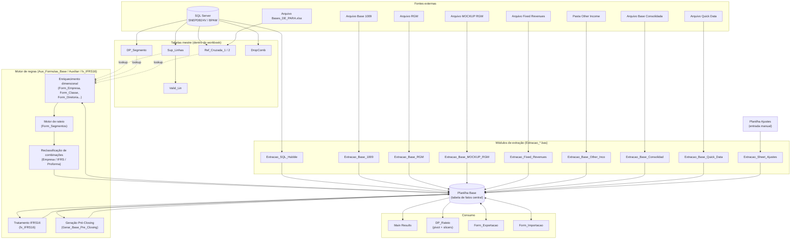

# 6. Arquitetura da Solução

## 6.1 Componentes principais

**[CONFIRMADO]**

| Componente | Papel |
|---|---|
| Workbook Excel (`.xlsb`) | Contêiner único de tudo: dados, fórmulas, código, configuração |
| 28 planilhas | Interface (Extração/Ajustes/Main Results), dados (Base), tabelas mestre de mapeamento, staging, auditoria interna |
| Projeto VBA (70 módulos, 192 procedimentos) | Toda a lógica de extração, transformação e regra de negócio |
| 3 UserForms | Importação, Exportação e uma tela de consulta de configuração (Form_Tratamento_Opcoes) |
| SQL Server (`SNEPDB24V`, bancos `BPAM`/`InfoGER`) | Fonte de dados "Hubble" e das tabelas mestre de mapeamento |
| Arquivos Excel externos (rede) | 7 fontes de dados manuais + 1 arquivo de De-Para (`Bases_DE_PARA.xlsx`) |
| Bibliotecas de referência do projeto VBA | Microsoft ActiveX Data Objects 2.8 (acesso a SQL Server), Microsoft Forms 2.0 (UserForms) — ver seção 17 |

## 6.2 Relação entre Excel, VBA, arquivos externos e demais recursos

**[CONFIRMADO/INFERIDO]** O Excel é simultaneamente a interface, o motor de processamento (via VBA) e o banco de dados (a planilha "Base" funciona como uma tabela de fatos armazenada em células). Não existe camada de aplicação, API ou banco de dados dedicado fora do próprio arquivo — a única infraestrutura externa real é o SQL Server acessado via ADODB, e os arquivos Excel de rede lidos via `Workbooks.Open`. Todo processamento acontece na máquina do usuário, dentro do processo do Excel.

## 6.3 Fluxo textual de alto nível

1. **Configuração** — usuário aponta caminhos de arquivos-fonte na aba "Extração" (gravados em células de configuração, lidos por cada macro de extração).
2. **Atualização de tabelas mestre** — pipeline fixo `Refresh_Base_Aux`: `Refresh_Base_Segmento → Refresh_Base_De_Para_Ref_Cruzadas → Refresh_Base_Suporte_Linhas → Refresh_Drop_Comb_Hubble → Extrair_Valid_Lin` (evidência: chamadas sequenciais dentro de `Refresh_Base_Aux`, em `Auxiliar.bas`).
3. **Extração** — cada fonte roda seu próprio módulo (`Extracao_*`), todas gravando na mesma planilha "Base", com o padrão comum: limpar histórico da fonte → ler/abrir arquivo ou SQL → copiar dados brutos → aplicar enriquecimento (`Form_*` de `Aux_Formulas_Base.bas`) → aplicar reclassificações de combinação.
4. **Regras contábeis condicionais** — IFRS16 (se habilitado) e geração de Pré-Closing (sob demanda) processam a Base já consolidada.
5. **Consumo** — relatórios internos ao workbook leem a Base (diretamente ou via tabela dinâmica) ou o usuário exporta/importa Fronts inteiros entre arquivos.

## 6.4 Diagrama (Mermaid)

> Se o Mermaid não for suportado no destino final (ex.: colar direto no Word), a estrutura acima pode ser transformada em um diagrama de blocos manualmente: 3 colunas (Fontes externas → Extração/Base/Motor de regras → Consumo), com o SQL Server e o arquivo de De-Para alimentando as tabelas mestre à parte, que por sua vez alimentam o motor de regras por lookup (não por cópia direta).
